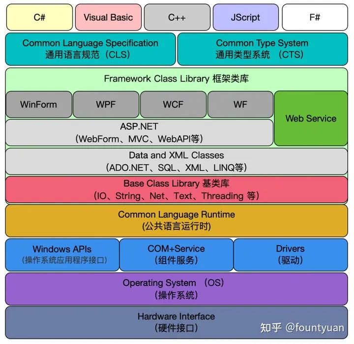
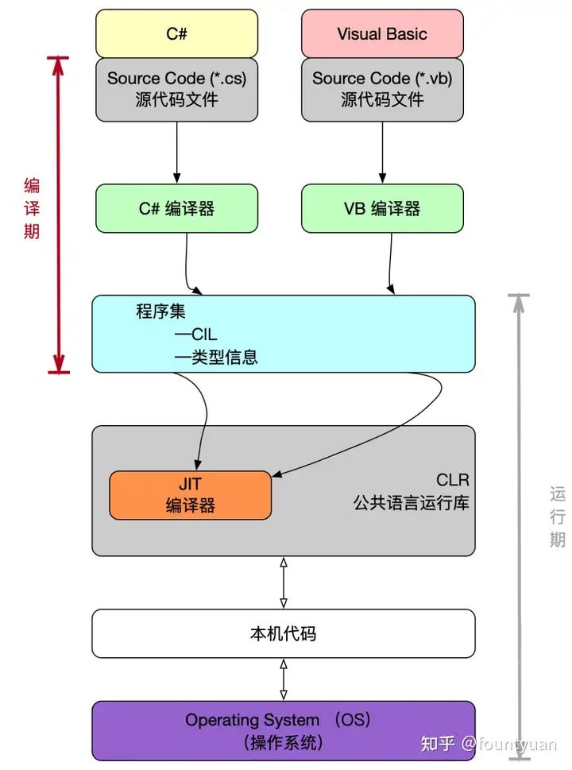
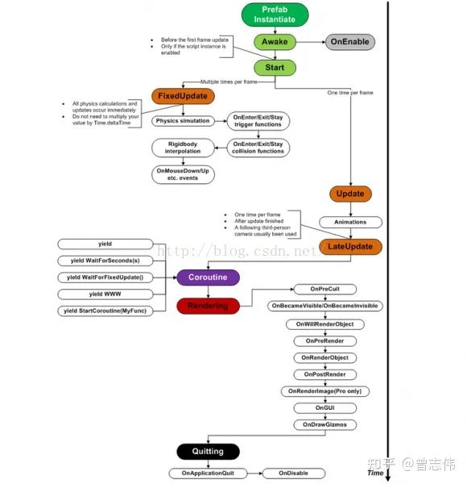
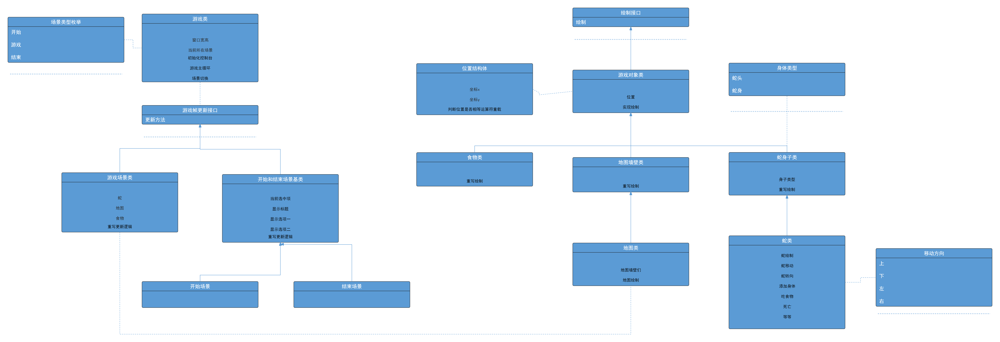
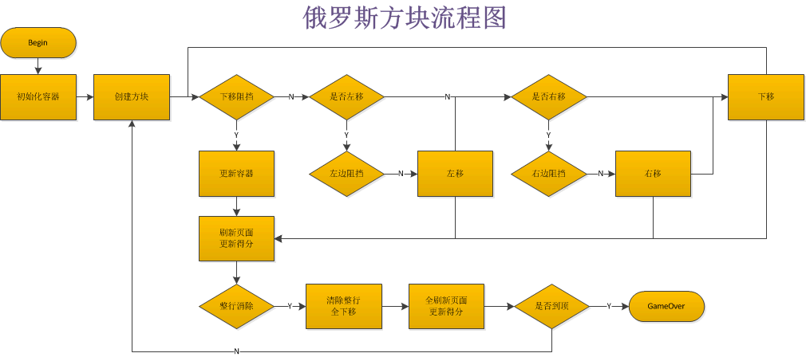

# 使用Visual Studio Code开发.NET Core看这篇就够了
来源：https://www.cnblogs.com/yilezhu/p/9926078.html


# 【教程】VSCODE中配置C#的运行环境（Windows）
来源：https://www.bilibili.com/video/BV19Y4y1G78u/?spm_id_from=333.337.search-card.all.click&vd_source=7326fe06b64e27279f7a29142c1cf0b6

注意：如果win7版本安装好.net之后 如果在cmd中输入dotnet -version 不显示版本号
  需要再安装Windows6.1-KB3063858-x64.msu 和 VC_redist.x64.exe
你可以从我提供的网盘链接里面获取：
	链接：https://pan.baidu.com/s/1kPd29olH-gB7ofQRs98oSA 
	提取码：r5df 

vscode C#配置步骤：
1.安装.net core SDK
	https://dotnet.microsoft.com/zh-cn/download
	以管理员身份运行
	安装完成打开cmd dotnet --version查看版本
2.安装vscode
	https://code.visualstudio.com/
3.安装插件C#
4.创建工程
	打开工程文件夹 - cmd
	dotnet new console
5.开始编写
	code .
6.运行代码（terminal）
	new terminal
	dotnet run

7.拓展：code runner
	安装插件
	settings
	run in terminal
	加上code-runner.executorMap
	替换csharp命令: "cd $dir && dotnet run $fileName"

# 【学习记录】VSCode：配置C#环境
来源：https://blog.csdn.net/qq_33993366/article/details/118106845

launch.json的生成方法
1. 自己手动在.vscode创建一个launch.json并配置好各个属性。
2. 第一次运行程序的时候，选择让vscode自动帮我们创建出来。(点击debug时会有一个create a launch.json的链接。)
3. VS Code命令选项板执行命令.NET:Generate Assets for Build and Debug来强制生成。

**注，第二、三项launch.json能够生成成功的前提是：工作区只有一个可启动的项目**

通过vscode的终端创建C#程序展示如何创建launch.json文件需要的一些终端命令：
路径跳转：cd
新建项目：`dotnet new console -o` 路径 (或者`dotnet new console`)
运行：`dotnet run`

# C#WindowsForm之创建窗体
来源：https://www.cnblogs.com/lovelq522/archive/2012/01/16/2324176.html

# 使用vsCode开发c#，Forms无法引用
来源：https://segmentfault.com/q/1010000041724151

两种方法：
1.新建项目时就选择 winforms 模板，这样生成的 csproj 文件中 TargetFramework 是 net6.0-windows. 你建项目时用的应该是 console 模板，可以手动改一下 csproj，注意同时要加上 UseWindowsForms. 即 csproj 里面把 <TargetFramework... 换成这两行：
```xml
//csproj文件
<TargetFramework>net6.0-windows</TargetFramework>
<UseWindowsForms>true</UseWindowsForms>
```

2.手动添加引用，用 VSCode 的话这个要稍微麻烦一点，在 PropertyGroup 后面加上
```xml
<ItemGroup>
 <ItemGroup>
    <Reference Include="System.Windows.Forms">
      <HintPath>C:\Program Files\dotnet\shared\Microsoft.WindowsDesktop.App\6.0.0\System.Windows.Forms.dll</HintPath>
    </Reference>
  </ItemGroup>
</ItemGroup>
```
版本号或路径在你机器上可能不一样。而且这样引用只引用了一个dll，应该没法使用 WinForms 的窗体之类的功能

>建立项目文件夹 -> 命令行 `dotnet new winforms`，这样新建的项目得到的结果与手动修改 csproj 文件是一样的，csproj 可以看作项目描述文件，与 编辑器/IDE 是无关的

# 温故知新，.Net Core遇见WinForms(Windows Form)客户端窗体框架，在DotNet Core大一统基础上老树发芽
来源：https://www.cnblogs.com/taylorshi/p/15175319.html

# C#中winform窗体如何嵌入cmd命令窗口
来源：https://www.cnblogs.com/xuliangxing/p/5993297.html

* 解决方法一：
自己放一个文本框，改成黑色，然后输入命令，执行时，你Process.Start cmd ,此时CMD窗口不显示，然后，将CMD的返回值，再取出来，设回文本框。

如何用这种方法实时获取cmd返回的数据，简单实现如下
```c#
private void OutPutForm_Shown(object sender, EventArgs e)
{
	 Control.CheckForIllegalCrossThreadCalls = false;
	 process = new Process();
	 p.StartInfo.FileName = "cmd.exe";
	 p.StartInfo.UseShellExecute = false;    //是否使用操作系统shell启动
	 p.StartInfo.RedirectStandardInput = true;//接受来自调用程序的输入信息
	 p.StartInfo.RedirectStandardOutput = true;//由调用程序获取输出信息
	 p.StartInfo.RedirectStandardError = true;//重定向标准错误输出
	 p.StartInfo.CreateNoWindow = true;//不显示程序窗口
	 process.OutputDataReceived += new DataReceivedEventHandler(OutputHandler);
	 process.Start();//启动程序
	 process.BeginOutputReadLine();
 }
 private void OutputHandler(object sendingProcess,DataReceivedEventArgs outLine)
 {
	 if (!String.IsNullOrEmpty(outLine.Data))
	 {
		 StringBuilder sb = new StringBuilder(this.textBox1.Text);
		 this.textBox1.Text = sb.AppendLine(outLine.Data).ToString();
		 this.textBox1.SelectionStart =this.textBox1.Text.Length;
		 this.textBox1.ScrollToCaret();
	 }
 }
```

* 解决方法二：

直接上代码
```c#
[DllImport("User32.dll ", EntryPoint = "SetParent")]
private static extern IntPtr SetParent(IntPtr hWndChild, IntPtr hWndNewParent);
[DllImport("user32.dll ", EntryPoint = "ShowWindow")]
public static extern int ShowWindow(IntPtr hwnd, int nCmdShow);
private void button3_Click(object sender, EventArgs e)
{
  Process p = new Process();
  p.StartInfo.FileName = "cmd.exe ";
  p.StartInfo.WindowStyle = System.Diagnostics.ProcessWindowStyle.Minimized;//加上这句效果更好
  p.Start();
  System.Threading.Thread.Sleep(100);//加上，100如果效果没有就继续加大

  SetParent(p.MainWindowHandle, panel1.Handle); //panel1.Handle为要显示外部程序的容器
  ShowWindow(p.MainWindowHandle, 3);
}
```

备注：记得引用 using System.Runtime.InteropServices;


# .net core迁移实践：项目文件csproj的转换
https://www.cnblogs.com/chen943354/p/13848156.html

# 在VSCode写.netCore 踩坑记一（开发环境配置）
https://www.jianshu.com/p/fe359a6ac76a


<hr>

# .NET框架
严格地说，.NET框架由CLR（Common Language Runtime，公共语言运行库）和FCL（Framework Class Libary，框架类库）两部分组成，不包括工具。FCL是BCL（基类库）的超集，还包括Windows Forms，ASP.NET，LINQ以及更多命名空间。

.NET Framework = CLR + FCL

.NET Framework = CLR + BCL + Application Model




## CLR（Common Language Runtime，公共语言类型库）
.NET框架的核心组件是CLR，它在操作系统的顶层，负责管理程序的执行。
执行环境称为CLR。CLR在运行时管理程序的执行，包括以下内容：
* 内存管理和垃圾收集。
* 代码安全验证。
* 代码执行、线程管理及异常处理。

## BCL（Base Class Libary，基类库）
.NET框架提供的一个庞大基础类库。
有时也被称为FCL（Framework Class Libary，框架类库），但严格来说，BCL并不等同于FCL，而只是FCL的一个子集，包括System，System.IO，System.Resources，System.Text等FCL中比较底层和通用的功能。
BCL包含以下的类：
* 通用基础类。文件操作、字符串操作、安全和加密。
* 集合类。列表、字典、散列表和位数组。
* 线程和同步类。
* XML类。


## CLI（Common Language Infrastructure，公共语言基础结构）
### CTS（Common Type System，公共类型系统）
定义了那些在托管代码中一定会使用的类型的特征。

### CLS（Common Language Specification，公共语言规范）
详细说明了一个.NET兼容编程语言的规则、属性和行为，其主题包括数据类型、类结构和参数传递。


# 编译与执行



# 用户定义类型
除了C# 提供的16种预定义类型，还可以创建自己的用户定义类型。有6种类型可以由用户创建：
* 类类型（class）
* 结构类型（struct）
* 数组类型（array）
* 枚举类型（enum）
* 委托类型（delegate）
* 接口类型（interface）

预定义类型只需要进行实例化；用户定义类型需要两步：声明和实例化。

# 值类型和引用类型
值类型只需要一段单独的内存，用于存储实际的数据。
引用类型需要两端内存。第一段存储实际的数据，位于堆中。第二段是一个引用，指向数据在堆中的存放位置，存放在栈中。

## 存储引用类型对象的成员
如果数据是另一个对象的成员：
* 引用类型对象的数据部分始终存放在堆里。
* 值类型对象，或引用类型数据的引用部分可以存放在堆里，也可以存放在栈里，这依赖于实际环境。

例如：假设有一个引用类型的示例，名称为MyType，它有两个成员：一个值类型成员和一个引用类型成员。它将如何存储呢？
请记住，对于一个引用类型，其实例的数据部分始终存放在堆中。既然两个成员都是对象数据的一部分，那么它们都会被存放在堆里，无论它们是值类型还是引用类型。

## C#类型的分类
|              | 值类型                                                                                 | 引用类型                          |
| ------------ | -------------------------------------------------------------------------------------- | --------------------------------- |
| 预定义类型   | sbyte、byte、short、ushort、int、uint、long、ulong、bool、float、double、char、decimal | string、object、dynamic           |
| 用户定义类型 | struct、enum                                                                           | class、interface、delegate、Array |
## 如何判断值类型和引用类型

## 语句块
命名空间不能声明变量

## 变量的生命周期

## 结构体中的值和引用
结构体中的值，栈中存储具体的内容
结构体中的引用，堆中存储引用具体的内容

## 类中的值和引用

## 数组中的存储规则
数组本身是引用类型
值类型数组，堆中房间存具体内容
引用类型数组，堆中房间存地址

## 结构体继承接口
用接口装结构体存在装箱拆箱

# 命名空间
命名空间是用来组织和重用代码的

作用：
就像是一个工具包，类就像是一件工具，都是声明在命名空间中的

使用：
同一命名空间可以在不同地方，不同文件中重复声明

不同命名空间中相互调用，需要引用命名空间或指明出处（==即使是在同一文件中==）
方法一：引用命名空间
``` c#
using 命名空间名;
```
方法二：指明出处
``` c#
命名空间.类名...
```

==不同命名空间允许有同名的类==

命名空间可以包裹命名空间
``` c#
using 命名空间.命名空间;
```

命名空间中类的访问修饰符
==命名空间中类默认为`internal`==
`internal`修饰的类只能在该程序集中使用，而同一个程序集表示同一个dll程序集或同一个exe程序集。在vs中一个项目会生成一个dll文件，因此这个dll或这个项目也就是一个程序集。

# C#基础：变量的声明、定义、初始化
https://www.cnblogs.com/zhouxiuquan/archive/2010/12/21/1912397.html

## 先分享一下关于变量声明和定义的区别：
变量的声明有两种情况:
1. 一种是需要建立存储空间的(定义、声明)。例如：int a在声明的时候就已经建立了存储空间。 
2. 另一种是不需要建立存储空间的(声明)。例如：extern int a其中变量a是在别的文件中定义的。
    
前者是"定义性声明(defining declaration)"或者称为"定义(definition)",而后者是"引用性声明(referncing declaration)"。从广义的角度来讲声明中包含着定义，但是并非所有的声明都是定义，例如:int a它既是声明，同时又是定义。然而对于extern a来讲它只是声明不是定义。==一般的情况下我们常常这样叙述，把建立空间的声明称之为"定义"，而把不需要建立存储空间称之为"声明"。==很明显我们在这里指的声明是范围比较窄的，也就是说非定义性质的声明。

# 结构体
结构体声明的变量 不能直接初始化
变量类型 可以写任意类型 包括结构体，但不能是自己的结构体

## C#中的结构体要使用new来实例化吗?
来源：https://www.cnblogs.com/fps2tao/p/14692302.html

声明结构的默认（无参数）构造函数是错误的。总是提供默认构造函数以将结构成员初始化为它们的默认值。在结构中初始化实例字段也是错误的。

如果使用 new 运算符创建结构对象，则会创建该结构对象，并调用适当的构造函数。与类不同，结构的实例化可以不使用 new 运算符。如果不使用 new，则在初始化所有字段之前，字段都保持未赋值状态且对象不可用。

结构类型使用new不会分配托管堆分配内存而是调用构造函数初始化字段。结构的构造函数要么是有参数的，不可能是无参数，应为无参数是系统自己隐式添加的，就算有另外的构造函数，如果你显示的声明一个无参数的构造函数在结构里，将导致编译错误。

结构体如果不用new初始化，也可以，但是在其使用前必须手动初始化他的每一个成员，否则编译器将报错。用new初始化，可自动将其中的每一个成员都置为零值。

>struct属于值类型，可以不用new，如果不new，结构体内的值就都是未赋值状态，需要在使用之前赋值，不然编译器会报错。若new了，结构体会调用无参构造函数，会初始化内部的值，比如int就会初始化为0，现在使用编译器就不会报错了。

# C# 结构体：定义、示例、最佳实践和陷阱
来源：https://www.cnblogs.com/chenlight/p/16063780.html

# 选择结构还是类？C#中的最佳实践与性能优化指南
来源：https://www.cnblogs.com/hanbing81868164/p/18123033

概述：在C#中，选择使用结构（struct）而非类（class）取决于数据大小、不可变性和性能需求。结构适用于小型、不可变的数据对象，具有轻量级和高性能的优势。然而，对于复杂对象和需要继承的情况，应选择类。以下是一个简单的结构示例，演示了结构在栈上分配内存和不可变性的特性。在程序设计中，根据实际需求谨慎选择结构或类，以优化代码性能。

在C#中，结构（struct）和类（class）是两种用于创建自定义数据类型的方式。选择使用结构还是类取决于各种因素，包括性能、内存使用、语义等。下面详细讲解什么时候应该在C#中使用结构而不是类，并提供相关的方法、步骤和实例源代码。

## 何时使用结构（Struct）
* **小型数据类型**
当数据类型表示的对象较小且简单时，使用结构可能更合适。结构是值类型，通常在栈上分配内存，相比类更轻量级。

* **不可变性**
如果你的类型是不可变的，即其状态在创建后不会发生变化，考虑使用结构。结构天生就是值类型，不支持继承，更容易保持不可变性。

* **性能要求**
在某些情况下，结构可能比类更高效。由于结构是值类型，直接包含数据，而不需要引用对象。这有助于减少堆上的内存分配，提高性能。

## 注意事项
* **不适合复杂对象**
结构适合表示简单的数据结构，对于复杂的对象，可能会导致性能下降，因为结构在传递时是按值传递。

* **避免装箱拆箱**
尽量避免在结构和引用类型之间频繁进行装箱和拆箱操作，以免影响性能。

* **不支持继承**
结构不支持继承，如果需要继承和多态性，应该使用类而不是结构。

使用结构还是类取决于具体的应用场景和需求。在设计程序时，考虑数据的大小、不可变性、性能等因素，选择适当的类型来实现程序的功能。

# 类
## 访问修饰符
* private：默认
* public
* protected
* internal （内部的）
* protected internal （受保护内部的）


## 字段
**与C和C++ 不同，C#在类型的外部不能声明全局变量（也就是变量或字段）。所有的字段都属于类型，而且必须在类型声明内部声明。 **

#### 1.显式和隐式字段初始化
* 字段初始化语句是字段声明的一部分，由一个等号后面跟着一个求值表达式组成。
* 初始化值必须是编译时可确定的。
* 如果没有初始化语句，字段的值会被编译器设为默认值，默认值由字段的类型决定。
每种值类型的默认值都是0，bool类型的默认值是false，引用类型的默认值是null。

```c#
class MyClass
{
	int F1 = 13;
	int F2;//默认值0
}
```

#### 2.声明多个字段
```c#
class MyClass
{
	int F1=13,F2;
}
```

## 方法
**与C和C++ 不同，C#中没有全局函数（也就是方法或函数）声明在类型声明的外部。同样，和C和C++ 不同，C#方法没有默认的返回类型，所有方法必须包含返回类型或void。**

### 局部变量
#### 嵌套块中的局部变量
**在C和C++ 中，可以先声明一个局部变量，然后在嵌套块中声明另一个名称相同的局部变量。在内部范围，内部名称掩盖了外部名称。然而，在C#中不管嵌套级别如何，都不能在第一个名称的有效范围内声明另一个同名的局部变量。**


### 局部常量
```c#
const int F1=10;
```

* 在类型之前增加关键字const；
* 必须有初始化语句。初始化值必须在编译期决定，通常是一个预定义简单类型或由其组成的表达式。它还可以是null引用，但它不能是某对象的引用，因为对象的引用是在运行时决定的。

**关键字const不是修饰符，而是核心声明的一部分。它必须直接放在类型的前面。**


### 局部函数


### 值参数
当使用值参数时，通过将实参的值复制到形参的方式把数据传递给方法。方法被调用时，系统执行如下操作：
* 在栈中为形参分配空间。
* 将实参的值复制给形参。

**不要把值类型和值参数混淆，它们是完全不同的概念。值参数是把实参的值复制给形参。**

```c#
public class MyClass
{
	public int val = 20;
}

class Program
{
	static void MyMethod(MyClass f1,int f2)
	{
		f1.val+=5;
		f2+=5;
		Console.WriteLine($"f1.val:{f1.val}, f2:{f2}");
	}
	
	static void Main()
	{
		MyClass a1 = new MyClass();
		int a2 = 10;
		
		MyMethod(a1, a2);
		Console.WriteLine($"a1.val:{a1.val},a2:{a2}");
	}
}

//f1.val:25,f2:15
//a1.val:25,a2:10

```
在方法开始时，系统在栈中为形参分配空间，并从实参复制值。
因为a1是引用类型，所以引用被复制，结果实参和形参都引用堆中的同一个对象。

### 引用参数
* 使用引用参数时，必须在方法的声明和调用中都使用`ref`修饰符。
* 实参必须是变量，在用作实参前必须被赋值。如果是引用类型变量，可以赋值为一个引用或null。

引用参数具有以下特征：
* 不会在栈上为形参分配内存。
* 形参的参数名将作为实参变量的别名，指向相同的内存位置。

**记住要在方法的声明和调用上都使用ref关键字。**


### 引用类型作为值参数和引用参数
* 将引用类型对象作为值参数传递
如果在方法内创建一个新对象并赋值给形参，将切断形参与实参之间的关联，并且在方法调用结束后，新对象将不复存在。

* 将引用类型对象作为引用参数传递
如果在方法内创建一个新对象并赋值给形参，在方法结束后该对象依然存在，并且是实参所引用的值。

```c#
class MyClass
{
	public int val = 20;
}

class Progress
{
	static void MyMethod(MyClass f1)
	{
		f1.val = 50;
		Console.WriteLine($"after member assignment f1.val={f1.val}");
		f1 = new MyClass();
		Console.WriteLine($"after new object f1.val={f1.val}");
	}
	
	static void Main()
	{
		MyClass a1 = new MyClass();
		Console.WriteLine($"before MyClass a1.val={a1.val}");
		MyMethod(a1);
		Console.WriteLine($"after MyClass a1.val={a1.val}");
	}
}

/*
before MyClass a1.val=20
after member assignment f1.val=50
after new object f1.val=20
after MyClass a1.val=50
*/
```
当方法分配新的对象并赋值给形参时，方法外部的实参仍指向原始对象，而形参指向的是新对象。
在方法调用之后，实参指向原始对象，形参和新对象都会消失。


```c#
class MyClass
{
	public int val = 20;
}

class Progress
{
	static void MyMethod(ref MyClass f1)
	{
		f1.val = 50;
		Console.WriteLine($"after member assignment f1.val={f1.val}");
		f1 = new MyClass();
		Console.WriteLine($"after new object f1.val={f1.val}");
	}
	
	static void Main()
	{
		MyClass a1 = new MyClass();
		Console.WriteLine($"before MyClass a1.val={a1.val}");
		MyMethod(ref a1);
		Console.WriteLine($"after MyClass a1.val={a1.val}");
	}
}

/*
before MyClass a1.val=20
after member assignment f1.val=50
after new object f1.val=20
after MyClass a1.val=20
*/
```
当方法创建新的对象并赋值给形参时，形参和实参的引用都指向该新对象。
在方法结束后，实参指向在方法内创建的新对象。


### 输出参数

## 成员属性
1. 用于保护成员变量
2. 为成员变量的获取和赋值添加逻辑处理
3. 解决public、protected、private的局限性
	属性可以让成员变量在外部 只能修改不能获取 或 只能获取不能修改
	
成员属性中get、set前可以加访问修饰符
注意：
1. 默认不加，会使用属性声明时的访问权限
2. 加的访问修饰符要低于属性的访问权限
3. 不能让get和set的访问权都低于属性的访问权限

get、set可以只有一个
注意：
只有一个时，没必要在get/set前加访问修饰符

自动属性
作用：外部能获取而不能赋值的成员变量
如果类中有一个成员变量是只希望外部能获取而不能赋值的，有没有什么特殊逻辑处理，则可以直接使用自动属性
```c#
public float Height
{
	get;
	private set;
}
```

## 索引器
让对象可以像数组一样通过索引访问其中元素，使程序看起来更直观更容易编写

访问修饰符 返回类型 this[参数列表]
{
	get;
	set;
}

索引器可以重载

```c#
class Person
{
	private string name_;
	private int age_;
	private Person[] friends_;
	private int[,] array_;
	
	public Person this[int index]
	{
		get
		{
			return friends_[index];
		}
		
		set
		{
			friends_[index]=value;
		}
	}
	
	public int this[int i,int j]
	{
		get
		{
			return array_[i,j];
		}
		
		set
		{
			array[i,j]=value;
		}
	}
	
	public string this[string str]
	{
		get
		{
			switch(str)
			{
			case "name":
				return this.name;
				break;
			}
			return "";
		}
	}
}

//调用
Person p = new Person();
p[0] = new Person();
```

## 静态成员
注意：
程序不是无中生有的
我们要使用的对象，变量，函数都是要在内存中分配内存空间的
之所以要实例化对象，目的就是分配内存空间，在程序中产生一个抽象的对象

静态成员特点：
程序开始运行时，就会分配内存空间，所以可以直接使用
静态成员和程序同生共死
只要使用了它，直到程序结束时内存空间才会被释放

初始化：如果不显式初始化，那么将被隐式初始化为0。

>严格地说在C#中没有全局函数和全局变量的概念。但是，可以通过类的静态成员（静态属性，静态方法，静态字段）来“模拟”全局变量和全局函数。

### 常量和静态变量的区别
常量是特殊的静态变量
1. 相同点：
	都可以通过 `类名.常量名/静态变量名` 来使用

2. 不同点：
	const 必须被初始化，不能被修改
	const 只能修饰变量
	const 只能写在访问修饰符后

## 拓展方法
为现有非静态的变量类型添加新方法

作用：
1. 提升程序拓展性
2. 不需要再对象中重新写方法
3. 不需要继承来添加方法
4. 为别人封装的类型写额外的方法

特点
1. 一定是写在静态类中
2. 一定是个静态函数
3. 第一个参数为拓展目标
4. 第一个参数用this修饰

访问修饰符 static 返回值 函数名(this 拓展类名 参数名, 参数...)
{

}

```c#
static class Tools
{
	public static void SpeakValue(this int value)
	{
		Console.Write("SpeakValue"+value);
	}
}

//调用
int i=10;
i.SpeakValue();
```

==如果拓展方法和拓展类名的方法重名，参数也一样，则会调用拓展类名的方法==。

## 运算符重载
关键字：operator

特点：
1. ==一定是一个公共的静态方法==
2. 返回值写在operator前
3. 逻辑处理自定义

注意：
1. 条件运算符需要成对实现
2. 一个符号可以多吃重载
3. 不能使用ref和out
4. C# 不允许重载=运算符，但如果重载例如+运算符，编译器会自动使用+运算符的重载来执行+=运算符的操作。

``` c#
class Point
{
	int x;
	int y;
	
	public static Point operator +(Point p1,point p2)
	{
		Point p = new Point();
		p.x = p1.x + p2.x;
		p.y = p2.x + p2.y;
		return p;
	}
}

//调用
Point p1 = new Point(1 ,1);
Point p2 = new Point(2, 2);
Point p3 = p1 + p2;
```

### 可重载的运算符和不可重载的运算符
| 运算符                                | 描述                                         |
| ------------------------------------- | -------------------------------------------- |
| +, -, !, ~, ++, --                    | 这些一元运算符只有一个操作数，且可以被重载。 |
| +, -, *, /, %                         | 这些二元运算符带有两个操作数，且可以被重载。 |
| ==, !=, <, >, <=, >=                  | 这些比较运算符可以被重载。                   |
| &&, ||                                | 这些条件逻辑运算符不能被直接重载。           |
| +=, -=, *=, /=, %=                    | 这些赋值运算符不能被重载。                   |
| =, ., ?:, ->, new, is, sizeof, typeof | 这些运算符不能被重载。                       |


### 可重载的运算符
单目运算法：+ - ! ~ ++ --
双目运算符：+ - * / %
比较运算符：== != < > <= >=

### 不可重载的运算符
逻辑与 &&  逻辑或 ||
索引符 []
强转运算符 ()
特殊运算符 
点 .
三目运算符 ?:
赋值符号 =
+= -= *= /= %=

# 静态类
特点：
	只能包含静态成员
	不能被实例化

作用：
	将常用的静态成员写在静态类中，方便管理
	静态类不能被实例化，更能提现工具类的唯一性

## 静态构造函数
特点：
不能使用访问修饰符
不能有参数
只会调用一次（调用成员时自动调用）

作用：
初始化静态变量

使用：
1. 静态类中的静态构造函数
2. 普通类中的静态构造函数
   不是重载，可以同时有无参构造函数和静态构造函数
   第一次实例化时自动调用


# 继承
特点：
1. 单根性 子类只能有一个父类
2. 传递性 子类可以继承父类的父类

## 父类的构造函数
关键字 `base()`
==父类的无参构造函数很重要==
子类的构造函数会默认调用父类的无参构造函数

覆写（overwrite）
关键字 `new`
在子类中用 new 关键字修饰定义的与父类中同名的方法，也称为覆盖，覆盖不会改变父类方法的功能。

重写（override）
关键字 `override`

## 多态
让同一类型的对象执行相同行为时有不同的表现

## 编译时多态
函数重载

## 运行时多态
抽象函数、接口、vob：virtual、override、base
### vob：虚函数virtual、重写override、base
``` c#
class Father
{
	public virtual void Speak()
	{
		Console.Write("Father Speak");
	}
}

class Son
{
	public override void Speak()
	{
		base.Speak();
		Console.Write("Son Speak");
	}
}

//调用
Father f = new Son();
f.Speak();//Son Speak

```


# 里氏替换原则
任何父类出现的地方，子类都可以替代

重点：
语法表现——父类容器装子类对象，因为子类对象包含了父类的所有内容

作用：
方便进行对象存储和管理

父类类型名 变量名 = new 子类类型名();

## is
判断一个对象是否是指定类对象
返回值：bool

## as
将一个对象转换为指定类对象
返回值：成功返回指定类型对象，失败返回null

``` c#
GameOejct player = new Player();
if( player is Player)
{
	Player p = player as Player;
	...
}
```

# 万物之父和装箱拆箱
`object`是所有类型的基类

作用：
1. 可以用里氏替换原则，用object容器装所有对象
2. 可以用来表示不确定类型，作为函数参数类型

## 使用
### 引用类型
``` c#
object o = new Son();
if( o is Son)
{
	Son s = o as Son;
}
```

### 值类型
``` c#
object o = 1;

//强制转换
int i = (int)o;
```

### 特殊的string类型
``` c#
object o = "123";
string str = o as string;
string str2 = o.ToString();
```

### 数组
``` c#
object o = new int[5];
int[] arr = o as int[];
int[] arr2 = (int[])o;
```

## 装箱和拆箱
发生条件：
装箱：用object存入值类型
拆箱：把object转为值类型

好处：
不确定类型时可以方便参数的存储和传递

坏处：
存在内存迁移，增加内存消耗

### 装箱
把值类型用引用类型存储
栈内存会迁移到堆内存中

### 拆箱
把引用类型存储的值类型取出来
堆内存会迁移到栈内存中

## 万物之父中的方法
### object中的静态方法
#### bool Equals(object a,object b)
判断两个对象是否相等。
最终的判断权，交给左侧对象的Equals方法，不管值类型还是引用类型都会按照左侧对象Equals方法的规则来进行比较
==可以用来比较值类型==

#### bool ReferenceEquals(object a,object b)
比较两个对象是否是相同的引用，主要是用来比较引用类型的对象。
值类型对象始终是返回false
==不可以用来比较值类型==

### object中的成员方法
#### Type GetType()
==该方法在反射相关知识点中是非常重要的方法==，通过Type结合反射相关知识点可以做很多关于对象的操作
主要作用是获取对象运行时的Type

#### Object MemberwiseClone()
访问权限为`protected`
用于获取对象的==浅拷贝对象==，意思是会返回一个新对象
==但是新对象中的**引用类型变量**会和老对象的一致，值类型对象则不一样==

### object中的虚方法
#### bool Equals(Object a)
比较两者是否为同一个引用，即相当于ReferenceEquals
但微软在所有值类型的基类System.ValueType中重写了该方法，用来比较值相等。
我们也可以自己重写该方法，定义自己的比较相等的规则

#### int GetHashCode()
作用是获取对象的哈希码
（一种通过算法算出的，表示对象的唯一编码，不同对象的哈希码有可能一样，具体值根据哈希算法决定）
我们可以通过重写该函数来自己定义对象的哈希码算法
正常情况下使用极少，基本不用

#### string ToString()
该方法用于返回当前对象代表的字符串
我们可以重写该方法，定义自己的对象转字符串规则
该方法非常常用，当我们调用打印方法时，默认使用的就是对象的ToString方法后打印出来的内容。

# 密封类
使用关键字 sealed 修饰的类

作用：
让类无法再被继承

# 抽象类
关键字 `abstract`

特点：
1. 不能被实例化
2. 可以包含抽象方法
3. 继承抽象类必须重新其抽象方法

可以用里氏替换原则，抽象类容器装子类对象

## 抽象方法
又称 纯虚方法

特点：
1. 只能在抽象类中声明
2. 没有方法体
3. 不能是私有的
4. 继承后必须实现，用override重写

# 接口
接口是行为的抽象规范
也是一种自定义类型
关键字 `interface`

接口的声明规范：
1. 不包含成员变量
2. 只包含方法、属性、索引器、事件
3. 成员不能被实现
4. 成员可以不用写访问修饰符，默认是`public`，不能是私有的
5. 接口不能继承类，但可以继承另一个接口，**且不需要实现**

接口的使用规范：
1. 类可以继承多个接口
2. 类继承接口后，必须实现接口中的所有成员

特点：
1. 和类的声明类似
2. 接口是用来继承的
3. 接口不能被实例化，但是可以作为容器存储对象
4. 类可以同时继承另一个类和多个接口
5. 类实现了接口的成员方法，可以再加`virtual`修饰符

interface 接口名
{

}

``` c#
interface ICreature
{
	void Move();
}

interface IAnimal
{
	void Move();
}

class Dog: ICreature, IAnimal
{
	//实现同名函数
	public void ICreature.Move()
	{
		
	}
	public void IAnimal.Move()
	{
		
	}
	
	//也可以写同名的函数
	public void Move()
	{
	
	}
}
```

# 数组

# 多维数组
`类型[,] 变量名`

C# 中二维数组的概念不同于 C/C++ 、java 等语言中的二维数组，C# 中的二维数组更像是一个矩阵：
```c#
int [,] a = new int [3,4] {
 {0, 1, 2, 3} ,   /*  初始化索引号为 0 的行 */
 {4, 5, 6, 7} ,   /*  初始化索引号为 1 的行 */
 {8, 9, 10, 11}   /*  初始化索引号为 2 的行 */
};
```

用于声明**等长**的二维数组

# 交错数组
`类型[][] 变量名`

交错数组是数组的数组。

交错数组是**一维数组**。

可以声明**等长**二维数组，也可以声明**不等长**二维数组
```c#
 //每行均是一个新数组 长度任意
int[][] p = new int[3][] 
{ 
	new int[] { 1, 2 ,4},
	new int[] { 3 }, 
	new int[] { 1, 4 }
};

```

获取行长度
`Console.WriteLine(p.Length);`

获取列长度
`Console.WriteLine(p[0].Length);//获取第0行 列的长度`

# C#二维数组的定义，初始化（重在理解两者的区别）
来源：https://blog.csdn.net/my_heart_/article/details/53736246

```c#
using System;
using System.Collections.Generic;
using System.Linq;
using System.Text;
using System.Threading.Tasks;
using System.Collections;
 
namespace 二维数组
{
    class Program
    {
        static void Main(string[] args)
        {
       
            //二维数组：
            //规则二维数组的定义和初始化
            int[,] Arr = new int[2, 5] { { 1, 2, 3, 5, 6 }, { 1, 2, 3, 4, 5 } };
            Console.WriteLine("规则二维数组的输出：");
            for (int i = 0; i < 2; ++i)
            {
                for (int j = 0; j < 5; ++j)
                {
                    Console.Write(Convert.ToString(Arr[i,j]) + " ");
                }
                Console.WriteLine();
            }
            Console.WriteLine("----------------");
            //不规则二维数组
            int [][] arr = new int [3][ ];  //表示含有三个一维数组的数组
            arr[0] = new int[5]{1,2,3,4,5};
            arr[1] = new int [2]{0,1};
            arr[2] = new int[0] { };
            Console.WriteLine("输出方法一：");
            for (int i = 0; i < 2; ++i)
            {
                for (int j = 0; j < 5; ++j)
                {
                    Console.Write(Convert.ToString(Arr[i, j]) + " ");
                }
                Console.WriteLine();
            }
            Console.WriteLine();
            Console.WriteLine("输出方法二：");
            for (int ii = 0; ii < arr.Length; ++ii)// arr.Length是 3可以看出arr是包含三个一维数组的数组
            {
                foreach (int j in arr[ii])
                {
                    Console.Write(j+ " ");
                }
                Console.WriteLine();
            }
            Console.ReadKey();
 
 
        }
    }
}
```

从上面的C#代码可以看出，C#有两种不同的定义二维数组的方式，当然两者的区分上面已经说得很清楚了，不懂的话copy下来运行一遍，对比一下。
还有C++ 在定义二维数组的时候，当然是必须写出 数组的'列数'，而C#的不规则二维数组可以理解为 保存一维数组的数组

# C#数组、多维数组、交错数组以及与C++ 中数组的不同
来源：https://blog.csdn.net/SwordArcher/article/details/102950646

# C# 多维数组 交错数组的区别，即 [ , ] 与 [ ][ ]的区别
https://www.cnblogs.com/whuanle/p/9936047.html

# 【笔记】C#一维数组、多维数组和交错数组的区别
https://blog.csdn.net/weixin_61361738/article/details/129085820

# 【c#笔记】可变长参数（params）
来源：https://www.cnblogs.com/straycats/p/14646210.html

## params是什么
params是c#中用来标记可变长参数的关键字。

## 什么时候用params
用于参数个数不确定、但类型相同的函数形参。

## 怎么用
比如下面的例子：

首先定义一个Test方法，形参arrs用params关键字来标记这是一个可变长参数。
```c#
private void Test(params string[] arrs)
{
   if (null == arrs || 0 == arrs.Length)
   {
      Console.WriteLine("arrs is null or empty");
      return;
   }

   foreach (var arr in arrs)
   {
       Console.WriteLine($"arr is {arr}");
   }
}
```

## 限制条件
1. **params只能标记一维数组；**
2. **在方法声明中，只允许有一个params关键字；**
3. **在方法声明中，被params关键字标记的参数之后不允许有其他参数；**
当然在params之前可以定义其他参数，例如
```c#
public void Test(int index, params string[] arrs)
{
  // todo
}
```
4. **不能与ref、out修饰符一起使用；**

## FAQ
### 1.没有二义性的场景。

当类中有下面2个方法的定义。

```c#
public void Test(string s1, string s2)
{
  // todo
}

public void Test(params string[] arrs)
{
  // todo
}
```

此时调用函数Test：
```c#
// 调用的是Test(string s1, string s2)
Test("123", "abc");
```

该场景没有二义性，编译器会首先匹配非可变长参数的方法。==强烈建议在业务代码中不要这样定义，而是将2个函数合并成1个==。

### 2.有二义性的场景。

当类中有下面2个方法的定义。

```c#
public void Test(params string[] arrs)
{
  // todo
}

public void Test(params int[] arrs)
{
  // todo
}
```
 

此时调用函数Test：
```c#
// 编译器报错
Test();
```

该场景有二义性，编译器无法判断无参时该选择哪个函数调用。


# 深入理解C# 静态类与非静态类、静态成员的区别
来源：https://www.cnblogs.com/linybo/p/13299604.html

## 静态类
静态类与非静态类的重要区别在于静态类不能实例化，也就是说，不能使用 new 关键字创建静态类类型的变量。在声明一个类时使用static关键字，具有两个方面的意义：首先，它防止程序员写代码来实例化该静态类；其次，它防止在类的内部声明任何实例字段或方法。

静态类是自C# 2.0才引入的，C# 1.0不支持静态类声明。程序员必须声明一个私有构造器。私有构造器禁止开发者在类的范围之外实例化类的实例。使用私有构造器的效果与使用静态类的效果非常相似。

两者的区别：
私有构造器方式仍然可以从类的内部对类进行实例化，而静态类禁止从任何地方实例化类，其中包括从类自身内部。静态类和使用私有构造器的另一个区别在于，在 使用私有构造器的类中，是允许有实例成员的，而C# 2.0和更高版本的编译器不允许静态类有任何实例成员。使用静态类的优点在于，编译器能够执行检查以确保不致偶然地添加实例成员，编译器将保证不会创建此 类的实例。静态类的另一个特征在于，C#编译器会自动把它标记为sealed。这个关键字将类指定为不可扩展；换言之，不能从它派生出其他类。

静态类的主要特性：
1：仅包含静态成员。
2：无法实例化。
3：是密封的。
4：不能包含实例构造函数。

### 静态成员
1：非静态类可以包含静态的方法、字段、属性或事件；
2：无论对一个类创建多少个实例，它的静态成员都只有一个副本；
3：静态方法和属性不能访问其包含类型中的非静态字段和事件，并且不能访问任何对象的实例变量；
4：静态方法只能被重载，而不能被重写，因为静态方法不属于类的实例成员；
5：虽然字段不能声明为 static const，但 const 字段的行为在本质上是静态的。这样的字段属于类，不属于类的实例。因此，可以同对待静态字段一样使用 ClassName.MemberName 表示法来访问 const 字段；
6：C# 不支持静态局部变量(在方法内部定义静态变量)。

### 静态构造函数
1：静态类可以有静态构造函数，静态构造函数不可继承；
2：静态构造函数可以用于静态类，也可用于非静态类；
3：静态构造函数无访问修饰符、无参数，只有一个 static 标志；
4：==静态构造函数不可被直接调用，当创建类实例或引用任何静态成员之前，静态构造函数被自动执行，并且只执行一次。==

注意：
1：==静态类在内存中是一直有位置的；==
2：非静态类在实例化后是在内存中是独立的，它的变量不会重复，在使用后会及时销毁，所以不会出现未知的错误。在C#中静态成员是比较敏感的东西，在不是十分确认的情况下不要使用；
3：建议更多地使用一般类(非静态类)。

使用选择：
当定义的类不需要进行实例化时，我们使用静态类；如果需要实例化对象，需要继承等特性时，应该使用非静态类，并且将统一使用的变量和方法设为静态的，那么所有实例对象都能访问。

### C# 静态成员和方法的学习小结

数据成员：
数据成员可以分静态变量、实例变量两种.
静态成员：静态成员变量是和类相关联的,可以作为类中"共"有的变量(是一个共性的表现),他不依赖特定对象的存在,访问的时候通过类名加点操作符加变量名来访问.

实例成员：实例成员变量是和对象相关联的,访问实例成员变量依赖于实例的存在.==当多个实例对象存在时，每个对象的每个数据成员都有自己独立的一套存储空间。==

函数成员：
方法可以主要分为静态方法,实例方法

静态方法：静态方法是不属于特定对象的方法，静态方法可以访问静态成员变量，静态方法不可以直接访问实例变量，可以在实例函数调用的情况下，实例变 量做为参数传给静态方法。静态方法也不能直接调用实例方法，可以间接调用，首先要创建一个类的实例，然后通过这一特定对象来调用静态方法。

实例方法：一个实例方法的执行与特定对象关联，他的执行需要一个对象存在。实例方法可以直接访问静态变量和实例变量，实例方法可以直接访问实例方 法、和静态方法，静态方法的访问方式为类名加点操作符加变量名。==当多个实例对象存在时，内存中并不是存在每个特定的实例方法的拷贝，而是，相同类的所有对象都共享每个实例方法的一个拷贝（实例方法只占用“一套”空间）。==
 
如果将类中的某个成员声明为static，则称该成员为静态成员。一般来说，静态成员是属于类所有的，而非静态成员则属于类的实例的。每创建一个类的实 例，都在内存中为非静态成员开辟一片区域。而类的静态成员为类所有，为这个类的所有实例共享。==无论这个类创建了多少副本，一个静态成员在内存中只占有一块 区域。==

C#类中静态成员变量的生命周期问题，就是什么时候创建，什么时候销毁已声明元素的“生存期”是元素可供使用的时间周期。变量是唯一具有生存期的元素；为此，编译器将过程参数和函数返回值视为变量的特殊情况。变量的生存期表示它可以保留值的时间周期。在生存期内变量的值可以更改，但变量总是保留某些值。

### 不同的生存期

在模块级声明的变量通常在应用程序的整个运行期间都存在。在类或结构中声明的非共享变量作为声明它的类或结构的每个实例的单独副本存在；每个这样的变量都具有与它的实例相同的生存期。==但是，Shared 变量仅有一个生存期，即应用程序运行所持续的全部时间。==

用 Dim 声明的局部变量仅当声明它们的过程正在执行时存在。这同样适用于过程的参数和任何函数返回值。但是，如果该过程调用其他过程，则局部变量在被调用过程运行期间保留它们的值。

### 生存期的开始

当执行到声明局部变量的过程时，局部变量的生存期开始。过程一开始执行，每个局部变量即被初始化为其数据类型的默认值。数字变量（包括 Byte 和 Char）被初始化为 0，Date 变量初始化为公元 1 年的 1 月 1 日零时，Boolean 变量初始化为 False，引用类型变量（包括字符串、数组和 Object）初始化为 Nothing。

结构变量的每个成员被视为单独的变量初始化。同样，数组变量的每个元素也单独初始化。

如果变量是用初始值设定项声明的，则在执行变量的声明语句时，将给该变量分配指定的值，如下面的示例所示：

`Dim X As Double = 18.973 ' X had previously been initialized to 0.`

在过程的内部块中声明的变量在进入该过程时初始化为其默认值。不论该块是否曾执行过，这些初始化都会生效。

### 生存期的结束

当过程终止时，不再保留该过程的局部变量值，并回收局部元素所使用的内存。下次执行该过程时，将重新创建它的所有局部元素并初始化局部变量。

当类或结构的实例终止时，它的非共享变量丢失它们的值。类或结构的每个新实例都创建它的所有非共享元素并初始化非共享变量。==Shared 元素被一直保留到应用程序停止运行时。==

### 生存期的扩展

如果局部变量是用 Static 关键字声明的，则它的生存期比声明它的过程的执行时间长。如果该过程在某模块内，则只要应用程序继续运行，static 变量就一直存在。

如果 static 变量是在类的内部过程中声明的，则该变量的生存期取决于此过程是否共享。如果此过程已用 Shared 关键字声明，则变量的生存期将一直延续到应用程序终止时为止。如果此过程为非共享，则其 static 变量为类的实例成员，并且其生存期与类实例的生存期相同。

在下面的示例中，RunningTotal 函数通过将新值添加到存储在静态变量 ApplesSold 中的以前值的合计来计算流量合计：
 

复制代码 代码示例:
```c#
Function RunningTotal(ByVal Num As Integer) As Integer
Static ApplesSold As Integer
ApplesSold = ApplesSold + Num
Return ApplesSold ' ApplesSold keeps its current value.
End Function
```
 
如果没有使用 Static 就已声明了 ApplesSold，则在函数调用期间将不保留以前累计的值，并且函数只返回上次用来调用它的相同值。

在模块级声明 ApplesSold 可产生相同的生存期。但是，如果这样更改变量的范围，此过程将不再拥有对该变量的独占访问权。由于其他过程可以访问该变量并更改它的值，因此流量合计是不可靠的，并且代码可能会更难维护。

静态成员在第一次被访问之前并且在任何静态构造函数（如调用的话）之前初始化。若要访问静态类成员，应使用类名而不是变量名来指定该成员的位置。


# 垃圾回收机制
来源：唐老狮

垃圾回收的过程是在遍历堆（Heap）上动态分配的所有对象

所谓的垃圾就是没有被任何变量、对象引用的内容

注意：
GC只负责堆（Heap）内存的垃圾回收
引用类型都是存在堆（Heap）中的，所以它的分配和释放都通过垃圾回收机制来管理

栈（Stack）上的内存是由系统自动管理的
值类型是在栈（Stack）中分配内存的，它们有自己的生命周期，会自动分配和释放，不用对他们进行管理

## 垃圾回收有很多算法：
* 引用计数（Reference Countin）
* 标记清除（Mark Sweep）
* 标记整理（Mark Compact）
* 复制集合（Copy Collection）

## 垃圾回收大概原理
将堆（Heap）内存分为：0代内存、1代内存、2代内存

代的概念：
代是垃圾回收机制使用的一种算法（分代算法）
新分配的对象都会被配置在第0代内存中
每次分配都可能会进行垃圾回收以释放内存（0代内存满时）

在一次内存回收过程开始时，垃圾回收器会认为堆中全是垃圾，会进行以下两步：
1. **标记对象**
	从根（静态字段、方法参数）开始检查引用对象，标记后的为可达对象，未标记的为不可达对象
	不可达对象即为垃圾

2. **搬迁对象压缩**
	（挂起执行托管代码线程）
	释放未标记对象
	搬迁可达对象（将0代内存的可达对象搬迁到1代内存），修改引用地址（整理）

1代内存满时，会将0代内存和1代内存一起释放，将可达对象搬迁到2代内存。
2代内存保存的对象最后会非常多
0代内存和1代内存读取速度会比2代内存快

2代内存满时，会将0代内存、1代内存和2代内存一起释放

新的对象总是在0代内存
老的对象总是在2代内存

大对象总被认为是2代内存，目的是减少性能损耗，提高性能
不会对大对象进行搬迁压缩，85000字节（83kb）以上的对象为大对象

## 什么时候手动执行GC
* 游戏loading过场景时
	
```c#
//一般不会频繁调用，消耗性能大
GC.Collect();
```


# C#【必备技能篇】垃圾回收机制(GC)的理解（资源清理+内存管理）
来源：https://blog.csdn.net/sinat_40003796/article/details/128041837

## 什么是垃圾回收：
在编写程序时，会产生很多的数据 比如:int string 变量，这些数据都存储在内存里，如果不合理的管理他们，就会内存溢出导致程序崩溃

C#内置了自动垃圾回收GC，在编写代码时可以不需要担心内存溢出的问题 变量失去引用后 GC会帮我们自动回收，但不包括数据流，和一些数据库的连接，这就需要我们手动的释放资源

>总结：让内存利用率更高

## 什么样子的对象才会给回收？
GC只会回收 堆 的内存 ，而 值类型在 栈 中的使用完后马上就会给释放，并不需要 GC 进行处理，堆中的没有被引用或者null的对象才会被回收，静态的变量也不会被回收

上面说到他并不会回收一些数据流

>比如: Stream StreamReader StreamWrite HttpWebResponse 网络端口 等还有一些数据库的连接
这些对象需要调用 Close() 或者 Dispose() 方法进行 手动回收

>总结：没有被引用的对象 或为 null的

## 什么时候进行垃圾回收？
什么时候回收这些都由操作系统决定，一般不需要进行理会全由系统调用，如有特殊情况，明确的需要进行释放 也可以强制的垃圾回收

>GC.Collect()
**正常情况下 非常不建议使用这方法，这会让程序暂停但时间很短，会影响执行效率**

需要注意的是 给释放后的内存是无法在找回的

>总结：由操作系统决定 但也可以强制释放 正常情况不需要理会内存问题

## 效率问题（重要）
除非马上需要进行非常消耗内存的操作 其他情况尽量不要调用GC.Collect();

测试：
```c#
 for (int i = 0; i < 90000; i++)
{
  string str = i.ToString();
}
//耗时<=2ms
```

```c#
for (int i = 0; i < 90000; i++)
{
    string str = i.ToString();
    
    GC.Collect(1);
}
//耗时<=1022ms
```

性能相差500倍

## “代”的机制
使用代的机制进行垃圾回收 可以大大的提示垃圾回收的性能

垃圾回收共分3代

>索引 【0】【1】 【2】共3个

每次创建对象的时候 都是在第0代 分配内存 并且每一代都配有初始内存空间

假设现在程序已经跑了一段时间了 而第0代分配的2MB的空间已满了

这时候就会进行 垃圾回收 把失去引用的对象释放 此时未使用完的对象将进入到第1代

垃圾回收后 第0代就已经空了 后面创建的对象就会重新放入第0代

以此类推 0代满后 又会重新垃圾回收 还在使用的对象又会放入第1代

此后运行一段时间 1代也已经满了 而0代还在使用的对象也会移动到1代 这时候已经不够放了 又会进行垃圾回收 1代的将移动到2代 0代的将移动到1代

以此类推

>假如我代数都满了 但对象我都还在使用 并没有回收多少 这时GC就会自动的把初始内存给扩大 比如原来2MB 扩大到4MB 还不够使用的情况下就会抛出异常

```c#
int n  =GC.MaxGeneration;
//获取系统支持最大的代数【我的电脑是2】

GC.Collect(1); 
//指定回收第2代内存   注意从0开始

```

## 析构函数
该函数是在类使用完成后调用的，一些非托管资源 Sream 可以在此处调用Dispose()方法进行释放内存，一个类只有一个析构函数而且无法继承他

**但有时候该函数并不会调用，无法控制何时调用析构函数，因为这是由垃圾回收器决定的，在垃圾回收时先运行析构函数再回收其他对象。**


# 简单数据结构类
需要引用命名空间：

``` c#
System.Collections;
```

## ArrayList
优点：
值类型和引用类型都能装

缺点：
本质上是一个可以自动扩容的Object数组
使用Object来存储数组，自然存在装箱拆箱
所以ArrayList尽量少用

## Stack
也是一个C#封装好的类
本质也是Object数组

先进后出

栈不存在删除的概念，只有取（出栈）

栈无法查看==指定位置==的元素
只能查看栈顶的内容

栈无法改变其中的元素，只能入栈和出栈
实在要改，只能清空

遍历：
栈顶到栈底
1. foreach
2. 将栈转换为Object数组

``` c#
object[] array = stack.ToArray();
...
```
3. 循环出栈

## Queue
也是一个C#封装好的类
本质也是Object数组

先进先出
队列没有删除的概念，只有取，取出先加入的对象

队列无法查看==指定位置==的元素
只能查看队列头部元素

队列无法改变其中的元素，只能进出队列
实在要改，只能清空

遍历：
1. foreach
2. 将队列转换为Object数组
3. 循环出列

## Hashtable
Hashtable是基于键的哈希代码组织起来的键值对
主要作用是提高数据查询的效率
使用键来访问集合中的元素

不能出现相同的键

删除不存在的键，没有反应

通过键查看值，找不到会返回空

只能改值，无法改键

# 泛型
泛型实现了类型参数化，达到代码重用的目的
通过类型参数化来实现同一份代码上操作多种类型

作用：
1. 不同类型对象的相同逻辑处理就可以选择泛型
2. ==使用泛型可以一定程度上避免装箱拆箱==
例如：优化ArrayList

## 泛型分类
1. 泛型类
``` c#
class 类名<泛型占位字母>
```

2. 泛型接口
``` c#
interface 接口名<泛型占位字母>
```

3. 泛型函数
``` c#
函数名<泛型占位字母>(参数列表)
```

``` c#
public void TestFun<T>()
{
	//获取默认值
	T t = default(T);
}
```

注意：泛型字母可以有多个，用逗号分开

# 泛型约束
让泛型的类型有一定限制
关键字：`where`

语法：`where 泛型字母: 约束类型`

泛型约束一共有6种
1. 值类型 `where 泛型字母: struct`
2. 引用类型 `where 泛型字母: class`
3. 存在无参公共构造函数的非抽象类 `where 泛型字母: new()`
4. 某个类本身或者其派生类 `where 泛型字母: 类名`
5. 某个接口的派生类型 `where 泛型字母: 接口名`
6. 另一个泛型类型本身或者派生类型 `where 泛型字母: 另一个泛型字母`

## 值类型约束

``` c#
class Test1<T> where: struct
{

}
```

## 另一个泛型约束
为 T 提供的类型参数必须是为 U 提供的参数或派生自为 U 提供的参数。这称为裸类型约束
``` c#
class Test6<T, U> where T: U
{
	public T value_;
	public void TestFunc<K, V>(K k) where K: V
	{
		
	}
}
```

## 约束的组合使用

注意：
struct 和 new() 不能一起使用，struct约束本身就有无参构造函数
new() 一般写在最后

## 多个泛型的约束
注意：
不必加逗号
``` c#
class Test8<K, V>() where K: new() where V: class
{

}
```

# 泛型数据结构类
需要引用命名空间 `System.Collections.Generic`
## List
列表

## Dictionary
通过键查找值，找不到则会报错

## 顺序存储和链式存储
常用数据结构：
数组、栈、队列、链表、树、图、堆、散列表

### 线性表
线性表是一种数据结构，是由n个具有相同特性的数据元素的有限序列
比如：数组、ArrayList、Stack、Queue、链表 等

顺序存储和链式存储 是数据结构的两种存储结构
### 顺序存储
用一组地址连续的存储单元依次存储线性表的各个数据元素

数组、ArrayList、Stack、Queue、List

只是数组、Stack、Queue的组织规则不同而已

### 链式存储
用一组任意的存储单元存储线性表中的各个数据元素

单向链表、双向链表、循环链表、

### 自己实现一个简单的单向链表

``` c#
class LinkedNode<T>
{
	public T value_;
	public LinkedNode<T> nextNode_;
}

class LinkedList<T>
{
	public LinkedNode<T> head_;
	public LinkedNode<T> last_;
	
	public void Add(T value)
	{
		LinkedNode<T> node = new LinkedNode<T>(value);
		if(head_ == null)
		{
			head_ = node;
			last_ = node;
		}
		else
		{
			last_.nextNode_ = node;
			last_ = node;
		}
	}
	
	public void Remove(T value)
	{
		if(head_ == null)
		{
			return;
		}
		if(head.value_.Equals(value))
		{
			head_ = head_.nextNode_;
			//如果头节点被移除，发现头节点变空
			//证明只有一个节点，那么尾也要请空
			if(head_ == null)
			{
				last_ = null;
			}
			return;
		}
		LinkedNode<T> node = head_;
		while(node.nextNode_ != null)
		{
			if(node.nextNode_.value_.Equals(value))
			{
				node.nextNode_ = node.nextNode_.nextNode_;
			}
		}
	}
}
```

### 顺序存储和链式存储的优缺点
从增删改查的角度：
增：
链式存储 计算上 优于顺序存储 （中间插入时链式存储不用像顺序存储一样去移动位置）

删：
链式存储 计算上 优于顺序存储 （中间删除时链式存储不用像顺序存储一样去移动位置）

改：
顺序存储 使用上 优于链式存储 （数组可以直接通过下标得到元素，链式需要遍历）

查：
顺序存储 使用上 优于链式存储 （数组可以直接通过下标得到元素，链式需要遍历）

## LinkedList
双向链表

节点类：`LinkedListNode`


## 泛型栈和泛型队列

``` c#
Stack<T>
```

``` c#
Queue<T>
```

# c# 你应该知道的List和Dictionary小技巧
https://blog.csdn.net/fdyshlk/article/details/79178432?spm=1001.2014.3001.5502

# 委托
委托是函数的容器
可以理解为表示函数的变量类型
用来存储、传递函数

委托的本质是一个类，用来定义函数的类型（返回值和参数的类型）
不同的函数必须对应和各自格式一致的委托

## 声明
关键字：`delegate`
语法：`访问修饰符 delegate 返回值 委托名(参数列表)`

可以声明在namespace和class中

默认访问修饰符为public

委托常用在：
1. 作为类的成员
2. 作为函数的参数

## 调用

``` c#
//2种写法都一样
MyDelegate myDelegate = new MyDelegate(Func);
myDelegate.Invoke();

MyDelegate myDelegate2 = Func;
myDelegate2();
```

## 多播委托
委托变量可以存储多个函数
调用时会根据添加的顺序依次执行

==多移除时不会报错==

``` c#
MyDelegate myDelegate = new MyDelegate(Func);
myDelegate += Func;

MyDelegate myDelegate2 = null;
myDelegate2 += Func;
myDelegate2 += Func2;
myDelegate2();

myDelegate2 -= Func;
```

## 泛型委托

``` c#
delegate T MyDelegate<T>(T t);
```

## 系统定义好的委托
需要命名空间 `System`

### Action
`Action` 无参无返回值的委托

### Func<>
`Func<T>` 指定返回值类型的泛型委托

``` c#
int Func1() {}
string Func2() {}
Func<int> funcInt = Func1;
Func<string> funcStr = Func2;
```

### Action<>
`Action<T1,T2...>` 可传递n个参数的泛型委托

系统提供了1-16个参数的委托，最多传16个参数

### T Func<>
可传递n个参数的，指定返回值类型的泛型委托


# 事件
事件是基于委托的存在
事件是委托的安全包裹，让委托的使用更具有安全性

事件是特殊的变量类型

## 使用
声明：`访问修饰符 event 委托类型 事件名;`

使用：
1. 事件是作为成员变量存在于类中
2. 事件的使用和委托一模一样，委托怎么用 事件就怎么用。只是有些细微的区别

事件相对于委托的区别：
1. **不能在类外部 赋值 `=`**，只能使用+=，-=
2. **不能在类外部 调用**
3. 事件是不能作为临时变量在函数中使用的

注意：
==事件只能作为成员存在于类和接口已经结构体中==

为什么有事件？
1. 防止外部随意置空委托
2. 防止外部随意调用委托
3. 事件相当于对委托进行了一次封装 让其更加安全

# C# 委托 （一）—— 委托、 泛型委托与Lambda表达式
https://blog.csdn.net/wnvalentin/article/details/81840339

# C# 委托（二）—— 多播委托与事件
https://blog.csdn.net/wnvalentin/article/details/82254656

奇了怪了，不是有两个方法么？怎么只有一个返回值呢？？？

实际上，两个方法都被调用了。我们来分析一下：多播委托按照顺序调用其列表中的方法。本例中，首先，我们对参数10调用了  i => i + 10  函数，得到了本匿名函数返回值20。然而，委托的调用**并没有停下来**， 而是继续调用剩余的方法。然后继续对参数10调用   i => i - 10  函数，得到新的返回值0，上个函数的返回值被覆盖丢弃。至此委托调用结束，**返回最后调用方法的返回结果**。

因此，一个具有非空返回值的多播委托通常是没有意义的，因为只能获得最后一个方法的返回结果。==通常多播委托的返回类型为 void。==


# 彻底搞清楚c#中的委托和事件
https://www.cnblogs.com/wangqiang3311/p/11201647.html

## 一、什么是委托呢？

听着名字挺抽象，确实不好理解。面试官最喜欢考察这个，而且更喜欢问：“委托和事件有何异同？”。如果对一些知识点没有想明白，那么很容易被绕进去。研究任何事物，我们不妨从它的定义开始，委托也不例外。那么先来看c#中的委托定义，先来个例子：

``` c#
public delegate void GetPacage(string code);
```

这个委托，看起来就是个方法签名，取包裹，需要验证码。与方法签名不同的地方，在于多了一个delegate。c#中不乏一些便利好用的语法，比如foreach、yield，每一个关键字背后都有一段故事。delegate的背后，又有什么故事呢？其实就是c#编译器帮我们做了些什么事情。要知道这个，我们得看生成的IL，如何查看IL？请看下图：

vs命令行中输入 ildasm,会打开一个反编译的窗口，选择我们的程序集，如下图：

从图中可以看出：

1、委托的本质就是一个密封类，这个类继承了`MulticastDelegate`（多播委托）

2、委托的构造函数，有两个参数，一个类型是IntPtr，用来接收方法的，如下图：

3、可以同步调用（`Invoke`），也可以异步调用 （`BeginInvoke`、`EndInvoke`）

>注：
1、多播委托：一个委托可以代表多个相同签名的方法，当委托被调用时，这些方法会依次执行
2、IntPtr表示窗口的时候，叫它“句柄”，表示方法时，叫它“指针”
3、异步调用：会产生一个线程，异步执行

## 二、委托有什么用？
在js中，并没有提委托的概念，却有“回调”，比如ajax回调。把一个函数传递到另外一个函数里执行，是非常自然的事情。但是在c#中，不能直接把方法名传递进去。所以创造了委托这么个类型。c#中的委托也是为了回调。委托有什么好处？举个例子：皇帝颁发圣旨，得派一个大臣去。大臣到了目的地，宣读圣旨后，这才得以执行。这说明以下两点：

1、委托有很好的封装性
2、**委托的实例化与它的执行是在不同的对象中完成的**

## 三、委托与代理
我说的代理，是指设计模式中的代理。代理与实际对象有相同的接口，委托与实际方法有相同的方法签名。这就是它们类似的地方。无论是相同的接口，还是相同的方法签名，其本质是遵循相同的协议。这是它们仅存的相似点。不同点多了，如目的不同，委托只是回调，而代理是对实际对象的访问控制。

## 四、委托和事件
编译器帮我们做了如下的事情：

1、生成了一个私有的委托字段
2、生成了添加和移除委托的方法

这就是事件和委托的关系。有点像字段和属性的关系。那有人说，事件是一种包装的委托，或者特殊的委托，那么到底对不对呢？我觉得不对。比如我坐了公交车回家了，能说我是一个特殊的公交车吗？不能说A事物拥有了B事物的能力，就说A是特殊的B。那到底该怎么描述事件和委托之间的关系呢？==事件基于委托，但并非委托==。可以把事件看成委托的代理。在使用者看来，只有事件，而没有委托。事件是对委托的包装，这个没错，到底包装了哪些东西？

1、**保护委托字段，对外不开放，所以外部对象没法直接操作委托。提供了Add和Remove方法，供外部对象订阅事件和取消事件**

2、**事件的处理方法在对象外部定义，而事件的执行是在对象的内部，至于事件的触发，何时何地无所谓。**

# C#深入理解委托和事件的区别
https://blog.csdn.net/zhudaokuan/article/details/109376086

## 1、委托

``` c#
class Program
{
	static void Main(string[] args)
	{
		Publisher publisher = new Publisher("篮球先锋报");

		Observer observerA = new Observer("老A");
		publisher.Magazine += observerA.RecvMagazine;

		Observer observerB = new Observer("老B");
		publisher.Magazine += observerB.RecvMagazine;

		publisher.PublishMagezine();
		//或者使用下面的方式  区别就是一个在定义的内部触发，一个在外部触发
		publisher.Magazine?.Invoke(publisher.magazineName);
		Console.ReadKey();
	}
}

public class Observer
{
	private string name;
	public Observer(string name)
	{
		this.name = name;
	}

	public void RecvMagazine(string message)
	{
		Console.WriteLine($"{this.name} recv {message}, 仔细读了一番");
	}
}

public class Publisher
{
	public string magazineName;
	public Publisher(string magazineName)
	{
		this.magazineName = magazineName;
	}

	public  delegate void MagazineDelegate(string message);
	public MagazineDelegate Magazine;

	public void PublishMagezine()
	{
		Magazine?.Invoke(this.magazineName);
	}
}

```

可以看出委托有一个特点，我们一般在一个类中声明一个委托对象（ `public MagazineDelegate Magazine;`），然后再这个类的外部订阅它（`publisher.Magazine += observerA.RecvMagazine;`）。但是我们在触发这个委托的时候，可以在内部中触发（就是用一个方法封装起来公开给外部调用）：
``` c#
public void PublishMagezine()
{
	Magazine?.Invoke(this.magazineName);
}
```
也可以在外部直接触发：
``` c#
publisher.Magazine?.Invoke(publisher.magazineName);
```

## 2、事件
``` c#
class Program
{
	static void Main(string[] args)
	{
		Publisher publisher = new Publisher("篮球先锋报");

		Observer observerA = new Observer("老A");
		publisher.Magazine += observerA.RecvMagazine;

		Observer observerB = new Observer("老B");
		publisher.Magazine += observerB.RecvMagazine;

		publisher.PublishMagezine();
		//下面的方式会出现编译错误  只允许在定义的内部触发，不允许在外部触发
		publisher.Magazine?.Invoke(publisher.magazineName);
		Console.ReadKey();
	}
}

public class Observer
{
	private string name;
	public Observer(string name)
	{
		this.name = name;
	}

	public void RecvMagazine(string message)
	{
		Console.WriteLine($"{this.name} recv {message}, 仔细读了一番");
	}
}

public class Publisher
{
	public string magazineName;
	public Publisher(string magazineName)
	{
		this.magazineName = magazineName;
	}

	public  delegate void MagazineDelegate(string message);
	public event MagazineDelegate Magazine;

	public void PublishMagezine()
	{
		Magazine?.Invoke(this.magazineName);
	}
}

```

我们将委托换为事件后发现，不能够直接在外部触发。
`publisher.Magazine?.Invoke(publisher.magazineName);` 这一句直接报错，编译不通过，即使该事件是public的。

## 3、标准的事件
``` c#
class Program
{
	static void Main(string[] args)
	{
		Publisher publisher = new Publisher("篮球先锋报");

		Observer observerA = new Observer("老A");
		publisher.Magazine += observerA.RecvMagazine;

		Observer observerB = new Observer("老B");
		publisher.Magazine += observerB.RecvMagazine;

		publisher.PublishMagezine();
		Console.ReadKey();
	}
}

public class Observer
{
	private string name;
	public Observer(string name)
	{
		this.name = name;
	}

	public void RecvMagazine(object sender,Publisher.MagazineMessageEventArgs e)
	{
		Console.WriteLine($"{this.name} recv {e.messgae}, 仔细读了一番");
	}
}

public class Publisher
{
	public class MagazineMessageEventArgs : EventArgs
	{
		public string messgae;
		public MagazineMessageEventArgs(string msg)
		{
			this.messgae = msg;
		}
	}

	public string magazineName;
	public Publisher(string magazineName)
	{
		this.magazineName = magazineName;
	}

	public event EventHandler<MagazineMessageEventArgs> Magazine;

	public void PublishMagezine()
	{
		Magazine?.Invoke(this,new MagazineMessageEventArgs(this.magazineName));
	}
}

```

使用了系统自定义的事件及参数类型。其实，很多教程中写道`public delegate void EventHandler(object sender, TEventArgs e);`中的`TEventArgs`必须要继承自`EventArgs`，但是在Framework4.8中我并没有看到那个限定，

所以`TEventArgs`可以是任何类型，`public delegate void EventHandler(object sender, TEventArgs e);`就是系统自定义好的一个泛型委托。

我们可以直接将`MagazineMessageEventArgs`类型改为`string`类型更加简单。

``` c#
class Program
{
	static void Main(string[] args)
	{
		Publisher publisher = new Publisher("篮球先锋报");

		Observer observerA = new Observer("老A");
		publisher.Magazine += observerA.RecvMagazine;

		Observer observerB = new Observer("老B");
		publisher.Magazine += observerB.RecvMagazine;

		publisher.PublishMagezine();
		Console.ReadKey();
	}
}

public class Observer
{
	private string name;
	public Observer(string name)
	{
		this.name = name;
	}

	public void RecvMagazine(object sender, string msg)
	{
		Console.WriteLine($"{this.name} recv {msg}, 仔细读了一番");
	}
}

public class Publisher
{
	private string magazineName;
	public Publisher(string magazineName)
	{
		this.magazineName = magazineName;
	}

	public event EventHandler<string> Magazine;

	public void PublishMagezine()
	{
		Magazine?.Invoke(this,this.magazineName);
	}
}
```

执行上述代码和之前的效果一样，其他自定义类应该也是可以的。

## 4、总结
什么时候使用委托？什么时候使用事件？

==如果一个委托不需要再其定义的类之外被触发，那么就可以将其转化为事件，这样可以保证它不会在外部被随意触发。==

# 匿名函数
匿名函数的使用主要是配合委托和事件进行使用
脱离委托和事件是不会使用匿名函数的

何时使用？
1. 函数中传递委托参数时，或作为函数返回值
2. 委托或事件赋值时

缺点：
添加到委托或事件容器后 不记录 无法单独移除
因为匿名函数没有名字，所有没有办法指定移除某一个匿名函数

## 声明

``` c#
delegate (参数列表)
{
	
};
```

# Lambda表达式
可以将Lambda表达式理解为匿名函数的简写
除了写法不同外，使用上和匿名函数一模一样，都是和委托、事件配合使用的

语法：

``` c#
(参数列表) =>
{
	//函数体
};
```

问题：
当用有返回值的委托容器存储多个函数时，调用委托只能得到最后一个返回值

``` c#
Func<string> functest = ()=>
{
	Console.WriteLine("第一个函数");
	return "1";
}

functest += ()=>
{
	Console.WriteLine("第二个函数");
	return "2";
}

functest += ()=>
{
	Console.WriteLine("第三个函数");
	return "3";
}

Console.WriteLine(functest());
//第一个函数
//第二个函数
//第三个函数
//3
```

解决问题：
获取每一个函数执行后的返回值
通过`GetInvocationList()`方法获取到委托列表
然后用迭代器遍历获取到每一个函数后，单独执行
``` c#
foreach(Func<string> del in functest.GetInvocationList())
{
	Console.WriteLine(del());
}
//第一个函数
//1
//第二个函数
//2
//第三个函数
//3

```

## 闭包
内层的函数可以引用包含在它外层的函数的变量
即使外层函数的执行已经终止

注意：
该变量提供的值并非变量创建时的值，而是在父函数范围内的最终值

``` c#
class Test
{
	event Action action_;
	
	public Test()
	{
		int value = 10;
		
		//形成了闭包
		//临时变量value的生命周期被改变了
		action_ = ()=>
		{
			Console.Write(value);
		}
		
		for(int i=0;i<10;++i)
		{
			action_ += ()=>
			{
				Console.Write(i);//10...10...10......10
			}
		}
		
		for(int i=0;i<10;++i)
		{
			//每次循环都会声明新的index变量
			int index = i;
			action_ += ()=>
			{
				Console.Write(index);//0...1...2...3......9
			}
		}
	}
}

```


# List排序
## List自带排序方法

``` c#
Sort()
```

## 自定义类的排序
自定义类想要使用List的Sort()方法，需要继承接口 `IComparable<自定义类>` 或 `IComparable`

``` c#
class Item : IComparable<Item>
{
	public int money_;
	
	public int ComparaTo(Item other)
	{
		//返回值的含义：
		//小于0：放在传入对象other的前面
		//等于0：保持当前位置不变
		//大于0：放在传入对象other的后面
		
		if(this.money_ > other.money_)
		{
			//如果想要升序排列，返回1
			return 1;
		}
		else
		{
			return -1;
		}
	}
}
```

``` c#
class Item : IComparable
{
	public int money_;
	
	public int ComparaTo(object other)
	{
		//返回值的含义：
		//小于0：放在传入对象other的前面
		//等于0：保持当前位置不变
		//大于0：放在传入对象other的后面
		
		if(this.money_ > (other as Item).money_)
		{
			//如果想要升序排列，返回1
			return 1;
		}
		else
		{
			return -1;
		}
	}
}
```


## 通过委托函数进行排序
``` c#
class Item
{
	public int money_;
	
	public static int SortItem(Item a, Item b)
	{
		if(a.money_ > b.money_)
		{
			return 1;
		}
		else
		{
			return -1;
		}
	}
}

itemList.Sort(Item.SortItem);

itemList.Sort((a,b)=>{ return a.money_ > b.money_? 1: -1; });
```

# 协变逆变
协变：
和谐的变化，自然的变化
因为里氏替换原则，父类可以装入子类
感受是和谐的

逆变：
逆常规的变化，不正常的变化
因为里氏替换原则，父类可以装入子类，但是子类不能装父类
感受是不和谐的

协变逆变是用来修饰泛型的
用于在泛型中修饰泛型字母的
==只有**泛型接口**和**泛型委托**可以使用==
协变：`out`
逆变：`in`

作用：
1. 返回值和参数
用`out`修饰的泛型，只能作为返回值
``` c#
delegate T TestOut<out T>();

interface ITestOut<out T>
{
	T TestOutFunc();
}
```
用`in`修饰的泛型，只能作为参数
``` c#
delegate void TestIn<in T>(T value);
```

2. 结合里氏替换原则理解
协变：父类总是能被子类替换
逆变：子类总是能被父类替换
``` c#
class Father {}

class Son : Father {}

TestOut<Son> testOutSon = ()=> { return new Son();}
//协变：父类总是能被子类替换
//定义时不加关键字out会报错
TestOut<Father> testOutFather = testOutSon;
Father father = testOutFather;//实际调用的是testOutSon  


TestIn<Father> testInFather = (value)=>{ };
//逆变：子类总是能被父类替换
//定义时不加关键字in会报错
TestIn<Son> testInSon = testInFather;
testInSon(new Son());//实际调用的是testInFather 
```


# 多线程
需要引用命名空间 `System.Threading`

1. 声明一个新线程
	线程执行的代码，需要封装到一个函数中

2. 启动线程

3. 设置为后台线程
	当前台线程都结束了的时候，整个程序也就结束了，即使还有后台线程在运行
	后台线程不会防止应用程序的进程被终止掉
	如果不设置后台线程，可能导致进程无法正常关闭
	语法：`.IsBackground = true;`
	
4. 关闭释放一个线程
	如果开启的线程不是死循环，则不用刻意地去关闭
	如果是死循环，中止线程的方式有两种：
	4.1. 死循环中的bool标识
	4.2. 通过线程提供的方法（注意在.Net Core版本中无法中止，会报错）
	语法：`.Abort()`

5. 线程休眠
	让线程休眠多少毫秒
	语法：`Thread.Sleep(...);`

## 线程之间共享数据
多个线程使用的内存是共享的，都属于该应用程序（进程）
所以要注意，当多线程同时操作同一片内存区域时可能会出现问题
可以通过加锁的形式避免问题
注意：对性能有影响
``` c#
lock(引用类型变量)
{
	...
}
```

## 什么时候使用多线程
可以用多线程专门处理一些复杂耗时的逻辑
比如：寻路、网络通信等


# 预处理器指令
## 什么是编译器
编译器是一种翻译程序
用于将源语言程序翻译为目标语言程序

源语言程序：C、C++ 、C#...
目标语言程序：二进制数标识的伪机器代码写的程序

## 什么是预处理器指令
指导编译器，在实际编译开始之前对信息进行预处理
预处理器指令不是语句，所有不以分号`;`结束
都是以`#`开头

## 常见的预处理器指令
`#define`
定义一个符号，类似一个没有值的变量
`#undef`
取消#define定义的符号，让其失效
两者都是写在脚本文件最前面
一般配合`#if`指令使用 或 配合特性

`#if`
`#elif`
`#else`
`#endif`
和if语句的规则一样，一般配合#define定义的符号使用
用于告诉编译器进行编译代码的流程控制

`#warning`
`#error`
告诉编译器是报警告还是报错误
一般还是配合#if使用

# 反射
## 什么是程序集
>程序集是经由编译器编译得到的，供进一步编译执行的那个中间产物
在win系统中，一般表现为.dll（库文件）或者是.exe（可执行文件）的格式

## 元数据
>元数据就是用来描述数据的数据
这个概念不仅仅是用与程序上，在别的领域也有元数据

即程序中的类、函数、变量等就是程序的元数据

## 反射的概念
程序正在运行时，可以查看其他程序集或者自身的元数据
一个运行的程序查看本身或者其他程序的元数据的行为就叫做反射

即在程序运行时，通过反射可以得到其他程序集或者自身程序集代码的类、函数、变量、对象等，实例化、执行、操作它们

## 反射的作用
因为反射可以在程序编译后获得信息，所有它提高了程序的拓展性和灵活性
1. 程序运行时得到所有元数据，包括元数据的特性
2. 程序运行时，实例化对象，操作对象
3. 程序运行时创建新对象，用这些对象执行任务

## Type
类的信息类
==是反射功能的基础==
是访问元数据的主要方式
使用Type的成员获取有关类型声明的信息
有关类型的成员（如构造函数、方法、字段、属性和类的事件）

### 获取Type
1. object的`GetType()`可以获取对象的`Type`
2. 通过`typeof`关键字 传入类名，也可以得到对象的`Type`
3. 通过类的名字也可以获取类型 `Type.GetType("System.Int32")`
	注意：类名必须包含命名空间，否则找不到

==同一类型的堆地址都是一样的==

### 得到类的程序集信息
可以通过Type得到类型所在程序集信息
`Type类型变量名.Assembly`

### 获取类中的所有公共成员
需要引用命名空间 `System.Reflection`

1. 首先得到`Type`
2. 然后得到所有公共成员 `GetMembers()`
``` c#
Type type = typeof(Test);
MemberInfo[] infos = type.GetMembers();
```

### 获取类的公共构造函数并调用
通过Type类中的`GetConstructor`方法的到类中的方法
`ConstructorInfo` 是方法的反射信息
1. 获取所有构造函数
2. 获取其中一个构造函数并执行
	构造函数传入 Type数组，数组中内容按顺序是参数类型
	执行构造函数传入 object数组，表示按顺序传入的参数
	2.1. 得到无参构造函数
	2.2. 得到有参构造函数
	
``` c#
//得到所有构造函数
ConstructorInfo[] ctor = type.GetConstructors();

//得到无参构造函数
ConstructorInfo info = type.GetConstructor(new Type[0]);
//执行
info.Invoke(null);
Test test = info.Invoke(null) as Test;

//得到有参构造函数
ConstructorInfo info2 = type.GetConstructor(new Type[]{typeof(int)});
Test test2 = info2.Invoke(new object[]{ 2 }) as Test;

ConstructorInfo info3 = type.GetConstructor(new Type[]{typeof(int), typeof(string)});
Test test3 = info3.Invoke(new object[]{ 2, "test3" }) as Test;
```

### 获取类的公共成员变量
通过Type类中的`GetField`方法的到类中的方法
`FieldInfo` 是方法的反射信息
1. 得到所有成员变量
2. 得到指定名称的公共成员变量
3. 通过反射获取和设置对象的值
	 3.1. 通过反射 获取对象的某个变量的值
	 3.2. 通过反射 设置指定对象的某个变量的值

``` c#
//得到所有成员变量
FieldInfo[] fieldInfos = type.GetFields();

//得到指定名称的公共成员变量
FieldInfo fieldI = type.GetField("i");

//通过反射 获取对象的某个变量的值
Test test2 = new Test();
fieldI.GetValue(test2);

//通过反射 设置指定对象的某个变量的值
fieldI.SetValue(test2, 100);
```

### 获取类的公共成员方法
通过Type类中的`GetMethod`方法的到类中的方法
`MethodInfo` 是方法的反射信息
1. 如果存在方法重载，用Type数组表示参数类型
2. 调用该方法
注意：==如果是静态方法，`Invoke`中的第一个参数传`null`即可==

``` c#
//获取所有成员方法
MethodInfo[] methods = type.GetMethods();

//得到指定的公共成员方法
MethodInfo methodSpeak = type.GetMethod("Speadk",new Type[]{ typeof(int),typeof(string) });

//调用该方法
int i = 1;
string str = "Speak";
Test test3 = new Test();
methodSpeak.Invoke(test3, new object[]{i, str});
```

### 其他
获取枚举
GetEnumName
GetEnumNames

获取事件
GetEvent
GetEvents

获取接口
GetInterface
GetInterfaces

获取属性
GetProperty
GetPropertys

等

## Assembly
程序集类
主要用来加载其他程序集，加载后，才能用Type来使用其他程序集中的信息
==如果想要使用不是自己程序集中的内容，需要先加载程序集==
比如dll文件（库文件），简单地把库文件看出一种代码仓库

三种加载程序集的函数：
``` c#
//一般用来加载在同一文件下的其他程序集
Assembly assembly2 = Assembly.Load("程序集名称");

//一般用来加载不同文件下的其他程序集
Assembly assembly2 = Assembly.LoadFrom("包含程序集清单的文件的名称或路径");
Assembly assembly2 = Assembly.LoadFile("要加载的文件的完全限定路径");

//1.首先加载一个指定程序集
//不用包含文件名后缀，如.dll
Assembly assembly = Assembly.LoadFrom(@"...\...\GreedySnake");

Type[] types = assembly.GetTypes();

//2.再加载程序集中的一个类对象，之后才能使用反射
//填完整的名字
Type type_snake = assembly.GetType("GreedySnake.Snake");
MemberInfo[] members = type_snake.GetMembers();
```

## Activator
用于快速实例化对象的类
用于将Type对象快捷实例化为对象 `Activator.CreatInstance(Type变量名)`
``` c#
//首先得到Type
Type type_test = typeof(Test);

//无参构造
Test testObj = Activator.CreatInstance(type_test) as Test;

//有参构造
Test testObj2 = Activator.CreatInstance(type_test, 123, "Test") as Test;
```

# 特性
特性是一种运行我们向程序集添加元数据的语言结构
特性是用于保存程序结构信息的某种特殊类型的类

特性提供功能强大的方法以将声明信息与C#代码（类型、方法、属性等）相关联
特性与程序实体关联后，即可在运行时使用反射查询特性信息

特性的目的是告诉编译器把程序结构中的某组元数据嵌入程序集中
可以放置在几乎所有的声明中（类、变量、函数等等声明）

即 特性本质是个类，可以用特性为元数据添加额外信息，之后可以通过反射来获取这些额外信息


# 迭代器
迭代器又称光标，是程序设计的软件设计模式
迭代器模式提供一个方法顺序访问一个聚合对象中的各个元素，而又不暴露其内部的标识

从表示效果上看，是可以在容器对象（链表、数组等）上遍历访问的接口
设计人员无需关心容器对象的内存分配的实现细节
可以用foreach遍历的类，都是实现了迭代器的

## 标准迭代器的实现方法
需要命名空间 `System.Collections;`
接口：`IEnumerator` `IEnumerable`
可以通过同时继承`IEnumerator`和`IEnumerable`实现其中方法

foreach(var item in item_list)的本质：
1. 首先获取对象的`IEumerator`，会调用对象实现的`GetEnumerator`方法（其实没有继承IEnumerable接口也行，只要实现 `IEumerator GetEnumerator()` 方法就行
2. 执行得到的`IEumerator`对象中的 `MoveNext()` 方法
3. 只要 MoveNext() 方法返回true，就会去得到 `Current` 变量（object对象），然后赋值给item

``` c#
class ItemList : IEumerable, IEumerator
{
	int[] list_;
	
	public ItemList()
	{
		list_ = new int[]{0,1,2,3,4,5,6,7,8,9};
	}
	
	//实现IEumerable的方法
	IEumerator GetEumerator()
	{
		//GetEumerator方法只会在第一次调用
		Reset();
		//因为继承了IEumerator接口
		return this;
	}
	
	//光标从-1开始，用于表示数据到了哪个位置
	private int position_ = -1;
	
	//实现IEnumerator的方法
	public object Current
	{
		get
		{
			return list_[position_];
		}
	}
	
	public bool MoveNext()
	{
		//移动光标
		++position_;
		//判断是否溢出
		return position_ < list_.Length;
	}
	
	public void Reset()
	{
		//光标重置位置
		//一般写到GetEumerator方法中
		position_ = -1;
	}
}
```

## 用yield return 语法糖实现迭代器
>语法糖：主要作用是将复杂逻辑简单化，可以增加程序的可读性，从而减少程序代码的出错

需要命名空间 `System.Collections;`
关键接口：`IEumerable`
让想要通过foreach遍历的自定义类实现接口中的方法GetEnumerator即可

`yield` 关键字，配合迭代器使用
可以理解为 暂时返回，保留当前状态
过一会儿还会再回来

``` c#
class ItemList : IEnumerable
{
	int[] list_;
	
	public ItemList()
	{
		list_ = new int[]{0,1,2,3,4,5,6,7,8,9};
	}
	
	//实现IEumerable的方法
	IEumerator GetEumerator()
	{
		for(int i=0; i < list_.Length; ++i)
		{
			yield return list_[i];
		}
		
		//或者这样写也可以
		yield return list_[0];
		yield return list_[1];
		yield return list_[2];
		yield return list_[3];
		yield return list_[4];
		yield return list_[5];
		yield return list_[6];
		yield return list_[7];
		yield return list_[8];
		yield return list_[9];
	}
}

```

## 用yield return 语法糖为泛型类实现迭代器
``` c#
class ItemList<T> : IEnumerable
{
	T[] list_;
	
	public ItemList(params T[] array)
	{
		list_ = array;
	}
	
	//实现IEumerable的方法
	IEumerator GetEumerator()
	{
		for(int i=0; i < list_.Length; ++i)
		{
			yield return list_[i];
		}
	}
}
```

# 特殊语法
## var隐式类型
可以用来表示任意类型的变量
注意：
1. var不能作为类的成员，只能用于临时变量声明，也就是一般写在语句块中
2. var必须初始化
3. 初始化后不能改变其他类型

## 设置对象初始值
声明对象时，可以通过直接写大括号的形式初始化公共成员变量和属性
先执行构造函数，再执行大括号的内容
``` c#
Person person = new Person {Name = "Leon", Age = 21};
Person person = new Person() {Name = "Leon", Age = 21};
```

## 设置集合初始值
声明集合时，可以通过直接写大括号的形式初始化内部属性
``` c#
List<int> list = new List<int> {1,2,3};
List<int> list = new List<int>() {1,2,3};

Dictionary<int, string> dic = new Dictionary<int,string> 
{
	{1, "111"},
	{2, "222"}
}
```

## 匿名类型
var变量可以声明为自定义的匿名类型
只能有成员变量
``` c#
var v = new {name = "Leon", age = 21};
Console.Write(v.name);
```

## 可空类型
1. 值类型是不能赋值为空的
2. 声明值类型时，在类名后加`?`，可以赋值为空
可以认为`i`不是`Int32`了，是`Nullable`的泛型结构体
``` c#
int? i = null;
```

3. 判断是否为空
``` c#
if(i.HasValue)
{
	Console.Write(i);
	Console.Write(i.Value);
}
```

4. 安全获取可空类型值
	4.1. 如果为空，默认返回值类型的默认值 `i.GetValueOrDefault()`
	4.2. 也可以指定一个默认值 `i.GetValueOrDefault(123)`

5. 引用类型的使用
``` c#
//引用类型的平时使用
object o = null;
if(o!=null)
{
	o.ToString();
}

//可空类型
//相当于语法糖，帮助我们自动取判断是否为空
o?.ToString();//如果是null也不会报错

int[] arr = null;
Console.Write( arr?[0] );

Action action = null;
action?.Invoke();
```

## 空合并操作符
空合并操作符 `左边值 ?? 右边值`
如果左边值为null，就返回右边值，否则返回左边值
==只要是可以为null的类型就能用==，如可空类型、引用类型

``` c#
int? valueI = null;
//平时使用
int valueJ = valueI==null? 1 : valueI.Value;

//空合并操作符
int valueJ = valueI ?? 1;

//引用类型的空合并操作符使用
string str = null;
str = str ?? "111";
```

## 内插字符串
关键符号 `$`
用$来构造字符串，让字符串可以拼接变量
``` c#
string name = "Leon";
Console.Write($"Hi,{name}");
```

## 单句逻辑简略写法
只有一句语句时，可以省略大括号
if语句、while语句等

==不必写`return`，写`return`会报错==

属性
``` c#
public string Name
{
	get =>"Leon";
	//写return会报错
	//get => return "Leon";
}
```

函数
``` c#
int Add(int x,int y) => x+y;
```

# 【迭代器模式】深入理解协程
https://zhuanlan.zhihu.com/p/356632347

>3年前，我就被老大问过是否了解协程，3年后，同样的问题又被问到，我依旧是是个菜狗
U3D初级客户端基础：https://zhuanlan.zhihu.com/p/102126045

## 目的
这篇文章主要想搞明白

协程和线程的区别
研究一下Unity协程的实现
协程怎么切换上下文？
C# async/await学习
拓展
C# 协程实现
Lua协程简单使用

## 1. 协程和线程的区别
先理清楚一个概念：
* 一个进程可以有多个线程、一个线程可以有多个协程

**协程**
* 协程是**用户级**的，拥有自己的寄存器上下文和栈
* 协程完全由用户控制，协程切换开销比较小。
* ==协程是**串行**的，在任何一个时刻，同一线程中的协程，只有一个协程在跑。==

**线程**
* 线程是内核级的，共享进程内寄存器上下文。
* 线程调度需要操作系统进行调度，线程切换需要切换内核态，开销耗时比较大。
* 线程是**并行**的，多个线程可以同时运行。因为是多线程共享资源，所有访问全局变量的时候要加锁。
* 光这样讲，对于我这种操作系统基础薄弱的玩家来说，还是有点抽象。

接下来我们讲点接地气的应用：Unity协程。

## 2. Unity协程



Unity提供了一套协程机制，可以异步加载，实现一些等待操作。

下面是一个简单的等待1s的例子：通过一个`yield return new WaitForSeconds(1f);`就可以实现程序等待一秒的效果。这个是怎么实现的呢？让我们挖掘一下。

``` c#
public void OnUIOpen(){
    StartCoroutine(DelyToPlayAni());
}

private IEnumerator DelyToPlayAni(){
    yield return new WaitForSeconds(1f);
    //PlayAniMethod
}
```

### 2.1 IEnumerator学习
StartCoroutine方法的的参数是一个IEnumerator，那这个IEnumerator是什么？

``` c#
using System.Runtime.InteropServices;

namespace System.Collections{
    [ComVisible(true)]
    [Guid("496B0ABF-CDEE-11d3-88E8-00902754C43A")]
    public interface IEnumerator{
        object Current { get; }

        bool MoveNext();
        void Reset();
    }
}
```

查看C# dll发现IEnumerator是属于System.Collections程序集的，是C#封装的一个接口。

IEnumerator直译是迭代器的意思。那迭代器是什么？百度一下，奇怪的知识又增加了！

>迭代器（iterator）有时又称光标（cursor）是程序设计的软件设计模式，可在容器对象（container，例如链表或数组）上遍访的接口，设计人员无需关心容器对象的内存分配的实现细节。

#### 2.1.1 迭代器模式（Iterator Pattern）简单介绍
>迭代器模式是设计模式中行为模式(behavioral pattern)的一种。
迭代器模式用于顺序访问集合对象的元素，不需要知道集合对象的底层表示。
迭代器应用：C#的foreach、Lua的pair、ipair
在.NET中，迭代器模式被IEnumerator和IEnumerable及其对应的泛型接口所封装。 如果一个类实现了IEnumerable接口，那么就能够被迭代； 调用GetEnumerator方法将返回IEnumerator接口的实现，它就是迭代器本身。

迭代器类似数据库中的游标，他是数据序列中的一个位置记录。 迭代器只能向前移动，同一数据序列中可以有多个迭代器同时对数据进行操作。 **这个只能向前移动的特性就是我们协程需要用到的特性。**

### 2.2 Yield是什么
>在C#，我们创建枚举器，需要先实现 IEnumerator 接口，并且实现 Current,、MoveNext、Reset 步骤。
C#为了简化我们创建枚举器的步骤，设计了yield语法糖
C#从2.0开始提供了有yield组成的迭代器块，编译器会自动更具迭代器块创建了枚举器。
关于更多IEnumerator/yield的细节，推荐参考《深入理解C#》一书的第六章：“实现迭代器的捷径”

### 2.3 那么Unity的协程是怎么实现的呢？
在Unity的逻辑层进入StartCoroutine的定义你会看到如下代码：

``` c#
namespace UnityEngine
{
    public class MonoBehaviour : Behaviour
    {
        ...
        public Coroutine StartCoroutine(IEnumerator routine);
        ...
    }
}
```

发现这些代码已经被封装好编译成了.dll文件，如果想看到具体实现可以在git上获取源码 https://github.com/Unity-Technologies/UnityCsReference （Unity官方公布了中间层的代码，但是还未公布底层C++ 的代码）。

当你下载好中间层的源码后发现，最核心的实现MonoBehavior.bindings.cs（Unity中间层）StartCoroutineManaged2竟然是个被extern修饰的外部函数。

想看协程的源码分析的可以看一下：深入剖析 Unity 协程的实现原理 https://sunweizhe.cn/2020/05/08/%E6%B7%B1%E5%85%A5%E5%89%96%E6%9E%90Unity%E5%8D%8F%E7%A8%8B%E7%9A%84%E5%AE%9E%E7%8E%B0%E5%8E%9F%E7%90%86/

#### 2.3.1 详细的Unity协程流程分析：
* C#层调用StartCoroutine方法，将IEnumerator对象（或者是用于创建IEnumerator对象的方法名字符串）传入C++ 层。
* 通过mono的反射功能，找到IEnumerator上的moveNext、current两个方法，然后创建出一个对应的Coroutine对象，把两个方法传递给这个Coroutine对象。【创建好之后这个Coroutine对象会保存在MonoBehaviour一个成员变量List中，这样使得MonoBehaviour具备StopCoroutine功能，StopCoroutine能够找到对应Coroutine并停止。】
* 调用这个Coroutine对象的Run方法。
* 在Coroutine.Run中，然后调用一次MoveNext。①如果MoveNext返回false，表示Coroutine执行结束，进入清理流程；②如果返回true，表示Coroutine执行到了一句yield return处，这时就需要调用invocation(m_Current).Invoke取出yield return返回的对象monoWait，再根据monoWait的具体类型（null、WaitForSeconds、WaitForFixedUpdate等），将Coroutine对象保存到DelayedCallManager的callback列表m_CallObjects中。
* 至此，Coroutine在当前帧的执行即结束。
* 之后游戏运行过程中，游戏主循环的PlayerLoop方法会在每帧的不同时间点以不同的modeMask调用DelayedCallManager.Update方法，Update方法中会遍历callback列表中的Coroutine对象，如果某个Coroutine对象的monoWait的执行条件满足，则将其从callback列表中取出，执行这个Coroutine对象的Run方法，回到之前的执行流程中。

#### 2.3.2 Unity协程总结
1. 协程只是看起来像多线程一样，其实还是在主线程上执行。
2. ==协程只是个伪异步，内部的死循环依旧会导致应用卡死。==
3. yield是C#的语法糖，和Unity没有关系。
4. 避免使用字符串的接口开启一个协程，字符串的接口在运行时要用mono的反射做更多参数检查、函数查询工作，带来性能损失。`StartCoroutine(Coroutine routine);`替代 ---》`StartCoroutine(string method);`

## 3. 协程怎么切换上下文？
### 3.1 上下文切换：
>上下文是指代码运行到yield时，其使用到的变量，包括局部变量、调用逻辑等相关状态。在一般操作系统线程实现里，上下文包括若干寄存器量和存在于内存中的一片栈空间，以及一些其他状态量。
>上下文切换：保存当前线程上下文，恢复新线程上下文，将控制权交给新线程

### 3.2 如何减少线程上下文切换：
>减少上下文切换的方法：无锁编程、使用最少的线程和使用协程。

* 无锁并发编程。多线程竞争锁时，会引起上下文切换，所以多线程处理数据时，可以用一些办法来避免使用锁，如将数据的ID按照Hash算法取模分段，不同的线程处理不同段的数据。
* 使用最少的线程。避免创建不需要的线程，比如任务很少，但是创建了很多的线程来处理，这样会造成大量的线程都处于等待状态。
* 协程。在单线程里实现多任务的调度，并在单线程里维持多个任务间的切换。

### 3.3 协程上下文切换
* 有栈协程：
	* 把整个函数调用栈给替换, 看起来和线程没啥区别,
	* 只是调度一个发生在用户态可以由用户控制, 一个发生在内核态由系统控制.

* 无栈协程：
	* 采用类似生成器（generator）的思路实现了上下文切换。
	* 因为所有generator函数中的局部变量都在上下对象中，所以上下文对象本身就相当于栈。
	* Unity中的协程是无栈协程，它不会维护整个函数调用栈，仅仅是保存一个栈帧。

### 3.4 跳出Unity看协程
>一切用户自己实现的，类似于线程的轮子，都可以称之为是协程。

## 4. C# async/await学习
await运算符暂停对其所属的async方法的求值，直到其操作数表示的异步操作完成。

https://learn.microsoft.com/zh-cn/dotnet/csharp/language-reference/keywords/async
https://learn.microsoft.com/zh-cn/dotnet/csharp/language-reference/operators/await

``` c#
 private static async Task<int> DownloadDocsMainPageAsync()
{
	var client = new HttpClient();
	byte[] content = await client.GetByteArrayAsync("https://docs.microsoft.com/en-us/");
	return content.Length;
}
```

## 拓展
### C#协程实现
喊我小怪兽啊：[C#进阶]C#实现类似Unity的协程
https://zhuanlan.zhihu.com/p/106741659

### Lua协程
Lua中的协程和Unity协程的区别，最大的就是Lua协程不是抢占式的执行，也就是说不会被主动执行类似MoveNext这样的操作，而是需要我们去主动激发执行，就像上一个例子一样，自己去tick这样的操作。

Lua中协程关键的三个API:

* coroutine.create()/wrap: 构建一个协程, wrap构建结果为函数，create为thread类型对象
* coroutine.resume(): 执行一次类似MoveNext的操作
* coroutine.yield(): 将协程挂起

``` c#
local func1 = function(a, b)
    for i = 1, 2 do
        print(i, a, b)
        coroutine.yield()
    end
end
 
co1 = coroutine.create(func1)
coroutine.resume(co1, 1, 2)
--此时会输出 1， 1，2 然后挂起
coroutine.resume(co1, 3, 4)
--此时将上次挂起的协程恢复执行一次，输出： 2, 1, 2 所以新传入的参数3，4是无效的
```

## 参考
迭代器模式 | 菜鸟教程
https://www.runoob.com/design-pattern/iterator-pattern.html
迭代器设计模式
https://refactoringguru.cn/design-patterns/iterator
MonoBehavior生命周期高清图
https://docs.unity3d.com/uploads/Main/monobehaviour_flowchart.svg
宇道人：Unity协程的原理与应用
https://zhuanlan.zhihu.com/p/279383752
c# - 是在C#用户级别还是内核级别创建线程？
https://www.coder.work/article/1618746


# [C#进阶]C#实现类似Unity的协程
https://zhuanlan.zhihu.com/p/106741659

>使用过Unity的同学一定知道，Unity提供了一套协程机制，简直不要太好用。但是这个协程依赖于Unity引擎，离开Unity就无法使用。那有没有办法实现不依赖Unity的协程呢？答案是当然阔以。 所谓实现一个协程，就是实现一个迭代器的容器！

## Unity的协程

使用过Unity的同学应该都清楚Unity提供的协程，它可以使用的场景非常广泛。比如我们需要在UI打开的时候，延迟一秒钟播放一个动画。代码可以如下写：

``` c#
public void OnUIOpen()
{
    StartCoroutine(DelyToPlayAni());
}

private IEnumerator DelyToPlayAni()
{
    yield return new WaitForSeconds(0.5f);

    //PlayAniMethod
}
```

我们可以看到StartCoroutine方法的参数是一个返回值很奇怪的函数，这个IEnumerator 是一个什么鬼东西呢？

这要从迭代器模式说起。 迭代器模式是设计模式中行为模式(behavioral pattern)的一个例子，他是一种简化对象间通讯的模式，也是一种非常容易理解和使用的模式。简单来说，迭代器模式使得你能够获取到序列中的所有元素而不用关心是其类型是array，list，linked list或者是其他什么序列结构。这一点使得能够非常高效的构建数据处理通道(data pipeline)，即数据能够进入处理通道，进行一系列的变换，或者过滤，然后得到结果。事实上，这正是LINQ的核心模式。

我们来看一下IEnumerator的接口是什么样子的。

``` c#
using System.Runtime.InteropServices;

namespace System.Collections
{
    [ComVisible(true)]
    public interface IEnumerator
    {
        object Current { get; }

        bool MoveNext();
        void Reset();
    }
}
```

我们发现IEnumerator属于System.Collections程序集，这说明，这个小东西根本不是Unity创造的，而是C#本身就拥有的东西。也说明，我们完全可以自己实现一个类似Unity的协程嘛！ok，摩拳擦掌，准备大展身手。

## 什么是IEnumerator

尴尬的问题来了，我们并不是很清楚迭代器到底是什么东西以及它的工作模式。看来开始之前，还有一些知识需要了解。

在.NET中，迭代器模式被IEnumerator和IEnumerable及其对应的泛型接口所封装。如果一个类实现了IEnumerable接口，那么就能够被迭代；调用GetEnumerator方法将返回IEnumerator接口的实现，它就是迭代器本身。迭代器类似数据库中的游标，他是数据序列中的一个位置记录。迭代器只能向前移动，同一数据序列中可以有多个迭代器同时对数据进行操作。 这个只能向前移动的特性就是我们协程需要用到的特性。所谓实现一个协程，就是实现一个迭代器的容器！

早在C#1的时候，C#就提供了一个迭代器，那就是foreach。 使得能够进行比for循环语句更直接和简单的对集合的迭代，编译器会将foreach编译来调用GetEnumerator和MoveNext方法以及Current属性，如果对象实现了IDisposable接口，在迭代完成之后会释放迭代器。 我们可以再回顾下IEnumerator的接口内容，各自含义如下：

``` c#
object Current{ get; } 当前正在访问的对象，只读
bool MoveNext();移动到下一个元素，我们的协程通过此函数来控制迭代器的到底要不要移动下一个代码段.
如果迭代器返回false，则证明迭代器已经执行完毕，此时协程也应该执行完毕
void Reset();重置函数
```

## 开始设计协程

根据以上分析，来我们可以设计我们的协程：需要一个迭代器对象，并且处理其接口相关的函数。

``` c#
///协程类定义
public sealed class Coroutine
{
    private IEnumerator _routine;
    public Coroutine(IEnumerator routine)
    {
        _routine = routine;
    }

    public bool MoveNext()
    {
        if (_routine == null)
            return false;

        return _routine.MoveNext();
    }

    public void Stop()
    {
        _routine = null;
    }
}
```

如何驱动这个协程呢？我们可以定义一个协程管理器类。

``` c#
using System;
using System.Collections;
using System.Collections.Generic;

namespace Coroutine
{
    ///使用单例模式的协程管理器，用于驱动所有协程MoveNext
    public class CoroutineManager
    {
        private static CoroutineManager _instance = null;

        public static CoroutineManager Instance
        {
            get
            {
                if (_instance == null)
                    _instance = new CoroutineManager();

                return _instance;
            }
        }

        ///链表存储所有协程对象
        private LinkedList<Coroutine> coroutineList = new LinkedList<Coroutine>();

        private LinkedList<Coroutine> coroutinesToStop = new LinkedList<Coroutine>();

        ///开启一个协程
        public Coroutine Start(IEnumerator ie)
        {
            var c = new Coroutine(ie);
            coroutineList.AddLast(c);
            return c;
        }

        ///关闭一个协程
        public void Stop(IEnumerator ie)
        {

        }

        public void Stop(Coroutine coroutine)
        {
            coroutinesToStop.AddLast(coroutine);
        }

        ///主线程驱动所有协程对象
        public void UpdateCoroutine()
        {
            var node = coroutineList.First;
            while (node != null)
            {
                var cor = node.Value;

                bool ret = false;
                if (cor != null)
                {
                    bool toStop = coroutinesToStop.Contains(cor);
                    if (!toStop)
                    {
                        //一旦协程对象返回false，即意味着该协程要退出
                        ret = cor.MoveNext();
                    }
                }

                if (!ret)
                {
                    coroutineList.Remove(node);
                    Console.WriteLine("[CoroutineManager] remove cor");
                }

                node = node.Next;
            }
        }
    }
}
```

## 开始测试协程1.0

我们的协程1.0版本写好了，如何测试呢？简单，这里以C#控制台程序驱动我们的协程为例。不过在正式测试前，还有一些工作要做。

我们需要定义一些辅助的接口和类来模拟Unity的协程控制，如WaitForSeconds等。相关实现代码如下：

``` c#
using System;
namespace Coroutine
{
    public class Time
    {
        public const float deltaTime = 0.02f;
        public const int deltaMilTime = 20;
    }

    public interface IWait
    {
        bool Tick();
    }

    public class WaitForSeconds : IWait
    {
        public float waitTime = 0;

        public WaitForSeconds(float time)
        {
            waitTime = time;
        }

        bool IWait.Tick()
        {
            waitTime -= Time.deltaTime;
            Console.WriteLine("[WaitForSeconds] now left:" + waitTime);
            return waitTime <= 0;
        }
    }

    public class WaitForFrame : IWait
    {
        public int waitFrame = 0;

        public WaitForFrame(int frame)
        {
            waitFrame = frame;
        }

        bool IWait.Tick()
        {
            waitFrame--;
            Console.WriteLine("[WaitForFrame] now left:" + waitFrame);
            return waitFrame <= 0;
        }
    }
}
```

为了使得WaitForSeconds等可以参与我们协程的流程控制，还需要对Coroutine进行改造，主要改造的是MoveNext函数，改造完后的Coroutine完整代码如下：

``` c#
using System;
using System.Collections;

namespace Coroutine
{
    public class Coroutine
    {
        private IEnumerator _routine;
        public Coroutine(IEnumerator routine)
        {
            _routine = routine;
        }

        public bool MoveNext()
        {
            if (_routine == null)
                return false;

            //看迭代器当前的流程控制（即yield return 后边的对象）
            //是否是我们当前IWait对象，如果是，看是否满足moveNext的条件
            IWait wait = _routine.Current as IWait;
            bool moveNext = true;
            if (wait != null)
                moveNext = wait.Tick();

            if (!moveNext)
            {
                //此处有些不好理解。当时间没有到时，我们应该返回true
                //告诉管理器我们后边还有对象需要下一次继续迭代
                Console.WriteLine("[Coroutine] not movenext");
                return true;
            }
            else
            {
                //此时所有等待时间或者帧都已经迭代完毕，看IEnumerator对象后续是否还有yield return对象
                //将此结果通知给管理器，管理器会在下一次迭代时决定是否继续迭代该Coroutine对象
                Console.WriteLine("[Coroutine] movenext");
                return _routine.MoveNext();
            }
        }

        public void Stop()
        {
            _routine = null;
        }
    }
}
```

一切就绪，code我们控制台代码，在main函数中模拟unity的update函数，不断update我们的协程管理器即可。测试代码如下：

``` c#
using System;
using System.Collections;
using System.Threading;

namespace Coroutine
{
    class MainClass
    {
        public static void Main(string[] args)
        {
            Console.WriteLine("[Main] coroutine test begin");

            CoroutineManager.Instance.Start(CoroutineTest());
            int framecount = 0;//模拟当前帧数,当前time下，1秒50帧
            while (true)
            {
                framecount++;
                Console.WriteLine("[Main] cur framecount:<" + framecount + "> CoroutineManager.Instance.UpdateCoroutine");

                CoroutineManager.Instance.UpdateCoroutine();

                //模拟unity的update
                Thread.Sleep(Time.deltaMilTime);
                if (framecount >= 35)
                    break;
            }
        }

        private static IEnumerator CoroutineTest()
        {
            Console.WriteLine("[CoroutineTest] enter coroutine. begin return waitforseconds:0.5f");
            yield return new WaitForSeconds(0.5f);

            Console.WriteLine("[CoroutineTest] wait for seconds <0.5f> over. begin wait for frame:3");
            yield return new WaitForFrame(3);

            Console.WriteLine("[CoroutineTest] wait for frame <3> over. now exit corutine");
        }
    }
}
```

由我们的协程内容可知：第一个yield return延迟0.5秒，即25帧，应该在第26帧执行完毕。第2个yield return延迟3帧，应该在第29帧执行完毕。因此35帧的时候while循环退出。我们看下控制台打印结果，如下：

``` 
Last login: Wed Feb 12 17:29:04 on ttys000

[Main] coroutine test begin
[Main] cur framecount:<1> CoroutineManager.Instance.UpdateCoroutine
[Coroutine] movenext
[CoroutineTest] enter coroutine. begin return waitforseconds:0.5f
[Main] cur framecount:<2> CoroutineManager.Instance.UpdateCoroutine
[WaitForSeconds] now left:0.48
[Coroutine] not movenext
[Main] cur framecount:<3> CoroutineManager.Instance.UpdateCoroutine
[WaitForSeconds] now left:0.46
[Coroutine] not movenext
[Main] cur framecount:<4> CoroutineManager.Instance.UpdateCoroutine
[WaitForSeconds] now left:0.44
[Coroutine] not movenext
[Main] cur framecount:<5> CoroutineManager.Instance.UpdateCoroutine
[WaitForSeconds] now left:0.42
[Coroutine] not movenext
[Main] cur framecount:<6> CoroutineManager.Instance.UpdateCoroutine
[WaitForSeconds] now left:0.3999999
[Coroutine] not movenext
[Main] cur framecount:<7> CoroutineManager.Instance.UpdateCoroutine
[WaitForSeconds] now left:0.3799999
[Coroutine] not movenext
[Main] cur framecount:<8> CoroutineManager.Instance.UpdateCoroutine
[WaitForSeconds] now left:0.3599999
[Coroutine] not movenext
[Main] cur framecount:<9> CoroutineManager.Instance.UpdateCoroutine
[WaitForSeconds] now left:0.3399999
[Coroutine] not movenext
[Main] cur framecount:<10> CoroutineManager.Instance.UpdateCoroutine
[WaitForSeconds] now left:0.3199999
[Coroutine] not movenext
[Main] cur framecount:<11> CoroutineManager.Instance.UpdateCoroutine
[WaitForSeconds] now left:0.2999999
[Coroutine] not movenext
[Main] cur framecount:<12> CoroutineManager.Instance.UpdateCoroutine
[WaitForSeconds] now left:0.2799999
[Coroutine] not movenext
[Main] cur framecount:<13> CoroutineManager.Instance.UpdateCoroutine
[WaitForSeconds] now left:0.2599999
[Coroutine] not movenext
[Main] cur framecount:<14> CoroutineManager.Instance.UpdateCoroutine
[WaitForSeconds] now left:0.2399999
[Coroutine] not movenext
[Main] cur framecount:<15> CoroutineManager.Instance.UpdateCoroutine
[WaitForSeconds] now left:0.2199999
[Coroutine] not movenext
[Main] cur framecount:<16> CoroutineManager.Instance.UpdateCoroutine
[WaitForSeconds] now left:0.1999999
[Coroutine] not movenext
[Main] cur framecount:<17> CoroutineManager.Instance.UpdateCoroutine
[WaitForSeconds] now left:0.1799999
[Coroutine] not movenext
[Main] cur framecount:<18> CoroutineManager.Instance.UpdateCoroutine
[WaitForSeconds] now left:0.1599999
[Coroutine] not movenext
[Main] cur framecount:<19> CoroutineManager.Instance.UpdateCoroutine
[WaitForSeconds] now left:0.1399999
[Coroutine] not movenext
[Main] cur framecount:<20> CoroutineManager.Instance.UpdateCoroutine
[WaitForSeconds] now left:0.1199999
[Coroutine] not movenext
[Main] cur framecount:<21> CoroutineManager.Instance.UpdateCoroutine
[WaitForSeconds] now left:0.0999999
[Coroutine] not movenext
[Main] cur framecount:<22> CoroutineManager.Instance.UpdateCoroutine
[WaitForSeconds] now left:0.07999991
[Coroutine] not movenext
[Main] cur framecount:<23> CoroutineManager.Instance.UpdateCoroutine
[WaitForSeconds] now left:0.05999991
[Coroutine] not movenext
[Main] cur framecount:<24> CoroutineManager.Instance.UpdateCoroutine
[WaitForSeconds] now left:0.03999991
[Coroutine] not movenext
[Main] cur framecount:<25> CoroutineManager.Instance.UpdateCoroutine
[WaitForSeconds] now left:0.01999991
[Coroutine] not movenext
[Main] cur framecount:<26> CoroutineManager.Instance.UpdateCoroutine
[WaitForSeconds] now left:-8.940697E-08
[Coroutine] movenext
[CoroutineTest] wait for seconds <0.5f> over. begin wait for frame:3
[Main] cur framecount:<27> CoroutineManager.Instance.UpdateCoroutine
[WaitForFrame] now left:2
[Coroutine] not movenext
[Main] cur framecount:<28> CoroutineManager.Instance.UpdateCoroutine
[WaitForFrame] now left:1
[Coroutine] not movenext
[Main] cur framecount:<29> CoroutineManager.Instance.UpdateCoroutine
[WaitForFrame] now left:0
[Coroutine] movenext
[CoroutineTest] wait for frame <3> over. now exit corutine
[CoroutineManager] remove cor
[Main] cur framecount:<30> CoroutineManager.Instance.UpdateCoroutine
[Main] cur framecount:<31> CoroutineManager.Instance.UpdateCoroutine
[Main] cur framecount:<32> CoroutineManager.Instance.UpdateCoroutine
[Main] cur framecount:<33> CoroutineManager.Instance.UpdateCoroutine
[Main] cur framecount:<34> CoroutineManager.Instance.UpdateCoroutine
[Main] cur framecount:<35> CoroutineManager.Instance.UpdateCoroutine

Press any key to continue...
```

控制台打印的结果可以佐证我们的协程执行符合预期，WaitForSeconds和WaitForFrame可以正常的控制我们的协程的流程！nice！我们的第一课内容虽然多，但是出师大捷，为我们的协程的扩展打下了坚实的基础！

## [评论]
A：想问Unity里的yield return null 相当于这里的什么，yield return true吗
B：似乎相当于 yield return WaitForFrame(1), 即延时一帧执行

A：这个跟我在.net 3.5实现协程一致，说实话，有await 就不用它了，不直观。如果不想用task，自己实现waitable 也可以用await

A：Unity的协程真是一个半残废。扩展点什么巨麻烦。
其实C#的await/async也可以扩展的，用这个来做协程就爽得多。

B：哈哈哈哈，是的，而且最扯淡的是协程依赖的GameObject激活态改变这个协程也就挂了，没有任何途径可以恢复这个协程。
第二个问题，其实我是希望在协程里边使用await，而不是利用await来实现协程。不过也是一种思路，应该是可行的哈哈哈哈


# C# 深浅复制 MemberwiseClone
https://www.cnblogs.com/chenwolong/p/MemberwiseClone.html

最近拜读了大话设计模式：原型模式，该模式主要应用C# 深浅复制来实现的！关于深浅复制大家可参考MSDN：https://msdn.microsoft.com/zh-cn/library/system.object.memberwiseclone.aspx 

所谓深浅复制可解读为：

浅复制：在C#中调用 MemberwiseClone() 方法即为浅复制。如果字段是值类型的，则对字段执行逐位复制，如果字段是引用类型的，则复制对象的引用，而不复制对象，因此：==原始对象和其副本引用同一个对象！==

深复制：如果字段是值类型的，则对字段执行逐位复制，==如果字段是引用类型的，则把引用类型的对象指向一个全新的对象！==

上述的解释可能看不太懂，我们作如下案例进行分析：

``` c#
class Program
{
	public static void Main()
	{
		//创建P1对象
		Person p1 = new Person();
		p1.Age = 42;
		p1.Name = "Sam";
		p1.IdInfo = new IdInfo("081309207");

		//通过浅复制 得到P2对象
		Person p2 = p1.ShallowCopy();
		//分别输出
		Console.WriteLine("对象P1相关属性如下");
		DisplayValues(p1);
		//p1.Name = "";
		//p1.IdInfo.IdNumber = "XXXXX";
		Console.WriteLine("对象P2相关属性如下");
		DisplayValues(p2);

		//现在测试深复制
		Person p3 = p1.DeepCopy();

		p1.Name = "George";
		p1.Age = 39;
		p1.IdInfo.IdNumber = "081309208";
		Console.WriteLine("对象P1相关属性如下");
		DisplayValues(p1);
		//p1.IdInfo.IdNumber = "CCCCCCC";
		Console.WriteLine("对象P3相关属性如下");
		DisplayValues(p3);
		Console.Read();
	}

	public static void DisplayValues(Person p)
	{
		Console.WriteLine("      Name: {0:s}, Age: {1:d}", p.Name, p.Age);
		Console.WriteLine("      Value: {0:d}", p.IdInfo.IdNumber);
	}
}

public class IdInfo
{
	public string IdNumber;

	public IdInfo(string IdNumber)
	{
		this.IdNumber = IdNumber;
	}
}

public class Person
{
	public int Age;
	public string Name;
	public IdInfo IdInfo;

	public Person ShallowCopy()
	{
		return (Person)this.MemberwiseClone();
	}

	public Person DeepCopy()
	{
		Person other = (Person)this.MemberwiseClone();
		other.IdInfo = new IdInfo(IdInfo.IdNumber);
		other.Name = String.Copy(Name);
		return other;
	}
}
```

上述代码分析如下：

原始对象P1，通过浅复制得到对象P2，通过深复制得到P3

原始对象P1中的值类型属性有：Age 和 Name ，引用类型对象有：IdInfo

根据上述浅复制的概念可知：P2中的Age 和 Name 相对于 P1是全新的，但P2中的 IdInfo 和 P1中的 IdInfo 是同一个对象，二者同在一个内存地址！

根据上述深复制的概念可知：P3中的Age 和 Name 相对于 P1是全新的，但P3中的 IdInfo 和 P1中的 IdInfo 不是同一个对象，也就是说 P3中的IdInfo是一个全新的对象，开辟了自己的内存地址！

上述代码测试如下：


我们现在讲代码修改如下：

``` c#
public static void Main()
{
	//创建P1对象
	Person p1 = new Person();
	p1.Age = 42;
	p1.Name = "Sam";
	p1.IdInfo = new IdInfo("081309207");

	//通过浅复制 得到P2对象
	Person p2 = p1.ShallowCopy();
	//分别输出
	Console.WriteLine("对象P1相关属性如下");
	DisplayValues(p1);
	p1.Name = "浅复制中，修改了P1的Name属性，但Name是值类型，所以不会影响P2";
	p1.IdInfo.IdNumber = "浅复制中，修改了P1的IdInfo属性，但IdInfo是引用类型，所以会影响P2 （浅复制中引用类型原始对象和副本指向同一内存地址）";
	Console.WriteLine("对象P2相关属性如下");
	DisplayValues(p2);

	Console.Read();
}
```

在输出P2之前，我们修改了P1对象的值类型Name 和 引用类型 IdInfo 。

==无论是浅复制还是深复制，副本中的值类型都是全新的！==

==浅复制中原始对象和副本的引用类型指向同一内存地址==，所以，修改了P1的IdInfo会同时影响P2的IdInfo

输出如下：


继续修改代码，如下：

``` c#
public static void Main()
{
	//创建P1对象
	Person p1 = new Person();
	p1.Age = 42;
	p1.Name = "Sam";
	p1.IdInfo = new IdInfo("081309207");


	//现在测试深复制
	Person p3 = p1.DeepCopy();

	p1.Name = "George";
	p1.Age = 39;
	p1.IdInfo.IdNumber = "081309208";
	Console.WriteLine("对象P1相关属性如下");
	DisplayValues(p1);
	p1.IdInfo.IdNumber = "深复制中，修改了P1的IdInfo属性，即使IdInfo是引用类型，也不会影响P3 （深复制中引用类型原始对象和副本分别指向不同的内存地址）";
	Console.WriteLine("对象P3相关属性如下");
	DisplayValues(p3);
	Console.Read();
}
```

==深复制中原始对象和副本的引用类型指向各自的地址，两者完全是两个不同的对象！==

因此：修改P1不会影响P3

so，是不是很简单，是不是很Easy.

深浅复制主要用于当创建一个对象需要消耗过多资源时，可以采取复制的方法提升效率！

大话设计模式的原话是这样滴：当你New一个对象时，每New一次，都需要执行一个构造函数，==如果构造函数的执行时间很长，那么多次New对象时会大大拉低程序执行效率==，因此：==一般在初始化信息不发生变化的前提下，**克隆**是最好的办法，这既隐藏了对象的创建细节，又大大提升了性能！==

当然，如果每个类都要写自己的深复制，这岂不是非常非常麻烦，因此，有一个通用的深复制方法，如下：

``` c#
/// <summary>
/// 通用的深复制方法
/// </summary>
/// <typeparam name="T"></typeparam>
[Serializable]
public class BaseClone<T>
{
	public virtual T Clone()
	{
		MemoryStream memoryStream = new MemoryStream();
		BinaryFormatter formatter = new BinaryFormatter();
		formatter.Serialize(memoryStream, this);
		memoryStream.Position = 0;
		return (T)formatter.Deserialize(memoryStream);

	}
}
```

相关案例如下（通用的深复制方法使用时必须为相关类及类的引用类型加上可序列化标识：`[Serializable]`）：

``` c#
class Program 
{
	public static void Main()
	{
		//创建P1对象
		Person p1 = new Person();
		p1.Age = 42;
		p1.Name = "Sam";
		p1.IdInfo = new IdInfo("081309207");


		//现在测试深复制
		Person p3 = p1.Clone();

		p1.Name = "George";
		p1.Age = 39;
		p1.IdInfo.IdNumber = "081309208";
		Console.WriteLine("对象P1相关属性如下");
		DisplayValues(p1);
		p1.IdInfo.IdNumber = "深复制中，修改了P1的IdInfo属性，即使IdInfo是引用类型，也不会影响P3 （深复制中引用类型原始对象和副本分别指向不同的内存地址）";
		Console.WriteLine("对象P3相关属性如下");
		DisplayValues(p3);
		Console.Read();
	}

	public static void DisplayValues(Person p)
	{
		Console.WriteLine("      Name: {0:s}, Age: {1:d}", p.Name, p.Age);
		Console.WriteLine("      Value: {0:d}", p.IdInfo.IdNumber);
	}


}

[Serializable]
public class IdInfo
{
	public string IdNumber;

	public IdInfo(string IdNumber)
	{
		this.IdNumber = IdNumber;
	}
}

[Serializable]
public class Person : BaseClone<Person>
{
	public int Age;
	public string Name;

	public IdInfo IdInfo;

	public Person ShallowCopy()
	{
		return (Person)this.MemberwiseClone();
	}

	public Person DeepCopy()
	{
		Person other = (Person)this.MemberwiseClone();
		other.IdInfo = new IdInfo(IdInfo.IdNumber);
		other.Name = String.Copy(Name);
		return other;
	}

	public override Person Clone()
	{
		MemoryStream memoryStream = new MemoryStream();
		BinaryFormatter formatter = new BinaryFormatter();
		formatter.Serialize(memoryStream, this);
		memoryStream.Position = 0;
		return (Person)formatter.Deserialize(memoryStream);
	}

}

/// <summary>
/// 通用的深复制方法
/// </summary>
/// <typeparam name="T"></typeparam>
[Serializable]
public class BaseClone<T>
{
	public virtual T Clone()
	{
		MemoryStream memoryStream = new MemoryStream();
		BinaryFormatter formatter = new BinaryFormatter();
		formatter.Serialize(memoryStream, this);
		memoryStream.Position = 0;
		return (T)formatter.Deserialize(memoryStream);

	}
}
```


# C#几种深拷贝方法探究及性能比较
https://www.cnblogs.com/SF8588/p/16152078.html

之前学习了设计模式原型模式，在原型模式中就提到了对象的深拷贝。深拷贝指的是拷贝一个对象时，不仅仅把对象的引用进行复制，还把该对象引用的值也一起拷贝。与浅拷贝不同的就是，深拷贝后的拷贝对象就和源对象互相独立，其中任何一个对象的改动都不会对另外一个对象造成影响。

在查询资料之后，探究了以下几种C#对象深拷贝方式，同时简单对比了以下列出的几种深拷贝方式的速度（简单测试，仅测试对象深拷贝速度，不考虑性能影响）。

测试平台：Intel 9700K+DDR4 3600 32G，框架为.NET 5.0。测试方式为创建100万次，比较执行时间。拷贝的对象如下：

``` c#
[Serializable]
class UserInfo
{
	public string Name { get; set; }

	public string UserId { get; set; }

	public int Age { get; set; }

	public string Address { get; set; }

	public long UpdateTime { get; set; }

	public long CreateTime { get; set; }
}

```

## 1、手写创建对象
简单对象创建，不考虑有构造函数的情况。

``` c#
NewUserInfo newInfo = new NewUserInfo()
{
    Name = info.Name,
    Age = info.Age,
    UserId = info.UserId,
    Address = info.Address,
    UpdateTime = info.UpdateTime,
    CreateTime = info.CreateTime,
};
```
100万次执行时间为39.4073ms，位居第一。当然，在这种不考虑构造函数的情况下，手写创建肯定是最快的。但是同时，如果遇到复杂对象，代码量也是最多的。

## 2、反射
这也是在日常代码中最常用的方式之一。

``` c#
private static TOut TransReflection<TIn, TOut>(TIn tIn)
{
    TOut tOut = Activator.CreateInstance<TOut>();
    var tInType = tIn.GetType();
    foreach (var itemOut in tOut.GetType().GetProperties())
    {
        var itemIn = tInType.GetProperty(itemOut.Name); ;
        if (itemIn != null)
        {
            itemOut.SetValue(tOut, itemIn.GetValue(tIn));
        }
    }
    return tOut;
}
```

调用
``` c#
NewUserInfo newInfo = TransReflection<UserInfo, NewUserInfo>(info);
```

100万次执行时间为1618.4662ms，平均执行时间为0.001618，看起来还行。

经实践，下面反射方法效果更好一些：

``` c#
public static T DeepCopy<T>(T obj)
{
	if (obj == null)
	{
		return obj;
	}
	var type = obj.GetType();
	if (obj is string || type.IsValueType)
	{
		return obj;
	}

	var result = Activator.CreateInstance(type);
	var fields = type.GetFields(BindingFlags.Public | BindingFlags.NonPublic | BindingFlags.Static | BindingFlags.Instance);
	foreach (var field in fields)
	{
		field.SetValue(result, field.GetValue(obj));
	}
	return (T)result;
}
```

## 3、Json字符串序列化
使用System.Text.Json作为序列化和反序列化工具。

``` c#
UserInfo newInfo = JsonSerializer.Deserialize<UserInfo>(JsonSerializer.Serialize(info));
```
100万次执行时间为2222.2078ms，比反射慢一点点。

## 4、对象二进制序列化
首先不推荐使用这种方式，一是BinaryFormatter.Serialize微软已不推荐使用（据微软官网文档说是有漏洞，具体有什么漏洞没细究），二是必须在要序列化的对象上面写上`[Serializable]`的关键字，三是速度并不理想。

``` c#
private static TOut ObjectMemoryConvert<TIn, TOut>(TIn tIn)
{
    using (MemoryStream ms = new MemoryStream())
    {
        BinaryFormatter formatter = new BinaryFormatter();
        formatter.Serialize(ms, tIn);
        ms.Position = 0;
        return (TOut)formatter.Deserialize(ms);
    }
}
```

100万次执行时间为8545.9835ms，讲道理应该是比Json序列化要更快的，但是实际上慢了许多。

## 5、AutoMapper
熟悉的AutoMapper，性能也没有让我们失望。

``` c#
//循环外创建MapperConfig
var config = new MapperConfiguration(cfg => cfg.CreateMap<UserInfo, UserInfo>());
var mapper = config.CreateMapper();

//循环内调用
UserInfo newInfo = mapper.Map<UserInfo>(info);
```
100万次执行时间为267.5073ms，位居第三。

## 6、表达式树
重头戏来了，此处代码来源于文首中的博客中，性能让人大吃一惊。其原理是反射和表达式树相结合，先用反射获取字段然后缓存起来，再用表达式树赋值。

``` c#
public static class TransExp<TIn, TOut>
{
    private static readonly Func<TIn, TOut> cache = GetFunc();
    private static Func<TIn, TOut> GetFunc()
    {
        ParameterExpression parameterExpression = Expression.Parameter(typeof(TIn), "p");
        List<MemberBinding> memberBindingList = new List<MemberBinding>();

        foreach (var item in typeof(TOut).GetProperties())
        {
            if (!item.CanWrite) continue;
            MemberExpression property = Expression.Property(parameterExpression, typeof(TIn).GetProperty(item.Name));
            MemberBinding memberBinding = Expression.Bind(item, property);
            memberBindingList.Add(memberBinding);
        }

        MemberInitExpression memberInitExpression = Expression.MemberInit(Expression.New(typeof(TOut)), memberBindingList.ToArray());
        Expression<Func<TIn, TOut>> lambda = Expression.Lambda<Func<TIn, TOut>>(memberInitExpression, new ParameterExpression[] { parameterExpression });

        return lambda.Compile();
    }

    public static TOut Trans(TIn tIn)
    {
        return cache(tIn);
    }
}
```

调用
``` c#
UserInfo newInfo = TransExp<UserInfo, UserInfo>.Trans(info);
```

100万次执行时间为77.3653ms，位居第二。仅比手写慢一点点。

## 结论
简单整理成柱状图，可以很清晰的对比出这几种深拷贝方式之间的速度差距。总结来说就是，一般简单的对象深拷贝，推荐直接手写，复杂对象深拷贝，推荐使用表达式树。当然，如果创建对象中还涉及到构造函数初始化，那又是不同的情况，这里暂不讨论。


完整代码：

``` c#
using AutoMapper;
using System;
using System.Collections.Generic;
using System.Diagnostics;
using System.IO;
using System.Linq.Expressions;
using System.Runtime.Serialization;
using System.Runtime.Serialization.Formatters.Binary;
using System.Text.Json;
using System.Threading.Tasks;

namespace TestObjectDeepCopy
{
    class Program
    {
        static void Main(string[] args)
        {
            UserInfo info = new UserInfo()
            {
                Name = "张三",
                Age = 18,
                UserId = Guid.NewGuid().ToString("N"),
                Address = "银河系地球中国",
                UpdateTime = 1615888888,
                CreateTime = 1615895454,
            };

            var config = new MapperConfiguration(cfg => cfg.CreateMap<UserInfo, UserInfo>());
            var mapper = config.CreateMapper();

            int count = 1000000;
            Stopwatch sw = new Stopwatch();
            sw.Start();

            for (int i = -0; i < count; i++)
            {
                //手写 39.4073ms
                //UserInfo newInfo = new UserInfo()
                //{
                //    Name = info.Name,
                //    Age = info.Age,
                //    UserId = info.UserId,
                //    Address = info.Address,
                //    UpdateTime = info.UpdateTime,
                //    CreateTime = info.CreateTime,
                //};

                //反射 1618.4662ms
                //UserInfo newInfo = TransReflection<UserInfo, UserInfo>(info);

                //Json字符串序列化 2222.2078ms
                //UserInfo newInfo = JsonSerializer.Deserialize<UserInfo>(JsonSerializer.Serialize(info));

                //对象二进制序列化 8545.9835ms
                //UserInfo newInfo = ObjectMemoryConvert<UserInfo, UserInfo>(info);

                //表达式树 77.3653ms
                //UserInfo newInfo = TransExp<UserInfo, UserInfo>.Trans(info);

                //AutoMapper 267.5073ms
                //UserInfo newInfo = mapper.Map<UserInfo>(info);
            }

            Console.WriteLine("总共花费{0}ms.", sw.Elapsed.TotalMilliseconds);
            sw.Stop();

            Console.ReadKey();
        }

        private static TOut TransReflection<TIn, TOut>(TIn tIn)
        {
            TOut tOut = Activator.CreateInstance<TOut>();
            var tInType = tIn.GetType();
            foreach (var itemOut in tOut.GetType().GetProperties())
            {
                var itemIn = tInType.GetProperty(itemOut.Name); ;
                if (itemIn != null)
                {
                    itemOut.SetValue(tOut, itemIn.GetValue(tIn));
                }
            }
            return tOut;
        }

        private static TOut ObjectMemoryConvert<TIn, TOut>(TIn tIn)
        {
            using (MemoryStream ms = new MemoryStream())
            {
                BinaryFormatter formatter = new BinaryFormatter();
                formatter.Serialize(ms, tIn);
                ms.Position = 0;
                return (TOut)formatter.Deserialize(ms);
            }
        }
    }

    public static class TransExp<TIn, TOut>
    {
        private static readonly Func<TIn, TOut> cache = GetFunc();
        private static Func<TIn, TOut> GetFunc()
        {
            ParameterExpression parameterExpression = Expression.Parameter(typeof(TIn), "p");
            List<MemberBinding> memberBindingList = new List<MemberBinding>();

            foreach (var item in typeof(TOut).GetProperties())
            {
                if (!item.CanWrite) continue;
                MemberExpression property = Expression.Property(parameterExpression, typeof(TIn).GetProperty(item.Name));
                MemberBinding memberBinding = Expression.Bind(item, property);
                memberBindingList.Add(memberBinding);
            }

            MemberInitExpression memberInitExpression = Expression.MemberInit(Expression.New(typeof(TOut)), memberBindingList.ToArray());
            Expression<Func<TIn, TOut>> lambda = Expression.Lambda<Func<TIn, TOut>>(memberInitExpression, new ParameterExpression[] { parameterExpression });

            return lambda.Compile();
        }

        public static TOut Trans(TIn tIn)
        {
            return cache(tIn);
        }
    }

    [Serializable]
    class UserInfo
    {
        public string Name { get; set; }

        public string UserId { get; set; }

        public int Age { get; set; }

        public string Address { get; set; }

        public long UpdateTime { get; set; }

        public long CreateTime { get; set; }
    }
}
```

---

# 贪吃蛇



# C# 实现俄罗斯方块 
https://www.cnblogs.com/hsiang/p/11415810.html

## 概述
俄罗斯方块（Tetris）是一款由俄罗斯人阿列克谢·帕基特诺夫发明的休闲游戏，帕基特诺夫爱玩拼图，从拼图游戏里得到灵感，设计出了俄罗斯方块。由于上手简单、老少皆宜，从而家喻户晓，风靡世界。本文简述如何通过C#来实现俄罗斯方块，仅供学习分享使用，如有不足之处，还请指正。

## 涉及知识点
1. `BackgroundWorker` 在单独的线程上执行操作（主要执行比较耗时的操作）。
2. `Action` .NetFramework自带的一个委托方法。
3. `TableLayoutPanel`  表示一个面板，它可以在一个由行和列组成的网格中对其内容进行动态布局，本文主要用作俄罗斯方块的容器。

## 俄罗斯方块流程图



## 核心代码
### 1. 定义方块的形状
如下所示：共7中形状

``` c#
/// <summary>
/// 俄罗斯方块的形状
/// </summary>
public enum TetrisStyle
{
	S = 0,
	Z = 1,
	L = 2,
	J = 3,
	I = 4,
	O = 5,
	T = 6
}
```

### 2. 定义移动的方向
如下所示：默认向下移动，同时可以左右移动

``` c#
/// <summary>
/// 俄罗斯方块移动方向
/// </summary>
public enum TetrisDirection
{
	UP = 0,//上，表示顺时针旋转
	DOWN = 1,//下，表示向下移动
	LEFT = 2,//左，表示往左移动
	RIGHT = 3, //表示向右移动
	DEFAULT=4 //默认动作
}
```

### 3. 俄罗斯方块元素
如下所示，每一种形状都由四个方块组成，根据不同形状设置不同的位置

``` c#
/// <summary>
/// 俄罗斯方块元素
/// </summary>
public class TetrisElement
{
	/// <summary>
	/// 构造函数
	/// </summary>
	/// <param name="style"></param>
	public TetrisElement(TetrisStyle style) {
		this.style = style;
	}

	/// <summary>
	/// 构造函数
	/// </summary>
	/// <param name="style">形状</param>
	/// <param name="content">内容</param>
	/// <param name="location">位置</param>
	public TetrisElement(TetrisStyle style, Point[] content, Point location)
	{
		this.style = style;
		this.content = content;
		this.location = location;
	}

	/// <summary>
	/// 元素字母类型
	/// </summary>
	public TetrisStyle style { get; set; }

	/// <summary>
	/// 内容
	/// </summary>
	public Point[] content { get; set; }

	/// <summary>
	/// 元素位置
	/// </summary>
	public Point location { get; set; }


	/// <summary>
	/// 位置改变
	/// </summary>
	/// <param name="x"></param>
	/// <param name="y"></param>
	public void move(int x, int y)
	{
		this.location = new Point(x, y);
	}

	/// <summary>
	/// 获取x轴最小值
	/// </summary>
	/// <param name="style"></param>
	/// <returns></returns>
	public int getMinX(TetrisStyle style)
	{
		int x = 0;
		return x;
	}

	/// <summary>
	/// 获取x轴最大值
	/// </summary>
	/// <param name="style"></param>
	/// <returns></returns>
	public int getMaxX(TetrisStyle style)
	{
		int x = 10;
		switch (style)
		{
			case TetrisStyle.I:
				//I形状
				x = 10;
				break;
			case TetrisStyle.J:  //J形状
			case TetrisStyle.L:  //L形状
			case TetrisStyle.O:  //O形状
				x = 9;
				break;
			case TetrisStyle.S:  //S形状
			case TetrisStyle.T:  //T形状
			case TetrisStyle.Z:  //Z形状
				x = 8;
				break;
			default:
				//默认I
				x = 10;
				break;
		}
		x = x - 1;
		return x;
	}

	/// <summary>
	/// 获取y轴最小值
	/// </summary>
	/// <param name="style"></param>
	/// <returns></returns>
	public int getMinY(TetrisStyle style)
	{
		int y = 0;
		switch (style)
		{
			case TetrisStyle.I:
				//I形状
				y = -3;
				break;
			case TetrisStyle.J://J形状
			case TetrisStyle.L://L形状
				y = -2;
				break;
			case TetrisStyle.O: //O形状
			case TetrisStyle.S: //S形状
			case TetrisStyle.T: //T形状
			case TetrisStyle.Z://Z形状
				y = -1;
				break;
			default: //默认I
				y = -3;
				break;
		}
		return y;
	}

	/// <summary>
	/// 获取y轴最大值
	/// </summary>
	/// <param name="style"></param>
	/// <returns></returns>
	public int getMaxY(TetrisStyle style)
	{
		int y = 20;
		switch (style)
		{
			case TetrisStyle.I:
				//I形状
				y = 16;
				break;
			case TetrisStyle.J://J形状
			case TetrisStyle.L://L形状
				y = 17;
				break;
			case TetrisStyle.O: //O形状
			case TetrisStyle.S: //S形状
			case TetrisStyle.T: //T形状
			case TetrisStyle.Z://Z形状
				y = 18;
				break;
			default: //默认I
				y = 16;
				break;
		}
		y = y - 1;
		return y;
	}

	public Point[] getContent(TetrisStyle style)
	{
		//内容由四个点组成，顺序：先上后下，先左后右
		Point[] content = new Point[4];
		switch (style)
		{
			case TetrisStyle.I:
				//I形状
				content[0] = new Point(0, 0);
				content[1] = new Point(0, 1);
				content[2] = new Point(0, 2);
				content[3] = new Point(0, 3);
				break;
			case TetrisStyle.J:
				//J形状
				content[0] = new Point(1, 0);
				content[1] = new Point(1, 1);
				content[2] = new Point(1, 2);
				content[3] = new Point(0, 2);
				break;
			case TetrisStyle.L:
				//L形状
				content[0] = new Point(0, 0);
				content[1] = new Point(0, 1);
				content[2] = new Point(0, 2);
				content[3] = new Point(1, 2);
				break;
			case TetrisStyle.O:
				//O形状
				content[0] = new Point(0, 0);
				content[1] = new Point(1, 0);
				content[2] = new Point(0, 1);
				content[3] = new Point(1, 1);
				break;
			case TetrisStyle.S:
				//S形状
				content[0] = new Point(2, 0);
				content[1] = new Point(1, 0);
				content[2] = new Point(1, 1);
				content[3] = new Point(0, 1);
				break;
			case TetrisStyle.T:
				//T形状
				content[0] = new Point(0, 0);
				content[1] = new Point(1, 0);
				content[2] = new Point(2, 0);
				content[3] = new Point(1, 1);
				break;
			case TetrisStyle.Z:
				//Z形状
				content[0] = new Point(0, 0);
				content[1] = new Point(1, 0);
				content[2] = new Point(1, 1);
				content[3] = new Point(2, 1);
				break;
			default:
				//默认I
				content[0] = new Point(0, 0);
				content[1] = new Point(0, 1);
				content[2] = new Point(0, 2);
				content[3] = new Point(0, 3);
				break;
		}
		return content;
	}
}
```

### 4. 容器类
如下所示：容器类主要是移动方块元素，并更新页面上的值

``` c#
/// <summary>
/// 俄罗斯方块容器
/// </summary>
public class TetrisContainer
{
	private int[,] tetris = new int[10, 20];//定义二维数组，表示坐标信息，默认值为0

	public Action<Point,Point[],TetrisDirection> onPartialChanged;//局部变更事件

	public Action<int[,]> onFullChanged;//元素全变更事件，即有整行被清除事件

	public Action onCompleted; //结束事件

	public int scorce = 0;

	/// <summary>
	/// 状态发生改变
	/// </summary>
	/// <param name="element"></param>
	/// <param name="direction"></param>
	/// <returns></returns>
	public TetrisElement change(TetrisElement element, TetrisDirection direction)
	{
		TetrisElement tmp=null;
		//判断不同的方向
		switch (direction) {
			case TetrisDirection.DEFAULT:
				//如果可以向下移动
				if (checkDefault(element))
				{
					//向下移动一个元素
					element.move(element.location.X, element.location.Y + 1);
					tmp = element;
				}
				else {
					//如果不可以向下移动，则更新容器
					updateTetris(element);
					tmp = null;
				}

				break;
			case TetrisDirection.DOWN:
				break;
			case TetrisDirection.UP:
				break;
			case TetrisDirection.LEFT:
				if (checkLeft(element)){
					//判断是否可以向左移动
					//向下移动一个元素
					element.move(element.location.X-1, element.location.Y);
					tmp = element;
				}
				break;
			case TetrisDirection.RIGHT:
				if (checkRight(element))
				{
					//判断是否可以右左移动
					//向下移动一个元素
					element.move(element.location.X+1, element.location.Y);
					tmp = element;
				}
				break;
		}

		//局部变更
		if (onPartialChanged != null)
		{
			Point location = element.location;
			Point[] content = new Point[4];
			element.content.CopyTo(content, 0);

			for (int i = 0; i < content.Length; i++)
			{
				content[i].X = location.X + content[i].X;
				content[i].Y = location.Y + content[i].Y;
			}
			onPartialChanged(location,content,direction);
		}

		//判断游戏是否结束
		if (onCompleted != null) {
			if (checkComplete()) {
				onCompleted();
			}
		}

		//全部变更
		if (onFullChanged != null)
		{
			//判断是是否有权为1的行，如果有则消掉
			int[] rows = checkAllTetris();
			if (rows.Length>0)
			{
				updateAllTetris(rows);//消掉行
				onFullChanged(tetris);
			}
		}

		return tmp;
	}

	/// <summary>
	/// 更新tetris
	/// </summary>
	/// <param name="element"></param>
	private void updateTetris(TetrisElement element)
	{
		Point location = element.location;
		Point[] content = element.content;
		int minX = element.getMinX(element.style);
		int maxX = element.getMaxX(element.style);
		int minY = element.getMinY(element.style);
		int maxY = element.getMaxY(element.style);
		foreach (Point p in content)
		{
			if (location.Y + p.Y < 20 && location.Y + p.Y >= 0 && location.X + p.X >= 0 && location.X + p.X < 10)
			{
				this.tetris[location.X + p.X, location.Y + p.Y] = 1;
			}
		}
	}

	/// <summary>
	/// 检查全部列
	/// </summary>
	private int[] checkAllTetris()
	{
		List<int> lst = new List<int>();
		//20行
		for (int y = 0; y < 20; y++)
		{
			int col = 0;
			//10列
			for (int x = 0; x < 10; x++)
			{
				if (tetris[x, y] == 0)
				{
					break;
				}
				else
				{
					col += 1;
				}
			}
			if (col == 10)
			{
				col = 0;
				lst.Add(y);
			}
		}
		return lst.ToArray();
	}

	/// <summary>
	/// 更新
	/// </summary>
	private void updateAllTetris(int[] rows) {
		foreach (int row in rows) {
			//当前行清掉
			for (int x = 0; x < 10; x++) {
				tetris[x, row] = 0;
			}
			//row行之上的往下移动一行
			for (int y = row-1; y >=0; y--) {
				for (int x = 0; x < 10; x++) {
					if (tetris[x, y] == 1) {
						tetris[x, y + 1] = 1;
						tetris[x, y] = 0;
					}
				}
			}
		}
	}

	/// <summary>
	/// 判断游戏是否结束
	/// </summary>
	/// <returns></returns>
	private bool checkComplete() {
		bool isComplete = false;
		for (int i = 0; i < 10; i++) {
			if (tetris[i, 0] == 1) {
				isComplete = true;
				break;
			}
		}
		return isComplete;
	}

	/// <summary>
	/// 更新得分
	/// </summary>
	/// <param name="s"></param>
	public void updateScore(int s) {
		this.scorce = this.scorce + s;
	}

	/// <summary>
	/// 重置信息
	/// </summary>
	public void Reset() {
		this.tetris = new int[10, 20];
		this.scorce = 0;
	}
}
```

### 5. 随机生成方块元素和起始位置

``` c#
/// <summary>
/// 静态函数，生成Tetris元素对象
/// </summary>
/// <returns></returns>
public static TetrisElement generate()
{
	Random r = new Random(0);
	//随机生成形状
	int tstyle = getRandom();
	tstyle = tstyle % 7;
	TetrisStyle style = TetrisStyle.I;
	style = (TetrisStyle)Enum.Parse(typeof(TetrisStyle), tstyle.ToString());
	//随机生成起始坐标
	int x = getRandom();
	x = x % 10;
	int y = 0;
	//根据形状生成位置信息
	TetrisElement element = new TetrisElement(style);
	//内容由四个点组成，顺序：先上后下，先左后右
	Point[] content = element.getContent(style);
	//获取最小坐标和最大坐标，防止越界
	int minX = element.getMinX(style);
	int minY = element.getMinY(style);
	int maxX = element.getMaxX(style);
	int maxY = element.getMaxY(style);
	//修正起始坐标
	x = (x <= minX) ? minX : x;
	x = (x >= maxX) ? maxX : x;
	y = minY;
	Point location = new Point(x, y);
	element.location = location;
	element.content = content;
	return element;
}
```


# C#效率优化（1）-- 使用泛型时避免装箱
https://www.cnblogs.com/minotauros/p/10041644.html


# C#效率优化（2）-- 方法内联
https://www.cnblogs.com/minotauros/p/10341386.html

# C#效率优化（3）-- 使用foreach时避免装箱
https://www.cnblogs.com/minotauros/p/10577149.html

# C#效率优化（4）-- 编译器对数组遍历的优化
https://www.cnblogs.com/minotauros/p/12029843.html