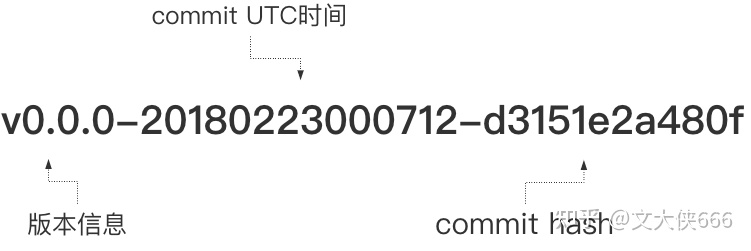
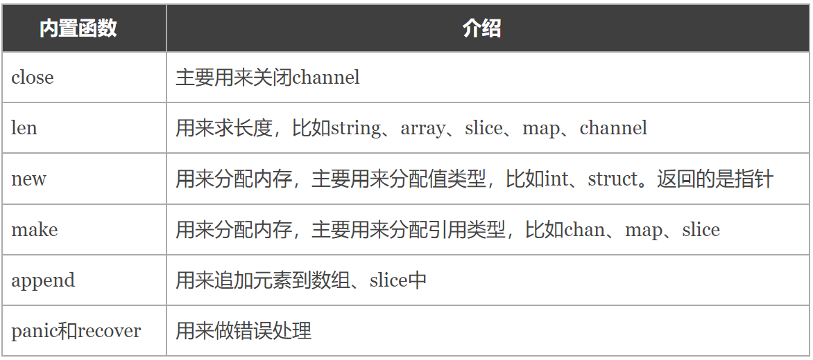
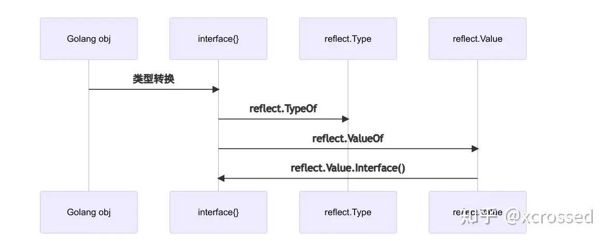

# 1、Go语言的特点
来源：【尚硅谷】Golang入门到实战教程丨一套精通GO语言（`https://www.bilibili.com/video/BV1ME411Y71o/?p=6&spm_id_from=pageDriver&vd_source=7326fe06b64e27279f7a29142c1cf0b6` ）

Go语言保证了既能到达**静态编译语言**的安全和性能，又达到了**动态语言开发维护的高效率**，使用一个表达式来形容Go语言，Go = C+ Python，说明Go语言既有C静态语言程序的速度，又能达到Python动态语言的快速开发。

1. 从C语言中继承了很多理念，包括表达式语法、控制结构、基础数据类型、调用参数传值、指针等等，也保留了和C语言一样的编译执行方式及弱化的指针。
2. 引入包的概念，用于组织程序结构，**Go语言的一个文件都要归属于一个包**，而不能单独存在。
3. 垃圾回收机制，内存自动回收，不需要开发人员管理。
4. 天然并发：
	1). 从语言层面支持并发，实现简单；
	2). 协程（goroutine），轻量级线程，可实现大并发处理，高效利用多核；
	3). 基于CPS并发模型（Communicating Sequential Processes）实现。
5. 吸收了管道通信机制，形成Go语言特有的管道channel，
   通过管道channel，可以实现不同的goroutine之间的相互通信。
6. 函数返回多个值。
7. 新的创新：比如切片slice、延时执行defer等。


# 2、Go语言的开发工具
1）visual studio code
2）Sublime Text
3）vim
4）Emacs
5）Eclipse IDE工具
6）LiteIDE，LiteIDE是一款是国人开发的专门为Go语言开发的跨平台轻量级集成开发环境（IDE）
7）JetBrains公司的产品：PhpStorm、WebStorm和Pycharm等IDE工具，都需要安装Go插件

## 2.1 visual studio code插件
### 方法一
来源：https://blog.csdn.net/weixin_44823747/article/details/107306489?spm=1001.2101.3001.6661.1&utm_medium=distribute.pc_relevant_t0.none-task-blog-2%7Edefault%7ECTRLIST%7ERate-1-107306489-blog-127805320.235%5Ev28%5Epc_relevant_default&depth_1-utm_source=distribute.pc_relevant_t0.none-task-blog-2%7Edefault%7ECTRLIST%7ERate-1-107306489-blog-127805320.235%5Ev28%5Epc_relevant_default&utm_relevant_index=1
1）**配置国内镜像**
添加环境变量
变量名：GOPROXY 值：https://goproxy.cn

或是在cmd执行命令：
`go env -w GOPROXY=https://goproxy.cn,direct`

2）**设置go modules**
在cmd执行命令：
`go env -w GO111MODULE=auto`
>GO111MODULE=off，无模块支持，go命令行将不会支持module功能，寻找依赖包的方式将会沿用旧版本那种通过vendor目录或者GOPATH模式来查找。
GO111MODULE=on，模块支持，go命令行会使用modules，而一点也不会去GOPATH目录下查找。
GO111MODULE=auto，默认值，go命令行将会根据当前目录来决定是否启用module功能。这种情况下可以分为两种情形：
　　（1）当前目录在GOPATH/src之外且该目录包含go.mod文件，开启模块支持。
　　（2）当前文件在包含go.mod文件的目录下面。
摘自：https://www.cnblogs.com/l199616j/p/15269281.html

3）vs code安装插件
先安装go插件


点击install all


# 3、Windows下搭建Go开发环境
## 3.1 配置环境变量
GOROOT：指定SDK的安装路径
Path：添加SDK的bin目录
GOPATH：工作目录

## 3.2 编译和运行
1）编译生成可执行文件.exe：go build 文件名.go
编译生成指定可执行文件名.exe：go build -o 指定名.exe 文件名.go
将该可执行文件拷贝到没有go开发环境的机器上仍然可以运行。编译时，编译器会将程序运行依赖的库文件包含在可执行文件中，所以可执行文件变大了很多。
2）或通过go run 命令可以直接运行go程序（类似执行一个脚本文件的形式）（在实际的生产环境还是要先编译出来）
如果要在另一个机器上这么运行，则该机器也需要go开发环境。

# Linux下搭建Go开发环境
**下载安装包**
命令：`wget https://golang.google.cn/dl/go1.20.3.linux-amd64.tar.gz`

**解压到文件夹下**
命令：`sudo tar -xvzf go1.19.linux-amd64.tar.gz -C /usr/local/`

**编译配置环境变量**
命令：`sudo nano ~/.bashrc`

```
export GOPATH=/home/zic/gopath
 
export GOROOT=/usr/local/go
 
export PATH=$PATH:$GOROOT/bin
```
ctrl+O：保存
ctrl+X：退出

命令：`source ~/.bashrc`

**验证**
命令：`go version`


# 4、GoPath（工作目录）与Modules（包管理）的比较
来源：https://blog.csdn.net/nswdiphone6/article/details/117930022
## 4.1 GoPath
GOPATH 是Go语言中使用的一个环境变量，它使用绝对路径提供项目的工作目录。

工作目录是一个工程开发的相对参考目录，好比当你要在公司编写一套服务器代码，你的工位所包含的桌面、计算机及椅子就是你的工作区。工作区的概念与工作目录的概念也是类似的。如果不使用工作目录的概念，在多人开发时，每个人有一套自己的目录结构，读取配置文件的位置不统一，输出的二进制运行文件也不统一，这样会导致开发的标准不统一，影响开发效率。

采用`go env`可以查看GoPath的路径， 在程序中import导的包 通过 `go get `就会下载到GoPath中。GoPath可以设置多个、按顺序查找jar包。先找GoRoot，然后按照GoPath的顺序找。

GoPath会将包文件下载到你配置的GOPATH环境变量的src文件夹下(如果没有配置modules的情况下)。

**Golang默认使用GoPath来管理第三方包**（类似于Java中的Jar包），GoPath 有一个很严重的问题， 当你本地开多个项目的时候，没法让不同项目对应不同的jar包版本。如果引入的jar版本是不向下兼容的话，那开发的时候都可能会出现很多问题。比如我的jar有这个方法，你的没有，很容易出问题。

像Java的maven可以配置jar版本在pom.xml中，而go也有这么个包管理工具 modules。

## 4.2 Go Module
### 4.2.1 环境配置
在设置Go Module之前，需要先设置下go env环境变量：

1）**GO111MODULE设置**
命令：`go env -w GO111MODULE=on`
>GO111MODULE=off，无模块支持，go命令行将不会支持module功能，寻找依赖包的方式将会沿用旧版本那种通过vendor目录或者GOPATH模式来查找。
GO111MODULE=on，模块支持，go命令行会使用modules，而一点也不会去GOPATH目录下查找。
GO111MODULE=auto，默认值，go命令行将会根据当前目录来决定是否启用module功能。这种情况下可以分为两种情形：
　　（1）当前目录在GOPATH/src之外且该目录包含go.mod文件，开启模块支持。
　　（2）当前文件在包含go.mod文件的目录下面。
  
2）**代理设置**
go可以设置国内代理地址去快速下载依赖包
https://goproxy.cn
https://goproxy.io
https://mirrors.aliyun.com/goproxy/
命令： `go env -w GOPROXY=https://goproxy.cn,direct`

### 4.2.2 使用方式
1）通过IDE可直接生成mod初始化
2）使用`go mod int {模块路径}`进行初始化，生成go.mod文件。
`go mod init hank.com/mygin `
可以看到mygin目录下生成了go.mod文件
```
module hank.com/mygin

go 1.14
```

在代码中import第三方包的时候，直接import即可，初始化完成之后，只要执行go 构建命令，go test、go build、go run,就可以自动添加新的依赖关系。
```golang
import (
	"fmt"
	"github.com/jinzhu/gorm"
	_ "github.com/jinzhu/gorm/dialects/mysql"
)

```
或者通过命令 `go mod tidy` 自动下载，此命令类似于Maven中的刷新， 可自动下载.mod文件中的依赖，也可剔除不需要的。
```
module pri_gen_mis

go 1.16

require github.com/jinzhu/gorm v1.9.16

```

## 总结
1）大部分场景下 `go mod init` 和 `go mod tidy` 两个命令就够用了。
2）查看 $GOPATH/pkg/mod 里面的文件就知道了，mod做了一件类似maven的事把所有包都打上了版本号。
可以说这是 golang 迈向高大上语言的标志。
3）从此我们不再为多版本使用的困扰，也不再为IDE打开一个新项目后等待n分钟的生成缓存犯愁。推荐大家丢掉GoPath 使用统一管理。


# 5、一图胜千言，golang Module【入门到精通】
来源：https://zhuanlan.zhihu.com/p/599710762

项目依赖管理，顾名思义，就是管理项目各个依赖。golang的依赖管理一波三折，1.11引入mod，1.18引入工作区，基本上尘埃落定。本文以图梳理go mod整个脉络，对比其它语言依赖管理，尽可能简洁直观，保证一学就通！

## 5.1 典型依赖管理组成
用之前先理解依赖管理，目前成熟的典型依赖管理如Java的Maven/Gradle，NodeJs的Npm，Python的Pip和PHP的Composer。

如下图，先看看一个典型的依赖管理组成：


### 依赖标准格式
一般是指明**依赖地址+版本信息**
比如Maven的依赖格式如下，groupId+artifactId指明地址，version指明版本
```xml
<dependency>
  <groupId>org.projectlombok</groupId>
  <artifactId>lombok</artifactId>
  <version>1.18.24</version>
</dependency>
```
Npm/Pip/Composer依赖格式都是Package名称+版本

### 依赖描述文件
主要用来指明**模块名称和相关依赖列表**，统一在文件中描述

1）Maven是pom.xml文件
2）Npm/Composer是json文件
3）Pip常用requirements.txt文件

### 依赖仓库管理
模块的依赖目前的统一做法就是**远程仓库统一管理**，项目使用时会统一从远程仓库拉取，缓存在**本地仓库**。
但是目前国内的常态就是很多远程仓库网络问题，所以一般都会配置一个**镜像(代理)仓库**。

### 依赖(模块)管理命令
常见下载依赖/项目编译/项目测试
对于maven/gradle来说是全方位项目管理，还包括标准项目骨架生成和开发全周期管理(编译/测试/安装/发布等)

## 5.2 Golang Module组成
如下，当前golang的mod管理和其它语言整体已经没啥大的差别，不同的是:

1）golang的依赖管理不借助其它包，随着编译链工具发布
2）不同的配置修改使用环境变量

结合该图，下面对比典型依赖管理，先看下Go Module快速入门和常用场景，然后针对各个技术点详述Golang Module


## 5.3 快速上手
### 环境配置
* **命令行**
命令行export ...或者go env -w ...，如下
```cmd
export GO111MODULE="on" # 默认开启

export GOROOT="/Users/xxx/.g/go" # go安装目录 
export GOPATH="/Users/xxx/Repository/gopath" # 本地仓库地址

export GOPROXY="https://goproxy.cn,direct" # 代理仓库配置
export GOPRIVATE="git.xxx.cn" # 私有仓库配置，没有则不配
```
可使用go env查看是否生效

* **goland**
如下，goland自动继承命令行配置，在首选项(Preferences)中配置
除此之外可以按照项目指定GOPATH而不是使用全局GOPATH


### 初始化
如下，创建目录后，进入目录go mod init指定待提交git地址，即可初始化一个模块
模块目录下自动生成一个go.mod作为模块依赖文件
```cmd
> mkdir module_test
> cd module_test
> go mod init github.com/JimWen/module_test
go: creating new go.mod: module github.com/JimWen/module_test
> cat go.mod
module github.com/JimWen/module_test

go 1.17
```

### 新增依赖
* **命令行**
新建main.go，这里以gin实现个简单web接口
```golang
package main

import (
  "net/http"

  "github.com/gin-gonic/gin"
)

func main() {
  r := gin.Default()
  r.GET("/ping", func(c *gin.Context) {
    c.JSON(http.StatusOK, gin.H{
      "message": "pong",
    })
  })
  r.Run() // listen and serve on 0.0.0.0:8080 (for windows "localhost:8080")
}
```
这里添加要用的依赖可以
1）go get获取后再引用。
2）直接先写引用，然后执行go mod tidy，会自动下载直接和间接依赖，保存在go.mod中，更新go.sum，如下。


go build编译运行，如下


* **goland**
goland中，如下，import中填入想要引入的依赖后，鼠标悬浮会提示导入该依赖，点击会自动调用go get


### 克隆项目
* **命令行**
参考如上，对于开源项目一般是先clone下来，然后执行go mod tidy，编译运行

* **goland**
goland中打开clone的项目，会自动提示导入全部依赖，点击确认后会自动调用go mod tidy

### 多Module 工作区
新建两个模块如下
>work_test
|-module_a-|-main.go-准备调用ModuleBFunc函数
|-go.mod
|-module_b-|-main.go-ModuleBFunc函数导出
|-go.mod

现在企图在module_a中调用module_b导出的函数，直接书写如下
```golang
package main

import (
  "github.com/JimWen/module_b"
)

func main() {
     module_b.ModuleBFunc()
}
```

执行go mo tidy，此刻堵塞，因为这各个仓库红找不到个仓库，因此除了上传仓库/replace之外，go 1.18后推荐使用工作区

在module_a中初始化工作区如下，这里指明依赖本地module_b模块
>go work init ../module_b

此时，生成go.work文件，查看如下，这里use可以编辑加入更多模块依赖
>cat go.work
go 1.19
use ../module_b

再执行go mod tidy，编译成功

此时，两个模块布局如下
两个模块如下
>work_test
|-module_a-|-main.go-准备调用ModuleBFunc函数
|-go.mod
|-go.work-use指明依赖本地模块module_b
|-module_b-|-main.go-ModuleBFunc函数导出
|-go.mod

**go work类似go mod，相当于个本地依赖描述文件，优先级高于go mod，不应该上传到git**

## 5.4 依赖仓库管理
如图，依赖仓库包括如下几方面

### 本地
拉取的依赖全部缓存在本地仓库，相关配置变量如下
| 配置名称 | 含义                                             | 配置                                                           |
| -------- | ------------------------------------------------ | -------------------------------------------------------------- |
| GOPATH   | 本地仓库地址<br/>所有依赖下载后都存在这里        | 一般配置<br/>windows默认%USERPROFILE%/go<br/>linux默认$HOME/go |
| GOBIN    | GO 程序生成的可执行文件（executable file）的路径 | 不需配置<br/>默认$GOPATH/bin                                   |
| GOROOT   | GOROOT                                           | 不需配置                                                       |


### 远程仓库/镜像仓库
不同其它语言，golang无需单独维护一个代码仓库，直接从指定git仓库拉取(一般是github等)
国内使用golang一般都需要配置代理，常用的就是七牛维护的镜像，相关配置变量如下
| 配置名称 | 含义                                            | 配置                                                                                                                                                                   |
| -------- | ----------------------------------------------- | ---------------------------------------------------------------------------------------------------------------------------------------------------------------------- |
| GOPROXY  | 远程仓库地址                                    | 国内必配<br/>默认https://proxy.golang.org,direct，国内无法访问<br/>常用<br/>七牛<br/>GOPROXY=https://goproxy.cn,direct<br/>阿里GOPROXY=https://mirrors.aliyun.com/gopr |
| GOSUMDB  | Go checksum database<br/>校验下载模块有无被篡改 | 不需配置<br/>默认值是http://sum.golang.org，和GOPROXY同步                                                                                                              |
注意：这里GOPROXY配置中，direct为特殊指示符，因为我们指定了镜像地址，默认是从镜像站点拉取，但是有些库可能不存在镜像站点中，direct可以指示Go回源到模块版本的源地址去抓取，比如github。


### 私有仓库
类似Nexus，很多企业内部的公共模块需要发布供其它模块调用，远程仓库和镜像仓库保持不变，这里通过拦截一道，也就是通过配置描述哪些不返回哪些直接请求服务端。
| 配置名称            | 含义               | 配置                                   |
| ------------------- | ------------------ | -------------------------------------- |
| GOPRIVATE           | 私有仓库指定       | 有私有库则配置多个，以英文逗号进行分割 |
| GONOPROXY/GONOSUMDB | 指定的地址不走代理 | 不需配置 默认和GOPRIVATE同步           |


## 5.5 依赖标准格式
Go mod通过**git仓库地址+版本**来唯一描述一个依赖
版本号有如下两种指定方式

### 基于tag
显然，对应的依赖模块必须发布对应版本号的 tags，比如
>http://golang.org/x/time v0.3.0 http://github.com/samber/lo v1.37.0 http://github.com/panjf2000/ants/v2 v2.7.1

如下两个点需要注意：

1. 语义化版本
tag的版本必须按照指定的格式来，也就是所谓的语义化版本
如下，Go支持标准语义化版本和扩展版本号，按照官网对应的规则就是

>版本格式：主版本号.次版本号.修订号，版本号递增规则如下：
主版本号：当你做了不兼容的 API 修改，
次版本号：当你做了向下兼容的功能性新增，
修订号：当你做了向下兼容的问题修正。
先行版本号及版本编译信息可以加到“主版本号.次版本号.修订号”的后面，作为延伸。


2. 引用规则
a.主版本号为 v0 和 v1 时，不需要在模块导入路径包含主版本的信息
b.v2 起，必须要在模块的导入路径末尾加上主版本号

### 基于commit hash的伪版本(Pseudo-versions)

没有打语义版本tag的依赖版本，Go中引入一个概念叫伪版本，其实就是基于时间和commit hash自动生产个版本号，只是可读性比语义化版本要差。
比如
>http://github.com/lestrrat/go-file-rotatelogs v0.0.0-20180223000712-d3151e2a480f

对应的伪版本分为如下三段：
1）v0.0.0是程序包的发行版本 ( v0.0.0是未定义标签时的默认发行版本)
2）20180223000712是UTC 提交软件包的时间
3）d3151e2a480f是程序包的提交哈希中的前12个字符



## 5.6 依赖描述文件
### go.mod
Go使用go.mod记录**仓库依赖描述**
模块名+go版本+依赖列表，示例如下
```
module go-in-prod

go 1.19

require (
   github.com/hashicorp/go-multierror v1.1.1
   ...
   github.com/samber/lo v1.37.0
)

require (
   github.com/hashicorp/errwrap v1.0.0 // indirect
   github.com/modern-go/reflect2 v1.0.2 // indirect
   golang.org/x/exp v0.0.0-20220303212507-bbda1eaf7a17 // indirect
)

exclude golang.org/x/time v0.3.0
replace golang.org/x/sync v0.1.0 => gitee.com/x/sync v0.1.0
replace golang.org/x/sync v0.1.0 => /User/local/...
```

指明依赖列表的几个常用关键字如下
**require**：指定一个特定的模块依赖
可以看到这里间接引入的，会有indirect标识，Go1.17之后自动把直接和间接依赖分到不同的require组中
**exclude**：排除一个特定的模块依赖
知道某个版本有bug或者不兼容，用此指明不拉取该版本
**replace**：将一个模块依赖替换为另外一个模块依赖
常用于解决如下问题

1）对应依赖模块网络问题拉取不到，换个地方拉取
2）本地调试，不想发布到仓库

### go.sum
如下，当前项目直接或间接依赖的所有模块版本+SHA-256 ，保证项目所依赖的那些模块版本不会被篡改。
```
github.com/hashicorp/errwrap v1.0.0 h1:hLrqtEDnRye3+sgx6z4qVLNuviH3MR5aQ0ykNJa/UYA=
github.com/hashicorp/errwrap v1.0.0/go.mod h1:YH+1FKiLXxHSkmPseP+kNlulaMuP3n2brvKWEqk/Jc4=
github.com/hashicorp/go-multierror v1.1.1 h1:H5DkEtf6CXdFp0N0Em5UCwQpXMWke8IA0+lD48awMYo=
github.com/hashicorp/go-multierror v1.1.1/go.mod h1:iw975J/qwKPdAO1clOe2L8331t/9/fmwbPZ6JB6eMoM=
...
```
不做详述，只需要知道 **go.mod 和 go.sum 文件都应该提交到 Git 仓库中去**。

### go.work
go.work记录**本地依赖描述**，go.work 与 go.mod 语法一致
典型文件如下
```
go 1.18

use (...)

replace golang.org/x/net => gitee.com/jimwen/net v1.0.0
```
1）go：声明 go 版本号。
2）use：声明应用依赖模块的文件路径，绝对路径或相对路径均可，可以在应用命目录外均可。
3）replace：替换某个模块依赖的导入路径，优先级高于 go.mod 中的 replace 指令。


## 5.7 依赖管理命令

### go env
查看当前Go的配置

### go get
拉取指定的依赖，放到本地仓库，常用的拉取命令如下：
1）go get：只拉取(更新)直接依赖
2）go get -u：拉取(更新)直接依赖和间接依赖模块
3）go get -u -t ./...：拉取(更新)直接依赖和间接依赖模块，包括单元测试中用到的。

go get拉取依赖不需要精准指定依赖版本，可自动推断对应的版本号，常用命令如下：
1）go get http://golang.org/x/text@lates ：拉取最新的版本，若存在tag，则优先使用。
2）go get http://golang.org/x/text@maste ：拉取 master 分支的最新 commit。
3）go get http://golang.org/x/text@v0.3. ：拉取 tag 为 v0.3.2 的 commit。
4）go get http://golang.org/x/text@342b2 ：拉取 hash 为 342b231 的 commit，最终可能转换为 v0.3.2。

版本号推断原则如下

1. 所拉取的模块有发布 tags：
2. 如果只有单个模块，那么就取主版本号最大的那个tag。
3. 如果有多个模块，则推算相应的模块路径，取主版本号最大的那个tag（子模块的tag的模块路径会有前缀要求）
4. 所拉取的模块没有发布过 tags：
5. 默认取主分支最新一次 commit 的 commithash。

### go install
Go 1.16开始，安装二进制命令从go get改为go install，比如
`go install http://sigs.k8s.io/kind@v0.9.0`

### go mod
go.mod中依赖管理，常用命令如下，更多参考go help mod
1）go mod init ：初始化模块，生成go.mod文件
2）go mod download ：下载go.mod文件中的所有依赖，放到本地仓库
3）go mod tidy ：整理go.mod文件中的所有依赖，添加缺失或移除不使用的modules
4）go mod graph ：图结构方式显示查看现有的依赖结构

### go work
Go 1.18增加多Module 工作区，N个Go Module组成一个Go Work，主要是为了解决多个子模块本地开发的问题(1.18之前主要依赖replace)。
类似go mod，常用命令如下，更多参考go help work
1）go work init ：初始化模块，生成go.work文件
2）go work use ：添加模块到工作区

## 待完善功能
对比maven/gradle成熟的项目管理，go mod依赖管理目前用起来已然很香，但是围绕模块的完善生态和工具建设欠妥

* 项目目录标准和骨架(模板)
目前无统一解决方案，有部分常用标准和工具，后续介绍

* 标准构建生命周期
一般都是各自定义一套，结合CICD统一完成，长远来看可能造成工具链碎片化，等待看看官方动静

**参考**
参考代码
https://gitee.com/wenzhou1219/go-in-prod/tree/master/work_test

语义化版本
https://semver.org/lang/zh-CN/
https://medium.com/swlh/semantic-version-tags-in-go-mod-file-f6ad903a972d

Go Module文章
https://mp.weixin.qq.com/s/7HGJaHaBjStKuVxecNi-QA
https://mp.weixin.qq.com/s/6gJkSyGAFR0v6kow2uVklA
https://mp.weixin.qq.com/s/Aa9s

# GOROOT和GOPATH
来源：https://www.liwenzhou.com/posts/Go/install/
`GOROOT`和`GOPATH`都是环境变量，其中`GOROOT`是我们安装go开发包的路径，而从Go 1.8版本开始，Go开发包在安装完成后会为`GOPATH`设置一个默认目录，并且在Go1.14及之后的版本中启用了Go Module模式之后，不一定非要将代码写到GOPATH目录下，所以也就**不需要我们再自己配置GOPATH了**，使用默认的即可。

# 使用go module
使用go module模式新建项目时，我们需要通过`go mod init 项目名`命令对项目进行初始化，该命令会在项目根目录下生成 ==go.mod== 文件。项目名也可以加上域名，如 github.com/project/hello 。例如，我们使用hello作为我们第一个Go项目的名称，执行如下命令。
```
go mod init hello
```

# 跨平台编译
默认我们go build的可执行文件都是当前操作系统可执行的文件，Go语言支持跨平台编译——在当前平台（例如Windows）下编译其他平台（例如Linux）的可执行文件。

### Windows编译Linux可执行文件
如果我想在Windows下编译一个Linux下可执行文件，那需要怎么做呢？只需要在编译时指定目标操作系统的平台和处理器架构即可。

>注意：无论你在Windows电脑上使用VsCode编辑器还是Goland编辑器，都要注意你使用的终端类型，因为不同的终端下命令不一样！！！目前的Windows通常默认使用的是**PowerShell终端**。

如果你的Windows使用的是cmd，那么按如下方式指定环境变量。
```cmd
SET CGO_ENABLED=0  // 禁用CGO
SET GOOS=linux  // 目标平台是linux
SET GOARCH=amd64  // 目标处理器架构是amd64
```

如果你的Windows使用的是PowerShell终端，那么设置环境变量的语法为
```powershell
$ENV:CGO_ENABLED=0
$ENV:GOOS="linux"
$ENV:GOARCH="amd64"
```

在你的Windows终端下执行完上述命令后，再执行下面的命令，得到的就是能够在Linux平台运行的可执行文件了。
```
go build
```

### Linux编译Windows可执行文件
Linux平台下编译Windows平台64位可执行程序：
```
CGO_ENABLED=0 GOOS=windows GOARCH=amd64 go build
```

# Go语言之依赖管理
来源：https://www.liwenzhou.com/posts/Go/dependency/

## 为什么需要依赖管理
最早的时候，Go所依赖的所有的第三方库都放在GOPATH这个目录下面。这就导致了同一个库只能保存一个版本的代码。如果不同的项目依赖同一个第三方的库的不同版本，应该怎么解决？

## godep
Go语言从v1.5开始开始引入==vendor==模式，如果项目目录下有vendor目录，那么go工具链会优先使用vendor内的包进行编译、测试等。

godep是一个通过vender模式实现的Go语言的第三方依赖管理工具，类似的还有由社区维护准官方包管理工具dep。
### 安装
执行以下命令安装godep工具。
```
go get github.com/tools/godep
```

### 基本命令
安装好godep之后，在终端输入godep查看支持的所有命令。
```
godep save     将依赖项输出并复制到Godeps.json文件中
godep go       使用保存的依赖项运行go工具
godep get      下载并安装具有指定依赖项的包
godep path     打印依赖的GOPATH路径
godep restore  在GOPATH中拉取依赖的版本
godep update   更新选定的包或go版本
godep diff     显示当前和以前保存的依赖项集之间的差异
godep version  查看版本信息
```
使用`godep help [command]`可以看看具体命令的帮助信息。

### 使用godep
在项目目录下执行godep save命令，会在当前项目中创建Godeps和vender两个文件夹。

其中Godeps文件夹下有一个Godeps.json的文件，里面记录了项目所依赖的包信息。 vender文件夹下是项目依赖的包的源代码文件。

### vender机制
Go1.5版本之后开始支持，能够控制Go语言程序编译时依赖包搜索路径的优先级。

例如查找项目的某个依赖包，首先会在项目根目录下的vender文件夹中查找，如果没有找到就会去$GOAPTH/src目录下查找。

### godep开发流程
1.保证程序能够正常编译
2.执行godep save保存当前项目的所有第三方依赖的版本信息和代码
3.提交Godeps目录和vender目录到代码库。
4.如果要更新依赖的版本，可以直接修改Godeps.json文件中的对应项

## go module
go module是Go1.11版本之后官方推出的版本管理工具，并且从Go1.13版本开始，go module将是Go语言默认的依赖管理工具。

### GO111MODULE
要启用go module支持首先要设置环境变量GO111MODULE，通过它可以开启或关闭模块支持，它有三个可选值：off、on、auto，默认值是auto。

GO111MODULE=off 禁用模块支持，编译时会从GOPATH和vendor文件夹中查找包。
GO111MODULE=on 启用模块支持，编译时会忽略GOPATH和vendor文件夹，只根据 go.mod下载依赖。
GO111MODULE=auto，当项目在$GOPATH/src外且项目根目录有go.mod文件时，开启模块支持。
简单来说，设置GO111MODULE=on之后就可以使用go module了，以后就没有必要在GOPATH中创建项目了，并且还能够很好的管理项目依赖的第三方包信息。

使用 go module 管理依赖后会在项目根目录下生成两个文件go.mod和go.sum。

### GOPROXY
Go1.11之后设置GOPROXY命令为：
```
export GOPROXY=https://goproxy.cn
```
Go1.13之后GOPROXY默认值为https://proxy.golang.org ，在国内是无法访问的，所以十分建议大家设置GOPROXY，这里我推荐使用goproxy.cn。
```
go env -w GOPROXY=https://goproxy.cn,direct
```

### go mod命令
常用的go mod命令如下：
```
go mod download	   下载依赖的module到本地cache（默认为$GOPATH/pkg/mod目录）
go mod edit        编辑go.mod文件
go mod graph       打印模块依赖图
go mod init        初始化当前文件夹, 创建go.mod文件
go mod tidy        增加缺少的module，删除无用的module
go mod vendor      将依赖复制到vendor下
go mod verify      校验依赖
go mod why         解释为什么需要依赖
```

### go.mod
go.mod文件记录了项目所有的依赖信息，其结构大致如下：
```
module github.com/Q1mi/studygo/blogger

go 1.12

require (
	github.com/DeanThompson/ginpprof v0.0.0-20190408063150-3be636683586
	github.com/gin-gonic/gin v1.4.0
	github.com/go-sql-driver/mysql v1.4.1
	github.com/jmoiron/sqlx v1.2.0
	github.com/satori/go.uuid v1.2.0
	google.golang.org/appengine v1.6.1 // indirect
)
```
其中，
module用来定义包名
require用来定义依赖包及版本
indirect表示间接引用
#### 依赖的版本
go mod支持语义化版本号，比如`go get foo@v1.2.3`，也可以跟git的分支或tag，比如`go get foo@master`，当然也可以跟git提交哈希，比如`go get foo@e3702bed2`。关于依赖的版本支持以下几种格式：
```
gopkg.in/tomb.v1 v1.0.0-20141024135613-dd632973f1e7
gopkg.in/vmihailenco/msgpack.v2 v2.9.1
gopkg.in/yaml.v2 <=v2.2.1
github.com/tatsushid/go-fastping v0.0.0-20160109021039-d7bb493dee3e
latest
```
#### replace
在国内访问golang.org/x 的各个包都需要翻墙，你可以在go.mod中使用replace替换成github上对应的库。
```
replace (
	golang.org/x/crypto v0.0.0-20180820150726-614d502a4dac => github.com/golang/crypto v0.0.0-20180820150726-614d502a4dac
	golang.org/x/net v0.0.0-20180821023952-922f4815f713 => github.com/golang/net v0.0.0-20180826012351-8a410e7b638d
	golang.org/x/text v0.3.0 => github.com/golang/text v0.3.0
)
```

### go get
在项目中执行go get命令可以下载依赖包，并且还可以指定下载的版本。

1.运行go get -u将会升级到最新的次要版本或者修订版本(x.y.z, z是修订版本号， y是次要版本号)
2.运行go get -u=patch将会升级到最新的修订版本
3.运行go get package@version将会升级到指定的版本号version
如果下载所有依赖可以使用`go mod download`命令。

### 整理依赖
我们在代码中删除依赖代码后，相关的依赖库并不会在==go.mod==文件中自动移除。这种情况下我们可以使用`go mod tidy`命令更新==go.mod==中的依赖关系。

### go mod edit
#### 格式化
因为我们可以手动修改go.mod文件，所以有些时候需要格式化该文件。Go提供了一下命令：
```
go mod edit -fmt
```
#### 添加依赖项
```
go mod edit -require=golang.org/x/text
```
#### 移除依赖项
如果只是想修改==go.mod==文件中的内容，那么可以运行`go mod edit -droprequire=package path`，比如要在==go.mod==中移除golang.org/x/text 包，可以使用如下命令：
```
go mod edit -droprequire=golang.org/x/text
```
关于`go mod edit`的更多用法可以通过`go help mod edit`查看。

## 在项目中使用go module
### 既有项目
如果需要对一个已经存在的项目启用go module，可以按照以下步骤操作：

1. 在项目目录下执行`go mod init`，生成一个==go.mod==文件。
2. 执行`go get`，查找并记录当前项目的依赖，同时生成一个go.sum记录每个依赖库的版本和哈希值。

### 新项目
对于一个新创建的项目，我们可以在项目文件夹下按照以下步骤操作：

1. 执行`go mod init 项目名`命令，在当前项目文件夹下创建一个==go.mod==文件。
2. 手动编辑==go.mod==中的require依赖项或执行go get自动发现、维护依赖。

### 导入本地包
A包导入B包：

1. A包中首先应`go mod init A`
2. B包也应`go mod init B`
3. 在B目录的命令行输入：
```cmd
go mod edit -replace B=（B包具体的目录)

go mod tidy
```

# go mod使用 | 全网最详细
来源：https://zhuanlan.zhihu.com/p/482014524

# go run、build、install、get的原理和区别
来源：https://zhuanlan.zhihu.com/p/619500945

* **go run 专门用来运行命令源码文件的命令，一般用来运行单个文件**

* **go build 主要是用于测试编译。编译某个包或者项目，在当前目录下生成可执行文件**

* **go install 编译并安装代码包或者源码文件的**

* **go get 用于从远程代码仓库（比如 Github ）上下载代码包并更新mod**

* **go 1.17之后go get只下载源码，并将依赖添加到go.mod。get install用来下载和安装三方库**

## go run
专门用来运行命令源码文件的命令，**不是用来运行所有go源码文件的**

go run 命令只能接受一个命令源码文件以及若干个库源码文件（必须同属于 main 包）作为文件参数，且**不能接受测试源码文件**。它在执行时会检查源码文件的类型。如果参数中有多个或者没有命令源码文件，那么 go run 命令就只会打印错误提示信息并退出，而不会继续执行。

`go run -n `查看执行过程

先创建临时文件b001，在b001中创建一个importcfg文件，将使用的import文件写入，然后切换到目录下，执行compile命令，创建一个importcfg.link文件，将compile生成的link写入。然后创建临时文件exe，将导入文件和源码文件连接在一起生成可执行文件。

通过compile生成link文件，然后将link和源文件一起打包成exe

生成的临时文件可以用go run -work看到

go run命令是生成了2个文件，一个是归档文件，一个是可执行文件。

## go build
go build 命令主要是用于**测试编译**。在包的编译过程中，若有必要，会同时编译与之相关联的包。

如果是普通包，当你执行go build命令后，不会产生任何文件。

如果是main包，当只执行go build命令后，会在当前目录下生成一个可执行文件。如果需要在$GOPATH/bin目录下生成相应的exe文件，需要执行go install 或者使用 go build -o 路径/可执行文件。

如果某个文件夹下有多个文件，而你只想编译其中某一个文件，可以在 go build 之后加上文件名，例如 go build a.go；**go build 命令默认会编译当前目录下的所有go文件**。

你也可以指定编译输出的文件名。比如，我们可以指定go build -o 可执行文件名，默认情况是你的package名(非main包)，或者是第一个源文件的文件名(main包)。

go build 会忽略目录下以”_”或者”.”开头的go文件。

如果你的源代码针对不同的操作系统需要不同的处理，那么你可以根据不同的操作系统后缀来命名文件。

**go build 用于编译我们指定的源码文件或代码包以及它们的依赖包。但是注意如果用来编译非命令源码文件，即库源码文件，go build 执行完是不会产生任何结果的。这种情况下，go build 命令只是检查库源码文件的有效性，只会做检查性的编译，而不会输出任何结果文件。**

**go build 编译命令源码文件，则会在该命令的执行目录中生成一个可执行文件**

**go build 后面不追加目录路径的话，它就把当前目录作为代码包并进行编译。go build 命令后面如果跟了代码包导入路径作为参数，那么该代码包及其依赖都会被编译。**

执行同go run，多了一步mv 将exe临时文件下的可执行文件重命名并移动当当前目录下

## go install
go install 命令是用来编译并安装代码包或者源码文件的。

分两步

**第一步是生成结果文件(可执行文件或者.a包)，第二步会把编译好的结果移到$GOPATH/pkg或$GOPATH/bin**

可执行文件： 一般是 go install 带main函数的go文件产生的，有函数入口，所有可以直接运行。

.a应用包： 一般是 go install 不包含main函数的go文件产生的，没有函数入口，只能被调用。

## go get
go get 命令用于从远程代码仓库（比如 Github ）上下载并安装代码包。注意，go get 命令会把当前的代码包下载到 $GOPATH 中的第一个工作区的 src 目录中，并安装。

**备注1.17后，go get仅用来下载库和更新mod文件，并不会安装。**

go get常用标记


## 其他命令
go clean 命令是用来移除当前源码包里面编译生成的文件，这些文件包括

_obj/ 旧的object目录，由Makefiles遗留

_test/ 旧的test目录，由Makefiles遗留

_testmain.go 旧的gotest文件，由Makefiles遗留

test.out 旧的test记录，由Makefiles遗留

build.out 旧的test记录，由Makefiles遗留

*.[568ao] object文件，由Makefiles遗留

DIR(.exe) 由 go build 产生

DIR.test(.exe) 由 go test -c 产生

MAINFILE(.exe) 由 go build MAINFILE.go产生

go fmt 命令主要是用来帮你格式化所写好的代码文件。

go test 命令，会自动读取源码目录下面名为*_test.go的文件，生成并运行测试用的可执行文件。默认的情况下，不需要任何的参数，它会自动把你源码包下面所有test文件测试完毕，当然你也可以带上参数，详情请参考go help testflag

go doc 命令其实就是一个很强大的文档工具。

go fix 用来修复以前老版本的代码到新版本，例如go1之前老版本的代码转化到go1

go version 查看go当前的版本

go env 查看当前go的环境变量

go list 列出当前全部安装的package

# golang 中结构体匿名嵌套时的初始化问题
来源：https://www.yangyanxing.com/article/anonymous-struct-init.html

当创建了两个结构体，其中一个结构体通过匿名嵌套在另一个结构体中,如下面的定义：
```golang
type Person struct {
	Name string
	Age  int
}

type Student struct {
	Person
	Grade string
}
```

## 初始化方式1：依次给出每个字段的值
这种最好理解,但是却不能在初始化的时候直接给出
```golang
s1 := Student{
    Grade: "一年级"，
	
    // 以下两行不能编译
    Name: "yyx",
    Age: 18
}

```
直接在初始化Student对象是赋匿名结构体的值是不行的,提示 `unknown field Name in struct literal `但是我们就可以先初始化Student 结构体自己的属性值，如student的Grade属性，之后再对Student的Name和Age赋值
```golang
s1 := Student{
		Grade: "一年级",
}

s1.Name = "yyx"
s1.Age = 18
fmt.Println(s1)	//{{yyx 18} 一年级}

```

## 初始化方式2：具名赋值
这种赋值就是在初始化的时候写上对应的结构体名称
```golang
func main() {
	s1 := Student{
		Grade: "一年级",
		Person: Person{
			Name: "yyx",
			Age:  18,
		},
	}

	fmt.Println(s1.Name)
	fmt.Println(s1.Person.Name)
}

```

## 初始化方式3：先初始化匿名结构体变量
这种方式其实和上面的方式是一样的
```golang
func main() {

	// 先初始化一个Person 对象
	p := Person{
		Name: "yangyanxing",
		Age:  18,
	}

	s := Student{
		Grade:  "一年级",
		Person: p,  // 再将p赋值给匿名结构体
	}

	fmt.Printf("%#v\n", s)
	fmt.Println(s.Name)
	fmt.Println(s.Age)
	fmt.Println(s.Grade)
}

```

## 当嵌入的结构体不在同一个包时
```
├── go.mod
├── main.go
└── utils
    └── utils.go
```
上面main.go中的Student 结果体嵌入了utils包下的Person结构体
```golang
// utils.go

package utils

type Person struct {
	Name string
	Age  int
}

//main.go
type Student struct {
	utils.Person
	Grade string
}
```

这时候采用第一种方法先初始化变量再对属性进行赋值还是可以的：
```golang
func main() {
	s1 := Student{
		Grade: "一年级",
	}
	s1.Name = "yyx1111"

	fmt.Println(s1.Name)
	fmt.Println(s1.Person.Name)
}
```

但是后两种方法（具名赋值、先初始化匿名结构体变量）就不行了，就会报错 `invalid field name utils.Person in struct literal`
```golang
func main() {
	s1:=Student {
		Grade:"一年级",
		
		//报错
		utils.Person:utils.Person {
			Name:"yyx",
			Age:18,
		}
	}
}
```
这里只需要把utils 去掉，直接使用Person来赋值就可以了
```golang
func main() {
	s1:=Student {
		Grade:"一年级",		
		Person:utils.Person {
			Name:"yyx",
			Age:18,
		}
	}
}
```

## 当嵌入两个不同包下的同名结构体
```
├── common
│   └── common.go
└── utils
    └── utils.go
├── go.mod
├── main.go
```

```golang
//main,go

type Student struct {
	//报错 Person redeclared
	utils.Person
	common.Person 
	
	Grade string
}

```

实在是想两个都引入，那么只能将其中一个变为具名属性：
```golang
type Student struct {
	utils.Person
	Cp common.Person 

	Grade string
}

```

***


# 包
来源：https://www.cnblogs.com/infodriven/p/16224476.html

在工程化的Go语言开发项目中，Go语言的源码复用是建立在包（package）基础之上的。本文介绍了Go语言中如何定义包，如何导出包的内容及如何导入其他包。

## 包介绍
包（package）是多个Go源码的集合，是一种高级的代码复用方案，Go语言为我们提供了很多内置包，如fmt、os、io等。

## 定义包
我们还可以根据自己的需要创建自己的包。一个包可以简单理解为一个存放.go文件的文件夹。 该文件夹下面的所有go文件都要在代码的第一行添加如下代码，声明该文件归属的包。
`package 包名`

注意事项：
* 一个文件夹下面直接包含的文件只能属于一个package，同样一个package的文件不能在多个文件夹下。
* 包名可以不和文件夹名一样，包名不能包含-符号
* 包名为main的包为应用程序入口包，这种包编译后会得到一个可执行文件，而编译不包含main包的源代码则不会得到可执行文件。
* 在同一个包不能有相同的函数名和全局变量。

## 可见性
如果想在一个包中引用另外一个包里的标识符（如变量、常量、类型、函数等）时，该标识符必须是对外可见的（public）。在Go语言中只需要将标识符的首字母大写就可以让标识符对外可见了。

结构体中的字段名和接口中的方法名如果首字母都是大写，外部包可以访问这些字段和方法。

## 包的导入
要在代码中引用其他包的内容，需要使用import关键字导入使用的包。具体语法如下:
`import "包的路径"`

注意事项：
* import导入语句通常放在文件开头包声明语句的下面。
* 导入的包名需要使用双引号包裹起来。
* 包名是从$GOPATH/src/后开始计算的，使用/进行路径分隔。
* Go语言中禁止循环导入包。

## 自定义包
在导入包名的时候，我们还可以为导入的包设置别名。通常用于导入的包名太长或者导入的包名冲突的情况。**而原来的包名则不能使用了**。
具体语法格式如下：
`import 别名 "包的路径"`

单行导入方式定义别名：
```golang
import "fmt"
import m "github.com/Q1mi/studygo/pkg_test"
func main() {
	fmt.Println(m.Add(100, 200))
	fmt.Println(m.Mode)
}
```
多行导入方式定义别名：
```golang
import (
    "fmt"
    m "github.com/Q1mi/studygo/pkg_test"
 )
func main() {
	fmt.Println(m.Add(100, 200))
	fmt.Println(m.Mode)
}

```

## 匿名导入包
如果只希望导入包，而不使用包内部的数据时，可以使用匿名导入包。具体的格式如下：
`import _ "包的路径"`

匿名导入的包与其他方式导入的包一样都会被编译到可执行文件中。

## init()初始化函数
在Go语言程序执行时导入包语句会自动触发包内部init()函数的调用。需要注意的是： init()函数没有参数也没有返回值。 init()函数在程序运行时自动被调用执行，不能在代码中主动调用它。
包初始化执行的顺序如下图所示：


**init()函数执行顺序**：
Go语言包会从main包开始检查其导入的所有包，每个包中又可能导入了其他的包。Go编译器由此构建出一个树状的包引用关系，再根据引用顺序决定编译顺序，依次编译这些包的代码。
在运行时，被最后导入的包会最先初始化并调用其init()函数，如下图示：


## Go不支持循环引用（依赖）
如果一个代码包a依赖于代码包b，同时代码包b依赖于代码包c，则代码包c中的源文件不能引入代码包a和代码包b，代码包b中的源文件也不能引入代码包a。


***
# 类型不确定值（untyped value）和类型确定值（typed value）
## 类型不确定值
有些值的类型是不确定的，有很多可能性。

大多数的类型不确定值各自都有一个默认类型，除了预声明的nil。

无名常量（字面常量）都属于类型不确定值。
**事实上，Go中大多数的类型不确定值都属于字面常量和具名常量**。 少数类型不确定值包括 nil 和布尔返回值。

字面常量的默认类型取决于它为何种字面量形式：
* 一个字符串字面量的默认类型是预声明的string类型。
* 一个布尔字面量的默认类型是预声明的bool类型。
* 一个整数型字面量的默认类型是预声明的int类型。
* 一个rune字面量的默认类型是预声明的rune（亦即int32）类型。
* 一个浮点数字面量的默认类型是预声明的float64类型。
* 如果一个字面量含有虚部字面量，则此字面量的默认类型是预声明的complex128类型。

## 类型不确定常量的显式类型转换
对于一个类型不确定常量值v，有两种情形显式转换T(v)是合法的：

1)  v可以表示为T类型的一个值。 转换结果为一个类型为T的类型确定常量值。
2)  v的默认类型是一个整数类型（int或者rune） 并且T是一个字符串类型。 转换T(v)将v看作是一个Unicode码点。 转换结果为一个类型为T的字符串常量。 此字符串常量只包含一个Unicode码点，并且可以看作是此Unicode码点的UTF-8表示形式。 对于不在合法的Unicode码点取值范围内的整数v， 转换结果等同于字符串字面量"\uFFFD"（亦即"\xef\xbf\xbd"）。 0xFFFD是Unicode标准中的（非法码点的）替换字符值。 
（但是请注意，今后的Go版本可能只允许rune或者byte整数被转换为字符串 🗗 。 从Go官方工具链1.15版本开始，go vet命令会对从非rune和非byte整数到字符串的转换做出警告。）
这种情形并不要求v必须是一个常量。 如果v是一个常量，则转换结果也是一个常量。 如果v不是一个常量，则转换结果也不是一个常量。


# 类型推断
类型推断是指在某些场合下，程序员可以在代码中使用一些类型不确定值， 编译器会自动推断出这些类型不确定值在特定情景下应被视为某些特定类型的值。

## 隐式转换
隐式转换规则：
1) 在Go代码中，如果某处需要一个特定类型的值并且一个类型不确定值可以表示为此特定类型的值， 则此类型不确定值可以使用在此处。Go编译器将此类型不确定值视为此特定类型的类型确定值。 这种情形常常出现在运算符运算、函数调用和赋值语句中。
2) 有些场景对某些类型不确定值并没有特定的类型要求。在这种情况下，Go编译器将这些类型不确定值视为它们各自的默认类型的类型确定值。

***
# 值类型
int、float、bool、string、数组、struct

# 引用类型
指针，slice，map，channel，接口，函数

来源：https://www.jb51.net/article/182727.htm
**go中的赋值，都是值传递**
```golang
a := 1
b := a

x := Struct{}
y := x
```
他们都是在内存中有独立空间的，也就是 copy 的过程，所以这里对y的某个属性的改动，并不会影响x

那么我们要让两个变量指向同一个内存怎么办呢，可以使用引用类型：
```golang
y := &x
```
这时候，y的类型是 `*Struct` ，这时候我们可以对y进行修改，修改完之后，x也会发现变化，因为y现在是一个引用类型，他指向的是x结构体所在的内存

我们可以通过:
```golang
y.variable = xxx
```
来直接调用引用类型的结构体赋值，但是要注意的是，这是go的语法糖，他只是帮助我们简化了通过指针来获取实际内存的过程，完整的写法应该是这样的：`(*y).variable = xxx`
`*y` 是对指针的反引用，可以理解为 `*y == x` 。

为什么设计这个语法糖呢，是因为在go里面我们是无法直接操作指针，像c++ 中直接对内存地址进行计算进而得到其他内存地址的运算，在go里面是默认不支持的
```golang
print(y) // 得到类似0x8123这样的内存地址数据

newAddr := y + 4// 理论上可以得到一个新的内存地址，但是在go里默认是不支持的
```
因为无法直接操作地址，所以go就提供语法糖，让我们在使用引用类型进行操作的时候，默认就是对引用所指向的内存地址进行操作。

注意我们是可以对引用类型直接赋值的，但是赋值的类型也必须是引用类型：
```golang
y = &Struct{} // 这样是可以的，但是不能是y = Struct{}

a := 1
b := &a
b = 2  // 这是不行的，因为b的类型是 *int
```
## 特殊的引用类型
能够通过 make() 函数创建的都是引用类型，比如 slice 和 map ， slice 虽然看起来像数组，但是他其实是一个指向数组内存空间的一个指针类型：
```golang
type Slice struct {
 point Point // 内存地址
 len int
 cap int
}
```
所以我们在执行：
```golang
a := []int
b = a
```
会发现，好像b和a指向的是同一个数组，事实确实如此。 go中所有的赋值都是值传递，而slice的赋值，也是对slice对象的一次拷贝，也就是说a和b是不同的slice对象，但是他们指向同一个数组。

# 可比较类型和不可比较类型
来源：https://blog.csdn.net/lp15929801907/article/details/130333774

| 操作符                      | 变量类型                                                           |
| --------------------------- | ------------------------------------------------------------------ |
| 等值操作符 (`==`、!=)         | 整型、浮点型、字符串、布尔型、复数、指针、管道、接口、结构体、数组 |
| 排序操作符 (<、<=、> 、 >=) | 整型、浮点型、字符串                                               |
| 不可比较类型                | map、slice、function                                               |
## 正常类型
### 浮点类型
Go 语言中两个浮点型变量可以直接比较，Go 语言的浮点型参照的是 IEEE（电气与电子工程师协会）754 号标准，也即二进制浮点数算术标准，两个符点数在一定精度下无法区分大小即相等。这个标准并不是被所有编程语言所采用，比如 C 语言，它诞生时间比这个标准还要早，在 C 语言的实现中浮点数是不能进行等值比较的。
```golang
f1 := 0.10
f2 := 0.1
fmt.Println(f1 == f2) // 输出 true
fmt.Println(f1 < f2) // 输出 false
```

### 字符串类型
string 类型比较是按字节逐个比较的，当两个 string 变量所有字节值都相等时，两个 string 变量则相等。做等值比较时，第一个字节不相等，则直接判定为不相等；做排序比较时，第一个字节值小于，则直接判定为小于。
```golang
s1 := "中"             // Unicode 编码占 3 个字节：228，184，173
s2 := "国"             // Unicode 编码占 3 个字节：229，155，189
fmt.Println(s1 == s2) // 输出 false
fmt.Println(s1 < s2)  // 输出 true
```

### 复数类型
复数类型是可以比较的，复数类型的实部和虚部由浮点数进行表示，只有当两个复数实部和虚部都相等才相等。
```golang
c1 := complex(1, 2)
c2 := complex(1, 2)
c3 := complex(1, 3)
fmt.Println(c1 == c2) // 输出 true
fmt.Println(c1 == c3) // 输出 false


fmt.Println(c1 < c2)
// 错误提示：Invalid operation: c1 < c2 (the operator < is not defined on complex128)

```

### 指针类型
指针本质上是个整型，其值反映的是内存地址，因此指针类型是可以比较的，两个指针变量如果指向的地址相同（或同为 nil）则认为相等，否则不相等，两个指针相等则代表指向同一块内存。
```golang
str1 := "Hello World"
p1 := &str1
str2 := "Hello World"
p2 := &str2
fmt.Println(p1 == p2) // 输出 false


fmt.Println(p1 < p2) 
// 错误提示：Invalid operation: p1 < p2 (the operator < is not defined on *string)

```

使用`new()`函数创建的变量和取其地址的普通局部变量没有什么不同，只是不需要引入（和声明）一个虚拟的名字，通过new(T)就可以直接在表达式中使用。
每一次调用new返回一个具有唯一地址的不同变量：
```golang
p:=new(int)
q:=new(int)

fmt.Println(p == q)	//"false"
```
>这个规则一个例外：两个变量的类型不携带任何信息且是零值，例如 `struct{}` 和 `[0]int` ，当前的实现里面，它们具有相同的地址。


### 管道类型
管道是可以比较的，管道本质上是个指针，make 语句生成的是一个管道的指针，所以管道的比较规则与指针相同，两个管道变量如果是同一个 make 语句声明（或同为 nil）则两个管道相等，否则不等。
```golang
cha := make(chan int, 10)
chb := make(chan int, 10)
chc := cha
fmt.Println(cha == chb) // 输出 false
fmt.Println(cha == chc) // 输出 true
// 管道 cha 和 chb 虽然类型和空间完全相同，但由于出自不同的 make 语句，所以两个管道不相等
// 但管道 chc 由于获得了管道 cha 的地址，所以管道 cha 和 chc 相等
	
	
fmt.Println(cha < chc)
// 错误提示：Invalid operation: cha < chc (the operator < is not defined on chan int)

```

### 数组类型
数组类型是可以比较的，如果两个数组类型（元素类型和声明长度）相同、每个元素均相同，则两个数组相等，否则不等。
```golang
arr1 := [10]int{1, 2, 3}
arr2 := [10]int{1, 2}
fmt.Println(arr1 == arr2) // 输出 false
arr2[2] = 3
fmt.Println(arr1 == arr2) // 输出 true


fmt.Println(arr1 < arr2)
// 错误提示：Invalid operation: arr1 < arr2 (the operator < is not defined on [10]int)

```

## 需要特别注意的类型
### 结构体类型
结构体是可以比较的，但前提是结构体成员字段全部可以比较，并且结构体成员==字段类型、个数、顺序==也需要相同，当结构体成员全部相等时，两个结构体相等。

特别注意的点，如果结构体成员字段的顺序不相同，那么结构体也是不可以比较的。如果结构体成员字段中有不可以比较的类型，如map、slice、function 等，那么结构体也是不可以比较的。

### 接口类型
Go 语言中，接口（interface）是对非接口值（例如指针，struct 等）的封装，内部实现包含了 2 个字段，类型 T 和 值 V。
```golang
type iface struct {
    tab  *itab // 保存变量类型（以及方法集）
    data unsafe.Pointer // 变量值位于堆栈的指针
}
```
接口是由 struct 表示的，所谓的底层类型即 `iface.tab` 字段，而底层值即 `iface.data`，因此接口类型的比较就演变成了结构体比较。

两个接口类型比较时，会先比较 T，再比较 V。接口类型与非接口类型比较时，会先将非接口类型尝试转换为接口类型，再按接口比较的规则进行比较。如果两个接口变量底层类型和值完全相同（或同为 nil）则两个变量相等，否则不等。

接口类型比较时，如果底层类型不可比较，则会发生 panic。
```golang
package main

import "fmt"

type Animal interface {
	Speak() string
}

type Duck struct {
	Name string
}

func (a Duck) Speak() string {
	return "I'm " + a.Name
}

type Cat struct {
	Name string
}

func (a Cat) Speak() string {
	return "I'm " + a.Name
}

type Bird struct {
	Name      string
	SpeakFunc func() string
}

func (a Bird) Speak() string {
	return "I'm " + a.SpeakFunc()
}

// Animal 为接口类型，Duck 和 Cat 分别实现了该接口。
func main() {
	var d1, d2, c1 Animal
	d1 = Duck{Name: "Donald Duck"}
	d2 = Duck{Name: "Donald Duck"}
	c1 = Cat{Name: "Donald Duck"}
	fmt.Println(d1 == d2) // 输出 true
	fmt.Println(d1 == c1) // 输出 false
	// 接口变量 d1、d2 底层类型同为 Duck 并且底层值相同，所以 d1 和 d2 相等。
	// 接口变量 c1 底层类型为 Cat，尽管底层值相同，但类型不同，c1 与 d1 也不相等。

	var animal Animal
	animal = Duck{Name: "Donald Duck"}
	var duck Duck
	duck = Duck{Name: "Donald Duck"}
	fmt.Println(animal == duck) // 输出 true
	// 当 struct 和接口进行比较时，可以简单地把 struct 转换成接口然后再按接口比较的规则进行判定。
	// animal 为接口变量，而 duck 为 struct 变量，底层类型同为 Duck 并且底层值相同，二者判定为相等。

	var b1 Animal = Bird{
		Name: "bird",
		SpeakFunc: func() string {
			return "I'm Poly"
		}}
	var b2 Animal = Bird{
		Name: "bird",
		SpeakFunc: func() string {
			return "I'm eagle"
		}}
	fmt.Println(b1 == b2)
	// panic: runtime error: comparing uncomparable type main.Bird
	// 结构体 Bird 也实现了 Animal 接口，但结构体中增加了一个不可比较的函数类型成员 SpeakFunc，
	// 因此 Bird 变成了不可比较类型，接口类型变量 b1 和 b2 底层类型为 Bird，在比较时会触发 panic。
}
```


### nil类型
2 个 nil 类型可能不相等，两个nil 只有在类型相同时才相等。例如，interface 在运行时绑定值，只有值为 nil 接口值才为 nil，但是与指针的 nil 不相等。
```golang
func main() {
	var p *int = nil
	var i interface{}
	fmt.Println(p == nil) // 输出 true
	fmt.Println(i == nil) // 输出 true
	fmt.Println(i == p)   // 输出 false
}
```

## 不可比较类型
Go 语言只有三种不可比较类型，分别是 slice、map、function，三种类型的变量不能进行比较，==只有一个例外：可以与 nil 进行比较==。

### 实现比较的方法
使用 `reflect.TypeOf(value).Comparable()` 判断可否进行比较， 使用 `reflect.DeepEqual(value 1, value 2)` 进行比较，当然也有特殊情况，例如 `[]byte`，通过 `bytes. Equal` 函数进行比较。但是反射非常影响性能。
```golang
func main() {
	s := "Hello World"
	aMap := make(map[string]int)
	bMap := make(map[string]int)
	fmt.Println(reflect.TypeOf(s).Comparable())    // 输出 true
	fmt.Println(reflect.TypeOf(aMap).Comparable()) // 输出 false
	fmt.Println(reflect.TypeOf(bMap).Comparable()) // 输出 false
	fmt.Println(reflect.DeepEqual(aMap, bMap))     // 输出 true
	aMap["s"] = 1
	fmt.Println(reflect.DeepEqual(aMap, bMap)) // 输出 false
}

```

# 变量
## 变量声明的三种方式
1）指定变量类型，如果没有初始化，则变量为默认值。
```golang
var num int
var num2 int = 2
```
2）根据值自行判定变量类型（类型推导）。
```golang
var num3 = 3
```
3）简短变量声明：省略var，使用 := 声明变量。如果变量已经使用 var 声明过了，再使用 := 声明变量，就产生编译错误。
```golang
num4 := 4
```

但是简短变量声明左边的变量可能并不都是刚刚声明的。如果有一部分在相同的词法域声明过了，那么简短变量声明语句对这些已经声明过的变量就只有赋值行为了。

简短变量声明语句只有对已经在同级词法域声明过的变量才和赋值操作语句等价，如果变量是在外部词法域声明的，那么简短变量声明语句将会在当前词法域重新声明一个新的变量。

**简短变量声明语句中必须至少要声明一个新的变量**。
```golang
num8, str2 := 8, "str2"
num9, str2 := 9, "str2"
```

**简短变量声明只能用来声明局部变量**。

## new函数
另一个创建变量的方法是调用用内建的new函数。表达式new(T)将创建一个T类型的匿名变量，初始化为T类型的零值，然后返回变量地址，返回的指针类型为 `*T`。
```golang
p := new(int) // p, *int 类型, 指向匿名的 int 变量
fmt.Println(*p) // "0"
*p = 2 // 设置 int 匿名变量的值为 2
fmt.Println(*p) // "2"
```

每次调用new函数都是返回一个新的变量的地址。

## 多变量声明
```golang
//方式1
var num5, num6 int = 5, 6
//方式2
var str, num7 = "str", 7
//方式3
num8, str2 := 8, "str2"

//var num5, num6 int = 5
//编译报错：assignment mismatch: 2 variables but 1 value
```

## 全局变量
在golang中，全局变量的生命周期属于整个包，这个和C不同，因为C语言没有包的概念。

在golang的main包中，main包定义的全局变量无法被其他包引用。

如果想使用全局变量，建议在其他包中定义并进行引用。

```golang
//方式1
var num_global int

// 方式2
var (
	num_global2 = 22
	str_global  = "str_global"
	num_global3 int
)
```

**若干包级变量在声明时刻的依赖关系将影响它们的初始化顺序**
```golang
var x, y = a+1, 5 // 8 5
var a, b, c = b+1, c+1, y // 7 6 5
```
声明的变量的初始化顺序为y = 5、c = y、b = c+1、a = b+1、x = a+1。

包级变量在初始化的时候不能相互依赖。比如，下面这个变量声明语句编译不通过。
```golang
var x, y = y, x
```

## 非常量数字值相关的显式类型转换规则
在Go中，两个类型不一样的基本类型（第6章）值是不能相互赋值的。 我们必须使用显式类型转换将一个值转换为另一个值的类型之后才能进行赋值。

整数（不论常量还是非常量）都可以被显式转换为字符串类型。

两个不同类型数字值之间的转换规则：
* 一个非常量浮点数和整数可以显式转换到其它任何一个浮点数和整数类型。
* 一个非常量复数可以显式转换到其它任何一个复数类型。

**常量数字值的类型转换不能溢出。 而非常量数字值的类型转换中，溢出是允许的。**
```golang
const k int16 = 255
var n = k // 变量n的类型将被推断为int16。
var f = uint8(k + 1) // error: 常量256溢出了uint8。
var g uint8 = n + 1 // error: int16值不能隐式转换为uint8。
var h = uint8(n + 1)// ok: h == 0，变量h的类型为uint8。
					// (n+1)溢出uint8，所以只有低8位 
					// bits（都为0）被保留。
```

## 变量和常量的作用域
 一个声明在一个内层代码块中的常量或者变量将遮挡另一个外层代码块中声明的同名变量或者常量。
 注：变量可以遮挡常量。
 
 

***


# 常量
除了false 和 true， false 和 true是预声明的两个具名常量，其他的基本类型的字面量表示都属于==无名常量==，或者叫==字面常量==。

常量中的数据类型只可以是布尔型、数字型（整数型、浮点型和复数）和字符串型。

**常量声明后不使用也不会报错**。

声明在函数体中的常量称为局部常量（local constant），直接声明在包中的常量称为包级常量（package-level constant），即全局常量。

## 具名常量声明
```golang
const num_const int = 0	//类型确定具名常量

const num_const2 = 2	//类型不确定具名常量

const str_const, num_const3 = "str", 3

//const num_const int
//编译报错：missing init expr for num_const
```

## 常量声明中的自动补全
在一个包含多个常量描述的常量声明中，除了第一个常量描述，其它后续的常量描述都可以只包含标识符列表部分。 Go编译器将通过照抄前面最紧挨的一个完整的常量描述来自动补全不完整的常量描述。

## 枚举
常量还可以用作枚举。
```golang
const (
	enum = 1
	enum2
	enum3
	// 常量声明自动补全：enum2、enum3没有初始化，使用上一行(即enum)的值
	enum4 = 4
	enum5
)//1 1 1 4 4

```

## itoa
iota是Go中预声明（内置）的一个特殊的具名常量，iota被预声明为0。

iota，特殊常量，可以认为是一个可以被编译器修改的常量。

**iota 在 const关键字出现时将被重置为 0(const 内部的第一行之前)**，const 中每新增一行常量声明将使 iota 计数一次(iota 可理解为 const 语句块中的行索引)。

iota 可以被用作枚举值。

iota 只是在同一个 const 常量组内递增，每当有新的 const 关键字时，iota 计数会重新开始。

```golang
const (
	a = iota  //0
	b       //1
	c       //2
	d = "ha"  //独立值，iota += 1
	e       //"ha"   iota += 1
	f = 100   //iota +=1
	g       //100  iota +=1
	h = iota  //7,恢复计数
	i       //8
)

const (
	k = 3 // 在此处，iota == 0

	m float32 = iota + .5 // m float32 = 1 + .5
	n // n float32 = 2 + .5

	p = 9 // 在此处，iota == 3
	q = iota * 2 // q = 4 * 2
	_ // _ = 5 * 2
	r // r = 6 * 2
	s, t = iota, iota // s, t = 7, 7
	u, v // u, v = 8, 8
	_, w // _, w = 9, 9
)
```

再看个有趣的的 iota 实例：
```golang
package main

import "fmt"
const (
    i=1<<iota
    j=3<<iota
    k
    l
)

func main() {
    fmt.Println("i=",i)	//1 = 1<<0
    fmt.Println("j=",j)	//6 = 3<<1
    fmt.Println("k=",k)	//12 = 3<<2
    fmt.Println("l=",l)	//24 = 3<<3
}
```

## 一个类型不确定常量所表示的值可以溢出其默认类型
```golang
// 三个类型不确定常量。
const n = 1 << 64 // 默认类型为int
const r = 'a' + 0x7FFFFFFF // 默认类型为rune
const x = 2e+308 // 默认类型为float64
```

## 每个常量标识符将在编译的时候被其绑定的字面量所替代
如果一个运算中的所有运算数都为常量，则此运算的结果也为常量。或者说，此运算将在编译阶段就被估值。

***

# 整型
1）Golang的整形默认声明为int

***

# 浮点型
1）Golang的浮点形默认声明float64
2）Golang浮点型有固定的范围和长度，不再受操作系统影响。
3）Golang的浮点形有两种表示形式：
```golang
//形式1
var num1 = 0.12
var num2 = .12	//0.12

//形式2
var num3 = 0.123e2	//0.123 * 10^2
var num4 = 0.123E2
var num4 = 0.123E-2	//0.123 / 10^2
```


***

# 字符型
Golang的字符使用UTF-8编码。
Golang没有专门的字符型，如果要存储单个字符（字母），一般使用byte来保存。

字符串是一串固定长度的字符连接起来的字符序列。Golang的字符串是由单个字节连接起来的。
也就是说对于传统的字符串是由字符组成的，而**Golang的字符串不同，是由字节组成的**。


***

# rune
rune类型是int32类型的别名。

## rune值的字面量形式
在Go中，一个rune值表示一个Unicode码点。 一般说来，我们可以将一个Unicode码点看作是一个Unicode字符。 但是，我们也应该知道，有些Unicode字符由多个Unicode码点组成。 每个英文或中文Unicode字符值含有一个Unicode码点。

**一个rune字面量由若干在一对单引号中的字符组成。 在单引号中的字符序列表示一个Unicode码点值**。
```golang
'a'

//下面这些rune字面量形式的变种和'a'是等价的 （字符a的Unicode值是97）。
'\141' // 141是97的八进制表示
'\x61' // 61是97的十六进制表示
'\u0061'
'\U00000061'
```
注：这些八进制和十六进制的数字字符序列表示的整数必须是一个合法的Unicode码点值，否则编译将失败。

\之后必须跟随三个八进制数字字符（0-7）表示一个byte值；
\x之后必须跟随两个十六进制数字字符（0-9，a-f和A-F）表示一个byte值；
\u之后必须跟随四个十六进制数字字符表示一个rune值（此rune值的高四位都为0）；
\U之后必须跟随八个十六进制数字字符表示一个rune值。 

## 转义字符
rune字面量形式多用做字符串的双引号字面量形式中的转义字符。
如果一个rune字面量中被单引号包起来的部分含有两个字符， 并且第一个字符是\，第二个字符不是x、 u和U，那么这两个字符将被转义为一个特殊字符。
```
\a (rune值：0x07) 铃声字符
\b (rune值：0x08) 退格字符（backspace）
\f (rune值：0x0C) 换页符（form feed）
\n (rune值：0x0A) 换行符（line feed or newline）
\r (rune值：0x0D) 回车符（carriage return）
\t (rune值：0x09) 水平制表符（horizontal tab）
\v (rune值：0x0b) 竖直制表符（vertical tab）
\\ (rune值：0x5c) 一个反斜杠（backslash）
\' (rune值：0x27) 一个单引号（single quote）
```

## rune类型的零值
rune类型的零值常用 '\000'、'\x00'或'\u0000'等来表示。

***

# 字符串
## 字符串值的字面量形式
在Go中，字符串值是UTF-8编码的， 甚至所有的Go源代码都必须是UTF-8编码的。

Go字符串的字面量形式有两种。 一种是解释型字面表示（interpreted string literal，双引号风格）。 另一种是直白字面表示（raw string literal，反引号风格）。

```golang
// 解释形式
"Hello\nworld!\n\"你好世界\""

// 直白形式
`Hello
world!
"你好世界"`
```

以\、\x、\u和\U开头的rune字面量（不包括两个单引号）也可以出现在双引号风格的字符串字面量中。

解释型字面表示（双引号风格）的字符串字面量中支持 `\"` 转义，但不支持 `\'`转义；
而rune字面量则相反，支持 `\'` 转义，但不支持 `\"`转义；
直白字面表示（反引号风格）的字符串字面表示中是不支持转义字符的。 除了首尾两个反引号，直白反引号风格的字面表示中不能包含反引号。

在UTF-8编码中，一个Unicode码点（rune）可能由1到4个字节组成。 每个英文字母的UTF-8编码只需要一个字节；每个中文字符的UTF-8编码需要三个字节。


## 字符串类型的零值
字符串类型的零值用 `""` 或  ` `` ` 表示。


***

# 指针

## Go中指针的一些限制
1) **Go指针不支持算术运算**
比如，对于一个指针p， 运算 `p++` 和 `p-2` 都是非法的。
如果p为一个指向一个数值类型值的指针，`*p++`将被编译器认为是合法的并且等价于 `(*p)++` 。换句话说，解引用操作符 `*` 的优先级都高于自增 ++ 和自减 -- 操作符。

2) **一个指针类型的值不能被随意转换为另一个指针类型**
3) **一个指针值不能和其它任一指针类型的值进行比较**
4) **一个指针值不能被赋值给其它任意类型的指针值**


***

# 自定义类型和类型别名
## 自定义类型
```golang
type MyInt int
//通过type关键字的定义，MyInt就是一种新的类型，它具有int的特性。
```


## 类型别名
类型别名是Go1.9版本添加的新功能。
```golang
type TypeAlias = type
```

## 自定义类型和类型别名的区别
```golang

type NewInt int	//类型定义

type MyInt = int	//类型别名

func main() {
	var a NewInt
	var b MyInt
	
	fmt.Printf("type of a:%T\n", a) //type of a:main.NewInt
	fmt.Printf("type of b:%T\n", b) //type of b:int
}
```

***


# 结构体

## 结构体定义
```golang
type person struct {
	name string
	city string
	age  int8
}
```

## 结构体实例化
1) **基本实例化**
```golang
var p1 person
	p1.name = "quin"
	p1.city = "ny"
	p1.age = 18
	fmt.Printf("p1=%v\n", p1)  //p1={quin ny 18}
	fmt.Printf("p1=%#v\n", p1) //p1=main.person{name:"quin", city:"ny", age:18}
```

2) **匿名结构体**
```golang
var user struct{Name string; Age int}
user.Name = "quin"
user.Age = 18
```

3) **创建指针类型结构体**
可以通过使用new关键字对结构体进行实例化，得到的是结构体的地址。
```golang
var p2 = new(person)
fmt.Printf("%T\n", p2)     //*main.person
fmt.Printf("p2=%#v\n", p2) //p2=&main.person{name:"", city:"", age:0}
```

4) **取结构体的地址实例化**
使用&对结构体进行取地址操作相当于对该结构体类型进行了一次new实例化操作。
```golang
p3 := &person{}
fmt.Printf("%T\n", p3)     //*main.person
fmt.Printf("p3=%#v\n", p3) //p3=&main.person{name:"", city:"", age:0}
```

## 结构体实例初始化
没有初始化的结构体，其成员变量都是对应其类型的零值。

1) **使用键值对初始化**
```golang
p5 := person{
	name: "quin",
	city: "ny",
	age:  18,
}

//结构体指针
p6 := &person{
	name: "quin",
	city: "ny",
	age:  18,
}

//当某些字段没有初始值的时候，该字段可以不写。没有指定初始值的字段的值就是该字段类型的零值。
p7 := &person{
	city: "quin",
}
```

2) **使用值的列表初始化**
初始化结构体的时候可以简写，也就是初始化的时候不写键，直接写值。
使用这种格式初始化时，需要注意：
	* 必须初始化结构体的所有字段。
	* 初始值的填充顺序必须与字段在结构体中的声明顺序一致。
	* 该方式不能和键值初始化方式混用。
```golang
p8 := &person{"quin", "ny", 28, }
```

## 结构体内存布局
结构体占用一块连续的内存。
空结构体是不占用空间的。

## 结构体匿名字段
结构体允许其成员字段在声明时没有字段名而只有类型，这种没有名字的字段就称为匿名字段。
注意：这里匿名字段的说法并不代表没有字段名，而是默认会采用类型名作为字段名，结构体要求字段名称必须唯一，因此**一个结构体中同种类型的匿名字段只能有一个**。

## 嵌套结构体
一个结构体中可以嵌套包含另一个结构体或结构体指针。

嵌套结构体也可以采用匿名字段的方式。

嵌套结构体内部可能存在相同的字段名，为了避免歧义需要指定具体的内嵌结构体名。

结构体A作为字段==匿名嵌入==结构体B中，结构体B可以使用结构体A的方法，即使结构体B没有声明这些方法。

## 结构体标签（Tag）
Tag是结构体的元信息，可以在运行的时候通过反射的机制读取出来。 
结构体Tag由一个或多个键值对组成。键与值使用冒号分隔，值用双引号括起来。同一个结构体字段可以设置多个键值对Tag，不同的键值对之间使用空格分隔。
Tag在结构体字段的后方定义，由一对反引号包裹起来，具体的格式如下：
``` 
`key1:"value1" key2:"value2"`
```

注意事项： 为结构体编写Tag时，必须严格遵守键值对的规则。结构体标签的解析代码的容错能力很差，一旦格式写错，编译和运行时都不会提示任何错误，通过反射也无法正确取值。例如不要在key和value之间添加空格。

```golang
type Student struct {
	ID     int    `json:"id"` //通过指定tag实现json序列化该字段时的key
	Gender string //json序列化是默认使用字段名作为key
	name   string //私有不能被json包访问
}
func main() {
	s1 := Student{
		ID:     1,
		Gender: "男",
		name:   "沙河娜扎",
	}
	data, err := json.Marshal(s1)
	if err != nil {
		fmt.Println("json marshal failed!")
		return
	}
	fmt.Printf("json str:%s\n", data) //json str:{"id":1,"Gender":"男"}
}
```

## 结构体比较
如果结构体的所有成员变量都可以比较，那么这个结构体就是可比较的。

## 结构体嵌套
可以使一个命名结构体当作另一个结构体类型的==匿名成员==使用；
并提供一个方便的语法，使用简单的表达式（`x.f`）就可以代表连续的成员（`x.d.e.f`）

### 结构体嵌套初始化
```golang
type e struct {
	f int
}

type d struct {
	e
}

type x struct {
	d
}

/*
	错误初始化
*/
//temp=x{100}
//temp={f: 100}

/*
正确初始化
*/
temp1=x{d{e{100}}}
temp2=x{d: d{e: e{f: 100}}}
```

***


# 数组（array）
## 数组定义
数组的长度必须是常量，并且长度是数组类型的一部分。一旦定义，长度不能变。
```golang
var a [3]int
var b [4]int
a = b //不可以这样做，因为此时a和b是不同的类型
```

## 数组初始化
1)
```golang
var num1 [3]int = [3]int{1, 2, 3}
fmt.Println(num1)	//[1, 2, 3]
```

2) **初始化数组时可以使用初始化列表来设置数组元素的值**
```golang
var num2 = [3]int{1, 2, 3}
fmt.Println(num2)	//[1, 2, 3]
```

3) **还可以让编译器根据初始值的个数自行推断数组的长度**
```golang
var num3 = [...]int{1, 2, 3}
fmt.Println(num3)	//[1, 2, 3]
```

4) **还可以使用指定索引值的方式来初始化数组**
```golang
var num4 = [...]int{1:1, 3:3}
fmt.Println(num4)	//[0, 1, 0, 3]
```

## 数组比较
数组可以在相同类型的情况下比较全部的元素是否相同，但是不相同类型的情况下比较会报错。
```golang
var arr2 = [3]int{1, 2, 3}
var arr3 = [3]int{1, 2, 3}
var arr4 = [3]int{1, 2, 4}
fmt.Println(arr2 == arr3, arr2 == arr4)	//true, false

var arr5 = [4]int{1, 2, 3, 4}
//fmt.Println(arr2 == arr5)	//invalid operation: arr2 == arr5 (mismatched types [3]int and [4]int)
```

## 数组遍历
```golang
var a = [...]string{"北京", "上海", "深圳"}

// 方法1：for循环遍历
for i := 0; i < len(a); i++ {
	fmt.Println(a[i])
}

// 方法2：for range遍历
for index, value := range a {
	fmt.Println(index, value)
}
```

## 多维数组
注意： 多维数组只有第一层可以使用...来让编译器推导数组长度。例如：
```golang
//支持的写法
a := [...][2]string{
    {"北京", "上海"},
    {"广州", "深圳"},
    {"成都", "重庆"},
}
//不支持多维数组的内层使用...
b := [3][...]string{
    {"北京", "上海"},
    {"广州", "深圳"},
    {"成都", "重庆"},
}
```

## 数组是值类型
数组是值类型，赋值和传参会复制整个数组。因此改变副本的值，不会改变本身的值。

## 数组指针
```golang
//数组指针
var num3 = &[...]int{1: 1, 2: 2}
var num4 *[3]int = num3

fmt.Printf("num3 Type:%T %v, num4 Type:%T num4->addr:%p num4's addr:%p\n", num3, num3, num4, num4, &num4)
//num3 Type:*[3]int &[0 1 2], 
//num4 Type:*[3]int 
//num4->addr:0xc00000e1c8 
//num4's addr:0xc00000a030
```

访问元素：
```golang
(*num3)[0]
```

## 指针数组
```golang
//指针数组
var temp1 = 1
var num5 [3]*int
num5[0] = &temp1
var num6 = [3]*int{&temp1}

fmt.Printf("num5 Type:%T %v, num5[0] Type:%T, *num5[0] Type:%T, num6 Type:%T %v\n", num5, num5, num5[0], *num5[0], num6, num6)
//num5 Type:[3]*int [0xc0000180e8 <nil> <nil>], 
//num5[0] Type:*int, 
//*num5[0] Type:int, 
//num6 Type:[3]*int [0xc0000180e8 <nil> <nil>]
```


***

# 切片（slice）
切片（Slice）是一个拥有相同类型元素的可变长度的序列。它是基于数组类型做的一层封装。它非常灵活，支持自动扩容。
==切片是引用类型==，它的内部结构包含地址、长度和容量。切片一般用于快速地操作一块数据集合。

## 切片的定义
```golang
var name []T

var name = []T{}

var name = make([]T, Size, Cap)
```

## 切片的容量
切片拥有自己的长度和容量，我们可以通过使用内置的`len()`函数求长度，使用内置的`cap()`函数求切片的容量。

## 切片表达式
切片表达式从字符串、数组、指向数组或切片的指针构造子字符串或切片。它有两种变体：一种指定low和high两个索引界限值的简单的形式，另一种是除了low和high索引界限值外还指定容量的完整的形式。

1) **简单切片表达式**
切片的底层就是一个数组，可以基于数组通过切片表达式得到切片。 切片表达式中的low和high表示一个索引范围（左包含，右不包含）。
可以省略切片表达式中的任何索引。省略了low则默认为0；省略了high则默认为切片操作数的长度。
```golang
a[2:]  // 等同于 a[2:len(a)]
a[:3]  // 等同于 a[0:3]
a[:]   // 等同于 a[0:len(a)]
```

对切片再执行切片表达式时（切片再切片），high的上限边界是切片的容量cap(a)，而不是长度。
```golang
func main() {
    a := [5]int{1, 2, 3, 4, 5}
    s := a[1:3]  // s := a[low:high]
    fmt.Printf("s:%v len(s):%v cap(s):%v\n", s, len(s), cap(s))
    s2 := s[3:4]  // 索引的上限是cap(s)而不是len(s)
    fmt.Printf("s2:%v len(s2):%v cap(s2):%v\n", s2, len(s2), cap(s2))
}

/*
输出：
s:[2 3] len(s):2 cap(s):4
s2:[5] len(s2):1 cap(s2):1
*/
```

2) **完整切片表达式**
对于数组，指向数组的指针，或切片a(注意不能是字符串)支持完整切片表达式
```golang
a[low : high : max]
```
会构造与简单切片表达式`a[low: high]`相同类型、相同长度和元素的切片。另外，它会将得到的结果切片的容量设置为max-low。在完整切片表达式中只有第一个索引值（low）可以省略；它默认为0。
```golang
func main() {
    a := [5]int{1, 2, 3, 4, 5}
    t := a[1:3:5]
    fmt.Printf("t:%v len(t):%v cap(t):%v\n", t, len(t), cap(t))
}
/*
输出结果：
t:[2 3] len(t):2 cap(t):4
*/
```
完整切片表达式需要满足的条件是0 <= low <= high <= max <= cap(a)，其他条件和简单切片表达式相同。

## 使用内置函数make()函数构造切片
上面都是基于数组来创建的切片，如果需要动态的创建一个切片，就需要使用内置的make()函数
`make([]T, size, cap)`

使用make()函数时，如果size大于0，则前size个数的元素为该类型的零值；且使用append()函数添加时，是从尾部开始：
```golang
var b []int
fmt.Println(b)	//[]

var c = make([]int, 3, 10)
fmt.Println(c)	//[0 0 0]
c = append(c, 1)//[0 0 0 1]

```

## 切片的本质
切片的本质就是对底层数组的封装，它包含了三个信息：==底层数组的指针==、==切片的长度（len）==和==切片的容量（cap）==。
**对切片的修改，也会改变底层数组**。


## 判断切片是否为空
要检查切片是否为空，请始终使用`len(s) == 0`来判断，而使用`s == nil`是判断不出来的。

## 切片不能直接比较
切片之间是不能比较的，我们不能使用`==`操作符来判断两个切片是否含有全部相等元素。 
切片唯一合法的比较操作是和`nil`比较。 一个`nil`值的切片并没有底层数组，一个`nil`值的切片的长度和容量都是0。但是我们不能说一个长度和容量都是0的切片一定是`nil`。
```golang
var s1 []int		//len(s1)=0;cap(s1)=0;s1==nil

s2 := []int{}		//len(s2)=0;cap(s2)=0;s2!=nil

s3 := make([]int, 0)//len(s3)=0;cap(s3)=0;s3!=nil
```

## 切片的赋值拷贝
拷贝后两个切片指向的地址相同，对一个切片的修改会影响另一个切片的内容。
```golang
s1 := make([]int, 3) //[0 0 0]
s2 := s1      //将s1直接赋值给s2，s1和s2共用一个底层数组
s2[0] = 100
fmt.Println(s1) //[100 0 0]
fmt.Println(s2) //[100 0 0]
```

## 使用内置函数append()方法为切片添加元素
Go语言的内建函数`append()`可以为切片动态添加元素。 
可以一次添加一个元素，可以添加多个元素，也可以添加另一个切片中的元素（后面加…）。
注意：通过var声明的零值切片可以在append()函数直接使用，无需初始化。通过内置函数make()函数声明的切片则是从尾部添加。
```golang
//通过var声明的零值切片
var s []int
s = append(s, 1)		// [1]
s = append(s, 2, 3, 4)	// [1 2 3 4]
s2 := []int{5, 6, 7}  
s = append(s, s2...)	// [1 2 3 4 5 6 7]

//通过内置函数make()函数构造切片
var c = make([]int, 3, 10)
fmt.Println(c)	//[0 0 0]
c = append(c, 1)//[0 0 0 1]
```

## 切片的扩容策略
可以通过查看$GOROOT/src/runtime/slice.go源码，其中扩容相关代码如下：
```golang
newcap := old.cap
doublecap := newcap + newcap
if cap > doublecap {
    newcap = cap
} else {
    if old.len < 1024 {
        newcap = doublecap
    } else {
        // Check 0 < newcap to detect overflow
        // and prevent an infinite loop.
        for 0 < newcap && newcap < cap {
            newcap += newcap / 4
        }
        // Set newcap to the requested cap when
        // the newcap calculation overflowed.
        if newcap <= 0 {
            newcap = cap
        }
    }
}

```
从上面的代码可以看出以下内容：
* 首先判断，如果新申请容量（cap）大于2倍的旧容量（old.cap），最终容量（newcap）就是新申请的容量（cap）。
* 否则判断，如果旧切片的长度小于1024，则最终容量(newcap)就是旧容量(old.cap)的两倍，即（newcap=doublecap），
* 否则判断，如果旧切片长度大于等于1024，则最终容量（newcap）从旧容量（old.cap）开始循环增加原来的1/4，即（newcap=old.cap,for {newcap += newcap/4}）直到最终容量（newcap）大于等于新申请的容量(cap)，即（newcap >= cap）
* 如果最终容量（cap）计算值溢出，则最终容量（cap）就是新申请容量（cap）。
需要注意的是，切片扩容还会根据切片中元素的类型不同而做不同的处理，比如int和string类型的处理方式就不一样。

## 使用内置函数copy()函数复制切片
由于切片是引用类型，所以a和b其实都指向同一块内存地址。修改b的同时a的值也会发生变化。
Go语言内建的copy()函数可以迅速地将一个切片的数据复制到另外一个切片空间中。
`copy(target, src)`

## 从切片中删除元素
Go语言中并没有删除切片元素的专用方法，可以使用切片本身的特性来删除元素。
```golang
a := []int{1, 2, 3, 4}
// 要删除索引为2的元素
a = append(a[:2], a[3:]...)
fmt.Println(a) //[1 3 4]
```

## 切片实现堆栈和队列
堆栈：每次添加在队尾，移除元素在队尾（先进后出）
队列：每次添加在队尾，移除元素在队首（先进先出）
```golang
//堆栈实现
stack := []int{}

//入栈
stack= append(stack, 1)
stack= append(stack, 2)
stack= append(stack, 3)

fmt.Println(stack[len(stack)-1])

//出栈
stack = stack[:len(stack)-1]
fmt.Println(stack)
```

```golang
//队列实现
queue := []int{}

//入队
queue = append(queue, 1)
queue = append(queue, 2)
queue = append(queue, 3)
//[1,2,3]


fmt.Println(queue[0])

//出队
queue = queue[1:]
fmt.Println(queue)	//[2,3]
```


***


# 映射（map）
Go语言中提供的映射关系容器为map，其内部使用散列表（hash）实现。
map是一种无序的基于key-value的数据结构，Go语言中的map是引用类型，必须初始化才可以使用。

## map定义
```golang
var name map[Key]Value

var name = map[Key]Value{}

var name = make(map[Key]Value, [Cap])
```

map类型的变量默认初始值为nil，需要使用make()函数来分配内存。语法为：
`make(map[KeyType]ValueType, [cap])`
其中cap表示map的容量，该参数虽然不是必须的，但是我们应该在初始化map的时候就为其指定一个合适的容量。

## map初始化
```golang
userInfo := map[string]string{
		"username": "quin",
		"password": "123456",
	}
```

## 判断某个键是否存在
```golang
value, ok := map[key]
```
如果key存在 ok 为true，value为对应的值；
如果key不存在 ok 为false，value为值类型的零值。

## map遍历
Go语言中使用for range遍历map。
```golang
for key, value := range Map {
	fmt.Println(key, value)
}

//当只想遍历key时
for key := range Map {
fmt.Println(key)
}
```
**注意： 遍历map时的元素顺序与添加键值对的顺序无关**。

## 使用内置函数delete()函数删除键值对
```golang
delete(map_name, key)
```

## 按照指定顺序遍历map
```golang
func main() {
    rand.Seed(time.Now().UnixNano()) //初始化随机数种子
    var scoreMap = make(map[string]int, 200)
    for i := 0; i < 100; i++ {
		key := fmt.Sprintf("stu%02d", i) //生成stu开头的字符串
		value := rand.Intn(100)          //生成0~99的随机整数
		scoreMap[key] = value
	}
	//取出map中的所有key存入切片keys
	var keys = make([]string, 0, 200)
	for key := range scoreMap {
		keys = append(keys, key)
	}
	//对切片进行排序
	sort.Strings(keys)
	//按照排序后的key遍历map
	for _, key := range keys {
		fmt.Println(key, scoreMap[key])
	}
}
```

## 元素为map类型的切片
```golang
func main() {
	var mapSlice = make([]map[string]string, 3)
	for index, value := range mapSlice {
		fmt.Printf("index:%d value:%v\n", index, value)
	}
	fmt.Println("after init")
	// 对切片中的map元素进行初始化
	mapSlice[0] = make(map[string]string, 10)
	mapSlice[0]["name"] = "小王子"
	mapSlice[0]["password"] = "123456"
	mapSlice[0]["address"] = "沙河"
	for index, value := range mapSlice {
		fmt.Printf("index:%d value:%v\n", index, value)
	}
}

```

## 值为切片类型的map
```golang
var sliceMap = make(map[string][]string, 3)
```

***

# 函数
来源：https://www.cnblogs.com/infodriven/p/16224041.html

在Golang中返回函数中局部变量的地址也是安全的。每次调用该函数返回的结果都是不同的地址。

## 函数定义
Go语言中定义函数使用func关键字，具体格式如下：
```golang
func 函数名(参数)(返回值){
    函数体
}
```
函数名：由字母、数字、下划线组成。但函数名的第一个字母不能是数字。在同一个包内，函数名也称不能重名（包的概念详见后文）。
参数：参数由参数变量和参数变量类型组成，多个参数之间使用，分割。
返回值：返回值由返回值变量和其变量类型组成，也可以只写返回值类型，多个返回值必须用()包裹，并用，分割。
函数体：实现指定功能的代码块。

## 函数参数
1）**类型简写**
函数的参数中如果相邻变量的类型相同，则可以省略类型，例如：
```golang
Func intSum(x, y int) int {
    return x + y
}

```

2）**可变参数**
可变参数是指函数的参数数量不固定。Go语言中的可变参数通过参数名后加…来标识。
注意：可变参数通常要作为函数的最后一个参数。

```golang
Func intSum(x …int) int {
    fmt.Println(x)    //x是一个切片
    sum := 0
    for _, v := range x {
        sum = sum + v
    }
}

Func intSum2(int x, y …int) int {
   fmt.Println(x, y)
   sum := x
   for _, v := range y{
        sum = sum + v
    }
}

调用上面函数：
ret1 := intSum()
ret3 := intSum2(10, 20)
ret4 := intSum2(10, 20, 30)
fmt.Println(ret1, ret3, ret4) //0 30 60

```

## 函数返回值

1）**多返回值**
Go语言中函数支持对返回值，函数如果有多个返回值十必须用()将所有返回值包裹起来。
**`return`时必须按定义返回值类型的顺序返回**
```golang
func calc(x, y int) (int int) {
    sum := x + y
    sub := x -  y
    return sum, sub	//必须按定义返回值类型的顺序返回
}
```

2）**返回值命名**
函数定义时可以给返回值命名，并在函数体中直接使用这些变量，最后通过return关键字返回。
如果没有仔细审查代码，`return`前没有给返回值赋值，则Golang会根据它们的类型初始化为对应的零值，所以不宜过度使用。
```golang
func calc(x, y int) (sum, sub int) {
    sum = x + y
    sub = x - y
    return
}

func calc2(x, y int) (sum, sub int) {
    return
}
```

3）**返回值补充**
当我们的一个函数返回值类型为slice时，nil可以看做是一个有效的slice，没必要显示返回一个长度为0的切片。
```golang
func someFunc(x string) []int {
    if x == "" {
        return nil // 没必要返回[]int{}
    }
    ...
}
```

## 函数值
在Go中，函数被看作第一类值（first-class values）：函数像其他值一样，拥有类型，可以被
赋值给其他变量，传递给函数，从函数返回。对函数值（function value）的调用类似函数调
用。例子如下：
```golang
func square(n int) int { return n * n }
func negative(n int) int { return -n }
func product(m, n int) int { return m * n }

f := square
fmt.Println(f(3)) // "9"
f = negative
fmt.Println(f(3)) // "-3"
fmt.Printf("%T\n", f) // "func(int) int"

f = product // compile error: can't assign func(int, int) int to func(int) int
```

函数类型的零值是nil。调用值为nil的函数值会引起panic错误：
```golang
var f func(int) int
f(3) // 此处f的值为nil, 会引起panic错误
```

函数值可以与nil比较：
```golang
var f func(int) int
	if f != nil {
	f(3)
}
```
但是函数值之间是不可比较的，也不能用函数值作为map的key。

## 函数类型与变量
1）**定义函数类型**
我们可以使用type关键字来定义一个函数类型，具体格式如下：
```golang
type calculation func(int, int) int
```
上面语句定义了一个calculation类型，它是一种函数类型，这种函数接收两个int类型的参数并且返回一个int类型的返回值。
简单来说，凡是满足这个条件的函数都是calculation类型的函数，例如下面的add和sub是calculation类型。
```golang
func add(x, y int) int {
    return x + y
}
func sub(x, y int) int {
    return x - y
}
//add和sub都能赋值给calculation类型的变量。
var c calculation
c = add
```

2）**函数类型变量**
我们可以声明函数类型的变量并且为该变量赋值：
```golang
func main() {
    var c calculation				// 声明一个calculation类型的变量c
    c = add							// 把add赋值给c
    fmt.Printf("type of c:%T\n", c)	// type of c:main.calculation
    fmt.Println(c(1, 2))			// 像调用add一样调用c
    f := add						// 将函数add赋值给变量f1
    fmt.Printf("type of f:%T\n", f) // type of f:func(int, int) int
    fmt.Println(f(10, 20))			// 像调用add一样调用f
}

```

## 高阶函数
高阶函数分为函数作为参数和函数作为返回值两部分

1）函数作为参数
```golang
func add(x, y int) int {
    return x + y
}
func calc(x, y int, op func(int, int) int) int {
    return op(x, y)
}
func main() {
    ret2 := calc(10, 20, add)
    fmt.Println(ret2) //30
}

```

2）函数作为返回值
```golang
func do(s string) (func(int, int) int, error) {
    switch s {
    case "+":
        return add, nil
    case "-":
        return sub, nil
    default:
        err := errors.New("无法识别的操作符")
        return nil, err
    }
}

```

## 匿名函数和闭包
1）**匿名函数**
函数当然还可以作为返回值，但是在Go语言中函数内部不能再像之前那样定义函数了，只能定义匿名函数。匿名函数就是没有函数名的函数，匿名函数的定义格式如下：
```golang
func(参数)(返回值){
    函数体
}
```

匿名函数因为没有函数名，所以没办法像普通函数那样调用，所以匿名函数需要保存到某个变量或者作为立即执行函数：
```golang
func main() {
    // 将匿名函数保存到变量
    add := func(x, y int) {
        fmt.Println(x + y)
    }
    add(10, 20) // 通过变量调用匿名函数
    //自执行函数：匿名函数定义完加()直接执行
    func(x, y int) {
        fmt.Println(x + y)
    }(10, 20)
}

```
匿名函数多用于实现回调函数和闭包。

2）**闭包**
闭包指的是一个函数和与其相关的引用环境组合而成的实体。简单来说，==闭包=函数+引用环境==。 首先我们来看一个例子：
```golang
func adder() func(int) int {
    var x int
    return func(y int) int {
        x += y
        return x
    }
}
func main() {
    var f = adder()
    fmt.Println(f(10)) //10
    fmt.Println(f(20)) //30
    fmt.Println(f(30)) //60
    f1 := adder()
    fmt.Println(f1(40)) //40
    fmt.Println(f1(50)) //90
}

```
变量f是一个函数并且它引用了其外部作用域中的x变量，此时f就是一个闭包。 在f的生命周期内，变量x也一直有效。

**闭包进阶示例1**：
```golang
func adder2(x int) func(int) int {
    return func(y int) int {
        x += y
        return x
    }
}
func main() {
    var f = adder2(10)
    fmt.Println(f(10)) //20
    fmt.Println(f(20)) //40
    fmt.Println(f(30)) //70
    f1 := adder2(20)
    fmt.Println(f1(40)) //60
    fmt.Println(f1(50)) //110
}
```

**闭包进阶示例2**：
```golang
func makeSuffixFunc(suffix string) func(string) string {
    return func(name string) string {
        if !strings.HasSuffix(name, suffix) {
            return name + suffix
        }
        return name
    }
}
func main() {
    jpgFunc := makeSuffixFunc(".jpg")
    txtFunc := makeSuffixFunc(".txt")
    fmt.Println(jpgFunc("test")) //test.jpg
    fmt.Println(txtFunc("test")) //test.txt
}
```

**闭包进阶示例3**：
```golang
func calc(base int) (func(int) int, func(int) int) {
    add := func(i int) int {
        base += i
        return base
    }
    sub := func(i int) int {
        base -= i
        return base
    }
    return add, sub
}
func main() {
    f1, f2 := calc(10)
    fmt.Println(f1(1), f2(2)) //11 9
    fmt.Println(f1(3), f2(4)) //12 8
    fmt.Println(f1(5), f2(6)) //13 7
}
```

## defer语句
Go语言中的defer语句会将其后面跟随的语句进行延迟处理。在defer归属的函数即将返回时，将延迟处理的语句按defer定义的逆序进行执行，也就是说，先被defer的语句最后被执行，最后被defer的语句，最先被执行。
```golang
func main() {
    fmt.Println("start")
    defer fmt.Println(1)
    defer fmt.Println(2)
    defer fmt.Println(3)
    fmt.Println("end")
}
/*
输出结果：
start
end
3
2
1
*/
```
由于defer语句延迟调用的特性，所以defer语句能非常方便的处理资源释放问题。比如：资源清理、文件关闭、解锁及记录时间等。

1）**defer执行时机**
在Go语言的函数中return语句在底层并不是原子操作，它分为给返回值赋值和RET指令两部，而defer语句执行的时机就在返回值赋值操作之后，RET指令执行之前。具体如下图所示：


2）defer经典案例
```golang
func f1() int {
    x := 5
    defer func() {
        x++
		fmt.Println("defer f1()")
    }()
    return x
}
func f2() (x int) {
    defer func() {
        x++
		fmt.Println("defer f2()")
    }()
    return 5
}
func f3() (y int) {
    x := 5
    defer func() {
        x++
		fmt.Println("defer f3()")
    }()
    return x
}
func f4() (x int) {
    defer func(x int) {
        x++
		fmt.Println("defer f4()")
    }(x)
    return 5
}
func main() {
    fmt.Println(f1())
    fmt.Println(f2())
    fmt.Println(f3())
    fmt.Println(f4())
}

/*
输出结果：

defer f1()
5
defer f2()
6
defer f3()
5
defer f4()
5
*/

```

3）**defer面试题**
```golang
func calc(index string, a, b int) int {
    ret := a + b
    fmt.Println(index, a, b, ret)
    return ret
}
func main() {
    fmt.Println("start")
    x := 1
    y := 2
    defer calc("AA", x, calc("A", x, y))
    x = 10
    defer calc("BB", x, calc("B", x, y))
    y = 20
    fmt.Println("end")
}

/*
输出结果：

start
A 1 2 3
B 10 2 12
end
BB 10 12 22
AA 1 3 4
*/
```

## 内置函数介绍
Go支持一些内置函数，可以不引入任何库包而调用一个内置函数。



1）panic/ recover
Go语言中目前（Go1.12）是没有异常机制，但是使用panic/recover模式来处理错误。 panic可以在任何地方引发，但recover只有在defer调用的函数中有效。 首先来看一个例子：
```golang
func funcA() {
    fmt.Println("func A")
}
func funcB() {
    panic("panic in B")
}
func funcC() {
    fmt.Println("func C")
}
func main() {
    funcA()
    funcB()
    funcC()
}
/*
输出：
func A
panic: panic in B
goroutine 1 [running]:
main.funcB(...)
    .../code/func/main.go:12
main.main()
    .../code/func/main.go:20 +0x98
*/
```

程序运行期间funcB中引发了panic导致程序崩溃，异常退出了。这个时候我们就可以通过recover将程序恢复回来，继续往后执行。
```golang
func funcA() {
    fmt.Println("func A")
}
func funcB() {
    defer func() {
        err := recover()
        //如果程序出出现了panic错误,可以通过recover恢复过来
        if err != nil {
            fmt.Println("recover in B")
        }
    }()
    panic("panic in B")
}
func funcC() {
    fmt.Println("func C")
}
func main() {
    funcA()
    funcB()
    funcC()
}

```

注意：
* recover()必须搭配defer使用。
* defer一定要在可能引发panic的语句之前定义。

练习：
```golang
/*
你有50枚金币，需要分配给以下几个人：Matthew,Sarah,Augustus,Heidi,Emilie,Peter,Giana,Adriano,Aaron,Elizabeth。
分配规则如下：
a. 名字中每包含1个'e'或'E'分1枚金币
b. 名字中每包含1个'i'或'I'分2枚金币
c. 名字中每包含1个'o'或'O'分3枚金币
d: 名字中每包含1个'u'或'U'分4枚金币
写一个程序，计算每个用户分到多少金币，以及最后剩余多少金币？
程序结构如下，请实现 ‘dispatchCoin’ 函数
*/
var (
    coins = 50
    users = []string{
        "Matthew", "Sarah", "Augustus", "Heidi", "Emilie", "Peter", "Giana", "Adriano", "Aaron", "Elizabeth",
    }
    distribution = make(map[string]int, len(users))
)
func main() {
    left := dispatchCoin()
    fmt.Println("剩下：", left)
}

```

## init函数
golang有一个特殊的函数init函数，先于main函数执行，实现包级别的一些初始化操作。

1）**init函数的主要特点**
* init函数先于main函数自动执行，不能被其他函数调用；
* init函数没有输入参数、返回值；
* 每个包可以有多个init函数；
* 包的每个源文件也可以有多个init函数，这点比较特殊；
* 同一个包的init执行顺序，golang没有明确定义，编程时要注意程序不要依赖这个执行顺序；
* 不同包的init函数按照包导入的依赖关系决定执行顺序

2）**golang初始化顺序**
初始化顺序：变量初始化->init()->main()

## 错误处理
```golang
package main

import (
    "errors"
    "fmt"
)
//返回值，怎么定义错误类型error
//怎么创建错误类型的值，errors.New(),fmt.Errorf()
//无错误nil
func division(a, b int) (int, error) {
    if b == 0 {
        return -1, errors.New("division by zero")
    }
    return a/b,nil
}

func main() {
    fmt.Println(division(1, 3))
    if v, err := division(1, 0);err != nil {
        fmt.Println(v)
    } else {
        fmt.Println(err)
    }
    e := fmt.Error("Error: %s", "division by zero")
    fmt.Printf("%T, %v\n", e, e)
}

```


***
# Golang内置函数
## make
来源：https://blog.csdn.net/yilovexing/article/details/121172745

make() 是 Go 语言内存分配的内置函数，默认有三个参数。
`make(Type, len, cap)`
注：
* Type：数据类型，必要参数，Type 的值只能是 `slice`、 `map`、 `channel` 这三种数据类型。
* len：数据类型实际占用的内存空间长度，`map`、 `channel` 是可选参数，`slice` 是必要参数。
* cap：为数据类型提前预留的内存空间长度，可选参数。所谓的提前预留是当前为数据类型申请内存空间的时候，提前申请好额外的内存空间，这样可以避免二次分配内存带来的开销，大大提高程序的性能。

既然在初始化的时候已经指定数据的大小了，那为什么还要指定预留的大小呢？这是因为 make() 使用的是一种动态数组算法，一开始先向操作系统申请一小块内存，这个就是 cap，等 cap 被 len 占用满以后就需要扩容，扩容就是动态数组再去向操作系统申请当前长度的两倍的内存，然后将旧数据复制到新内存空间中。


***


# 方法

## 方法声明
在函数声明时，在其名字之前放上一个变量，即是一个方法。这个附加的参数会将该函数附加到这种类型上，即相当于为这种类型定义了一个独占的方法。

**能够给任意类型定义方法，如一些简单的数值、字符串、slice、map**。可以给同一个包内的任意命名类型定义方法，只要这个命名类型的底层类型不是指针或者interface。

对于一个给定的类型，其内部的方法都必须有唯一的方法名，但是不同的类型却可以有同样的方法名。
```golang
package geometry
import "math"

type Point struct{ X, Y float64 }

// traditional function
func Distance(p, q Point) float64 {
	return math.Hypot(q.X-p.X, q.Y-p.Y)
}
// same thing, but as a method of the Point type
func (p Point) Distance(q Point) float64 {
	return math.Hypot(q.X-p.X, q.Y-p.Y)
}
```

上面的代码里那个附加的参数p，叫做方法的接收器(receiver)。在Go语言中，我们并不会像其它语言那样用this或者self作为接收器；我们可以任意的选择接收器的名字。
由于接收器的名字经常会被使用到，所以保持其在方法间传递时的一致性和简短性是不错的主意。这里的建议是可以使用其类型的第一个字母，比如这里使用了Point的首字母p。


## 方法调用
```golang
p := Point{1, 2}
q := Point{4, 6}
fmt.Println(Distance(p, q)) // "5", function call
fmt.Println(p.Distance(q)) // "5", method call
```
上面的两个函数调用都是Distance，但是却没有发生冲突。第一个Distance的调用实际上用的是包级别的函数geometry.Distance，而第二个则是使用刚刚声明的Point，调用的是Point类下声明的Point.Distance方法。

注：**由于结构体的字段和方法都是在同一个命名空间，如果字段和方法同名，则编译器会报错，因为调用时会有歧义**。


## 基于指针对象的方法
当这个接受者变量本身比较大时，我们就可以用其指针而不是对象来声明方法。
```golang
func (p *Point) ScaleBy(factor float64) {
	p.X *= factor
	p.Y *= factor
}
```
这个方法的名字是 `(*Point).ScaleBy` 。这里的括号是必须的；没有括号的话这个表达式可能会被理解为 `*(Point.ScaleBy)` 。

只有类型(`Point`)和指向他们的指针 (`*Point`) ，才是可能会出现在接收器声明里的两种接收器。
为了避免歧义，**在声明方法时，如果一个类型名本身是一个指针的话，是不允许其出现在接收器中的**，比如下面这个例子：
```golang
type P *int
func (P) f() { /* ... */ } // compile error: invalid receiver type
```
不能通过一个无法取到地址的接收器来调用指针方法，比如临时变量的内存地址就无法获取得到：
```golang
Point{1, 2}.ScaleBy(2) // compile error: can't take address of Point literal
```

**不管方法的接收器是指针类型还是非指针类型，都是可以通过指针/非指针类型进行调用的，编译器会帮你做类型转换**：
* 接收器的实参和其接收器的形参相同，比如两者都是类型`T`或者都是类型 `*T`；
```golang
Point{1, 2}.Distance(q) // Point
pptr.ScaleBy(2) // *Point
```

* 接收器实参是类型`T`，但接收器形参是类型 `*T` ，这种情况下编译器会隐式地为我们取变量的地址；
```golang
p.ScaleBy(2) // implicit (&p)
```

* 接收器实参是类型 `*T` ，形参是类型`T`。编译器会隐式地为我们解引用，取到指针指向的实际变量。 
```golang
pptr.Distance(q) // implicit (*pptr)
```

在声明一个方法的接收器该是指针还是非指针类型时，你需要考虑两方面的内部：
1）是这个对象本身是不是特别大，如果声明为非指针变量时，调用会产生一次拷贝；
2）是如果用指针类型作为接收器，那么一定要注意，这种指针类型指向的始终是一块内存地址，就算你对其进行了拷贝。熟悉C或者C艹的人这里应该很快能明白。

**nil也是一个合法的接收器类型**


## 通过嵌入结构体来扩展类型
结构体A作为字段嵌入结构体B中，结构体B可以使用结构体A的方法，即使结构体B没有声明这些方法。

1）**该类型会拥有所有嵌入类型的方法**。
2）但是如果有二义性会报错，即嵌入的类型有同名方法时。
3）只有匿名嵌入结构体的情况时才可以使用这些方法。

```golang
type A struct { Num int }

func (a A) Add(tmp A) {
	a.Num += tmp.Num
}

type AA struct { Num int }

func (aa AA) Add(tmp AA) {
	aa.Num += tmp.Num
}

type B struct {
	A	//嵌入类型
	AA	//嵌入类型
	Num2 int
}


//
var b = B{A{1}, AA{2}, 3}

//b.Add(b.A)	//报错：二义性，同名方法
//b.Add(b.AA)	//报错：二义性，同名方法

```


## 方法值
选择器会返回一个“方法值”（一个将方法绑定到特定接收器变量的函数）。
这个函数可以不通过指定其接收器即可被调用，即调用时不需要指定接收器，因为已经在前文中指定过了，只要传入函数的参数即可。
```golang
p := Point{1, 2}
q := Point{4, 6}

distanceFromP := p.Distance		// 方法值
fmt.Println(distanceFromP(q))	// "5"
```


## 方法表达式
与调用一个普通的函数相比，当调用一个方法时必须要用选择器(p.Distance)语法来指定方法的接收器。
当`T`是一个类型时，方法表达式可能会写作 `T.f` 或者 `(*T).f` ，会返回一个“函数值"，这种函数会将其第一个参数用作接收器，所以可以用不写选择器的方式来对其进行调用。
```golang
p := Point{1, 2}
q := Point{4, 6}

distance := Point.Distance	// 方法表达式
fmt.Println(distance(p, q)) // "5"
fmt.Printf("%T\n", distance) // "func(Point, Point) float64"

scale := (*Point).ScaleBy
scale(&p, 2)

fmt.Println(p) // "{2 4}"
fmt.Printf("%T\n", scale) // "func(*Point, float64)"

// 译注：这个Distance实际上是指定了Point对象为接收器的一个方法func (p Point) Distance()，
// 但通过Point.Distance得到的函数需要比实际的Distance方法多一个参数，
// 即其需要用第一个额外参数指定接收器，后面排列Distance方法的参数。
// 看起来本书中函数和方法的区别是指有没有接收器，而不像其他语言那样是指有没有返回值。
```

当你根据一个变量来决定调用同一个类型的哪个函数时，方法表达式就显得很有用了。你可以根据选择来调用接收器各不相同的方法。
例如：
```golang
type Point struct{ X, Y float64 }

func (p Point) Add(q Point) Point { return Point{p.X + q.X, p.Y + q.Y} }
func (p Point) Sub(q Point) Point { return Point{p.X - q.X, p.Y - q.Y} }

type Path []Point
func (path Path) TranslateBy(offset Point, add bool) {
	var op func(p, q Point) Point
	if add {
		op = Point.Add
	} else {
		op = Point.Sub
	}
	for i := range path {
		// Call either path[i].Add(offset) or path[i].Sub(offset).
		path[i] = op(path[i], offset)
	}
}
```

## 封装
Go语言只有一种控制可见性的手段：**大写首字母的标识符会从定义它们的包中被导出，小写字母的则不会**。这种限制包内成员的方式同样适用于struct或者一个类型的方法。


***

# 接口

来源：https://www.cnblogs.com/infodriven/p/16225294.html

接口（interface）定义了一个对象的行为规范，只定义规范不实现，由具体对象来实现规范的细节。

## 接口类型
在Go语言中接口（interface）是一种类型，一种抽象的类型。
interface是一组method的集合，是duck-type programming的一种体现。接口做的事情就像是定义一个协议（规则），只要一台机器由洗衣服和甩干的功能，我们就称它为洗衣机。不关心属性（数据），只关心行为（方法）。
**为了保护你的Go语言职业生涯，请牢记接口（interface）是一种类型**。

## 接口的定义
Go语言提倡面向接口编程
每个接口由数个方法组成，接口的定义格式如下：
```golang
type 接口类型名 interface{
    方法名1( 参数列表1 ) 返回值列表1
    方法名2( 参数列表2 ) 返回值列表2
    …
}
```
其中：
* 接口名：使用type将接口定义为自定义自定义的类型名。Go语言的接口在命名时，一般会在单词后面加er,如有写操作的接口叫Writer，有字符串功能的接口叫Stringer等。接口名最好要能突出该接口的类型含义。
* 方法名：当方法名首字母是大写且这个接口类型名首字母也是大写时，这个方法可以被接口所在的包（package）之外的代码访问。
* 参数列表、返回值列表：参数列表和返回值列表中参数变量名可以省略。

## 实现接口的条件
一个对象只要全部实现了接口中的方法，那么就实现了这个接口。换句话说，接口就是一个需要实现的方法的列表。

## 接口类型的变量
接口类型变量能够存储所有实现了该接口的实例。 

## 值接收者和指针接收者实现接口的区别
```golang
type Mover interface {
	move()
}
type dog struct {}
```
1）**值接收者实现接口**
使用值接收者实现接口之后，不管是值变量还是指针变量都可以赋值给该接口变量。因为Go语言中有对指针类型变量求值的语法糖。
```golang
func (d dog) move() {	//值接收者实现接口
	fmt.Println("狗会动")
}

func main() {
	var x Mover
	var wangcai = dog{}	// 旺财是dog类型
	x = wangcai			// x可以接收dog类型
	var fugui = &dog{}	// 富贵是*dog类型
	x = fugui			// x可以接收*dog类型
	x.move()
}
```

2）**指针接收者实现接口**
```golang
func (d *dog) move() {	//指针接收者实现接口
	fmt.Println("狗会动")
}
func main() {
	var x Mover
	var wangcai = dog{}	// 旺财是dog类型
	//x = wangcai		// 报错：x不可以接收dog类型
	var fugui = &dog{}	// 富贵是*dog类型
	x = fugui			// x可以接收*dog类型
}
```

3）面试题
注意：这是一道你需要回答“能”或者“不能”的题！
首先请观察下面的这段代码，然后请回答这段代码能不能通过编译？
```golang
type People interface {
	Speak(string) string
}
type Student struct{}
func (stu *Student) Speak(think string) (talk string) {
	if think == "sb" {
		talk = "你是个大帅比"
	} else {
		talk = "您好"
	}
	return
}
func main() {
	var peo People = Student{}
	think := "bitch"
	fmt.Println(peo.Speak(think))
}

//不能
```

## 接口类型与接口的关系
1）一个类型实现多个接口
一个类型可以同时实现多个接口，而接口间彼此独立，不知道对方的实现。

  *（？）实现的多个接口中有完全相同的方法（？）

2）多个类型实现同一接口
不同的类型还可以实现同一接口。
并且一个接口的方法，不一定需要由一个类型完全实现，接口的方法可以通过在类型中嵌入其他类型或者结构体来实现。*（？）该类型和嵌入的类型都实现了接口的方法（？）

## 接口嵌套
接口与接口间可以通过嵌套创造出新接口。
```golang
// Sayer 接口
type Sayer interface {
	say()
}
// Mover 接口
type Mover interface {
	move()
}
// 接口嵌套
type animal interface {
	Sayer
	Mover
}

```
嵌套得到的接口的使用与普通接口一样，这里我们让cat实现animal接口：
```golang
type cat struct {
	name string
}
func (c cat) say() {
	fmt.Println("喵喵喵")
}
func (c cat) move() {
	fmt.Println("猫会动")
}
func main() {
	var x animal
	x = cat{name: "花花"}
	x.move()
	x.say()
}

```

## 空接口
1）**空接口的定义**
空接口是指没有定义任何方法的接口。因此任何类型都实现了空接口。
空接口类型的变量可以存储任意类型的变量。
```golang
var x interface{}
```

2）**空接口的应用**
空接口作为函数的参数：使用空接口实现可以接收任意类型的函数参数；

空接口作为map的值：使用空接口实现可以保存任意值的字典。

## 类型断言
空接口可以存储任意类型的值，那么如何获取存储的具体数据？

1）**接口值**
一个接口的值（简称接口值）是由一个具体类型和具体类型的值两部分组成的。这两部分分别称为接口的动态类型和动态值。

例子：
```golang
var w io.Writer
w = os.Stdout
w = new(bytes.Buffer)
w = nil
```


想要判断空接口中的值这个时候就可以使用类型断言，其语法格式：
```golang
x.(T)
```
其中：
* x：表示类型为interface{}的变量
* T：表示断言x可能是的类型。

该语法返回两个参数，第一个参数是x转化为T类型后的变量，第二个值是一个布尔值，若为true则表示断言成功，为false则表示断言失败。

例子：
```golang
func main() {
	var x interface{}
	x = "Hello 沙河"
	v, ok := x.(string)
	if ok {
		fmt.Println(v)
	} else {
		fmt.Println("类型断言失败")
	}
}
```
上面的示例中如果要断言多次就需要写多个if判断，这个时候我们可以使用switch语句来实现：
```golang
func justifyType(x interface{}) {
	switch v := x.(type) {
	case string:
		fmt.Printf("x is a string，value is %v\n", v)
	case int:
		fmt.Printf("x is a int is %v\n", v)
	case bool:
		fmt.Printf("x is a bool is %v\n", v)
	default:
		fmt.Println("unsupport type！")
	}
}
```
因为空接口可以存储任意类型值的特点，所以空接口在Go语言中的使用十分广泛。
关于接口需要注意的是，只有当有两个或两个以上的具体类型必须以相同的方式进行处理时才需要定义接口。不要为了接口而写接口，那样只会增加不必要的抽象，导致不必要的运行时损耗。

2）**接口值比较**
接口值可以使用 =＝和 !＝来进行比较。
两个接口值相等仅当 它们都是nil值或是动态类型相同 并且 动态值也根据这个动态类型的＝＝操作相等。

如果两个接口值的动态类型相同，但是这个动态类型是不可比较的（比如切片），将它们进行比较就会失败并且panic

因为接口值是可比较的，所以它们可以用在map的键或者作为switch语句的操作数。


***


# 协程（goroutine）
Go不支持创建系统线程，所以协程是一个Go程序内部唯一的并发实现方式。
goroutine是由Go语言的运行时（runtime）调度完成，而线程是由操作系统完成。

goroutine和channel是 Go 语言秉承的 CSP（Communicating Sequential Process）并发模式的重要实现基础。

在java/c++ 中我们要实现并发编程的时候，我们通常需要自己维护一个线程池，并且需要自己去包装一个又一个的任务，同时需要自己去调度线程执行任务并维护上下文切换，这一切通常会耗费程序员大量的心智。那么能不能有一种机制，程序员只需要定义很多个任务，让系统去帮助我们把这些任务分配到CPU上实现并发执行呢？
Go语言中的goroutine就是这样一种机制，goroutine的概念类似于线程，但 goroutine是由Go的运行时（runtime）调度和管理的。Go程序会智能地将 goroutine 中的任务合理地分配给每个CPU。Go语言之所以被称为现代化的编程语言，就是因为它在语言层面已经内置了调度和上下文切换的机制。

## 使用goroutine
只需在一个 普通函数/匿名函数 调用之前使用一个go关键字，即可让此函数调用运行在一个新的协程之中。 当此函数调用退出后，这个新的协程也随之结束了。我们可以称此函数调用为一个协程调用（或者为此协程的启动调用）。 一个协程调用的所有返回值（如果存在的话）必须被全部舍弃。

在程序启动时，Go程序就会为main()函数创建一个默认的goroutine。当main()函数返回的时候该goroutine就结束了，所有在main()函数中启动的goroutine会一同结束。

## goroutine与线程
1) **可增长的栈**
OS线程（操作系统线程）一般都有固定的栈内存（通常为2MB），一个goroutine的栈在其生命周期开始时只有很小的栈（典型情况下2KB），goroutine的栈不是固定的，他可以按需增大和缩小，goroutine的栈大小限制可以达到1GB，虽然极少会用到这么大。所以在Go语言中一次创建十万左右的goroutine也是可以的。

2) **goroutine调度**
GPM是Go语言运行时（runtime）层面的实现，是go语言自己实现的一套调度系统。区别于操作系统调度OS线程。

* G：goroutine，里面除了存放本goroutine信息外，还有与所在P的绑定等信息。

* P：管理着一组goroutine队列，P里面会存储当前goroutine运行的上下文环境（函数指针，堆栈地址及地址边界），P会对自己管理的goroutine队列做一些调度（比如把占用CPU时间较长的goroutine暂停、运行后续的goroutine等等）当自己的队列消费完了就去全局队列里取，如果全局队列里也消费完了会去其他P的队列里抢任务。

* M（machine）：是Go运行时（runtime）对操作系统内核线程的虚拟， M与内核线程一般是一一映射的关系， 一个groutine最终是要放到M上执行的；


P与M一般也是一一对应的。他们关系是： P管理着一组G挂载在M上运行。当一个G长久阻塞在一个M上时，runtime会新建一个M，阻塞G所在的P会把其他的G 挂载在新建的M上。当旧的G阻塞完成或者认为其已经死掉时 回收旧的M。
P的个数是通过runtime.GOMAXPROCS设定（最大256），Go1.5版本之后默认为物理线程数。 在并发量大的时候会增加一些P和M，但不会太多，切换太频繁的话得不偿失。
单从线程调度讲，Go语言相比起其他语言的优势在于OS线程是由OS内核来调度的，goroutine则是由Go运行时（runtime）自己的调度器调度的，这个调度器使用一个称为m:n调度的技术（复用/调度m个goroutine到n个OS线程）。 其一大特点是goroutine的调度是在用户态下完成的， 不涉及内核态与用户态之间的频繁切换，包括内存的分配与释放，都是在用户态维护着一块大的内存池， 不直接调用系统的malloc函数（除非内存池需要改变），成本比调度OS线程低很多。 另一方面充分利用了多核的硬件资源，近似的把若干goroutine均分在物理线程上， 再加上本身goroutine的超轻量，以上种种保证了go的调度性能。

3) **GOMAXPROCS**
Go运行时的调度器使用GOMAXPROCS参数来确定需要使用多少个OS线程来同时执行Go代码。默认值是机器上的CPU核心数。例如在一个8核心的机器上，调度器会把Go代码同时调度到8个OS线程上（GOMAXPROCS是m:n调度中的n）。
Go语言中可以通过runtime.GOMAXPROCS()函数设置当前程序并发时占用的CPU逻辑核心数。
Go1.5版本之前，默认使用的是单核心执行。Go1.5版本之后，默认使用全部的CPU逻辑核心数。

我们可以通过将任务分配到不同的CPU逻辑核心上实现并行的效果，这里举个例子：
```golang
func a() {
	for i := 1; i < 10; i++ {
		fmt.Println("A:", i)
	}
}
func b() {
	for i := 1; i < 10; i++ {
		fmt.Println("B:", i)
	}
}
func main() {
	runtime.GOMAXPROCS(1)
	go a()
	go b()
	time.Sleep(time.Second)
}
```
两个任务只有一个逻辑核心，此时是做完一个任务再做另一个任务。 将逻辑核心数设为2，此时两个任务并行执行，更改代码如下：
```golang
	runtime.GOMAXPROCS(2)
```

Go语言中的操作系统线程和goroutine的关系：
	一个操作系统线程对应用户态多个goroutine。
	go程序可以同时使用多个操作系统线程。
	goroutine和OS线程是多对多的关系，即m:n。
	

***

# 通道（channel）
虽然可以使用共享内存进行数据交换，但是共享内存在不同的goroutine中容易发生竞态问题。为了保证数据交换的正确性，必须使用互斥量对内存进行加锁，这种做法势必造成性能问题。

Go语言的并发模型是CSP（Communicating Sequential Processes），提倡通过通信共享内存而不是通过共享内存而实现通信。

Go 语言中的通道（channel）是一种特殊的类型。通道像一个传送带或者队列，总是遵循先入先出（First In First Out）的规则，保证收发数据的顺序。每一个通道都是一个具体类型的导管，也就是声明channel的时候需要为其指定元素类型。

## channel定义
```golang
var 变量名 chan 元素类型

var ch1 chan int   // 声明一个传递整型的通道
var ch2 chan bool  // 声明一个传递布尔型的通道
var ch3 chan []int // 声明一个传递int切片的通道
```

## channel是引用类型
通道类型的零值是nil。
声明的通道后需要使用make函数初始化之后才能使用。
```golang
make(chan 元素类型, [缓冲大小])
channel的缓冲大小是可选的。

ch4 := make(chan int)
ch5 := make(chan bool)
ch6 := make(chan []int)
```

## channel操作
通道有发送(send)、接收(receive)、和关闭(close)三种操作。
发送和接收使用<-符号。
通过调用内置的close函数来关闭通道。
```golang
ch := make(chan int)

//将一个值发送到通道中
ch <- 10    //把10发送到ch中

//从一个通道中接收值
x := <- ch // 从ch中接收值并赋值给变量x
<-ch       // 从ch中接收值，忽略结果

//通过调用内置的close函数来关闭通道
close(ch)
```
关于关闭通道需要注意的事情是，只有在通知接收方goroutine所有的数据都发送完毕的时候才需要关闭通道。通道是可以被垃圾回收机制回收的，它和关闭文件是不一样的，在结束操作之后关闭文件是必须要做的，但关闭通道不是必须的。

关闭后的通道有以下特点：
1. 对一个关闭的通道再发送值就会导致panic；
2. 对一个关闭的通道进行接收会一直获取值直到通道为空；
3. 对一个关闭的并且没有值的通道执行接收操作会得到对应类型的零值；
4. 关闭一个已经关闭的通道会导致panic。

## 无缓冲的通道
无缓冲的通道又称为阻塞的通道。
```golang
func main() {
	ch := make(chan int)
	ch <- 10
	fmt.Println("发送成功")
}
/*
上面这段代码能够通过编译，但是执行的时候会出现以下错误：
fatal error: all goroutines are asleep - deadlock!
goroutine 1 [chan send]:
main.main()
        .../src/github.com/Q1mi/studygo/day06/channel02/main.go:8 +0x54
*/
```
为什么会出现deadlock错误呢？

因为使用`ch := make(chan int)`创建的是无缓冲的通道，无缓冲的通道只有在有人接收值的时候才能发送值。简单来说就是无缓冲的通道必须有接收才能发送。

上面的代码会阻塞在`ch <- 10`这一行代码形成死锁，那如何解决这个问题呢？
一种方法是启用一个goroutine去接收值，例如：
```golang
func recv(c chan int) {
	ret := <-c
	fmt.Println("接收成功", ret)
}
func main() {
	ch := make(chan int)
	go recv(ch) // 启用goroutine从通道接收值
	ch <- 10
	fmt.Println("发送成功")
}

```
无缓冲通道上的发送操作会阻塞，直到另一个goroutine在该通道上执行接收操作，这时值才能发送成功，两个goroutine将继续执行。相反，如果接收操作先执行，接收方的goroutine将阻塞，直到另一个goroutine在该通道上发送一个值。
使用无缓冲通道进行通信将导致发送和接收的goroutine同步化。因此，无缓冲通道也被称为同步通道。

## 有缓冲的通道
解决上面问题的方法还有一种就是使用有缓冲区的通道。可以在使用make函数初始化通道的时候为其指定通道的容量。
```golang
func main() {
	ch := make(chan int, 1) // 创建一个容量为1的有缓冲区通道
	ch <- 10
	fmt.Println("发送成功")
}
```
只要通道的容量大于零，那么该通道就是有缓冲的通道，通道的容量表示通道中能存放元素的数量。满了就装就阻塞了。
可以使用内置的len函数获取通道内元素的数量，使用cap函数获取通道的容量，虽然很少会这么做。

## for range从通道循环取值
当通道被关闭时，再往该通道发送值会引发panic，从该通道取值的操作会先取完通道中的值，再然后取到的值一直都是对应类型的零值。那如何判断一个通道是否被关闭了呢？
```golang
// channel 练习
func main() {
	ch1 := make(chan int)
	ch2 := make(chan int)
	// 开启goroutine将0~100的数发送到ch1中
	go func() {
		for i := 0; i < 100; i++ {
			ch1 <- i
		}
		close(ch1)
	}()
	// 开启goroutine从ch1中接收值，并将该值的平方发送到ch2中
	go func() {
		for {
			i, ok := <-ch1 // 通道关闭后再取值ok=false
			if !ok {
				break
			}
			ch2 <- i * i
		}
		close(ch2)
	}()
	// 在主goroutine中从ch2中接收值打印
	for i := range ch2 { // 通道关闭后会退出for range循环
		fmt.Println(i)
	}
}

```

## 单向通道
有的时候我们会将通道作为参数在多个任务函数间传递，很多时候我们在不同的任务函数中使用通道都会对其进行限制，比如限制通道在函数中只能发送或只能接收。
Go语言中提供了单向通道来处理这种情况。例如把上面的例子改造如下：
```golang
func counter(out chan<- int) {
	for i := 0; i < 100; i++ {
		out <- i
	}
	close(out)
}
func squarer(out chan<- int, in <-chan int) {
	for i := range in {
		out <- i * i
	}
	close(out)
}
func printer(in <-chan int) {
	for i := range in {
		fmt.Println(i)
	}
}
func main() {
	ch1 := make(chan int)
	ch2 := make(chan int)
	go counter(ch1)
	go squarer(ch2, ch1)
	printer(ch2)
}

```
其中，
`chan<- int`是一个只写单向通道（只能对其写入int类型值），可以对其执行发送操作但是不能执行接收操作；
`<-chan int`是一个只读单向通道（只能从其读取int类型值），可以对其执行接收操作但是不能执行发送操作。
在函数传参及任何赋值操作中可以将双向通道转换为单向通道，但反过来是不可以的。

## 通道异常总结

| channel | nil | 非空 | 空的 | 满了 | 没满 | 
| --- | --- | --- | --- | --- | --- |
| 接收 | 阻塞 | 接收值 | 阻塞 | 接收值 | 接收值 |
| 发送 | 阻塞 | 发送值 | 发送值 | 阻塞 | 发送值 |
| 关闭 | panic | 关闭成功，读完数据后返回零值 | 关闭成功，返回零值 | 关闭成功，读完数据后返回零值 | 关闭成功，读完数据后返回零值 |


***
# 并发安全和锁
有时候在Go代码中可能会存在多个goroutine同时操作一个资源（临界区），这种情况会发生竞态问题（数据竞态）。

## sync.Mutex（互斥锁）
互斥锁是一种常用的控制共享资源访问的方法，它能够保证同时只有一个goroutine可以访问共享资源。Go语言中使用sync包的Mutex类型来实现互斥锁。
```golang
var x int64
var wg sync.WaitGroup
var lock sync.Mutex
func add() {
	for i := 0; i < 5000; i++ {
		lock.Lock() // 加锁
		x = x + 1
		lock.Unlock() // 解锁
	}
	wg.Done()
}
func main() {
	wg.Add(2)
	go add()
	go add()
	wg.Wait()
	fmt.Println(x)
}
```

## sync.RWMutex（读写互斥锁）
互斥锁是完全互斥的，但是有很多实际的场景下是读多写少的，当我们并发的去读取一个资源不涉及资源修改的时候是没有必要加锁的，这种场景下使用读写锁是更好的一种选择。读写锁在Go语言中使用sync包中的RWMutex类型。
读写锁分为两种：读锁和写锁。当一个goroutine获取读锁之后，其他的goroutine如果是获取读锁会继续获得锁，如果是获取写锁就会等待；当一个goroutine获取写锁之后，其他的goroutine无论是获取读锁还是写锁都会等待。
需要注意的是读写锁非常适合读多写少的场景，如果读和写的操作差别不大，读写锁的优势就发挥不出来。
```golang
var (
	x		int64
	wg		sync.WaitGroup
	lock	sync.Mutex
	rwlock	sync.RWMutex
)
func write() {
	// lock.Lock() //加互斥锁
	rwlock.Lock()	// 加写锁
	x = x + 1
	time.Sleep(10 * time.Millisecond) // 假设读操作耗时10毫秒
	rwlock.Unlock()	// 解写锁
	// lock.Unlock() //解互斥锁
	wg.Done()
}
func read() {
	// lock.Lock() //加互斥锁
	rwlock.RLock()	// 加读锁
	time.Sleep(time.Millisecond) // 假设读操作耗时1毫秒
	rwlock.RUnlock()	// 解读锁
	// lock.Unlock() // 解互斥锁
	wg.Done()
}
func main() {
	start := time.Now()
	for i := 0; i < 10; i++ {
		wg.Add(1)
		go write()
	}
	for i := 0; i < 1000; i++ {
		wg.Add(1)
		go read()
	}
	wg.Wait()
	end := time.Now()
	fmt.Println(end.Sub(start))
}

```

## sync.WaitGroup
在代码中生硬的使用time.Sleep肯定是不合适的，Go语言中可以使用sync.WaitGroup来实现并发任务的同步。 
sync.WaitGroup有以下几个方法：
```golang
(wg *WaitGroup) Add(delta int)	//计数器 + delta

(wg *WaitGroup) Done()	//计数器 -1

(wg *WaitGroup) Wait()	//阻塞直到计数器变为0
```
需要注意sync.WaitGroup是一个结构体，传递的时候要传递指针。

sync.WaitGroup内部维护着一个计数器，计数器的值可以增加和减少。例如当我们启动了N 个并发任务时，就将计数器值增加N。每个任务完成时通过调用Done()方法将计数器减1。通过调用Wait()来等待并发任务执行完，当计数器值为0时，表示所有并发任务已经完成。

我们利用sync.WaitGroup将上面的代码优化一下：
```golang
var wg sync.WaitGroup
func hello() {
	defer wg.Done()
	fmt.Println("Hello Goroutine!")
}
func main() {
	wg.Add(1)
	go hello() // 启动另外一个goroutine去执行hello函数
	fmt.Println("main goroutine done!")
	wg.Wait()
}
```

## sync.Once
这是一个进阶知识点。
在编程的很多场景下我们需要确保某些操作在高并发的场景下只执行一次，例如只加载一次配置文件、只关闭一次通道等。
Go语言中的sync包中提供了一个针对只执行一次场景的解决方案——sync.Once。
sync.Once只有一个Do方法，其签名如下：
```golang
func (o *Once) Do(f func()) {}
```

备注：如果要执行的函数f需要传递参数就需要搭配闭包来使用。

sync.Once其实内部包含一个互斥锁和一个布尔值，互斥锁保证布尔值和数据的安全，而布尔值用来记录初始化是否完成。这样设计就能保证初始化操作的时候是并发安全的并且初始化操作也不会被执行多次。

加载配置文件示例
延迟一个开销很大的初始化操作到真正用到它的时候再执行是一个很好的实践。因为预先初始化一个变量（比如在init函数中完成初始化）会增加程序的启动耗时，而且有可能实际执行过程中这个变量没有用上，那么这个初始化操作就不是必须要做的。我们来看一个例子：
```golang
var icons map[string]image.Image
func loadIcons() {
	icons = map[string]image.Image{
		"left":  loadIcon("left.png"),
		"up":    loadIcon("up.png"),
		"right": loadIcon("right.png"),
		"down":  loadIcon("down.png"),
	}
}
// Icon 被多个goroutine调用时不是并发安全的
func Icon(name string) image.Image {
	if icons == nil {
		loadIcons()
	}
	return icons[name]
}

```
多个goroutine并发调用Icon函数时不是并发安全的，现代的编译器和CPU可能会在保证每个goroutine都满足串行一致的基础上自由地重排访问内存的顺序。loadIcons函数可能会被重排为以下结果：
```golang
func loadIcons() {
	icons = make(map[string]image.Image)
	icons["left"] = loadIcon("left.png")
	icons["up"] = loadIcon("up.png")
	icons["right"] = loadIcon("right.png")
	icons["down"] = loadIcon("down.png")
}
```
在这种情况下就会出现即使判断了icons不是nil也不意味着变量初始化完成了。考虑到这种情况，我们能想到的办法就是添加互斥锁，保证初始化icons的时候不会被其他的goroutine操作，但是这样做又会引发性能问题。
使用sync.Once改造的示例代码如下：
```golang
var icons map[string]image.Image
var loadIconsOnce sync.Once
func loadIcons() {
	icons = map[string]image.Image{
		"left":  loadIcon("left.png"),
		"up":    loadIcon("up.png"),
		"right": loadIcon("right.png"),
		"down":  loadIcon("down.png"),
	}
}
// Icon 是并发安全的
func Icon(name string) image.Image {
	loadIconsOnce.Do(loadIcons)
	return icons[name]
}

```

并发安全的单例模式
下面是借助sync.Once实现的并发安全的单例模式：
```golang
package singleton
import (
    "sync"
)
type singleton struct {}
var instance *singleton
var once sync.Once
func GetInstance() *singleton {
    once.Do(func() {
        instance = &singleton{}
    })
    return instance
}

```
## sync.Map
Go语言中内置的map不是并发安全的。请看下面的示例：
```golang
var m = make(map[string]int)
func get(key string) int {
	return m[key]
}
func set(key string, value int) {
	m[key] = value
}
func main() {
	wg := sync.WaitGroup{}
	for i := 0; i < 20; i++ {
		wg.Add(1)
		go func(n int) {
			key := strconv.Itoa(n)
			set(key, n)
			fmt.Printf("k=:%v,v:=%v\n", key, get(key))
			wg.Done()
		}(i)
	}
	wg.Wait()
}

```
上面的代码开启少量几个goroutine的时候可能没什么问题，当并发多了之后执行上面的代码就会报fatal error: concurrent map writes错误。
像这种场景下就需要为map加锁来保证并发的安全性了，Go语言的sync包中提供了一个开箱即用的并发安全版map–sync.Map。开箱即用表示不用像内置的map一样使用make函数初始化就能直接使用。同时sync.Map内置了诸如Store、Load、LoadOrStore、Delete、Range等操作方法。
```golang
var m = sync.Map{}
func main() {
	wg := sync.WaitGroup{}
	for i := 0; i < 20; i++ {
		wg.Add(1)
		go func(n int) {
			key := strconv.Itoa(n)
			m.Store(key, n)
			value, _ := m.Load(key)
			fmt.Printf("k=:%v,v:=%v\n", key, value)
			wg.Done()
		}(i)
	}
	wg.Wait()
}

```


***

# 原子操作
在上面的代码中的我们通过锁操作来实现同步。而锁机制的底层是基于原子操作的，其一般直接通过CPU指令实现。Go语言中原子操作由内置的标准库sync.atomic提供。
atomic包提供了底层的原子级内存操作，对于同步算法的实现很有用。这些函数必须谨慎地保证正确使用。除了某些特殊的底层应用，使用通道或者sync包的函数/类型实现同步更好。


比较互斥锁和原子操作的性能的例子：
```golang
package main
import (
	"fmt"
	"sync"
	"sync/atomic"
	"time"
)
type Counter interface {
	Inc()
	Load() int64
}
// 普通版
type CommonCounter struct {
	counter int64
}
func (c CommonCounter) Inc() {
	c.counter++
}
func (c CommonCounter) Load() int64 {
	return c.counter
}
// 互斥锁版
type MutexCounter struct {
	counter int64
	lock    sync.Mutex
}
func (m *MutexCounter) Inc() {
	m.lock.Lock()
	defer m.lock.Unlock()
	m.counter++
}
func (m *MutexCounter) Load() int64 {
	m.lock.Lock()
	defer m.lock.Unlock()
	return m.counter
}
// 原子操作版
type AtomicCounter struct {
	counter int64
}
func (a *AtomicCounter) Inc() {
	atomic.AddInt64(&a.counter, 1)
}
func (a *AtomicCounter) Load() int64 {
	return atomic.LoadInt64(&a.counter)
}
func test(c Counter) {
	var wg sync.WaitGroup
	start := time.Now()
	for i := 0; i < 1000; i++ {
		wg.Add(1)
		go func() {
			c.Inc()
			wg.Done()
		}()
	}
	wg.Wait()
	end := time.Now()
	fmt.Println(c.Load(), end.Sub(start))
}
func main() {
	c1 := CommonCounter{} // 非并发安全
	test(c1)
	c2 := MutexCounter{} // 使用互斥锁实现并发安全
	test(&c2)
	c3 := AtomicCounter{} // 并发安全且比互斥锁效率更高
	test(&c3)
}

```

# 反射
来源：https://blog.csdn.net/m0_53157173/article/details/126346418

## 前言
反射是 Go 语言比较重要的特性。虽然在大多数的应用和服务中并不常见，但是很多框架都依赖 Go 语言的反射机制实现简化代码的逻辑。因为 Go 语言的语法元素很少、设计简单，所以它没有特别强的表达能力，但是 Go 语言的 reflect 包能够弥补它在语法上的一些劣势。

reflect 实现了运行时的反射能力，能够让程序操作不同类型的对象。反射包中有两对非常重要的函数和类型，`reflect.TypeOf` 能获取类型信息，`reflect.ValueOf` 能获取数据的运行时表示，另外两个类型是 `Type` 和 `Value`，它们与函数是一一对应的关系。

类型 Type 是反射包定义的一个接口，我们可以使用 reflect.TypeOf 函数获取任意变量的的类型，Type 接口中定义了一些有趣的方法：
`MethodByName` 可以获取当前类型对应方法的引用、
`Implements` 可以判断当前类型是否实现了某个接口
```golang
type Type interface {
        Align() int
        FieldAlign() int
        Method(int) Method
        MethodByName(string) (Method, bool)
        NumMethod() int
        ...
        Implements(u Type) bool
        ...
}
```

反射包中 Value 的类型与 Type 不同，它被声明成了结构体。这个结构体没有对外暴露的字段，但是提供了获取或者写入数据的方法：
```golang
type Value struct {
        // contains filtered or unexported fields
}
func (v Value) Addr() Value
func (v Value) Bool() bool
func (v Value) Bytes() []byte
...
```

反射包中的所有方法基本都是围绕着 Type 和 Value 这两个类型设计的。我们通过 reflect.TypeOf、reflect.ValueOf 可以将一个普通的变量转换成『反射』包中提供的 Type 和 Value，随后就可以使用反射包中的方法对它们进行复杂的操作。

## 三大法则
运行时反射是程序在运行期间检查其自身结构的一种方式。反射带来的灵活性是一把双刃剑，反射作为一种元编程方式可以减少重复代码，但是过量的使用反射会使我们的程序逻辑变得难以理解并且运行缓慢。我们在这一节中会介绍 Go 语言反射的三大法则，其中包括：
* 从 interface{} 变量可以反射出反射对象；
* 从反射对象可以获取 interface{} 变量；
* 要修改反射对象，其值必须可设置；

### 第一法则：从 interface{} 变量可以反射出反射对象
反射的第一法则是我们能将 Go 语言的 interface{} 变量转换成反射对象。很多读者可能会对这以法则产生困惑 ,为什么是从 interface{} 变量到反射对象？

当我们执行 reflect.ValueOf(1) 时，虽然看起来是获取了基本类型 int 对应的反射类型，但是由于 reflect.TypeOf、reflect.ValueOf 两个方法的入参都是 interface{} 类型，所以在方法执行的过程中发生了类型转换。

Go 语言的函数调用都是值传递的，变量会在函数调用时进行类型转换。基本类型 int 会转换成 interface{} 类型，这也就是为什么第一条法则是『从接口到反射对象』。

上面提到的 reflect.TypeOf 和 reflect.ValueOf 函数就能完成这里的转换，如果我们认为 Go 语言的类型和反射类型处于两个不同的『世界』，那么这两个函数就是连接这两个世界的桥梁。


我们通过以下例子简单介绍这两个函数的作用，reflect.TypeOf 获取了变量 author 的类型，reflect.ValueOf 获取了变量的值 draven。如果我们知道了一个变量的类型和值，那么就意味着知道了这个变量的全部信息。
```golang
package main

import (
    "fmt"
    "reflect"
)

func main() {
    author := "draven"
    fmt.Println("TypeOf author:", reflect.TypeOf(author))
    fmt.Println("ValueOf author:", reflect.ValueOf(author))
}

//$ go run main.go
//TypeOf author: string
//ValueOf author: draven

```

有了变量的类型之后，我们可以通过 Method 方法获得类型实现的方法，通过 Field 获取类型包含的全部字段。对于不同的类型，我们也可以调用不同的方法获取相关信息：
*  结构体：获取字段的数量并通过下标和字段名获取字段 StructField；
* 哈希表：获取哈希表的 Key 类型；
* 函数或方法：获取入参和返回值的类型；
* …

总而言之，使用 reflect.TypeOf 和 reflect.ValueOf 能够获取 Go 语言中的变量对应的反射对象。一旦获取了反射对象，我们就能得到跟当前类型相关数据和操作，并可以使用这些运行时获取的结构执行方法。

### 第二法则：从反射对象可以获取 interface{} 变量

反射的第二法则是我们可以从反射对象可以获取 interface{} 变量。既然能够将接口类型的变量转换成反射对象，那么一定需要其他方法将反射对象还原成接口类型的变量，reflect 中的 reflect.Value.Interface 方法就能完成这项工作：


不过调用 reflect.Value.Interface 方法只能获得 interface{} 类型的变量，如果想要将其还原成最原始的状态还需要经过如下所示的显式类型转换：
```golang
v := reflect.ValueOf(1)
v.Interface().(int)

```

从反射对象到接口值的过程就是从接口值到反射对象的镜面过程，两个过程都需要经历两次转换：

从接口值到反射对象：
* 从基本类型到接口类型的类型转换；
* 从接口类型到反射对象的转换；

从反射对象到接口值：
* 反射对象转换成接口类型；
* 通过显式类型转换变成原始类型；


当然不是所有的变量都需要类型转换这一过程。如果变量本身就是 interface{} 类型，那么它不需要类型转换，因为类型转换这一过程一般都是隐式的，所以我不太需要关心它，只有在我们需要将反射对象转换回基本类型时才需要显式的转换操作。

### 第三法则：要修改反射对象，其值必须可设置
Go 语言反射的最后一条法则是与值是否可以被更改有关，如果我们想要更新一个 reflect.Value，那么它持有的值一定是可以被更新的，假设我们有以下代码：
```golang
func main() {
    i := 1
    v := reflect.ValueOf(i)
    v.SetInt(10)
    fmt.Println(i)
}

/*
$ go run reflect.go
panic: reflect: reflect.flag.mustBeAssignable using unaddressable value

goroutine 1 [running]:
reflect.flag.mustBeAssignableSlow(0x82, 0x1014c0)
    /usr/local/go/src/reflect/value.go:247 +0x180
reflect.flag.mustBeAssignable(...)
    /usr/local/go/src/reflect/value.go:234
reflect.Value.SetInt(0x100dc0, 0x414020, 0x82, 0x1840, 0xa, 0x0)
    /usr/local/go/src/reflect/value.go:1606 +0x40
main.main()
    /tmp/sandbox590309925/prog.go:11 +0xe0
*/
```

运行上述代码会导致程序崩溃并报出 `reflect: reflect.flag.mustBeAssignable using unaddressable value` 错误，仔细思考一下就能够发现出错的原因，Go 语言的函数调用都是传值的，所以我们得到的反射对象跟最开始的变量没有任何关系，所以直接对它修改会导致崩溃。

想要修改原有的变量只能通过如下的方法：
```golang
func main() {
    i := 1
    v := reflect.ValueOf(&i)
    v.Elem().SetInt(10)
    fmt.Println(i)
}

//$ go run reflect.go
//10

```

* 调用 `reflect.ValueOf` 函数获取变量指针；
* 调用 `reflect.Value.Elem` 方法获取指针指向的变量；
* 调用 `reflect.Value.SetInt` 方法更新变量的值：由于 Go 语言的函数调用都是值传递的，所以我们只能先获取指针对应的 reflect.Value，再通过 reflect.Value.Elem 方法迂回的方式得到可以被设置的变量，我们通过如下所示的代码理解这个过程：
```golang
func main() {
    i := 1
    v := &i
    *v = 10
}

```
如果不能直接操作 i 变量修改其持有的值，我们就只能获取 i 变量所在地址并使用 *v 修改所在地址中存储的整数。

## 接口
获取一个接口的type `reflect.TypeOf((*<interface>)(nil)).Elem()`
```golang
type Type struct{
  // 根据index in [0, NumMethod())获取方法   按lexicographic排序
	Method(int) Method

 //  根据方法名获取方法
	MethodByName(string) (Method, bool)

	// 获取所有可用方法数量
	// 接口类型 获取包含未导出方法
	NumMethod() int
  
}
```
例子：
```golang
package main

import (
	"reflect"
)

type i interface {
	F1() string
	F3() string
}
type s struct {
	h    string
	Name string
	Type int `json:"type" id:"100"`
}

func (h s) F1() string {
	return h.Name
}

func (h s) f2() string {
	return h.Name
}

func (h *s) F3() string {
	return h.Name
}

func main() {

	t1 := reflect.TypeOf((*i)(nil)).Elem()
	s1 := reflect.TypeOf(&s{})
	s2 := reflect.TypeOf(s{})

	println(s1.Implements(t1))
	println(s2.Implements(t1))

	println(t1.Align())
	println(t1.FieldAlign())
	println(t1.NumMethod())

	for i := 0; i < t1.NumMethod(); i++ {
		f := t1.Method(i)
		println("---------")
		println(f.Name)
		println(f.Type.String())
		println(f.Index)
		println(f.Func.String())
		println("---------")
	}

	m1, b := t1.MethodByName("F1")
	println(b, m1.Name)

}
// true
// false
// 8
// 8
// 2
// ---------
// F1
// func() string
// 0
// <invalid Value>
// ---------
// ---------
// F3
// func() string
// 1
// <invalid Value>
// ---------
// true F1

```

## 结构体
```golang
// reflect/type.go
// StructField
type StructField struct {
    Name string          // 字段名
    PkgPath string       // 字段路径
    Type      Type       // 字段反射类型对象
    Tag       StructTag  // 字段的结构体标签
    Offset    uintptr    // 字段在结构体中的相对偏移
    Index     []int      // Type.FieldByIndex中的返回的索引值
    Anonymous bool       // 是否为匿名字段
}

// StructTag 
type StructTag string

//根据 Tag 中的键获取对应的值
func (tag StructTag) Get(key string) string {}

//根据 Tag 中的键，查询值是否存在
func (tag StructTag) Lookup(key string) (value string, ok bool) {}


// 获取StructField
type Type interface {
  
  // 该类型作为结构体字段时内存分配大小(内存对齐单位子节)
	FieldAlign() int

  // 根据index in [0, NumMethod())获取方法   按lexicographic排序
	Method(int) Method

 //  根据方法名湖区方法
	MethodByName(string) (Method, bool)

	// 获取所有可用方法数量
	// 接口类型 获取包含未导出方法
	NumMethod() int
  
  	// 返回是否实现了u接口
	Implements(u Type) bool

	// 返回类型的值是否可分配给类型u
	AssignableTo(u Type) bool

	// 返回类型的值是否可以转换为u类型
	ConvertibleTo(u Type) bool
  
  // ---------------   struct  ------------------------
	// 字段返回结构类型的第i个字段。
	// 不是struct 或者下表越界 painc
	Field(i int) StructField

	// 字段返回嵌套结构类型的第i个字段。
	// 不是struct 或者下表越界 painc
	FieldByIndex(index []int) StructField

	// 按名称返回字段
	FieldByName(name string) (StructField, bool)

 // 按过滤方法返回匹配字段
	FieldByNameFunc(match func(string) bool) (StructField, bool)
  
	// 返回结构体字段总数
	// 不是 Struct panic.
	NumField() int
  // ---------------   struct  ------------------------
}


```

例子：
```golang
package main

import (
	"reflect"
	"strings"
)

type i interface{
    F1() string
}
type s struct {
	h    string
	Name string
	Type int `json:"type" id:"100"`
}

func (h s)F1() string {
	return h.Name
}

func (h s)f2() string {
	return h.Name
}

func (h *s)F3() string {
	return h.Name
}

func main() {
	h := reflect.TypeOf(s{})
  hptr:=reflect.TypeOf(&s{})
	i1:= reflect.TypeOf((*i)(nil)).Elem()

	println(h.Align())
	println(h.FieldAlign())
	println(h.NumField())
	println(h.NumMethod())
	println(h.AssignableTo(i1))
	println(h.Implements(i1))
	println(h.ConvertibleTo(i1))
  
  println(hptr.AssignableTo(i1))
	println(hptr.Implements(i1))
	println(hptr.ConvertibleTo(i1))


	for i:=0;i<h.NumField();i++{
		f:=h.Field(i)
		println("---------")
		println(f.Name)
		println(f.Type.FieldAlign())
		println(f.Type.String())
		println(f.Index)
		println(f.Anonymous)
		println(f.Offset)
		println(f.Tag)
		println("---------")
	}


	for i:=0;i<h.NumMethod();i++{
		f:=h.Method(i)
		println("---------")
		println(f.Name)
		println(f.Type.String())
		println(f.Index)
		println(f.Func.String())
		println("---------")
	}

	m1, b := h.MethodByName("f2")
	println(b,m1.Name)

	s1 ,b := h.FieldByName("h")
	println(b,s1.Name)

	s2,b:=h.FieldByNameFunc(func(s2 string) bool {
		// 必须唯一匹配
		return strings.Contains(s2,"e")
	})
	println(b,s2.Name)


}

// 8
// 8
// 3
// 1
// true
// true
// true
// ---------
// h
// 8
// string
// [1/1]0xc00001c0c0
// false
// 0

// ---------
// ---------
// Name
// 8
// string
// [1/1]0xc00001c0c8
// false
// 16

// ---------
// ---------
// Type
// 8
// int
// [1/1]0xc00001c0d0
// false
// 32
// json:"type" id:"100"
// ---------
// ---------
// F1
// func(main.s) string
// 0
// <func(main.s) string Value>
// ---------
// false 
// true h
// false 


```

## 指针
通过`Elem()`获得指针指向的类型
```golang
// 获取StructField
type Type interface {
  // Elem返回类型的元素类型
  // 不是 Array, Chan, Map, Ptr, or Slice. panic
  Elem() Type
}

```

例子：
```golang
package main
import (
    "fmt"
    "reflect"
)
func main() {
  s:=&h{Name:"hello"}
	v2 := reflect.TypeOf(s)
	fmt.Printf("%s %s \n",v2.Name(),v2.Kind())
	fmt.Printf("%s %s \n",v2.Elem().Name(),v2.Elem().Kind())
}
// ptr
// h struct

```

## 函数
```golang
func Type interface {
// ---------------   func  --------------------
 //返回函数类型第i的输入参数
  // 不是Func painc
	In(i int) Type
  
  	// 返回方法输入参数总数
	// 不是Func painc
	NumIn() int

	// 返回函数输出参数总数
	// 不是Func painc
	NumOut() int

  // 返回函数类型第i的输出参数
  // 不是Func painc
	Out(i int) Type
  
  // 返回函数是否包含可变参数
  // 不是Func painc
	IsVariadic() bool
  // ---------------   func  --------------------
}

func Value struct{}

// 方法调用
func (v Value) Call(in []Value) []Value
// 方法调用 可变参数使用数组传入
func (v Value) CallSlice(in []Value) []Value

```

例子：
```golang
package main

import (
	"reflect"
)

func main() {
	h := func(p1 int, p2 ...string) string { return fmt.Sprint(p1, p2) }
	t := reflect.TypeOf(h)
	v := reflect.ValueOf(h)
	println(t.IsVariadic())     // 是否包含可变参数
	println(t.Kind().String())
	println(t.NumIn())          // 输入参数
	for i := 0; i < t.NumIn(); i++ {
		p := t.In(i)           // 第i个输入参数
		println(p.Kind().String())
	}
	println(t.NumOut())         // 输出参数
	for i := 0; i < t.NumOut(); i++ {
		o := t.Out(i)           // 第i个输出参数
		println(o.Kind().String())
	}

	// 参数调用
	call := v.Call([]reflect.Value{reflect.ValueOf(1), reflect.ValueOf("1"), reflect.ValueOf("1")})
	for _, value := range call {
		println(value.String())
	}

	// 可变参数调用
	calls := v.CallSlice([]reflect.Value{reflect.ValueOf(1), reflect.ValueOf([]string{"1", ""})})
	for _, value := range calls {
		println(value.String())
	}
}
//true
//func
//2
//int
//slice
//1
// string
// 1 [1 1]
// 1 [1]


```

函数调用原理：
```golang
1.通过 reflect.funcLayout 计算当前函数需要的参数和返回值的栈布局，也就是每一 	个参数和返回值所占的空间大小；
2.如果当前函数有返回值，需要为当前函数的参数和返回值分配一片内存空间 args；
3.如果当前函数是方法，需要向将方法的接收接收者者拷贝到 args 内存中；
4.将所有函数的参数按照顺序依次拷贝到对应 args 内存中
	a.使用 reflect.funcLayout 返回的参数计算参数在内存中的位置；
	b.将参数拷贝到内存空间中；
5.call(frametype, fn, args, uint32(frametype.size), uint32(retOffset))
	a.frametype 栈类型
  b.fn 函数指针
  c.args 参数内存空间
  d.uint32(frametype.size) 栈大小
  e.uint32(retOffset)  返回值偏移量


```

函数返回原理：
```golang
1.如果函数没有任何返回值，会直接清空 args 中的全部内容来释放内存空间；
2.如果当前函数有返回值；
	a.将 args 中与输入参数有关的内存空间清空；
	b.创建一个 nout 长度的切片用于保存由反射对象构成的返回值数组；
	c.从函数对象中获取返回值的类型和内存大小，将 args 内存中的数据转换成 reflect.Value 类型并存储到切片中；


var ret []Value
	if nout == 0 {
		typedmemclr(frametype, args)
		framePool.Put(args)
	} else {
		typedmemclrpartial(frametype, args, 0, retOffset)
		ret = make([]Value, nout)
		off = retOffset
		for i := 0; i < nout; i++ {
			tv := t.Out(i)
			a := uintptr(tv.Align())
			off = (off + a - 1) &^ (a - 1)
			if tv.Size() != 0 {
				fl := flagIndir | flag(tv.Kind())
				ret[i] = Value{tv.common(), add(args, off, "tv.Size() != 0"), fl}
			} else {
				ret[i] = Zero(tv)
			}
			off += tv.Size()
		}
	}

	return ret
}


```


***
***
***
# ///-------------------------------------------------///
# worker pool（goroutine池）
在工作中我们通常会使用可以指定启动的goroutine数量–worker pool模式，控制goroutine的数量，防止goroutine泄漏和暴涨。
一个简易的work pool示例代码如下：
```golang
func worker(id int, jobs <-chan int, results chan<- int) {
	for j := range jobs {
		fmt.Printf("worker:%d start job:%d\n", id, j)
		time.Sleep(time.Second)
		fmt.Printf("worker:%d end job:%d\n", id, j)
		results <- j * 2
	}
}
func main() {
	jobs := make(chan int, 100)
	results := make(chan int, 100)
	// 开启3个goroutine
	for w := 1; w <= 3; w++ {
		go worker(w, jobs, results)
	}
	// 5个任务
	for j := 1; j <= 5; j++ {
		jobs <- j
	}
	close(jobs)
	// 输出结果
	for a := 1; a <= 5; a++ {
		<-results
	}
}

```

***


# select多路复用
为了应对 需要同时从多个通道接收数据，通道在接收数据时，如果没有数据可以接收将会发生阻塞 这种场景，Go内置了select关键字，可以同时响应多个通道的操作。

select的使用类似于switch语句，它有一系列case分支和一个默认的分支。每个case会对应一个通道的通信（接收或发送）过程。select会一直等待，直到某个case的通信操作完成时，就会执行case分支对应的语句。具体格式如下：
```golang
select{
    case <-ch1:
        ...
    case data := <-ch2:
        ...
    case ch3<-data:
        ...
    default:
        默认操作
}
```
使用select语句能提高代码的可读性：
* 可处理一个或多个channel的发送/接收操作。
* 如果多个case同时满足，select会随机选择一个。
* 对于没有case的select{}会一直等待，可用于阻塞main函数。

例子：
```golang
func main() {
	ch := make(chan int, 1)
	for i := 0; i < 10; i++ {
		select {
		case x := <-ch:
			fmt.Println(x)
		case ch <- i:
		}
	}
}

```

***

# Golang调度器GPM原理与调度全分析
来源：https://zhuanlan.zhihu.com/p/323271088


# 在Golang中常见的7种阻塞使用方式
来源：https://cloud.tencent.com/developer/article/2259011

## 1. sync.WaitGroup
`sync.WaitGroup` 是 Golang 中常用的并发措施，我们可以用它来等待一批 Goroutine 结束。
* Add(): 计数器+1
* Done(): 计数器-1， 当计数器为0时，唤醒Wait挂起的协程
* Wait(): 挂起当前协程
```golang
func chokeWithWaitGroup() {
    start := time.Now()
    wg := sync.WaitGroup{}
    // 增加阻塞计数器
    wg.Add(1)
    go func() {
        time.Sleep(chokeTime)
        // 扣减阻塞计数器
        wg.Done()
    }()
    // 等待阻塞计数器到 0
    wg.Wait()
    d := time.Since(start)
    fmt.Println("使用WaitGroup阻塞了：", d)
}
```

## 2. select
`select`是 Go 中的一个控制结构，类似于 switch 语句。

* select 语句只能用于通道操作，每个 case 必须是一个通道操作，要么是发送要么是接收。
* select 语句会监听所有指定的通道上的操作，一旦其中一个通道准备好就会执行相应的代码块。
* 如果多个通道都准备好，那么 select 语句会随机选择一个通道执行。
* 如果所有通道都没有准备好，那么执行 default 块中的代码
```golang
func chokeWithSelect() {
    start := time.Now()
    // 启动定时器
    timer := time.NewTimer(chokeTime)
    select {
    case <-timer.C:
        d := time.Since(start)
        fmt.Println("使用Select阻塞了：", d)
    }
}
```

## 3. channel
Go 语言中的通道`channel`是一种特殊的类型。

通道像一个传送带或者队列，总是遵循先入先出（First In First Out）的规则，保证收发数据的顺序。
当没有给channel设置空间的时候，称为无缓冲通道或者阻塞通道或者同步通道。
```golang
func chokeWithChannel() {
    start := time.Now()
    var ch = make(chan struct{})
    go func() {
        time.Sleep(chokeTime)
        ch <- struct{}{}
    }()
    // 阻塞，等待channel数据
    if _, ok := <-ch; ok {
        d := time.Since(start)
        fmt.Println("使用channel阻塞了：", d)
    }
}
```

## 4. time.After
Go 语言中的time包提供了时间的显示和测量用的函数。其中`time.After`会在一段时间后返回一个时间信号。且是一次性的定时。

因此，可以通过time.After来阻塞固定时长。
```golang
func chokeWithTimeAfter() {
    start := time.Now()
    <-time.After(chokeTime)
    d := time.Since(start)
    fmt.Println("使用channel阻塞了：", d)
}
```

`time.Time.After()` 函数是 time 包中的一个方法，它返回一个通道，这个通道会在指定的时间间隔内返回一个时间事件。这个时间事件只会发生一次，并且可以在往通道写入一个时间事件之前阻塞。需要注意的是，`time.After()` 函数调用时会阻塞当前 goroutine，这意味着它会统计goroutine的执行时间，如果调用函数的goroutine被阻塞了，那么计时器会等待阻塞完成之后再返回。
`func After(d Duration) <-chan Time`

### 实例1-基本使用
```golang
func main() {
    fmt.Println("main goroutine started...")
    // 等待3秒钟
    tmr := time.After(3 * time.Second)
    // 通过通道等待时间到达
    <-tmr
    fmt.Println("time elapsed...")
}
```
上述代码创建了一个3秒钟的计时器，并在计时器结束后输出了 “time elapsed…”。计时器和通道的结合使得我们可以在休眠期间阻塞程序并等待一个事件，这是在Go语言中常用的模式。

### 实例2 – 多个计时器
```golang
func main() {
    fmt.Println("main goroutine started...")

    // 创建3个计时器
    tmr1 := time.After(3 * time.Second)
    tmr2 := time.After(5 * time.Second)
    tmr3 := time.After(10 * time.Second)

    // 等待所有计时器事件完成
    <-tmr1
    fmt.Println("timer1 elapsed...")
    <-tmr2
    fmt.Println("timer2 elapsed...")
    <-tmr3
    fmt.Println("timer3 elapsed...")

    fmt.Println("done")
}
```
该程序将在3秒钟、5秒钟和10秒钟之后触发三个计时器。时间到期后，计时器会触发并打印输出，程序最后输出 “done”。需要注意的是，所有计时器都使用了单独的通道等待事件触发，这些通道可以在任何时间协程中使用。

### 实例3 – 撤销计时器
下面的示例展示了如何使用一个 `time.Ticker` 计时器，并在指定时间内撤销它。
```golang
func main() {
    fmt.Println("main goroutine started...")

    // 创建一个计时器
    ticker := time.NewTicker(1 * time.Second)
    defer ticker.Stop()

    // 等待10秒钟
    time.Sleep(10 * time.Second)

    // 撤销    fmt.Println("ticker stopped...")
}

```
在此示例中，我们首先创建了一个计时器 ticker，它每隔一秒钟触发一次。然后我们通过 defer 关键字，告诉计时器在函数结束时自动停止计时器。

接着，我们通过调用 time.Sleep() 休眠主程序10秒钟，然后在向通道写入事件之前关闭计时器。这将防止后续事件被发送到通道，允许我们正确地关闭计时器。最后，我们输出 “ticker stopped…”。

## 5. for
使用for{}循环来控制阻塞，这个不需要解释了。但是会一直占用CPU的资源，慎用。

## 6. mutex
使用`mutex`锁的时候，如果多个协程同时想要获取锁，那么就会出现竞争关系。当第二个协程在尝试获取锁的时候，发现锁已经被其他协程占用，则会一直不停的尝试获取锁，形成阻塞。
```golang
func chokeWithMutex() {
    start := time.Now()
    mu := sync.Mutex{}
    mu.Lock()
    go func() {
        mu.Lock()
        defer mu.Unlock()
        d := time.Since(start)
        fmt.Println("使用mutex阻塞了：", d)
    }()
    time.Sleep(chokeTime)
    mu.Unlock()
    time.Sleep(chokeTime)
}
```

## 7. goto
goto 是调整代码执行位置，如果形成了一个循环的化，同样会阻塞程序。


# Golang并发编程之Ticker
来源：https://blog.csdn.net/qq_39337886/article/details/123198544

**Timer只执行一次，Ticker可以周期的执行**
ticker是一个定时触发的计时器
它会以一个间隔(interval)往channel发送一个事件(当前时间)
而channel的接收者可以以固定的时间间隔从channel中读取事件
```golang
package main

import (
	"fmt"
	"time"
)

func main() {
	// 创建定时器，每隔1秒后，定时器就会给channel发送一个事件(当前时间)
	ticker := time.NewTicker(time.Second * 1)

	counter := 1

	for range ticker.C {
		fmt.Printf("counter: %v\n", counter)
		counter++
		if counter >= 5 {
			break
		}
	}
	ticker.Stop()
}

/*
运行结果

counter：1
counter：2
counter：3
counter：4
counter：5

*/

```

协程里面通过ticker写入管道数据，在main读管道数据
```golang
package main

import (
	"fmt"
	"time"
)

func main() {
	ticker := time.NewTicker(time.Second)
	chanInt := make(chan int)

	go func() {
		for range ticker.C {
			select {
			case chanInt <- 1:
				// fmt.Println("send ---> 1")
			case chanInt <- 2:
				// fmt.Println("send ---> 2")
			case chanInt <- 3:
				// fmt.Println("send ---> 3")
			}
		}
	}()

	sum := 0
	for v := range chanInt {
		fmt.Printf("receive <--- v: %v\n", v)
		sum += v
		if sum >= 10 {
			fmt.Printf("sum: %v\n", sum)
			break
		}
	}
}


/*

运行结果：

receive <--- v：1
receive <--- v：2
receive <--- v：1
receive <--- v：2
receive <--- v：1
receive <--- v：3
sum：10

*/

```

# Golang 定时器(Timer 和 Ticker),这篇文章就够了
来源：https://www.jb51.net/article/197853.htm


# 一文搞懂golang定时器Timer的用法和实现原理
来源：https://juejin.cn/post/7134606069203992583

# Golang当中的定时器
来源：https://blog.csdn.net/qq_56999918/article/details/130499688

# Golang技巧之默认值的设置
来源：https://cloud.tencent.com/developer/article/1651367

最近使用 GRPC 发现一个设计特别好的地方，非常值得借鉴。

我们在日常写方法的时候，希望给某个字段设置一个默认值，不需要定制化的场景就不传这个参数，但是 Golang 却没有提供像 PHP、Python 这种动态语言设置方法参数默认值的能力。

## 低阶玩家应对默认值问题

以一个购物车举例。比如我有下面这样一个购物车的结构体，其中 CartExts 是扩展属性，它有自己的默认值，使用者希望如果不改变默认值时就不传该参数。但是由于 Golang 无法在参数中设置默认值，只有以下几个选择：

1. 提供一个初始化函数，所有的 ext 字段都做为参数，如果不需要的时候传该类型的零值，这把复杂度暴露给调用者；
2. 将 ext 这个结构体做为一个参数在初始化函数中，与 1 一样，复杂度在于调用者;
3. 提供多个初始化函数，针对每个场景都进行内部默认值设置。
下面看下代码具体会怎么做
```golang
const (
 CommonCart = "common"
 BuyNowCart = "buyNow"
)

type CartExts struct {
 CartType string
 TTL      time.Duration
}

type DemoCart struct {
 UserID string
 ItemID string
 Sku    int64
 Ext    CartExts
}

var DefaultExt = CartExts{
 CartType: CommonCart,       // 默认是普通购物车类型
 TTL:      time.Minute * 60, // 默认 60min 过期
}

// 方式一：每个扩展数据都做为参数
func NewCart(userID string, Sku int64, TTL time.Duration, cartType string) *DemoCart {
 ext := DefaultExt
 if TTL > 0 {
  ext.TTL = TTL
 }
 if cartType == BuyNowCart {
  ext.CartType = cartType
 }

 return &DemoCart{
  UserID: userID,
  Sku:    Sku,
  Ext:    ext,
 }
}

// 方式二：多个场景的独立初始化函数；方式二会依赖一个基础的函数
func NewCartScenes01(userID string, Sku int64, cartType string) *DemoCart {
 return NewCart(userID, Sku, time.Minute*60, cartType)
}

func NewCartScenes02(userID string, Sku int64, TTL time.Duration) *DemoCart {
 return NewCart(userID, Sku, TTL, "")
}

```

上面的代码看起来没什么问题，但是我们设计代码最重要的考虑就是稳定与变化，我们需要做到 对扩展开放，对修改关闭 以及代码的 高内聚。那么如果是上面的代码，你在 CartExts 增加了一个字段或者减少了一个字段。是不是每个地方都需要进行修改呢？又或者 CartExts 如果有非常多的字段，这个不同场景的构造函数是不是得写非常多个？所以简要概述一下上面的办法存在的问题。

1. 不方便对 CartExts 字段进行扩展；
2. 如果 CartExts 字段非常多，构造函数参数很长，难看、难维护；
3. 所有的字段构造逻辑冗余在 NewCart 中，面条代码不优雅；
4. 如果采用 CartExts 做为参数的方式，那么就将过多的细节暴露给了调用者。

## GRPC 之高阶玩家设置默认值
>源码来自：grpc@v1.28.1 版本。为了突出主要目标，对代码进行了必要的删减。

```golang

// dialOptions 详细定义在 google.golang.org/grpc/dialoptions.go
type dialOptions struct {
    // ... ...
 insecure    bool
    timeout     time.Duration
    // ... ...
}

// ClientConn 详细定义在 google.golang.org/grpc/clientconn.go
type ClientConn struct {
    // ... ...
 authority    string
 dopts        dialOptions // 这是我们关注的重点，所有可选项字段都在这里
    csMgr        *connectivityStateManager
    
    // ... ...
}

// 创建一个 grpc 链接
func DialContext(ctx context.Context, target string, opts ...DialOption) (conn *ClientConn, err error) {
 cc := &ClientConn{
  target:            target,
  csMgr:             &connectivityStateManager{},
  conns:             make(map[*addrConn]struct{}),
  dopts:             defaultDialOptions(), // 默认值选项
  blockingpicker:    newPickerWrapper(),
  czData:            new(channelzData),
  firstResolveEvent: grpcsync.NewEvent(),
    }
    // ... ...

    // 修改改选为用户的默认值
 for _, opt := range opts {
  opt.apply(&cc.dopts)
    }
    // ... ...
}
```

上面代码的含义非常明确，可以认为 `DialContext` 函数是一个 grpc 链接的创建函数，它内部主要是构建 `ClientConn` 这个结构体，并做为返回值。defaultDialOptions 函数返回的是系统提供给 **dopts** 字段的默认值，如果用户想要自定义可选属性，可以通过可变参数 opts 来控制。

经过上面的改进，我们惊奇的发现，这个构造函数非常的优美，无论 **dopts** 字段如何增减，构造函数不需要改动；`defaultDialOptions` 也可以从一个公有字段变为一个私有字段，更加对内聚，对调用者友好。

那么这一切是怎么实现的？下面我们一起学习这个实现思路。

### DialOption 的封装
首先，这里的第一个技术点是，`DialOption` 这个参数类型。我们通过可选参数方式优化了可选项字段修改时就要增加构造函数参数的尴尬，但是要做到这一点就需要确保可选字段的类型一致，实际工作中这是不可能的。所以又使出了程序界最高手段，一层实现不了，就加一层。

通过这个接口类型，实现了对各个不同字段类型的统一，让构造函数入参简化。来看一下这个接口。
```golang
type DialOption interface {
 apply(*dialOptions)
}
```

这个接口有一个方法，其参数是 `*dialOptions` 类型，我们通过上面 for 循环处的代码也可以看到，传入的是 `&cc.dopts`。简单说就是把要修改的对象传入进来。`apply` 方法内部实现了具体的修改逻辑。

那么，这既然是一个接口，必然有具体的实现。来看一下实现。
```golang
// 空实现，什么也不做
type EmptyDialOption struct{}

func (EmptyDialOption) apply(*dialOptions) {}

// 用到最多的地方，重点讲
type funcDialOption struct {
 f func(*dialOptions)
}

func (fdo *funcDialOption) apply(do *dialOptions) {
 fdo.f(do)
}

func newFuncDialOption(f func(*dialOptions)) *funcDialOption {
 return &funcDialOption{
  f: f,
 }
}
```
我们重点说 `funcDialOption` 这个实现。这算是一个高级用法，体现了在 Golang 里边函数是 一等公民。它有一个构造函数，以及实现了 `DialOption` 接口。

`newFuncDialOption` 构造函数接收一个函数做为唯一参数，然后把传入的函数保存到 `funcDialOption` 的字段 `f` 上。再来看看这个参数函数的参数类型是 `*dialOptions` ，与 `apply` 方法的参数是一致的，这是设计的第二个重点。

现在该看 `apply` 方法的实现了。它非常简单，其实就是调用构造 `funcDialOption` 时传入的方法。可以理解为相当于做了一个代理。把  `apply` 要修改的对象丢到 `f` 这个方法中。所以重要的逻辑都是我们传入到 `newFuncDialOption` 这个函数的参数方法实现的。

现在来看看 grpc 内部有哪些地方调用了 `newFuncDialOption` 这个构造方法。

### newFuncDialOption 的调用
由于 `newFuncDialOption` 返回的 `*funcDialOption` 实现了 `DialOption` 接口，因此关注哪些地方调用了它，就可以顺藤摸瓜的找到我们最初 `grpc.DialContext` 构造函数 **opts** 可以传入的参数。

>调用了该方法的地方非常多，我们只关注文章中列出的两个字段对应的方法：`insecure` 与 `timeout`。

```golang

// 以下方法详细定义在 google.golang.org/grpc/dialoptions.go
// 开启不安全传输
func WithInsecure() DialOption {
 return newFuncDialOption(func(o *dialOptions) {
  o.insecure = true
 })
}

// 设置 timeout
func WithTimeout(d time.Duration) DialOption {
 return newFuncDialOption(func(o *dialOptions) {
  o.timeout = d
 })
}
```

来体验一下这里的精妙设计：

1. 首先对于每一个字段，提供一个方法来设置其对应的值。由于每个方法返回的类型都是 `DialOption` ，从而确保了 `grpc.DialContext` 方法可用可选参数，因为类型都是一致的；
2. 返回的真实类型是 `*funcDialOption` ，但是它实现了接口 `DialOption`，这增加了扩展性。

### grpc.DialContext 的调用
完成了上面的程序构建，现在我们来站在使用的角度，感受一下这无限的风情。
```golang

opts := []grpc.DialOption{
    grpc.WithTimeout(1000),
    grpc.WithInsecure(),
}

conn, err := grpc.DialContext(context.Background(), target, opts...)
// ... ...
```
当然这里要介绍的重点就是 `opts` 这个 slice ，它的元素就是实现了 `DialOption` 接口的对象。而上面的两个方法经过包装后都是 `*funcDialOption` 对象，它实现了 `DialOption` 接口，因此这些函数调用后的返回值就是这个 slice 的元素。

现在我们可以进入到 `grpc.DialContext` 这个方法内部，看到它内部是如何调用的。遍历 opts，然后依次调用 apply 方法完成设置。
```golang
// 修改改选为用户的默认值
for _, opt := range opts {
    opt.apply(&cc.dopts)
}
```
经过这样一层层的包装，虽然增加了不少代码量，但是明显能够感受到整个代码的美感、可扩展性都得到了改善。接下来看一下，我们自己的 demo 要如何来改善呢？

## 改善 DEMO 代码
首先我们需要对结构体进行改造，将 `CartExts` 变成 `cartExts`， 并且需要设计一个封装类型来包裹所有的扩展字段，并将这个封装类型做为构造函数的可选参数。
```golang

const (
 CommonCart = "common"
 BuyNowCart = "buyNow"
)

type cartExts struct {
 CartType string
 TTL      time.Duration
}

type CartExt interface {
 apply(*cartExts)
}

// 这里新增了类型，标记这个函数。相关技巧后面介绍
type tempFunc func(*cartExts)

// 实现 CartExt 接口
type funcCartExt struct {
 f tempFunc
}

// 实现的接口
func (fdo *funcCartExt) apply(e *cartExts) {
 fdo.f(e)
}

func newFuncCartExt(f tempFunc) *funcCartExt {
 return &funcCartExt{f: f}
}

type DemoCart struct {
 UserID string
 ItemID string
 Sku    int64
 Ext    cartExts
}

var DefaultExt = cartExts{
 CartType: CommonCart,       // 默认是普通购物车类型
 TTL:      time.Minute * 60, // 默认 60min 过期
}

func NewCart(userID string, Sku int64, exts ...CartExt) *DemoCart {
 c := &DemoCart{
  UserID: userID,
  Sku:    Sku,
  Ext:    DefaultExt, // 设置默认值
    }
    
    // 遍历进行设置
 for _, ext := range exts {
  ext.apply(&c.Ext)
 }

 return c
}

```

经过这一番折腾，我们的代码看起来是不是非常像 grpc 的代码了？还差最后一步，需要对 `cartExts` 的每个字段包装一个函数。
```golang

func WithCartType(cartType string) CartExt {
 return newFuncCartExt(func(exts *cartExts) {
  exts.CartType = cartType
 })
}

func WithTTL(d time.Duration) CartExt {
 return newFuncCartExt(func(exts *cartExts) {
  exts.TTL = d
 })
}

```
对于使用者来说，只需如下处理：
```golang
exts := []CartExt{
    WithCartType(CommonCart),
    WithTTL(1000),
}

NewCart("dayu", 888, exts...)
```

## 总结
是不是非常简单？我们再一起来总结一下这里代码的构建技巧：

1. 把可选项收敛到一个统一的结构体中；并且将该字段私有化；
2. 定义一个接口类型，这个接口提供一个方法，方法的参数应该是可选属性集合的结构体的指针类型，因为我们要修改其内部值，所以一定要指针类型；
3. 定义一个函数类型，该函数应该跟接口类型中的方法保持一致的参数，都使用可选项收敛的这个结构体指针作为参数；（非常重要）
4. 定义一个结构体，并实现 2 中的接口类型；（这一步并非必须，但这是一种良好的编程风格）
5. 利用实现了接口的类型，封装可选字段对应的方法；命令建议用 **With + 字段名** 的方式。

按照上面的五步大法，你就能够实现设置默认值的高阶玩法。


# Golang反射原理详解
来源：https://zhuanlan.zhihu.com/p/382424874?utm_id=0

反射是计算机语言提供的一个关键特性，掌握它，对我们编写通用（不要写死）的代码有比较大的帮助，另外，一些库或者框架提供的关键特性也是通用反射来实现，掌握反射，可以使我们更好理解这些功能的实现．

本文试图通过反射的概念，适用场景，Golang中的反射，Golang的实际运用 四个方面来搞懂反射．

全文看完大概需要15分钟左右，如时间不充裕，建议收藏后仔细阅读．

## 反射的概念
反射本来是一个物理学中的名词，比如光的反射，声音的反射等．

这里说的是反射是指反射编程, 本文中要讨论的反射都是指反射编程. 根据维基百科的定义，反射编程是指在程序运行期间，可以访问，检测和修改它本身状态或者行为的一种能力．用比喻来说，反射就是程序运行的时候能够＂观察＂并且修改自己的行为的一种能力．

## 适用场景
* 不能预先知道函数参数类型，或者参数类型有很多种，无法用同一个类型来表示
* 函数需要根据入参来动态的执行不同的行为

## 反射的优缺点
### 反射的优点
* 可以在一定程序上避免硬编码，提供灵活性和通用性
* 可以作为一个第一个类对象发现并修改源代码的结构（如代码块，类，方法，协议等）

### 反射的缺点
* 由于将部分类型检查工作从编译期推迟到了运行时，使得一些隐藏的问题无法通过编译期发现，提高了代码出现bug的几率，搞不好就会panic
* 反射出变量的类型需要额外的开销，降低了代码的运行效率
* 反射的概念和语法比较抽象，过多的使用反射，使得代码难以被其他人读懂，不利于合作与交流

## Golang的反射
### Golang反射的基本原理
>Golang是怎么实现在程序运行的时候能够＂观察＂并且修改自己的行为的能力的呢？

Golang反射是通过接口来实现的，通过隐式转换，普通的类型被转换成interface类型，这个过程涉及到类型转换的过程，首先从Golang类型转为interface类型, 再从interface类型转换成反射类型, 再从反射类型得到想的类型和值的信息.

总的基本流程见下面的图.


在Golang obj转成interface这个过程中, 分2种类型：

* 包含方法的interface, 由runtime.iface实现
* 不包含方法的interface, 由runtime.eface实现

这2个类型都是包含2个指针, 一个是类型指针, 一个是数据指针, 这2个指针是完成反射的基础.

实质上, 通过上述转换后得到的2种interface, 已经可以实现反射的能力了. 但作为语言本身, 标准库将这个工作封装好了, 就是 `reflect.Type`与`reflect.Value` , 方便我们使用反射.

`reflect. TypeOf` 和 `reflect.ValueOf` 是一个转换器, 完成反射的的最终转换, 得到 `reflect.Type`, `reflect.Value` 对象, 得到这2个对象后, 就可以完成反射的准备工作了, 通过 `reflect.Type`, `reflect.Value` 这对类型, 可以实现反射的能力.

上图中, 最后一根线说的是由reflect. Value变成普通inteface的过程, 然后通过具体的类型断言, 转成真正的类型. 可能有人会觉得奇怪, 为什么 `reflect.Value` 可以转成interface对象, `reflect. Type` 不行呢, 这个留给读这个文章的你去思考, 相信会有答案.


### Golang反射提供的能力
* 运行时获取对象的类型, 值
* 创建对象, 执行方法
* 反射对象转换成Go语言对象
* 动态修改对象的值

已经有人将这些能力总结成反射三定律

#### Go反射三定律
如同物理反射定律一样, 反射编程中也有反射定律. 这个反射定律是在go语言官方博客中, The Laws of Reflection（https://blog.golang.org/laws-of-reflection ） 有兴趣的可以点开一看. 本文简单概括一下就是下面三点.

* Golang对象可以转换成反射对象
* 反射对象可以转换成Golang对象
* 可寻址的reflect对象可以更新值

## Golang中反射的实际运用
反射在标准库中和第三方库中有着大量的运用, 这里举几个子来说明反射的运用
* encoding/json marshal方法
* fmt. Printf
* 各种orm工具

下面仅列举json序列化的例子
```golang
func (e *encodeState) marshal(v interface{}, opts encOpts) (err error) {
	defer func() {
		if r := recover(); r != nil {
			if je, ok := r.(jsonError); ok {
				err = je.error
			} else {
				panic(r)
			}
		}
	}()
	e.reflectValue(reflect.ValueOf(v), opts)
	return nil
}
```

这里将interface v通过 reflect.ValueOf 转换成 reflect.Value 对象进一步做下处理.
```golang
func (e *encodeState) reflectValue(v reflect.Value, opts encOpts) {
	valueEncoder(v)(e, v, opts)
}

func valueEncoder(v reflect.Value) encoderFunc {
	if !v.IsValid() {
		return invalidValueEncoder
	}
	return typeEncoder(v.Type())
}

func newTypeEncoder(t reflect.Type, allowAddr bool) encoderFunc {
	// If we have a non-pointer value whose type implements
	// Marshaler with a value receiver, then we're better off taking
	// the address of the value - otherwise we end up with an
	// allocation as we cast the value to an interface.
	if t.Kind() != reflect.Ptr && allowAddr && reflect.PtrTo(t).Implements(marshalerType) {
		return newCondAddrEncoder(addrMarshalerEncoder, newTypeEncoder(t, false))
	}
	if t.Implements(marshalerType) {
		return marshalerEncoder
	}
	if t.Kind() != reflect.Ptr && allowAddr && reflect.PtrTo(t).Implements(textMarshalerType) {
		return newCondAddrEncoder(addrTextMarshalerEncoder, newTypeEncoder(t, false))
	}
	if t.Implements(textMarshalerType) {
		return textMarshalerEncoder
	}

	switch t.Kind() {
	case reflect.Bool:
		return boolEncoder
	case reflect.Int, reflect.Int8, reflect.Int16, reflect.Int32, reflect.Int64:
		return intEncoder
	case reflect.Uint, reflect.Uint8, reflect.Uint16, reflect.Uint32, reflect.Uint64, reflect.Uintptr:
		return uintEncoder
	case reflect.Float32:
		return float32Encoder
	case reflect.Float64:
		return float64Encoder
	case reflect.String:
		return stringEncoder
	case reflect.Interface:
		return interfaceEncoder
	case reflect.Struct:
		return newStructEncoder(t)
	case reflect.Map:
		return newMapEncoder(t)
	case reflect.Slice:
		return newSliceEncoder(t)
	case reflect.Array:
		return newArrayEncoder(t)
	case reflect.Ptr:
		return newPtrEncoder(t)
	default:
		return unsupportedTypeEncoder
	}
}
```

这里通过 `reflect.Typ`e 类型, 来初始化不同的encoder, 大量运用了反射, 实现了序列化, 在不支持反射的语言如c++ , 实现对象json序列化, 就比较麻烦.

## 结尾
Golang反射严重依赖于 interface{} 这个万能的 容器 类型, 这个 interface{} 类型相当于java中的class类型, 是实现反射的桥梁. 我们在谈Golang反射时, 主要还是围绕 interface{} 展开来说的.

反射是现代静态语言的通用底层技术, 能在一定程序上提升静态类型的灵活性.


# go语言反射机制、reflect.TypeOf、 reflect.ValueOf、字符串处理（详解）
来源：https://blog.csdn.net/apple_51931783/article/details/122478170

## 前言
## 一、反射基本概念
①go语言反射为何而生？
②反射弊端
③怎样使用反射机制?
一、反射使用到的库及常用函数
①用到的库
②常用的字符串处理函数
（1） 将字符串加载为固定的类型strconv.ParseBool()
（2）去除字符串首尾空格strings.TrimSpace()
（3）获取特定子串的下标
（4）将字符串转换为数值strconv.Atoi()
（5）将数值转换为字符串strconv.Itoa()
③reflect包下的常用函数
（1）reflect.TypeOf
（2）reflect.ValueOf
④反射结构体类型变量
以下操作的环境条件
①反射对象可调用的方法
（1）NumField()
（2）Field()
（3）Type()
（4）Name()
（5）Kind()
（6）Elem()
（7）NumMethod()
（8）Method()
②反射对象可调用的属性
（1）name，属性字段名
（2）type，属性类型
（3）Anonymous，属性是否是匿名字段
（4）Offset，包
（5）Index，属性索引
二、使用反射实现配置文件的读取
1.配置文件包含的内容（文件名myconfig.ini,文件名可以自己起）
①配置文件构成
②配置文件中包含的信息
2.配置文件需求分析
①配置文件作用
①配置文件实现步骤
3.代码实现（带详细注释）
总结


# go install和go get的区别
来源：https://blog.csdn.net/WHQ78164/article/details/128081577

## go get 和 go install 的区别
先看结论:

* `go get`: 对 `go mod` 项目，添加，更新，删除 `go.mod` 文件的依赖项(仅源码)。不执行编译。侧重应用依赖项管理。
* `go install`: 在操作系统中安装 `Go 生态的第三方命令行应用`。不更改项目 `go.mod` 文件。侧重可执行文件的编译和安装。

**之前网上乱传的 go get 命令要被弃用是错的。正确说法是，go 1.17后，go get 命令的使用方式发生了改变.**

具体什么改变呢？请看官方说明:

>Starting in Go 1.17, installing executables with go get is deprecated. go install may be used instead.
In Go 1.18, go get will no longer build packages; it will only be used to add, update, or remove dependencies in go.mod.
Specifically, go get will always act as if the -d flag were enabled.

大概表达3个意思:

1. 自 `Go 1.17` 起, 弃用 `go get` 命令安装可执行文件，使用 `go install` 命令替代.
2. 自 `Go 1.18` 起，`go get` 命令不再有编译包的功能。将只有添加，更新，移除 `go.mod` 文件中的依赖项的功能。
3. `go get` 命令将默认启用 `-d` 选项。

## go get命变更
* Go 1.17 之前：`go get` 通过远程拉取或更新代码包及其依赖包，并`自动完成编译和安装`。实际分成两步操作：1. 下载源码包，2. 执行 go install。

* Go 1.17 之后: `弃用go get命令的编译和安装功能`

## go get命令变更的原因
由于 `go 1.11` 之后 `go mod` modules特性的引入，使得`go get` 命令，既可以安装第三方命令，又可以从 `go.mod` 文件自动更新项目依赖。但多数情况下，开发者只想做二者之一。

自 `go 1.16` 起，`go install` 命令，可以忽略当前目录的 `go.mod`文件(如果存在)，直接安装指定版本的命令行应用。

`go get` 命令的编译和安装功能，因为和 `go install` 命令的功能重复，故被弃用。由于弃用了编译和安装功能，`go get` 命令将获得更高的执行效率, 也不会在更新包的时候，再出现编译失败的报错。

>Since modules were introduced, the go get command has been used both to update dependencies in go.mod and to install commands.
This combination is frequently confusing and inconvenient: in most cases, developers want to update a dependency or install a command but not both at the same time.
Since Go 1.16, go install can install a command at a version specified on the command line while ignoring the go.mod file in the current directory (if one exists).
go install should now be used to install commands in most cases.
go get’s ability to build and install commands is now deprecated, since that functionality is redundant with go install.
Removing this functionality will make go get faster, since it won’t compile or link packages by default.
go get also won’t report an error when updating a package that can’t be built for the current platform.

`go get` 由于具备更改 `go.mod` 文件的能力，因此我们 必须要避免执行 `go get` 命令时，让它接触到我们的 `go.mod` 文件 ，否则它会将我们安装的工具作为一个依赖。

所以，`如果不是为了更新项目依赖，而是安装可执行命令，请使用 go install`

## GOMODULE常用命令
```
go mod init  # 初始化go.mod
go mod tidy  # 直接从源代码中获取依赖关系，更新依赖文件。可删掉go.mod中无用的依赖。
go mod download  # 下载依赖文件
go mod vendor  # 将依赖转移至本地的vendor文件
go mod edit  # 手动修改依赖文件
go mod graph  # 打印依赖图
go mod verify  # 校验依赖

```

在项目源码中使用 import 语句，导入新的依赖模块前，可用 go get 命令，先下载新模块。

>go instsll 应该在module外部使用 https://github.com/golang/go/issues/40276
弃用go get命令安装可执行文件 https://go.dev/doc/go-get-install-deprecation
Go 1.16 中关于 go get 和 go install https://cloud.tencent.com/developer/article/1766820
