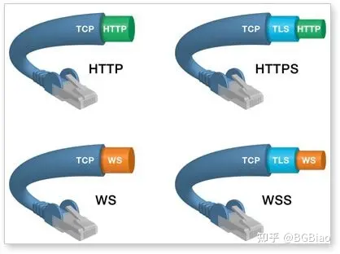
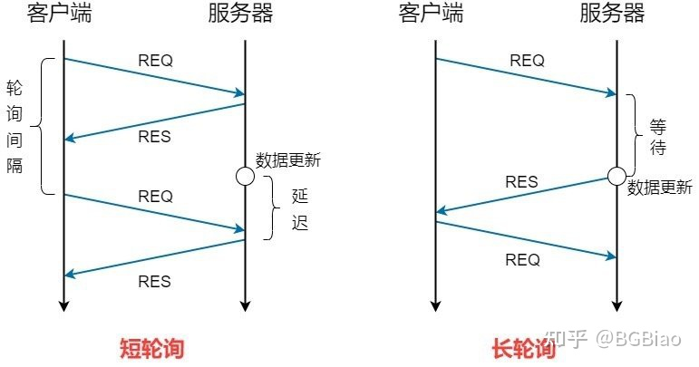
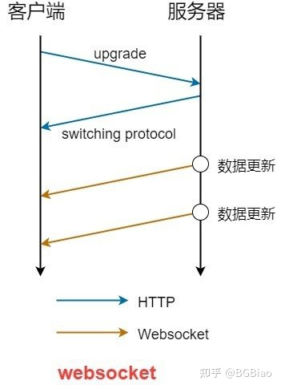
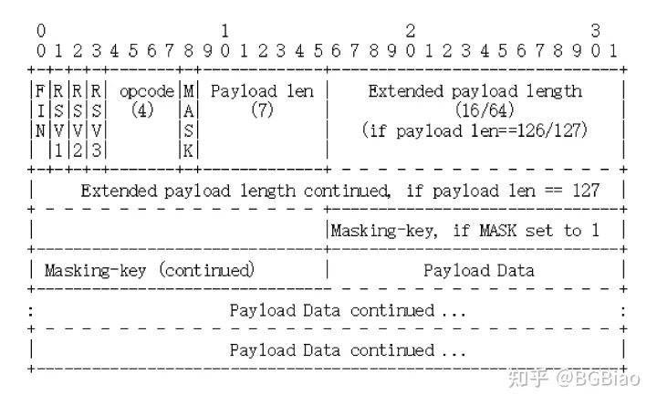
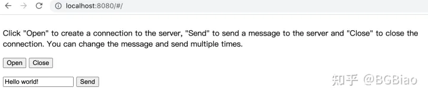
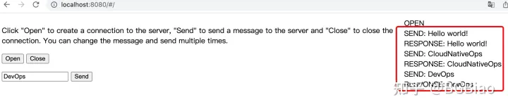
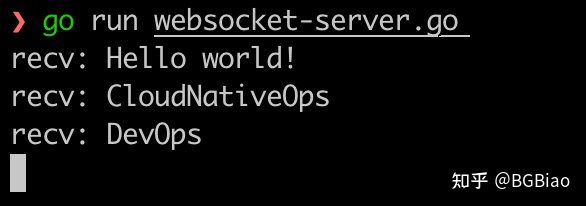
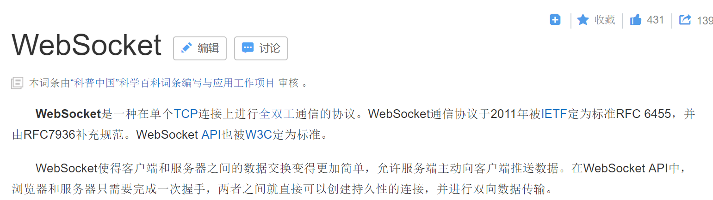

# 初识 WebSocket 以及 Golang 实现
来源：https://zhuanlan.zhihu.com/p/562979956

## 一、 WebSocket 介绍
### 1.1 WebSocket 的诞生背景
在网络冲浪中，我们接触到最多的协议必定是 HTTP/HTTPS 协议，这两种协议的工作原理可简述为：客户端通过浏览器发送一个请求，服务器在接受到请求后进行处理并将得到的结果返回给客户端，由客户端处理结果。可见其主要为一种 “拉取” 信息的形式。

随着时代的发展，出现了一些需要实时发送信息的场景，比如体育实况更新、金融证券的实时信息、实时数据监控等。而如何实现 “推送” 信息的形式呢？在 WebSocket 还未诞生的时候，采用的是轮询技术来实现信息的推送：每间隔一定的时间，浏览器自动发送一个 HTTP 请求，以此主动拉取服务器的最新消息。使用轮询技术，需要不停向服务器发送 HTTP 请求，这样会占用很多的带宽和服务器资源，并且还是不能实现服务器主动向客户端推送数据。

在上述背景下，一种全双工的通信协议 WebSocket 应运而生，它实现了服务端主动向客户端推送数据，使得客户端与服务器间的信息交互更为便捷。

### 1.2 WebSocket 的概念
WebSocket 是一种基于 TCP 的网络通信协议，可在单个 TCP 连接上进行全双工通信，位于 OSI 7 层模型的应用层。WebSocket 使用 ws 或 wss 的统一资源标志符（URI），例如：` ws://localhost:8080/test `， 其中 wss 表示基于 TLS 的 WebSocket。默认情况下 WebSocket 协议使用 80 端口；若运行在 TLS 之上时，则默认使用 443 端口。




### 1.3 WebSocket 与 HTTP 的关系
* WebSocket 与 HTTP 协议一样都是基于 TCP 的，二者均为可靠的通信协议。
* WebSocket 与 HTTP 协议均为应用层协议，但 WebSocket 是一种独立于 HTTP 的协议。
* WebSocket 在建立握手连接时，数据是通过 HTTP 协议传输的。
* WebSocket 建立好连接后，真正通信阶段的数据传输不依赖于 HTTP 协议。

### 1.4 WebSocket 与 HTTP 轮询技术的对比
HTTP 实现实时 “推送” 用到的轮询技术主要分为两种：短轮询与长轮询。

短轮询：客户端每间隔特定时间向服务器发送 HTTP 请求拉取数据，而服务器收到请求后不管是否有新的数据信息都直接响应请求。可见短轮询有如下缺点：不必要请求过多，浪费带宽与服务器资源；并不能获得真正实时信息，除非服务器数据更新的间隔时间固定且等于设置的轮询间隔时间，否则服务器响应相对于数据更新必定存在一定的延迟时间。

长轮询：客户端向服务器发起 HTTP 请求后，服务器一直保持连接打开并阻塞，直到服务器有新数据更新并可以发送，或者等待一定时间直至超时后才会返回。收到服务器的响应后浏览器关闭连接，随即又向服务器发起一个新的请求。上述过程在浏览器页面打开期间一直持续不断。长轮询虽然减少了请求量，并且不再存在延时；但在未有数据更新时会长时间霸占服务器资源，造成服务器资源浪费，实时交互能力也不够强。


WebSocket 是一种 TCP 长连接通讯模式。在 WebSocket 连接建立后，数据都以帧序列的形式传输。在客户端断开 WebSocket 连接或服务端中断连接前，不需要客户端和服务端重新发起连接请求。在海量并发及客户端与服务器交互负载流量大的情况下，极大的节省了网络带宽资源的消耗，有明显的性能优势。由于是全双工模式，接收与发送均在同一信道进行，服务器可以在数据更新时主动推送消息给客户端，实时性好。




### 1.5 WebSocket 与 HTTP2.0 对比
* WebSocket 是直接从服务器将数据推送给 Web App 的。
* HTTP2.0 所支持的 Server Push 是主动将资源推送到客户端缓存，并不允许将数据推送到客户端的 Web App 。例如，在浏览器请求某个 html 时，除了将 html 响应给客户端，还将 css、png 等网页所需的全部资源文件推送给浏览器。Server Push 只能由浏览器处理，不会在应用程序代码中弹出服务器数据，因此应用程序没有 API 来获取这些事件的通知。

### 1.6 WebSocket 的帧
WebSocket 使用了自定义的二进制分帧格式，将每个应用消息切分成一个或多个帧，对端等到接收到完整的消息后再进行组装与处理。



* FIN ：1 bit 表示消息结束标志位。0 表示还有后续帧， 1 表示最后一帧。一个消息可能拆分成多个帧，接收方判断为最后一帧后将前面的帧拼接组成消息。
* RSV1 、 RSV2 、 RSV3 ：1 bit 保留字段，除非一个扩展经过协商赋予了非零值的某种含义，否则必须为 0。
* opcode ：4 bit 解释 payload data 的类型。如果收到识别不了的 opcode，会直接断开。0 表示连续的帧； 1 表示 text（纯文本）帧； 2 表示 binary（二进制）帧 ； 8 表示 close（关闭连接）帧； 9 表示 ping 帧 ；10 表示 pong 帧；其余为非控制帧而预留。ping/pong 类型帧是为了在长时间无消息通信时，检测连接是否断开，目前只能由服务器发 ping 给浏览器，浏览器返回 pong 消息。
* MASK ：1 bit 标识 Payload data 是否经过掩码处理，如果是 1，Masking-key 域的数据即为掩码密钥，用于解码 Payload data。在标准规定，客户端发送数据必须使用掩码，而服务器发送则一定不使用掩码。
* Payload len ：7 bit | 7+16 bit | 7+64 bit 表示了 “有效负荷数据 Payload data” 的长度：（1）如果是 0~125，那么就直接表示了 payload 长度 （2） 如果是 126，那么接下来的两个字节表示的 16 位无符号整型数的值就是 payload 长度 （3）如果是 127，那么接下来的八个字节表示的 64 位无符号整型数的值就是 payload 长度
* Masking-key ：0 | 4 bytes 掩码密钥。所有从客户端发送到服务端的帧都包含一个 32bits 的掩码（如果 mask 被设置成 1），否则为 0。一旦掩码被设置，所有接收到的 payload data 都必须与该值以一种算法做异或运算来获取真实值。
* Payload data ：(x+y) bytes 它是 Extension data 和 Application data 数据的总和，但是一般扩展数据为空。
* Extension data ：x bytes 除非扩展被定义，否则就是 0
* Application data ：y bytes 占据 Extension data 后面的所有空间

### 1.7 Websocket 建立连接的步骤
首先客户端与服务器建立 TCP 连接，进行三次握手。这发生于传输层，是网络通信的基础，如果失败则后续步骤将不再执行。

当 TCP 连接成功后，进行 HTTP 的通信握手。

客户端通过 HTTP 协议向服务器传送带有 WebSocket 支持的版本号等信息的握手请求。

服务器收到客户端的握手请求后，同样采用 HTTP 协议返回应答消息。

当客户端收到了连接成功的应答消息之后，持续通过 TCP 通道进行传输通信。

也就是说 WebSocket 在建立握手时，连接信息是通过 HTTP 传输的。但是建立之后，在真正传输通信数据时候是不需要 HTTP 协议的。

一次 WebSocket 的握手请求与应答的典型报文如下：

WebSocket 浏览器（客户端）连接报文

```
GET /websocket/ HTTP/1.1
Host: localhost
Upgrade: websocket
Connection: Upgrade
Sec-WebSocket-Key: xqBt3ImNzJbYqRINxEFlkg==
Origin: http://localhost:8080
Sec-WebSocket-Version: 13
```

从上述报文中可以看出，浏览器（客户端）发起的 WebSocket 连接报文与传统 HTTP 报文类似。值得注意的是，从第一行中可见，连接报文一定是 GET 方法，且必须基于 HTTP/1.1。

第三行中，Upgrade：websocket 参数值表明这是 WebSocket 类型的请求。

第四行中，Connection: Upgrade 表明本次通信要对 HTTP 协议进行升级。结合三四行，即表明本次通信需要将 HTTP 协议升级至 WebSocket 协议。

为了防止普通的 HTTP 消息被 “意外” 识别成 WebSocket，握手消息还增加了两个额外的认证用途的字段。

Sec-WebSocket-Key 是 WebSocket 客户端发送的一个 base64 编码的密文，要求服务端必须返回一个对应加密的 Sec-WebSocket-Accept 应答，否则客户端会抛出 “Error during WebSocket handshake” 错误，并关闭连接。

Sec-WebSocket-Version：协议的版本号，当前必须是 13 。

服务器收到 HTTP 请求报文，看到上述 4 个特殊字段，知道这是 WebSocket 的升级请求，于是就不执行普通的 HTTP 处理流程，而是构造一个特殊的应答报文：
```
HTTP/1.1 101 Switching Protocols
Upgrade: websocket
Connection: Upgrade
Sec-WebSocket-Accept:K7DJLdLooIwIG/MOpvWFB3y3FE8=
```

`HTTP/1.1 101 Switching Protocols`，101 为升级成功的返回码，表示服务器接受 WebSocket 协议的客户端连接，双方握手成功，之后切换为 WebSocket 协议进行通信。

Sec-WebSocket-Accept 的值是服务端采用与客户端一致的密钥计算出来后返回客户端的，该字段是为了验证客户端请求报文，防止误连接。

## 二、WebSocket 的 Golang 实现
开源社区中有几个比较好的 Golang 库，本文选择基于 gorilla/websocket（https://github.com/gorilla/websocket ） 进行构建 WebSocket服务。

一个简单的demo：
```golang
var upgrader = websocket.Upgrader{
	 ReadBufferSize:  1024,
	 WriteBufferSize: 1024,
}

func handler(w http.ResponseWriter, r *http.Request) {
	 conn, err := upgrader.Upgrade(w, r, nil)
	 if err != nil {
		  log.Println(err)
		  return
	 }

	 for {
		  messageType, p, err := conn.ReadMessage()
		  if err != nil {
			   log.Println(err)
			   return
		  }
		  if err := conn.WriteMessage(messageType, p); err != nil {
			   log.Println(err)
			   return
		  }
	 }
}
```

首先，需要初始化一个 Upgrader 对象
```golang
type Upgrader struct {
	 HandshakeTimeout time.Duration //握手超时时间

	 ReadBufferSize, WriteBufferSize int //读、写缓冲区大小（默认4096字节）

	 WriteBufferPool BufferPool //写缓冲区池

	 Subprotocols []string //子协议

	 Error func(w http.ResponseWriter, r *http.Request, status int, reason error) //错误函数

	 CheckOrigin func(r *http.Request) bool //校验函数

	 EnableCompression bool //是否压缩
}
```

接着，调用 `func (u *Upgrader) Upgrade(w http.ResponseWriter, r *http.Request, responseHeader http.Header) (*Conn, error)` 函数，将 HTTP 协议升级到 WebSocket 协议，即构造握手请求中服务器响应的过程。升级成功会返回一个 Conn 对象，此后将用 Conn 中的方法去进行数据通信。
```golang
func (u *Upgrader) Upgrade(w http.ResponseWriter, r *http.Request, responseHeader http.Header) (*Conn, error) {
	 ...
	 c := newConn(netConn, true, u.ReadBufferSize, u.WriteBufferSize, u.WriteBufferPool, br, writeBuf)
	 ...

	 p := buf
	 if len(c.writeBuf) > len(p) {
	  	p = c.writeBuf
	 }
	 p = p[:0]
	 p = append(p, "HTTP/1.1 101 Switching Protocols\r\nUpgrade: websocket\r\nConnection: Upgrade\r\nSec-WebSocket-Accept: "...)
	 ...
	 p = append(p, "\r\n"...)
	 // Clear deadlines set by HTTP server.   netConn.SetDeadline(time.Time{})
	 if u.HandshakeTimeout > 0 {
	  	netConn.SetWriteDeadline(time.Now().Add(u.HandshakeTimeout))
	 }
	 if _, err = netConn.Write(p); err != nil {
		  netConn.Close()
		  return nil, err
	 }
	 if u.HandshakeTimeout > 0 {
	  	netConn.SetWriteDeadline(time.Time{})
	 }
	 return c, nil
}
```
读取消息可以使用 `func (c *Conn) ReadMessage() (messageType int, p []byte, err error)` 方法，它会从读缓冲区中读取消息并返回，同时也返回消息类型 (Text, Binary, Close, Ping and Pong)。该函数会阻塞线程。

发送消息可以使用 `func (c *Conn) WriteMessage(messageType int, data []byte) error` 方法，它会向写缓冲区中写入消息。

除上述两个读写通用接口外，Conn 还提供了 `func (c *Conn) ReadJSON(v interface{}) error 与 func (c *Conn) WriteJSON(v interface{}) error` 两个接口，方便收发 json 消息。

该库中还提供了 Dialer 结构体和 `func (d *Dialer) Dial(urlStr string, requestHeader http.Header) (*Conn, *http.Response, error)` 方法，实现了作为客户端拨号连接至对应的 WebSocket 服务器。

```golang
u := url.URL{Scheme: "ws", Host: "10.0.0.1:6666", Path: /WS, RawQuery: ""}
ws_c, _, err := websocket.DefaultDialer.Dial(u.String(), nil)
```

## 三、一个完整的示例
```golang
package main

import (
 "flag"
 "html/template"
 "log"
 "net/http"

 "github.com/gorilla/websocket"
)

var addr = flag.String("addr", "localhost:8080", "http service address")

var upgrader = websocket.Upgrader{} // use default options

func echo(w http.ResponseWriter, r *http.Request) {
 c, err := upgrader.Upgrade(w, r, nil)
 if err != nil {
  log.Print("upgrade:", err)
  return
 }
 defer c.Close()
 for {
  mt, message, err := c.ReadMessage()
  if err != nil {
   log.Println("read:", err)
   break
  }
  log.Printf("recv: %s", message)
  err = c.WriteMessage(mt, message)
  if err != nil {
   log.Println("write:", err)
   break
  }
 }
}

func home(w http.ResponseWriter, r *http.Request) {
 homeTemplate.Execute(w, "ws://"+r.Host+"/echo")
}

func main() {
 flag.Parse()
 log.SetFlags(0)
 http.HandleFunc("/echo", echo)
 http.HandleFunc("/", home)
 log.Fatal(http.ListenAndServe(*addr, nil))
}

var homeTemplate = template.Must(template.New("").Parse(`
<!DOCTYPE html>
<html>
<head>
<meta charset="utf-8">
<script>
window.addEventListener("load", function(evt) {
    var output = document.getElementById("output");
    var input = document.getElementById("input");
    var ws;
    var print = function(message) {
        var d = document.createElement("div");
        d.textContent = message;
        output.appendChild(d);
        output.scroll(0, output.scrollHeight);
    };
    document.getElementById("open").onclick = function(evt) {
        if (ws) {
            return false;
        }
        ws = new WebSocket("{{.}}");
        ws.onopen = function(evt) {
            print("OPEN");
        }
        ws.onclose = function(evt) {
            print("CLOSE");
            ws = null;
        }
        ws.onmessage = function(evt) {
            print("RESPONSE: " + evt.data);
        }
        ws.onerror = function(evt) {
            print("ERROR: " + evt.data);
        }
        return false;
    };
    document.getElementById("send").onclick = function(evt) {
        if (!ws) {
            return false;
        }
        print("SEND: " + input.value);
        ws.send(input.value);
        return false;
    };
    document.getElementById("close").onclick = function(evt) {
        if (!ws) {
            return false;
        }
        ws.close();
        return false;
    };
});
</script>
</head>
<body>
<table>
<tr><td valign="top" width="50%">
<p>Click "Open" to create a connection to the server,
"Send" to send a message to the server and "Close" to close the connection.
You can change the message and send multiple times.
<p>
<form>
<button id="open">Open</button>
<button id="close">Close</button>
<p><input id="input" type="text" value="Hello world!">
<button id="send">Send</button>
</form>
</td><td valign="top" width="50%">
<div id="output" style="max-height: 70vh;overflow-y: scroll;"></div>
</td></tr></table>
</body>
</html>
`))
```

上面代码是官方的 WebSocket 示例，内部包含了一个简单的 HTTP Client端，当我们正常运行时，访问 http://127.0.0.1:8080 将会有如下页面。



当我们开始通过网页往服务端发送 WebSocket 消息时，会实时显示消息状态。






# Gin框架
## 第一个Gin示例
```golang
package main

import (
	"github.com/gin-gonic/gin"
)

func main() {
	// 创建一个默认的路由引擎
	r := gin.Default()
	// GET：请求方式；/hello：请求的路径
	// 当客户端以GET方法请求/hello路径时，会执行后面的匿名函数
	r.GET("/hello", func(c *gin.Context) {
		// c.JSON：返回JSON格式的数据
		//gin.H 是map[string]interface{}的缩写
		c.JSON(200, gin.H{
			"message": "Hello world!",
		})
	})
	// 启动HTTP服务，默认在0.0.0.0:8080启动服务
	r.Run()
}
```

## Gin渲染
### JSON渲染
```golang
func main() {
	r := gin.Default()

	// gin.H 是map[string]interface{}的缩写
	r.GET("/someJSON", func(c *gin.Context) {
		// 方式一：自己拼接JSON
		c.JSON(http.StatusOK, gin.H{"message": "Hello world!"})
	})
	r.GET("/moreJSON", func(c *gin.Context) {
		// 方法二：使用结构体
		var msg struct {
			Name    string `json:"user"`
			Message string
			Age     int
		}
		msg.Name = "小王子"
		msg.Message = "Hello world!"
		msg.Age = 18
		c.JSON(http.StatusOK, msg)
	})
	r.Run(":8080")
}
```
### protobuf渲染
```golang
r.GET("/someProtoBuf", func(c *gin.Context) {
	reps := []int64{int64(1), int64(2)}
	label := "test"
	// protobuf 的具体定义写在 testdata/protoexample 文件中。
	data := &protoexample.Test{
		Label: &label,
		Reps:  reps,
	}
	// 请注意，数据在响应中变为二进制数据
	// 将输出被 protoexample.Test protobuf 序列化了的数据
	c.ProtoBuf(http.StatusOK, data)
})
```

## 获取参数
### 获取querystring参数
`querystring`指的是URL中`?`后面携带的参数，例如：`/user/search?username=小王子&address=沙河`。 获取请求的querystring参数的方法如下：
```golang
func main() {
	//Default返回一个默认的路由引擎
	r := gin.Default()
	r.GET("/user/search", func(c *gin.Context) {
		//取不到就用默认值
		username := c.DefaultQuery("username", "小王子")
		//username := c.Query("username")
		
		address := c.Query("address")
		//输出json结果给调用方
		c.JSON(http.StatusOK, gin.H{
			"message":  "ok",
			"username": username,
			"address":  address,
		})
	})
	r.Run()
}
```


# TCP和Websocket协议的区别
来源：https://blog.csdn.net/feikudai8460/article/details/109390878?spm=1001.2101.3001.6661.1&utm_medium=distribute.pc_relevant_t0.none-task-blog-2%7Edefault%7ECTRLIST%7ERate-1-109390878-blog-117151267.235%5Ev38%5Epc_relevant_anti_t3&depth_1-utm_source=distribute.pc_relevant_t0.none-task-blog-2%7Edefault%7ECTRLIST%7ERate-1-109390878-blog-117151267.235%5Ev38%5Epc_relevant_anti_t3&utm_relevant_index=1

先习惯性的看了下某中文百科网站对Web Socket的介绍，觉得很囧。如果大家按照这个答案去参加BAT等互联网公司的前端开发面试，估计会被鄙视。


还是让我们阅读一些英文材料吧。

让我们直接看stackoverflow上的原文，然后翻译：
**Differences between TCP sockets and web sockets, one more time [ duplicate ]**

https://stackoverflow.com/questions/16945345/differences-between-tcp-sockets-and-web-sockets-one-more-time

>When you send bytes from a buffer with a normal TCP socket, the send function returns the number of bytes of the buffer that were sent. 
>If it is a non-blocking socket or a non-blocking send then the number of bytes sent may be less than the size of the buffer. 
>If it is a blocking socket or blocking send, then the number returned will match the size of the buffer but the call may block. 
>With WebSockets, the data that is passed to the send method is always either sent as a whole "message" or not at all. Also, browser WebSocket implementations do not block on the send call.

当您使用普通TCP套接字从缓冲区发送字节时，send函数会返回已发送的缓冲区的字节数。
如果是非阻塞套接字或非阻塞发送，则发送的字节数可能小于缓冲区的大小。
如果是阻塞套接字或阻塞发送，则返回的数字将与缓冲区的大小匹配，但调用可能会阻塞。
使用WebSockets，传递给send方法的数据总是作为一个完整的“消息”发送，或者根本不发送。此外，浏览器WebSocket实现不会阻止发送调用。（==不存在像TCP套接字非阻塞操作那样出现部分发送的情况。换言之，Web Socket里对套接字的操作是非阻塞操作。==）

再来看接收方的区别：
>But there are more important differences on the receiving side of things. 
>When the receiver does a recv (or read) on a TCP socket, there is no guarantee that the number of bytes returned corresponds to a single send (or write) on the sender side. It might be the same, it may be less (or zero) and it might even be more (in which case bytes from multiple send/writes are received). 
>With WebSockets, the recipient of a message is event-driven (you generally register a message handler routine), and the data in the event is always the entire message that the other side sent.

但在事物的接受方，还有更重要的差异。
当接收方在TCP套接字上进行recv（或读取）时，无法保证返回的字节数与发送方的单个发送（或写入）相对应。它可能是相同的，可能更少（或零），甚至可能更多（在这种情况下，接收来自多个发送/写入的字节）。
使用WebSockets，消息的接收方是事件驱动的（通常注册一个消息处理程序例程），事件中的数据始终是对方发送的整个消息。
（同理，在TCP套接字的场景下，接收方从TCP套接字读取的字节数，并不一定等于发送方调用send所发送的字节数。而WebSocket呢？WebSocket的接收方从套接字读取数据，根本不是像TCP 套接字那样直接用recv/read来读取, 而是采取事件驱动机制。即应用程序注册一个事件处理函数，当web socket的发送方发送的数据在接收方应用从内核缓冲区拷贝到应用程序层已经处于可用状态时 ，应用程序注册的事件处理函数以回调(callback)的方式被调用。）


>Note that you can do message based communication using TCP sockets, but you need some extra layer/encapsulation that is adding framing/message boundary data to the messages so that the original messages can be re-assembled from the pieces. In fact, WebSockets is built on normal TCP sockets and uses frame headers that contains the size of each frame and indicate which frames are part of a message. The WebSocket API re-assembles the TCP chunks of data into frames which are assembled into messages before invoking the message event handler once per message.

请注意，您可以使用TCP套接字进行基于消息的通信，但您需要一些额外的层/封装，将帧/消息边界数据添加到消息中，以便可以从这些片段重新组装原始消息。事实上，WebSockets构建在普通TCP套接字上，并使用帧头，该帧头包含每个帧的大小，并指示哪些帧是消息的一部分。WebSocket API在每个消息调用一次消息事件处理程序之前，将TCP数据块重新组合成帧，这些帧被组合成消息。