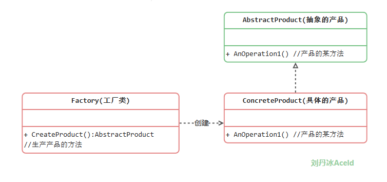
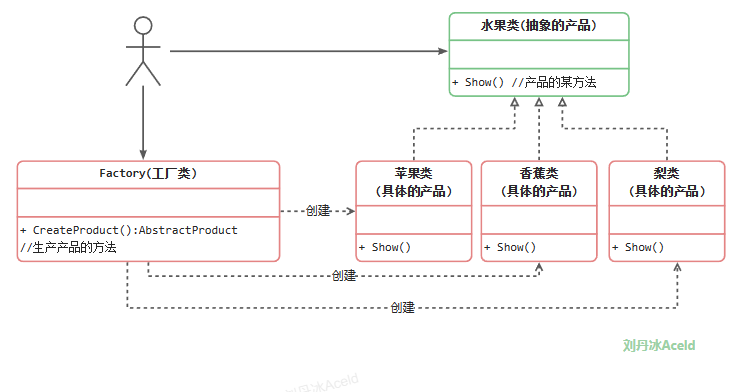
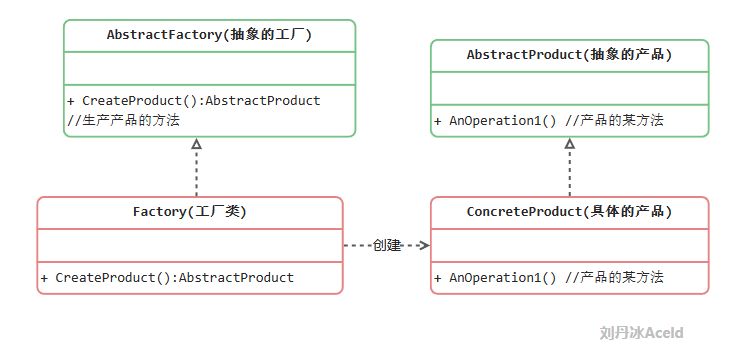
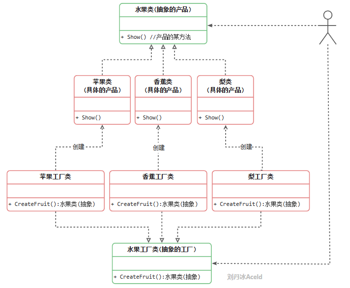
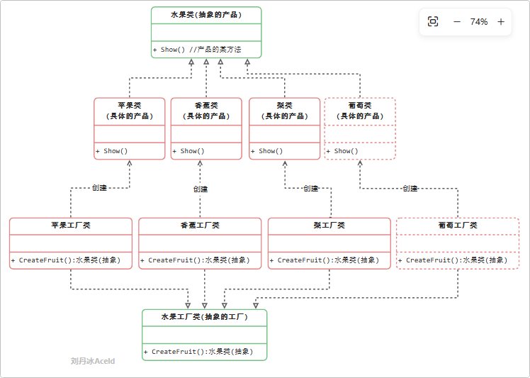
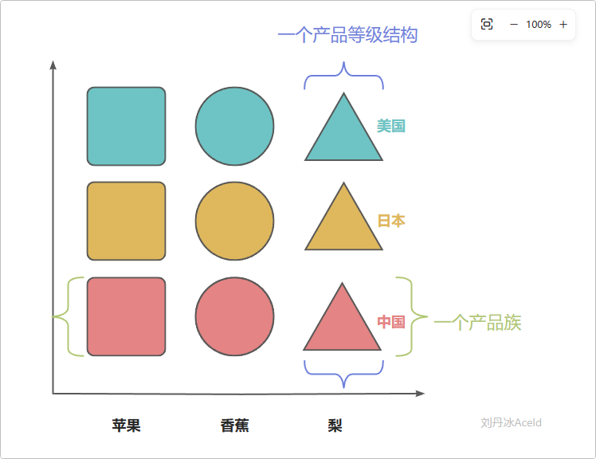
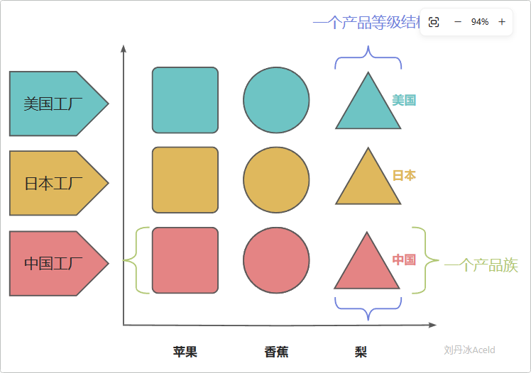
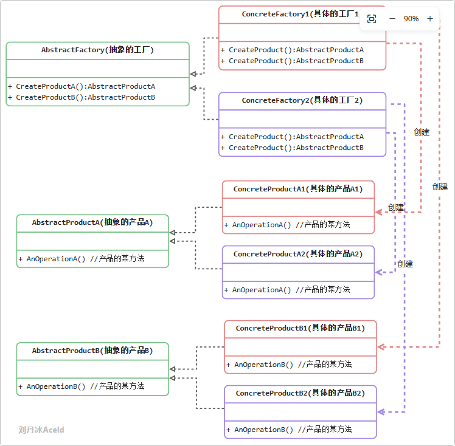

# 面向对象设计原则
对于面向对象软件系统的设计而言，在支持可维护性的同时，提高系统的可复用性是一个至关重要的问题，==如何同时提高一个软件系统的可维护性和可复用性是面向对象设计需要解决的核心问题之一==。在面向对象设计中，可维护性的复用是以设计原则为基础的。每一个原则都蕴含一些面向对象设计的思想，可以从不同的角度提升一个软件结构的设计水平。

==面向对象设计原则为支持可维护性复用而诞生，这些原则蕴含在很多设计模式中，它们是从许多设计方案中总结出的指导性原则==。面向对象设计原则也是我们用于评价一个设计模式的使用效果的重要指标之一。

==原则的目的： 高内聚，低耦合==

# 面向对象设计原则表
* 单一职责原则 (Single Responsibility Principle, SRP)
★★★★☆
类的职责单一，对外只提供一种功能，而引起类变化的原因都应该只有一个。

* 开闭原则 (Open-Closed Principle, OCP)
★★★★★
**类的改动是通过增加代码进行的，而不是修改源代码。**

* 里氏代换原则 (Liskov Substitution Principle, LSP)
★★★★★
任何抽象类（interface接口）出现的地方都可以用他的实现类进行替换，实际就是虚拟机制，语言级别实现面向对象功能。

* 依赖倒转原则 (Dependence  Inversion Principle, DIP)
★★★★★
**依赖于抽象(接口)，不要依赖具体的实现(类)，也就是针对接口编程。**

* 接口隔离原则 (Interface Segregation Principle, ISP)
★★☆☆☆
不应该强迫用户的程序依赖他们不需要的接口方法。一个接口应该只提供一种对外功能，不应该把所有操作都封装到一个接口中去。

* 合成复用原则 (Composite Reuse Principle, CRP)
★★★★☆
如果使用继承，会导致父类的任何变换都可能影响到子类的行为。如果使用对象组合，就降低了这种依赖关系。对于继承和组合，优先使用组合。

* 迪米特法则 (Law of Demeter, LoD)
★★★☆☆
**一个对象应当对其他对象尽可能少的了解，从而降低各个对象之间的耦合，提高系统的可维护性。例如在一个程序中，各个模块之间相互调用时，通常会提供一个统一的接口来实现。这样其他模块不需要了解另外一个模块的内部实现细节，这样当一个模块内部的实现发生改变时，不会影响其他模块的使用。（黑盒原理）**

# 创建型模式
* 单例模式
★★★★☆
是保证一个类仅有一个实例，并提供一个访问它的全局访问点。

* 简单工厂模式
★★★☆☆
通过专门定义一个类来负责创建其他类的实例，被创建的实例通常都具有共同的父类。

* 工厂方法模式
★★★★★
定义一个创建产品对象的工厂接口，将实际创建工作推迟到子类中。

* 抽象工厂模式
★★★★★
提供一个创建一系列相关或者相互依赖的接口，而无需指定它们具体的类。

* 原型模式
用原型实例指定创建对象的种类，并且通过拷贝这些原型创建新的对象。

* 建造者模式
将一个复杂的构建与其表示相分离，使得同样的构建过程可以创建不同的表示。

目前标准的创建型设计模式共有6种（注：设计模式种类并非仅仅局限于此，设计模式实则是一种编程思想，开发者可以根据自身经验来总结出很多种设计模式思想，这6中创建型设计模式为早期官方认可的标准模式）。
本章节主要介绍常用的“单例模式”、“简单工程模式”、“工厂方法模式”、“抽象工厂模式”等。“原型模式”、“建造者模式”思想类似，作为读者选修篇幅，本章暂时先不介绍。

## 单例模式
### 饿汉单例实现
```golang
package main

import "fmt"

//1、保证这个类非公有化，外界不能通过这个类直接创建一个对象
//   那么这个类就应该变得非公有访问 类名称首字母要小写
type singelton struct {}

//2、但是还要有一个指针可以指向这个唯一对象，但是这个指针永远不能改变方向
//   Golang中没有常指针概念，所以只能通过将这个指针私有化不让外部模块访问
var instance *singelton = new(singelton)

//3、如果全部为私有化，那么外部模块将永远无法访问到这个类和对象，
//   所以需要对外提供一个方法来获取这个唯一实例对象
//   注意：这个方法是否可以定义为singelton的一个成员方法呢？
//       答案是不能，因为如果为成员方法就必须要先访问对象、再访问函数
//        但是类和对象目前都已经私有化，外界无法访问，所以这个方法一定是一个全局普通函数
func GetInstance() *singelton {
	return instance
}

func (s *singelton) SomeThing() {
	fmt.Println("单例对象的某方法")
}

func main() {
	s := GetInstance()
	s.SomeThing()
}
```
### 懒汉单例实现
```golang
package main

import "fmt"

type singelton struct {}

var instance *singelton

func GetInstance() *singelton {
	//只有首次GetInstance()方法被调用，才会生成这个单例的实例
	if instance == nil {
		instance = new(singelton)
		return instance
	}

	//接下来的GetInstance直接返回已经申请的实例即可
	return instance
}

func (s *singelton) SomeThing() {
	fmt.Println("单例对象的某方法")
}

func main() {
	s := GetInstance()
	s.SomeThing()
}
```
### 线程安全的单例模式实现
上面的“懒汉式”实现是非线程安全的设计方式，也就是如果多个线程或者协程同时首次调用GetInstance()方法有概率导致多个实例被创建，则违背了单例的设计初衷。那么在上面的基础上进行修改，可以利用Sync.Mutex进行加锁，保证线程安全。这种线程安全的写法，有个最大的缺点就是每次调用该方法时都需要进行锁操作，在性能上相对不高效，具体的实现改进如下：
```golang
package main

import (
	"fmt"
	"sync"
)

//定义锁
var lock sync.Mutex

type singelton struct {}

var instance *singelton

func GetInstance() *singelton {
	//为了线程安全，增加互斥
	lock.Lock()
	defer lock.Unlock()

	if instance == nil {
		return new(singelton)
	} else {
		return instance
	}
}

func (s *singelton) SomeThing() {
	fmt.Println("单例对象的某方法")
}


func main() {
	s := GetInstance()
	s.SomeThing()
}
```

上面代码虽然解决了线程安全，但是每次调用GetInstance()都要加锁会极大影响性能。所以接下来可以借助"sync/atomic"来进行内存的状态存留来做互斥。atomic就可以自动加载和设置标记，代码如下：
```golang
package main

import (
	"fmt"
	"sync"
	"sync/atomic"
)

//标记
var initialized uint32
var lock sync.Mutex

type singelton struct {}

var instance *singelton

func GetInstance() *singelton {
	//如果标记为被设置，直接返回，不加锁
	if atomic.LoadUint32(&initialized) == 1 {
		return instance
	}

	//如果没有，则加锁申请
	lock.Lock()
	defer lock.Unlock()

	if initialized == 0 {
		instance = new(singelton)
		//设置标记位
		atomic.StoreUint32(&initialized, 1)
	}

	return instance
}

func (s *singelton) SomeThing() {
	fmt.Println("单例对象的某方法")
}

func main() {
	s := GetInstance()
	s.SomeThing()
}
```

上述的实现其实Golang有个方法已经帮助开发者实现完成，就是Once模块，来看下Once.Do()方法的源代码：
```golang
func (o *Once) Do(f func()) {　　　//判断是否执行过该方法，如果执行过则不执行
    if atomic.LoadUint32(&o.done) == 1 {
        return
    }
    // Slow-path.
    o.m.Lock()
    defer o.m.Unlock()　　
    if o.done == 0 {
        defer atomic.StoreUint32(&o.done, 1)
        f()
    }
}
```
所以完全可以借助Once来实现单例模式的实现，优化的代码如下：
```golang
package main

import (
	"fmt"
	"sync"
)

var once sync.Once

type singelton struct {}

var instance *singelton

func GetInstance() *singelton {

	once.Do(func(){
		instance = new(singelton)
	})

	return instance
}

func (s *singelton) SomeThing() {
	fmt.Println("单例对象的某方法")
}

func main() {
	s := GetInstance()
	s.SomeThing()
}
```

### 单例模式的优缺点
优点：
(1) 单例模式提供了对唯一实例的受控访问。
(2) 节约系统资源。由于在系统内存中只存在一个对象。    

缺点：
(1) 扩展略难。单例模式中没有抽象层。
(2) 单例类的职责过重。   

### 适用场景
(1) 系统只需要一个实例对象，如系统要求提供一个唯一的序列号生成器或资源管理器，或者需要考虑资源消耗太大而只允许创建一个对象。
(2) 客户调用类的单个实例只允许使用一个公共访问点，除了该公共访问点，不能通过其他途径访问该实例。

## 简单工厂模式
### 简单工厂模式角色和职责
简单工厂模式并不属于GoF的23种设计模式。他是开发者自发认为的一种非常简易的设计模式，其角色和职责如下：
* **工厂（Factory）角色**：简单工厂模式的核心，它负责实现创建所有实例的内部逻辑。工厂类可以被外界直接调用，创建所需的产品对象。
* **抽象产品（AbstractProduct）角色**：简单工厂模式所创建的所有对象的父类，它负责描述所有实例所共有的公共接口。
* **具体产品（Concrete Product）角色**：简单工厂模式所创建的具体实例对象。

其标准的设计模式类图如下：



### 简单工厂模式实现
根据本章节的案例可以将标准的“简单工厂模式”类图改进如下：




### 简单工厂模式的优缺点
优点：
1. 实现了对象创建和使用的分离。
2. 不需要记住具体类名，记住参数即可，减少使用者记忆量。

缺点：
1. 对工厂类职责过重，一旦不能工作，系统受到影响。
2. 增加系统中类的个数，复杂度和理解度增加。
3. 违反“开闭原则”，添加新产品需要修改工厂逻辑，工厂越来越复杂。

### 简单工厂模式的适用场景
1.  工厂类负责创建的对象比较少，由于创建的对象较少，不会造成工厂方法中的业务逻辑太过复杂。
2. 客户端只知道传入工厂类的参数，对于如何创建对象并不关心。
	
## 工厂方法模式
### 工厂方法模式中的角色和职责
* **抽象工厂（Abstract Factory）角色**：工厂方法模式的核心，任何工厂类都必须实现这个接口。
* **工厂（Concrete Factory）角色**：具体工厂类是抽象工厂的一个实现，负责实例化产品对象。
* **抽象产品（Abstract Product）角色**：工厂方法模式所创建的所有对象的父类，它负责描述所有实例所共有的公共接口。	
* **具体产品（Concrete Product）角色**：工厂方法模式所创建的具体实例对象。

工厂方法模式 = 简单工厂模式  + “开闭原则”

工厂方法模式的标准类图如下：



### 工厂方法模式的实现
根据本章节的案例可以将标准的“工厂方法模式”类图改进如下：



### 工厂方法模式的优缺点
优点：
1. 不需要记住具体类名，甚至连具体参数都不用记忆。
2. 实现了对象创建和使用的分离。
3. 系统的可扩展性也就变得非常好，无需修改接口和原类。
4.对于新产品的创建，符合开闭原则。

缺点：
1. 增加系统中类的个数，复杂度和理解度增加。
2. 增加了系统的抽象性和理解难度。

### 工厂方法模式的适用场景
1. 客户端不知道它所需要的对象的类。
2. 抽象工厂类通过其子类来指定创建哪个对象。

## 抽象工厂模式


从工厂方法模式可以看出来：
（1）当添加一个新产品的时候，比如葡萄，虽然不用修改代码，但是需要添加大量的类，而且还需要添加相对的工厂。（系统开销，维护成本）
（2）如果使用同一地域的水果（日本苹果，日本香蕉，日本梨），那么需要分别创建具体的工厂，如果选择出现失误，将会造成混乱，虽然可以加一些约束，但是代码实现变得复杂。
所以“抽象工厂方法模式”引出了“产品族”和“产品等级结构”概念，其目的是为了更加高效的生产同一个产品组产品。
### 产品族与产品等级结构


上图表示“产品族”和“产品登记结构”的关系。
产品族：具有同一个地区、同一个厂商、同一个开发包、同一个组织模块等，但是具备不同特点或功能的产品集合，称之为是一个产品族。
产品等级结构：具有相同特点或功能，但是来自不同的地区、不同的厂商、不同的开发包、不同的组织模块等的产品集合，称之为是一个产品等级结构。
当程序中的对象可以被划分为产品族和产品等级结构之后，那么“抽象工厂方法模式”才可以被适用。
“抽象工厂方法模式”是针对“产品族”进行生产产品，具体如下图所示。



### 抽象工厂模式的角色和职责
* **抽象工厂（Abstract Factory）角色**：它声明了一组用于创建一族产品的方法，每一个方法对应一种产品。
* **具体工厂（Concrete Factory）角色**：它实现了在抽象工厂中声明的创建产品的方法，生成一组具体产品，这些产品构成了一个产品族，每一个产品都位于某个产品等级结构中。
* **抽象产品（Abstract Product）角色**：它为每种产品声明接口，在抽象产品中声明了产品所具有的业务方法。
* **具体产品（Concrete Product）角色**：它定义具体工厂生产的具体产品对象，实现抽象产品接口中声明的业务方法。
  

可以看出来具体的工厂1，只负责生成具体的产品A1和B1，具体的工厂2，只负责生成具体的产品A2和B2。
“工厂1、A1、B1”为一组，是一个产品族， “工厂2、A2、B2”为一组，也是一个产品族。

### 抽象工厂模式的优缺点
优点：
1.  拥有工厂方法模式的优点
2. 当一个产品族中的多个对象被设计成一起工作时，它能够保证客户端始终只使用同一个产品族中的对象。
3   增加新的产品族很方便，无须修改已有系统，符合“开闭原则”。

缺点：
1. 增加新的产品等级结构麻烦，需要对原有系统进行较大的修改，甚至需要修改抽象层代码，这显然会带来较大的不便，违背了“开闭原则”。

### 适用场景
(1) 系统中有多于一个的产品族。而每次只使用其中某一产品族。可以通过配置文件等方式来使得用户可以动态改变产品族，也可以很方便地增加新的产品族。
(2) 产品等级结构稳定。设计完成之后，不会向系统中增加新的产品等级结构或者删除已有的产品等级结构。


# 结构型模式
* 适配器模式
★★★★☆
将一个类的接口转换成客户希望的另外一个接口。使得原本由于接口不兼容而不能一起工作的那些类可以一起工作。

* 桥接模式
★★★☆☆
将抽象部分与实际部分分离，使它们都可以独立的变化。

* 组合模式
★★☆☆☆
将对象组合成树形结构以表示“部分--整体”的层次结构。使得用户对单个对象和组合对象的使用具有一致性。

* 装饰模式
★★★☆☆
动态的给一个对象添加一些额外的职责。就增加功能来说，此模式比生成子类更为灵活。

* 外观模式
★★★★★
为子系统中的一组接口提供一个一致的界面，此模式定义了一个高层接口，这个接口使得这一子系统更加容易使用。

* 享元模式
★☆☆☆☆
以共享的方式高效的支持大量的细粒度的对象。	

* 代理模式
★★★☆
为其他对象提供一种代理以控制对这个对象的访问。


结构型模式的要点是：让类和类进行组合，获得更大的结构。

本章节主要介绍“代理模式”、“装饰模式”、“适配器模式”、“外观模式”等。

### 代理模式

### 装饰模式

### 适配器模式

### 外观模式


# 行为型模式
* 职责链模式
★★☆☆☆
在该模式里，很多对象由每一个对象对其下家的引用而连接起来形成一条链。请求在这个链上传递，直到链上的某一个对象决定处理此请求，这使得系统可以在不影响客户端的情况下动态地重新组织链和分配责任。

* 命令模式
★★★★☆
将一个请求封装为一个对象，从而使你可用不同的请求对客户端进行参数化；对请求排队或记录请求日志，以及支持可撤销的操作。

* 解释器模式
★☆☆☆☆
如何为简单的语言定义一个语法，如何在该语言中表示一个句子，以及如何解释这些句子。

* 迭代器模式
★☆☆☆☆
提供了一种方法顺序来访问一个聚合对象中的各个元素，而又不需要暴露该对象的内部表示。

* 中介者模式
★★☆☆☆
定义一个中介对象来封装系列对象之间的交互。终结者使各个对象不需要显示的相互调用，从而使其耦合性松散，而且可以独立的改变他们之间的交互。

* 备忘录模式
★★☆☆☆
是在不破坏封装的前提下，捕获一个对象的内部状态，并在该对象之外保存这个状态。

* 观察者模式
★★★★★
定义对象间的一种一对多的依赖关系，当一个对象的状态发生改变时，所有依赖于它的对象都得到通知并被自动更新。

* 状态模式
★★☆☆☆
对象的行为，依赖于它所处的状态。

* 策略模式
★★★★☆
准备一组算法，并将每一个算法封装起来，使得它们可以互换。

* 模板方法模式
★★★☆☆
得子类可以不改变一个算法的结构即可重定义该算法的某些特定步骤。

* 访问者模式
★☆☆☆☆
表示一个作用于某对象结构中的各元素的操作，它使你可以在不改变各元素的类的前提下定义作用于这些元素的新操作。


行为型模式是用来对类或对象怎样交互和怎样分配职责进行描述，本章主要介绍“命令模式”、“观察者模式”、“策略模式”、“模板方法模式”等。

### 命令模式

### 观察者模式

### 策略模式

### 模板方法模式
