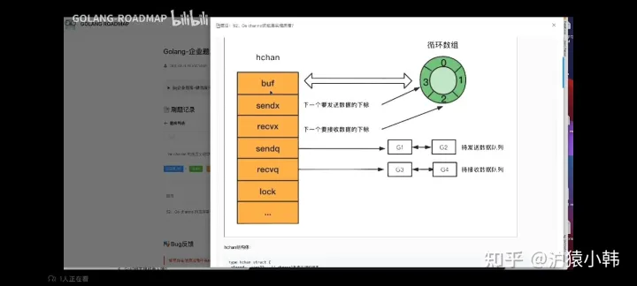

# 爆肝整理的Golang面试题，拿走不谢
来源：https://zhuanlan.zhihu.com/p/519979757

## 基础部分
### golang 中 make 和 new 的区别？（基本必问）
共同点：给变量分配内存

不同点：
1）作用变量类型不同，new给string,int和数组分配内存，make给切片，map，channel分配内存；
2）返回类型不一样，new返回指向变量的指针，make返回变量本身；
3）new 分配的空间被清零。make 分配空间后，会进行初始化；
4) 字节的面试官还说了另外一个区别，就是分配的位置，在堆上还是在栈上？这块我比较模糊，大家可以自己探究下，我搜索出来的答案是golang会弱化分配的位置的概念，因为编译的时候会自动内存逃逸处理，懂的大佬帮忙补充下：make、new内存分配是在堆上还是在栈上？

### 数组和切片的区别 （基本必问）
相同点：
1）只能存储一组相同类型的数据结构
2）都是通过下标来访问，并且有容量长度，长度通过 len 获取，容量通过 cap 获取

区别：
1）数组是定长，访问和复制不能超过数组定义的长度，否则就会下标越界，切片长度和容量可以自动扩容
2）数组是值类型，切片是引用类型，每个切片都引用了一个底层数组，切片本身不能存储任何数据，都是这底层数组存储数据，所以修改切片的时候修改的是底层数组中的数据。切片一旦扩容，指向一个新的底层数组，内存地址也就随之改变

简洁的回答：
1）定义方式不一样 
2）初始化方式不一样，数组需要指定大小，大小不改变 
3）在函数传递中，数组切片都是值传递。

```golang
//数组的定义
var a1 [3]int
var a2 [...]int{1,2,3}

//切片的定义
var a1 []int
var a2 :=make([]int,3,5)

//数组的初始化
a2 := [5]int{1,2,3}
a1 := [...]int{1,2,3}

//切片的初始化
b:= make([]int,3,5)
```

### for range 的时候它的地址会发生变化么？
在 for a,b := range c 遍历中， a 和 b 在内存中只会存在一份，即之后每次循环时遍历到的数据都是以值覆盖的方式赋给 a 和 b，a，b 的内存地址始终不变。由于有这个特性，for 循环里面如果开协程，不要直接把 a 或者 b 的地址传给协程。解决办法：在每次循环时，创建一个临时变量。

### go defer，多个 defer 的顺序，defer 在什么时机会修改返回值？
作用：defer延迟函数，释放资源，收尾工作；如释放锁，关闭文件，关闭链接；捕获panic;

避坑指南：defer函数紧跟在资源打开后面，否则defer可能得不到执行，导致内存泄露。

多个 defer 调用顺序是 LIFO（后入先出），defer后的操作可以理解为压入栈中

defer，return，return value（函数返回值） 执行顺序：首先return，其次return value，最后defer。defer可以修改函数最终返回值，修改时机：有名返回值或者函数返回指针 参考：（Go语言defer用法大总结(含return返回机制)） https://blog.csdn.net/Cassie_zkq/article/details/108567205

```golang
//有名返回值

func b() (i int) {
	defer func() {
		i++
		fmt.Println("defer2:", i)
	}()
	defer func() {
		i++
		fmt.Println("defer1:", i)
	}()
	return i //或者直接写成return
}
func main() {
	fmt.Println("return:", b())
}
```

```golang
//函数返回指针

func c() *int {
	var i int
	defer func() {
		i++
		fmt.Println("defer2:", i)
	}()
	defer func() {
		i++
		fmt.Println("defer1:", i)
	}()
	return &i
}
func main() {
	fmt.Println("return:", *(c()))
}
```

### uint 类型溢出问题
超过最大存储值如uint8最大是255

var a uint8 =255
var b uint8 =1

a+b = 0总之类型溢出会出现难以意料的事

### 能介绍下 rune 类型吗？
相当于int32

golang中的字符串底层实现是通过byte数组的，中文字符在unicode下占2个字节，在utf-8编码下占3个字节，而golang默认编码正好是utf-8

byte 等同于int8，常用来处理ascii字符

rune 等同于int32，常用来处理unicode或utf-8字符

### golang 中解析 tag 是怎么实现的？反射原理是什么？(中高级肯定会问，比较难，需要自己多去总结)
参考：（golang中struct关于反射tag）https://blog.csdn.net/paladinosment/article/details/42570937
```golang
type User struct {
	name string `json:name-field`
	age  int
}
func main() {
	user := &User{"John Doe The Fourth", 20}

	field, ok := reflect.TypeOf(user).Elem().FieldByName("name")
	if !ok {
		panic("Field not found")
	}
	fmt.Println(getStructTag(field))
}

func getStructTag(f reflect.StructField) string {
	return string(f.Tag)
}
```

Go 中解析的 tag 是通过反射实现的，反射是指计算机程序在运行时（Run time）可以访问、检测和修改它本身状态或行为的一种能力或动态知道给定数据对象的类型和结构，并有机会修改它。反射将接口变量转换成反射对象 Type 和 Value；反射可以通过反射对象 Value 还原成原先的接口变量；反射可以用来修改一个变量的值，前提是这个值可以被修改；tag是啥:结构体支持标记，name string `json:name-field` 就是 `json:name-field` 这部分

gorm json yaml gRPC protobuf gin.Bind()都是通过反射来实现的

### 调用函数传入结构体时，应该传值还是指针？ （Golang 都是传值）
Go 的函数参数传递都是值传递。所谓值传递：指在调用函数时将实际参数复制一份传递到函数中，这样在函数中如果对参数进行修改，将不会影响到实际参数。参数传递还有引用传递，所谓引用传递是指在调用函数时将实际参数的地址传递到函数中，那么在函数中对参数所进行的修改，将影响到实际参数

因为 Go 里面的 map，slice，chan 是引用类型。变量区分值类型和引用类型。所谓值类型：变量和变量的值存在同一个位置。所谓引用类型：变量和变量的值是不同的位置，变量的值存储的是对值的引用。但并不是 map，slice，chan 的所有的变量在函数内都能被修改，不同数据类型的底层存储结构和实现可能不太一样，情况也就不一样。

### 讲讲 Go 的 slice 底层数据结构和一些特性？
Go 的 slice 底层数据结构是由一个 array 指针指向底层数组，len 表示切片长度，cap 表示切片容量。slice 的主要实现是扩容。对于 append 向 slice 添加元素时，假如 slice 容量够用，则追加新元素进去，slice.len++ ，返回原来的 slice。当原容量不够，则 slice 先扩容，扩容之后 slice 得到新的 slice，将元素追加进新的 slice，slice.len++ ，返回新的 slice。对于切片的扩容规则：当切片比较小时（容量小于 1024），则采用较大的扩容倍速进行扩容（新的扩容会是原来的 2 倍），避免频繁扩容，从而减少内存分配的次数和数据拷贝的代价。当切片较大的时（原来的 slice 的容量大于或者等于 1024），采用较小的扩容倍速（新的扩容将扩大大于或者等于原来 1.25 倍），主要避免空间浪费，网上其实很多总结的是 1.25 倍，那是在不考虑内存对齐的情况下，实际上还要考虑内存对齐，扩容是大于或者等于 1.25 倍。

（关于刚才问的 slice 为什么传到函数内可能被修改，如果 slice 在函数内没有出现扩容，函数外和函数内 slice 变量指向是同一个数组，则函数内复制的 slice 变量值出现更改，函数外这个 slice 变量值也会被修改。如果 slice 在函数内出现扩容，则函数内变量的值会新生成一个数组（也就是新的 slice，而函数外的 slice 指向的还是原来的 slice，则函数内的修改不会影响函数外的 slice。）

### 讲讲 Go 的 select 底层数据结构和一些特性？（难点，没有项目经常可能说不清，面试一般会问你项目中怎么使用select）
go 的 select 为 golang 提供了多路 IO 复用机制，和其他 IO 复用一样，用于检测是否有读写事件是否 ready。linux 的系统 IO 模型有 select，poll，epoll，go 的 select 和 linux 系统 select 非常相似。

select 结构组成主要是由 case 语句和执行的函数组成 select 实现的多路复用是：每个线程或者进程都先到注册和接受的 channel（装置）注册，然后阻塞，然后只有一个线程在运输，当注册的线程和进程准备好数据后，装置会根据注册的信息得到相应的数据。

select 的特性：
1）select 操作至少要有一个 case 语句，出现读写 nil 的 channel 该分支会忽略，在 nil 的 channel 上操作则会报错。
2）select 仅支持管道，而且是单协程操作。
3）每个 case 语句仅能处理一个管道，要么读要么写。
4）多个 case 语句的执行顺序是随机的。
5）存在 default 语句，select 将不会阻塞，但是存在 default 会影响性能。

### 讲讲 Go 的 defer 底层数据结构和一些特性？
答：每个 defer 语句都对应一个_defer 实例，多个实例使用指针连接起来形成一个单连表，保存在 gotoutine 数据结构中，每次插入_defer 实例，均插入到链表的头部，函数结束再一次从头部取出，从而形成后进先出的效果。

defer 的规则总结：

延迟函数的参数是 defer 语句出现的时候就已经确定了的。

延迟函数执行按照后进先出的顺序执行，即先出现的 defer 最后执行。

延迟函数可能操作主函数的返回值。

申请资源后立即使用 defer 关闭资源是个好习惯。

### 单引号，双引号，反引号的区别？
单引号，表示byte类型或rune类型，对应 uint8和int32类型，默认是 rune 类型。byte用来强调数据是raw data，而不是数字；而rune用来表示Unicode的code point。

双引号，才是字符串，实际上是字符数组。可以用索引号访问某字节，也可以用len()函数来获取字符串所占的字节长度。

反引号，表示字符串字面量，但不支持任何转义序列。字面量 raw literal string 的意思是，你定义时写的啥样，它就啥样，你有换行，它就换行。你写转义字符，它也就展示转义字符。

## map相关
### map 使用注意的点，是否并发安全？
map的类型是`map[key]`，key类型的ke必须是可比较的，通常情况，会选择内建的基本类型，比如整数、字符串做key的类型。如果要使用struct作为key，要保证struct对象在逻辑上是不可变的。在Go语言中，`map[key]`函数返回结果可以是一个值，也可以是两个值。map是无序的，如果我们想要保证遍历map时元素有序，可以使用辅助的数据结构，例如orderedmap。

第一，一定要先初始化，否则panic
第二，map类型是容易发生并发访问问题的。不注意就容易发生程序运行时并发读写导致的panic。 Go语言内建的map对象不是线程安全的，并发读写的时候运行时会有检查，遇到并发问题就会导致panic。

### map 循环是有序的还是无序的？
无序的, map 因扩张⽽重新哈希时，各键值项存储位置都可能会发生改变，顺序自然也没法保证了，所以官方避免大家依赖顺序，直接打乱处理。就是 for range map 在开始处理循环逻辑的时候，就做了随机播种

 ### map 中删除一个 key，它的内存会释放么？（常问）
如果删除的元素是值类型，如int，float，bool，string以及数组和struct，map的内存不会自动释放

如果删除的元素是引用类型，如指针，slice，map，chan等，map的内存会自动释放，但释放的内存是子元素应用类型的内存占用

将map设置为nil后，内存被回收。

这个问题还需要大家去搜索下答案，我记得有不一样的说法，谨慎采用本题答案。

### 怎么处理对 map 进行并发访问？有没有其他方案？ 区别是什么？
方式一、使用内置sync.Map
方式二、使用读写锁实现并发安全map

### nil map 和空 map 有何不同？
1）可以对未初始化的map进行取值，但取出来的东西是空：
```golang
var m1 map[string]string
fmt.Println(m1["1"])
```

2）不能对未初始化的map进行赋值，这样将会抛出一个异常：
```golang
var m1 map[string]string
m1["1"] = "1"

panic: assignment to entry in nil map
```

3) 通过fmt打印map时，空map和nil map结果是一样的，都为`map[]`。所以，这个时候别断定map是空还是nil，而应该通过map == nil来判断。

**nil map 未初始化，空map是长度为空**

### map 的数据结构是什么？是怎么实现扩容？
答：golang 中 map 是一个 kv 对集合。底层使用 hash table，用链表来解决冲突 ，出现冲突时，不是每一个 key 都申请一个结构通过链表串起来，而是以 bmap 为最小粒度挂载，一个 bmap 可以放 8 个 kv。在哈希函数的选择上，会在程序启动时，检测 cpu 是否支持 aes，如果支持，则使用 aes hash，否则使用 memhash。每个 map 的底层结构是 hmap，是有若干个结构为 bmap 的 bucket 组成的数组。每个 bucket 底层都采用链表结构。

```golang
//hmap 的结构如下：

type hmap struct {
    count     int                  // 元素个数
    flags     uint8
    B         uint8                // 扩容常量相关字段B是buckets数组的长度的对数 2^B
    noverflow uint16               // 溢出的bucket个数
    hash0     uint32               // hash seed
    buckets    unsafe.Pointer      // buckets 数组指针
    oldbuckets unsafe.Pointer      // 结构扩容的时候用于赋值的buckets数组
    nevacuate  uintptr             // 搬迁进度
    extra *mapextra                // 用于扩容的指针
}
```

map 的容量大小：
底层调用 makemap 函数，计算得到合适的 B，map 容量最多可容纳 6.52^B 个元素，6.5 为装载因子阈值常量。装载因子的计算公式是：装载因子=填入表中的元素个数/散列表的长度，装载因子越大，说明空闲位置越少，冲突越多，散列表的性能会下降。底层调用 makemap 函数，计算得到合适的 B，map 容量最多可容纳 6.52^B 个元素，6.5 为装载因子阈值常量。装载因子的计算公式是：装载因子=填入表中的元素个数/散列表的长度，装载因子越大，说明空闲位置越少，冲突越多，散列表的性能会下降。

触发 map 扩容的条件：
1）装载因子超过阈值，源码里定义的阈值是 6.5。
2）overflow 的 bucket 数量过多 map 的 bucket 定位和 key 的定位高八位用于定位 bucket，低八位用于定位 key，快速试错后再进行完整对比

### slices能作为map类型的key吗？
当时被问的一脸懵逼，其实是这个问题的变种：golang 哪些类型可以作为map key？

答案是：**在golang规范中，可比较的类型都可以作为map key**；这个问题又延伸到在：golang规范中，哪些数据类型可以比较？

不能作为map key 的类型包括：
slices
maps
functions

详细参考：（golang 哪些类型可以作为map key）https://blog.csdn.net/lanyang123456/article/details/123765745

## context相关
### context 结构是什么样的？context 使用场景和用途？
（难，也常常问你项目中怎么用，光靠记答案很难让面试官满意，反正有各种结合实际的问题）

参考链接：（go context详解）https://www.cnblogs.com/juanmaofeifei/p/14439957.html

答：Go 的 Context 的数据结构包含 Deadline，Done，Err，Value，Deadline 方法返回一个 time.Time，表示当前 Context 应该结束的时间，ok 则表示有结束时间，Done 方法当 Context 被取消或者超时时候返回的一个 close 的 channel，告诉给 context 相关的函数要停止当前工作然后返回了，Err 表示 context 被取消的原因，Value 方法表示 context 实现共享数据存储的地方，是协程安全的。context 在业务中是经常被使用的，

其主要的应用 ：
1：上下文控制，
2：多个 goroutine 之间的数据交互等，
3：超时控制：到某个时间点超时，过多久超时。

## channel相关
### channel 是否线程安全？锁用在什么地方？
为什么设计成线程安全？
答：不同协程通过channel进行通信，本身的使用场景就是多线程，为了保证数据的一致性，必须实现线程安全。

如何实现线程安全的？
答：在channel的底层实现中，hchan结构体中采用Mutex锁来保证数据读写安全，在对循环数组buf中的数据进行入队和出队操作时，必须先获取互斥锁，才能操作channel数据。

### channel的底层实现原理（数据结构）


底层结构需要描述出来，这个简单，buf，发送队列，接收队列，lock。

### nil、关闭的 channel、有数据的 channel，再进行读、写、关闭会怎么样？（各类变种题型，重要）

channel有2种类型：无缓冲、有缓冲

channel有3种模式：写操作模式（单向通道）、读操作模式（单向通道）、读写操作模式（双向通道）
```golang
//创建
//写操作模式
make(chan<-int)
//读操作模式
make(<-chan int)
//读写操作模式
make(chan int)
```

channel有3种状态：未初始化、正常、关闭
| 	    | 未初始化         | 关闭                               | 正常             |
| ---- | ---------------- | ---------------------------------- | ---------------- |
| 关闭 | panic            | panic                              | 正常关闭         |
| 发送 | 永远阻塞导致死锁 | panic                              | 阻塞或者成功发送 |
| 接收 | 永远阻塞导致死锁 | 缓冲区为空则为零值，否则可以继续读 | 阻塞或者成功接收 |

注意点：
1）一个channel不能多次关闭，会导致panic
2）如果多个goroutine都监听同一个channel，那么channel上的数据都可能随机被某一个goroutine取走进行消费
3）如果多个goroutine都监听同一个channel，当这个channel被关闭时，则所以goroutine都能接收到退出信号

### 向 channel 发送数据和从 channel 读数据的流程是什么样的？
**发送流程**：
向channel发送数据时大概分为两大块：检测和数据发送。
发送数据流程如下：
1）如果channel的读等待队列存在接收者goroutine
将数据**直接发送**给第一个等待的goroutine，**唤醒接收**的goroutine
2）如果channel的读等待队列不存在接收者goroutine
	如果循环数组buf未满，那么将会把数据发送到循环数组buf的队尾；
	如果循环数组buf已满，这个时候就会走阻塞发送的流程，将当前goroutine加入写等待队列，并挂起等待唤醒。

**接收流程**：
从channel接收数据时大概分为两大块：检测和数据发送。
接收数据流程如下：
1）如果channel的写等待队列存在发送者goroutine
	如果是无缓冲channel，**直接**从第一个发送者goroutine那里把数据拷贝给接收变量，**唤醒发送**的gorotine；
	如果是有缓冲channel（已满），将循环数组buf的队首元素拷贝给接收变量，将第一个发送者goroutine的数据拷贝到buf循环数组队尾，唤醒发送的goroutine。
2）如果channel的写等待队列不存在发送者goroutine
	如果循环数组buf非空，将循环数组部分的队首元素拷贝给接收变量；
	如果循环数组buf为空，这个时候就会走阻塞接收的流程，将当前goroutine加入读等待队列，并挂起等待唤醒。

### 讲讲 Go 的 chan 底层数据结构和主要使用场景
答：channel 的数据结构包含 qccount 当前队列中剩余元素个数，dataqsiz 环形队列长度，即可以存放的元素个数，buf 环形队列指针，elemsize 每个元素的大小，closed 标识关闭状态，elemtype 元素类型，sendx 队列下表，指示元素写入时存放到队列中的位置，recv 队列下表，指示元素从队列的该位置读出。recvq 等待读消息的 goroutine 队列，sendq 等待写消息的 goroutine 队列，lock 互斥锁，chan 不允许并发读写。

**无缓冲和有缓冲区别**： 
管道没有缓冲区，从管道读数据会阻塞，直到有协程向管道中写入数据。同样，向管道写入数据也会阻塞，直到有协程从管道读取数据。管道有缓冲区但缓冲区没有数据，从管道读取数据也会阻塞，直到协程写入数据，如果管道满了，写数据也会阻塞，直到协程从缓冲区读取数据。

**channel 的一些特点**：
1）、读写值 nil 管道会永久阻塞 
2）、关闭的管道读数据仍然可以读数据 
3）、往关闭的管道写数据会 panic 
4）、关闭为 nil 的管道 panic 
5）、关闭已经关闭的管道 panic

**向 channel 写数据的流程**： 
如果等待接收队列 recvq 不为空，说明缓冲区中没有数据或者没有缓冲区，此时直接从 recvq 取出 G,并把数据写入，最后把该 G 唤醒，结束发送过程； 如果缓冲区中有空余位置，将数据写入缓冲区，结束发送过程； 如果缓冲区中没有空余位置，将待发送数据写入 G，将当前 G 加入 sendq，进入睡眠，等待被读 goroutine 唤醒；

**向 channel 读数据的流程**： 
如果等待发送队列 sendq 不为空，且没有缓冲区，直接从 sendq 中取出 G，把 G 中数据读出，最后把 G 唤醒，结束读取过程； 如果等待发送队列 sendq 不为空，此时说明缓冲区已满，从缓冲区中首部读出数据，把 G 中数据写入缓冲区尾部，把 G 唤醒，结束读取过程； 如果缓冲区中有数据，则从缓冲区取出数据，结束读取过程；将当前 goroutine 加入 recvq，进入睡眠，等待被写 goroutine 唤醒；

**使用场景**： 
消息传递、消息过滤，信号广播，事件订阅与广播，请求、响应转发，任务分发，结果汇总，并发控制，限流，同步与异步

## GMP相关

### 什么是 GMP？（必问）
答：G 代表着 goroutine，P 代表着上下文处理器，M 代表 thread 线程，在 GPM 模型，有一个全局队列（Global Queue）：存放等待运行的 G，还有一个 P 的本地队列：也是存放等待运行的 G，但数量有限，不超过 256 个。GPM 的调度流程从 go func()开始创建一个 goroutine，新建的 goroutine 优先保存在 P 的本地队列中，如果 P 的本地队列已经满了，则会保存到全局队列中。M 会从 P 的队列中取一个可执行状态的 G 来执行，如果 P 的本地队列为空，就会从其他的 MP 组合偷取一个可执行的 G 来执行，当 M 执行某一个 G 时候发生系统调用或者阻塞，M 阻塞，如果这个时候 G 在执行，runtime 会把这个线程 M 从 P 中摘除，然后创建一个新的操作系统线程来服务于这个 P，当 M 系统调用结束时，这个 G 会尝试获取一个空闲的 P 来执行，并放入到这个 P 的本地队列，如果这个线程 M 变成休眠状态，加入到空闲线程中，然后整个 G 就会被放入到全局队列中。

关于 G,P,M 的个数问题，G 的个数理论上是无限制的，但是受内存限制，P 的数量一般建议是逻辑 CPU 数量的 2 倍，M 的数据默认启动的时候是 10000，内核很难支持这么多线程数，所以整个限制客户忽略，M 一般不做设置，设置好 P，M 一般都是要大于 P。

### 进程、线程、协程有什么区别？（必问）
进程：是应用程序的启动实例，每个进程都有独立的内存空间，不同的进程通过进程间的通信方式来通信。

线程：从属于进程，每个进程至少包含一个线程，线程是 CPU 调度的基本单位，多个线程之间可以共享进程的资源并通过共享内存等线程间的通信方式来通信。

协程：为轻量级线程，与线程相比，协程不受操作系统的调度，协程的调度器由用户应用程序提供，协程调度器按照调度策略把协程调度到线程中运行

### 抢占式调度是如何抢占的？
**基于协作式抢占**

**基于信号量抢占**

就像操作系统要负责线程的调度一样，Go的runtime要负责goroutine的调度。现代操作系统调度线程都是抢占式的，我们不能依赖用户代码主动让出CPU，或者因为IO、锁等待而让出，这样会造成调度的不公平。基于经典的时间片算法，当线程的时间片用完之后，会被时钟中断给打断，调度器会将当前线程的执行上下文进行保存，然后恢复下一个线程的上下文，分配新的时间片令其开始执行。这种抢占对于线程本身是无感知的，系统底层支持，不需要开发人员特殊处理。

基于时间片的抢占式调度有个明显的优点，能够避免CPU资源持续被少数线程占用，从而使其他线程长时间处于饥饿状态。goroutine的调度器也用到了时间片算法，但是和操作系统的线程调度还是有些区别的，因为整个Go程序都是运行在用户态的，所以不能像操作系统那样利用时钟中断来打断运行中的goroutine。也得益于完全在用户态实现，goroutine的调度切换更加轻量。

上面这两段文字只是对调度的一个概括，具体的协作式调度、信号量调度大家还需要去详细了解，这偏底层了，大厂或者中高级开发会问。（字节就问了）

### M 和 P 的数量问题？
p默认cpu内核数

M与P的数量没有绝对关系，一个M阻塞，P就会去创建或者切换另一个M，所以，即使P的默认数量是1，也有可能会创建很多个M出来

【Go语言调度模型G、M、P的数量多少合适？】

## 锁相关
### 除了 mutex 以外还有那些方式安全读写共享变量？
将共享变量的读写放到一个 goroutine 中，其它 goroutine 通过 channel 进行读写操作。

可以用个数为 1 的信号量（semaphore）实现互斥

通过 Mutex 锁实现

### Go 如何实现原子操作？
答：原子操作就是不可中断的操作，外界是看不到原子操作的中间状态，要么看到原子操作已经完成，要么看到原子操作已经结束。在某个值的原子操作执行的过程中，CPU 绝对不会再去执行其他针对该值的操作，那么其他操作也是原子操作。

Go 语言的标准库代码包 sync/atomic 提供了原子的读取（Load 为前缀的函数）或写入（Store 为前缀的函数）某个值（这里细节还要多去查查资料）。

原子操作与互斥锁的区别：
1）互斥锁是一种数据结构，用来让一个线程执行程序的关键部分，完成互斥的多个操作。
2）原子操作是针对某个值的单个互斥操作。

### Mutex 是悲观锁还是乐观锁？悲观锁、乐观锁是什么？
悲观锁

悲观锁：当要对数据库中的一条数据进行修改的时候，为了避免同时被其他人修改，最好的办法就是直接对该数据进行加锁以防止并发。这种借助数据库锁机制，在修改数据之前先锁定，再修改的方式被称之为悲观并发控制【Pessimistic Concurrency Control，缩写“PCC”，又名“悲观锁”】。

乐观锁

乐观锁是相对悲观锁而言的，乐观锁假设数据一般情况不会造成冲突，所以在数据进行提交更新的时候，才会正式对数据的冲突与否进行检测，如果冲突，则返回给用户异常信息，让用户决定如何去做。乐观锁适用于读多写少的场景，这样可以提高程序的吞吐量

### Mutex 有几种模式？
1）正常模式

* 当前的mutex只有一个goruntine来获取，那么没有竞争，直接返回。
* 新的goruntine进来，如果当前mutex已经被获取了，则该goruntine进入一个先入先出的waiter队列，在mutex被释放后，waiter按照先进先出的方式获取锁。该goruntine会处于自旋状态(不挂起，继续占有cpu)。
* 新的goruntine进来，mutex处于空闲状态，将参与竞争。新来的 goroutine 有先天的优势，它们正在 CPU 中运行，可能它们的数量还不少，所以，在高并发情况下，被唤醒的 waiter 可能比较悲剧地获取不到锁，这时，它会被插入到队列的前面。如果 waiter 获取不到锁的时间超过阈值 1 毫秒，那么，这个 Mutex 就进入到了饥饿模式。

2）饥饿模式

在饥饿模式下，Mutex 的拥有者将直接把锁交给队列最前面的 waiter。新来的 goroutine 不会尝试获取锁，即使看起来锁没有被持有，它也不会去抢，也不会 spin（自旋），它会乖乖地加入到等待队列的尾部。 如果拥有 Mutex 的 waiter 发现下面两种情况的其中之一，它就会把这个 Mutex 转换成正常模式:

* 此 waiter 已经是队列中的最后一个 waiter 了，没有其它的等待锁的 goroutine 了；
* 此 waiter 的等待时间小于 1 毫秒。

### goroutine 的自旋占用资源如何解决
自旋锁是指当一个线程在获取锁的时候，如果锁已经被其他线程获取，那么该线程将循环等待，然后不断地判断是否能够被成功获取，直到获取到锁才会退出循环。

自旋的条件如下：

1）还没自旋超过 4 次,
2）多核处理器，
3）GOMAXPROCS > 1，
4）p 上本地 goroutine 队列为空。

mutex 会让当前的 goroutine 去空转 CPU，在空转完后再次调用 CAS 方法去尝试性的占有锁资源，直到不满足自旋条件，则最终会加入到等待队列里。

## 并发相关
### 怎么控制并发数？
**第一，有缓冲通道**

根据通道中没有数据时读取操作陷入阻塞和通道已满时继续写入操作陷入阻塞的特性，正好实现控制并发数量。
```golang
func main() {
	count := 10 // 最大支持并发
	sum := 100 // 任务总数
	wg := sync.WaitGroup{} //控制主协程等待所有子协程执行完之后再退出。

	c := make(chan struct{}, count) // 控制任务并发的chan
	defer close(c)

	for i:=0; i<sum;i++{
		wg.Add(1)
		c <- struct{}{} // 作用类似于waitgroup.Add(1)
		go func(j int) {
			defer wg.Done()
			fmt.Println(j)
			<- c // 执行完毕，释放资源
		}(i)
	}
	wg.Wait()
}
```

**第二，三方库实现的协程池**

panjf2000/ants（比较火）
Jeffail/tunny
```golang
import (
	"log"
	"time"

	"github.com/Jeffail/tunny"
)
func main() {
	pool := tunny.NewFunc(10, func(i interface{}) interface{} {
		log.Println(i)
		time.Sleep(time.Second)
		return nil
	})
	defer pool.Close()

	for i := 0; i < 500; i++ {
		go pool.Process(i)
	}
	time.Sleep(time.Second * 4)
}
```

### 多个 goroutine 对同一个 map 写会 panic，异常是否可以用 defer 捕获？
可以捕获异常，但是只能捕获一次，Go语言，可以使用多值返回来返回错误。不要用异常代替错误，更不要用来控制流程。在极个别的情况下，才使用Go中引入的Exception处理：defer, panic, recover Go中，对异常处理的原则是：多用error包，少用panic
```golang
defer func() {
		if err := recover(); err != nil {
			// 打印异常，关闭资源，退出此函数
			fmt.Println(err)
		}
	}()
```

### 如何优雅的实现一个 goroutine 池
（百度、手写代码，本人面传音控股被问道：请求数大于消费能力怎么设计协程池）

这一块能啃下来，offer满天飞，这应该是保证高并发系统稳定性、高可用的核心部分之一。

建议参考：（Golang学习篇——协程池）https://blog.csdn.net/finghting321/article/details/106492915/

这篇文章的目录是：

1. 为什么需要协程池？
2. 简单的协程池
3. go-playground/pool
4. ants（推荐）

所以直接研究ants底层吧，省的造轮子。

## GC相关
### golang的 gc 是怎么实现的？（必问）
细分常见的三个问题：1、GC机制随着golang版本变化如何变化的？2、三色标记法的流程？3、插入屏障、删除屏障，混合写屏障（具体的实现比较难描述，但你要知道屏障的作用：避免程序运行过程中，变量被误回收；减少STW的时间）4、虾皮还问了个开放性的题目：你觉得以后GC机制会怎么优化？

Go 的 GC 回收有三次演进过程，Go V1.3 之前普通标记清除（mark and sweep）方法，整体过程需要启动 STW，效率极低。GoV1.5 三色标记法，堆空间启动写屏障，栈空间不启动，全部扫描之后，需要重新扫描一次栈(需要 STW)，效率普通。GoV1.8 三色标记法，混合写屏障机制：栈空间不启动（全部标记成黑色），堆空间启用写屏障，整个过程不要 STW，效率高。

Go1.3 之前的版本所谓标记清除是先启动 STW 暂停，然后执行标记，再执行数据回收，最后停止 STW。Go1.3 版本标记清除做了点优化，流程是：先启动 STW 暂停，然后执行标记，停止 STW，最后再执行数据回收。

Go1.5 三色标记主要是插入屏障和删除屏障，写入屏障的流程：程序开始，全部标记为白色，1）所有的对象放到白色集合，2）遍历一次根节点，得到灰色节点，3）遍历灰色节点，将可达的对象，从白色标记灰色，遍历之后的灰色标记成黑色，4）由于并发特性，此刻外界向在堆中的对象发生添加对象，以及在栈中的对象添加对象，在堆中的对象会触发插入屏障机制，栈中的对象不触发，5）由于堆中对象插入屏障，则会把堆中黑色对象添加的白色对象改成灰色，栈中的黑色对象添加的白色对象依然是白色，6）循环第 5 步，直到没有灰色节点，7）在准备回收白色前，重新遍历扫描一次栈空间，加上 STW 暂停保护栈，防止外界干扰（有新的白色会被添加成黑色）在 STW 中，将栈中的对象一次三色标记，直到没有灰色，8）停止 STW，清除白色。至于删除写屏障，则是遍历灰色节点的时候出现可达的节点被删除，这个时候触发删除写屏障，这个可达的被删除的节点也是灰色，等循环三色标记之后，直到没有灰色节点，然后清理白色，删除写屏障会造成一个对象即使被删除了最后一个指向它的指针也依旧可以活过这一轮，在下一轮 GC 中被清理掉。

GoV1.8 混合写屏障规则是：
1）GC 开始将栈上的对象全部扫描并标记为黑色(之后不再进行第二次重复扫描，无需 STW)，2）GC 期间，任何在栈上创建的新对象，均为黑色。3）被删除的对象标记为灰色。4）被添加的对象标记为灰色。

### go 是 gc 算法是怎么实现的？ （得物，出现频率低）
```golang
func GC() {
	n := atomic.Load(&amp;work.cycles)
	gcWaitOnMark(n)

	gcStart(gcTrigger{kind: gcTriggerCycle, n: n + 1})
	gcWaitOnMark(n + 1)

	for atomic.Load(&amp;work.cycles) == n+1 &amp;&amp; sweepone() != ^uintptr(0) {
		sweep.nbgsweep++
		Gosched()
	}
	for atomic.Load(&amp;work.cycles) == n+1 &amp;&amp; atomic.Load(&amp;mheap_.sweepers) != 0 {
		Gosched()
	}
	mp := acquirem()
	cycle := atomic.Load(&amp;work.cycles)
	if cycle == n+1 || (gcphase == _GCmark &amp;&amp; cycle == n+2) {
		mProf_PostSweep()
	}
	releasem(mp)
}
```
底层原理了，可能大厂，中高级才会问，参考：（Golang GC算法解读）https://blog.csdn.net/shudaqi2010/article/details/90025192

### GC 中 stw 时机，各个阶段是如何解决的？ （百度）
底层原理，自行百度一下，我等渣渣简历都过不了BAT，字节，虾皮，特使拉以及一些国Q还能收到面试邀约。

1）在开始新的一轮 GC 周期前，需要调用 gcWaitOnMark 方法上一轮 GC 的标记结束（含扫描终止、标记、或标记终止等）。

2）开始新的一轮 GC 周期，调用 gcStart 方法触发 GC 行为，开始扫描标记阶段。

3）需要调用 gcWaitOnMark 方法等待，直到当前 GC 周期的扫描、标记、标记终止完成。

4）需要调用 sweepone 方法，扫描未扫除的堆跨度，并持续扫除，保证清理完成。在等待扫除完毕前的阻塞时间，会调用 Gosched 让出。

5）在本轮 GC 已经基本完成后，会调用 mProf_PostSweep 方法。以此记录最后一次标记终止时的堆配置文件快照。

6）结束，释放 M。

### GC 的触发时机？
初级必问，分为系统触发和主动触发。

1）gcTriggerHeap：当所分配的堆大小达到阈值（由控制器计算的触发堆的大小）时，将会触发。

2）gcTriggerTime：当距离上一个 GC 周期的时间超过一定时间时，将会触发。时间周期以runtime.forcegcperiod 变量为准，默认 2 分钟。

3）gcTriggerCycle：如果没有开启 GC，则启动 GC。

4）手动触发的 runtime.GC 方法。

## 内存相关
### 谈谈内存泄露，什么情况下内存会泄露？怎么定位排查内存泄漏问题？
答：go 中的内存泄漏一般都是 goroutine 泄漏，就是 goroutine 没有被关闭，或者没有添加超时控制，让 goroutine 一只处于阻塞状态，不能被 GC。

内存泄露有下面一些情况

1）如果 goroutine 在执行时被阻塞而无法退出，就会导致 goroutine 的内存泄漏，一个 goroutine 的最低栈大小为 2KB，在高并发的场景下，对内存的消耗也是非常恐怖的。

2）互斥锁未释放或者造成死锁会造成内存泄漏

3）time.Ticker 是每隔指定的时间就会向通道内写数据。作为循环触发器，必须调用 stop 方法才会停止，从而被 GC 掉，否则会一直占用内存空间。

4）字符串的截取引发临时性的内存泄漏
```golang
func main() {
	var str0 = "12345678901234567890"
	str1 := str0[:10]
}
```

5）切片截取引起子切片内存泄漏
```golang
func main() {
	var s0 = []int{0, 1, 2, 3, 4, 5, 6, 7, 8, 9}
	s1 := s0[:3]
}
```

6）函数数组传参引发内存泄漏【如果我们在函数传参的时候用到了数组传参，且这个数组够大（我们假设数组大小为 100 万，64 位机上消耗的内存约为 800w 字节，即 8MB 内存），或者该函数短时间内被调用 N 次，那么可想而知，会消耗大量内存，对性能产生极大的影响，如果短时间内分配大量内存，而又来不及 GC，那么就会产生临时性的内存泄漏，对于高并发场景相当可怕。】

排查方式：
一般通过 pprof 是 Go 的性能分析工具，在程序运行过程中，可以记录程序的运行信息，可以是 CPU 使用情况、内存使用情况、goroutine 运行情况等，当需要性能调优或者定位 Bug 时候，这些记录的信息是相当重要。

当然你能说说具体的分析指标更加分咯，有的面试官就喜欢他问什么，你简洁的回答什么，不喜欢巴拉巴拉详细解释一通，比如虾P面试官，不过他考察的内容特别多，可能是为了节约时间。

### 知道 golang 的内存逃逸吗？什么情况下会发生内存逃逸？（必问）
答：1)本该分配到栈上的变量，跑到了堆上，这就导致了内存逃逸。2)栈是高地址到低地址，栈上的变量，函数结束后变量会跟着回收掉，不会有额外性能的开销。3)变量从栈逃逸到堆上，如果要回收掉，需要进行 gc，那么 gc 一定会带来额外的性能开销。编程语言不断优化 gc 算法，主要目的都是为了减少 gc 带来的额外性能开销，变量一旦逃逸会导致性能开销变大。

内存逃逸的情况如下：
1）方法内返回局部变量指针。
2）向 channel 发送指针数据。
3）在闭包中引用包外的值。
4）在 slice 或 map 中存储指针。
5）切片（扩容后）长度太大。
6）在 interface 类型上调用方法。

### 请简述 Go 是如何分配内存的？
mcache mcentral mheap mspan

Go 程序启动的时候申请一大块内存，并且划分 spans，bitmap，areana 区域；arena 区域按照页划分成一个个小块，span 管理一个或者多个页，mcentral 管理多个 span 供现场申请使用；mcache 作为线程私有资源，来源于 mcentral。

这里描述的比较简单，你可以自己再去搜索下更简洁完整的答案。

### Channel 分配在栈上还是堆上？哪些对象分配在堆上，哪些对象分配在栈上？
Channel 被设计用来实现协程间通信的组件，其作用域和生命周期不可能仅限于某个函数内部，所以 golang 直接将其分配在堆上

准确地说，你并不需要知道。Golang 中的变量只要被引用就一直会存活，存储在堆上还是栈上由内部实现决定而和具体的语法没有关系。

知道变量的存储位置确实和效率编程有关系。如果可能，Golang 编译器会将函数的局部变量分配到函数栈帧（stack frame）上。然而，如果编译器不能确保变量在函数 return 之后不再被引用，编译器就会将变量分配到堆上。而且，如果一个局部变量非常大，那么它也应该被分配到堆上而不是栈上。

当前情况下，如果一个变量被取地址，那么它就有可能被分配到堆上,然而，还要对这些变量做逃逸分析，如果函数 return 之后，变量不再被引用，则将其分配到栈上。

### 介绍一下大对象小对象，为什么小对象多了会造成 gc 压力？
小于等于 32k 的对象就是小对象，其它都是大对象。一般小对象通过 mspan 分配内存；大对象则直接由 mheap 分配内存。通常小对象过多会导致 GC 三色法消耗过多的 CPU。优化思路是，减少对象分配。

小对象：如果申请小对象时，发现当前内存空间不存在空闲跨度时，将会需要调用 nextFree 方法获取新的可用的对象，可能会触发 GC 行为。

大对象：如果申请大于 32k 以上的大对象时，可能会触发 GC 行为。

## 其他问题
### Go 多返回值怎么实现的？
答：Go 传参和返回值是通过 FP+offset 实现，并且存储在调用函数的栈帧中。FP 栈底寄存器，指向一个函数栈的顶部;PC 程序计数器，指向下一条执行指令;SB 指向静态数据的基指针，全局符号;SP 栈顶寄存器。

### 讲讲 Go 中主协程如何等待其余协程退出?
答：Go 的 sync.WaitGroup 是等待一组协程结束，sync.WaitGroup 只有 3 个方法，Add()是添加计数，Done()减去一个计数，Wait()阻塞直到所有的任务完成。Go 里面还能通过有缓冲的 channel 实现其阻塞等待一组协程结束，这个不能保证一组 goroutine 按照顺序执行，可以并发执行协程。Go 里面能通过无缓冲的 channel 实现其阻塞等待一组协程结束，这个能保证一组 goroutine 按照顺序执行，但是不能并发执行。

啰嗦一句：循环智能二面，手写代码部分时，三个协程按交替顺序打印数字，最后题目做出来了，问我代码中Add()是什么意思，我回答的不是很清晰，这家公司就没有然后了。Add()表示协程计数，可以一次Add多个，如Add(3),可以多次Add(1);然后每个子协程必须调用done（）,这样才能保证所有子协程结束，主协程才能结束。

### Go 语言中不同的类型如何比较是否相等？
答：像 string，int，float interface 等可以通过 reflect.DeepEqual 和等于号进行比较，像 slice，struct，map 则一般使用 reflect.DeepEqual 来检测是否相等。

### Go 中 init 函数的特征?
答：一个包下可以有多个 init 函数，每个文件也可以有多个 init 函数。多个 init 函数按照它们的文件名顺序逐个初始化。应用初始化时初始化工作的顺序是，从被导入的最深层包开始进行初始化，层层递出最后到 main 包。不管包被导入多少次，包内的 init 函数只会执行一次。应用初始化时初始化工作的顺序是，从被导入的最深层包开始进行初始化，层层递出最后到 main 包。但包级别变量的初始化先于包内 init 函数的执行。

### Go 中 uintptr 和 unsafe.Pointer 的区别？
答：unsafe.Pointer 是通用指针类型，它不能参与计算，任何类型的指针都可以转化成 unsafe.Pointer，unsafe.Pointer 可以转化成任何类型的指针，uintptr 可以转换为 unsafe.Pointer，unsafe.Pointer 可以转换为 uintptr。uintptr 是指针运算的工具，但是它不能持有指针对象（意思就是它跟指针对象不能互相转换），unsafe.Pointer 是指针对象进行运算（也就是 uintptr）的桥梁。

### golang共享内存（互斥锁）方法实现发送多个get请求
待补充

### 从数组中取一个相同大小的slice有成本吗？
或者这么问：从切片中取一个相同大小的数组有成本吗？

这是爱立信的二面题目，这个问题我至今还没搞懂，不知道从什么切入点去分析，欢迎指教。
PS：爱立信面试都要英文自我介绍，以及问答，如果英文回答不上来，会直接切换成中文。

### PHP能实现并发处理事务吗？
多进程：pcntl扩展
（php pcntl用法）https://www.php.cn/php-ask-473095.html

多线程：
1）swoole（常用，生态完善）
2）pthread扩展（不常用）
（为什么php多线程没人用?）https://www.zhihu.com/question/371492817/answer/1029696815


***
参考并致谢
1、可可酱 可可酱：Golang常见面试题 https://zhuanlan.zhihu.com/p/434629143
2、Bel_Ami同学 golang 面试题(从基础到高级) https://blog.csdn.net/Bel_Ami_n/article/details/123352478


***

# Go 语言笔试面试题汇总
来源：https://geektutu.com/post/qa-golang.html
https://geektutu.com/post/qa-golang-1.html
https://geektutu.com/post/qa-golang-2.html
https://geektutu.com/post/qa-golang-3.html
https://geektutu.com/post/qa-golang-c1.html

* **基础语法**
	* 01 = 和 := 的区别？
	* 02 指针的作用
	* 03 Go 允许多个返回值吗？
	* 04 Go 有异常类型吗？
	* 05 什么是协程（Goroutine）
	* 06 如何高效地拼接字符串
	* 07 什么是 rune 类型
	* 08 如何判断 map 中是否包含某个 key ？
	* 09 Go 支持默认参数或可选参数吗？
	* 10 defer 的执行顺序
	* 11 如何交换 2 个变量的值？
	* 12 Go 语言 tag 的用处？
	* 13 如何判断 2 个字符串切片（slice) 是相等的？
	* 14 字符串打印时，%v 和 %+v 的区别
	* 15 Go 语言中如何表示枚举值(enums)？
	* 16 空 struct{} 的用途
* **实现原理**
	* 01 init() 函数是什么时候执行的？
	* 02 Go 语言的局部变量分配在栈上还是堆上？
	* 03 2 个 interface 可以比较吗 ？
	* 04 2 个 nil 可能不相等吗？
	* 05 简述 Go 语言GC(垃圾回收)的工作原理
	* 06 函数返回局部变量的指针是否安全？
	* 07 非接口非接口的任意类型 T() 都能够调用 *T 的方法吗？反过来呢？
* **并发编程**
	* 01 无缓冲的 channel 和有缓冲的 channel 的区别？
	* 02 什么是协程泄露(Goroutine Leak)？
	* 03 Go 可以限制运行时操作系统线程的数量吗？
* **代码输出**
	* 变量与常量
	* 作用域
	* defer 延迟调用

## Go 语言笔试面试题(基础语法)
### = 和 := 的区别？
`:=` 声明+赋值
`=` 仅赋值

### 指针的作用？
指针用来保存变量的地址。

### Go 允许多个返回值吗？

### Go 有异常类型吗？
Go 没有异常类型，只有错误类型（Error），通常使用返回值来表示异常状态。

### 什么是协程（Goroutine）
Goroutine 是与其他函数或方法同时运行的函数或方法。 Goroutines 可以被认为是轻量级的线程。 与线程相比，创建 Goroutine 的开销很小。 Go应用程序同时运行数千个 Goroutine 是非常常见的做法。

### 如何高效地拼接字符串
Go 语言中，字符串是只读的，也就意味着每次修改操作都会创建一个新的字符串。如果需要拼接多次，应使用 strings.Builder，最小化内存拷贝次数。
```golang
var str strings.Builder
for i := 0; i < 1000; i++ {
    str.WriteString("a")
}
fmt.Println(str.String())
```

### 什么是 rune 类型
ASCII 码只需要 7 bit 就可以完整地表示，但只能表示英文字母在内的128个字符，为了表示世界上大部分的文字系统，发明了 Unicode， 它是ASCII的超集，包含世界上书写系统中存在的所有字符，并为每个代码分配一个标准编号（称为Unicode CodePoint），在 Go 语言中称之为 rune，是 int32 类型的别名。

Go 语言中，字符串的底层表示是 byte (8 bit) 序列，而非 rune (32 bit) 序列。例如下面的例子中 `语` 和 `言` 使用 UTF-8 编码后各占 3 个 byte，因此 `len("Go语言")` 等于 8，当然我们也可以将字符串转换为 rune 序列。
```golang
fmt.Println(len("Go语言")) // 8
fmt.Println(len([]rune("Go语言"))) // 4
```

### 如何判断 map 中是否包含某个 key ？
```golang
if val, ok := dict["foo"]; ok {
    //do something here
}
```
`dict["foo"]` 有 2 个返回值，val 和 ok，如果 ok 等于 true，则说明 dict 包含 key `"foo"`，val 将被赋予 `"foo"` 对应的值。

### Go 支持默认参数或可选参数吗？
Go 语言不支持可选参数（python 支持），也不支持方法重载（java支持）。

### defer 的执行顺序
多个 defer 语句，遵从后进先出(Last In First Out，LIFO)的原则，最后声明的 defer 语句，最先得到执行。
defer 在 return 语句之后执行，但在函数退出之前，defer 可以修改返回值。

例如：
```golang
func test() int {
	i := 0
	defer func() {
		fmt.Println("defer1")
	}()
	defer func() {
		i += 1
		fmt.Println("defer2")
	}()
	return i
}

func main() {
	fmt.Println("return", test())
}
// defer2
// defer1
// return 0
```

这个例子中，可以看到 defer 的执行顺序：后进先出。但是返回值并没有被修改，这是由于 Go 的返回机制决定的，执行 return 语句后，Go 会创建一个临时变量保存返回值，因此，defer 语句修改了局部变量 i，并没有修改返回值。那如果是有名的返回值呢？

```golang
func test() (i int) {
	defer func() {
		i += 1
		fmt.Println("defer2")
	}()
	return
}

func main() {
	fmt.Println("return", test())
}
// defer2
// return 1
```

这个例子中，返回值被修改了。对于有名返回值的函数，执行 return 语句时，并不会再创建临时变量保存，因此，defer 语句修改了 i，即对返回值产生了影响。

### 如何交换 2 个变量的值？
```golang
a, b := "A", "B"
a, b = b, a
fmt.Println(a, b) // B A
```

### Go 语言 tag 的用处？
tag 可以理解为 struct 字段的注解，可以用来定义字段的一个或多个属性。框架/工具可以通过反射获取到某个字段定义的属性，采取相应的处理方式。tag 丰富了代码的语义，增强了灵活性。

例如：
```golang
package main

import "fmt"
import "encoding/json"

type Stu struct {
	Name string `json:"stu_name"`
	ID   string `json:"stu_id"`
	Age  int    `json:"-"`
}

func main() {
	buf, _ := json.Marshal(Stu{"Tom", "t001", 18})
	fmt.Printf("%s\n", buf)
}
```

这个例子使用 tag 定义了结构体字段与 json 字段的转换关系，Name -> stu_name, ID -> stu_id，忽略 Age 字段。很方便地实现了 Go 结构体与不同规范的 json 文本之间的转换。

### 如何判断 2 个字符串切片（slice) 是相等的？
go 语言中可以使用反射 `reflect.DeepEqual(a, b)` 判断 a、b 两个切片是否相等，但是通常不推荐这么做，使用反射非常影响性能。

通常采用的方式如下，遍历比较切片中的每一个元素（注意处理越界的情况）。
```golang
func StringSliceEqualBCE(a, b []string) bool {
    if len(a) != len(b) {
        return false
    }

    if (a == nil) != (b == nil) {
        return false
    }

    b = b[:len(a)]
    for i, v := range a {
        if v != b[i] {
            return false
        }
    }

    return true
}
```

### 字符串打印时，%v 和 %+v 的区别
%v 和 %+v 都可以用来打印 struct 的值，区别在于 %v 仅打印各个字段的值，%+v 还会打印各个字段的名称。
```golang
type Stu struct {
	Name string
}

func main() {
	fmt.Printf("%v\n", Stu{"Tom"}) // {Tom}
	fmt.Printf("%+v\n", Stu{"Tom"}) // {Name:Tom}
}
```

但如果结构体定义了 String() 方法，%v 和 %+v 都会调用 String() 覆盖默认值。

### Go 语言中如何表示枚举值(enums)
通常使用常量(const) 来表示枚举值。
```golang
type StuType int32

const (
	Type1 StuType = iota
	Type2
	Type3
	Type4
)

func main() {
	fmt.Println(Type1, Type2, Type3, Type4) // 0, 1, 2, 3
}
```

### 空 struct{} 的用途
使用空结构体 struct{} 可以节省内存，一般作为占位符使用，表明这里并不需要一个值。
```golang
fmt.Println(unsafe.Sizeof(struct{}{})) // 0
```

比如使用 map 表示集合时，只关注 key，value 可以使用 struct{} 作为占位符。如果使用其他类型作为占位符，例如 int，bool，不仅浪费了内存，而且容易引起歧义。
```golang
type Set map[string]struct{}

func main() {
	set := make(Set)

	for _, item := range []string{"A", "A", "B", "C"} {
		set[item] = struct{}{}
	}
	fmt.Println(len(set)) // 3
	if _, ok := set["A"]; ok {
		fmt.Println("A exists") // A exists
	}
}
```

再比如，使用信道(channel)控制并发时，我们只是需要一个信号，但并不需要传递值，这个时候，也可以使用 struct{} 代替。
```golang
func main() {
	ch := make(chan struct{}, 1)
	go func() {
		<-ch
		// do something
	}()
	ch <- struct{}{}
	// ...
}
```

再比如，声明只包含方法的结构体。
```golang
type Lamp struct{}

func (l Lamp) On() {
	println("On")
}
func (l Lamp) Off() {
	println("Off")
}
```

## Go 语言笔试面试题(实现原理)
### init() 函数是什么时候执行的？
init() 函数是 Go 程序初始化的一部分。Go 程序初始化先于 main 函数，由 runtime 初始化每个导入的包，初始化顺序不是按照从上到下的导入顺序，而是按照解析的依赖关系，没有依赖的包最先初始化。

每个包首先初始化包作用域的常量和变量（常量优先于变量），然后执行包的 init() 函数。同一个包，甚至是同一个源文件可以有多个 init() 函数。init() 函数没有入参和返回值，不能被其他函数调用，同一个包内多个 init() 函数的执行顺序不作保证。

**一句话总结： import –> const –> var –> init() –> main()**

### Go 语言的局部变量分配在栈上还是堆上？
由编译器决定。Go 语言编译器会自动决定把一个变量放在栈还是放在堆，编译器会做逃逸分析(escape analysis)，当发现变量的作用域没有超出函数范围，就可以在栈上，反之则必须分配在堆上。
```golang
func foo() *int {
	v := 11
	return &v
}

func main() {
	m := foo()
	println(*m) // 11
}
```
foo() 函数中，如果 v 分配在栈上，foo 函数返回时，&v 就不存在了，但是这段函数是能够正常运行的。Go 编译器发现 v 的引用脱离了 foo 的作用域，会将其分配在堆上。因此，main 函数中仍能够正常访问该值。

### 2 个 interface 可以比较吗？
Go 语言中，interface 的内部实现包含了 2 个字段，类型 T 和 值 V，interface 可以使用 == 或 != 比较。2 个 interface 相等有以下 2 种情况：
1）两个 interface 均等于 nil（此时 V 和 T 都处于 unset 状态）
2）类型 T 相同，且对应的值 V 相等。

如果两个接口值的动态类型相同，但是这个动态类型是不可比较的（比如切片），将它们进行比较就会失败并且panic。

### 两个 nil 可能不相等吗？
可能。

接口(interface) 是对非接口值(例如指针，struct等)的封装，内部实现包含 2 个字段，类型 T 和 值 V。一个接口等于 nil，当且仅当 T 和 V 处于 unset 状态（T=nil，V is unset）。

1）两个接口值比较时，会先比较 T，再比较 V。
2）接口值与非接口值比较时，会先将非接口值尝试转换为接口值，再比较。
```golang
func main() {
	var p *int = nil
	var i interface{} = p
	fmt.Println(i == p) // true
	fmt.Println(p == nil) // true
	fmt.Println(i == nil) // false
}
```
上面这个例子中，将一个 nil 非接口值 p 赋值给接口 i，此时，i 的内部字段为`(T=*int, V=nil)`，i 与 p 作比较时，将 p 转换为接口后再比较，因此 `i == p`，p 与 nil 比较，直接比较值，所以 p == nil。

但是当 i 与 nil 比较时，会将 nil 转换为接口 `(T=nil, V=nil)`，与i `(T=*int, V=nil)` 不相等，因此 i != nil。因此 V 为 nil ，但 T 不为 nil 的接口不等于 nil。

### 简述 Go 语言GC(垃圾回收)的工作原理
最常见的垃圾回收算法有标记清除(Mark-Sweep) 和引用计数(Reference Count)，Go 语言采用的是标记清除算法。并在此基础上使用了三色标记法和写屏障技术，提高了效率。

标记清除收集器是跟踪式垃圾收集器，其执行过程可以分成标记（Mark）和清除（Sweep）两个阶段：

1）标记阶段：从根对象出发查找并标记堆中所有存活的对象；
2）清除阶段：遍历堆中的全部对象，回收未被标记的垃圾对象并将回收的内存加入空闲链表。

标记清除算法的一大问题是在标记期间，需要暂停程序（Stop the world，STW），标记结束之后，用户程序才可以继续执行。为了能够异步执行，减少 STW 的时间，Go 语言采用了三色标记法。

三色标记算法将程序中的对象分成白色、黑色和灰色三类。

1）白色：不确定对象。
2）灰色：存活对象，子对象待处理。
3）黑色：存活对象。

标记开始时，所有对象加入白色集合（这一步需 STW ）。首先将根对象标记为灰色，加入灰色集合，垃圾搜集器取出一个灰色对象，将其标记为黑色，并将其指向的对象标记为灰色，加入灰色集合。重复这个过程，直到灰色集合为空为止，标记阶段结束。那么白色对象即可需要清理的对象，而黑色对象均为根可达的对象，不能被清理。

三色标记法因为多了一个白色的状态来存放不确定对象，所以后续的标记阶段可以并发地执行。当然并发执行的代价是可能会造成一些遗漏，因为那些早先被标记为黑色的对象可能目前已经是不可达的了。所以三色标记法是一个 false negative（假阴性）的算法。

三色标记法并发执行仍存在一个问题，即在 GC 过程中，对象指针发生了改变。比如下面的例子：
`A (黑) -> B (灰) -> C (白) -> D (白)`

正常情况下，D 对象最终会被标记为黑色，不应被回收。但在标记和用户程序并发执行过程中，用户程序删除了 C 对 D 的引用，而 A 获得了 D 的引用。标记继续进行，D 就没有机会被标记为黑色了（A 已经处理过，这一轮不会再被处理）。
```
A (黑) -> B (灰) -> C (白) 
  ↓
 D (白)
```

为了解决这个问题，Go 使用了内存屏障技术，它是在用户程序读取对象、创建新对象以及更新对象指针时执行的一段代码，类似于一个钩子。垃圾收集器使用了写屏障（Write Barrier）技术，当对象新增或更新时，会将其着色为灰色。这样即使与用户程序并发执行，对象的引用发生改变时，垃圾收集器也能正确处理了。

一次完整的 GC 分为四个阶段：

1）标记准备(Mark Setup，需 STW)，打开写屏障(Write Barrier)
2）使用三色标记法标记（Marking, 并发）
3）标记结束(Mark Termination，需 STW)，关闭写屏障。
4）清理(Sweeping, 并发)

参考 fullstack：https://www.fullstack.cafe/interview-questions/golang

### 函数返回局部变量的指针是否安全？
这在 Go 中是安全的，Go 编译器将会对每个局部变量进行逃逸分析。如果发现局部变量的作用域超出该函数，则不会将内存分配在栈上，而是分配在堆上。

### 非接口非接口的任意类型 `T()` 都能够调用 `*T` 的方法吗？反过来呢？
一个T类型的值可以调用为`*T`类型声明的方法，但是仅当此T的值是可寻址(addressable) 的情况下。编译器在调用指针属主方法前，会自动取此T值的地址。因为不是任何T值都是可寻址的，所以并非任何T值都能够调用为类型`*T`声明的方法。

反过来，一个`*T`类型的值可以调用为类型T声明的方法，这是因为解引用指针总是合法的。事实上，你可以认为对于每一个为类型 T 声明的方法，编译器都会为类型`*T`自动隐式声明一个同名和同签名的方法。

哪些值是不可寻址的呢？
1）字符串中的字节；
2）map 对象中的元素（slice 对象中的元素是可寻址的，slice的底层是数组）；
3）常量；
4）包级别的函数等。

举一个例子，定义类型 T，并为类型 `*T` 声明一个方法 hello()，变量 t1 可以调用该方法，但是常量 t2 调用该方法时，会产生编译错误。
```golang
type T string

func (t *T) hello() {
	fmt.Println("hello")
}

func main() {
	var t1 T = "ABC"
	t1.hello() // hello
	const t2 T = "ABC"
	t2.hello() // error: cannot call pointer method on t
}
```

## Go 语言笔试面试题(并发编程)
### 无缓冲的 channel 和 有缓冲的 channel 的区别？
对于无缓冲的 channel，发送方将阻塞该信道，直到接收方从该信道接收到数据为止，而接收方也将阻塞该信道，直到发送方将数据发送到该信道中为止。

对于有缓存的 channel，发送方在没有空插槽（缓冲区使用完）的情况下阻塞，而接收方在信道为空的情况下阻塞。

例如:
```golang
func main() {
	st := time.Now()
	ch := make(chan bool)
	go func ()  {
		time.Sleep(time.Second * 2)
		<-ch
	}()
	ch <- true  // 无缓冲，发送方阻塞直到接收方接收到数据。
	fmt.Printf("cost %.1f s\n", time.Now().Sub(st).Seconds())
	time.Sleep(time.Second * 5)
}
```

```golang
func main() {
	st := time.Now()
	ch := make(chan bool, 2)
	go func ()  {
		time.Sleep(time.Second * 2)
		<-ch
	}()
	ch <- true
	ch <- true // 缓冲区为 2，发送方不阻塞，继续往下执行
	fmt.Printf("cost %.1f s\n", time.Now().Sub(st).Seconds()) // cost 0.0 s
	ch <- true // 缓冲区使用完，发送方阻塞，2s 后接收方接收到数据，释放一个插槽，继续往下执行
	fmt.Printf("cost %.1f s\n", time.Now().Sub(st).Seconds()) // cost 2.0 s
	time.Sleep(time.Second * 5)
}
```

### 什么是协程泄露(Goroutine Leak)？
协程泄露是指协程创建后，长时间得不到释放，并且还在不断地创建新的协程，最终导致内存耗尽，程序崩溃。常见的导致协程泄露的场景有以下几种：

1) **缺少接收器，导致发送阻塞**
这个例子中，每执行一次 query，则启动1000个协程向信道 ch 发送数字 0，但只接收了一次，导致 999 个协程被阻塞，不能退出。

```golang
func query() int {
	ch := make(chan int)
	for i := 0; i < 1000; i++ {
		go func() { ch <- 0 }()
	}
	return <-ch
}

func main() {
	for i := 0; i < 4; i++ {
		query()
		fmt.Printf("goroutines: %d\n", runtime.NumGoroutine())
	}
}
// goroutines: 1001
// goroutines: 2000
// goroutines: 2999
// goroutines: 3998
```

2) **缺少发送器，导致接收阻塞**
那同样的，如果启动 1000 个协程接收信道的信息，但信道并不会发送那么多次的信息，也会导致接收协程被阻塞，不能退出。

3) **死锁(dead lock)**
两个或两个以上的协程在执行过程中，由于竞争资源或者由于彼此通信而造成阻塞，这种情况下，也会导致协程被阻塞，不能退出。

4) **无限循环(infinite loops)**
这个例子中，为了避免网络等问题，采用了无限重试的方式，发送 HTTP 请求，直到获取到数据。那如果 HTTP 服务宕机，永远不可达，导致协程不能退出，发生泄漏。
```golang
func request(url string, wg *sync.WaitGroup) {
	i := 0
	for {
		if _, err := http.Get(url); err == nil {
			// write to db
			break
		}
		i++
		if i >= 3 {
			break
		}
		time.Sleep(time.Second)
	}
	wg.Done()
}

func main() {
	var wg sync.WaitGroup
	for i := 0; i < 1000; i++ {
		wg.Add(1)
		go request(fmt.Sprintf("https://127.0.0.1:8080/%d", i), &wg)
	}
	wg.Wait()
}
```

### Go 可以限制运行时操作系统线程的数量吗？
>The GOMAXPROCS variable limits the number of operating system threads that can execute user-level Go code simultaneously. There is no limit to the number of threads that can be blocked in system calls on behalf of Go code; those do not count against the GOMAXPROCS limit.

可以使用环境变量 `GOMAXPROCS` 或 `runtime.GOMAXPROCS(num int)` 设置，例如：
```golang
runtime.GOMAXPROCS(1) // 限制同时执行Go代码的操作系统线程数为 1
```

从官方文档的解释可以看到，GOMAXPROCS 限制的是同时执行用户态 Go 代码的操作系统线程的数量，但是对于被系统调用阻塞的线程数量是没有限制的。GOMAXPROCS 的默认值等于 CPU 的逻辑核数，同一时间，一个核只能绑定一个线程，然后运行被调度的协程。因此对于 CPU 密集型的任务，若该值过大，例如设置为 CPU 逻辑核数的 2 倍，会增加线程切换的开销，降低性能。对于 I/O 密集型应用，适当地调大该值，可以提高 I/O 吞吐率。

## Go 语言笔试面试题(代码输出)
### 常量与变量
1) 下列代码的输出是：
```golang
func main() {
	const (
		a, b = "golang", 100
		d, e
		f bool = true
		g
	)
	fmt.Println(d, e, g)
}

```

<details>
结果：
golang 100 true

在同一个 const group 中，如果常量定义与前一行的定义一致，则可以省略类型和值。编译时，会按照前一行的定义自动补全。
</details>

2) 下列代码的输出是：
```golang
func main() {
	const N = 100
	var x int = N

	const M int32 = 100
	var y int = M
	fmt.Println(x, y)
}
```

<details>
编译失败：cannot use M (type int32) as type int in assignment

Go 语言中，常量分为无类型常量和有类型常量两种，const N = 100，属于无类型常量，赋值给其他变量时，如果字面量能够转换为对应类型的变量，则赋值成功，例如，var x int = N。但是对于有类型的常量 const M int32 = 100，赋值给其他变量时，需要类型匹配才能成功，所以显示地类型转换：

var y int = int(M)
</details>

3) 下列代码的输出是：
```golang
func main() {
	var a int8 = -1
	var b int8 = -128 / a
	fmt.Println(b)
}
```

<details>
结果：
-128

int8 能表示的数字的范围是 [-2^7, 2^7-1]，即 [-128, 127]。-128 是无类型常量，转换为 int8，再除以变量 -1，结果为 128，常量除以变量，结果是一个变量。变量转换时允许溢出，符号位变为1，转为补码后恰好等于 -128。

对于有符号整型，最高位是是符号位，计算机用补码表示负数。补码 = 原码取反加一。

例如：
-1 :  11111111
00000001(原码)    11111110(取反)    11111111(加一)
-128：    
10000000(原码)    01111111(取反)    10000000(加一)

-1 + 1 = 0
11111111 + 00000001 = 00000000(最高位溢出省略)
-128 + 127 = -1
10000000 + 01111111 = 11111111
</details>

4) 下列代码的输出是：
```golang
func main() {
	const a int8 = -1
	var b int8 = -128 / a
	fmt.Println(b)
}
```
<details>
编译失败：constant 128 overflows int8

-128 和 a 都是常量，在编译时求值，-128 / a = 128，两个常量相除，结果也是一个常量，常量类型转换时不允许溢出，因而编译失败。
</details>

### 作用域
1) 下列代码的输出是：
```golang
func main() {
	var err error
	if err == nil {
		err := fmt.Errorf("err")
		fmt.Println(1, err)
	}
	if err != nil {
		fmt.Println(2, err)
	}
}
```
<details>
1 err

:= 表示声明并赋值，= 表示仅赋值。

变量的作用域是大括号，因此在第一个 if 语句 if err == nil 内部重新声明且赋值了与外部变量同名的局部变量 err。对该局部变量的赋值不会影响到外部的 err。因此第二个 if 语句 if err != nil 不成立。所以只打印了 1 err。
</details>

### defer 延迟调用
1) 下列代码的输出是：
```golang
type T struct{}

func (t T) f(n int) T {
	fmt.Print(n)
	return t
}

func main() {
	var t T
	defer t.f(1).f(2)
	fmt.Print(3)
}
```
<details>
答案：
132

defer 延迟调用时，需要保存函数指针和参数，因此链式调用的情况下，除了最后一个函数/方法外的函数/方法都会在调用时直接执行。也就是说 t.f(1) 直接执行，然后执行 fmt.Print(3)，最后函数返回时再执行 .f(2)，因此输出是 132。
</details>

2) 下列代码的输出是：
```golang
func f(n int) {
	defer fmt.Println(n)
	n += 100
}

func main() {
	f(1)
}
```
<details>
答案：
1

打印 1 而不是 101。defer 语句执行时，会将需要延迟调用的函数和参数保存起来，也就是说，执行到 defer 时，参数 n(此时等于1) 已经被保存了。因此后面对 n 的改动并不会影响延迟函数调用的结果。
</details>

3) 下列代码的输出是：
```golang
func main() {
	n := 1
	defer func() {
		fmt.Println(n)
	}()
	n += 100
}
```
<details>
答案：
101

匿名函数没有通过传参的方式将 n 传入，因此匿名函数内的 n 和函数外部的 n 是同一个，延迟执行时，已经被改变为 101。
</details>

4) 下列代码的输出是：
```golang
func main() {
	n := 1
	if n == 1 {
		defer fmt.Println(n)
		n += 100
	}
	fmt.Println(n)
}
```
<details>
答案：
101
1

先打印 101，再打印 1。defer 的作用域是函数，而不是代码块，因此 if 语句退出时，defer 不会执行，而是等 101 打印后，整个函数返回时，才会执行。
</details>