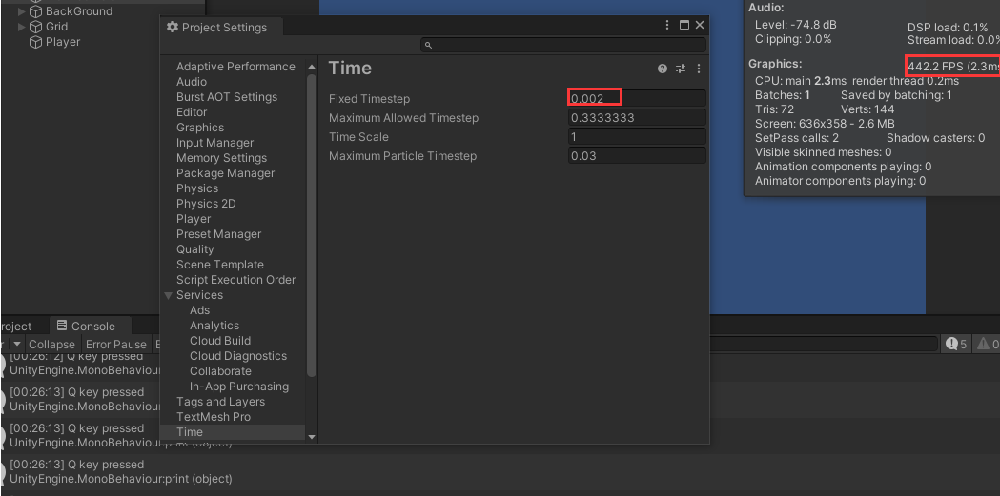
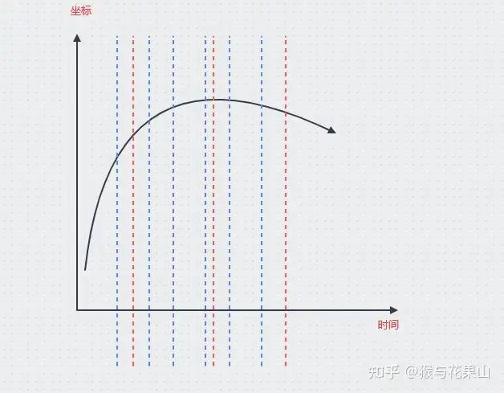
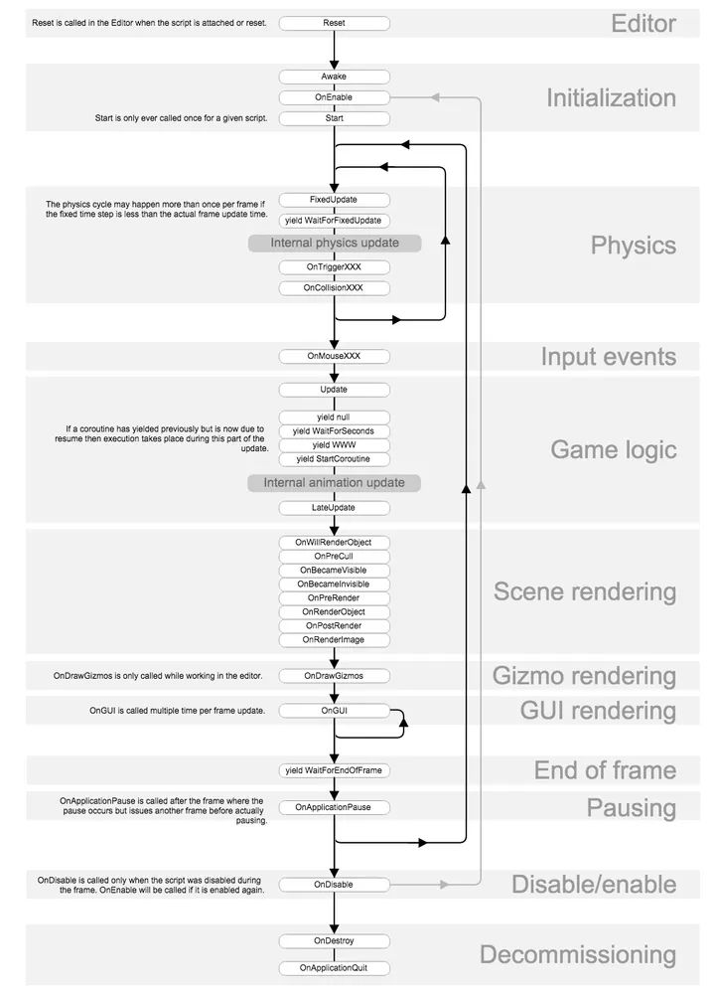
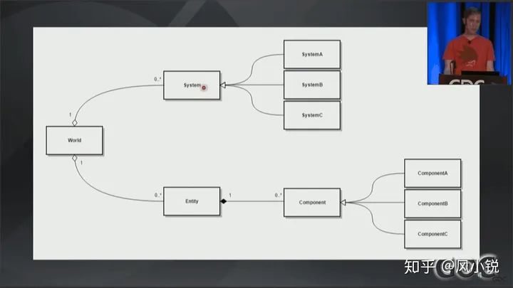
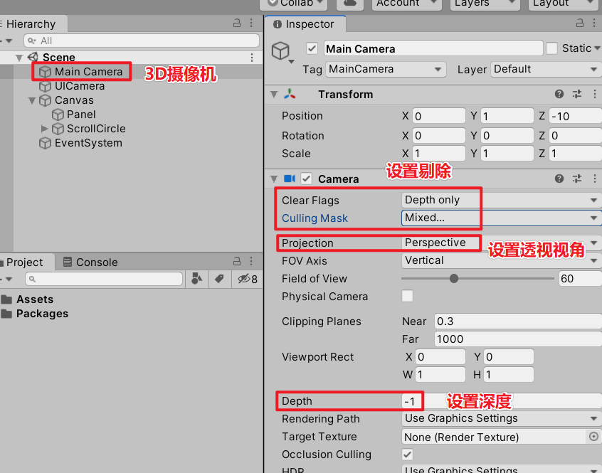
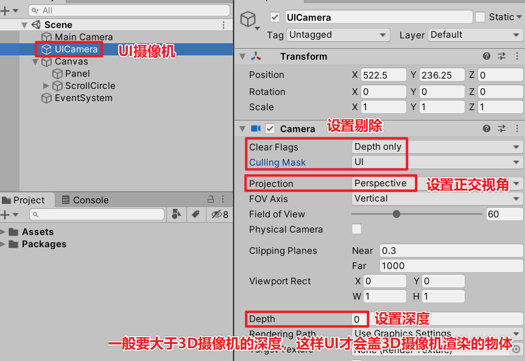

# 使用FixedUpate以及Upate的注意点
来源：https://www.cnblogs.com/rkmao/p/15715494.html

## 前言
在实际使用Update和FixedUpdate时，遇到一些操作在FixedUpdate不生效的情况。在网上找了一圈要么是一些还没官方文档通俗易懂的定义，要么没有解释到位没能解惑，于是自己根据官方文档分析并通过自己测试做出一些总结。

## 一、定义

先放出官方解释：https://docs.unity.cn/cn/2021.2/ScriptReference/MonoBehaviour.FixedUpdate.html

Update：按实际帧率调用，受运行时设备的性能及一帧需要渲染物件数量和质量的影响。 游戏从场景简单的地方移动到场景复杂的地方时会出现卡顿，往往就是一帧中加载的东西突然增加，加载时间变长导致帧数变少。

FixedUpdate：按固定的帧率调用，根据设置步长固定间隔的执行。例如：设置50帧，那么不管实际帧中一帧执行了多少秒，FixedUpdate固定每0.02s调用一次。


## 二、deltaTime和fixedDeltaTime

Time.deltaTime在官方的定义为：完成上一帧所用的时间（以秒为单位），用通俗易懂的话来描述就是，每一帧所间隔的时间。而Time.fixedDeltaTime也能适用于该解释。

例如：50fps，那么对于fixedDeltaTime就是一个固定值0.02。而deltaTime会受设备性能和渲染情况影响，可能前10帧不稳定足足加载了0.4s，平均每帧0.04s，剩下的40帧平均一下就只剩0.015s了。

在Update中使用位移相关的逻辑时，就会有人建议用速度 Speed * Time.deltaTime 使操作边顺滑，这就类似于权重计算，因为1s的Time.deltaTime的和为1，这就确保了每秒位移的距离是相同的。但这么使用实际上只是解决了单位时间位移不同的问题，在帧率变换明显时这种做法还是会显得卡顿。

想象一下，你的角色正在以匀速10m/s的速度狂奔，突然跑到了新环境帧率猛地降到了10fps，第1帧加载了0.6s，后9帧加载0.4s，虽然因为使用了Speed * Time.deltaTime使得你的角色这一秒和前面一样都跑了10m，但毫无疑问你会看到你的角色闪现了一下。

基于上述情况，把处理物理逻辑的代码放到固定时间执行的FixedUpdate中处理会更加流畅，不会因为实际帧率的变化导致刷新角色行为变得时快时慢（简单说就是一卡一卡的，甚至发生“闪现”）。


## 三、FixedUpdate中跳跃失效问题

那么一股脑把物理逻辑的代码都放入FixedUpdate就行了吗？有问题！

例如控制角色跳跃（Jump）的KeyDown或ButtonDown放在FixedUpdate中，会出现 按键没有反应 或 按下一次键执行了多次 的情况。根据官方文档对FixedUpdate的解释不难推测，FixedUpdate的执行是基于实际帧的。

实际帧率100fps > 固定帧率 50fps的情况 ，FixedUpdate是较为均匀的在这100帧中每2帧执行一次。如果KeyDown或ButtonDown事件触发在实际帧的1帧，3帧，4帧，7帧...，而FixedUpdate是在实际帧的2帧，4帧，6帧，8帧执行，那么就会出现“丢帧”，漏掉了1帧，3帧，7帧，只执行了第4帧的事件。

实际帧率25fps < 固定帧率50fps的情况，FixedUpdate就在每0.02s较为均匀的多次执行实际帧内容。如果KeyDown或ButtonDown事件触发在实际帧的 1帧（0.05s），2帧（0.03s）, 3帧（0.06s）总计0.14s，而FixedUpdate就可能在这0.14s中执行了7次实际帧触发的事件，导致3次按键产生了7次响应。

 
这里提供一种验证方式，在FixedUpdate中写一个KeyDown或ButtonDown事件，分别调节FixedUpdate的固定帧率大致为实际帧率的0.25倍，0.5倍，1倍，1.5倍，2倍，然后快速或匀速按键。结果会发现按键次数和打印日志次数跟这个倍数相符合。（比如：固定帧率为实际帧率的0.25倍（1/4），那么就能看到大概按键4次打印一次结果）
```c#
void FixedUpdate()
{
  if (Input.GetKeyDown(KeyCode.Q))
  {
    print("Q key pressed");
  }
}
```

图中为固定帧率和实际帧率近似1:1的情况



## 四、对Update和FixedUpdate的一些使用建议
基于上述结论，把物理逻辑部分放在FixedUpdate中时，

如果涉及到一些单次按键的情况，考虑到可能会出现“丢帧”，可以把这些单次按键的输入检测放在Update中，确保能捕获到该事件。
```c#
void Update()
{
  if(Input.GetKeyDown(KeyCode.Q))
    isPressed = true;
}

void FixedUpdate()
{
  if (isPressed)
  {
    //执行触发按键的一些逻辑
    isPressed = false;
  }
}
```


# Update，FixedUpdate，LateUpdate的区别
来源：https://www.cnblogs.com/dlyedu/p/7648463.html

## FixedUpdate() 和 Update()    

同：当MonoBehaviour启用时，其在每一帧被调用。都是用来更新的

异：Update()每一帧的时间不固定，即第一帧与第二帧的时间t1和第三帧与第四帧的时间t2不一定相同。FixedUpdate()每帧与每帧之间相差的时间是固定的.

Update受当前渲染的物体影响，这与当前场景中正在被渲染的物体有关（比如人物的面数，个数等），有时快有时慢，帧率会变化，Update被调用的时间间隔就会发生变化。但是FixedUpdate则不受帧率的变化影响，它是以固定的时间间隔来被调用。

所以一些物理属性的更新操作应该放在FxiedUpdate中操作，比如Force，Collider，Rigidbody等。外设的操作也是，比如说键盘或者鼠标的输入输出Input，因为这样GameObject的物理表现的更平滑，更接近现实。

FixedUpdate的时间间隔可以在项目设置中更改，Edit->Project Setting->time 找到Fixed timestep。就可以修改了

## Update() 和LateUpdate()

LateUpdate是在所有Update函数调用后被调用。可用于调整脚本执行顺序。例如:当物体在Update里移动时，跟随物体的相机可以在LateUpdate里实现。
 Unity后台主线程将 Update LateUpdate  制作成两个多线程 先去执行Update的线程，等Update 执行完毕后 在去执行LateUpdate线程。
举个例子，一个宿舍4个人，每个人的起床在update中执行，出发在某个人中的lateupdate执行，这样就可以保证每个人都起床了才会出发。

因为多个update函数是先后顺序是随机的，所以可能摄像机先update而物体还未移动，而下一帧是若物体先update那么就会出现瞬移的情况。多数摄像机都要加上LateUpdate，即所有场景内的调用结束后再更新摄像机。

比如说：有2个不同的脚本同时在Update中控制一个物体，那么当其中一个脚本改变物体方位、旋转或者其他参数时，另一个脚本也在改变这些东西，那么这个物体的方位、旋转就会出现一定的反复。如果还有个物体在Update中跟随这个物体移动、旋转的话，那跟随的物体就会出现抖动。 如果是在LateUpdate中跟随的话就会只跟随所有Update执行完后的最后位置、旋转，这样就防止了抖动。


# [M_Studio] Unity教程：2D横版移动跳跃完美手感（终极版/可多段跳）必看！
来源：https://www.bilibili.com/video/BV1YJ411H7vc/?spm_id_from=333.999.0.0&vd_source=7326fe06b64e27279f7a29142c1cf0b6

* [是一尾先生] 评论：

这里还是有问题，Update()在某些情况下刷新率是大于FixedUpdate()的，比如在我的电脑上，Update()刷新率有300FPS，FixedUpdate()的50FPS根本不够响应的。

FixedUpdate总是出问题无非就是因为两种刷新率不同步造成的。

跳跃分为按键接收getbutton和游戏响应addforce两部分，两部分一旦拆开分别放进update和fixedupdate，就必然可能发生不同步：update<fixedupdate时，接收频率过低，可能会响应多次，导致跳跃力度不统一，甚至一飞冲天的现象；update>fixedupdate时，按键接收频率过高，会出现按键无反应，多次按下只响应几次的问题。

我到处查资料得出的结论是，跳跃的按键接收和反馈都应该在同一个update中执行，鉴于Input实际是在update中接收按键的，所以应该在update中执行。

由于跳跃是瞬发，属于接收敏感，执行不敏感，接收到按键消息之后执行一次即可，只要反馈时间在30FPS以内，体感就不会有偏差，所以即使是使用了物理效果依然要放在Update中

移动响应之所以需要放在FixedUpadate，是因为移动需要持续稳定的推力，对执行频率更敏感，而对接收频率不敏感，移动时无论遗漏了或是多录了按键消息，FixedUpdate都可以保证执行频率稳定。

所以跳跃执行应当由Update()刷新，并依此相应修改力度，而移动响应可以放在FixedUpdate()中。

其实，一般仅有移动需要用到FixedUpdate，滥用FixedUpdate不仅不会让物理效果展现的丝滑，而且很容易在性能不稳定的情况下出现意料之外的Bug。

综上FixedUpdate()应在且仅在需要表现持续、稳定的速度/力的时候调用，其他情况应尽可能少用。


* [Seikaijyu] 回复：

我对于跳跃手感优化的观点如下各位可以听听，事实上物理操作可以放在Update里
up主是通过直接移动调整速度，以及跳跃，事实上，只有对于 * Time.deltaTime 的物理操作才需要去FixedUpdate里调用
速度不 * Time.deltaTime的物理操作跟帧数是没有任何关系的，对此我做过测试，用Application.targetFrameRate = 60;
约束了我的帧数到60帧附近（正常是1100多帧），然后对比约束和不约束的跳跃最高度，因为我是有二段跳的，所以我反复测试了六次，最终约束和不约束帧数对于Update里的不 * Time.deltaTime的物理操作来说是没有任何影响的，最终结果都在1.99
这说明这对于物理操作是没有任何影响的，所以类似的按键捕获相关物理操作可以放入Update中

* [Seikaijyu] 回复：

Time.deltaTime会返回一秒钟内从最后一帧到当前帧的时间间隔（也就是增量）
当在FixedUpdate中使用Time.deltaTime会返回Time.fixedDeltaTime（其实就是一个固定帧率的时间间隔）
比如60帧一秒钟那么返回的就是1/60 = 0.0166666667就得到了每一帧的间隔，一般是用于让移动匀速，比如滚动条进度，物体移动速度等
rigidbody2d.MovePosition(new Vector2(speed * Time.deltaTime,0);
像这样移动人物的X轴

* [Seikaijyu] 回复：

物理操作并不会跟随帧率所改变，所以请把与帧率无关的物理操作放入Update

`fixedupdate应该还有别的作用，比如持续掉血的这类判定，用update想想都觉得离谱（`
* [是一尾先生] 回复：

想法很好，但是不建议这么做，一方面是FixedUpdate更消耗性能，另一方面FixedUpdatede的计时器是FixedTime和真实时间realtime也是有差异的
实现每秒扣血可以采用协程yield+WaitForSeconds()函数，或者采用realtimeSinceStartup在Update中计时

* [是一尾先生] 评论：

关于FixedUpdate的问题可以参考这篇文章https://www.cnblogs.com/murongxiaopifu/p/7683140.html
再次重复一下FixedUpdate仅可用于持续物理效果的刷新
如果你的跳跃是一般跳跃，即按一次按键施加一次固定力，则应在Update中处理
如果你的跳跃是喷气背包，即长按会持续施加推力，则应在FixedUpdate中处理
还要重复一点，按键监测响应，应在同一种刷新中处理。
简要的说Unity引擎是在FixedUpdate中进行的物理效果模拟
并且以0.02s一次的节奏进行计算
这可以保障物体在自由落体时，一台30FPS的电脑和一台60FPS的电脑都能掉落同样的高度
不过这个0.02s也并非现实时间，而是以Unity进行计数得到的
例如Unity说我盯着时间，0.02s数100下，然后运行一次FixedUpdate
如果你的电脑太卡，Unity可能盯不住时间了，10s才数完100下，那么FixedUpdate也只能在10s之后的下次刷新调用
Update则是可以和现实时间挂钩的
Update运行完一轮会检查CPU时钟，如果时间没到则会挂起
在Unity手册中搜索UpdateOrder或者“事件函数的执行顺序”即可查看两者的详细运行顺序
在UnityAPI中搜索Time，可以查看Unity计时器的计时逻辑。

* [是一尾先生] 评论：

进阶：
在项目设置/时间中可以调整FixedUpdate的刷新频率，即步进时间
而在项目中调用Application.targetFrameRate = 120;
可以让游戏以指定的帧率执行Update，如果设置为-1游戏会以最快的速度运行。
这个设定会垂直同步影响。
如果设置了垂直同步，那么就会抛弃该设定 而根据屏幕硬件的刷新速度来运行。
如果设置了垂直同步为1，那么就是60帧。
如果设置了为2，那么就是30帧。
另外一提Unity中不进行任何设置的话，测试环境中垂直同步是关闭的，并且刷新值为-1。
在发布包中垂直同步则是默认打开的。
如果出现了测试中帧率异常，请在任意Awake()中调用该函数进行帧数设定。
监测帧数参考这篇文章https://www.freesion.com/article/30751419318/#_31


# 把物体运动的函数放进FixedUpdate是否合理?
来源：https://www.zhihu.com/question/509476780#:~:text=1%20%E4%BA%BA%E8%B5%9E%E5%90%8C%E4%BA%86%E8%AF%A5%E5%9B%9E%E7%AD%94%20%E5%A6%82%E6%9E%9C%E6%98%AF%E5%9F%BA%E4%BA%8E%E7%89%A9%E7%90%86%E7%9A%84%E5%87%BD%E6%95%B0%EF%BC%8C%E5%B0%B1%E5%BA%94%E8%AF%A5%E6%94%BEfixed%20update%EF%BC%8C%E6%AF%94%E5%A6%82rigid%20body%E7%B1%BB%E4%B8%8B%E7%9A%84set%20position%2C,set%20velocity%E8%BF%99%E4%BA%9B%EF%BC%8C%E4%BD%86%E5%A6%82%E6%9E%9C%E4%B8%8D%E6%98%AF%EF%BC%8C%E5%B0%B1%E4%B8%8D%E5%BA%94%E8%AF%A5%E6%94%BE%EF%BC%8C%E6%AF%94%E5%A6%82%20transform%E7%B1%BB%20%E4%B8%8B%E7%9A%84set%20position%E6%88%96%E8%80%85character%20controller%E7%B1%BB%E4%B8%8B%E7%9A%84move%EF%BC%8Csimple%20move%E8%BF%99%E4%BA%9B%E3%80%82

* 回答：

如果是基于物理的函数，就应该放fixed update，比如rigid body类下的set position, set velocity这些，凡是涉及到给Rigidbody施加力，设置速度，设置位置、设置旋转的操作，都必须放在fixedUpdate里面。
但如果不是，就不应该放，比如transform类下的set position或者character controller类下的move，simple move这些。

Fixed update和update的区别是前者的时间周期是和物理解算的周期一致的，默认为固定值0.02s，后者的时间周期就是游戏刷新帧时间，也就是deltatime，是个动态值。

你把物理相关类的函数写在update下的结果就是这个函数的执行频率和其他物理解算行为（比如碰撞）的执行频率不一致，就很容易出现错误的解算结果（比如穿透）。


* 回答：

要看其中计算的数据的是否依赖分帧迭代的方式计算的。 
例如， 要计算物体运动的轨迹， 为了支持物理碰撞， 不能直接用数学公式计算， 而要用到分帧计算；  这类分帧计算的每个时间间隔（例如0.02秒）必须是固定的， 所以要放在 FixedUpdate 中；反之， 如果放在普通的 Update/LateUpdate 中， 它每帧的 时间间隔 不是固定的， 计算出的运动轨迹就会误差非常大。

作者：hproof
链接：https://www.zhihu.com/question/509476780/answer/2294953414
来源：知乎
著作权归作者所有。商业转载请联系作者获得授权，非商业转载请注明出处。


# Unity为什么推荐在FixedUpdate处理物理模拟？
来源：https://zhuanlan.zhihu.com/p/137395596

基本上在初学Unity的时候都会看到生命周期中一系列的Update：FixedUpdate推荐做物理模拟、Update、LateUpdate推荐更新相机等。但是，为什么？都在Update做不行吗？

先看一下FixedUpdate的特性：**如果启用了MonoBehaviour，则每个固定帧率调用该函数。** 应该就是这个特性决定了他的作用。那么他一定是固定的频率吗？因为Unity的逻辑基本都是单线程的，所以他肯定不会一直是固定的，比如某一帧的Update卡了很长时间，下一帧的FixedUpdate肯定会受影响。

举个栗子，在某一帧卡住Update很长时间。然后打印FixedUpdate的时间


结果是在每次Update卡完后都会**执行完应该执行**的多次**Fixedupdate**。比如FixedUpdate设置的是0.5s一次，Update卡了10秒，在卡完Update之后会立即执行20次FixedUpdate，并且在FixedUpdate中获取某些变量，比如Time.time时，获取到的是没有卡的时间，但并不是所有数据，比如DateTime就显示当时的FixedUpdate是一块执行的。


结论：当Update卡了之后，FixedUpdate会尽量模拟没有卡的情况，让开发认为当时是没有卡的。

那为什么适合做物理模拟，举个比较极端的栗子。


假设A在向左移动，B在向上移动，某个时刻AB相交。但是在更新的时候卡了，如果在Update中更新的话，可能下一帧AB就已经错过了相交的时刻。但是如果在FixedUpdate中更新的话，即使卡了AB也会执行多次类似固定时间的更新。呈现出来的就是没卡的数据模拟。在状态同步的战斗逻辑中可能没有什么效果，但是在帧同步的战斗中应该很有用吧(可能，因为我是一个没有做过帧同步的前端。。)。

但是如果说Update可以实现FixedUpdate的效果吗，肯定是可以的。自己维护一个计时器，获取当前时间与计时器的差值，判断是否应该多次更新等等。

以上纯属YY，毕竟我是只只做过状态同步的前端。。如果不对，欢迎直接打脸，大家一起学习进步。

下面测试代码

```c#
using System;
using System.Collections.Generic;
using UnityEngine;

public class TestUpdate : MonoBehaviour
{
    public GameObject go;
    public GameObject goEntity;
    public List<GameObject> lgo;

    int index = 0;

    private void Start()
    {
        Application.targetFrameRate = 1;
    }

    void Update()
    {
        if (index >= 100)
            return;
        Debug.Log("update");
        for (int i = 0; i < 500000; i++)
        {
            lgo.Add(Instantiate(go));
        }
        foreach (var go in lgo)
        {
            DestroyImmediate(go);
        }
        lgo.Clear();
    }

    private void FixedUpdate()
    {
        goEntity.transform.position = goEntity.transform.position + Vector3.one;
        Debug.Log("FixedUpdate -> Time.time : " + Time.time + " index : " + index++ + "  DateTime : " + DateTime.Now + "  " + goEntity.transform.position);

        if (index > 100)
            Application.targetFrameRate = 60;
    }
}
```


# [知乎] Unity为什么推荐在FixedUpdate处理物理模拟？
来源：https://www.zhihu.com/question/642445192

## 回答一
* 作者：一级皮克斯
链接：https://www.zhihu.com/question/642445192/answer/3457556638
来源：知乎
著作权归作者所有。商业转载请联系作者获得授权，非商业转载请注明出处。

我发现答案当中的一些回答不对，甚至还有说游戏逻辑放在FixUpdate里面的。
关于这些回答我只想说：
你不妨在FixUpdate当中用UnityEngine中的Time.realtimeSinceStartup打印一下真实时间尝试一下，你会发现FixUpdate打印的时间完全不是你所预料的。
也就是说FixUpdate经过的时间，在现实中**不是你所预期的固定时间**，而是**游戏内的时间**。如果你有网络方面的使用，然后逻辑在FixUpdate，那简直就是灾难性的。
物理模拟需要的是一个稳定的时间，于是就在计算机内部恒定了一个值。这个值设定的我记得是0.02，你自己也可以去修改。
所以推荐在FixedUpdate处理物理模拟，并且仅推荐只在物理模拟当中用

## 回答二
* 作者：sjinny sun
这个2024年的提问，可以在一篇20年前的文章里找到答案：

https://www.gafferongames.com/post/fix_your_timestep/


## 回答三
* 作者：猴与花果山
链接：https://www.zhihu.com/question/642445192/answer/3458088681
来源：知乎
著作权归作者所有。商业转载请联系作者获得授权，非商业转载请注明出处。

其实FixedUpdate正是暴露Unity不理解游戏开发的关键所在，这个FixedUpdate的名字起得非常妙，与其说是固定update，他更多的可以叫做修复update。这要从他的原理说起，而为什么物理推荐用FixedUpdate，以及为什么游戏逻辑帧都应该用FixedUpdate，耐心看下去就会理解。

### 先说说FixedUpdate在Unity中是如何实现的

探讨一切问题之前，了解问题的原理是最重要的事情，不能知其然而不知其所以然。所以你猜FixedUpdate在unity中是如何实现的？其实非常简单，千言万语不如一段伪代码：

```c#
int _ticked = 0; //Component已经运行了多少次FixedUpdate了
float _elapsed = 0; //Component运行了多少现实时间了
float _eachTickInSec = 0.02f; //这比较符合unity的逻辑，其实不太对，不const因为unity可以设置

void Update(){
  float delta = Time.deltaTime;
  int shouldTicked = Mathf.FloorToInt(_elapsed / _eachTickInSec) + 1; //_elapsed为0时首次运行所以+1
  while (_ticked < shouldTicked){
     FixedUpdate?.Invoke();
     _ticked++;
  }
  _elapsed += delta;
}

```

有注意到吗？因为unity一开始架构的逻辑框架是基于update的，这里犯了一个错误，就是他并不理解游戏的Update是如何正确工作的，这会在之后说到。因为这个update的错误，导致一个性质，就是update如果作为“世界最小时间单位”，他就过于不稳定，以及有时候太“久”了。而用update作为逻辑基础的时候，人们总会犯一个错误，也是因为“有时候太久了”，所以人们会认为只要给个deltaTime去补间，就可以解决问题了，事实上是这样，但不是这样——用话说出来可以说成这样的原理，但实际原理并非如此，所以unity在这里误会了游戏开发，才搞出这么一个问题，但是最先暴露问题的，结果不是Gameplay（还是与现代游戏开发已经落后到只能做即时回合制游戏了有关，不过这是另一个问题，我也在其他回答里早有说过），当然暴雷是迟早的——因为有一些逻辑运算，他必须依赖于“最小时间单位”，比如物理对于现实就是如此，它的“连续性”要求就是最小时间单位推进，不然会错过一系列运算。而deltaTime的补间运算本身，就必然是利用“幻术”帮人错过这一些内容的，最简单的一个例子：



图中随着时间推进（deltaTime变化），红色是一个Component的Update，蓝色是另一个的，他们同时去计算每一帧角色坐标，而角色坐标是上面这个函数。这时候他们在不同的帧取到的是完全不同的坐标，如果此时要运算比较精密的东西，就会出现不可饶恕的误差。所以我们不得不需要一个fixedUpdate去完成这个使命，但是问题来了，**还是以上图来说——真正的需求，并不是说横轴是现实时间，然后在横轴上取点尽可能均匀（这是外行也是unity所理解的FixedUpdate），真正的需求是横轴就是逻辑时间（int单位），因此横轴上每一个点（每+1）都是1个最小时间单位，他不需要和现实时间有任何的汇率。**

正如我所说——不光是物理，游戏也需要这样一个“最小时间单位上做事”的tick，**这也正是魂系即时回合制游戏和怪物猎人系列标准动作游戏之间的分水岭**。在即时回合制游戏中，一个动作是一个回合，动作发生之后用补间不精确计算类似碰撞之类的东西问题不大，但是动作游戏，用杠精们的一句话说——“那我每一帧都是一个回合不就是动作游戏了？”是的，那请问，怎么做到每一帧都是一个回合了？**是不是，很简单，也就是每一帧都不能是用deltaTime补间出来的，每一帧都需要极为精确的数据，物理恰好也是如此，所以unity不得不打这个补丁**。到这里，不难发现——FixedUpdate更合适的称呼要叫修复update，因为他本质是bug fixed（至少unity认为fixed了）的意思。

### 经典的游戏开发中游戏的一个Update都要做什么？

为什么unity（或者还有你）都会产生“Update就是对的”这个错误的概念？根本原因就是我刚才说的——不理解游戏开发。那么经典的游戏开发中，Update都干了什么呢？我们就从“古”至今的看一下：

#### I\O
主要是输入设备比如鼠标键盘的io，当然读写文件老的做法也会在一个update里面做，所以加载之前开始卡，加载完卡完。但是上世纪的游戏机已经把这个文件加载的io做另外一个线程了。

#### Gameplay逻辑运作改变数据
这里就是核心的Gameplay逻辑开发的地方，也应该是引擎完全不涉足的领域（UE在这里犯了致命错误就是涉足太深），这里精确到一个游戏，都可能存在截然不同的做法。但是因为会产生很多代码如果抽象清晰可以复用，所以ECS的框架就成了一个很好的选择，当然这不是这篇的核心话题。这里要说的就是——游戏的本质，就是通过一系列规则（系统），来改变一系列的数据，这是根，也是Gameplay的工作，不是什么狗屁3C这些没价值的体力劳动。

#### 渲染数据绘制内存（Cpu运算渲染数据）
这是根据游戏的数据，决定什么东西需要渲染的，简单的理解，就是类似调用gdi的copyRect之类的接口。但是核心的工作是，你要决定哪些东西需要渲染在屏幕的哪儿，最后组装成一个bitmap也就是送给屏幕每一个点的数据。这部分的主要工作大多是由引擎完成的，比如unity里面是交给相机完成的， 相机的本质是一个卡马克算法（经典称呼，现代也称作“裁剪”）+shader（更换角度、scale参数渲染到屏幕）。

在这个环节，现代行业里有一个经典错误——就是角色的坐标浮点化。实际上角色坐标作为游戏核心逻辑数据，他必须是一个int的因为它存在要比较的关系比如a.pos == b.pos。而浮点（unity中transform.position）是现代技术中送给显卡决策像素点的重要参数，所以逻辑坐标（v2int、v3int）和渲染坐标（v2）或者渲染坐标的中间件（v3 transform.position）是一个兑换关系，应当有一个汇率即可。

显卡的最终使命，是在你显示器区域上决定每一个点用什么颜色，由于视觉是非常复杂的玩意儿，涉及光学等，所以才需要算法来决策得出更真实的结果。这些算法其实都是硬件商做的，和开发游戏的人没啥关系，我们开发游戏调用对应的接口就完事儿了。

#### 预绘图（现代的shader）
在以前使用CPU双缓冲的时代，是通过上面的工序在内存绘制了一张Bitmap，现代其实也是差不多的意思，GPU会帮你绘制出一张Bitmap，然后把一些对应的参数抛给你，你去修改这张图上的点，就是所谓的shader。当然这更多的还是考验你的美术设计能力以及一些算法知识。

预绘图在每个时代都是有的，只是以前我们做游戏的时候，是在cpu上做这个，幸好屏幕点数少，比如640x480很大了，后来屏幕分辨率更高了，也是因为gpu牛逼了。但实际上工作量来说，现代游戏的开发量，是远远小于当年的，因为这是开发游戏最艰苦的环节——你既要保证效果又要保证性能，这是当年的难题，其实在今天的硬件下，这个难题已经荡然无存了，只是“难”的概念保留了，所以shaderer们也因此能吃到红利。

#### 翻出来（Render）
最后将内存的图调用显卡接口绘制出来，这是以前的cpu做法，现代已经都交给显卡了。

**变化的是实现的过程和具体写的内容，不变的是，一个Update总要干这些事情**。在以前的开发中，由于每个update都要做这么多事情（其实是不太好的），所以帧率会低，并且因为绘制的工作都在cpu，cpu算力也不够，所以我们做游戏的时候，贴图（也就是今天的“渲染”）的坐标，都是每一帧固定根据逻辑坐标直接贴上去的，这会产生一个什么问题？就是帧率低的时候，肉眼可见的角色移动卡顿（其实是可以接受的，但是今天的人看习惯了补间出来的肯定受不了，别说现代的年轻人，我这样老牌开发者都吃不消这个了），所以在后来，当cpu性能大幅度提高，以及很多运算分给gpu之后，补间算法流行了，float和除法终于可以满天飞了。**但是要命的是，有那么一天，人们终于因为知识传承的崩塌，结合自己的小聪明也就是“解释型策划”，曲解了这么一个概念——他们甚至认为deltaTime才是唯一正确的做法，殊不知，deltaTime是为了动画流畅做的补间算法，因为你没法保证每2次update之间的时间相等，但是动画要自然流畅，为了避免卡顿，才有的deltaTime，这才是真相！**

### 所以（物理和游戏逻辑）为什么需要这么一个FixedUpdate？
所以到这里，聪明的人应该已经看明白了——为什么物理、游戏逻辑等需要一个FixedUpdate？这里的FixedUpdate更确切地说，应该说是“最小游戏时间单位进行一次tick”——换而言之，**并不是需要0.02秒或者多少秒一次，这不重要，重要的是，我们的逻辑建筑在这个基础之上，以此为最小时间单位，他是“另一个世界的时间单位”，他完全不需要和现实时间有一个汇率。**

那为什么有存在这么一个汇率呢？因为unity（和游戏开发外行，确切地说是因为现代编程门槛降低了很多，逻辑抽象能力不需要太高水平了）始终无法理解“另一个世界的时间单位”这个概念，而书呆子的本能，告诉他们“我需要一个更精密的现实时间”，所以FixedUpdate被这么干出来。

当然，我们说游戏逻辑用fixedUpdate为什么？跟物理一样，吃它2点：

其一，他的间隔相对稳定，虽然他不需要和现实时间有个汇率，但是当你用的引擎不得不要求你尽可能和现实时间换算的时候，是不是汇率越稳定越好？那是自然，所以在一个错误的基础上选择最接近正确的是无奈的最佳方案。

其二，上面的老游戏开发流程中，随着多线程的普及，内存运算一张Canvas的事情也交给了其他线程，所以你可以吧update当做那个线程（他总是会更慢的，除非你的游戏设计有问题），把这个fixedUpdate用来当做标准游戏的tick就行了。

### 结论
就是FixedUpdate是一个补丁，但是补得好，希望物理能教会unity怎么编程（不光是做游戏了），但显然傲慢的他们凑了个效果就认为问题解决了呗，所以，请尽量别用unity提供的EC框架（这套gameobject，monobehaviour的框架）以外的东西（比如刚体之类的玩意）。

另外也是最重要的一点——在今天你们“学”到不少游戏开发的东西（特指b站各种视频），并非传承，而是小聪明不顾全大局的补丁，比如“逻辑写在update用deltaTime补间”，这个想法并不是不行，只要你别做精密度太高的动作游戏，做回合制游戏问题不大。


# FixedUpdate真的是固定的时间间隔执行吗？聊聊游戏定时器
来源：https://www.cnblogs.com/murongxiaopifu/p/7683140.html

## 前言
有时候即便是官方的文档手册也会让人产生误解，比如本文将要讨论的Unity引擎中的FixedUpdate方法。
> This function is called every fixed framerate frame, if the MonoBehaviour is enabled.

而大家似乎也都认为FixedUpdate是在固定的时间间隔执行，不受游戏帧率的影响。其实这么说并不准确，甚至有些误导。因此，我就写这篇文章来聊聊Unity的FixedUpdate方法，或者说来聊聊游戏引擎的定时器实现吧。

## 直观印象
我相信各位对FixedUpdate的直观印象首先来自于它的名字。并且常常会和一般Update方法进行对比，以突显它的，呃，特殊性。
其次，有一些实验精神的小伙伴也许会亲自来测试一下这个方法的时间间隔。而Console输出的内容也十分符合他的预期，简直毫厘不差。

不过，我相信很多笃信FixedUpdate的朋友一定有过类似这样的疑虑：默认情况下FixedUpdate的更新频率是50FPS（0.02s），如果当游戏的更新频率较大时——例如60FPS——那么FixedUpdate有固定的更新频率还稍微可以理解，但是如果游戏本身的更新频率就很低——例如30FPS——那么是怎么保证FixUpdate的更新频率呢？

而Unity的主要逻辑是单线程的（参见Aras的回答：https://forum.unity.com/threads/is-unity-multi-threaded.67879/ ），所以也不存在有不同的逻辑循环可能，换句话说Update和FixedUpdate是在同一个线程上调用的。

问题似乎开始变得有趣了。
如果我们来重复一下各位测试FixedUpdate时经常采用的方式：打印两次调用之间的时间间隔，或者是计算每次调用的累积时间，但区别在于我直接使用了真实的时间：
```c#
void FixedUpdate()
{
	Debug.Log("FixedUpdate realTime: " + Time.realtimeSinceStartup);
}

void Update()
{
	Debug.LogError("Update realTime: " + Time.realtimeSinceStartup);
}

```

为了以示区别，正常的Log是FixedUpdate，LogError是Update，并且设定整个游戏的更新频率为30FPS。


通过上图可以发现，FixedUpdate并不是间隔0.02s才调用一次，相反，它有可能在Update之前**调用多次**。

例如刚启动时，在某次Update之前连续调用了11次FixedUpdate，而之后每次Update调用之前都会调用1~2次FixedUpdate方法，这也很好理解，因为FixedUpdate的频率是50FPS，而我们设定的更新频率为30FPS，FixedUpdate的调用次数势必要多于Update。

所以，FixedUpdate除了用来处理物理逻辑之外并不适合处理其他模块的逻辑，尤其是当大家的潜意识里都笃定它的更新频率是固定的时候。因为这很危险，比如一个需要状态同步的游戏要求按照固定的频率向目标同步状态，如果贸然采用FixedUpdate方法，就会出现上图那样可能在短时间内多次调用的问题。**所以最好只在物理逻辑的处理中使用FixedUpdate，而不要滥用**。而由于FixedUpdate主要是用于物理逻辑的，因此下文的讨论也主要围绕物理逻辑。

## 可变增量时间
ok，那我们来看看游戏引擎的定时器是如何来实现的吧。假设我们手头没有一个现成的游戏引擎，一切都需要自己来实现，那么一个最简单的游戏循环大概就是下面这个样子的。
```c#
double lastTime = Timer.GetTime();
...

while (!quit()){

  double currentTime = Timer.GetTime();
  double frameTime = currentTime - lastTime ;

  UpdateWorld(frameTime);
  RenderWorld();

  lastTime = currentTime;
}

```

这种实现方式使得增量时间和具体的机器设备相关，并且它每一次的**时间增量都不一定相同**。

当机器十分快时，引擎可能通过线程休眠来保证固定的FPS。
```c#
while(timeout > 0.001 && deltaTime<timeout)
{
    //...休眠后计算新的增量时间
}

```

所以看上去整个游戏保证一个大致的更新频率似乎不难。但是现在问题的关键在于每次更新时的**时间增量无法保证相同**。而在物理模拟中，保证一个固定的增量时间是十分重要的。这是因为在游戏引擎进行物理模拟时要使用数值积分，而作为最简单的数值积分方法——欧拉法在游戏引擎中大量使用。


上面就是一个欧拉法的简单例子。可以看到增量时间是很重要的。而在游戏引擎的物理模拟中，一个不稳定的增量时间可能导致很多和预期相悖的结果。

由于此时计算的是真实的时间，而真实的增量时间无法保证固定，那换一个思路，我们把参与物理模拟的增量时间当做一个常量可以吗？换句话说，不论游戏的更新频率如何，参与物理模拟的增量时间是一个常数。

## 固定增量时间
一个最简单的固定增量时间的实现，显然就是将固定的增量时间作为一个常量参数传递给物理模拟模块，这样我们就能够保证物理模拟的增量时间固定，同时还能将物理模拟的更新频率和游戏引擎的更新频率进行解耦——物理的模拟不受引擎的更新频率影响，无论游戏的更新频率是多少，传递给物理模拟的增量时间都是一个常量。

这里还拿Unity引擎来举例子，默认情况下项目的Fixed Timestep的值为0.02s。也就是说物理模拟的频率是50FPS，假设我们的游戏的更新频率是25FPS，那么会发生什么呢？没错，游戏每1次Update时，物理模拟都要推进2次，也就是之前我们看到的在Update之前多次调用了FixedUpdate。那么如果我们的游戏更新频率是100FPS呢？这次就变成了每2次Update调用1次FixedUpdate。

这也就解释了为何有的朋友在做相关的小测试的时候，在每次FixedUpdate内打印Time.deltaTime时输出的都是0.02了，因为Time.deltaTime并非两次调用FixedUpdate之间真实的时间间隔，而是来自我们在项目的Time设置内设置的值——它是一个与真实时间无关的常量。

> When called from inside MonoBehaviour's FixedUpdate, returns the fixed framerate delta time.

那么这种固定增量时间的逻辑如何用代码表示呢？很简单，只需要在主循环的内部，再来一个二级循环。
```c#
double  simulationTime = 0;
double  fixedTime = 20;

while (!quit()){

  double  realTime = Timer.GetTime();

  while (simulationTime < realTime){
         simulationTime += fixedTime; 
         UpdateWorld(fixedTime);
  }

  RenderWorld();
}

```

而Unity的实现显然也是类似的，这个在Unity手册中关于执行顺序的相关章节内可以看到。


上图标明了FixedUpdate是属于物理模拟模块的，同时在主循环的内部，物理模拟的部分还有一个二级循环。

## 总结及建议
好了，到了需要总结一下的时候了。

经过上文的分析，我想各位应该都能了解一个游戏引擎是如何实现定时器的了吧，而且在物理模拟时使用一个固定的增量时间也并不神秘，只需要让物理模拟和真实时间解耦，使用一个常量作为其增量时间即可。

同时还要提醒各位，不要滥用Unity的FixedUpdate方法，因为它是用来处理物理模拟的，更重要的是它并非根据真实时间的间隔执行。

-EOF-
最后打个广告，欢迎支持我的书《Unity 3D脚本编程》


# MonoBehaviour的生命周期
来源：https://zhuanlan.zhihu.com/p/595995318
## 前言
Unity3D 中可以给每个游戏对象添加脚本，这些脚本必须继承 MonoBehaviour，用户可以根据需要重写 MonoBehaviour 的部分生命周期函数，这些生命周期函数由系统自动调用，且调用顺序与书写顺序无关。

MonoBehaviour 的继承关系：MonoBehaviour→Behaviour→Component→Object.

MonoBehaviour 的生命周期函数主要有：
* **OnValidate**: 确认事件，脚本被加载、启用、禁用、Inspector 面板值被修改时，都会执行一次
* **Awake**：唤醒事件，只执行 1 次，游戏一开始运行就执行。
* **OnEnable**：启用事件，只执行 1 次，当脚本组件被启用的时候执行一次。
* **Start**：开始事件，只执行 1 次。
* **FixedUpdate**：固定更新事件，每隔 0.02 秒执行一次，所有物理组件相关的更新都在这个事件中处理。
* **Update**：更新事件，每帧执行 1 次。
* **LateUpdate**：稍后更新事件，每帧执行 1 次，在 Update 事件执行完毕后再执行。
* **OnGUI**：GUI渲染事件，每帧执行 2 次。
* **OnDisable**：禁用事件，只执行1 次，在 OnDestroy 事件前执行，或者当该脚本组件被禁用后，也会触发该事件。
* **OnDestroy**：销毁事件，只执行 1 次，当脚本所挂载的游戏物体被销毁时执行。

## 验证
LifeCycle.cs
```c#
using UnityEngine;
 
public class LifeCycle : MonoBehaviour {
    // 确认事件, 脚本被加载、启用、禁用、Inspector面板值被修改时, 都会执行一次
    private void OnValidate() {
        Debug.Log("OnValidate");
    }
​
    // 唤醒事件，只执行 1 次，游戏一开始运行就执行
    private void Awake() {
        Debug.Log("Awake");
    }
 
    // 启用事件，只执行 1 次，当脚本组件被启用的时候执行一次
    private void OnEnable() {
        Debug.Log("OnEnable");
    }
 
    // 开始事件，只执行 1 次
    private void Start() {
        Debug.Log("Start");
    }
 
    // 固定更新事件，每隔 0.02 秒执行一次，所有物理组件相关的更新都在这个事件中处理
    private void FixedUpdate() {
        // Debug.Log("FixedUpdate");
    }
 
    // 更新事件，每帧执行 1 次
    private void Update() {
        // Debug.Log("Update");
    }
 
    // 稍后更新事件，每帧执行 1 次，在 Update 事件执行完毕后再执行
    private void LateUpdate () {
        // Debug.Log("LateUpdate");
    }
    
    // GUI渲染事件，每帧执行 2 次
    private void OnGUI () {
        // Debug.Log("OnGUI");
    }
 
    // 禁用事件，只执行1 次，在 OnDestroy 事件前执行，或者当该脚本组件被禁用后，也会触发该事件
    private void OnDisable () {
        Debug.Log("OnDisable");
    }
 
    // 销毁事件，只执行 1 次，当脚本所挂载的游戏物体被销毁时执行
    private void OnDestroy () {
        Debug.Log("OnDestroy");
    }
}
```

## 完整生命周期




# 浅谈Unity ECS（一）Uniy ECS基础概念介绍：面向未来的ECS
来源：https://zhuanlan.zhihu.com/p/59879279
## 系列内容规划
ECS是新的面向数据的游戏架构，从暴雪在GDC2017放出了Overwatch Gameplay Architecture and Netcode演讲后(需要科学上网，原本需要GDC Vault订阅才能看，目前已经免费开放，推荐大家观看)，开始越来越多地进入人们的视野。目前已经有很多研发中的MOBA及FPS在研发过程中使用了ECS架构，云风大大目前也在开发自己的ECS架构引擎。各大常见商业游戏引擎也在往这个方向跟进：CryEngine5已经内嵌了ECS架构在其中；Unity在2018中已经有了ECS相关的Package可以导入使用，且给出了一些很优秀的示例，目前正在快速进行迭代，计划在未来将ECS功能直接放入正式版中，和正常的OO框架并存同步更新，且提到了未来的开发重心将会向ECS转移(On DOTS: Entity Component System：https://blog.unity.com/engine-platform/on-dots-entity-component-system 中后面提到)。

可以说，ECS已经拥有成为未来主流游戏架构的潜力，作为一个游戏开发人员，有必要对相关的知识进行一个系统的了解。本系列以Unity Entites包的相关源码为基础，对ECS中有关的相关概念和设计思想进行一个简单的剖析。这个系列文章从开始构思，到动笔开写大约用了三周时间，这部分时间主要用在理解Unity Entities包的相关代码，整体来说相关的代码量较大（数十万行），且由于代码涉及到底层的内存管理相关逻辑（C# Unsafe代码），对于平时较少接触这部分逻辑的我来说还是有一定理解难度，在完整理解了几个我认为比较关键的知识点后，我才能安心地下笔开始写这个系列文章。由于本人水平有限，文章中难免存在不足之处，对于文章的不准确和其他建议想法，也欢迎在评论指出。

本系列预期一共由四篇文章组成，分别为：

浅谈Unity ECS（一）Uniy ECS基础概念介绍：面向未来的ECS
浅谈Unity ECS（二）Uniy ECS内存管理详解：ECS因何而快
浅谈Unity ECS（三）Uniy ECS项目结构拆解：开发思路及案例分析
浅谈Unity ECS（四）Uniy ECS项目实战：从零开始构建简单示例
本篇为系列第一章。

## ECS基础介绍
ECS的全称为Entity Component System，是最早由暴雪在GDC2017上提出的一个新的游戏设计框架，数据的组织和对象的处理上都和目前主流的OO模型有很大的差距，这里引用一下云风在浅谈《守望先锋》中的 ECS：https://blog.codingnow.com/2017/06/overwatch_ecs.html#more 构架中的总结：

>Entity Component System (ECS) 是一个 gameplay 层面的框架，它是建立在渲染引擎、物理引擎之上的，主要解决的问题是如何建立一个模型来处理游戏对象 (Game Object) 的更新操作。




简单来讲，这里的Entity是一个实体，类似于Unity中的GameObject，可以表示游戏中的单个对象。Component是Entity的一个属性，或者说一个Entity是由多个Component组合而成的，类似Unity中的Component，但一般定义为一个结构体，不包含任何函数。System来处理含有某些特定Component的Entity的某一类行为，如一个MoveSystem处理所有包含Position和Velocity组件的Entity的移动过程。

这边最主要区别就是把对象上的数据和行为剥离，由专门的System来处理某一种行为，而不是每个对象在自己的一个更新函数中处理所有和自己相关的操作。当然我们在平时面向对象设计过程中，也会有类似的管理器来处理对象的一部分行为，但ECS在架构设计的时候就将需要将这部分操作和需要的数据提前考虑清楚，使得每一个系统的都能符合ECS的要求。

## ECS代码查看
本系列的参考对象是Unity的ECS源码，因此当务之急是获取ECS包相关的代码，并将其放入项目中处于可以调试的状态，对于一些疑难之处可以直接查看源码调试理解。

幸运的是，Unity中可以很方便的获取到ECS包的代码，不需要去其他额外的地方下载，具体操作步骤如下：

 1. Unity创建新项目(笔者目前使用Unity2018.3.6f1)
2. 打开`Window->Package Manager`窗口，导入最新的Entities包，以及依赖的Mathematics、Hybrid Renderer和Burst包。
3. Entities依赖的Performance Test包面板无法直接添加，找到`项目目录/Packages/manifest.json`文件，在entities包下面加入一行"`com.unity.test-framework.performance": "0.1.50-preview`",
4. 在`项目目录/Library/PackageCache/`目录中，找到entities和test-framework两个目录复制到`项目目录/Packages/目录下`
5. 修改manifest文件中的entities和test-framework两行，让其直接加载Packages文件夹中的本地文件："`com.unity.entities`": "`file:./com.unity.entities","com.unity.test-framework.performance":"flie:./com.unity.test-framework.performance`",
6. 关闭Unity，删除`项目目录/Library/PackageCache/`路径下的所有文件，并重新打开刚刚的项目
7. Unity打开C# Project，即可看到所有ECS相关的代码，可以添加简单的System代码进行调试。

如果觉得比较麻烦也可以直接下载我github上已经创建好的测试工程，已经按上述流程操作过并添加了简单的测试代码：
https://github.com/sharpwind612/ECSCodeAnalyse

## Unity ECS基本概念
在开始分析Unity ECS相关的源码之前，有必要先从实现层面对于Unity ECS的一些重要概念进行一个简要介绍
### Entity的概念
`Entity`为ECS中基本的成员，实际上只是由一个Index和一个Version组成(Version只有在Entity被回收后会加1)，其实际的Component数据存储在一个Chunk上(Unity ECS特有的数据类型，后面会讲到)，需要操作其Component数据时，根据其index到EntityDataManager中找到其所在的Chunk和IndexInChunk，取到对应的Component数据后进行操作。
```c#
public struct Entity : IEquatable<Entity>
{
	public int Index;
	public int Version;
	......   
}
```
### Component的概念
`Component`是Entity的一个属性，通常是一个继承了`IComponentData`或`ISharedComponentData`接口的结构体(两个接口都为空接口，仅标记类型)。一个Entity可以包含多个`Component`，继承了ISharedComponentData的数据会在多个Entity之间共享，同时可以使用托管类型的成员，一般用来存放GameObject或RenderMesh等渲染相关的成员。

一个Entity的Component可以在CreateEntity时指定，也可以使用一个ArcheType创建或从已有Entity复制来创建。同时已经创建的Entity还可以通过`AddComponent`和`RemoveComponent`来动态进行Component的添加或删除(由于效率问题不推荐)。

Tips:Component可以用Proxy包装后直接挂在GameObject上，挂载多个Proxy的GameObject可以作为Prefab直接传入EntityManager.Instantiate来生成新的Entity，如：
```c#
// Create an entity from the prefab set on the spawner component.
var prefab = spawnerData.prefab;
var entity = EntityManager.Instantiate(prefab);
```
### ArcheType的概念
ArcheType是Unity ECS中特有的概念，也是Unity ECS内存管理中的一个核心部分，许多重要操作都与此相关，也是下一篇文章中的重点。ArcheType是由某几个固定Component组成的Entity原型，有以下几个特点：

* ArcheType管理所有属于它的Entity Component数据，对应数据存放在归属于它的chunk上
* 可以通过ArcheType快速访问所有该类型的Entity Component数据
* 拥有Component的Entity一定处在某个ArcheType的管理之下
* ArcheType拥有缓存机制，第二次创建相同的ArcheType时会自动将现有的返回

我们可以使用EntityManager.CreateArchetype(params ComponentType[] types)来主动创建一个ArcheType，通过ArcheType可以直接调用EntityManager.CreateEntity(EntityArchetype archetype)来快速创建具有某一类特征的Entity。同时如果使用直接传入Components的方式来创建Entity时也会自动生成含有对应Component的ArcheType。关于ArcheType的相关问题会在下一篇文章中重点分析。
### ComponentSystem的概念
`ComponentSystem`为System在Unity ECS中的实现。一个`ComponentSystem`会对含有某些`Component`的Entity执行一些特定的操作，通常继承自`ComponentSystem`或`JobComponentSystem`。区别是继承`ComponentSystem`只会在主线程执行，而继承自JobComponentSystem的则可以利用JobSystem来进行多线程并发处理，但同时对应操作过程中的限制也更严格。在大部分情况下应当尽量使用`JobComponentSystem`来完成相关的操作，从而提升性能。

多个不同的`ComponentSystem`可以在定义时通过`UpdateBefore`、`UpdateAfter`、`UpdateBefored`等标签来控制其执行顺序，这会在一定程度上影响并发执行，通常只在必要时使用。

一个`ComponentSystem`通常关注一个包含特定的`Component`组合的Entity集合(称为`ComponentGroup`，下一篇重点讲)。这个ComponentGroup集合可以通过GetComponentGroup主动获取，
```c#
ComponentGroup m_Spawners;
//获取包含ObjectSpawner和Position两个Component的ComponentGroup
protected override void OnCreateManager()
{
    m_Spawners = GetComponentGroup(typeof(ObjectSpawner), typeof(Position));
}
```

也可以使用`IJobProcessComponentData`中的定义和`RequireSubtractiveComponentAttribute`等标签自动注入(Inject)，同样也会生成一个`ComponentGroup`
```c#
//通过RequireComponentTagAttribute为JobComponentSystem添加额外的依赖项
//[RequireComponentTagAttribute(typeof(Object))]
//通过RequireSubtractiveComponentAttribute为JobComponentSystem添加额外的排除项
[RequireSubtractiveComponentAttribute(typeof(ObjectSpawner))]  
struct ObjectMove : IJobProcessComponentData<Position>
{
    ......
    public void Execute(ref Position position)
    {
        ......
    }
}
```

## 数据存储相关
### Chunk的概念
`Chunk`是Unity ECS中特有的一个数据结构，在ECS部分代码中有大量使用，通常是指用来存放Component信息的与`ArchetypeChunk`，此外还有更一般的Chunk通过`ChunkAllocator`进行开辟，可以存放ArcheType中的各类型信息，大小和存储结构都与ArchetypeChunk不同，此处的Chunk特指存放`ArcheType`中Component信息的ArchetypeChunk。Chunk有以下几个特点：

* `EntityManager`会将Component数据存放在固定的16kb大小的`Chunk`中(可以在Chunk定义中找到指定大小kChunkSize)
* 每个`Chunk`结构包含了这个区块中内容的相关信息
* 每个`EntityArchetype`都包括了一个Chunk的独特集合
* 一个`chunk`只能存在于一个`archetype`中
* 一个`ArchetypeChunk`结构是一个到具体`Chunk`的指针

每一个Chunk中包含的内容有：
* 一个指向其所归属的Archetype的指针
* 一个可以容纳多少个该Archetype类型Component数据的容量(Capacity)以及当前存放个数(Count)，容量由Chunk的总大小除以单个Archetype所有Component大小之和得到
* 一个关于SharedComponentData值的索引(indices)数组，每个Chunk对于每种SharedComponentData类型只会存放一份具体值，所有在该Chunk上的Entity数据共享该值。
* 一个ChangeVersion表明该Chunk上每一种Component上一次被修改的时机
* Entity中各ComponentData的具体数据，这边相同的类型的ComponentData会被放在一起，一种类型结束才是下一种

Chunk中正式ComponentData数据内容从Buffer字段开始，ComponentData的具体存储排列如图：


## 常用管理器介绍
Unity ECS中对于不同类型的对象由不同的Manager进行管理，这边对常用的Manager进行一个归纳。

### EntityManager
ECS日常使用中使用最频繁的管理器，每个World都会有一个EnitityManager，不直接储存数据，但封装了常用的Enitity、Archetype、Component操作，包括了CreateEntity、CreateArchetype、Instantiate、AddComponent等操作，对应接口后面的章节会讲到，这里不作详细说明。

同时EntityManager提供了其他多个重要数据管理器的访问接口，包括Entity数据管理器EntityDataManager、原型管理器ArchetypeManager、Component集合管理器EntityGroupManager、以及共享数据管理器SharedComponentDataManager。可以说以EntityManager为入口，可以延伸到ECS系统中90%以上的内容，可谓包罗万象。

### ArchetypeManager
管理所有的Archetype的创建、更新、删除等操作，管理了所有当前已创建的Archetype。当需要建立新的ComponentGroup时会到ArchetypeManager中读取所有Archetype的列表m_Archetypes，来筛选需要关注哪些Archetype，同时在Archetype发生变化时也会同时更新对应的ComponentGroup数据。

### EntityDataManager
管理所有Entity相关的数据，可以通过m_Entities->ChunkData快速根据Entity Index获得Entity所在的Chunk和在该Chunk上的Index，从m_Entities->Archetype获取其Archetype,从而快速访问对应的Component数据。

### EntityGroupManager
管理与ComponentSystem运作息息相关的ComponentGroup。从每个ComponentSystem中收集其需要关注的Component集合，同时在System的每次Update前更新这个集合，同样的集合只会存在一个。ComponentGroup的相关机制也是下一章内容的重点

## 总结
在本篇文章中对于Unity ECS系统的常用名词、基础结构进行了一个简单的介绍，旨在建立一个对于ECS系统的初步认识，在后续篇章中将会结合本篇的一些概念，针对Unity ECS内存管理部分进行一个系统的分析。

## Reference
Overwatch Gameplay Architecture and Netcode：https://www.youtube.com/watch?v=W3aieHjyNvw
组件与Chunk的内存布局：https://blog.csdn.net/yudianxia/article/details/80498015
Unity ECS 架构与交通模拟的实现：https://blog.uwa4d.com/archives/Usparkle_ECS.html
浅谈《守望先锋》中的 ECS 构架：https://blog.codingnow.com/2017/06/overwatch_ecs.html#more
题图来自《Devil May Cry 5》


# 浅谈Unity ECS（二）Uniy ECS内存管理详解：ECS因何而快
来源：https://zhuanlan.zhihu.com/p/64378775


# 浅谈Unity ECS（三）Uniy ECS项目结构拆解：功能要点及案例分析
来源：https://zhuanlan.zhihu.com/p/70782290


# Unity的三级排序层级渲染Layer,sorting layer,order in layer
来源：https://blog.csdn.net/qq_42672770/article/details/109442043

## 一. 前言
Unity游戏开发中，模型、界面、特效等等，需要规划好层的概念，涉及到摄像机（Camera）、画布（Canvas）、Shader等相关内容。

 Unity大致按照三级排序进行层级渲染：Camera的Depth CullingMask > Canvas的Sorting Layer > Canvas的Order in Layer

## 二. 摄像机（Camera）
一般3D游戏项目，会创建至少两个摄像机，一个3D摄像机（使用透视视角）和一个UI摄像机（使用正交视角）。
### 3D摄像机



### UI摄像机


### 摄像机的Depth和Clear Flags设置
**一般UI摄像机的Depth要大于3D摄像机的Depth，这样才能使UI在3D摄像机渲染的物体的前面显示**。
摄像机的Clear Flags建议使用Depth only，然后在Culling Mask选择相应的层（Layer）。

比如3D摄像机的Culling Mask如下：


UI摄像机的Culling Mask如下：


这个Culling Mask的下拉列表中就是一个个的层（Layer），如果要添加新的层，可以点击Inspector窗口中的Layer，然后点击Add Layer...进行添加。

创建3D物体或UI界面的时候，都会设定物体的Layer，3D物体默认是Default层，UI默认是UI层。

**摄像机会根据Depth从小到大的顺序，渲染各自Culling Mask的层**。
注意，在世界坐标下，物体A挡在物体B前面，但是只要渲染物体A的摄像机的Depth大于渲染物体B的摄像机的Depth，那么在Game视图中看到的效果就是物体B挡在物体A前面，如果物体A和物体B同在一个摄像机中渲染，那么正常情况下就是物体A挡住物体B（这里说正常情况下，是因为还可以通过下文的RenderQueue、SortingLayer、SortingOrder等的设置，让物体B挡在物体A前面）。


## 三. 画布（Canvas）
UGUI中，所有UI元素都必须在画布（Canvas）的子节点中。Canvas的Render Mode一般是使用Screen Space - Camera模式，**把UICamera赋值给Canvas的Render Camera**。

这个时候，可以看到Canvas的面板中，出现了两个关键的属性：Sorting Layer、Order in Layer。

### Sorting Layer
添加Sorting Layer可以点击Inspector窗口的Tag -> AddTag -> SortingLayer

然后Canvas就可以在Sorting Layer中看到新加的Sorting Layer了（有点绕口）

为什么要有这个Sorting Layer呢，因为我们可以创建很多个Canvas，默认Sorting Layer是Default，这个时候，渲染顺序是根据Canvas的节点在Hierarchy窗口中的顺序来决定的，上层的节点先渲染，下层的节点后渲染。
而有时候，可能需要打破这个顺序，让上层节点的Canvas后渲染，这个时候，就可以设置这个Sorting Layer为高的值，当然，也可以保持相等，通过设置Order in Layer。

拓展：UGUI会自动合并批次，原理是它会把一个Canvas下的所有元素合并在一个Mesh里，如果Canvas下的元素很多，任意一个元素发生位置、大小的改变，就需要重新合并所有元素的Mesh。如果元素非常多的话，就可能会造成卡顿。
一个比较好的做法是每个UI界面都设置成一个Canvas。如果这个界面下的元素比较多，可以考虑嵌套多几个Canvas。尤其是会频繁改变位置大小的元素，这样可以降低它们合并Mesh的开销。但是Canvas嵌套太多也不好，Mesh合并是降低了，但是DrawCall又上去了，因为**每个Canvas都会单独占用一个DrawCall**。

**注意：到这里，应该明白了Layer与Sorting Layer无关，它们是两个概念：Layer是相机的相对深度值的渲染CullingMask层级,  SortingLayer是UGUI中Canvas画布的渲染层级**。


### Order in Layer
**Order in Layer顾名思义，就是Sorting Layer的内部排序**，这样配合Sorting Layer就是**两级的排序**，可以解决大部分情况的渲染顺序需求。
当然，如果创建多个UI摄像机，不同Canvas绑定不同的UI摄像机，**再配合摄像机的Depth，就是三级排序**，但一般不创建太多的UI摄像机，除非逼不得已。

>小结: **渲染排序级别：Camera的Depth > Canvas的Sorting Layer > Canvas的Order in Layer**

另外，ParticleSystem也有Sorting Layer和Order in Layer。

## 四. Shader的RenderQueue
Unity提供给我们一些默认的渲染队列，每一个对应一个唯一的值，来指导Unity绘制对象到屏幕上。这些内置的渲染队列被称为Background, Geometry, AlphaTest, Transparent, Overlay。这些队列不是随便创建的，它们是为了让我们更容易地编写Shader并处理实时渲染的。
示例

Tags{ "RenderType" = "Geometry" }
1
在材质球中可以看到显示。


Properties    Value    渲染队列描述    备注
Background    1000    This render queue is rendered before any others.    这个队列通常被最先渲染（比如 天空盒）。
Geometry    2000    Opaque geometry uses this queue.    这是默认的渲染队列。它被用于绝大多数对象。不透明几何体使用该队列。
AlphaTest    2450    Alpha tested geometry uses this queue.    需要开启透明度测试的物体。Unity5以后从Geometry队列中拆出来,因为在所有不透明物体渲染完之后再渲染会比较高效。
GeometryLast    2500    Last render queue that is considered “opaque”    所有Geometry和AlphaTest队列的物体渲染完后
Transparent    3000    This render queue is rendered after Geometry and AlphaTest, in back-to-front order.    所有Geometry和AlphaTest队列的物体渲染完后，再按照从后往前的顺序进行渲染,任何使用了透明度混合的物体都应该使用该队列（例如玻璃和粒子效果）
Overlay    4000    This render queue is meant for overlay effects.    该队列用于实现一些叠加效果，适合最后渲染的物体（如镜头光晕）。
当RenderQueue填-1是使用shader自定义的值，否则使用手动填的值。
2500是关键值，它是透明跟不透明的分界点。
知识点:
RenderQueue > 2500的物体绝对会在RenderQueue <= 2500的物体前面，即渲染时RenderQueue大的会挡住RenderQueue小的，不论它的Sorting Layer和Order in Layer怎么设置都是不起作用的。

当两个的RenderQueue都在同一侧时，在Sorting Layer高的绝对会在Sorting Layer前面，无视RenderQueue跟Order in Layer，只有在Sorting Layer相同的前提下，Order in Layer高的会在Order in Layer低的前面，无视RenderQueue。当Sorting Layer跟Order in Layer相同时，才看RenderQueue的高低，高的在前面。
 

## 小结：
1、Sprite Renderer、ParticleSystem有sorting layer,order in layer。

2、Canvas根据Render Mode的不同，属性显示不同，当为ScreenSpace-Overlay时，只有sort Order属性，其他两种模式有sorting layer和order in layer属性，原因是Screen Space-Overlay渲染模式下，UI元素将在场景的上面，不受sorting layer的影响。

3、Layer与sorting layer无关，layer是对游戏中所有物体分类别划分，便于相机拣选，在camera的Culling mask进行选择。

4、sorting layer与渲染次序相关，根据sortingin layer中设置的先后顺序依次渲染。Order in layer是在同一个sorting layer内的细分，根据数值由小到大依次渲染。（渲染优先级为Camera.depth,sorting layer,order in layer）

5、UGUI画布上面的UI对象的层级关系不受Z轴的影响，按照hierachy中由上到下的顺序进行渲染。游戏对象层的Z轴影响渲染顺序，渲染优先级处于Camera.depth,sorting layer,order in layer之后。


# 【Unity】如何优雅地移动物体-8个方法
来源：https://blog.csdn.net/GG_and_DD/article/details/126917358

>在游戏开发中，如何移动物体？是我们需要思考的事情。
Unity 引擎也提供了众多的方法，每个开发者的使用习惯也各不相同，所以往往不是很清楚在这种场景下哪种方式最好的或者最有效的。
那么，这篇文章，我想分享一下移动物体的一些方法和优缺点。


项目地址：https://github.com/MyBaron/UnityExample

* Transform.Position

## 向某个方向移动
### Transform.Position
众所周知，我们可以给对象的`Transform`组件赋予一个坐标来决定其位置。
```c#
transform.position = new Vector3(2, 1, 0);

```

当我们每一帧给对象赋予一个新的坐标，那么看起来，这个物体就是在运动的。
```c#
void Update()
{
	var dir = new Vector3(0.02f, 0, 0);
	transform.position += dir;
}

```

### Transform.Translate()
由于直接改变 Position 属性看起来不太优雅。所以 `Transform` 组件提供了一个更友好的方法：`Transform.Translate()` 。
```c#
 void Update()
{
	var dir = new Vector3(0.02f, 0, 0);
	transform.Translate(dir);
}

```

其实，他的内部与 `Transform.Position`无异。
```c#
public void Translate(Vector3 translation, [DefaultValue("Space.Self")] Space relativeTo)
{
  if (relativeTo == Space.World)
	this.position += translation;
  else
	this.position += this.TransformDirection(translation);
}

```

效果与 Transform.Position 一致

但是这种方法产生了一个问题。由于设备之间的差异或者动态数据的变化会导致每一帧之间的间隔是不相等的，因此，如果以帧数来控制物体移动，物体的移动距离就没办法准确把握。
效果如下


所以我们需要在原来的基础上乘以 `Time.deltaTime`属性的值，从而保证每秒移动的距离是一致的。
```c#
void Update() 
{
     var dir = new Vector3(2f, 0, 0)*time;
     transform.Translate(dir);
}

```

这样不同的帧数移动距离都会一致。
效果如下：


但这还不够优雅。在游戏中，我们经常需要改变物体的速度。为了方便实现，我们通常会使用单位向量来确定方向，增加一个浮点值来控制速度。
```c#
public float speed = 2;
void Update()
{
    var dir = new Vector3(2,0,0)
    transform.Translate(dir.normalized * speed * Time.deltaTime);
}

```


## 移动到指定位置
移动到指定位置，大概有两种方式。
* 速度：物体通过特定速度向目标移动。
* 时间：物体在时间内到达目标。

### Vector3.MoveTowards()：固定速度
以固定的速度移动到目标位置
```c#
public Vector3 targetPosition;
public float speed=10;
void Update()
{
    transform.position = Vector3.MoveTowards(transform.position, targetPosition, speed * Time.deltaTime);
}

```


### Vector3.SmoothDamp()：平滑移动
又或者，我们可以用平滑的方式到达目标位置。（平滑：到达位置前提前减速）
```c#
public Vector3 targetPosition;
public float smoothTime = 0.5f; 
public float speed = 10;
Vector3 velocity ;
void Update()
{
    transform.position = Vector3.SmoothDamp(transform.position, targetPosition, ref velocity, smoothTime, speed);
}

```


### Vector3.Lerp()：线性时间移动
该方法的意思是在调用方法期间，已经过的时间除以总持续时间，得到当前的位移目标。
```c#
// 终点
public Vector3 targetPosition;
// 开始位置
public Vector3 startPosition;
// 持续时间
public float lerpDuration = 4;
// 记录运行时间
private float _timeElapsed = 0;

void Start()
{
	startPosition = transform.position;
}

void Update()
{
	// 记录下一个位置
	Vector3 valueToLerp;
	_timeElapsed += Time.deltaTime;
	if (_timeElapsed < lerpDuration)
	{
		valueToLerp  = Vector3.Lerp(startPosition, targetPosition, _timeElapsed / lerpDuration);
	}
	else
	{
		valueToLerp = targetPosition;
	}
	transform.position = valueToLerp;
}

```


以上的这些方法足以让我们准确且随心的操纵物体移动。
但有一些场景，我们**并不希望如此精确或始终如一的运动轨迹**，我们想物体的移动受 Unity 的物理引擎影响或者其他物体影响。
同时如果用以上方法移动，在 Unity 的物理引擎下会出现抖动，穿过刚体等奇怪的现象。


那么接下来，我们就需要用到一些涉及到物理引擎的移动方式。

## 物理引擎移动
### Rigidbody.AddForce()
使用这个方法给物体添加一个方向力。在力的作用下，物体将会移动。那么移动速度和位移就会与物理特效有关，比如物体质量，阻力，甚至还有重力。

一般会有两种使用方式。
在初始时给物体一个力，让其顺着物理规律下运动。使用场景一般时跳跃或者碰撞。
```c#
// 赋予200的力
public float force = 200;
private Rigidbody2D _rigidbody2D;
// 移动方向
private Vector3 dir = Vector3.right;

void Start()
{
	_rigidbody2D = GetComponent<Rigidbody2D>();
	_rigidbody2D.AddForce(Vector2.right * force);
}


```

为了更好演示刚体的运动，我还给刚体的线性阻力改为1，这样没有持续施加外力的情况下，物体会因为摩擦力的存在而停下。

效果如下：
可以看到物体很快就停下了


第二种，会在每一帧持续给物体施加力，使物体可以持续运动。
```c#
 // 赋予2的力
public float force = 2;
private Rigidbody2D _rigidbody2D;
// 移动方向
private Vector3 dir = Vector3.right;
void Start()
{
	_rigidbody2D = GetComponent<Rigidbody2D>();
}

void FixedUpdate()
{
	_rigidbody2D.AddForce(Vector2.right * force);
}

```


从效果可以看到，在持续给外力的作用下，物体移送越来越快，但在阻挡物前会停下。

### Rigidbody.Velocity
直接赋予 Velocity 属性一个向量，可以立即改变物体的速度。一般情况下，我们不需要直接修改速度，除非你非常明确需要立即改变物体的速度。

```c#
public float speed = 10;
private Rigidbody2D _rigidbody2D;
// 移动方向
private Vector3 dir = Vector3.right;

void Start()
{
	_rigidbody2D = GetComponent<Rigidbody2D>();
}

void FixedUpdate()
{
	_rigidbody2D.velocity = dir * speed;
}

```

效果如下：
看到物体一开始就已经有速度，而通过`AddForce`方法添加力的物体，速度时慢慢提高的。


### Rigidbody.MovePosition()
该方法有比较局限的使用场景，当物体的刚体类型是 `Kinematic` 时，使用`Rigidbody.MovePosition()` 方法进行移动。
**因为 `Kinematic` 类型下，不会受到重力和`AddForce`、`AddTorque`等力相关的函数的影响！！！**


>刚体类型是 Kinematic 时 ，会对刚体类型为 Dynamic 施加力，而无视 static 类型。


# 【Unity】找到目标的三种方式（范围内检测敌人）
来源：https://blog.csdn.net/GG_and_DD/article/details/126614461

## 案例场景
英雄检测进入攻击范围的敌人。

代码地址：https://github.com/MyBaron/UnityExample

## 距离检测
核心思路：
● 检测敌人与英雄两点之间的距离，如果距离低于攻击范围，则认为进入攻击范围。
```c#
/*距离*/
public int range = 2;

/*检测到的对象*/
private List<GameObject> detect ;

void Update()
{
	detect = new List<GameObject>();
	var monsterList = CreateMonster.Instance.MonsterList;
	foreach (var monster in monsterList)
	{
		if (Vector2.Distance(gameObject.transform.position,monster.transform.position)< range)
		{
			detect.Add(monster);
		}
	}
}

```


优点：
* 容易实现，只需要判断两点之间距离既可以。
* 轻量级更容易自定义，比如你可以对不同类型的敌人实行不同的检测范围，空中的5格，陆地的7格等。
* 不依赖物理引擎，更简单完成功能。

注意点：
* 因为要遍历判断与敌人的距离，如果敌人太多，每次遍历会消耗太多时间。
* 计算距离不应该每一帧都执行，需要配合定时器，每段时间计算一次即可。
* 距离没有可视化，需要自己实现


## 碰撞器检测
核心思路：
● 利用刚体和碰撞器的检测事件，检测进入范围的敌人。
```c#
/*检测到的对象*/
private List<GameObject> detect = new List<GameObject>();

private void OnTriggerEnter2D(Collider2D col)
{
	if (col.CompareTag("Monster"))
	{
		detect.Add(col.gameObject);
	}
}

private void OnTriggerExit2D(Collider2D other)
{
	if (other.CompareTag("Monster"))
	{
		detect.Remove(other.gameObject);
	}
}

```


优点：
* 容易实现，只需要使用引擎的碰撞器和刚体。
* 交互友好，可以直观看到检测范围，有利于调整范围。
* 基于事件触发，并不是每帧都检测，效率更高。

缺点：
* 需要碰撞器和刚体


## 辅助线检测
核心思路：
● 利用 xxx 划出检测范围。
● 检测进入范围的对象，通过图层过滤筛选出敌人。
```c#
/*检测范围*/
public int range = 2;

[Header("检测图层")]
[SerializeField]
public LayerMask layerMask;

/*检测到的对象*/
private List<GameObject> detect ;

void Update()
{
	detect = new List<GameObject>();
	var objColliders = Physics2D.OverlapCircleAll(transform.position,range,layerMask);
	foreach (var monster in objColliders)
	{
			detect.Add(monster.gameObject);
	}
}


```


优点：
* 利用引起检测进入范围内的敌人，免了主动计算敌人距离的工作。

缺点：
* 检测敌人不应该每一帧都执行，需要配合定时器，每段时间计算一次即可。
* 距离没有可视化，需要自己实现


# 【Unity】如何优雅地实现任何线性效果？
来源：https://blog.csdn.net/GG_and_DD/article/details/127195067

>在游戏中，我们经常想实现一些动画效果。比如：物体缓慢转动、沿不规则路线运动、UI淡入淡出、颜色变化、等等。
其实这些效果的背后，都跟一个函数有关系–Lerp
当你了解并掌握这个函数，实现上面的效果对你来说都非常简单。
在本文中，我将分享一下：
使用经验
使用误区
不规则路线的移动

## 什么是线性插值 ？
两个向量之间的任意值。如图：
向量A，向量B。他们之间的线段AB。在线段AB之间的值，就是线性插值。


对应的 Unity 的 Lerp 函数 Lerp(A, B, 比率t)；
比率范围时 0~1 的情况下：
当比率是0时，那插值等于A点。
当比率是1时，插值等于B点。

## Unity Lerp 相关函数有哪些？
* Material.Lerp ： 材质之间的插值
* Vector2.Lerp ： 向量之间的插值
* Vector3.Lerp ： 向量之间的插值
* Mathf.Lerp ： 浮点数之间的插值
* Color.Lerp ： 颜色之间的插值

## 使用经验
### 移动
我们先简单用 Lerp 函数实现物体的 在 1S 内移动。
代码如下：
```c#
public class Lerp : MonoBehaviour
{
    // 终点
    public Vector3 targetPosition;
    // 开始位置
    public Vector3 startPosition;
    // 持续时间
    public float lerpDuration = 1f;
    // 记录运行时间
    private float _timeElapsed = 0;

    private void Start()
    {
        transform.position = startPosition;
    }

    void Update()
    {
        // 记录这一帧移动的位置
        Vector3 valueToLerp;
        _timeElapsed += Time.deltaTime;
        if ((_timeElapsed < lerpDuration))
        {
            valueToLerp  = Vector3.Lerp(startPosition, targetPosition, _timeElapsed / lerpDuration);
            transform.position = valueToLerp;
        }
        else
        {
            valueToLerp = targetPosition;
        }
        transform.position = valueToLerp;
    }
}

```


### 取线段的任意一点
换个角度，我们也可以取得 AB 线段上的任意一点的坐标。

代码如下：
```c#
public class GetPoint : MonoBehaviour
{
    // 坐标点A
    public Vector2 a;

    //  坐标点B
    public Vector2 b;

    // 比值
    public float ratio;

    private void Update()
    {
        var position = Vector3.Lerp(a, b, ratio);
        transform.position = position;
    }
}


```


其他的线性变化效果其实也是同理，只不过你使用的函数方法可能不一样。

### 文字淡入淡出
```c#
public class FadeToBlack : MonoBehaviour
{
    public float targetValue = 0;
    CanvasRenderer elementToFade;
    void Start()
    {
        elementToFade = gameObject.GetComponent<CanvasRenderer>();
        StartCoroutine(LerpFunction(targetValue, 0.8f));
    }
    IEnumerator LerpFunction(float endValue, float duration)
    {
        while (true)
        {
            float time = 0;
            float startValue = elementToFade.GetAlpha();
            // 淡出
            while (time < duration)
            {
                elementToFade.SetAlpha(Mathf.Lerp(startValue, endValue, time / duration));
                time += Time.deltaTime;
                yield return null;
            }
            elementToFade.SetAlpha(endValue);
        
            // 淡入
            time = 0;
            while (time < duration)
            {
                elementToFade.SetAlpha(Mathf.Lerp(endValue, startValue, time / duration));
                time += Time.deltaTime;
                yield return null;
            }
           elementToFade.SetAlpha(startValue);
        }
    }

}

```


### 渐变
```c#
public class LerpMaterialColour : MonoBehaviour
{
    
    private Text text;
    public Color targetColor = new Color(0, 1, 0, 1); 
    void Start()
    {
        text = gameObject.GetComponent<Text>();
        StartCoroutine(LerpFunction(targetColor, 5));
    }
    IEnumerator LerpFunction(Color endValue, float duration)
    {
        float time = 0;
        Color startValue = text.color;
        while (time < duration)
        {
            text.color = Color.Lerp(startValue, endValue, time / duration);
            time += Time.deltaTime;
            yield return null;
        }
        text.color = endValue;
    }
}

```


## 使用误区
我们平时可能会遇到过，有使用 Lerp 函数实现平滑移动的效果。


```c#
public class Lerp_Error1 : MonoBehaviour
{
    // 终点
    public Vector3 targetPosition;
    // 开始位置
    public Vector3 startPosition;
    
    private void Start()
    {
        transform.position = startPosition;
    }

    void Update()
    {
        transform.position = Vector3.Lerp(transform.position, targetPosition, Time.deltaTime);
    }

```

这使用其实不正确的。因为它实际在改变初始值，通过改变AB之间的距离来得出“插值”。这已经不属于线性插值计算了。


况且，想实现平滑移动的效果，我们其实可以使用 SmoothDamp() 方法。具体使用可以参考这篇文章 TODO。

## 怎么实现不规则运动？


刚刚我们很容易实现了直线运动，那如果我们能把不规则的路线用直线概括指出来，看起来物体只不过是在进行多段直线运动。


# 【Unity300个技巧】牛顿的学问！如何优雅地使用力？

来源：https://blog.csdn.net/GG_and_DD/article/details/127928483

> Unity 提供了一个完备且强大物理引擎。但在刚接触的时候，你可能会对它与现实物理规律对应有一些疑惑。
比如：
现实中 1N 的力在 Unity 中怎么表现？
Unity 中物体的质量是计算的？
Unity 中给物体添加力的方法是 rb.AddForce()，但却又提供了4种力的模式，为什么呢？
本文章，我们就来探讨一下以上的问题。

项目地址：https://github.com/MyBaron/UnityExample

视频：https://www.bilibili.com/video/BV17D4y1s7fQ/?spm_id_from=333.999.0.0&vd_source=8a710823ff2c99f724f320db581f5e95

## Unity 中力的单位
在 Unity 中，rb.`AddForce()`是给物体添加一个力的方法，传参是向量对象，向量的 x ，y，z 代表这方向，值代表力的大小。

这里可能会让人疑惑，这里力的单位是什么呢？是否对应现在中的力的单位 N ？
要验证这个点，最好的办法就算找一个物理学中常量，看这个常量在 Unity 中是多少。
毫无疑问，重力就是我们心中的那个常量。
在现实中，重力约等于 9.81N。
在Unity 中，我们可以在设置里看到重力的默认值，在Y轴方向的大小也是9.81。

所以，我们可以认为，传参向量值的单位等于现实中的 N。
我们可以验证一下。
在一个只有重力的场景，我们添加一个9.81的相对于重力反方向的力，物体时静止的。

## Unity 中物体的质量
在物理学中，涉及到力的计算肯定离不开物体的质量。
在 Unity 中，我们可以认为单位是kg，因为这有助于我们计算。其实这个单位并不太重要，它在 Unity 引擎中的作用只是用于描述两个物体之间相对差异，比如两个物体质量分别是 10 和 100，可以确定的是 100 质量的物体是 10 质量物体的 10 倍重。

举个例子。
从上面公式中得知，同一个力的大小作用在不同物体上，因为质量不同，物体移动的加速度就会不一样。


因此，在游戏里，我们不需要知道质量的单位是多少，只需要维护好每个对象的质量相对值就可以了。
当游戏体量上来后，去维护他们的质量数值也比较麻烦。所以在 2D 模式下，Unity 提供了一个功能，自动计算质量。

当选择启用自动质量后，Unity 会根据 物体的密度和面积自己计算质量。


举个例子。
我们使用相同的力和相同的密度，只改变物体的面积。


## 力的模式
从上文我们了解到改变力的大小和质量，从而控制物体的速度。
但是公式 F=ma中，a 只是加速度，不够直观反馈物体的速度。
我们变换一下公式，
F= ma = m v/t, Ft = m v (t 为时间，v 为速度)。

这样我们就可以很直观的得到速度 v 的大小，但也引入多了一个数值-时间。

时间 t 在 Unity 中应该怎么表示呢？
我们知道，为了保证物理模拟正常运行都会把逻辑写在 FixedUpdate 方法里。因此时间 t 就等于固定频率，默认为0.02s。
这样力，质量，时间都知道怎么表示了，我们可以快速算出物体的速度。

但且慢，为了改变物体的速度，我需要控制3个变量，那也太麻烦了把。
Unity 为此提供4种模式，目的就是为了减少开发者需要关心这么多的变量。

| 模式           | 效果                                 |
| -------------- | ------------------------------------ |
| Force          | 向此刚体添加连续力，使用其质量       |
| Acceleration   | 向此刚体添加连续加速度，忽略其质量   |
| Impulse        | 向此刚体添加瞬时力冲击，考虑其质量   |
| VelocityChange | 向此刚体添加瞬时速度变化，忽略其质量 |
看起来很棒，但却又多了一对概念-连续力和瞬时力。无语~
什么是连续力，什么是瞬时力呢？
在我看来，他们之间没有区别。因为给物体添加力，都是在当前帧里完成的，与下一帧无关，根本不存在连续添加力的情况。
那这里的连续力是什么意思呢？
其实是将力的大小乘以每一固定帧的时间间隔 ，F * 0.02s = 当前帧的力大小。
相比于瞬时力，瞬时力是没有乘以时间的 ，相当于 F * 1 = 当前帧的力大小。

为了更好说明问题，我们演示一下。
代码如下：

Force 模式下的代码

```c#
public class AddForce_Default : MonoBehaviour
{
    // 赋予2的力
    public float force = 2;
    private Rigidbody2D _rigidbody2D;
    // 移动方向
    private Vector3 dir = Vector3.right;
    
    void Start()
    {
        _rigidbody2D = GetComponent<Rigidbody2D>();
    }

    private void FixedUpdate()
    {
        _rigidbody2D.AddForce(Vector2.right * force,ForceMode2D.Force);
    }
}

```

Impulse 模式下的代码
```c#
public class AddForce_Impulse : MonoBehaviour
{
    // 赋予2的力
    public float force = 2;
    private Rigidbody2D _rigidbody2D;
    // 移动方向
    private Vector3 dir = Vector3.right;
    
    void Start()
    {
        _rigidbody2D = GetComponent<Rigidbody2D>();
       
    }

    private void FixedUpdate()
    {
        _rigidbody2D.AddForce(Vector2.right * force,ForceMode2D.Impulse);
    }
}

```


可以看到在 Force 模式下，角色移动明显慢得多。
那是因为每一固定帧下，Force 模式下只赋予角色 2* 0.02 的力，而 Impulse 模式下，赋予角色 2 的力。

为了验证这一点，我们可以将 Impulse 模式下的力改为0.04。
运行效果:


Acceleration 模式和 VelocityChange 模式
在 3D 模式下 ，还会额外多两个模式。在这两个力模式下，都会忽略物体的质量，默认为1。
所以我们只控制力的大小，就可以控制速度大小了。


# Unity UI中的锚点、中心点与位置
来源：https://zhuanlan.zhihu.com/p/685783301

想要使UI控件在屏幕中达到正确的显示效果，比如自适应屏幕尺寸、固定边距等等，首先要理清楚几个基本概念和设置：`锚点(anchor)`、`中心点(pivot)`、`位置(position)`、`UI缩放模式`、`父物件的transform设置`。

## Anchor、Pivot与Position
### Anchor
anchor可以理解为是该控件所在的平面坐标系原点，在屏幕缩放或者形变的过程中，控件本身自始至终都是参照其anchor的位置进行相对移动。就像是船与船锚的关系。
anchor可以设置一个坐标（x, y），这个坐标的参考系是该控件所属的**父层级**，比如，如果直接在Canvas层级底下摆放控件，那么整个屏幕就是其父层级。不论这个父层级的比例高矮、像素多大，它的坐标范围都会被钳制在0-1之间，如果希望子物件的锚点位于父物件的正中间，那么子物件的锚点坐标需要设置为(0.5, 0.5)。

### Pivot
pivot虽然被翻译为中心点，但容易造成误解，因为pivot并不一定在物体中心，甚至可以超出物件的范围。可以理解为轴点（绕该点旋转），或者是吸附点（用该点去吸附目标位置）
pivot也具有一个坐标 （x, y），这个坐标的参考系是**控件本身（子层级）**，原点位于控件的最左下角，(1, 1)点位于最右上角

### Position
position提供的信息是pivot与anchor的**相对距离**，例如坐标 (50,125)就代表：该控件的pivot位于自身anchor的x轴正方向50像素，y轴正方向125像素处。不论屏幕的比例、像素如何变化，pivot与anchor将始终保持(50, 125)的向量值


通过图示可以清楚的看到，anchor以父物件为坐标参考系，pivot 以自身为坐标参考系，position代表二者的距离

## 显示窗口与属性面板
通过图2可以看到：

1. 不论锚点、中心点位于何处，控件的显示位置依然在最中央
2. anchor只能手动拖动到父物件的边界，它的活动范围取决于父物件的大小（如果直接设置坐标，可以超出这个范围）
3. pivot的位置不受限制，所以前面提到，“中心点”的翻译并不贴切


但是令人尴尬的事情发生了，当屏幕的比例发生变化时，控件并没有跟随屏幕自适应（图3）。不过可以注意到：

1. 锚点依然位于父层级的左下角，锚点与父物件的相对位置没有发生改变
2. pivot与锚点的相对位置没有发生改变
3. 控件与pivot的相对位置没有发生改变


通过梳理他们三者的关系，可以尝试这样一种思路：1.设置锚点坐标(0.5, 0.5)，使其处于父物件的中心，不论屏幕如何变化，锚点都在中心位置。2.设置pivot坐标为(0.5, 0.5)，使其处于子物件中心。3.设置PosX=0, PosY=0，使锚点到pivot的向量值归零，吸附到一起。问题解决

点开Transform中的面板（图4），这里可以快速设置锚点的位置，另外两个必须要注意的按键是 shift 和 alt，可以有效提高我们的效率：
* shift+点击 可以同时设置锚点与pivot；
* alt+点击 可以同时设置锚点与position；
* 两个键同时按下则可以快速设置三个属性


shift+alt+点击，所有属性会快速定位到对应的位置（图5）。如果我们的目标位置在某一个空白处，则可以手动拖拽anchor，然后将PosX,PosY设置为（0, 0），消除pivot与anchor的相对距离，控件便会自动吸附到锚点处。由于pivot默认在控件的中心位置(0.5, 0.5)，所以不需要额外设置。


## 注意点 check points
### UI缩放模式
找到 Canvas-UI Scale Mode，下拉菜单中有三种选项，分别是：`constant pixel size`/ `scale with screen size`/ `constant phsical size`。也就是保持像素/跟随缩放/保持物理距离，该缩放模式与transform设置可以形成多种排列组合结果，所以就不举例了。如果效果不正确，记得检查该处设置即可

### 父物件的transform设置
通常不会将所有的UI控件都放在Canvas层级下，而是会有类似 Canvas-grandpa-father-son 的层级管理，所以应当注意之中的 grandpa、father的尺寸(宽度width* 高度height)，如果最底下的son控件需要根据整个屏幕自适应，那么须确保grandpa与father已填充了屏幕尺寸。（如图4所示，可以通过alt+点击最右下角，填充整个屏幕）

## 思考题
现在需要在屏幕右下角放置一个button，有两种设计模式，一种是永远保持与屏幕边框20像素；另一种是永远在屏幕右下角1/10距离处，应该如何实现？


思路：

对于第一种模式，我们需要将pivot移动到**控件**的右下角(1, 0)，将anchor移动到**屏幕**的右下角(1,0)，然后将position（相对距离）设置为 PosX=-20, PosY=20, 使pivot位于锚点x轴负方向20像素，y轴正方向20像素处（图8）。


对于第二种模式，pivot设置为（1,0），锚点设置为（0.9,0.1），PosX=0, PosY=0，将pivot吸附到锚点


# unity的UGUI之中锚点(Anchors)和中心点(Pivot)、Shift和Alt键功能
来源：https://www.e-learn.cn/topic/3846155

在UGUI的控件属性之中，最上方的Rect Transform一栏可以看到锚点和中心点：

## 锚点Anchors

控件用于定位自身的基准点

可以点击左上角的方框，在其中选择锚点的不同方式：

和中心点(Pivot)、Shift和Alt键功能%20001.jpg)

注意图中，黄色的小点即为锚点位置示意，比如最右下角的图表示四个锚点分别位于父控件的四个角落


## 中心点 Pivot

中心点可以通过点击方框，按住shift来设置：

和中心点(Pivot)、Shift和Alt键功能%20002.jpg)

可以看到，蓝色的即为中心点，控件设置的XY坐标即为中心点到锚点的坐标，比如我们按住shift将锚点设为子控件的左上角，然后不按shift键将锚点设为父控件的中心：


## Alt键的功能
按住Alt键可以设置子控件的位置

按住alt键，选将子控件设为父控件的中间靠右的位置：

和中心点(Pivot)、Shift和Alt键功能%20003.jpg)

此外，还可以让子控件填充父控件的宽度高度以及全部：

和中心点(Pivot)、Shift和Alt键功能%20004.jpg)


# 【100个 Unity实用技能】 | 脚本无需挂载到游戏对象上也可执行的方法
来源：https://cloud.tencent.com/developer/article/2236752

通常情况下，新建的脚本要挂载到游戏对象上才能运行。下面讲一个脚本无需挂载也可执行的方法。

如果在脚本中的方法前使用 `[RuntimeInitializeOnLoadMethod(RuntimeInitializeLoadType.AfterSceneLoad)]` ，则可以不用挂载到任何游戏对象上即可在程序运行时执行此方法，方便在在程序初始化前做一些额外的初始化工作。

1. InitializeOnLoadMethod ：第一次打开 Unity 编辑器运行一次，之后每次进入 Play 模式都运行一次
2. RuntimeInitializeOnLoadMethod ：在每次进入 Play 模式时运行一次，还可以通过参数确定在加载场景之前还是之后调用方法。

使用示例如下代码所示：
```c#
[RuntimeInitializeOnLoadMethod(RuntimeInitializeLoadType.AfterSceneLoad)]
public static void DoMethod()
{
        GameObject go = GameObject.Find("GameObject/YYY");
        Debug.Log("GO："+go);
        Debug.Log("It's the start of the game");
}
```

此时具有该方法的脚本无需挂载到Unity场景中的对象身上即可执行该方法中的内容。

RuntimeInitializeLoadType更多参数如下所示：

* RuntimeInitializeLoadType.AfterSceneLoad // 加载场景后
* RuntimeInitializeLoadType.BeforeSceneLoad // 在加载场景之前
* RuntimeInitializeLoadType.AfterAssembliesLoaded // 加载所有程序集并初始化预加载的资源时进行回调
* RuntimeInitializeLoadType.BeforeSplashScreen // 在显示启动屏幕之前。
* RuntimeInitializeLoadType.SubsystemRegistration //用于注册子系统的回调


# [知乎] 为什么说Unity能用单纯脚本实现的功能，尽量避免继承MonoBehavior，保持纯粹性?

作者：Iris
链接：https://www.zhihu.com/question/31163311/answer/126627738
来源：知乎
著作权归作者所有。商业转载请联系作者获得授权，非商业转载请注明出处。

原回答有疏漏之处，此处再次补充~
题主所问，其直接解答有2点：
一是为了保持内核独立，解耦引擎，为了未来的移植其他引擎做准备
二是为了保障性能，由于Unity的MonoBehavior底层机制原因，会有较大性能消耗（相对）——————————
第一点，对内核独立而言，我是保持讨论态度的。
以前游戏引擎不成熟，写游戏用的DX接口、OP接口是很难看的，它们的API基本没多少相同，甚至渲染流水线到现在都不一样，一个新手很容易就写出高耦合的游戏，它的移植性能基本为0。因此很多教学书、教师都会很强调解耦代码。即使到了游戏引擎走向成熟，注重跨平台的现在，商业游戏解耦游戏引擎依然是主流。

（尤其是Unity当您开始用Lua的时候，没有解耦过的代码添加Lua功能真是个灾难）
从这一点上，我是相当赞同使用单纯的脚本实现功能的。不过对独立开发者来说，解耦引擎毫无必要。因为“解耦”并不是独立开发者当下最紧迫的任务，产品才是最最重要的任务。深有体会。

第二点，是资源的问题。
Unity的MB机制会导致它的调用比内部调用慢一些，在优化角度来看用单纯的脚本实现功能是有必要的。
开发手机游戏的话，它是正确的，因为手机资源抓襟见肘。
开发网游服务端也是对的，要尽可能压榨服务器性能。
那么问题来了，追求极限性能为什么要用Unity？！如果想要性能，开发安卓就应该从cocos或者直接从Activity搞起，开发服务器端直接就是Linux+c++ 。要性能，极限压榨，是个不错的想法。

但是如果你要用Unity，就该放手写脚本（当然蹩脚程序一个obj挂几十个compent的当我没说过），千万不要患上性能强迫症去花大把时间构造性能强大结构复杂的脚本。通常，一个游戏（Unity开发桌面程序或者动画同理）流畅与否取决于画面渲染，而不是脚本。脚本制作只要记住一点，只优化大量循环的代码就行了。经典的代码例如角色控制器，AI等。其他代码尽可能简洁。非游戏开发一般是不需要考虑这么多的，测试的时候注意有没有特别卡的地方就好了。除非客户或者上司特别强调性能，不然花点时间去调下画面明显更加合算。

总结，继承MonoBehaviour是有很多好处的，调试方便，思维顺畅，这些都是可以大大加快开发进程的。当然弊端也有不少，因此既不能强行脱离MonoBehaviour去开发游戏，也不能全部逻辑依赖MonoBehaviour，个中的拿捏程度，就看各位未来的开发需求了。


作者：MaxwellGeng
链接：https://www.zhihu.com/question/31163311/answer/557136453
来源：知乎
著作权归作者所有。商业转载请联系作者获得授权，非商业转载请注明出处。

帮改一下问题，顺便回答一下。

之前的问题确实不妥，“尽量避免使用MonoBehavior”，这显然是不对的。

本科阶段我们就学习过设计模式，即良好的程序要尽可能提高聚合性，降低耦合性。而巨量的MonoBehavior有大概率是会大大拉低聚合性，并使逻辑缠绕在一起提高耦合性的。耦合度高的代码不仅难以维护，还会造成巨量性能消耗。

举个栗子吧，比如你需要实现这么一个需求：做一个Left 4 Dead中的打僵尸的FPS射击实现，现在这个需求有以下几个技术点：

物理表现方面：
1. 僵尸要有布偶效果和动画互动，不停的奔跑并追杀主角。
2. 人物要携带角色控制器，简单的跑跳蹲趴走都要有。
3. 主角有枪能发射子弹，主角有刀能砍（与场景互动）。
 
渲染方面：
1. 僵尸数量巨大，需要在SRP中实现一套动画实例化的渲染管线，并靠脚本提交绘制指令。
2. 子弹击中僵尸会喷血，击中墙壁会有火花，考虑到Unity现有的粒子效果比较挫，需要自己实现一套基于GPGPU的粒子。
3. 僵尸身上喷出的血会溅到墙上，需要实现贴花。
 
逻辑方面：
1. 僵尸状态控制：攻击状态，血量等。
2. 人物状态控制：血量，体力等。 
 
这里提供两种实现方案：

第一种：每把枪开一个Component拖到模型上，我们称之为GunController，在主角身上放一个Component负责移动控制，我们称之为PlayerController，每个僵尸身上拖一个Component，自动获取Mesh种类并提交给SRP进行绘制，并且存储着怪物的状态，我们称之为MonsterController， 粒子效果的脚本我们称之为Particle，贴花脚本称之为Decal。

那么这个调用状态将会是这样：GunController触发射线事件 -> 获取MonsterController，计算伤害等 -> 实例化粒子，实例化贴花。而僵尸攻击主角的过程则是MonsterController -> Collider -> PlayerController

与此同时，每帧MonsterController，Particle, Decal等都要依靠Update函数向SRP提交绘制指令， 这套系统还需要提供接口给其他组件，比如UI。

第二种：只开3个Component，一个管枪，一个管主角，剩下一个管所有僵尸。而实现则全部以struct和static class的形式，比如子弹计算，就直接使用静态函数计算射线碰撞等，并且用控制所有僵尸的脚本直接在字典中计算伤害，僵尸的状态则直接依靠脚本单例进行遍历，攻击时也直接向主角脚本发送请求。绘制指令全部统一提交，切枪，换枪时也只是切换枪的模型，动画，射击参数等。

对比这两种办法就能看到第二种只用了三个MonoBehavior， 而第一种则需要用满屏幕的Component，起码光僵尸身上人手一个Component数都数不过来了。而第二种方法从各个方面来讲都比第一种要好不少。首先，开发效率上，第一种需要不停的开脚本不停的拖，而且很难做模块化，因为每一部分都是与其他部分互相依赖的，所以必须在写代码之前祷告一翻，保佑自己没有一部分会出问题，这样一下子就能跑起来了，而第二种方法大多数都是静态的没有依赖的方法，本身可以直接进行单元测试和排查。维护效率上讲，这么一套链式调用过程基本一个月以后就是能跑的起来全看天了，更别提迭代和加功能了，而第二种将数据和逻辑进行模组化控制，版本迭代和需求变更也要容易得多。再说运行性能。MonoBehavior的Update等函数，是需要经过函数指针的，调用效率远不如普通函数，尤其是当数量巨大时这一点表现的更加明显，同时MonoBehavior脚本本身也会产生不菲的GC，最后的结果就是游戏各种GC卡顿，帧数大受影响。相反，反观后者则基本不会在运行时产生新的对象，可以说是0GC压力，甚至多线程并行运算也没问题， 比如僵尸的骨骼动画和状态因为使用统一的脚本控制，是可以直接使用Job System进行多线程优化的，运行性能比前者不知道高到哪里去了。

以前没有开发经验的时候，自己做游戏常常用前一种方法，拖的满屏幕各种Component，结果就是半个月过去望着满屏幕的Component一脸懵B，而现在有了一定的开发经验，在开发时就会刻意注意做好层级分割，到最后最上层的调用层总共剩不下几个MonoBehavior。

总结一下，尽可能少的使用Unity component，开发效率高，多人合作容易，可维护性可扩展性高，更容易做优化且运行效率更高。


作者：皮皮关
链接：https://www.zhihu.com/question/31163311/answer/556104514
来源：知乎
著作权归作者所有。商业转载请联系作者获得授权，非商业转载请注明出处。

意外搜到古老问题，终结性回答一下。

这个说法本身确实有问题，应该这么说：
1、写新脚本、新的class时，先确认，我需要的是一个需要挂到物体上的组件，还是普通的类？

2、如果是自己管理的类，和组件没关系的，那么千万不要继承MonoBehaviour。

例如：用class定义一套道具数据，道具的数据和Unity没什么关系，当然不能继承MonoBehaviour。

3、如果是写一个脚本组件，而且需要挂载到物体上使用的，那一定要继承MonoBehaviour。

例如：所有通过组件扩展功能的都必然要继承MonoBehaviour，否则无法挂上去（笑）

只要想清楚了每一个class属于功能组件还是单纯的、独立的类，就可以很好的处理这个问题。

因此这个题目标题应当改为：**能用单纯脚本实现的功能，尽量不要和Unity扯上关系，即避免继承MonoBehavior，保持纯粹性。**


# Unity Canvas 组件详解：渲染模式、屏幕适配
来源：https://zhuanlan.zhihu.com/p/643275125

**画布（canvas）是 UI 组件的容器，所有 UI 元素都必须放置在画布中**。这就好比是电影幕布，所有的影像都在幕布上呈现。

画布的存在，让我们可以将一些通用的 UI 配置放到画布上来配置，比如：

* **画布与游戏中其他物体是什么样的关系？（渲染模式）**
* **对于不同分辨率的屏幕，画布如何进行适配？（画布缩放器 Canvas Scaler）**
对于这些问题，画布及其关联组件都提供了多种配置项来适配不同的需求。

## 渲染模式

>渲染模式是什么？
每种渲染模式的定义是什么？
每种渲染模式适用的场景是什么？为什么？有哪些典型案例？

渲染模式定义了**画布**与**场景中其他物体**在渲染上的关系。渲染模式关注两个核心问题：

1. 是在**屏幕空间**渲染还是在**全局空间**渲染？

用现实中的场景来举例，屏幕空间就像 google 眼镜中的界面，不管你在现实生活里怎么走动，眼镜界面都会在你眼前呈现；而全局空间，则是商场里的大屏广告，随着你的走动，屏幕位置不变，但是在你眼中呈现的效果不断变化。

2. 是**覆盖**在其他游戏对象之上，还是根据**摄像机**视野进行渲染？

覆盖模式下，我们不需要关心有无摄像机，这个画布总是会在屏幕最顶层出现；摄像机模式下，可以理解为画布固定在了摄像机的某个方位上，摄像机移动时，与摄像机相对位置保持不变。


**在屏幕空间渲染，且覆盖在其他游戏对象之上，则是 Screen Space - Overlay 模式**
**在屏幕空间渲染，且根据摄像机视野进行渲染，则是 Screen Space - Camera 模式**
**在全局空间渲染，（一定是根据摄像机视野进行渲染的）是 World Space 模式**


渲染模式的配置在 Canvas 组件的 `Render Mode` 选项中：


下面我们来看一些更具体的案例以区分三种渲染模式：
以《塞尔达传说：旷野之息》举例，展示血量、温度、噪音、天气、英杰技能等的 HUD，适合使用「屏幕空间 - 覆盖模式」。


背包界面中，游戏对象在背景前方，又在食物详细信息面板后方，这部分画布则适合使用「屏幕空间 - 摄像机」模式。猜测可能需要两层画布，一层作为背景，在游戏人物后方，一层作为信息面板，在游戏人物前方。


《激战2》中，可以看到鹰的上方有个黑色的屏幕，屏幕上有一些文字。这种场景则适合使用「世界模式」。


## 画布缩放器

当画布在**屏幕空间**中渲染时，画布尺寸一定能正好适配屏幕尺寸吗？当二者不一致时，该怎么进行缩放？
画布缩放器（Canvas Scaler 组件），提供了三种缩放模式来适配不同的需求：

1. `Constant Pixel Size`：在此模式下，UI 元素的大小将不受 Canvas 的缩放影响，而是保持固定的像素大小。这种模式适用于需要确保 UI 元素在不同设备上的大小保持一致的情况。

2. `Scale With Screen Size`：在此模式下，UI 元素的大小将根据 Canvas 的缩放比例进行缩放，以适应不同分辨率的设备。这种模式适用于需要在不同分辨率的设备上呈现一致的 UI 布局和视觉效果的情况。

3. `Constant Physical Size`：在此模式下，UI 元素的大小将根据屏幕的物理大小进行缩放，以确保 UI 元素在不同设备上具有相同的物理大小。这种模式适用于需要确保 UI 元素在不同设备上具有相同的物理大小的情况，例如在使用触摸屏幕的设备上。


* 为什么有 Constant Pixel Size ，还需要 Constant Physical Size ？
因为不同设备上的 1 像素，实际大小是不同的，实际大小是由设备像素比（DPR）和每英寸像素（PPI）共同决定的。

* **Scale With Screen Size 的计算公式研究**
Scale Witdh Screen Size 主要用于：**宽高比的适配**。设想一下，原始 UI 与屏幕的宽高比一致，那么很简单，无需适配，就是原始 UI 缩放即可。但是，如果宽高比不一致呢？**该放大或缩小多少倍？**
这就是 Scale With Screen Size 想解决的问题。


场景假设：
原始屏幕 100* 100 横屏 200* 100 竖屏 100* 200

| 权重weight /屏幕分辨率 | 原始屏幕 500* 500 | 横屏 1000* 500                                                                                                                                        | 竖屏 500* 1000                                                                                                              |
| ---------------------- | ----------------- | ----------------------------------------------------------------------------------------------------------------------------------------------------- | --------------------------------------------------------------------------------------------------------------------------- |
| Match: 0               | [见图5]           | 横向：widthRatio = 1000 / 500 = 2纵向：heightRatio = 500 / 500 = 1加权平均widthRatio * (1-weight) + heightRatio * weight = 2所以最终缩放是 2。[见图6] | 横向：witdhRatio = 500 / 500纵向：heightRatio = 1000 / 500widthRatio * ( 1 - weight) + heightRatio * weight = 1<br/>[见图7] |
|                        | Match: 0.5        |                                                                                                                                                       |                                                                                                                             |
|                        | Match: 1          |                                                                                                                                                       |                                                                                                                             |


**计算公式：水平与垂直缩放因子之间的平均值是基于 matchWidthOrHeight 值的加权平均值。**


## ScriptableObject

https://www.bilibili.com/video/BV1LJ411X78s/?spm_id_from=333.999.0.0&vd_source=7326fe06b64e27279f7a29142c1cf0b6

首先感谢Up主辛苦制作了这么多精品视频，但是对于ScriptableObject，UP主的讲解有些问题，我来解释一下：
1. 游戏数据根据可变性分成两种：不可变数据和可变数据，前者主要对应于配置数据（也就是策划配表，比如视频中的Item的名字、描述），而后者就是玩家的自身数据（比如视频中Item的数量）
2. 这两者在（商业化）游戏开发中是要独立开来的，最好不要混在一起，以视频为例，玩家真正存盘时，实际上只存储物品Id和数量。至于物品名称、描述，都是在表格中的，不需要处理。
3. ScriptObject这个东西有这么个特点：
	* 如果使用Editor运行，那么Editor运行期的变化会被保持下来（也即持久化）；
	* 而一旦版本发布后（也即安装到设备上），运行期的变化时不会被保存的！！！（官方原文：如果使用 Editor，可以在编辑时和运行时将数据保存到 ScriptableObjects，因为 ScriptableObjects 使用 Editor 命名空间和 Editor 脚本。但是，在已部署的构建中，不能使用 ScriptableObjects 来保存数据，但可以使用在开发期间设置的 ScriptableObject 资源中保存的数据。 从 Editor 工具作为资源保存到 ScriptableObjects 的数据将写入磁盘，因此将在会话之间一直保留。

可以看官方文档：https://docs.unity3d.com/cn/current/Manual/class-ScriptableObject.html）

一句话总结：ScriptObject不能这么直接使用，因为它在Edtor期间会修改本来不应该去修改的“不可变数据”；而在部署构建期间又没有做本职工作，去持久化应该去改变的“可变数据”。

所以，就本视频来说，按照上述第2/3条的观念，首先需要把Item进行拆分，例如：ItemConfig和ItemData（也即配表和玩家数据），前者作为不可变数据（可以使用ScriptableObject），后者作为可变数据进行持久化（当然仍然可以使用ScriptableObject，但是需要额外去持久化操作）


# 【图文详解】Unity存储游戏数据的几种方法
来源：https://blog.csdn.net/qq_18809975/article/details/129117215

在Unity中，常用的数据存储方法包括PlayerPrefs、ScriptableObject、JSON、XML和数据库等。
PlayerPrefs是Unity自带的一种简单的键值存储系统，适合存储一些简单的游戏数据。ScriptableObject是一种Unity类，可用于创建可序列化的对象并存储数据。JSON和XML是轻量级的数据交换格式，可以通过读写文件的方式进行数据存储和传输。对于存储大量数据，使用数据库则是更好的选择。

## PlayerPrefs: Unity自带的一种简单的键值存储系统
PlayerPrefs是Unity自带的一种简单的键值（键即用于查找的关键字，值即存储的数据）存储系统，用于存储少量的游戏数据。PlayerPrefs是基于本地文件存储数据的，数据以键值对的形式保存在本地磁盘上。

PlayerPrefs主要适用于一些简单的游戏数据的存储，例如玩家的音效、音乐、难度等级等。使用PlayerPrefs可以方便地在游戏中读写这些数据。

PlayerPrefs的使用非常简单。首先需要使用
PlayerPrefs.SetInt()、
PlayerPrefs.SetFloat()、
PlayerPrefs.SetString()等方法将数据存储在PlayerPrefs中。
例如，用PlayerPrefs.SetInt(“Level”, 5)将当前玩家的游戏等级存储在PlayerPrefs中。然后在需要使用这些数据的地方，使用PlayerPrefs.GetInt()、PlayerPrefs.GetFloat()、PlayerPrefs.GetString()等方法从PlayerPrefs中读取数据。

具体例子就不多讲了，网上有很多介绍。但需要注意的是，PlayerPrefs只适合存储少量数据，如果需要存储大量数据，建议使用其他的数据存储方式，如ScriptableObject、JSON、XML或数据库等。此外，PlayerPrefs存储的数据可以被修改或删除，因此在实际开发中需要注意数据安全性和数据的备份。

## ScriptableObject: Unity中最灵活的数据管理工具
ScriptableObject是Unity中的一个类，可以用于创建可序列化的对象并存储数据。它们的序列化和反序列化速度更快，消耗的内存更少。与常规的游戏对象不同，ScriptableObject不依赖于场景，也不需要被实例化，因此可以独立于游戏对象存在。

使用ScriptableObject可以方便地创建自定义的数据类，存储一些游戏数据，例如角色属性、游戏设置、关卡数据等。这些数据可以在不同场景之间共享，也可以在不同的游戏对象之间共享。

创建ScriptableObject非常简单。首先，需要在Unity编辑器中创建一个ScriptableObject类，该类需要继承自ScriptableObject，并添加`[CreateAssetMenu]`属性。然后，需要实现需要存储的数据成员，并将其声明为public或`[SerializeField]`，使其可以被序列化并存储在ScriptableObject中。

下面开始演示：
首先，在Unity编辑器中，创建一个名为MyData的ScriptableObject类：
```c#
using UnityEngine;
//关于[CreateAssetMenu]下面有介绍
[CreateAssetMenu(fileName = "NewData", menuName = "MyData", order = 51)]
public class MyData : ScriptableObject
{//
    public int level;
    public float health;
    public string playerName;
}

```

这里我们定义了一个包含level、health和playerName三个属性的MyData类。属性的类型可以是任何Unity支持的类型，包括int、float、string、Vector3等。

在本例中，我们将数据存储在ScriptableObject对象中，并在控制台中输出这些数据：
```c#
public class DataManager : MonoBehaviour
{
    public MyData data;

    void Start()
    {
        // 将数据存储在ScriptableObject对象中
        data.level = 10;
        data.health = 80.0f;
        data.playerName = "XiaoMing";

        // 从ScriptableObject对象中读取数据并输出到控制台
        Debug.Log("Level: " + data.level);
        Debug.Log("Health: " + data.health);
        Debug.Log("Player Name: " + data.playerName);
    }
}

```

在这段代码中，我们首先在Start()函数中将数据存储在ScriptableObject对象中。然后，通过访问ScriptableObject对象中的属性来读取这些数据，并将其输出到控制台中。

在第一段代码中的`[CreateAssetMenu]`是一个特性（Attribute），用于在Unity编辑器中为ScriptableObject类创建一个自定义的上下文菜单，方便用户在Project窗口中创建和管理ScriptableObject对象。该特性包含三个参数：

1. `fileName`：表示创建的ScriptableObject对象的文件名。在这里，我们使用"NewData"作为文件名。
2. `menuName`：表示在Unity编辑器中创建菜单项的路径，以“/”作为分隔符。在这里，我们使用"MyData"作为菜单名，并将其放在根目录下。
3. `order`：表示菜单项在上下文菜单中的排序位置。较小的数字表示菜单项靠前。在这里，我们用51作为排序位置。
当我们在Unity编辑器中右键单击Project窗口中的文件夹时，会看到一个名为"MyData"的菜单项。点击它，就可以在该文件夹下创建一个新的ScriptableObject对象，并自动命名为"NewData"。

使用`[CreateAssetMenu]`特性可以大大简化ScriptableObject对象的创建过程，并使用户更容易使用和管理这些对象。

### 如何手动创建和修改数据文件
如果要手动创建和编辑数据文件，那么可以使用AssetDatabase.CreateAsset()方法，它只能在Unity编辑器中使用，不能在游戏运行时使用。使用该方法，开发人员可以方便地创建、修改和管理ScriptableObject对象，提高开发效率并简化资源管理。

这是一个使用AssetDatabase.CreateAsset()方法创建ScriptableObject对象的示例
```c#
using UnityEngine;
using UnityEditor;

public class CreateData : MonoBehaviour
{
    [MenuItem("Tools/Create Data")]
    static void CreateMyData()
    {
        // 创建一个新的MyData对象，MyData是上放刚刚创建的MyData类
        MyData data = ScriptableObject.CreateInstance<MyData>();

        // 设置MyData对象的属性
        data.level = 10;
        data.health = 80.0f;
        data.playerName = "Tom";

        // 在Assets文件夹中创建一个名为"MyData.asset"的新文件，并将MyData对象保存到该文件中
        AssetDatabase.CreateAsset(data, "Assets/MyData.asset");
        AssetDatabase.SaveAssets();

        // 在控制台输出创建的MyData对象的信息
        Debug.Log("Created MyData asset: " + AssetDatabase.GetAssetPath(data));
        Debug.Log("Level: " + data.level);
        Debug.Log("Health: " + data.health);
        Debug.Log("Player Name: " + data.playerName);
         // 也可以刷新Asset数据库，这样在编辑器中看到新创建的Asset
        AssetDatabase.Refresh();
    }
}

```

### ScriptableObject优缺点总结
ScriptableObject的优点在于可以方便地创建自定义的数据类，可以在不同的场景或游戏对象之间进行传递、共享数据，还可以使用版本控制工具管理数据的修改。与PlayerPrefs相比，ScriptableObject可以存储大量的游戏数据，且更加灵活和安全。

但是，使用ScriptableObject也有一些限制。例如，由于ScriptableObject不依赖于场景，因此不能直接使用场景中的游戏对象。此外，ScriptableObject存储的数据是以.asset文件的形式保存在本地磁盘上的，因此需要注意数据的安全性和备份。


## JSON: 轻量级的数据交换格式
### 序列化与反序列化
在讲本篇内容之前，首先我们要知道什么是“序列化”和“反序列化”。
序列化是将对象转换为可传输或可存储的格式的过程。序列化可以将一个对象转换为二进制数据流、XML文档或JSON字符串等格式。
反序列化是将序列化的数据转换回对象的过程。反序列化可以将二进制数据流、XML文档或JSON字符串等格式的数据转换回原始的对象，以便在程序中继续使用这些数据。例如，在Unity游戏中，可以从服务器或其他客户端接收JSON格式的字符串，并将其反序列化为游戏数据对象。

JSON和XML是常用的文本格式，它们都支持跨平台传输，并且易于阅读和处理。在Unity中，可以使用XmlSerializer类或JsonUtility类将对象序列化为相应的XML或JSON格式的字符串，然后通过网络传输。

二进制格式可以更有效地传输数据，因为它可以减少数据量和传输时间。在Unity中，可以使用BinaryFormatter类将对象序列化为二进制格式的字节数组，然后通过网络传输。但需要注意的是，二进制格式不太易读和处理，因此在开发和调试阶段，使用文本格式可以更方便。

在实际的开发中，开发人员通常会根据具体的应用场景选择不同的数据传输格式。例如，如果数据需要在Web应用程序之间传输，则JSON格式通常是首选，因为它比XML格式更轻量级。如果数据需要与其他系统进行交互，则XML格式通常是首选，因为它是一种通用的数据交换格式，被广泛使用。
下表总结了JSON、XML和二进制数据的特点和使用场景

### 用JsonUtility对对象进行序列化和反序列化
在Unity中，可以使用JsonUtility、XMLSerializer、BinaryFormatter等工具对对象进行序列化和反序列化。

下面是一个示例代码，演示如何使用JsonUtility类将一个包含多个属性的对象序列化为JSON格式的字符串，以及如何将JSON格式的字符串反序列化为对象。

## XML：一种可扩展标记语言
XML（Extensible Markup Language）是一种可扩展标记语言。在Unity中，可以使用XmlSerializer类将对象序列化为XML格式的字符串，也可以将XML格式的字符串反序列化为对象。

下面是一个示例代码，演示了如何将一个包含多个属性的对象序列化为XML格式的字符串，以及如何将XML格式的字符串反序列化为对象。

## 数据库：存储大量数据时使用的一种方法
数据库一般用于存储大量的结构化数据。在游戏中，我们通常需要存储大量的数据，比如玩家的角色信息、物品信息等，这时候使用数据库就非常合适。本文将介绍如何在Unity中使用SQLite数据库来存储游戏数据。

### 安装SQLite插件
使用SQLite数据库需要安装插件。

### 创建数据库和表
可以使用SQLiteConnection类来连接SQLite数据库：


# ↓ ↓ ↓ 性能优化 ↓ ↓ ↓

# Unity 性能优化的手段（对象池、静/动态批处理、GPU实例化、垃圾回收、LOD、LightMap）【更新中】
来源：https://blog.csdn.net/weixin_43757333/article/details/134767376

## 对象池
使用对象池：频繁地创建和销毁对象会导致性能下降和内存碎片化。对象池可以预先创建一些对象，然后在需要时从池中取出，不再使用时再放回池中。

对象池具体怎么实现可以见我另外一篇文章：
在unity中使用状态机编写敌人的AI（纯代码方式）_unity 敌人ai-CSDN博客：https://blog.csdn.net/weixin_43757333/article/details/122858387

### 扩容策略
对象池的扩容策略需要在性能和资源利用率之间进行权衡。以下是一些常见的扩容策略：

1. **倍增扩容（Exponential Growth）**:
	1.1 当对象池耗尽时，将容量增加到当前的两倍或其他固定倍数。
	1.2 这种策略可以减少频繁扩容的次数，但可能会导致一定程度的内存浪费。

2. **线性扩容（Linear Growth）**:
	2.1 每次扩容时，增加固定数量的对象。
	2.2 相比倍增扩容，这种策略会更加节省内存，但如果对象请求量很大，可能会导致更频繁的扩容操作。

3. **按需扩容（On-demand Growth）**:
	3.1 根据当前的需求和预期的未来需求进行扩容，可能是一个固定的增量，也可能是动态计算出的数量。
	3.2 这种策略更加灵活，但需要更精确的预测模型。

4. **预分配策略（Pre-allocation）**:
	4.1 对象池在初始化时就预分配足够多的对象，以满足预期的最大需求。
	4.2 这种方法可以避免运行时扩容，但如果估算不准确，可能会造成资源浪费。

5. **阈值扩容（Threshold-based Growth）**:
	5.1 当可用对象数量低于某个阈值时进行扩容。
	5.2 这要求有一个监控机制来跟踪对象池的使用情况，并在必要时触发扩容。

6. **自适应扩容（Adaptive Growth）**:
	6.1 根据历史使用数据，自适应地调整扩容的大小和时机。
	6.2 这需要复杂的算法来分析使用模式，但可以提供最优的性能和资源利用率。


### 收缩策略
对象池的扩容和收缩是为了平衡性能和内存使用。在确定销毁不常用对象的策略时，通常考虑以下因素：

1. **最后使用时间（Least Recently Used, LRU）**: 可以为池中的每个对象维护一个“最后使用时间”戳。在进行收缩时，优先销毁那些最长时间未被使用的对象。

2. **空闲时间阈值**: 设置一个时间阈值，如果一个对象在这段时间内没有被使用，则将其销毁。

3. **内存使用情况:** 监控程序的总内存使用量。当内存使用达到某个阈值时，可以触发回收不常用对象的逻辑。

4. **对象创建成本**: 如果某些对象的创建成本很高（如初始化时间长，需要进行复杂的资源加载等），可能会选择保留这些对象，而不是销毁。

5. **对象池大小限制**: 为对象池设置最大和最小边界。当对象池的大小超过最大值时，可以根据一定的策略销毁多余的对象；当对象数量低于最小值时，不进行销毁操作，以保证池的基本性能。


## DrawCall
### DrawCall的过程
DrawCall，顾名思义就是绘制调用。在图形渲染中，Draw Call是指从CPU向GPU发送的指令，用于渲染一组几何体（通常是一组三角形）。这个过程是3D图形渲染中的核心环节，涉及多个详细的步骤和操作。

准备数据
* **顶点数据**：Draw Call开始之前，需要准备好顶点数据。这包括顶点的位置、法线、颜色、纹理坐标等信息。

* **材质和着色器**：还需要指定用于渲染的材质和着色器。材质定义了物体的外观，如颜色和纹理，而着色器则是控制如何渲染这些材质的程序。

* **状态设置**：在发送Draw Call之前，通常还需要设置渲染状态，如混合模式、深度测试、剔除模式等。

**CPU到GPU的指令**：一旦准备好所有必要的数据，CPU就会向GPU发送一个Draw Call，指令GPU渲染指定的几何体。

然后GPU就会进行处理：

* **顶点着色器阶段**：GPU首先使用顶点着色器处理每个顶点的数据。这可能包括变换顶点的位置、计算光照等。

* **图元装配**：处理过的顶点被组装成图元，通常是三角形。

* **光栅化**：图元被光栅化为像素。这个过程决定了哪些像素将被涂色。

* **像素着色器阶段**：每个像素通过像素着色器进行处理，计算最终颜色和其他像素属性。

* **深度和模板测试**：进行深度测试和模板测试，以确定哪些像素应该被写入帧缓冲。

### 为什么减少DrawCall可以实现性能优化？
过多DrawCall带来的影响

* **CPU和GPU的通信**：每个Draw Call都涉及CPU向GPU发送渲染命令的过程。这种通信本身就有开销，因为它需要时间和资源来协调两者之间的数据传输。如果每个渲染对象都需要单独的Draw Call，那么渲染许多小对象时CPU到GPU的通信开销会变得非常大，导致性能下降。

* **无法及时处理其他任务**：当CPU忙于发送渲染命令时，可能无法及时处理其他任务，如游戏逻辑、物理计算等。

* **状态变更**：每次发生Draw Call时，GPU可能需要改变它的状态（如切换材质、着色器、纹理等），这会清除或更新相关的缓存，并加载新的渲染状态。还涉及加载新的资源（如纹理或着色器数据）到GPU内存中，或从内存中卸载不再需要的资源。这些都会增加性能开销。

减少DrawCall带来的好处

* **减少CPU和GPU间的负担**：通过减少Draw Calls，减少了CPU和GPU之间的通信频率，使得GPU能更高效地处理每次渲染，同时CPU也可以分配更多资源处理游戏逻辑和其他计算。

* **提高渲染效率**：较少的Draw Calls意味着GPU可以在更短的时间内完成渲染任务，提高了帧率和整体渲染性能。


## 减少Draw Call的方法
减少Draw Call可以通过**批处理**，**合并网格**，**使用贴图集**等方法实现。

**批处理**：批处理的思想是将多个渲染操作组合成一个较大的批次（Batch），以减少Draw Calls的总数。这通常涉及将使用相同材质多个对象渲染为一个大的绘制操作。

### 静态批处理（Static Batching）
* 原理：静态批处理会在游戏构建时，将场景中标记为“静态”的多个**使用相同材质和着色器的游戏对象合并成一个较大的网格**。这意味着它们可以在一个Draw Call中被一起渲染。
* 时机：这种合并在游戏编译构建时（或在场景加载前）完成。Unity会自动检测标记为静态的游戏对象，并尝试将它们合并到一起。
* 使用场景：适用于不会在运行时移动、旋转或缩放的游戏对象，如建筑物、地面等。
* 限制：只适用于静态对象，不适用于运动或经常变化的对象。
* 优点：能够显著减少Draw Calls，提高静态场景的渲染效率。

使用方法
在Unity中开启静态批处理相对简单：

1. **启用项目设置中的静态批处理**
	1. 打开Unity编辑器。
	2. 选择“Edit”（编辑）菜单中的“Project Settings”（项目设置）。
	3. 在“Player”设置中，找到“Other Settings”（其他设置）部分。
	4. 在“Other Settings”里，确保勾选了“Static Batching”（静态批处理）选项。

	这样做会让Unity在构建游戏时自动对静态游戏对象进行批处理优化。

2. **将游戏对象标记为静态**
在Unity编辑器中，选中一个游戏对象并勾选Inspector窗口中的“Static”选项来标记它为静态。这表明该对象在游戏运行时不会改变位置、旋转或缩放。

### 动态批处理（Dynamic Batching）
在Unity的Player Settings中，开启了“Dynamic Batching”选项即可开启动态批处理。

适合的对象：
* **小型动态对象**：动态批处理适用于渲染一组小型、动态的游戏对象，例如移动的2D元素、小型3D模型、**粒子系统**等。
* **顶点数较少的物体**：它适用于顶点数量较少的对象，因为这样的对象更容易合并在一起，且不会超过动态批处理的顶点限制。
* **相同材质和着色器的对象**：当多个对象使用相同的材质和着色器时，它们更容易被动态批处理合并。

时机：
动态批处理**发生在运行时，每一帧**都在进行：
* 在游戏运行时，Unity引擎会实时检测是否有符合条件的游戏对象可以进行动态批处理。
* 它在渲染每一帧之前，自动尝试合并可以批处理的对象。

工作原理：
动态批处理的工作原理包括以下几个关键步骤：
1. **顶点数据合并**：首先在在CPU上将所有顶点转换到世界空间，然后Unity会在CPU上动态地将符合条件的多个游戏对象的顶点数据（如顶点位置、颜色、纹理坐标等）合并成一个更大的顶点缓冲区。
2. **单个Draw Call渲染**：合并后的顶点数据可以通过单个Draw Call发送到GPU进行渲染，这减少了渲染这些对象所需的Draw Calls数量。
3. **动态性**：由于对象可能在每一帧都发生变化（移动、旋转或缩放等），所以这种数据合并是在每一帧中实时进行的。
4. **顶点限制**：动态批处理有顶点数量的限制（在Unity中通常是300个顶点），因此只有顶点数较少的对象才适合用这种方式处理。

>在一些现代高性能的硬件上，GPU能够高效地处理大量的Draw Calls，而在这些平台上，减少Draw Calls所带来的CPU预处理开销可能不会带来显著的性能提升。
因此，在进行渲染优化时，重要的是**找到一个平衡点**，**既要减少Draw Calls以减轻GPU的负担，同时也要注意不要过度增加CPU的工作量**。

### GPU Instancing（GPU实例化）
* **原理**：GPU Instancing允许在单个Draw Call中渲染多个对象的实例，这些对象共享相同的网格和材质，但可以有不同的变换（位置、旋转、缩放）和材料属性。
* **使用场景**：大量相似对象：如游戏中的植被、建筑物群等，这些对象虽然相似，但可能需要不同的位置或轻微的外观变化。
* **限制**：需要支持Instancing的材质和着色器。不同实例间的差异仅限于材质属性和变换。
* **内存优化**：由于所有实例共享相同的网格和材质，这减少了内存占用和资源加载的需求。

具体过程：
1. 数据准备：**在运行时的渲染阶段**，在渲染每一帧之前，CPU会根据当前的游戏状态和逻辑来为每个实例准备一个包含特定数据的数组，如每个实例的变换矩阵（位置、旋转、缩放）和可能的其他属性（例如颜色变化）。这个数组作为整体传递给GPU。
2. 使用支持Instancing的着色器，这种着色器能够处理前面传入的实例数据数组。 
3. 在GPU Instancing中，GPU利用其并行处理能力来同时渲染多个对象实例。即使这些实例有不同的属性（如变换矩阵或颜色），GPU也能高效地同时处理它们。

适用性：静态批处理适用于静态场景元素，动态批处理适用于较小的动态对象，**而GPU Instancing适用于大量相似的对象**。

实现批处理的技巧和最佳实践
1. **共享材质**：确保尽可能多的对象使用相同的材质。这是批处理能否成功的关键因素。
2. **使用图集**：将多个小纹理打包到一个大的纹理图集中，这样不同的对象即使使用不同的纹理，也仍然可以合批。
3. **减少材质属性的变化**：例如，避免频繁更改材质的颜色或其他属性。
4. **优化网格**：对于动态批处理，保持网格简单（低顶点数）是重要的。
5. **标记静态对象**：在Unity编辑器中，确保场景中不会移动的对象被标记为“静态”。
6. **合理使用LOD和遮挡剔除**：这些技术可以减少渲染的对象数量，间接减少Draw Calls。
7. **性能监控**：使用Unity的Profiler工具监控Draw Calls和其他性能指标，以评估批处理的效果。

合批的缺点
* 内存使用：合批会增加内存使用，因为合并后的网格需要更多的内存来存储。
* 灵活性降低：合批后，单独操作原始对象变得更困难。


### 贴图集
在3D图形和游戏开发中，“使用贴图集（Texture Atlas）”是一种常用的优化技术。贴图集是将多个不同的纹理图像合并到一个单一的、更大的纹理图中的做法。以下是关于贴图集的详细解释：

贴图集的基本概念
* **贴图集（Texture Atlas）**：一个大的纹理图（通常是矩形），包含了多个小的纹理。这些小纹理可能是不同的游戏元素的纹理，如角色的服装、游戏场景中的物体等。
* **单一纹理调用**：使用贴图集意味着**多个对象可以共享同一个大纹理**。在渲染时，这允许GPU通过单一的纹理调用来访问多个纹理，从而减少Draw Calls。

如何减少Draw Calls
* 材质共享：由于多个对象可以共享同一个贴图集，这意味着它们也可以共享相同的材质。在图形渲染中，使用相同材质的多个对象可以被更容易地组合到一个批处理中。
* 减少纹理切换：在渲染过程中，切换纹理是一个代价高昂的操作。使用贴图集可以减少这种切换，因为更多的纹理细节都包含在同一张大纹理图中。


## 垃圾回收的优化
垃圾回收是自动管理内存的过程，用于回收不再使用的内存空间。然而，垃圾回收过程本身可能引起性能问题，尤其是在需要高帧率和平滑运行的游戏中。因此，延迟垃圾回收和避免不必要的GC成为了性能优化的关键策略。

### 垃圾回收的性能影响
1. **中断和延迟**：垃圾回收过程可能导致应用程序的执行暂时中断，这在游戏中可能表现为短暂的卡顿或延迟，影响玩家体验。
2. **CPU资源消耗**：GC需要CPU资源来检查内存中的对象，并确定哪些内存可以被回收。频繁的GC会消耗可观的CPU资源。

### 延迟垃圾回收
1. **控制GC时机**：在一些编程环境中，开发者可以控制GC的执行时机，以避免在关键时刻（如游戏的高强度战斗场景）执行GC。
2. **手动触发GC**：在某些情况下，开发者可能会选择在游戏的自然暂停点（如场景切换）手动触发GC，从而减少关键游戏时刻的性能影响。

### 避免GC
1. **对象池（Object Pooling）**：使用对象池来重用对象，而不是频繁创建和销毁，这样可以减少GC的触发。
2. **减少临时对象分配**：避免在频繁调用的方法中创建大量的临时对象，特别是在循环或更新方法中。
3. **优化数据结构**：使用高效的数据结构，减少不必要的内存分配。例如，使用StringBuilder而不是string直接相加，避免频繁的字符串拼接。


## UI预加载
### 为什么要预加载？
当UI实例化时，需要将Prefeb实例化到场景中，期间会有网格的合并、组件初始化、渲染初始化、图片加载、界面逻辑初始化等，会消耗大量的CPU，可能导致我们在打开某个界面时频繁出现卡顿现象。UI预加载的方法，在**游戏开始前/进入某个场景之前预先加载部分UI，使得实例化和初始化平摊到等待的时间线上**。

### 如何进行UI预加载？
最简单直接的方法就是在游戏开始前加载UI资源但不实例化，这样做只是提前把资源加载到内存中，在显示UI时CPU只需要实例化和初始化。


## LOD
根据物体与摄像机的距离，动态调整物体的细节级别，从而减少渲染负担。

LOD（Level of Detail）技术是一种在3D图形渲染中常用的优化手段，旨在提高渲染效率，同时尽量保持视觉质量。LOD的基本原理是根据对象与观察点的距离，动态地调整对象的复杂度。这里是LOD技术的一些关键点：

### 基本原理
* **多版本模型**：对于一个3D对象，创建多个不同复杂度的版本。这些版本从高到低详细度排序，例如：高、中、低多边形模型。
* **视距感知**：根据对象与相机（观察点）的距离，实时选择合适的模型版本进行渲染。

### 应用
* **近处使用高详细度模型**：当对象靠近相机时，使用高多边形、高分辨率纹理的模型，以提供更精细的视觉效果。
* **远处使用低详细度模型**：当对象远离相机时，切换到低多边形、低分辨率纹理的模型。由于远距离的视觉效果不那么明显，这样做可以大幅减少渲染负担，同时对视觉效果的影响最小。

### 优点
* **提高渲染效率**：通过减少远处对象的多边形数量，降低了渲染过程的计算负担。
* **节省内存和带宽**：使用较低分辨率的纹理和模型可以减少内存的使用和数据传输量。

### 挑战
* **无缝过渡**：在不同LOD级别之间切换时，需要小心处理，以避免突兀的视觉跳变。
* **平衡选择**：合理选择何时切换LOD级别，以及每个级别的详细程度，是LOD技术的关键。


这是Unity官方文档的一个案例，可以看出，随着渲染距离的增加，渲染精度逐渐下降，直到最终被剔除，这样做的优势是保证游戏画面表现的同时，可以最大程度降低渲染压力。

## LightMap
Lightmap（光照贴图）是一种在3D图形和游戏开发中常用的技术，用于提高场景的光照效果的同时优化性能。在这种技术中，光照信息被预先计算并存储在一张或多张纹理中，这些纹理随后被应用到场景中的对象上。以下是关于Lightmap的更详细的解释：
### 基本概念
* **预计算的静态光照**：Lightmap包含了场景中静态物体表面的光照信息，这些信息通常在游戏或应用的开发阶段预先计算。
* **纹理**：光照信息被存储在一种特殊的纹理中，这种纹理被映射到3D对象上，以模拟复杂的光照效果，如软阴影、反射和间接光照。

### 如何工作
* **光照烘焙**：在开发过程中，使用特殊的工具（如Unity的光照烘焙功能）计算场景的光照，并将结果“烘焙”到Lightmap中。
* **映射到几何体**：每个对象的表面细节（如几何形状和材质）与Lightmap中的相应区域相结合，从而在渲染时显示预计算的光照效果。

### 优点
* **性能优化**：由于光照信息是预先计算的，运行时不需要进行复杂的光照计算，这可以显著提高性能。
* **高质量的光照效果**：可以实现高质量的光照效果，包括软阴影、光线传播和光线反射。

### 缺点
* **仅限于静态场景**：Lightmap通常用于静态物体，因为它们是预先计算的。对于动态物体或变化的光源，需要其他光照技术。
* **内存使用**：高质量的Lightmap可能占用大量的纹理内存。


资源异步加载

优化脚本

避免在Update函数中进行大量的计算或者频繁的内存分配，尽量减少使用Find系列函数，避免频繁的GC。

在Unity中，Find系列函数（如FindObjectOfType，Find，FindChild等）是非常消耗性能的操作，因为它们需要遍历整个场景或者对象的所有子对象。如果在Update或者频繁调用的函数中使用Find系列函数，会大大降低游戏的性能。

更好的做法是在Start或Awake函数中使用Find系列函数，将找到的对象保存在一个变量中，然后在需要的地方直接使用这个变量。这样就只需要在游戏开始时执行一次Find操作，而不是每帧都执行。

另外，如果可能的话，尽量使用public变量或者单例模式来引用需要的对象，这样可以完全避免使用Find系列函数。

使用Profiler工具：Profiler可以帮助你找到性能瓶颈，从而进行针对性的优化。

优化物理：减少物理模拟的复杂度，比如使用简化的碰撞体，减少不必要的物理计算

遮挡剔除

Occlusion Culling：隐藏摄像机看不见的物体，减少渲染负担。

使用Shader优化：使用更简单的Shader，或者针对特定平台优化Shader。

优化UI：避免频繁更新UI，尽量使用Canvas Group和Layout Group。


在3D图形和游戏开发中，材质（Material）和纹理（Texture）是两个基本且关键的概念，它们在创建视觉效果时扮演着不同的角色。理解它们之间的区别对于正确地使用它们来创建丰富、逼真的3D场景是非常重要的。

材质（Material）

定义：材质是一个用来定义对象表面外观的属性集合。它不仅包括颜色和纹理，还包括光照如何与对象表面交互的信息，例如光泽度、透明度、反射性等。

作用：材质决定了物体看起来是金属的、木制的、塑料的还是布料的等等。它是物体表面视觉特征的综合表现。

属性：材质包含多种属性，如漫反射颜色、镜面高光、法线贴图、反射率、透明度等。这些属性可以通过调整材质中的参数来改变。

渲染管线：在渲染管线中，材质决定了对象如何响应光照和环境，影响着对象的最终视觉效果。

使用方式：在游戏引擎如Unity中，材质通常通过材质编辑器创建和修改，可以应用到一个或多个3D模型上。

纹理（Texture）

定义：纹理是一种图像，用于给3D模型的表面添加细节。它是一个2D图像文件，可以通过UV映射将其贴在3D模型的表面。

作用：纹理直接决定了物体表面的具体外观，如颜色、图案等。纹理可以非常详细地描绘表面特征，比如砖墙的纹理、木纹或皮肤纹理等。

类型：纹理有多种类型，包括漫反射贴图（决定物体颜色）、法线贴图（模拟表面凹凸）、镜面高光贴图（定义高光区域）等。

UV映射：为了将2D纹理应用到3D模型上，需要进行UV映射，这是一个将3D表面坐标转换为2D纹理坐标的过程。

使用方式：纹理被创建为图像文件，然后在材质中被引用。通过将纹理应用到材质上，可以赋予材质具体的视觉外观。

纹理（Texture）通常被视为材质（Material）的一部分，在3D图形和游戏开发中，它们共同工作以定义对象的表面外观。

合并网格：将多个网格合并成一个网格，可以减少 Draw Call。可以使用 Unity 中的 Mesh.CombineMeshes 方法来实现网格的合并。
合并材质：将多个使用相同材质的物体合并成一个物体，可以减少 Draw Call。可以使用 Unity 中的 MaterialPropertyBlock 来实现材质的共享。
使用静态批处理：将多个静态物体合并为一个批次进行渲染，可以减少 Draw Call。可以在 Unity 中开启静态批处理来实现。
使用动态批处理：将多个动态物体合并为一个批次进行渲染，可以减少 Draw Call。可以在 Unity 中开启动态批处理来实现。
使用 GPU Instancing：使用 GPU 实例化技术可以将多个相同的物体实例化，减少 Draw Call。可以通过创建 MaterialPropertyBlock 对象并调用 MaterialPropertyBlock.SetVectorArray 方法来实现 GPU Instancing。
使用 Atlas 贴图：将多个小贴图合并成一个大贴图，可以减少 Draw Call。可以使用 Unity 中的 SpritePacker 工具来实现贴图的合并。
减少动态物体的数量：动态物体需要每帧重新绘制，因此数量过多会导致 Draw Call 增加。可以通过使用静态物体、使用 LOD 等方式来减少动态物体的数量。
减少透明物体的数量：透明物体需要额外的渲染步骤，因此数量过多会导致 Draw Call 增加。可以通过使用不透明物体、使用 Alpha Test 等方式来减少透明物体的数量。
使用 Occlusion Culling：根据摄像机视锥体内的可见 UI 元素，减少需要渲染的 UI 元素数量，从而提高渲染性能。
 
# 使用TryGetComponent取代GetComponent以避免Editor中的内存分配
https://www.cnblogs.com/murongxiaopifu/p/11697201.html

作为Unity开发人员，可能或多或少都会遇到过一个常见的Unity的GC分配问题——在Editor中使用GetComponent方法来获取一个不存在的Component时会分配额外的内存。就像下图

需要注意的是，这个内存分配只会发生在Editor中。更多相关内容可以查看这篇文章：
https://zhuanlan.zhihu.com/p/26763624

但是这里的内存分配是如何产生的呢？

这是因为当MonoBehaviour具有字段时，在Editor中Unity不会将这些字段设置为真正的“null”，而是设置为表示“null”的伪空对象。如果所请求的Component不存在，则Unity将在新分配的伪空对象内生成一个自定义警告字符串。有关信息，大家可以查看此博客。
https://blogs.unity3d.com/2014/05/16/custom-operator-should-we-keep-it/

不过好消息是，自Unity 2019.2起，Unity添加了可以处理这种情况的新API ——TryGetComponent API。
https://unity.cn/releases/full/2019/2019.2.0

与GameObject.GetComponent相比，一个最大的区别是，当请求的Component不存在时，此方法不会在编辑器中分配内存。下面的屏幕截图是使用TryGetComponent测试的结果。

Useful Link:
https://connect.unity.com

https://docs.microsoft.com/zh-cn/learn/?WT.mc_id=DT-MVP-5001664
 
# ↑ ↑ ↑ 性能优化 ↑ ↑ ↑

 
# ↓ ↓ ↓ 协程 ↓ ↓ ↓

# Unity协程的原理与应用
https://zhuanlan.zhihu.com/p/279383752

## 一. Unity中使用协程
### 1. 什么是协程
游戏里面经常会出现类似的淡入淡出效果：“一个游戏物体的颜色渐渐变淡，直至消失。” 当你碰上了类似的需求，也许需要实现一个`Fade()`来实现这样的淡入淡出效果。

一个错误的实现是像这个样子的

``` c#
//错误实现
void Fade() 
{
    float alpha = 1.0f;
    while(alpha > 0)
    {
        alpha -= Time.deltaTime;
        Color c = renderer.material.color;
        c.a = alpha;
        renderer.material.color = c;
    }
}
```

这段代码的思路很简单：在函数中写一个循环，让渲染对象的alpha从1开始不断递减直至降为0。 但是，函数被调用后将运行到完成状态然后返回，函数内的一切逻辑都会在同一帧内完成。也就是说，上述Fade函数中的alpha从1递减到0的过程会在一帧内完成，如果你调用这个Fade函数，看到的将会是游戏物体瞬间消失，而不会渐渐淡出。

要解决这个错误也很简单，只需将函数改写成协程即可。

``` c#
//正确实现
IEnumerator Fade()
{
    float alpha = 1.0f;
    while(alpha > 0)
    {
        alpha -= Time.deltaTime;
        Color c = renderer.material.color;
        c.a = alpha;
        renderer.material.color = c;
        yield return null;//协程会在这里被暂停，直到下一帧被唤醒。
    }
}
​
//Fade不能直接调用，需要使用StartCoroutine(方法名(参数列表))的形式进行调用。
StartCoroutine(Fade());
```

像这种以`IEnumerator`为返回值的函数，在C#里面被称之为迭代器函数，在Unity里面也可以被称为协程函数。 当协程函数运行到`yield return null`语句时，协程会被暂停，unity继续执行其它逻辑，并在下一帧唤醒协程。

现在来说说什么是协程，Unity官方对协程的定义是这样的：
>A coroutine is like a function that has the ability to pause execution and return control to Unity but then to continue where it left off on the following frame.
By default, a coroutine is resumed on the frame after it yields but it is also possible to introduce a time delay using [WaitForSeconds](https://docs.unity3d.com/ScriptReference/WaitForSeconds.html)

**简单的说，协程就是一种特殊的函数，它可以主动的请求暂停自身并提交一个唤醒条件，Unity会在唤醒条件满足的时候去重新唤醒协程。**

### 2. 如何使用
`MonoBehaviour.StartCoroutine()`方法可以开启一个协程，这个协程会挂在该MonoBehaviour下。

在MonoBehaviour生命周期的`Update`和`LateUpdate`之间，会检查这个MonoBehaviour下挂载的所有协程，并唤醒其中满足唤醒条件的协程。

要想使用协程，只需要以IEnumerator为返回值，并且在函数体里面用yield return语句来暂停协程并提交一个唤醒条件。然后使用StartCoroutine来开启协程。

下面这个实例展示了协程的用法。

``` c#
IEnumerator CoroutineA(int arg1, string arg2)
{
    Debug.Log($"协程A被开启了");
    yield return null;
    Debug.Log("刚刚协程被暂停了一帧");
    yield return new WaitForSeconds(1.0f);
    Debug.Log("刚刚协程被暂停了一秒");
    yield return StartCoroutine(CoroutineB(arg1, arg2));
    Debug.Log("CoroutineB运行结束后协程A才被唤醒");
    yield return new WaitForEndOfFrame();
    Debug.Log("在这一帧的最后，协程被唤醒");
    Debug.Log("协程A运行结束");
}

IEnumerator CoroutineB(int arg1, string arg2)
{
    Debug.Log($"协程B被开启了，可以传参数，arg1={arg1}, arg2={arg2}");
    yield return new WaitForSeconds(3.0f);
    Debug.Log("协程B运行结束");
}
```

### 3. 协程的应用场景
#### 创建补间动画
补间动画指的是在给定若干个关键帧中插值来实现的动画。 如：给定两个时间点的Alpha值，可以插值出一个淡入淡出的动画效果。

创建补间动画更常用的做法是使用Dotween插件。

#### 打字机效果
很多游戏的人物对话界面中，文字并不是一开始就显示在对话框中的，而是一个一个显示出来的。这种将文本一个一个字的显示出来的效果称之为打字机(Typewriter)。

使用协程，你可以每显示一个字符后等待若干时间，从而实现打字机效果。 b站上有一个基于协程的打字机效果的简单实现（https://www.bilibili.com/video/BV1cJ411Y7F6）

#### 异步加载资源
资源加载指的是通过IO操作，将磁盘或服务器上的数据加载成内存中的对象。资源加载一般是一个比较耗时的操作，如果直接放在主线程中会导致游戏卡顿，通常会放到异步线程中去执行。

举个例子，当你需要从服务器上加载一个图片并显示给用户，你需要做两件事情：

1. 通过IO操作从服务器上加载图片数据到内存中。
2. 当加载完成后，将图片显示在屏幕上。

其中，2操作必须等待1操作执行完毕后才能开始执行。

在传统的互联网应用中，一般会使用回调函数来实现类似功能：

``` c#
//伪代码
​
//提供给用户的接口
void ShowImageFromUrl(string url)
{
    LoadImageAsync(url, Callback); //开启一个异步线程来加载图像，加载完成后会自动调用回调函数
}
​
//回调函数
void Callback(Image image)
{
    Show(image);
}   
```

我们也可以改写成协程的形式：

``` c#
//伪代码
​
IEnumerator ShowImageFromUrl(string url)
{
    Image image = null;
    yield return LoadImageAsync(url, image); //异步加载图像，加载完成后唤醒协程
    Show(image);
}
```

使用协程来进行异步加载在Unity中是一个很常用的写法。资源加载是一个很重的话题，有兴趣的同学可以研究研究。 这里贴两个参考链接： [Unity官方的异步加载场景的示例](https://docs.unity3d.com/ScriptReference/SceneManagement.SceneManager.LoadSceneAsync.html) [倩女幽魂手游中的资源加载与更新方案](https://zhuanlan.zhihu.com/p/150171940)
#### 定时器操作
当你需要延时执行一个方法或者是每隔一段时间就执行某项操作时，可以使用协程。不过对于这种情况，也可以考虑写一个`TickManager`来管理定时操作。[Electricity项目中的定时器](https://gitee.com/Taoist_Yu/electricity/blob/master/Assets/Scripts/Engine/CTickMgr.cs)

**思考：协程能做的Update都能做，那为什么我们需要协程呢？ 答：使用协程，我们可以把一个跨越多帧的操作封装到一个方法内部，代码会更清晰。**

### 4. 注意事项
1. 协程是挂在MonoBehaviour上的，必须要通过一个MonoBehaviour才能开启协程。

2. MonoBehaviour被Disable的时候协程会继续执行，只有MonoBehaviour被销毁的时候协程才会被销毁。

3. 协程看起来有点像是轻量级线程，但是本质上协程还是运行在主线程上的，协程更类似于`Update()`方法，Unity会每一帧去检测协程需不需要被唤醒。一旦你在协程中执行了一个耗时操作，很可能会堵塞主线程。
这里提供两个解决思路：
(1) 在耗时算法的循环体中加入`yield return null`来将算法分到很多帧里面执行；
(2) 如果耗时操作里面没有使用Unity API，那么可以考虑在异步线程中执行耗时操作，完成后唤醒主线程中的协程。

## 二. Unity协程的底层原理
协程分为两部分，协程与协程调度器：协程仅仅是一个能够中间暂停返回的函数，而协程调度是在MonoBehaviour的生命周期中实现的。 准确的说，Unity只实现了协程调度部分，而协程本身其实就是用了C#原生的”迭代器方法“。

### 1. 协程本体：C#的迭代器函数
>许多语言都有迭代器的概念，使用迭代器我们可以很轻松的遍历一个容器。 但是C#里面的迭代器要屌一点，它可以“遍历函数”。

C#中的迭代器方法其实就是一个协程，你可以使用`yield`来暂停，使用`MoveNext()`来继续执行。 当一个方法的返回值写成了`IEnumerator`类型，他就会自动被解析成迭代器方法（*后文直接称之为协程*），你调用此方法的时候不会真的运行，而是会返回一个迭代器，需要用`MoveNext()`来真正的运行。看例子：

``` c#
static void Main(string[] args)
{
    IEnumerator it = Test();//仅仅返回一个指向Test的迭代器，不会真的执行。
    Console.ReadKey();
    it.MoveNext();//执行Test直到遇到第一个yield
    System.Console.WriteLine(it.Current);//输出1
    Console.ReadKey();
    it.MoveNext();//执行Test直到遇到第二个yield
    System.Console.WriteLine(it.Current);//输出2
    Console.ReadKey();
    it.MoveNext();//执行Test直到遇到第三个yield
    System.Console.WriteLine(it.Current);//输出test3
    Console.ReadKey();
}
​
static IEnumerator Test()
{
    System.Console.WriteLine("第一次执行");
    yield return 1;
    System.Console.WriteLine("第二次执行");
    yield return 2;
    System.Console.WriteLine("第三次执行");
    yield return "test3";
}
```

* 执行`Test()`不会运行函数体，会直接返回一个`IEnumerator`
* 调用`IEnumerator`的`MoveNext()`成员，会执行协程直到遇到第一个`yield return`或者执行完毕。
* 调用`IEnumerator`的`Current`成员，可以获得`yield return`后面接的返回值，该返回值可以是任何类型的对象。

这里有两个要注意的地方：

1. `IEnumerator`中的`yield return`可以返回任意类型的对象，事实上它还有泛型版本`IEnumerator<T>`，泛型类型的迭代器中只能返回`T`类型的对象。Unity原生协程使用普通版本的`IEnumerator`，但是有些项目（*比如倩女幽魂*）自己造的协程轮子可能会使用泛型版本的`IEnumerator<T>`

2. 函数调用的本质是压栈，协程的唤醒也一样，调用`IEnumerator.MoveNext()`时会把协程方法体压入当前的函数调用栈中执行，运行到`yield return`后再弹栈。这点和有些语言中的协程不大一样，有些语言的协程会维护一个自己的函数调用栈，在唤醒的时候会把整个函数调用栈给替换，这类协程被称为**有栈协程**，而像C#中这样直接在当前函数调用栈中压入栈帧的协程我们称之为**无栈协程**。关于有栈协程和无栈协程的概念我们会在后文四. 跳出Unity看协程中继续讨论

>Unity中的协程是无栈协程，它不会维护整个函数调用栈，仅仅是保存一个栈帧。

### 2. 协程调度：MonoBehaviour生命周期中实现
仔细翻阅Unity官方文档中介绍MonoBehaviour生命周期的部分，会发现有很多yield阶段，在这些阶段中，Unity会检查MonoBehaviour中是否挂载了可以被唤醒的协程，如果有则唤醒它。

通过对C#迭代器的了解，我们可以模仿Unity自己实现一个简单的协程调度。这里以`YieldWaitForSeconds`为例

``` c#
// 伪代码
void YieldWaitForSeconds()
{
    //定义一个移除列表，当一个协程执行完毕或者唤醒条件的类型改变时，应该从当前协程列表中移除。
    List<WaitForSeconds> removeList = new List<WaitForSeconds>();
    foreach(IEnumerator w in m_WaitForSeconds) //遍历所有唤醒条件为WaitForSeconds的协程
    {
        if(Time.time >= w.beginTime() + w.interval) //检查是否满足了唤醒条件
        {
            //尝试唤醒协程，如果唤醒失败，则证明协程已经执行完毕
            if(it.MoveNext();)
            {
                //应用新的唤醒条件
                if(!(it.Current is WaitForSeconds))
                {
                    removeList.Add(it);
                       //在这里写一些代码，将it移到其它的协程队列里面去
                }
            }
            else 
            {
                removeList.Add(it);
            }
        }
    }
    m_WaitForSeconds.RemoveAll(removeList);
}
```

### 3. Unity协程的架构

``` c#
YieldInstruction
WaitForEndOfFrame
WaitForFixedUpdateCoroutine 
WaitForSecondsAsyncOperation
```

基类：[YieldInstruction](https://docs.unity3d.com/ScriptReference/YieldInstruction.html) 其它所有协程相关的类都继承自这个类。Unity的协程只允许返回继承自`YieldInstruction`的对象或者`null`。如果返回了其他对象则会被当成`null`处理。

协程类：[Coroutine](https://docs.unity3d.com/ScriptReference/Coroutine.html) 你可以通过`yield return`一个协程来等待一个协程执行完毕，所以`Coroutine`也会继承自`YieldInstruction`。 `Coroutine`仅仅代表一个协程实例，不含任何成员方法，你可以将`Coroutine`对象传到`MonoBehaviour.StopCoroutine`方法中去关闭这个协程。

遗憾的是，Unity关于协程的这套都是在C++ 层实现的并且几乎没有暴露出C#接口，所以扩展起来会比较麻烦。

## 三. 扩展Unity的协程
了解了协程的底层原理后，就可以尝试去扩展协程啦！！！

*为什么要扩展协程？* 那必然是Unity自带的协程系统无法满足我们的需求了，比如有的时候我们可能需要一个WaitForSceneLoaded或者WaitForAnimationDown之类东西，Unity就没有。

扩展协程有两个思路，一种是自己另外写一套，可以有高度的定制性；另一种是对Unity现有的协程系统进行封装，可以兼容Unity现有的WaitForXXX。

### 1. 思路一：另外写一套协程
这种其实没什么说的，其实就是自己手写一个协程调度器，有点是可以高度定制调度器行为，缺点是不能兼容Unity自带的协程。

倩女幽魂的协程轮子是将调度器写到了MonoBehaviour的`Update`里面，但是你也可以自己在另一个线程开一个死循环来完成协程调度。可以在GitHub上找找别人的代码看看实现，网上那些讲Unity协程的帖子也有很多都实现了简易协程调度。

[Github上的某个C#框架下的协程模块，不依赖于Unity](https://github.com/OnClick9927/IFramework/blob/master/Example-Readme/Coroutine.md)

### 2. 思路二：在Unity协程的基础上进行封装
由于Unity并未暴露出协程的扩展接口，所以不能直接在Unity的协程上进行扩展。 一个折衷的方案是，使用一个代理协程，这个代理协程被Unity管理，然后所有的用户级协程被这个代理协程管理。本质上是对Unity现有协程模块进行封装。

#### Electiricy项目中的协程模块：

在Electricity项目中，有个单例`CCoroutineMgr`用来管理所有的协程。 使用`CCoroutineMgr.Inst.StartCoroutine()`即可开启协程。

``` c#
//In CCoroutineMgr.cs
​
//所有扩展的WaitForXXX的接口
public interface IWaitable
{
    bool IsReady();
}
​
public class CCoroutineMgr : CSingletonBehaviour<CCoroutineMgr>
{
    //开启一个协程，讲用户传进来的iter传入协程调度器中，协程调度器本身也是一个协程，被Unity管理
    public new WaitForCoroutine StartCoroutine(IEnumerator iter)
    {
        WaitForCoroutine wait = new WaitForCoroutine();
        //开启协程调度器，使用base.StartCoroutine可以开启Unity自带协程
        Coroutine co = base.StartCoroutine(CoScheduler(iter, wait));
        mCoroutines.Add(wait, co);
        return wait;
    }
    
    //核心：协程调度
    private IEnumerator CoScheduler(IEnumerator iter, WaitForCoroutine wait)
    {
        while (iter.MoveNext())
        {
            var res = iter.Current;
            if (res is IWaitable) //iter中返回了一个IWaitable
            {
                IWaitable waitable = res as IWaitable;
                while (!waitable.IsReady())
                    yield return null;
            }
            else //iter中返回了一个Unity自带的协程条件
            {
                yield return res;
            }
        }
        mCoroutines.Remove(wait);
    }
}
```

[完整代码 CCoroutineMgr.cs](https://gitee.com/Taoist_Yu/electricity/blob/master/Assets/Scripts/Engine/CCoroutineMgr.cs)

`IWaitable`是所有用户自定义`WaitForXXX`的公共接口；`WaitForCoroutine`实现了这个接口，用来表示某个协程有没有结束。

当开启协程时，用户会传进来一个迭代器方法`iter`，`iter`会被传进协程调度器中被调度器管理，而调度器会作为一个Unity原生协程被Unity管理。

在协程调度器`CoScheduler`中，当调度器被唤醒，会执行一次`iter`并检查`yield return`返回的结果`res`，如果`res`是一个`IWaitable`，就每帧检测res是否满足恢复条件；如果res不是IWaitable，就会将res作为Unity自带的协程唤醒条件返回。

使用单例的协程管理器可能会导致一些问题，考虑这样一个情况： 对象A请求`CCoroutineMgr`开启了一个协程C，后来对象A被销毁了而协程C还在运行，协程C会访问已经被销毁了的对象A，从而引发错误。

在使用单例的协程管理器时，应当注意在对象被销毁的时候将所有引用了这个对象的协程一并销毁。如果每个MonoBehaviour都写一套这样的逻辑可能会比较麻烦，Electricity项目中对MonoBehavioiur做了一些封装，可以自动管理协程的销毁。

#### MemoBehaviour
`MemoBehaviour`可以自动管理协程的销毁，实现比较简单，就直接上代码了。

``` c#
public class MemoBehaviour : MonoBehaviour
{
    private List<WaitForCoroutine> mCoroutines = new List<WaitForCoroutine>();
    private int mNextCoroutineClearCount = 10;
    
    public new WaitForCoroutine StartCoroutine(IEnumerator iter)
    {
        WaitForCoroutine wait = CCoroutineMgr.Inst.StartCoroutine(iter);
        mCoroutines.Add(wait);
        if(mCoroutines.Count >= mNextCoroutineClearCount)
        {
            ClearCoroutines();
            mNextCoroutineClearCount  = mNextCoroutineClearCount * 2 + 1;
        }
        return wait;
    }
​
    //清理已经执行完毕的协程。
    private void ClearCoroutines()
    {
        mCoroutines.RemoveAll((WaitForCoroutine wait) => wait.IsReady());
    }
}
```

[完整代码 MemoBehaviour.cs](https://gitee.com/Taoist_Yu/electricity/blob/master/Assets/Scripts/Engine/MemoBehaviour.cs)

## 四. 跳出Unity看协程
前面都是在Unity的基础上讲协程，实际上有很多开发框架中都有协程的概念，而且都有一些区别。这一节就跳出Unity，简单的介绍一下广义上的协程。

### 1. 进程，线程与协程
>进程是操作系统资源分配的基本单位 线程是处理器调度与执行的基本单位

这是操作系统书上对进程与线程的抽象描述。具体一点的说，进程其实就是程序运行的实例：程序本身只是存储在外存上的冷冰冰的二进制流，计算机将这些二进制流读进内存并解析成指令和数据然后执行，程序便成为了进程。

每一个进程都独立拥有自己的指令和数据，所以称为资源分配的基本单位。其中数据又分布在内存的不同区域，我们在C语言课程中学习过内存四区的概念，一个运行中的进程所占有的内存大体可以分为四个区域：栈区、堆区、数据区、代码区。其中代码区存储指令，另外三个区存储数据。

线程是处理器调度和执行的基本单位，一个线程往往和一个函数调用栈绑定，一个进程有多个线程，每个线程拥有自己的函数调用栈，同时共用进程的堆区，数据区，代码区。操作系统会不停地在不同线程之间切换来营造出一个并行的效果，这个策略称为时间片轮转法。

那么协程在其中又处于什么地位呢？ **一切用户自己实现的，类似于线程的轮子，都可以称之为是协程。**

C#中的迭代器方法是协程； Unity在迭代器的基础上扩展出来的协程模块是协程； 你在操作系统实验中模仿线程自己写出来的"线程"也是协程； ........

协程有什么样的行为，完全由实现协程的程序员来决定（*线程和进程都是操作系统中写死的*），这就导致了不同开发框架下的协程差别很大。有的协程有自己的函数调用栈，有的协程共用线程的函数调用栈；有的协程是单线程上的，有的协程可以多线程调度；有的协程和线程是一对多的关系，有的协程和线程是多对多的关系。

>操作系统可以有多个进程 一个进程对应一个或多个线程 线程和协程的对应关系，由具体的开发框架决定

### 2. 不同框架下协程的共同点
虽然不同开发框架下的协程各不一样，但是这些协程基本上还是有一些共性的

#### (1) 协程有yield和resume操作
协程可以通过`yield`操作挂起，通过`resume`操作恢复。`yield`一般是协程主动调用，`resume`一般是调度器调用。 大多数协程库都支持这两个操作，无非是可能API的名字不一样。 比如C#中，`resume`操作就是`MoveNext`

#### (2) 协程调度是非抢占式的
线程调度是抢占式的：操作系统会主动中断当前执行中的线程，然后把CPU控制权交给别的线程，就好像有很多线程去争抢CPU的控制权一样。

协程调度是非抢占式的：协程需要主动调用`yield`来释放CPU控制权，协程的运行中间不会被系统中断打断。

### 3. 如何在C语言中造一个协程
两个概念：
1. PC指针：指向CPU下一条运行的指令
2. 程序运行上下文：这是一个比较宽泛的概念，表示程序运行所需要的数据，比如当前栈帧(无栈协程)或者整个函数调用栈(有栈协程)

协程的本质就是一个可以暂停执行的函数，使用`yiled`挂起，使用`resume`恢复。 只要在协程挂起的时候，保存当前的PC指针和程序运行上下文，然后在协程恢复的时候将保存的数据应用上，即可自己实现一个协程。 有兴趣的话可以去GitHub上找些别人自己写的协程看看源码，直接搜coroutine就好。

[云风大神的协程库——基于Unix下的ucontext函数簇](https://github.com/cloudwu/coroutine)
[sylar的协程库——基于ucontext，C++ 实现](https://www.bilibili.com/video/BV184411s7qFp=26)
[我的协程库——基于Windows下的纤程API](https://github.com/Taoist-Yu/Coroutine_Win)

## 五. 参考资料
1. [Unity官方的协程文档](https://docs.unity3d.com/Manual/Coroutines.html)
2. [unity3d 协程的初步理解 - 支持返回值/支持异常处理/支持泛型](https://blog.csdn.net/ybhjx/article/details/55188777)
3. [倩女幽魂手游中的资源加载与更新方案](https://zhuanlan.zhihu.com/p/150171940)
4. [IFramework-CS的协程模块](https://github.com/OnClick9927/IFramework/tree/master)
5. [云风大佬的blog](https://blog.codingnow.com/2012/07/c_coroutine.html)
6. [sylar的服务端框架中的协程模块](https://www.bilibili.com/video/BV184411s7qF/?p=26&vd_source=1a880307bbcbee63a2fd615375800882)

# Unity协程（一）：彻底了解yield return null 和 yield return new WaitForSeconds
https://blog.csdn.net/fdyshlk/article/details/72667814

# 从 各种点 理解Unity中的协程
https://zhuanlan.zhihu.com/p/59619632

# Unity 协程运行时的监控和优化 {重要}
https://zhuanlan.zhihu.com/p/24519241?refer=gu-lu
https://blog.csdn.net/liujunjie612/article/details/70623943

# ↑ ↑ ↑ 协程 ↑ ↑ ↑ 


# ↓ ↓ ↓ 寻路 ↓ ↓ ↓ 

# unity 游戏中的寻路与导航系统（5种寻路算法详解）
https://blog.csdn.net/lfanyize/article/details/109494219

# unity寻路——一劳永逸地解决寻路问题
https://blog.csdn.net/tchenjiant/article/details/49510845

# ↑ ↑ ↑ 寻路 ↑ ↑ ↑ 

# 关于Unity中的声音管理模块(专题七)
https://www.cnblogs.com/HangZhe/p/7326308.html


# Unity3D 的LookAt() 与 LookRotation()方法的比较
https://blog.csdn.net/zhh9426/article/details/78895703

# Unity中，区别LookAt与LookRotation 一直不太理解的问题.....
https://www.cnblogs.com/porter/p/17245870.html

# unity 易用对象池
https://blog.csdn.net/fdyshlk/article/details/79601322?spm=1001.2014.3001.5502

