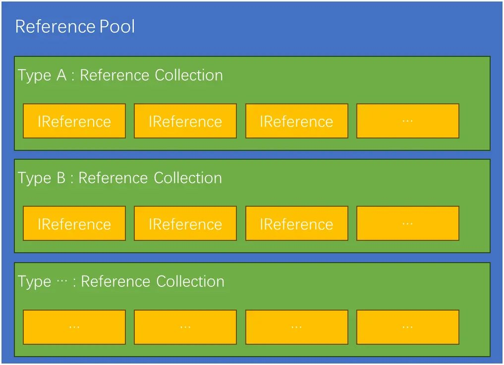
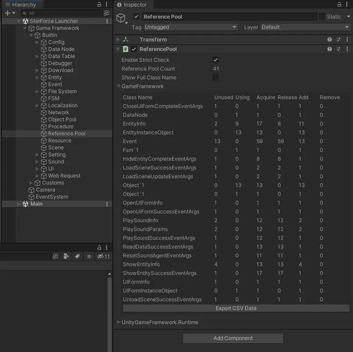
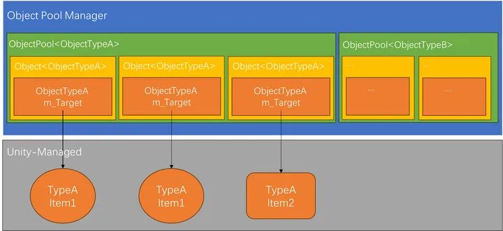

# 游戏框架
## GameFrameWork
https://github.com/EllanJiang/GameFramework

官网：https://gameframework.cn/
https://gameframework.cn/tutorial/list/


## XFGameFramework
https://gitee.com/xianfengkeji/XFGameFramework


## QFrameWork
### 凉鞋：我所理解的框架 【Unity 游戏框架搭建】
https://www.cnblogs.com/liangxiegame/p/12557515.html

https://qframework.cn/qf

https://github.com/liangxiegame/QFramework

https://developer.unity.cn/u/liangxiegame

## Joker-YF / JKFrame
https://github.com/Joker-YF/JKFrame

### JKFrame 独立游戏程序框架使用手册
http://www.yfjoker.com/JKFrame/

## 【唐老狮】Unity中的MVC思想（框架）
https://www.taikr.com/my/course/1164

## 【唐老狮】Unity程序基础框架（重置版）
https://www.taikr.com/my/course/1504


# 凉鞋：我所理解的框架 【Unity 游戏框架搭建】
https://www.cnblogs.com/liangxiegame/p/12557515.html

## 前言
架构和框架这些概念听起来很遥远，让很多初学者不明觉厉。会产生“等自己技术牛逼了再去做架构或者搭建框架”这样的想法。在这里笔者可以很肯定地告诉大家，初学者是完全可以去做这些事情的。

## 初识架构和框架
架构和框架是非常接地气的，离我们其实并不遥远。

### 什么是架构?
>架构是一个约定，一个规则，一个大家都懂得遵守的共识。那这是什么样的约定、什么样的规则、什么样的共识呢？

>我以包为例，我经常出差，双肩背包里装了不少东西。笔记本电脑、电源、2 个上网卡、鼠标、USB 线、一盒大的名片、一盒小的名片、口香糖、Mini-DisplayPort 转 VGA 接口、U 盘、几根笔、小螺丝刀、洗漱用品、干净衣服、袜子、香水、老婆给我带的抹脸膏（她嫌我最近累，脸有点黄）、钱包、Token 卡、耳机、纸巾、USB 线、U 盘等。这个包有很多格子，最外面的格子我放常用的，比如笔、纸、一盒小的名片等；中间的格子一般放的是衣服、袜子、洗漱用品、香水等；靠背的那个大格子放了笔记本电脑，和笔记本电脑相近的小格子放的是两个上网卡、Mini-DisplayPort 转 VGA 接口、大盒名片、记事本，和笔记本电脑相近的大格子放的是电源、鼠标、口香糖等。

>我闭着眼睛都可以将我的东西从包里掏出来，闭着眼睛都可以将东西塞到包里！但是，非常不幸的是，一旦我老婆整理过我的包，那我就很惨了，老是因为找不到东西而变得抓狂！更不幸的，要是我那个不到两岁的“小可爱”翻过，就更不得了了。

>这个包就是我放所有物品的“架构”，每一个东西放置的位置就是我的“约定、规则、共识”。倘若我老婆也知道我的“架构”、我的“约定、规则、共识”，那么不管她怎么动我的包，我都照样能够轻易的拿东西或者放东西。进一步，如果我的同事也知道我的“架构”，知道我的“约定、规则、共识”，那么他们什么时候动我的包，我也毫无所知！——道法自然 《10 年感触：架构是什么？——消灭架构！》

### 什么是框架?
>框架（framework）是一个框子--指其约束性，也是一个架子--指其支撑性。——360 百科

### 小结
本小节对框架和架构概念做了简单的认识，得出了以下两个结论：
* 架构是“约定、规则、共识”
* 框架具有约束性和支撑性

到这里，大家应该对这两个概念有点感觉了。但是还是会有很多疑问，比如“如何去做架构？”、“框架的约束性和支撑性分别指的什么？”等等，没关系，笔者坚信“带着问题去阅读”往往是最有效的阅读方式。接下来笔者将分享这两年来对框架和架构探索的经历，以及对这两个概念认识的演变，希望给大家带来一些启发，顺便大家心中的一些问题得到解答。

## QFramework
两年前，笔者毕业半年，刚从 cocos2d 转 Unity 不到两个月，当时所在的公司有一套游戏开发框架。笔者用它做了两个月的项目，使用框架做项目的时候并没有去思考框架是什么，只是开始的时候觉得很新鲜，而且越用越顺手，尝到了它的甜头。

后来笔者接到了一个跑酷游戏项目，于是就把工作辞掉了，决定出来全职做这个项目。辞职后，公司的框架由于保密协议就不可以用了。项目就只能从零开始开发，那么结果就是在跑酷项目的开发的过程中各种中水土不服。

于是，笔者就开始了市面上开源框架的选型，折腾了几天，发现要么上手太难，要么学习成本很高文档不齐全，有的框架光是理解概念就要很久，对于像笔者一样刚毕业的初学者来说，市面上的开源框架真的很不友好。

从那时候笔者就决定要 为自己，开发一套符合自己使用习惯的框架，也就是现在的 QFramework。

### 为什么叫 QFramework ?
笔者在做 cocos2dx 的时候，市面上有个叫 Quick-Cocos2d-x 的开源框架，用两个词形容就是简单、强大。

笔者认为好的工具就应该简单。

QFramework 的目标是要做到像 Quick-Cocos2d-x 一样 “简单、强大”。当时笔者纠结过很多名字，比如 QuickEngine，QuickUnity 等等。Q 代表 Quick，并且 Q 这个字母给人感觉灵活有弹性，所以最终确定为 QFramework。

在决定要做框架之后，笔者就开始了边搭建框架边进行着跑酷项目开发的工作生活。

## 启蒙资料 《Unity 架构设计与开发管理》
很幸运地是，在跑酷项目开发之初，笔者接触到了一个非常好的关于 Unity 项目架构的学习资料，就是刘钢老师在 Unite 大会上的讲座视频《Unity 架构设计与开发管理》，视频中所提出的 Manager Of Managers 很好地为笔者开发 QFramework 指明了方向。虽然刘老师讲得通俗易懂，但是里边有很多话都很值得回味，笔者之后也花了很长时间去消化里边的内容，直到今天，笔者再看一遍视频还是会有很多收获的。在读此文时我们先不着急看里边的内容，视频链接会在文章的最末尾贴出。

### 跑酷项目准备
一个项目开始立项的时候，最常见的一个情况就是：几个人一个小团队，开始什么也不做，开始写代码，验证逻辑，然后 game 就开始写起来了。公司的一些的所谓的领导层一开始就把游戏定义为“我们要做的一个大作”，那么这个事情本身就是一个笑话。没有任何的规划和设计，我们就妄图就写出一个所谓的杰出的作品出来是不现实的。Unity 再好用，以这个心态去做游戏，一定会写不出来好的游戏来。——刘钢《Unity 项目架构和开发管理》

看到视频中的这段话，吓得笔者赶紧为跑酷项目做了些准备。比如最常见的表现和逻辑的分离。

#### 表现逻辑分离
我们大家都知道，做项目尽可能地要把表现和逻辑分离。同样的跑酷项目也是如此，而最常用最经典的方式就是使用 MVC。

#### 经典的 MVC 架构模式
MVC 是在软件开发时最常用的架构模式，我想大家都应该接触过，所以 MVC 的概念在这里笔者不会浪费口舌去赘述，不了解的同学可以参阅[阮一峰前辈的《谈谈MVC模式》](https://www.ruanyifeng.com/blog/2007/11/mvc.html)。

#### 跑酷项目中的 MVC
跑酷项目代码的架构使用的是很简单的 MVC。笔者当时是按照如下的方式去进行划分的：
* View 层是各个 UI 的 Transform 本身。
* Ctrl 层则是挂在各个 View GameObject 上的 MonoBehaviour。
* Model 层则是若干个提供数据增删改查的并且可以全局访问的单例。

跑酷的 MVC 架构图如下所示：

从今天的来看，这种 MVC 设计是一种很粗糙的设计，尤其是其 Model 层，颗粒度太大，其实再可以分出个 DataAccess 层。不过粗糙的好处就是初学者能够驾驭，是有存在的意义的。

到这里，架构这个词终于出现了。MVC 是一种架构模式，对程序进行 MVC 的划分是在进行架构活动。除了 MVC 架构模式，还有几种其他的架构模式。

而对程序进行 MVC 的划分，实际上是对代码进行结构的设计，所以对程序进行结构的设计是在进行架构活动。

到这里，我们知道了架构是我们每天都在做的事情（划分 MVC 或者说将代码的表现与逻辑层分离）。而对代码进行结构的设是否和架构的“约定、规则、共识”有关系呢？答案是肯定的。我们接着往下进行探索。

#### 文件结构
>很多时候我们说的一个所谓的好的架构，直接就等于你要有一个好的标准，指定一些好的规则。——刘钢《Unity 架构设计与开发管理》

#### Unity 好的规则 3：
>我们在起一些文件夹的名字的时候，尽量和我们的 GameObject 对应起来，如果我们的 GameObject 叫做 PoolManager，我下面所有的代码也都起一个同样的名字叫 PoolManager，那么这样在以后找对应的程序结构的时候，会比较好理解一些。——刘钢《Unity 架构设计与开发管理》

而跑酷项目最初的部分代码文件结构如下：

* Scripts
	* App
		* Objects
			* Stages // 关卡单元
				* XXStage.cs
					...
			* Enemy // 敌人
				* EnemyCtrl.cs
				* EnemyModel.cs
			* Player // 角色
				* PlayerCtrl.cs
				* PlayerModel.cs
			* ...
		* Managers
		* EnemyManager.cs * StageManager.cs
		* ...

对于 MVC 的文件结构的划分，笔者在进行跑酷项目之前的其他项目的时候也尝试了别的方案。当时觉得这种方式找起来最方便。

在项目结束之后不久看到了一篇吴秦前辈的一篇好文《Unity3D手游开发实践》：

>一般客户端用得比较多的 MVC 框架，怎么划分目录？
先按业务功能划分，再按照 MVC 来划分。
“蛋糕心语”就是使用的这种方式。

>先按MVC划分，再按照业务功能划分。
“D9”、“宝宝斗场”、“魔法花园”、“腾讯桌球”、“欢乐麻将”使用的这种方式。

根据使用习惯，可以自行选择。个人推荐“先按业务功能划分，再按照 MVC 来划分”，使得模块更聚焦（高内聚），第二种方式用多了发现随着项目的运营模块增多，没有第一种那么好维护。——吴秦《Unity3D手游开发实践》

而笔者所采用的方式就是“先按照业务功能划分，再按照 MVC 来划分”。在这里仅仅是个建议，并不是一定要使用的方式。

#### QFramework 的第一个工具“单例模板”
在跑酷项目的 MVC 中，笔者把 Model 层设计成了单例。为什么使用单例呢？

抛开粗糙的设计不说，先让我们简单分析下跑酷项目的 Model 层的特点：
* Model 层的数据在整个软件的生命周期里只有一份。
* Model 层的数据要对任何 Ctrl 都提供增删改查。

很自然地就想到了使用单例模式实现。而很多开源库里都会提供可复用的单例模板，一般叫 Singleton 和 MonoSingleton。所以单例的模板作为第一个工具被收录到框架中。

#### “代码是资产”思维
在写一个项目的时候，不要短视的说我就把这个项目做完了，就是交一个差上线了就完了，我们希望每写一个游戏的时候，我们都积累一些东西，把写的每一行代码，都当成是一个可以收藏的，甚至是可以传递下去的这样的一个资产。有了这样一个思想，可能我们在写代码的时候，整个的思维模式会完全不一样。——刘钢《Unity 项目架构和开发管理》

听到上面这段话，在当时的笔者心中埋下了一颗种子。在这个基础上进行思考，会产生很多很有价值的想法。本小节先讲到这里。

#### 小结
文章读到这里我们简单进行总结一下。
* 架构是“约定、规则、共识”
* 框架具有约束性和支撑性
* 好的架构直接就等于一套好的规则，好的准则
* Unity 好的规则
	* 3.起文件夹的名字时尽量和 GameObject 对应起来
	* MVC 文件结构：先按照业务功能划分，再按照 MVC 来划分
* “代码是资产”思维
* QFramework
	* 工具集
		* FSM
		* Singleton&MonoSingleton
		* MsgDispatcher
		* MathUtils

结合跑酷项目准备阶段，以上的结论应用的结果如下图所示：

图中的需求收集/业务分析是本小节没有讲的，由于这个跑酷项目是合作项目，有一些需求合作方本身也没太想清楚，在进行准备这个阶段之前，跑酷项目已经完成了一版 Demo 进行了需求上的确认。

由于受到“代码是资产”思维的影响，QFramework 的开发模式最初是以收集工具为目的的，此时的 QFramework 并不是真正意义上的框架，而是一个库或一个工具集。

### 跑酷项目开发
在准备完毕之后，跑酷项目就开始了大量的业务/逻辑开发。

#### 语言学习
在做跑酷项目时，笔者当时的水平怎么样呢？三个字，非常菜。有很多很基本的功能要学习 Unity API 才能完成，比如跑酷的关卡生成器等等。对 C# 语言的掌握也是靠着以前一点 Java 经验，才能勉强能应付逻辑开发，之前所说的单例的模板，也只是知道怎么去用，并不知道实现的原理。这时候笔者觉得必须要对 C# 进行基础学习。于是就开始每天看一点传智的 C# 基础视频。学习的过程中，一些语言特性不知道怎么用，而有的语言特性觉得很有用。所以此时只是为了完成项目而进行学习，自然而然地就没有太多的精力去深究语法细节。我们大家都知道，这不是一个很好的学习方式。

#### QFramework 是知识积累工具
随着对 C# 语言的了解程度加深，慢慢地可以看懂一些工具的源码了，也可以自己实现一些很简单的封装。而笔者在跑酷项目的开发期间先后收录了有限状态机、消息分发器和一些数学工具。以上收集的工具与单例的模板一样，都是同一性质的工具，所以这里没什么好说的。值得一提的是笔者当时做了一件事，笔者按照之前 cocos2dx 的使用习惯把一些 Unity 的 API 简单封装了一下，最初这么做只是为了提高自己的开发效率，扩大自己在 Unity 里的舒适区（笔者之二前一种用 cocos2d）。做了这件事之后给了笔者很大启发，笔者为什么不把一些新学习的 Unity 的 API 或者 C# 特性简单封装一下然后收录到 QFramework 中呢？这样以后使用这些 API 的时候就不用再查询搜索引擎了，直接使用封装的工具就好了。这样还能让 QFramework 帮助笔者“记住” Unity 的 API 和 C# 的特性。从那以后 QFramework 不止是一个工具集，也是笔者的一个知识积累工具。这样耗能解决上文中笔者对“学习的知识没有用武之地”的困扰。这样既能激发笔者的学习动力，又对 QFramework 本身也有好处，一石二鸟。

#### 业务支撑工具
我们都知道，做一个游戏项目，都会用到 UI、音效、配置表和数据存储等模块。跑酷项目也是一样的，在刘钢老师的《Unity 架构设计与开发管理》视频里提出了一个叫做 Manager Of Managers 的架构方案，可以把以上模块全部做成一个单例，比如 UIManager，AudioManager 等。而笔者认为，这些工具模块都是为了支撑游戏业务的，比如游戏音频管理方案，界面层级管理方案等等。也就是说大多数项目都用得到。而不像单例的模板、有限状态这些工具，它们不是为了支撑业务而积累的。为什么这么说呢？单例的模板是设计工具，解决的问题不是业务问题是设计问题，而有限状态机则是一种数据结构，是简化一部分问题的思维模型。而 UIManager、AudioManager 等等。每个模块都是独立的解决方案，是为了解决某一业务问题而设计的。所以笔者在这里称它们为业务支撑工具。

而刘钢老师的在视频中列出了以下模块：
* MainManager
* EventManager
* AudioManager
* GUIManager
* PoolManager
* LevelManager
* GameManager
* SaveManager
* MenuManager

这里除了 GameManager 以外，其他的全部可以在别的项目中复用。

这时跑酷项目中已经实现了
* SoundManager(AudioManager)
* ConfigManager(LevelManager)

#### 项目结束
很快，跑酷项目接近尾声。拿到结款后分析了一下当时工作生活状态的利弊。决定还是找一家公司继续沉淀。一是为了让 QFramework 多接触一些不一样的项目，二是笔者非常渴望与同行能交流的，三是开发跑酷项目的这两个半月对未知的恐惧太强烈了，比如对未掌握的技术，没把握实现的功能等等，四是合作方的第二个项目需要组个完整团队去做，当时身边没有太合适的人。总之跑酷这个项目到此完美结束了。

#### 小结
在文章的最开始，笔者提出了框架具有约束性和支撑性。 QFramework 目前已经具备了其中的支撑性，也就是支撑业务。而业务是其中一种框架所能支撑的领域，除此之外还有其他的领域，比如团队协作，工作流等等，这里先不多说。而约束性到目前还没有提过。没关系，我们接着往下进行。

文章读到这里我们再进行总结一下。
* 架构是“约定、规则、共识”
* 框架具有约束性和支撑性
* 好的架构直接就等于你要有一套好的规则，好的准则
* Unity 好的规则
	* 3.起文件夹的名字时尽量和 GameObject 对应起来
	* MVC 文件结构：先按照业务功能划分，再按照 MVC 来划分
* 代码是资产
	* 做完每一个项目都积累一些东西
* QFramework
	* 工具集
		* FSM
		* Singleton&MonoSingleton
		* MsgDispatcher
		* MathUtils
	* 笔者知识积累工具
	* 业务支撑工具集（支撑性)
		* SoundManager
		* ConfigManager

### 新的公司
2016 年 3 月下旬，跑酷项目做完之后来到了一家新的公司，来的时候公司已经具有一定的规模，其游戏技术团队也积累了一些 Unity 的插件和工具。而笔者所加入的团队是技术支持团队。技术支持的工作就是平时负责攻克技术难点，做一些预研，再做一些工具来给项目团队使用，有的时候项目人手不够了还要顶上去。而在这家公司的两年则是笔者成长最快的两年，一是遇到了好 Leader，二是做的事情非常喜欢。

#### UIManager
到了新公司，工作的同时，业余时间 QFramework 的开发还是要进行的。而公司的项目是没有一个很统一的框架，每个项目组都是各干各的。但是我们部门的好处就是都可以看到项目组的代码。每个项目的 UIManager 都是基于 Dictionary 来提供查询，然后简单地用 GameObject 的前后关系来管理 UI 的层级。笔者当时也看了一些市面上开源的 UI 框架，实现原理都差不多。所以索性就自己开发了一套很平庸的实现，没有什么太大的亮点。不过好在，算是完成了对 ManagerOfManagers 中 GUIManager 的收集。

#### AssetBundleManager
AssetBundleManager 是看一个公司项目时候看到的，本身是一个开源免费的 Asset Store 插件。笔者之前对于资源管理没有太大的概念。像之前做的跑酷项目，都是直接都把 GameObject 拖到场景里完成的。很少用到动态加载卸载内存。但是看了 AssetBundleManager 之后，很看好它的 Simulation Mode。所以就收录到 QFramework 里了。使用 AssetBundle 的好处有很多，支持热更啊，控制包体大小啊等等。缺点就是坑多，而且有一些学习成本，但是还是非常值得去研究的。

#### 加班
在收集了 UIManager 和 AssetBundleManager 之后开始了时长较长的加班。加班的原因就不说了，从这时候开始 QFramework 就搁置了一段时间。

#### 小结
本小节的 UIManager 和 AssetBundleManager 都是一种很普通的实现，没有太大的亮点。

文章读到这里我们再进行总结一下。
* 架构是“约定、规则、共识”
* 框架具有约束性和支撑性
* 好的架构直接就等于你要有一套好的规则，好的准则
* Unity 好的规则
	* 3.起文件夹的名字时尽量和 GameObject 对应起来
	* MVC 文件结构：先按照业务功能划分，再按照 MVC 来划分
* 代码是资产
	* 做完每一个项目都积累一些东西
* QFramework
	* 工具集
		* FSM
		* Singleton&MonoSingleton
		* MsgDispatcher
		* MathUtils
	* 笔者知识积累工具
	* 业务支撑工具集（支撑性)
		* UIManager
		* AssetBundleManager
		* SoundManager
		* ConfigManager

### 命名的力量
>Unity 好的规则 2：我们在命名的时候要起一个比较有含义的名字。——刘钢《Unity 架构设计与开发管理》

在笔者刚毕业的时候，读了《代码大全》这一本书，其中第 11 章的《变量名的力量》反复读了三遍。这一章的内容对笔者之后养成良好的命名习惯产生很大的影响。书中重点讲了如何命名和编码规范的重要性。

#### 编码规范
笔者很认同做项目要遵循命名规范这个准则的。但是现实是规范的执行过程中会遇到很多阻碍。比如笔者最开始去网上找了一个编码规范文档。一份文档 50 多页，看都觉得很痛苦，只好放弃。最终经过一段时间探索之后得出了一个结论：编码规范只要解决问题就好，其他的尽量确保容易遵守就好。

#### 编码规范解决的是什么问题呢？
1. 减少项目交接时，由于代码风格水土不服所带来的风险。
2. 当某个项目人力不足时，可以减少加人时所带来的人力浪费(可以让一个人花更少的时间去看懂某个项目的代码）。
3. 防止项目过了一段时间一些实现自己都看不懂了。

以上当然要靠一个编码规范是无法完全解决的，除了编码规范之外，还有资源命名规范，项目结构规范等等。
经过多次因为以上原因的加班之后，深有感触。编码规范是非常有必要做的。

#### 为自己制定一个编码规范
在公司，笔者还是最基础的员工，没有什么权利。所以对于定义规范这种事情，在公司想想就好了。不过这并不阻碍笔者为自己制定一个编码规范。于是笔者根据自己的编码习惯，定制了如下的编码规范。
``` c#
/****************************************************************************
 * Copyright (c) 2017 liangxieq
 * 
 * https://github.com/liangxiegame/QCSharpStyleGuide
 * 
 * Permission is hereby granted, free of charge, to any person obtaining a copy
 * of this software and associated documentation files (the "Software"), to deal
 * in the Software without restriction, including without limitation the rights
 * to use, copy, modify, merge, publish, distribute, sublicense, and/or sell
 * copies of the Software, and to permit persons to whom the Software is
 * furnished to do so, subject to the following conditions:
 * 
 * The above copyright notice and this permission notice shall be included in
 * all copies or substantial portions of the Software.
 * 
 * THE SOFTWARE IS PROVIDED "AS IS", WITHOUT WARRANTY OF ANY KIND, EXPRESS OR
 * IMPLIED, INCLUDING BUT NOT LIMITED TO THE WARRANTIES OF MERCHANTABILITY,
 * FITNESS FOR A PARTICULAR PURPOSE AND NONINFRINGEMENT. IN NO EVENT SHALL THE
 * AUTHORS OR COPYRIGHT HOLDERS BE LIABLE FOR ANY CLAIM, DAMAGES OR OTHER
 * LIABILITY, WHETHER IN AN ACTION OF CONTRACT, TORT OR OTHERWISE, ARISING FROM,
 * OUT OF OR IN CONNECTION WITH THE SOFTWARE OR THE USE OR OTHER DEALINGS IN
 * THE SOFTWARE.
 ****************************************************************************/
 

namespace QFramework.Example 
{	
	using UnityEngine;
	using UnityEngine.UI;
	using System.Collections;
	using System.Collections.Generic;
	
	/// <summary>
	/// 展示编码风格
	/// </summary>
	public class ProgrammingStyle : MonoBehaviour 
	{
		#region Basic App
		/// <summary>
		/// 1.private/protected使用m开头+驼峰式
		/// 2.前缀最好展示所属的Component类型比如Button->Btn
		/// </summary>
		[SerializeField] Button mBtnEnterMainPage;

		/// <summary>
		/// public类型使用首字母大写驼峰式
		/// </summary>
		public int LastIndex = 0;

		/// <summary>
		/// public 类型属性也算public类型变量
		/// </summary>
		public int CurSelectIndex 
		{
			get { return mCurSelectIndex; }
		}

		void Start () 
		{
			mBtnEnterMainPage = transform.Find ("BtnEnterMainPage").GetComponent<Button>();

			// GameObject命名
			// 临时变量命名采用首字母小写驼峰式
			GameObject firstPosGo = transform.Find ("FirstPosGo").gameObject;
		}

		/// <summary>
		/// 方法名一律首字母大写驼峰式
		/// </summary>
		public void Hide() 
		{
			gameObject.SetActive (false);
		}
		#endregion

		#region Advanced
		/*
		 * GameObject->Go
		 * Transform->Trans
		 * Button->Btn
		 * 
		 * For->4
		 * To->2
		 * Dictionary->Dict
		 * Number->Num
		 * Current->Cur
		 */

		/// <summary>
		/// 1.Bg肯定是图片
		/// </summary>
		[SerializeField] Image mBg;

		/// <summary>
		/// GameObject->Go
		/// </summary>
		[SerializeField] GameObject mDialogGo;

		/// <summary>
		/// Transfom->Trans
		/// </summary>
		[SerializeField] Transform mScrollViewTrans;

		/// <summary>
		/// Index、Num、Count等肯定是int
		/// </summary>
		[SerializeField] int mCurSelectIndex;

		/// <summary>
		/// RectTransform->RectTrans;
		/// </summary>
		[SerializeField] RectTransform mScrollContentRectTrans;

		/// <summary>
		/// 1.Pos肯定是Vector3、Vector2
		/// 2.Size肯定是Vector2
		/// </summary>
		[SerializeField] Vector3 mCachedPos;
		[SerializeField] Vector2 mCachedSize;

		/// <summary>
		/// 后缀s表示是个数组
		/// </summary>
		[SerializeField] Vector3[] mCachedPositions;

		/// <summary>
		/// 1.List后缀
		/// 2.4->for 表示所属关系可以表示Dict
		/// 3.Dict后置
		/// </summary>
		[SerializeField] List<Vector3> mCachedPosList;
		[SerializeField] Dictionary<string,Vector3> mPos4ChildName;
		[SerializeField] Dictionary<string,Vector3> mChildPosDict;
		#endregion
	}
}

```

规范直接使用代码展示，容易看懂自然而然也就会容易遵循。

#### 破窗效应
>一幢有少许破窗的建筑为例，如果那些窗不被修理好，可能将会有破坏者破坏更多的窗户。最终他们甚至会闯入建筑内，如果发现无人居住，也许就在那里定居或者纵火。一面墙，如果出现一些涂鸦没有被清洗掉，很快的，墙上就布满了乱七八糟、不堪入目的东西；一条人行道有些许纸屑，不久后就会有更多垃圾，最终人们会视若理所当然地将垃圾顺手丢弃在地上。这个现象，就是犯罪心理学中的破窗效应。

我们做项目也是一样的。一定要好好写代码，不要让“破窗”在我们的项目中发生，不能让项目有任何变混乱的趋势，保持项目清爽，这可以给我们开发者到来很好的工作体验，也就是所谓的心流体验。

#### 如何命名？
在一些命名格式上，可以遵循编码规范就好了。但是如何给一个类/方法/变量/枚举命名呢？

在问这个问题前，我们来问另外一个问题，那就是程序语言，所谓的语言是给谁看的？一是给计算机或者编译器能看懂。二是给我们人类看的。让计算器或者编译器看懂很容易，只要遵循程序的语法去写就 OK 了。但是如何让人更容易看懂，当然答案也很简单，就是好好命名。关于如何命名，一些笔者至今受用的命名准则这里这里简单介绍下。

* 使用业务相关的词汇命名而不是计算机相关的词汇
比如，SaveMgr 中的 Save 是保存，是业务相关的词汇。而 SerializeHelper 中的 Serialize 则是计算机相关的词汇。这条准则在 业务/逻辑/UI 层会有很大的效果。而在 Framework 层或者说底层还是使用计算机相关的词汇比较好。

* 方法/函数命名用谓语 + 宾语方式命名
比如 PlayerData.Save，或者 SavePlayerData

* 类名和方法参数使用名词

* 表示一个动作状态时通过动词的不同时态进行命名。
比如 Connecting，Connected，Connect 表示连接的三种状态。

关于命名和规范就先讲到这里，命名是一门学问，其内容多得可以去写一本书去介绍了。如果想深入学习，建议首先看《代码大全》的第 11 章 《命名的力量》。

#### 小结
还记得在前边说的架构的定义嘛？架构是“约定、规则、共识”，而确定各种规范也是准备阶段要做的事情，也是架构的一部分。

### 再次起航
在新的公司度过了一段加班生活，之后加班次数慢慢就减少了。这时候就又有时间去搞点东西了。

#### 一个视频教程的学习
首先是当时，在某教育网站上学习了《万能游戏框架》视频教程，笔者从头到尾跟着手敲了一遍。教程里的一个基于模块的消息框架实现得很有意思。这里简单说一下。 QFramework 之前收录的 MsgDispatcher 就是一个全局的字典，字典的 key 是事件名字，而 value 则是 委托 List，所以不管怎么定义消息，它们都是全局的。当消息的规模变大之后，会有很大的性能压力。如图所示：

全局消息与单例模式一样都是用起来很方便，但是风险很大的设计。

而 《万能游戏框架》里的消息则是以模块为单位的。比如 UI 模块则只负责 UI 界面相关的消息收发和注册，Audio 模块同理也是。 而跨模块之间则用一个简单的 switch 进行转发。比较出彩的是其中的关于频段的设计。我们都知道 C# 里的 ushort 的最大值是 65536，视频中每个模块的频段长度设为 3000，这样最多可以有 21 个 模块，足够使用了。每个模块可以注册 3000 个消息。如何实现,这里看下代码就明白了。

``` c#
public enum MgrId
{
	UI = 0 * 3000,
	Audio = 1 * 3000,
	...
}

public enum UIXXEvent
{
	Start = (ushort)MgrId.UI,
	XX,
	YY,
	End,
}

public enum UIYYEvent
{
	Start = (ushort)UIXXEvent.End,
	ZZ,
	End,
}

```

笔者当时看到这里才觉得自己对语言的了解真的是很浅，一个简单的 ushort + 枚举就可以很巧妙地设计出基于模块的消息框架，这种思想非常值得借鉴。笔者马上在 QFramework 中实现了一套类似的消息框架。很简单，一个 QMsgCenter 充当跨模块之间的消息转发。一个 QMgrBehaviour 作为模块的基类，负责收发和注册模块内的消息，一个 QMonoBehaviour 只要一个脚本继承它，就可以发送消息和注册处理消息。而事实上，有了这套消息框架，QFramework 才算是一个真正的 Manager Of Managers 框架。

#### 初涉工作流
公司的以为前辈也有一套类似的框架，不过在以上这套消息框架的基础之上，做了 UI 的脚本生成。在此之前笔者都是用 transform.Find 方式来获取感兴趣的 UI 控件的。比如 Button、Image 等等。而前辈的 UI 脚本生成省去了这些工作量。实现方式也是比较容易理解。就是在一个 UI 的 Prefab 上，对于感兴趣的控件挂上一个脚本，比如 UIMark/UIBind。然后从 UI 的 Prefab 的 Root 开始进行深度优先搜索。搜索过程中记录每个标记脚本的路径，之后根据路径生成一行行的 transform.Find（路径）就好了。而这个工具则是节省了制作 UI Prefab 过程中的体力劳动。是对工作流上的优化。QFramework 又收录了一个工具。

#### 支撑团队协作
团队协作的一个基础就是将业务模块化。而业务很多时候是在完成大量的 UI 界面。在这里简单分享下笔者的做法。笔者首先会为每个 UI 界面都建立一个测试场景，只要运行 Unity 就可以看到 UI 界面的效果。这样做的目的很简单，就是方便快速修改，并且界面之间互相独立，只要约定好谁来负责哪个模块，就不会造成版本控制冲突。 还有一个建议要做的就是，为每个 UI 界面都提供一个 Init 接口。一些 UI 界面要用的数据，笔者建议是从一开始通过初始化传进去，而不是在 UI 里面去访问某个 Manager。这一点要做到需要花些功夫，不过好处就是 UI 作为一个黑盒，没有上下文，可以传入一些测试数据而不是真实数据就可以看效果并做一些测试了，当项目规模变大时，改一个 UI 界面或者查找一个 bug 都会变得很容易。这样的做法解决了多个问题，一石 N 鸟。

#### C# 进阶
C# 真的是越用越觉得它的强大。QFramework 的进步是离不开 C# 语言的学习的。这里笔者遇到了一个决定 QFramework 未来的语法特性，就是静态 this 扩展。语法细节这里不多说，大家自行百度。学习了这个语法之后，一些本来要靠继承才能实现的 cocos2dx 风格的 API 全部可以用这个语法实现。简直不要太好用！都后来的链式结构编程全都是以这个为基础的。

#### QFramework 成为公司的指定框架
在笔者的坚持下，经过了团队的 Code Review 之后，大家终于统一了使用 QFramework 作为公司的框架。从这时候开始 QFramework 开始飞速发展。

#### 第一个项目
第一个项目三个人完成的，架构阶段以笔者之前定的代码规范为基础与团队成员共同完成了项目的代码规范，随后完成了项目结构目录约定等等一系列约定，之后与项目的负责人根据项目需求确定了插件的选择，而框架自然就用 QFramework 了。除了以上这些还做了一件事，就是画了一张不知道是什么的图。

上边又有排期，又有分工，又有一些技术实现细节，还有各个模块的划分。总之看着很乱，但是它的作用就是让我们三个人很清晰地对项目的各个结构，以及近期的排期等信息，项目的难点也一目了然。做好排期和分析后，就开始进行开发了，最终这个项目不管是时间还是品质上，都完成得很不错。这就是充分(相比之前)做架构的好处。

#### 竞争对手出现
在做第一个项目的时候，来了一位大牛，带着一套 MMO 框架。框架好用的工具真的很多。

其中的 EventSystem（消息系统）和 ResSystem（资源系统）是两大亮点。EventSystem 的 EventId 是用泛型进行注册的。把一个泛型转换为 int 。这个解决了之前笔者注册事件时需要把枚举强转成 ushort 的问题，这样的代码写起来很不愉快，于是笔者把原来 MgrBehaviour 和 QMonoBehaviour 里关于消息注册和转发的代码杀掉，直接换成了 EventSystem 就 OK 了，QMonoBehaviour 和 MgrBehaviour 里的代码变得非常精简。而 ResSystem 使用非常简单和强大。ResSystem 是在 AssetBundleManager 的功能基础之上有抽象出来了 ResLoader。这样做有什么好处呢？

首先 AssetBundleManager 在哪里加载了什么资源和卸载了资源需要使用人脑进行记忆，项目体量很大时很容易由于忘记卸载资源而造成内存泄露。而 ResLoader 是一个对象，可以每个界面都申请一个 ResLoader 对象。所有在这个界面加载过的资源的信息都会记录到 ResLoader 里，而卸载很简单，只要在 OnDestroy 里直接进行 ResLoader 的卸载就好了，非常方便。但是这时候笔者已经用惯了 AssetBundleManager 的打包方式，所以只收录了 ResSystem 中除打包以外的代码。这里简单提一下，ResLoader 是用对象池实现对象的申请和回收的。而 ResSystem 里的资源积累则是使用引用计数器决定资源的释放的。在这里 QFramework 收录了 EventSystem、ResSystem、引用计数器、对象池，可以说收获颇丰。

#### 提拔带人
做完第一个项目之后，被 Leader 提拔，开始带人带团队。在框架和架构进行探索的时间少了很多。QFramework 在这之后边也加了一些库，比如 UniRx，ActionKit 等等。最终就是现在的 ActionKit、UI Kit、Res Kit 为核心的 QFramework 了。ActionKit 专注异步逻辑和状态机，可以很好地完成 GamePlay 需求和异步需求。而 UI Kit 是 UI 的解决方案，里边还是包含着之前的基于模块的消息框架。 Res Kit 则是解决资源管理方案。这里不多说 Action Kit。在这里笔者的经历分享完了。

#### 总结
* 架构是“约定、规则、共识”
* 框架具有约束性和支撑性
* 好的架构直接就等于你要有一套好的规则，好的准则
* Unity 好的规则
	* 1. 使用 C# 而不用 JavaScript
	* 2. 命名的时候要起一个比较有含义的名字
	* 3. 起文件夹的名字时尽量和 GameObject 对应起来
* MVC 文件结构：先按照业务功能划分，再按照 MVC 来划分
* 代码是资产
* 做完每一个项目都积累一些东西
* QFramework
	* 工具集
		* FSM
		* Singleton&MonoSingleton
		* QEventSystem
		* MathUtils
	* 笔者知识积累工具
	* 业务支撑工具集（支撑性)
		* UI Kit
		* UIManager
		* 代码生成
		* MgrBehaviour、MonoBehaivour(约束性)
		* Res Kit
		* AudioManager
		* Action Kit
* 建议
	* 1. 为每个 UI 界面都建立一个测试场景。
	* 2. 为每个 UI 界面都提供一个 Init 接口。
	* 3. UI 界面的 Init 接口传数据，而不是在 UI 里面去访问某个 Manager Or Instance。
* 在项目准备的架构活动
	* 1. 需求/业务整理、收集、分析
	* 2. 编码规范、项目结构约定、资源命名规范、程序结构约定、模块/MVC 划分、成员分工
	* 3. 插件购买、造轮子、框架选型

这里可以得出框架与架构关系的结论，框架可以解决一部分架构问题，使用框架 本身就是一种“约定、规则、共识”。

直到文章的结尾，QFramework 还是没有收集到关于框架的约束性相关的内容。唯一能扯上点关系的就是基于模块的消息框架这块了。其实像 StrangeIOC、uFrame、PureMVC 等框架可以更容易去讲解约束性相关的内容。Any way 这次就讲到这里吧，我们以后见。

## 推荐资料
[《UNITE －Unity项目架构设计与开发管理》](https://v.qq.com/x/page/d016340mkcu.html)
[《架构漫谈》](http://www.infoq.com/cn/articles/an-informal-discussion-on-architecture-part01)
[《Unity3D手游开发实践》](https://www.jianshu.com/p/10693fee70a5)
[《10年感触：架构是什么？——消灭架构！》](http://www.cnblogs.com/baihmpgy/p/3653373.html)
[《凉鞋的笔记》](http://liangxiegame.com/)

转载请注明地址：凉鞋的笔记：liangxiegame.com

## 更多内容
QFramework 地址：https://github.com/liangxiegame/QFramework
QQ 交流群：623597263
凉鞋的笔记：liangxiegame.com

# Unity3D手游开发实践
https://www.jianshu.com/p/10693fee70a5
https://www.cnblogs.com/skynet/p/5406495.html

>《腾讯桌球：客户端总结》

本次分享总结，起源于腾讯桌球项目，但是不仅仅限于项目本身。虽然基于Unity3D，很多东西同样适用于Cocos。本文从以下10大点进行阐述：架构设计、原生插件/平台交互、版本与补丁、用脚本，还是不用？这是一个问题、资源管理、性能优化、异常与Crash、适配与兼容、调试及开发工具、项目运营。


## 1.架构设计
好的架构利用大规模项目的多人团队开发和代码管理，也利用查找错误和后期维护。

* 框架的选择：需要根据团队、项目来进行选择，没有最好的框架，只有最合适的框架。
* 框架的使用：统一的框架能规范大家的行为，互相之间可以比较平滑切换，可维护性大大提升。除此之外，还能代码解耦。例如StrangeIOC是一个超轻量级和高度可扩展的控制反转(IoC)框架，专门为C#和Unity编写。已知公司内部使用StrangeIOC框架的游戏有：腾讯桌球、欢乐麻将、植物大战僵尸Online。https://github.com/strangeioc/strangeioc

>依赖注入（Dependency Injection，简称DI），是一个重要的面向对象编程的法则来削减计算机程序的耦合问题。依赖注入还有一个名字叫做控制反转（Inversion of Control，英文缩写为IoC）。
>依赖注入是这样一个过程：由于某客户类只依赖于服务类的一个接口，而不依赖于具体服务类，所以客户类只定义一个注入点。在程序运行过程中，客户类不直接实例化具体服务类实例，而是客户类的**运行上下文环境**或**专门组件**负责实例化服务类，然后将其注入到客户类中，保证客户类的正常运行。即对象在被创建的时候，由一个运行上下文环境或专门组件将其所依赖的服务类对象的引用传递给它。也可以说，依赖被注入到对象中。**所以，控制反转是，关于一个对象如何获取他所依赖的对象的引用，这个责任的反转。**


StrangeIOC采用MVCS（数据模型 Model，展示视图 View，逻辑控制 Controller，服务Service）结构，通过消息/信号进行交互和通信。整个MVCS框架跟flash的robotlegs基本一致，（忽略语言不一样）详细的参考http://www.cnblogs.com/skynet/archive/2012/03/21/2410042.html

* 数据模型 Model：主要负责数据的存储和基本数据处理
* 展示视图 View：主要负责UI界面展示和动画表现的处理
* 逻辑控制 Controller：主要负责业务逻辑处理，
* 服务Service：主要负责独立的网络收发请求等的一些功能。
* 消息/信号：通过消息/信号去解耦Model、View、Controller、Service这四种模块，他们之间通过消息/信号进行交互。
* 绑定器Binder：负责绑定消息处理、接口与实例对象、View与Mediator的对应关系。
MVCS Context：可以理解为MVC各个模块存在的上下文，负责MVC绑定和实例的创建工作。


### 1.1 代码目录的组织：一般客户端用得比较多的MVC框架，怎么划分目录？
代码目录的组织：一般客户端用得比较多的MVC框架，怎么划分目录？
先按业务功能划分，再按照 MVC 来划分。"蛋糕心语"就是使用的这种方式。
先按 MVC 划分，再按照业务功能划分。"D9"、"宝宝斗场"、"魔法花园"、"腾讯桌球"、"欢乐麻将"使用的这种方式。

根据使用习惯，可以自行选择。个人推荐"先按业务功能划分，再按照 MVC 来划分"，使得模块更聚焦（高内聚），第二种方式用多了发现随着项目的运营模块增多，没有第一种那么好维护。

Unity项目目录的组织：结合Unity规定的一些特殊的用途的文件夹，我们建议Unity项目文件夹组织方式如下。


其中，Plugins支持Plugins/{Platform}这样的命名规范：
* Plugins/x86
* Plugins/x86_64
* Plugins/Android
* Plugins/iOS

如果存在Plugins/{Platform}，则加载Plugins/{Platform}目录下的文件，否则加载Plugins目录下的，也就是说，如果存在{Platform}目录，Plugins根目录下的DLL是不会加载的。
另外，资源组织采用分文件夹存储"成品资源"及"原料资源"的方式处理：防止无关资源参与打包，RawResource即原始资源，Resource即成品资源。当然并不限于RawResource这种形式，其他Unity规定的特殊文件夹都可以这样，例如Raw Standard Assets。

### 1.2 公司组件
* msdk（sns、支付midas、推送灯塔、监控Bugly）
* apollo
* apollo voice
* xlua

目前我们的腾讯桌球、四国军棋都接入了apollo，但是如果服务器不采用apollo框架，不建议客户端接apollo，而是直接接msdk减少二次封装信息的丢失和带来的错误，方便以后升级维护，并且减少导入无用的代码。

### 1.3 第三方插件选型
* NGUI
* DoTween
* GIF
* GAF
* VectrosityScripts
* PoolManager
* Mad Level Manger

## 2.原生插件/平台交互
虽然大多时候使用Unity3D进行游戏开发时，只需要使用C#进行逻辑编写。但有时候不可避免的需要使用和编写原生插件，例如一些第三方插件只提供C/C++ 原生插件、复用已有的C/C++ 模块等。有一些功能是Unity3D实现不了，必须要调用Android/iOS原生接口，比如获取手机的硬件信息（UnityEngine.SystemInfo没有提供的部分）、调用系统的原生弹窗、手机震动等等

### 2.1 C/C++ 插件
编写和使用原生插件的几个关键点：
* 创建C/C++ 原生插件
	* 导出接口必须是C ABI-compatible函数
	* 函数调用约定
* 在C#中标识C/C++ 的函数并调用
	* 标识 DLL 中的函数。至少指定函数的名称和包含该函数的 DLL 的名称。
	* 创建用于容纳 DLL 函数的类。可以使用现有类，为每一非托管函数创建单独的类，或者创建包含一组相关的非托管函数的一个类。
	* 在托管代码中创建原型。使用 `DllImportAttribute` 标识 DLL 和函数。 用 `static` 和 `extern` 修饰符标记方法。
	* 调用 DLL 函数。像处理其他任何托管方法一样调用托管类上的方法。
* 在C#中创建回调函数，C/C++ 调用C#回调函数
	* 创建托管回调函数。
	* 创建一个委托，并将其作为参数传递给 C/C++ 函数。**平台调用会自动将委托转换为常见的回调格式**。
	* 确保在回调函数完成其工作之前，垃圾回收器不会回收委托。
 
那么C#与原生插件之间是如何实现互相调用的呢？在弄清楚这个问题之前，我们先看下C#代码（.NET上的程序）的执行的过程：（更详细一点的介绍可以参见我之前写的博客：http://www.cnblogs.com/skynet/archive/2010/05/17/1737028.html

1. 将源码编译为托管模块；
2. 将托管模块组合为程序集；
3. 加载公共语言运行时CLR；
4. 执行程序集代码。

注：**CLR(公共语言运行时，Common Language Runtime)** 和Java虚拟机一样也是一个运行时环境，它负责资源管理（内存分配和垃圾收集），并保证应用和底层操作系统之间必要的分离。
为了提高平台的可靠性，以及为了达到面向事务的电子商务应用所要求的稳定性级别，CLR还要负责其他一些任务，比如监视程序的运行。按照.NET的说法，在CLR监视之下运行的程序属于"**托管"(managed)代码**，而不在CLR之下、直接在裸机上运行的应用或者组件属于"**非托管"(unmanaged)的代码**。

这几个过程我总结为下图：


回调函数是托管代码C#中的定义的函数，对回调函数的调用，实现从非托管C/C++ 代码中调用托管C#代码。那么C/C++ 是如何调用C#的呢？大致分为2步，可以用下图表示：


* 将回调函数指针注册到非托管C/C++ 代码中（C#中回调函数指委托delegate）
* 调用注册过的托管C#函数指针
相比较托管调用非托管，回调函数方式稍微复杂一些。**回调函数非常适合重复执行的任务、异步调用等情况下使用。**
由上面的介绍可以知道CLR提供了C#程序运行的环境，与非托管代码的C/C++ 交互调用也由它来完成。CLR提供两种用于与非托管C/C++ 代码进行交互的机制：
* **平台调用（Platform Invoke，简称PInvoke或者P/Invoke）**，它使托管代码能够调用从非托管DLL中导出的函数。
* ~~COM 互操作，它使托管代码能够通过接口与组件对象模型 (COM) 对象交互。~~ 考虑跨平台性，Unity3D不使用这种方式。

平台调用依赖于元数据在运行时查找导出的函数并封送（Marshal）其参数。 下图显示了这一过程。


注意：
1. 除涉及回调函数时以外，平台调用方法调用从托管代码流向非托管代码，而绝不会以相反方向流动。 虽然平台调用的调用只能从托管代码流向非托管代码，但是**数据仍然可以作为输入参数或输出参数在两个方向流动。**
2. 图中DLL表示动态库，**Windows平台指.dll文件、Linux/Android指.so文件、Mac OS X指.dylib/framework文件、iOS中只能使用.a。后文都使用DLL代指，并且DLL使用C/C++ 编写。**

当"平台调用"调用非托管函数时，它将依次执行以下操作：
* 查找包含该函数的DLL。
* 将该DLL加载到内存中。
查找函数在内存中的地址并将其参数推到堆栈上，以封送所需的数据（参数）。

>注意
只在第一次调用函数时，才会查找和加载 DLL 并查找函数在内存中的地址。iOS中使用的是.a已经静态打包到最终执行文件中。

* 将控制权转移给非托管函数。

### 2.2 Android插件
### 2.3 iOS插件

## 3.版本与补丁
### 手游在实现这块时需要注意的几点：

## 4.用脚本，还是不用？这是一个问题
>方便更新，减少Crash（特别是使用C++ 的cocos引擎）

通过上面一节【版本与补丁】知道要实现代码更新是非常困难的，正式这个原因客户端开发的压力是比较大的，如果出现了比较严重的BUG必须发强制更新版本，使用脚本可以解决这个问题。
由于Unity3D手游更新成本比较大，而且目前腾讯桌球要求不能强制更新，这导致新版本的活动覆盖率提升比较慢、出现问题之后难以修复。针对这个情况，考虑引入lua进行活动开发，后续发布活动及修复bug只需要发布lua资源，进行资源更新即可，大大降低了发布和修复问题的成本。
可选方案还有使用Html5进行活动开发，目前游戏中已经预埋了Html5活动入口，并且已经用来发过"玩家调查"、"腾讯棋牌宣传"等。但是与lua对比，不能做到与Unity3D的深度融合，体验不如使用lua，例如不能操作游戏中的ui、不能完成复杂界面的制作、不能复用已有的功能、玩家付费充值跟已有的也会有差异

### 游戏脚本之王——Lua
在公司内部魔方比较喜欢用lua，火隐忍者（手游）unity+ulua，全民水浒cocos2d-x+lua等等都有使用lua进行开发。我们可以使用公司内部的xlua组件，也可以使用ulua<[http://ulua.org/]>、UniLua<[https://github.com/xebecnan/UniLua]>等等。


## 5.资源管理
### 5.1 资源管理器
* 业务不要直接使用引擎或者系统原生接口，而是封装一个资源管理器负责：资源加载、卸载
* 兼容Resource.Load与AssetBundle资源互相变更需求，开发期间使用Resource.Load方式而不必打AB包效率更高
* 加载资源时，不管是同步加载还是异步加载，最好是使用异步编码方式（回调函数或者消息通知机制）。如果哪一天资源由本地加载改为从服务器按需加载，而游戏中的逻辑都是同步方式编码的，改起来将非常痛苦。其实异步编码方式很简单，不比同步方式复杂。

### 5.2 资源类型
* 图片/纹理（对性能、包体影响最大因素）
* 音频
	* 背景音乐，腾讯桌球使用.ogg/.mp3
	* 音效，腾讯桌球使用.wav
* 数据
	* 文本
	* 二进制
* 动画/特效

### 5.3 图片-文件格式与纹理格式
* 常用的图像文件格式有BMP，TGA，JPG，GIF，PNG等；
* 常用的纹理格式有R5G6B5，A4R4G4B4，A1R5G5B5，R8G8B8, A8R8G8B8等。

文件格式是图像为了存储信息而使用的对信息的特殊编码方式，它存储在磁盘中，或者内存中，但是并不能被GPU所识别，因为以向量计算见长的GPU对于这些复杂的计算无能为力。这些文件格式当被游戏读入后，还是需要经过CPU解压成R5G6B5，A4R4G4B4，A1R5G5B5，R8G8B8, A8R8G8B8等像素格式，再传送到GPU端进行使用。
纹理格式是能被GPU所识别的像素格式，能被快速寻址并采样。举个例子，DDS文件是游戏开发中常用的文件格式，它内部可以包含A4R4G4B4的纹理格式，也可以包含A8R8G8B8的纹理格式，甚至可以包含DXT1的纹理格式。在这里DDS文件有点容器的意味。OpenGL ES 2.0支持以上提到的R5G6B5，A4R4G4B4，A1R5G5B5，R8G8B8，A8R8G8B8等纹理格式，其中 R5G6B5，A4R4G4B4，A1R5G5B5每个像素占用2个字节(BYTE)，R8G8B8每个像素占用3个字节，A8R8G8B8每个像素占用 4个字节。
基于OpenGL ES的压缩纹理有常见的如下几种实现：

1. ETC1（Ericsson texture compression)，ETC1格式是OpenGL ES图形标准的一部分，并且被所有的Android设备所支持。
2. PVRTC (PowerVR texture compression)，支持的GPU为Imagination Technologies的PowerVR SGX系列。
3. ATITC (ATI texture compression)，支持的GPU为Qualcomm的Adreno系列。
4. S3TC (S3 texture compression)，也被称为DXTC，在PC上广泛被使用，但是在移动设备上还是属于新鲜事物。支持的GPU为NVIDIA Tegra系列。

### 5.4 资源工具
有了规范就可以做工具检查，从源头到打包
* 资源导入检查
* 资源打包检查

## 6.性能优化
掉帧主要针对GPU和CPU做分析；内存占用大主要针对美术资源，音效，配置表，缓存等分析；卡顿也需要对GPU和CPU峰值分析，另外IO或者GC也易导致。

### 6.1 工欲善其事，必先利其器
* Unity Profiler
* XCode instruments
* Qualcomm Adreno Profiler
* NVIDIA PerfHUD ES Tegra

### 6.2 CPU：最佳原则减少计算
* 复用，UIScrollView Item复用，避免频繁创建销毁对象
* 缓存，例如Transform
* 运算裁剪，例如碰撞检测裁剪
	* 粗略碰撞检测（划分空间——二分/四叉树/八叉树/网格等，降低碰撞检测的数量）
	* 精确碰撞检测（检查候选碰撞结果，进而确定对象是否真实发生碰撞）
	* 休眠机制：避免模拟静止的球
* 逻辑帧与渲染帧分离
* 分帧处理
* 异步/多线程处理

### 6.3 GPU：最佳原则减少渲染
* 纹理压缩
* 批处理减少DrawCall（unity-Static Batching和Dynamic Batching，cocos SpriteBatchNode）
* 减少无效/不必要绘制：屏幕外的裁剪，Flash脏矩阵算法，
* LOD/特效分档
* NGUI动静分离（UIPanel.LateUpdate的消耗）
* 控制角色骨骼数、模型面数/顶点数
* 降帧，并非所有场景都需要60帧（腾讯桌球游戏场景60帧，其他场景30帧；天天酷跑，在开始游戏前，FPS被限制为30，游戏开始之后FPS才为60。天天飞车的FPS为30，但是当用户一段时间不点击界面后，FPS自动降）

### 6.4 内存：最佳原则减少内存分配/碎片、及时释放
* 纹理压缩-Android ETC1、iOS PVRTC 4bpp、windows DXT5
* 对象池-PoolManager
* 合并空闲图集
* UI九宫格
* 删除不用的脚本（也会占用内存）

### 6.5 IO：最佳原则减少/异步io
* 资源异步/多线程加载
* 预加载
* 文件压缩
* 合理规划资源合并打包，并非texturepacker打包成大图集一定好，会增加文件io时间

### 6.6 网络：其实也是IO的一种
使用单线程——共用UI线程，通过事件/UI循环驱动；还是多线程——单独的网络线程？

* **单线程：由游戏循环（事件）驱动**，单线程模式比使用多线程模式开发、维护简单很多，但是性能比多线程要差一些，所以在网络IO的时候，需要注意别阻塞到游戏循环。说明，如果网络IO不复杂的情况下，推荐使用该模式。
	* 在UI线程中，别调用可能阻塞的网络函数，优先考虑非阻塞IO
	* 这是网络开发者经常犯的错误之一。比如：做一个简单如 gethostbyname() 的调用，这个操作在小范围中不会存在任何问题，但是在有些情况中现实世界的玩家却会因此阻塞数分钟之久！如果你在 GUI 线程中调用这样一个函数，对于用户来说，在函数阻塞时，GUI 一直都处于 frozen 或者 hanged 状态，这从用户体验的角度是绝对不允许的。

* **多线程：单独的网络线程**，使用独立的网络线程有一个非常明显的好处，主线程可以将脏活、累活交给网络线程做使得UI更流畅，例如消息的编解码、加解密工作，这些都是非常耗时的。但是使用多线程，给开发和维护带来一定成本，并且如果没有一定的经验写出来的网络库不那么稳定，容易出错，甚至导致游戏崩溃。下面是几点注意事项：
	* 千万千万别在网络线程中，回调主线程（UI线程）的回调函数。而是网络线程将数据准备好，让主线程主动去取，亦或者说网络线程将网络数据作为一个事件驱动主线程去取。当年我在用Cocos2d-x + Lua做魔法花园的手机demo时，就采用的多线程模式，最初在网络线程直接调用主线程回调函数，经常会导致莫名其妙的Crash。因为网络线程中没有渲染所必须的opengl上下文，会导致渲染出问题而Crash。

### 6.6 包大小
* 使用压缩格式的纹理/音频
* 尽量不要使用System.Xml而使用较小的Mono.Xml
* 启用Stripping来减小库的大小
* Unity strip level（strip by byte code）
* Unity3D输出APK，取消X86架构
* iOS Xcode strip开启

### 6.7耗电
下面影响耗电的几个因素和影响度摘自公司内部的一篇文章。

| 因素        | 影响度 | 说明                                                                                                              |
| ----------- | ------ | ----------------------------------------------------------------------------------------------------------------- |
| GPU         | 高     | GPU是耗电主要原因，而且手游是可以优化的                                                                           |
| CPU         | 中     | 观察CPU是否在正常范围，如果游戏使用CPU经常处于全速运行模式，也是非常耗电的                                        |
| Network     | 中     | 3G模式下，持续发送数据耗电还是挺高的，所有要注意观察游戏的流量大小和发包频率                                      |
| Audio       | 低     | 注意观察打开和关闭背景音乐及音效的耗电差                                                                          |
| Screen      | 低     | 屏幕虽然是手机耗电主要原因，但对游戏来说无法控制，在测试过程中注意将亮度设为固定即可，AMOLD屏可以关注游戏色彩明暗 |
| File/Memory | 低     | 目前来看对耗电影响不大                                                                                            |
| LBS         | 低     | 游戏中虽然有LBS，但是使用的频度较低                                                                               |

## 7.异常与Crash
### 7.1 防御式编程

### 7.2 异常捕获
#### Unity3D C#层异常捕获
#### Android Java层异常捕获
#### Android Native Crash
#### iOS 异常捕获
#### windows crash

## 8.适配与兼容
### 8.1 UI适配
* 锚点（UIAnchor、UIWidgetAnchor属性）
* NGUI UIRoot统一设置缩放比例
* UIStretch

### 8.2 兼容
* shader兼容：例如if语句有的机型支持不好，Google nexus 6在shader中使用了if就会crash
* 字体兼容：android复杂的环境，有的手机厂商和rom会对字体进行优化，去掉android默认字体，如果不打包字体会不现实中文字

## 9.调试及开发工具
### 9.1 日志及跟踪
事实证明，打印日志（printf调试法）是非常有效的方法。一个好用的日志调试，必备以下几个功能：
* 日志面板/控制台，格式化输出
* 冗长级别（verbosity level）：ERROR、WARN、INFO、DEBUG
* 频道（channel）：按功能等进行模块划分，如网络频道只接收/显示网络模块的消息，频道建议使用枚举进行命名。
* 日志同时会输出到日志文件
* 日志上报（iOS屏蔽文档目录，出了问题也拿不到日志）

### 9.2 调试用绘图工具
调试绘图用工具指开发及调试期间为了可视化的绘图用工具，如腾讯桌球开发调试时会使用VectrosityScripts可视化球桌的物理模型（实际碰撞线）帮助调试。这类工具可以节省大量时间及快速定位问题。通常调试用绘图工具包含：
* 支持绘制基本图形，如直线、球体、点、坐标轴、包围盒等
* 支持自定义配置，如颜色、粒度（线的粗细/球体半径/点的大小）等

### 9.3 游戏内置菜单/作弊工具
在开发调试期间提供游戏进行中的一些配置选项及作弊工具，以方便调试和提高效率。例如腾讯桌球游戏中提供：
* 游戏内物理引擎参数调整菜单；
* 修改签到奖励领取天数等作弊工具

**注意游戏内的所有开发调试用的工具，都需要通过编译宏开关，保证发布版本不会把工具代码包含进去。**

### 9.4Unity扩展
Untiy引擎提供了非常强大的编辑器扩展功能，基于Unity Editor可以实现非常多的功能。公司内部、外部都有非常的开源扩展可用
公司外部，如GitHub上的：
[UnityEditor-MiniExtension](https://github.com/ninpl/UnityEditor-MiniExtension)
[Unity-Resource-Checker](https://github.com/handcircus/Unity-Resource-Checker)
[UnityEditorHelper](https://github.com/JefferiesTube/UnityEditorHelper)
[MissingReferencesUnity](https://github.com/liortal53/MissingReferencesUnity)
[Unity3D-ExtendedEditor](https://github.com/Thundernerd/Unity3D-ExtendedEditor)
…
公司内部：
[TUT]、[BeautyUnity]、[UnityDependencyBy]

## 10.项目运营
### 自动构建
* 版本号——主版本号.特性版本号.修正版本号.构建版本号
	* [构建版本号]应用分发平台升级判断基准
* 自动构建
	* Android
	* iOS — XUPorter

公司内部接入SODA即可，建议搭建自己的构建机，开发期间每日N Build排队会死人的，另外也可以搭建自己的搭建构建平台

### 统计上报
* Tlog上报
* 玩家转化关键步骤统计（重要）
* Ping统计上报
* 游戏业务的统计上报（例如桌球球局相关的统计上报）
* 灯塔自定义上报

### 运营模板
* 配置化
* 服务器动态下发
* CDN拉取图片并缓存

### 上线前的checklist

| 项目       | 要点                                                                                                                        | 说明                                                                                       | 指标                                                                                                                                                                                                                                                                                                                                                                                                                                                                                                                                                                                                                                                                                                                                                                                                                                                                                                                                                                                                                                                                                                                                                                                                                      |
| ---------- | --------------------------------------------------------------------------------------------------------------------------- | ------------------------------------------------------------------------------------------ | ------------------------------------------------------------------------------------------------------------------------------------------------------------------------------------------------------------------------------------------------------------------------------------------------------------------------------------------------------------------------------------------------------------------------------------------------------------------------------------------------------------------------------------------------------------------------------------------------------------------------------------------------------------------------------------------------------------------------------------------------------------------------------------------------------------------------------------------------------------------------------------------------------------------------------------------------------------------------------------------------------------------------------------------------------------------------------------------------------------------------------------------------------------------------------------------------------------------------- |
| 灯塔上报   | 1. 灯塔自带统计信息 2. 自定义信息上报                                                                                       | 灯塔里面包含很多统计数据，需要检查是否ok                                                   | 1. 版本/渠道分布 2. 使用频率统计 3. 留存统计（1天留存、3天留存、7天留存、14天留存） 4. 用户结构统计（有效用户、沉默用户、流失用户、回流用户、升级用户、新增用户） 5. 硬件统计（机型+版本、分辨率、操作系统、内存、cpu、gpu） 6. Crash统计（Crash版本、Crash硬件、Crash次数等）等等                                                                                                                                                                                                                                                                                                                                                                                                                                                                                                                                                                                                                                                                                                                                                                                                                                                                                                                                        |
| 信鸽推送   | 能够针对单个玩家，所有玩家推送消息                                                                                          |                                                                                            |                                                                                                                                                                                                                                                                                                                                                                                                                                                                                                                                                                                                                                                                                                                                                                                                                                                                                                                                                                                                                                                                                                                                                                                                                           |
| 米大师支付 | 正常支付                                                                                                                    |                                                                                            |                                                                                                                                                                                                                                                                                                                                                                                                                                                                                                                                                                                                                                                                                                                                                                                                                                                                                                                                                                                                                                                                                                                                                                                                                           |
| 安全组件   | 1. TSS组件接入 2. 隐藏内部符号表：C++开发的代码使用strip编绎选项，抹除程序的符号 3. 关键数据加密，如影子变量+异或加密算法项 | 根据安全中心提供的文档完成所有                                                             | 接入安全组件，并通过安全中心的验收                                                                                                                                                                                                                                                                                                                                                                                                                                                                                                                                                                                                                                                                                                                                                                                                                                                                                                                                                                                                                                                                                                                                                                                        |
| 稳定性     | crash率                                                                                                                     | 用户crash率：发生CRASH的用户数/使用用户数；启动crash率：启动5S内发生crash用户数/使用用户数 | 低于3%                                                                                                                                                                                                                                                                                                                                                                                                                                                                                                                                                                                                                                                                                                                                                                                                                                                                                                                                                                                                                                                                                                                                                                                                                    |
| 弱网络     |                                                                                                                             | 断线重连考虑，缓存消息，重发机制等等                                                       | 客户端的核心场景必须有断线重连机制，并在有网络抖动、延时、丢包的网络场景下，客户端需达到以下要求：一. 不能出现以下现象：1、游戏中不能出现收支不等、客户端卡死/崩溃等异常情况；2、游戏核心功能（如登录、单局、支付等）不能有导致游戏无法正常进行的UI、交互问题；3、不能有损害玩家利益或可被玩家额外获利的问题；4、需要有合理的重连机制，避免每次重连都返回到登录界面。二. 需要对延时的情况有相应的提示                                                                                                                                                                                                                                                                                                                                                                                                                                                                                                                                                                                                                                                                                                                                                                                                                     |
| 兼容性     |                                                                                                                             |                                                                                            | 通过适配测试                                                                                                                                                                                                                                                                                                                                                                                                                                                                                                                                                                                                                                                                                                                                                                                                                                                                                                                                                                                                                                                                                                                                                                                                              |
| 游戏更新   | 1. 整包更新；2. 增量更新                                                                                                    |                                                                                            | 特别说明：iOS送审版本支持连特定环境，与正式环境区别开，需要通过服务器开关控制                                                                                                                                                                                                                                                                                                                                                                                                                                                                                                                                                                                                                                                                                                                                                                                                                                                                                                                                                                                                                                                                                                                                             |
| 性能       | 内存、CPU、帧率、流量、安装包大小                                                                                           |                                                                                            | 【内存占用要求】Android平台：在对应档次客户端最低配置以上，均需满足以下内存消耗指标（PSS）：1. 档机型指标：最高PSS<=300MB （PSS高于这个标准会影响28%用户的体验，约1800万）<br/>2. 档机型指标：最高PSS<=200MB（PSS高于这个标准会影响45%用户的体验，约3000万）<br/>3. 档机型指标：最高PSS<=150MB（PSS高于这个标准会影响27%用户的体验，约1800万）<br/>iOS平台：在对应档次客户端最低配置以上，均需满足以下内存消耗指标（PSS）：<br/>1. 档机型指标：消耗内存（real mem）不大于250MB（高于这个标准会影响53%用户的体验，约1900万）<br/>2. 档机型指标：消耗内存（real mem）不大于200MB（高于这个标准会影响47%用户的体验，约1700万）<br/>【CPU占用要求】Android平台：CPU占用(90%)小于60% iOS平台：CPU占用(90%)小于80%<br/>【帧率要求】<br/>1. 档机型（CPU为四核1.4GHZ，RAM为2G）或以上机型：游戏核心玩法中，最小FPS应不小于25帧/秒<br/>2. 档机型（CPU为两核1.1GH，RAM为768M）或以上机型：游戏核心玩法中，最小FPS应不小于25帧/秒<br/>3. 档机型（CPU为1GHZ，RAM为768M）或以上机型：游戏核心玩法中，最小FPS应不小于18帧/秒<br/>【流量消耗要求】游戏核心玩法流量消耗情况（非一次性消耗）应满足以下条件：<br/>1. 对于分局的游戏场景，单局消耗流量不超过200KB<br/>2. 对于不分局游戏场景或流量与局时有关的场景，10分钟消耗流量不超过500KB |


# 游戏开发工具箱(4) 游戏框架秘籍——解读GameFramework(上)
来源：https://zhuanlan.zhihu.com/p/654170000

>如果你准备做一款有一定规模的Unity游戏，但是没有太多框架层面的积累；如果你已经身处在一个混乱的Unity游戏项目中，但想要让它回归秩序；如果你已经做了2-3年程序，想向高级开发或者主程进发；亦或者，如果你想快速达到30k+的薪资；Game Framework可能就是你在寻觅的佳音知己。

笔者将在这篇文章中介绍游戏框架搭建的基本概念，并计划于后续两到三篇文章中分别详细介绍Game Framework的结构和使用技巧，以及如何结合Hybrid CLR快速打造一个支持资源和代码热更新的游戏框架。

话不多说，我们现在就出发吧~

## 什么是框架？
框架是项目的骨架，它的力学结构决定了项目代码规模、人员规模以及系统和资源规模等方面的上限。

框架本质是一个书架（和必不可少的十几本工具书），我们将不同类型的书放到规定好的不同层的不同位置。我们确定了规则——在上层的书的内容可以引用下层书的内容，反之则不被允许——以此来控制工程的复杂度，或者说是解耦。让各功能模块能保持秩序地组织在一起。

## 什么是“游戏框架”？
当我们讨论“游戏框架”时，往往具有歧异。但大部分都是对以下几部分的指代：渲染引擎框架、核心逻辑框架、资源管理框架（模块）、UI框架（模块）、核心业务框架（库）等等。

在本篇文章中，我们将其划分成了如下的框架和模块，当我们在下文中提到“游戏框架”时，指代的是**包含了资源管理模块的核心逻辑框架**，也就是下图中的蓝色和绿色的部分。

%20游戏框架秘籍——解读GameFramework(上)%20001.jpg)
## 什么是好的框架？
框架的好坏我们可以从如下几个方面考量：

承载力。框架可以承载多大规模的代码逻辑？多大规模的开发者同步开发？多大规模的游戏系统和资源？甚至多大规模的需要渲染的物体数量？

可扩展性。是否添加新的功能模块时可以不改动也不重构已有的功能模块？

易用性。是否新人能快速上手？大家用起来费不费劲？痛不痛苦？是否提供的基础功能完备？

可伸缩性。是否1-3人做Demo能快速迭代？10-30人铺量开发能有条不紊？

容错性。是否一个小的业务层的错误会导致系统崩溃或不可用？如果框架层检测出了问题是否有错误日志上报？

如果一个框架（或者说是系统）能够满足高承载力、易于扩展、灵活易用、可伸缩、鲁棒性强的话，它就是一个不错的框架。


## 如何从0到1打造游戏框架？
我们会在后续的文章中解析Game Framework，但在本文中，我们先放下它，一起来看看游戏的核心逻辑框架都有哪些部分，以及是如何构建的。

组成核心逻辑框架的模块不少，笔者用尽了数十年来的功力，为大家总结了一套秘不外传的心法口诀：

**天地初开对象生，游戏启动进流程。**

**拨云见日秀Log，事件一分阴阳平。**

**文件下载最好有，资源管理是核心。**

**UI资源本一体，显示覆盖层级定。**

**网络协议视情况，实体组件也还行。**

**学习框架非一夕，思考实践不能停。**

**看官如是真有意，别忘点赞加红心！**

哈哈，笔者刚才念口诀有点走火入魔了~
这里面一共涉及到了1+10+2个游戏框架的基础模块，如果有知友已经get到了这13个模块，第一个在评论区回答全的知友请联系我请你一杯奶茶~限于笔者语言能力有限，如果有知友能提供更好的押韵词句，奶茶+1哈~
大概率会有一部分知友会觉得这个口诀总结得不错，有一部分人觉得总结得有些问题，还会有一部分人觉得有点问题但也没问题。笔者比较好奇大家对此的看法，欢迎留言交流ing。


# 游戏开发工具箱(4) 游戏框架秘籍——使用Game Framework进行资源更新(中一)
来源：https://zhuanlan.zhihu.com/p/662597863

## Game Framework框架简介
Game Framework框架是由E大（Ellan Jiang）开源的一款基于Unity的通用游戏框架，不仅提供了游戏开发中常用的框架基础模块，在资源管理和资源更新方面也提供了教科书般的支持。

## 框架结构
Game Framework框架由两部分构成，如下图中的蓝色模块所示。

%20游戏框架秘籍——使用Game%20Framework进行资源更新(中一)%20001%20Game%20Framework框架结构图.jpg)

一者名为Game Framework模块（虽然和框架同名，但本文中会通过“框架”和“模块”进行区分）。它是完全不依赖于Unity的框架模块的纯C#实现。

另一者是Unity GameFramework模块，它对Game Framework模块做了一层封装，并实现了针对Unity引擎相关的管理（比如AssetBundle，GameObject，Editor工具等）。

为何要将GameFramework框架拆分成两个模块呢？

**这是为了通过模块解耦来提高可复用性。**

比如有一天我们想从Unity引擎转用同样支持C#的Godot引擎，那么Game Framework模块可以直接拿过来用。只需重写一个Godot GameFramework模块替换掉之前的Unity GameFramework就能完成新框架的搭建。

%20游戏框架秘籍——使用Game%20Framework进行资源更新(中一)%20002%20Unity转Godot可以复用Game%20Framework模块.jpg)

## 框架的更新和维护
不少开发者进到Game Framework的Github主页上，看到作者最近一次更新已经是2年前（2021年5月31日）的事了，可能会心生担忧——是不是这个项目已经基本没有人在维护了？

当然不是没人维护。这因为——**框架设计得足够通用和自洽，没有必要再往里添加其他不太通用的模块**。除非Unity引擎发生大的变动，不然这个框架没有必要再添砖加瓦。

## 框架的职责
有的开发者可能满怀期待地打开了游戏的Demo项目，结果发现只是一个平平无奇的飞机射击小游戏，连个技能系统或者账号系统都没有，然后就悻悻离开了。

殊不知，作为一个**通用游戏框架**，它的职责是**为项目提供可靠高效的流程管理、消息管理、文件管理以及资源管理等相关的底层基础模块**，而非提供涉及到业务逻辑的游戏业务模块。

虽然小蜜蜂式的小Demo看上去平平无奇，**但它已经涵盖了一整套资源动态下载更新的逻辑，这是Game Framework框架的精华之一**。

初上手时，包括笔者在内的一部分开发者觉得Game Framework框架的表格以及本地化（多语言）模块支持得相对较弱。不过大部分团队都已经有用得很顺手的祖传工具了，在Game Framework中能够轻松地扩展使用自己的数据表管理器。

Game Framework框架中通过接口将功能的抽象和实现分离得足够彻底，想要修改或者扩展都相当柔顺丝滑。

关于Game Framework框架的大致情况我们先说到这里，接下来让我们一起看一看它的官方示例项目——Star Force。


# 游戏开发工具箱(4) 游戏框架秘籍——天地初开对象生（下一）
来源：https://zhuanlan.zhihu.com/p/666013355

## 前言
我们在上一篇文章中将Game Framework框架的示例项目Star Force运行了起来，并把源代码替换到了游戏项目中。本篇文章我们将通过Game Framework来聊一聊Unity框架的从0到1搭建的第一步。

笔者用尽数十年来的洪荒之力，为大家总结了这套秘不外传的心法口诀：

天地初开对象生，游戏启动进流程。

拨云见日秀Log，事件一分阴阳平。

文件下载最好有，资源管理是核心。

UI资源本一体，显示覆盖层级定。

网络协议视情况，实体组件也还行。

学习框架非一夕，思考实践不能停。

篇幅有限，我们直接从第一句开始啦——

## 天地初开对象生，游戏启动进流程。
在通用框架中，我们主要会对游戏中的配置、资源、流程等要素进行管理。而一切的一切，都离不开“对象”。一个灵活、可靠的“对象池管理器”，是构建我们框架的第一块基石。

### 对象池管理器
在游戏中我们会频繁地创建和销毁大量的对象。频繁的创建会带来一定性能损耗，频繁的销毁则可能导致内存碎片化或者频繁触发垃圾回收。一个强大且灵活的对象池管理器是解决这些问题的灵丹妙药。

#### 详解“对象”
从对象池的角度来看，我们可以把游戏中用到的“对象”的大致分为三类——普通C#对象（Reference），引擎托管资源（Unity-Managed Assets）以及引擎托管对象（Unity-Managed Object）。

* **普通C#对象**
就是我们new出来的对象实例，它的生命周期完全由自动GC（Garbage Collection）机制管理。

* **引擎托管资源**
是我们通过Unity的Resources.Load或者assetBundle.LoadAssetAsync等接口“加载”得到的资源对象，比如音频（AudioClip）、预制体（Prefab）等。它们的加载和卸载由Unity引擎进行管理，特别的，即便同一份资源被请求加载多次，最终内存中只有一份它的（缓存）对象。

* **引擎托管对象**
是Unity创建和管理的实例化对象，主要包含场景（Scene）、游戏对象（GameObject）、组件（MonoBehaviour...）等，这些对象的生命周期与场景的管理密切相关。我们在游戏中肉眼可见的一切，都由引擎托管对象构成。

#### 详解“对象池”
针对不同类型的对象，我们对“对象池”的需求各有侧重。

对普通C#对象而言，**“借”**、**“还”** 和 **“重置”** 对象就能满足基本需求。

对于引擎托管资源，我们关心的不是对象的实例化，而是**资源的被依赖情况**，即——资源的 **“引用计数”** （虽然本质仍是“借”和“还”），它能够帮助我们更细粒度地对托管资源进行统计和管理。

比如在合适的时机对没有引用的资源进行释放；或者对某些常用资源（比如主页相关资源）进行标识，即便它已经引用计数归零也不释放，以减少重新加载它的等待时长。

我们对引擎托管对象的需求会更加多元，不过主要是集中在管理它们的数量规模上。

举一些常见的例子。

在进入关卡前，我们可能想要进行 **“预热”** ，提前生成并缓存一定数量的游戏对象；

在关卡战斗中，子弹打得天花乱坠的时候，同一帧会有成百上千个子弹爆炸的特效（或音效）在播放，我们可能想对这些不影响逻辑的特效（或音效）进行 **以优先级为依据的数量上限的管理**，保证同一时刻场景中存在的这些元素总数不超过上限值，从而减少性能和内存的压力。

即便不对借出的游戏对象的规模进行限制，当这些对象被还回来时，如果能根据情况来决定——**将其重置并还回池子**还是**直接销毁以节约内存**——也是极好的。

### GameFramework中的对象池
接下来我们一起看看GF中对象池的设计。

GF中设计了两种对象池，一种是针对普通对象的引用池（Reference Pool），另一种是针对Unity托管资源或对象的对象池（Object Pool）。

#### 概览“引用池”
在普通的引用池（Reference Pool）中，我们按照对象的类型进行划分和管理。

每一个入池对象的类型都需要继承IReference接口，并实现Clear方法；当对象还回池子时，我们调用Clear方法将这个对象“重置”。

``` c#
/// <summary>
/// 引用接口。
/// </summary>
public interface IReference
{
	/// <summary>
	/// 清理引用。
	/// </summary>
	void Clear();
}
```

引用池就像是一个大银行。我们通过Add向其中加入指定数量的新对象，通过Remove来移除（销毁对象）；

通过Acquire我们可以“借”出对象，通过Release我们将其“归还”。特别的，当Acquire时，如果池中不存在该类型对象，则立即生成一个新的该类型对象。


在Star Force的工程中，当我们运行起来游戏，选中场景窗口中的Reference Pool节点，就可以在Inspector窗口里实时看到系统中引用池的使用情况。其中Unused一列的数据就是各个类型的对象在池中冗余的情况。



#### 概览“对象池”
针对Unity托管对象的对象池（Object Pool）的内容和引用池中的内容非常不一样。引用池中继承了IReference接口的对象就是被存入池中的内容。而对象池中存入的继承了ObjectBase类型的对象，并不是Unity托管对象的本体，只是包含了对其引用的Target而已。


### `Object<ObjectTypeA>` ，`ObjectTypeA` 和 `TypeA`
如上图所示，我们TypeA-Item1可能是游戏中挂载了Asteroid控制脚本的障碍小行星，而对象池中持有的对象ObjectTypeA是以其为Target的EntityInstanceObject。继承自ObjectBase的EntityInstanceObject的职责主要有两方面，一方面是管理持有的TypeA类型Unity托管对象(Target)，另一方面是提供“创建”（Create）和“销毁”(Release)该对象的具体实现。

在对象池中真实管理的对象实际是`Object<EntityInstanceObject>`，它的主要任务是通过记录对象的获取（Spawn）和回收（Unspawn）的计数以维护对象当前的使用状态。默认情况下当该对象的获取计数（SpawnCount）为0时，该对象变为可回收状态。

但是即便SpawnCount为0，也有我们不想让该对象被回收的几种情况。

一种情况是，该资源对象的确可以被回收了，但是它使用频度较高，而加载时间又长——比如游戏主页及相关资源，我们希望它常驻内存。那么我们可以将该对象的Locked字段设为true来防止它被释放。

另一种情况是GF中内置的资源对象（比如ResourceObject和AssetObject），这些对象真实可以被释放的时机是SpawnCount为0且所有其他资源对象对其的引用为0。此时我们需要重写CustomCanReleaseFlag来防止该资源被错误释放。

``` c#
private sealed class ResourceObject : ObjectBase
{
    ...

    public override bool CustomCanReleaseFlag
    {
        get
        {
            int targetReferenceCount = 0;
            m_ResourceLoader.m_ResourceDependencyCount.TryGetValue(Target, out targetReferenceCount);
            return base.CustomCanReleaseFlag && targetReferenceCount <= 0;
        }
    }

    ...
}
```

### `ObjectPool<ObjectTypeA>`
对`Object<ObjectTypeA>`对象进行管理的对象池是`ObjectPool<ObjectTypeA>`，接下来我们来详细了解下`ObjectPool<ObjectTypeA>`的一些基本概念。

对象池示意

### Register 创建对象

### Spawn 获取对象

### Spawn获取同类型不同对象

### Unspawn 回收对象

### Release 释放对象

### ObjectPoolManager和ObjectPoolComponent

### 创建对象池

### 总结
相信大家在工作中都用过或者自己写过对象池，第一次看到GF的对象池时可能会觉得有些不适应——**它看上去有点儿复杂，用起来也不太简单，甚至都没有直接提供通过Prefab模板生成池的功能。**

当然，只是看上去如此。实际使用时，**你将体验到它的灵活性和通用性带来的巨大好处，并慢慢理解其设计中的优雅之处。**

GF在框架层面上提供了灵活、稳定的对象池基础。而这个最基本的对象池不是那么开箱即用的，我们需要实现继承了ObjectBase的自定义对象类（比如ObjectTypeA）来处理Unity托管资源或实例的创建和销毁。

这个看似有些啰嗦的自定义对象类，其实是对象池通用性的最大保障。**Unity托管资源怎么加载卸载、各种不同的Unity托管对象怎么创建销毁，这些都不是框架层面的对象池管理器应该关心的事。**

某些对象池的实现，会要求Unity托管的对象实现一些回收的接口或者挂载一些特殊的组件；而GF的对象池的设计思路是——**对原有对象实例不直接进行侵入式的修改**，即将对象回收时的重置工作交给ObjectTypeA来处理。几种方式各有优劣，笔者这里想强调的是，**GF的对象池通过ObjectTypeA来很好地完成了对象池和池中对象实例的解耦，对象池还是那个对象池，对象实例也还是那个实例，脏活累活通通交给ObjectTypeA就好了**，这样的设计思想是简洁且优雅的。

我们关于对象池的讨论就此告一段落，不过后面还会在消息系统、资源管理、实体管理等诸多框架模块中见到它忙碌的身影。相信下次相遇时，我们将会对它有更深刻的认识。


# [知乎] 使用Unity开发游戏，有流行的框架嘛？

作者：孙鹏飞
链接：https://www.zhihu.com/question/37475609/answer/89475300
来源：知乎
著作权归作者所有。商业转载请联系作者获得授权，非商业转载请注明出处。


我想起来一个重要的相关建议，希望能帮到题主或日后看到的同学。

当游戏加载一个scene时需要加载各种资源，除了本来就放在scene里的那些部分，其他的资源加载建议统一写一个加载器，用来根据配置数据动态加载资源、初始化单例、初始化各核心模块、并统一在这里设置各个脚本里需要的引用关系。

如果你是新手，除非你非常清楚自己在做什么并有把握，否则尽量不要在Awake()、Start()里做操作。需要做的初始化工作可以自己写个函数来显式调用。同样的道理，在GameObject的游戏逻辑生命周期结束时、其各组件对象的内存生命周期结束时需要做的工作（比如用到Object Pool时就要做好两者的区分），都显式地分别写函数调用。

以上问题本质上是一个意思，即有关各对象生命周期的开始和结束的函数调用以及调用的顺序都要做到心中有数，尽在掌握之中。


# Unity游戏框架设计之协程管理器
https://blog.csdn.net/kkelincxm/article/details/138326679

在 Unity 游戏开发中，如果 Scene 切换或者游戏对象被禁用，都有可能导致依附在游戏对象上的协程被终止。为解决这个问题，我们必须统一协程的执行载体，将游戏中所有的协程都统一到一个游戏对象上执行。

在 Unity 的 API 中，并不允许我们直接对协程的生命周期进行管理，我们不能直接通过 API 来暂停协程或者继续协程，只能执行 MonoBehavior 的 StartCoroutine() 方法来开始协程，或者 StopCoroutine() 来停止协程。为提高协程的灵活性，我们必须手动调用 IEnumerator 的 MoveNext() 来实现对协程的生命周期的控制。

如果我们期望在协程完毕后执行一些方法，或者我们期望控制多个协程的执行顺序，那么最简单的方法是向协程方法传递回调函数参数，然后在协程方法内部的最后一行，手动调用回调函数。而这样简单的方式，也是最容易导致地狱回调问题的方式。我们可以通过链式调用的方式来解决地狱回调问题，每一个调用链都是一个新协程，并且前一个协程引用下一个协程。如果当前协程执行完毕，则自动调用下一个协程。

``` c#
public class CoroutineManager : SingletonMono<CoroutineManager>
{
    public CoroutineTask CreateCoroutine(IEnumerator coroutine, Action<bool> finishHandler = null, bool autoStart = true)
    {
        CoroutineTask coroutineTask = new CoroutineTask(coroutine, finishHandler);
        if (autoStart)
        {
            coroutineTask.Start();
        }
        return coroutineTask;
    }

    public IEnumerator ExtendCoroutine(IEnumerator coroutine, Action callback)
    {
        yield return coroutine;
        callback();
    }

    public class CoroutineTask
    {
        private readonly IEnumerator _coroutine;
        private bool _running;
        private bool _paused;
        private bool _stopped;
        private readonly Action<bool> _finishHandler;
        private CoroutineTask _next;

        public CoroutineTask(IEnumerator coroutine, Action<bool> finishHandler = null)
        {
            _coroutine = coroutine;
            _running = _paused = _stopped = false;
            _finishHandler = finishHandler;
        }

        public CoroutineTask Next(IEnumerator coroutine, Action<bool> finishHandler = null)
        {
            _next = new CoroutineTask(coroutine, finishHandler);
            return _next;
        }

        public void Start()
        {
            _running = true;
            CoroutineManager.Instance.StartCoroutine(StarTask());
        }

        public void Pause()
        {
            _paused = true;
        }

        public void Unpause()
        {
            _paused = false;
        }

        public void Stop()
        {
            _stopped = true;
            _running = false;
        }

        private IEnumerator StarTask()
        {
            while (_running)
            {
                if (_paused)
                {
                    yield return null;
                }
                else
                {
                    if (_coroutine != null && _coroutine.MoveNext())
                    {
                        yield return _coroutine.Current;
                    }
                    else
                    {
                        _running = false;
                    }
                }
            }
            if (_finishHandler != null)
            {
                _finishHandler(_stopped);
            }
            if (_next != null)
            {
                _next.Start();
            }
        }
    }
}

```


代码说明
代码参考 Github 上 krockot/Unity-TaskManager 的 TaskManager.cs 实现。

（一）所有协程统一在一个对象上执行。防止协程执行过程中，由于游戏对象被禁用，导致协程中断执行的问题。

（二）对协程进行生命周期控制，允许对协程执行开始，暂停与终止操作。

（三）允许配置协程执行完毕时的回调函数。

（四）解决协程的地狱回调问题。


# Unity游戏框架设计之存档管理器
https://blog.csdn.net/kkelincxm/article/details/138376981

存档管理器的主要功能是实现游戏进度的查询、存储（存档）、读取（读档）和删除（删档）。

存档主要有三种实现方案。

（一）PlayerPrefs。PlayerPrefs 类用于在游戏中存储、删除、修改和访问玩家的数据。存储的数据是持久化的，即使玩家关闭游戏或重新启动设备，数据也会保留下来。缺陷：PlayerPrefs 是明文存储的。

（二）本地存储：JSON + 加密算法。对于存档操作，先将玩家需要保存的数据封装为实体类，然后通过 JSON 工具将实体类序列化为 JSON 字符串，然后通过加密算法对 JSON 字符串进行加密，保证存档的安全，最后以二进制的方式输出到本地文件中。对于读档操作，则先读取本地二进制文件，然后通过加密算法解密出 JSON 字符串，然后通过 JSON 工具将 JSON 字符串反序列化为实体类即可。

（三）数据库存储。玩家数据将被存储到远程数据库中。玩家在游戏中不断与服务器交互，由服务器来完成游戏业务逻辑的处理，并在数据库中读取和修改玩家数据。

下述代码实现方案二下的存档管理器。

``` c#
public class GameProgressManager : SingletonMono<GameProgressManager>
{
    [Serializable]
    public abstract class GameProgressData
    {
    }

    private static readonly (byte[], byte[]) AesKeyAndIv = new(
        Convert.FromBase64String(""), Convert.FromBase64String("")
    );

    public void CreateGameProgress<T>(T data, string filePath) where T : GameProgressData
    {
        string gameProcessDataJson = JsonUtility.ToJson(data);
        byte[] encryptedData = EncryptStringByAes(gameProcessDataJson, AesKeyAndIv.Item1, AesKeyAndIv.Item2);
        File.WriteAllBytes(filePath, encryptedData);
    }

    public void RemoveGameProgress(string filePath)
    {
        if (File.Exists(filePath))
        {
            File.Delete(filePath);
        }
    }

    public void SaveGameProgress<T>(T data, string filePath) where T : GameProgressData
    {
        string gameProcessDataJson = JsonUtility.ToJson(data);
        byte[] encryptedData = EncryptStringByAes(gameProcessDataJson, AesKeyAndIv.Item1, AesKeyAndIv.Item2);
        File.WriteAllBytes(filePath, encryptedData);
    }

    public bool ContainGameProgress(string filePath)
    {
        return File.Exists(filePath);
    }

    public T GetGameProgress<T>(string filePath) where T : GameProgressData
    {
        byte[] encryptedData = File.ReadAllBytes(filePath);
        string gameProcessDataJson = DecryptStringByAes(encryptedData, AesKeyAndIv.Item1, AesKeyAndIv.Item2);
        return JsonUtility.FromJson<T>(gameProcessDataJson);
    }

    private static byte[] EncryptStringByAes(string plainText, byte[] key, byte[] iv)
    {
        using Aes aes = Aes.Create();
        aes.Key = key;
        aes.IV = iv;
        ICryptoTransform encryptor = aes.CreateEncryptor(aes.Key, aes.IV);
        using MemoryStream memoryStream = new MemoryStream();
        using CryptoStream cryptoStream = new CryptoStream(memoryStream, encryptor, CryptoStreamMode.Write);
        byte[] plaintextBytes = Encoding.UTF8.GetBytes(plainText);
        cryptoStream.Write(plaintextBytes, 0, plaintextBytes.Length);
        cryptoStream.FlushFinalBlock();
        return memoryStream.ToArray();
    }

    private static string DecryptStringByAes(byte[] cipherText, byte[] key, byte[] iv)
    {
        using Aes aes = Aes.Create();
        aes.Key = key;
        aes.IV = iv;
        ICryptoTransform cryptoTransform = aes.CreateDecryptor(aes.Key, aes.IV);
        using MemoryStream memoryStream = new MemoryStream(cipherText);
        using CryptoStream cryptoStream = new CryptoStream(memoryStream, cryptoTransform, CryptoStreamMode.Read);
        using StreamReader streamReader = new StreamReader(cryptoStream);
        return streamReader.ReadToEnd();
    }

    private static (byte[], byte[]) GenerateAesKeyAndIv()
    {
        using Aes aes = Aes.Create();
        aes.GenerateKey();
        aes.GenerateIV();
        Debug.Log("AES 密钥 " + Convert.ToBase64String(aes.Key));
        Debug.Log("AES 向量 " + Convert.ToBase64String(aes.IV));
        return (aes.Key, aes.IV);
    }
}

```

代码说明
（一）使用前需要先生成 AES 密钥和 AES 向量。

（二）所有游戏存档实体类必须继承 GameProgressData 类。

（三）游戏存档实体类中的内部类必须使用 `[Serializable]` 特性。