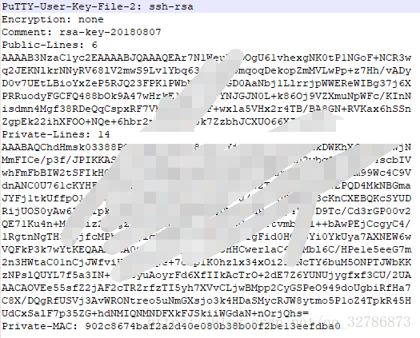
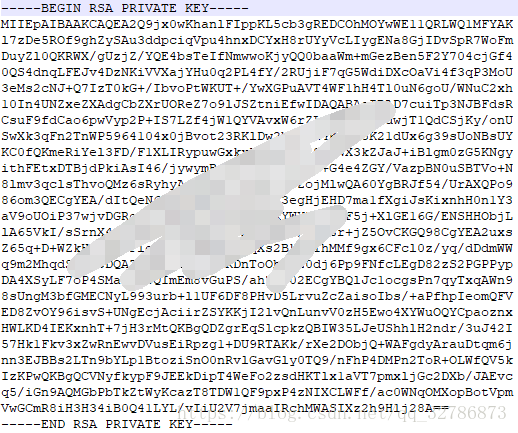

test
test2


# 使用TortoiseGit，设置ssh方式连接git仓库。
https://www.cnblogs.com/zy20160429/p/7493693.html

开始设置之前的准备：建立项目文件夹，初始化git仓库(右键 git  init)，右键打开 **git bash** ，git pull “仓库地址”, 把网站上的仓库代码拉取下来。

TortoiseGit使用扩展名为ppk的密钥，而不是ssh-keygen生成的rsa密钥。

也就是说使用 `ssh-keygen  -t rsa  -C "username@email.com"`产生的密钥，TortoiseGit中不能用。

而基于github的开发必须要用到rsa密钥，因此需要用到TortoiseGit的putty key generator工具，来生成既适用于github的rsa密钥也适用于TortoiseGit的ppk密钥。

以下是生成ppk密钥，并且在TortoiseGit中设置的步骤：

1、开始程序菜单中，打开TortoiseGit，点击 **PuTTYgen**程序，在打开的窗口中点击*Generate*按钮，会出现绿色进度条，生成过程中可以多晃晃鼠标增加随机性。
2、生成之后复制生成的全部内容，窗口先留着不关闭。
3、在 代码管理网站，如github、码云。复制内容。这里拿码云为例。布局都差不多。
4、返回到第二步的窗口，点击 *Save private key* 按钮保存为适用于TortoiseGit的私钥，扩展名为.ppk。

5、运行TortoiseGit开始菜单中的**Pageant**程序，程序启动后将自动停靠在任务栏中，双击该图标，弹出key管理列表。
6、在弹出的key管理列表中，点击*add key*按钮，将第4步中保存的私钥（.ppk）文件加进来，关闭对话框即可。

 7、回到项目目录下，右键——TortoiseGit——Settings——点击Remote，将第4步中保存的私钥（.ppk）文件加到Putty选项。

注意URL后面填的是 git仓库的 ssh地址。

8、完成后，右键可以直接pull和push操作了。

 
补充：

如果一开始是用git命令（ `ssh-keygen   -t   rsa   -C   [邮箱]` ），生成的公钥和密钥（ 比如 id_rsa 和 id_rsa.pub ）

首先，把生成的公钥粘贴到 git远程仓库管理中心。接下来用ssh的方式连接远程仓库。

有两种操作方式：

1.用 git命令
　　可以直接用命令“git  pull【仓库的ssh地址】【分支名称】”   这样拉取和推送

2.用 TortoiseGit 方式 
　　需要将私钥转成 .ppk格式

　　1）运行PuTTYgen，在Conversions菜单中点击Import key，选择一开始生成的私钥文件，比如 id_rsa文件。
　　2）点击Save private key 按钮，将其保存为.ppk文件。
　　3）打开Pageant，点击Add Key，选择前一步所保存的.ppk文件所在的位置即可。

　　PuTTYGen 和 Pageant 都在开始菜单中的TortoiseGit文件夹下，可以找到。

# Github配置ssh key的步骤（大白话+包含原理解释）
https://blog.csdn.net/weixin_42310154/article/details/118340458

## 前言
在github上配置ssh key很容易，网上一大堆教程，但基本没有详细解释其原理的，为什么要配？每使用一台主机都要配？配了为啥就不用密码了？下面将简单通俗地解释一下。

我们在往github上push项目的时候，如果走https的方式，每次都需要输入账号密码，非常麻烦。而采用ssh的方式，就不再需要输入，只需要在github自己账号下配置一个ssh key即可。

## 配置SSH
git使用SSH配置， 初始需要以下三个步骤

使用秘钥生成工具生成rsa秘钥和公钥
将rsa公钥添加到代码托管平台
将rsa秘钥添加到ssh-agent中，为ssh client指定使用的秘钥文件
具体操作如下：
### 第一步：检查本地主机是否已经存在ssh key

``` cmd
cd ~/.ssh
ls
//看是否存在 id_rsa 和 id_rsa.pub文件，如果存在，说明已经有SSH Key

```

如下图所示，则表明已经存在
``` cmd
id_rsa id_rsa.pub
```

如果存在，直接跳到第三步

### 第二步：生成ssh key
``` cmd
ssh-keygen -t rsa -C "xxx@xxx.com"
//执行后一直回车即可

```

### 第三步：获取ssh key公钥内容（id_rsa.pub）
``` cmd
cd ~/.ssh
cat id_rsa.pub

```

复制内容

### 第四步：Github账号上添加公钥

### 第五步：验证是否设置成功
``` cmd
ssh -T git@github.com

```

## 验证原理
SSH登录安全性由非对称加密保证，产生密钥时，一次产生两个密钥，一个公钥，一个私钥，在git中一般命名为id_rsa.pub, id_rsa。

那么如何使用生成的一个私钥一个公钥进行验证呢？

* 本地生成一个密钥对，其中公钥放到远程主机，私钥保存在本地
* 当本地主机需要登录远程主机时，本地主机向远程主机发送一个登录请求，远程收到消息后，随机生成一个字符串并用公钥加密，发回给本地。本地拿到该字符串，用存放在本地的私钥进行解密，再次发送到远程，远程比对该解密后的字符串与源字符串是否等同，如果等同则认证成功。

## 通俗解释！！
重点来了：**一定要知道ssh key的配置是针对每台主机的！**，比如我在某台主机上操作git和我的远程仓库，想要push时不输入账号密码，走ssh协议，就需要配置ssh key，放上去的key是**当前主机的ssh公钥**。那么如果我换了一台其他主机，想要实现无密登录，也就需要重新配置。

下面解释开头提出的问题：
（1）为什么要配？
配了才能实现push代码的时候不需要反复输入自己的github账号密码，更方便
（2）每使用一台主机都要配？
是的，每使用一台新主机进行git远程操作，想要实现无密，都需要配置。并不是说每个账号配一次就够了，而是每一台主机都需要配。
（3）配了为啥就不用密码了？
因为配置的时候是把当前主机的公钥放到了你的github账号下，相当于当前主机和你的账号做了一个关联，你在这台主机上已经登录了你的账号，此时此刻github认为是该账号主人在操作这台主机，在配置ssh后就信任该主机了。所以下次在使用git的时候即使没有登录github，也能直接从本地push代码到远程了。当然这里不要混淆了，你不能随意push你的代码到任何仓库，你只能push到你自己的仓库或者其他你有权限的仓库！


# Git 多台计算机如何使用同一 SSH 密钥
https://geek-docs.com/git/git-questions/930_git_how_do_i_use_same_ssh_key_across_multiple_machines.html

# Windows10下TortoiseGit和Git配置使用同一SSH密钥
https://blog.csdn.net/qq_32786873/article/details/81480414

关于Git使用SSH免密连接参考：https://blog.csdn.net/qq_32786873/article/details/80570788

关于Windows10下TortoiseGit使用SSH免密连接参考：https://blog.csdn.net/qq_32786873/article/details/81477776

TortoiseGit默认使用putty格式的私钥，格式为这样：


而Git默认使用的是OpenSSH格式的私钥，格式为这样：


因为Git与TortoiseGit默认使用的私钥格式不一样，所以我们需要给Git和TortoiseGit个配置一份公钥私钥，但是这样会显得很麻烦，那么我们如何让Git与TortoiseGit使用同一SSH密钥呢？

假设Git的公钥私钥已经配置好了

方法一：
空白地方右键-->TortoiseGit-->Settings，将Network中的SSH client改为Git目录下的ssh.exe。
...\Git\usr\bin\ssh.exe

方法二：
空白地方右键-->TortoiseGit-->Settings，General-->点击"Re-run First Start Wizard"
一直点击"下一步"，直到如下窗口，选择"OpenSSH"，点击"完成"。

方法三：使用相同的公钥
找到TortoiseGit自带的PuTTYgen工具，导入Git使用的私钥，然后点"Save private key"，保存为putty格式的私钥。

然后TortoiseGit就可以使用这个私钥从远程拉取、提交代码了

# 如何使用git（同一账号）在多台电脑协同做工
https://www.cnblogs.com/Ye-zixiao/p/12233193.html

使用场景，对于需要对同一个文档需要在多台电脑上进行编辑工作又不想通过U盘的方式拷贝来拷贝去，比如在学校使用的笔记本电脑，在家中使用台式机。在这种情况下就可以使用git+github来完成协同工作的任务

1、在你想要协同的工作文件夹中打开Git Bash Here，创建一个SSH key，这里用到了非对称公钥加密体系，生成的公钥放到github的网站上，二生成的私钥放在自己的电脑上，每当需要将文件上传到github上时，服务器就会用事先的公钥与你给出的私钥进行验证，验证是否是真正的用户在操作（原理类似于数字签名）。通过如下命令生成公私钥：

``` cmd
ssh-keygen -t rsa -C "你的github邮箱"
```

期间会要求你输入密码，并会给出存放生成的公钥在哪一个文件夹中。我们在这个文件夹中的id_rsa.pub中获得我们账户的公钥。

2、将公钥添加到github自己的网站设置上，注意格式（打开的id_rsa.hub文件中不要将最后的邮箱也复制上去，这一点注意看github上的添加英文提醒）

3、然后我们在自己希望上传的文档的文件夹中打开git bash，初始化git仓库并作出添加提交，并需要进行一定的配置等命令，输入命令：

``` cmd
git init

git config --global user.name"自己账户的名字，建议就是github上的账户名，这样好记"
git config --global user.email"自己账户的邮箱地址，建议也是用GitHub上的那个"

git config --global -l //这条命令是用来查看上面的信息是否之前已经被输入了，自己检查下

git add .   //将所有的文件加入到index进行缓存
git commit -m "你想加入的备注"  //将所有的文件提交到仓库当中

```

4、在github上创建一个仓库，获得相应的url。在本地的git bash中输入命令使之与远程仓库进行关联，并将文件上传到github上，具体命令如下：

``` cmd
git remote add origin <你github上仓库的url>
git push -u origin master //将主分支本地的内容推送到GitHub上的远程仓库上

```

5、以上的工作都是在某一台电脑上执行的，假设这台电脑是自己的笔记本，此时我们需要使用自己的台式机对该项目文件进行工作，此时就需要在另一台电脑上重复执行步骤1，生成一个公私钥在台式机上，并将公钥提交到github上去，并做好`config --global`的配置。这样github即使来自两台电脑对同一仓库的提交，都会认为确实是同一个用户在执行合法的操作，这样使用笔记本是可以提交工作，使用台式机时也可以提交工作。具体命令如下：

``` cmd
//假设前面已经完成了公私钥、config的配置

git clone <你在GitHub上仓库的url>   //将远程仓库克隆到另一台电脑上

//之后你就可以在这台电脑上进行修改，仿佛就是在原来的电脑上使用一样

//在做出修改后同样做出提交工作
git add .
git commit -m "XX"
git push origin master

```

6、有一点需要注意的是当github远程仓库有最新的版本时，本地仓库若不更新就直接做出修改然后试图上传到远程时，就会出现冲突conflict。这种情况最好的解决方法就是对本地仓库先更新再修改上传，可以使用如下命令进行下拉更新:

``` cmd
git pull origin master  //进行下拉更新

//然后再修改提交

```