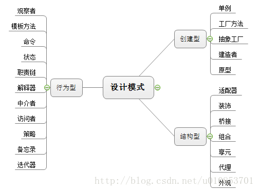
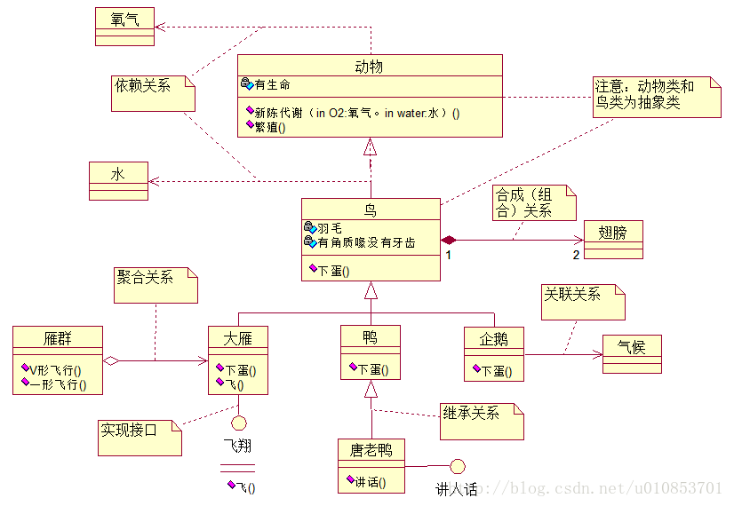
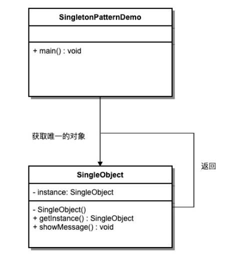
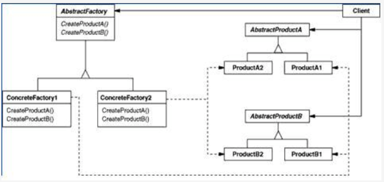
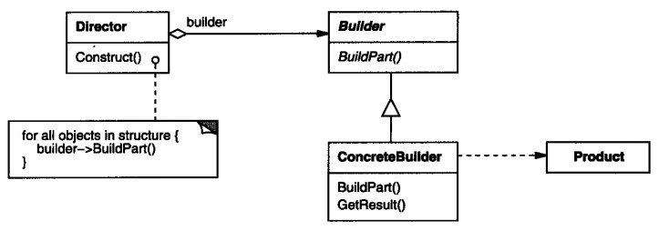
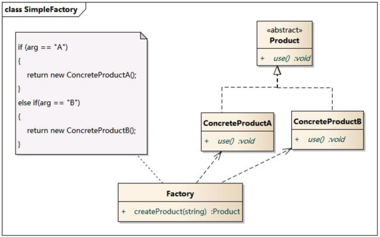
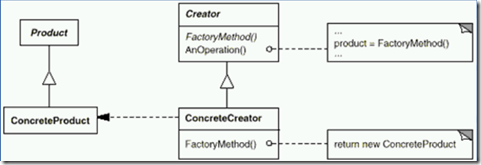
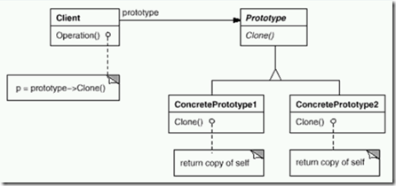

# 高内聚低耦合
从类的角度：减少类的内部 对其他类的调用
从功能的角度：减少模块间的交互复杂度

# 设计模式七大法则
## 单一职责原则
一个类==只处理自己应该处理的内容==，不应该啥都写在一起

## 开闭原则
对拓展开发，对修改封闭。==新功能尽量是添加处理而不是修改代码==。

## 里氏替换原则
任何地方子类都能替代父类，==父类容器装子类==

## 依赖倒转原则
不要依赖具体的实现，==要依赖抽象（接口）==

## 迪米特法则
一个类要尽量减少对别的类的了解，==尽量少用别的类和自己关联==

## 接口隔离原则
一个接口一个行为，==不要一个接口n个行为==

## 合成复用原则
除非设计上需要继承，否则==尽量用组合复用的形式==
继承关系是强耦合，组合关系是低耦合
举例：
脸应是眼睛、鼻子、嘴巴、耳朵的组合，而不是依次地继承
角色和装备应是组合，而不是继承
注意：
***不能盲目地使用合成复用原则，要在遵循迪米特原则的前提下***

# 设计模式总结之一三五
来源：https://cloud.tencent.com/developer/article/1339266

## 引言
 **什么是设计模式（What）?**
 设计模式是前人实际经验的积累和总结，都是着重解决实际的问题。

 **学习设计模式的目的（Why）?**
 通过学习设计模式来提高写出的代码的可维护性、可复用性、可扩展性和灵活性。也就是说让系统能够达到“高内聚、低耦合”的状态。

 **怎样学习设计模式（How）？**
 设计模式是前人的实践经验总结出来的，六大设计原则，23种设计模式；虽然每种模式都有固定的实现方式，但是设计的原则是活的，所以在学习设计模式的过程中要有所思、有所想、有所悟，有良好的理论基础，这样我们在实际运用中才能得心应手。

下面来说说设计模式的一、三、五：

## 设计模式之一
### 一抽象：
 抽象是从众多的事物中抽取出共同的、本质性的特征，而舍弃其非本质的特征。例如苹果、香蕉、生梨、桃子等，它们共同的特性就是水果。得出水果概念的过程，就是一个抽象的过程。抽象化的目的是为了使复杂度降低。设计模式是面向对象编程，而面向对象编程的基础就是类的抽象化。所以要想学好设计模式，就要学好面向抽象编程的思想。
 
### 一法则：迪米特法则
 迪米特法则（Law of Demeter）又叫作最少知识原则（LKP,Least Knowledge Principle），就是说一个对象应当对其他对象有尽可能少的了解，类与类之间的了解的越多，关系越密切，耦合度越大，当一个类发生改变时，另一个类也可能发生变化。

核心思想：最少依赖

具体介绍：设计模式六大原则——迪米特法则（LOD）：https://blog.csdn.net/zlts000/article/details/27688431

## 设计模式之三
### 三大特性
#### 1. **封装**
 把事物的状态和行为的实现细节封装在类中，形成一个可以重复使用的“零件”，被成千上万对其内部毫不知情的工作人员使用。

#### 2. **继承**
“Is-a”的的关系，表示一个类是另一个类的特殊种类。

#### 3. **多态**
不同的对象可以执行相同的动作，但要通过它们自己的实现代码来执行。

### 三大类别
#### 1. **创建型模式**
处理对象的创建过程。创建型模式将类的实例是如何被创建和放在一起的这些关于具体类的的信息封装起来，创建一个公用的“零件”，也就是接口，来和外部链接，这样减少了类与类之间的紧密程度，内部完整——高内聚，与外部的连接灵活——低耦合。

例：创建一个抽象的动物类，只知道动物类是有生命的个体，都可以进行新陈代谢和繁殖。

#### 2. **结构型模式**
用来处理类或者对象的组合。就是描述类和对象之间怎样组织起来形成大的结构，从而实现新的功能。

例：创建型创建了一个抽象的动物类，那么结构型模式就是对这个类进行修饰加工，加上强健的四肢，如：狮子，加上翅膀：如鹰，加上鳃：如鲤鱼。

#### 3. **行为型模式**
用来对类或者对象怎样交互和怎样分配职责进行描述。

例：结构型模式对创建的类进行了修饰加工，而行为型模式则是赋予被修饰后的类一些特性，例：对狮子的四肢进行合理设计，从而让狮子能够在陆地上风驰电掣；对鹰的翅膀进行合理设计，让鹰能够翱翔九天；对鱼的鳃进行合理设计，让鲤鱼能够畅游海底。

  23中设计模式的具体分类：
  
  
| 分类   |                                                                                    |
| ------ | ---------------------------------------------------------------------------------- |
| 行为型 | 观察者、模板方法、命令、状态、职责链、解释器、中介者、访问者、策略、备忘录、迭代器 |
| 创建型 | 单例、工厂方法、抽象工厂、建造者、原型                                             |
| 结构型 | 适配器、装饰、桥接、组合、享元、代理、外观                                         |


## 设计模式之五
### 五大原则 
#### 1、开放-闭合原则
软件实体（类、模块、函数等等）应该可以扩展，但是不可修改。意思就是在一个系统中，增加程序的功能时，不应该改动原有代码，只要增加新的代码即可；开闭原则是核心原则，一切的一切都围绕开闭原则展开的。

具体介绍：设计模式六大原则——开放-闭合原则（OCP）：https://blog.csdn.net/zlts000/article/details/24811363

 #### 2、依赖倒置原则
 细节是多变的，而抽象是相对稳定的。所以我们编程的时候要注重抽象的编程，而非细节编程。如果说开闭原则是目标,依赖倒转原则是到达"开闭"原则的手段。

具体介绍：设计模式六大原则——依赖倒置原则（DIP）：https://blog.csdn.net/zlts000/article/details/25621415

#### 3、里氏代换原则
子类型必须能够替换掉他们的父类型。限制变化影响的范围。

具体介绍：设计模式六大原则——里氏代换原则（LSP）：
https://blog.csdn.net/zlts000/article/details/26961047

#### 4、合成/聚合复用原则
要尽量使用合成和聚合，尽量不要使用继承。

具体介绍：设计模式六大原则——合成/聚合复用原则（CARP）：https://blog.csdn.net/zlts000/article/details/26749723

里氏代换原则和合成/聚合复用原则都是对开放闭合原则使用时的规范。

#### 5、单一职责原则
就一个类而言，应该仅有一个引起它变化的原因。通俗的说，一个类只负责一项职责。

具体介绍：设计模式六大原则——单一职责原则（SRP）：https://blog.csdn.net/zlts000/article/details/24798049

### 五大关系
在设计模式中涉及的五种关系：依赖、关联（聚合、组合）、实现、继承，用设计模式中一张经典的图来作解释：




# 【C#设计模式】总目录（共23种）【已全部完结！】
https://star-302.blog.csdn.net/article/details/125595458

## 一、创建型模式【5种】
>创建型模式就是用来解决对象实例化和使用的客户端耦合的模式，可以让客户端和对象实例化都独立变化，做到相互不影响。

1. 单件模式(Singleton Pattern)
2. 抽象工厂模式（Abstract Factory）
3. 建造者模式(Builder)
4-0.简单工厂模式
4. 工厂方法模式（Factory Method)
5. 原型模式(Prototype)

## 二、结构型模式【7种】
>结构型模式主要研究的是类和对象的组合的问题。它包括两种类型，一是类结构型模式：指的是采用继承机制来组合实现功能；二是对象结构型模式：指的是通过组合对象的方式来实现新的功能。

6. 适配器模式（Adapter Pattern)
7. 桥接模式（Bridge Pattern)
8. 装饰模式(Decorator Pattern)
9. 组合模式(Composite Pattern)
10. 外观模式（Facade Pattern)
11. 享元模式(Flyweight Pattern)
12. 代理模式(Proxy Pattern)

## 三、行为型模式【11种】
>行为型模式主要讨论的是在不同对象之间划分责任和算法的抽象化的问题。行为型模式又分为类的行为模式和对象的行为模式两种。
>* 类的行为模式——使用继承关系在几个类之间分配行为。
>* 对象的行为模式——使用对象聚合的方式来分配行为。

13. 模板方法模式(Template Method Pattern)
14. 命令模式(Command Pattern)
15. 迭代器模式(Iterator Pattern)
16. 观察者模式(Observer Pattern）
17. 解释器模式(Interpreter Pattern) 【23】
18. 中介者模式(Mediator Pattern) 【17】
19. 职责链模式(Chain of Responsibility Pattern) 【20】
20. 备忘录模式(Memento Pattern) 【22】
21. 策略模式(Strategy Pattern) 【19】
22. 访问者模式(Visitor Pattern)【21】
23. 状态模式(State Pattern)【18】

## 设计模式简介
设计模式（Design pattern）代表了最佳的实践，通常被有经验的面向对象的软件开发人员所采用。设计模式是软件开发人员在软件开发过程中面临的一般问题的解决方案。这些解决方案是众多软件开发人员经过相当长的一段时间的试验和错误总结出来的。

设计模式是一套被反复使用的、多数人知晓的、经过分类编目的、代码设计经验的总结。使用设计模式是为了重用代码、让代码更容易被他人理解、保证代码可靠性。 毫无疑问，设计模式于己于他人于系统都是多赢的，设计模式使代码编制真正工程化，设计模式是软件工程的基石，如同大厦的一块块砖石一样。项目中合理地运用设计模式可以完美地解决很多问题，每种模式在现实中都有相应的原理来与之对应，每种模式都描述了一个在我们周围不断重复发生的问题，以及该问题的核心解决方案，这也是设计模式能被广泛应用的原因。

## 什么是 GOF（四人帮，全拼 Gang of Four）？
在 1994 年，由 Erich Gamma、Richard Helm、Ralph Johnson 和 John Vlissides 四人合著出版了一本名为 Design Patterns - Elements of Reusable Object-Oriented Software（中文译名：设计模式 - 可复用的面向对象软件元素） 的书，该书首次提到了软件开发中设计模式的概念。

四位作者合称 GOF（四人帮，全拼 Gang of Four）。他们所提出的设计模式主要是基于以下的面向对象设计原则。

* 对接口编程而不是对实现编程。
* 优先使用对象组合而不是继承。

## 设计模式的使用
设计模式在软件开发中的两个主要用途。

1.开发人员的共同平台
设计模式==提供了一个标准的术语系统，且具体到特定的情景==。例如，单例设计模式意味着使用单个对象，这样所有熟悉单例设计模式的开发人员都能使用单个对象，并且可以通过这种方式告诉对方，程序使用的是单例模式。

2.最佳的实践
设计模式已经经历了很长一段时间的发展，它们==提供了软件开发过程中面临的一般问题的最佳解决方案==。学习这些模式有助于经验不足的开发人员通过一种简单快捷的方式来学习软件设计。

## 设计模式的七大原则【重要！】
### 1、单一职责原则（Single Responsibilities Principle）【SRP】
>（1）SRP(Single ResponsibilitiesPrinciple)的定义：就一个类而言，应该仅有一个引起它变化的原因。==简而言之，就是功能要单一。==
>（2）如果一个类承担的职责过多，就等于把这些职责耦合在一起，一个职责的变化可能会削弱或者抑制这个类完成其它职责的能力。这种耦合会导致脆弱的设计，当变化发生时，设计会遭受到意想不到的破坏。(敏捷软件开发)
>（3）**软件设计真正要做的许多内容，就是发现职责并把那些职责相互分离。**

>小结：==单一职责原则（SRP）可以看做是低耦合、高内聚在面向对象原则上的引申==，将职责定义为引起变化的原因，以提高内聚性来减少引起变化的原因。责任过多，引起它变化的原因就越多，这样就会导致职责依赖，大大损伤其内聚性和耦合度。


### 2、开闭原则（Open Close Principle）【OCP】
开闭原则的意思是：==对扩展开放，对修改关闭。==在程序需要进行拓展的时候，不能去修改原有的代码，实现一个热插拔的效果。简言之，是为了使程序的扩展性好，易于维护和升级。想要达到这样的效果，我们需要使用接口和抽象类，后面的具体设计中我们会提到这点。

>（1）OCP(Open-Close
Principle)的定义：就是说软件实体(类，方法等等)应该可以扩展（扩展可以理解为增加），但是不能在原来的方法或者类上修改，也可以这样说，对增加代码开放，对修改代码关闭。
>（2）OCP的两个特征： 对于扩展（增加）是开放的，因为它不影响原来的，这是新增加的。对于修改是封闭的，如果总是修改，逻辑会越来越复杂。

>小结：开放封闭原则（OCP）是面向对象设计的核心思想。遵循这个原则可以为我们面向对象的设计带来巨大的好处：可维护（维护成本小，做管理简单，影响最小）、可扩展（有新需求，增加就好）、可复用（不耦合，可以使用以前代码）、灵活性好（维护方便、简单）。开发人员应该仅对程序中出现频繁变化的那些部分做出抽象，但是不能过激，对应用程序中的每个部分都刻意地进行抽象同样也不是一个好主意。拒绝不成熟的抽象和抽象本身一样重要。


### 3、里氏代换原则（Liskov Substitution Principle）【LSP】
里氏代换原则是面向对象设计的基本原则之一。 里氏代换原则中说，==任何基类可以出现的地方，子类一定可以出现。==LSP 是继承复用的基石，只有当派生类可以替换掉基类，且软件单位的功能不受到影响时，基类才能真正被复用，而派生类也能够在基类的基础上增加新的行为。里氏代换原则是对开闭原则的补充。**实现开闭原则的关键步骤就是抽象化，而基类与子类的继承关系就是抽象化的具体实现，所以里氏代换原则是对实现抽象化的具体步骤的规范。**

>（1）LSP(Liskov SubstitutionPrinciple)的定义：子类型必须能够替换掉它们的父类型。更直白的说，LSP是实现面向接口编程的基础。

>小结：任何基类可以出现的地方，子类一定可以出现，所以我们可以实现面向接口编程。
LSP是继承复用的基石，只有当子类可以替换掉基类，软件的功能不受到影响时，基类才能真正被复用，而子类也能够在基类的基础上增加新的行为。里氏代换原则是对“开-闭”原则的补充。实现“开-闭”原则的关键步骤就是抽象化。而基类与子类的继承关系就是抽象化的具体实现，所以里氏代换原则是对实现抽象化的具体步骤的规范。


### 4、依赖倒转原则（Dependence Inversion Principle）【DIP】
这个原则是开闭原则的基础，具体内容：==针对接口编程，依赖于抽象而不依赖于具体。==

>（1）DIP(Dependence InversionPrinciple)的定义：抽象不应该依赖细节，细节应该依赖于抽象。简单说就是，我们要针对接口编程，而不要针对实现编程。
>（2）高层模块不应该依赖低层模块，两个都应该依赖抽象，因为抽象是稳定的。抽象不应该依赖具体（细节），具体（细节）应该依赖抽象。

>小结：依赖倒置原则其实可以说是面向对象设计的标志，如果在我们编码的时候考虑的是面向接口编程，而不是简单的功能实现，体现了抽象的稳定性，只有这样才符合面向对象的设计。


### 5、接口隔离原则（Interface Segregation Principle）【ISP】
这个原则的意思是：==使用多个隔离的接口，比使用单个接口要好。==它还有另外一个意思是：==降低类之间的耦合度。==由此可见，其实设计模式就是从大型软件==架构出发、便于升级和维护的软件设计思想==，它==强调降低依赖，降低耦合==。

>（1）接口隔离原则（Interface Segregation Principle,ISP）指的是使用多个专门的接口比使用单一的总接口要好。也就是说不要让一个单一的接口承担过多的职责，而应把每个职责分离到多个专门的接口中，进行接口分离。过于臃肿的接口是对接口的一种污染。
>（2）使用多个专门的接口比使用单一的总接口要好。
>（3）一个类对另外一个类的依赖性应当是建立在最小的接口上的。
>（4）一个接口代表一个角色，不应当将不同的角色都交给一个接口。没有关系的接口合并在一起，形成一个臃肿的大接口，这是对角色和接口的污染。
>（5）“不应该强迫客户依赖于它们不用的方法。接口属于客户，不属于它所在的类层次结构。”这个说得很明白了，再通俗点说，不要强迫客户使用它们不用的方法，如果强迫用户使用它们不使用的方法，那么这些客户就会面临由于这些不使用的方法的改变所带来的改变。

>小结：接口隔离原则（ISP）告诉我们，在做接口设计的时候，要尽量设计的接口功能单一，功能单一，使它变化的因素就少，这样就更稳定，其实这体现了高内聚，低耦合的原则，这样做也避免接口的污染。


### 6、迪米特法则，又称最少知道原则（Demeter Principle）
最少知道原则是指：==一个实体应当尽量少地与其他实体之间发生相互作用【！！！】，使得系统功能模块相对独立。==

### 7、合成复用原则（Composite Reuse Principle）【CRP】
合成复用原则是指：尽量使用合成/聚合的方式，而不是使用继承【！！！】。

>（1）组合复用原则（Composite Reuse Principle, CRP）就是在一个新的对象里面使用一些已有的对象，使之成为新对象的一部分。新对象通过向这些对象的委派达到复用已用功能的目的。简单地说，就是要尽量使用合成/聚合，尽量不要使用继承。
>（2）要使用好组合复用原则，首先需要区分”Has—A”和“Is—A”的关系。“Is—A”是指一个类是另一个类的“一种”，是属于的关系，而“Has—A”则不同，它表示某一个角色具有某一项责任。导致错误的使用继承而不是聚合的常见的原因是错误地把“Has—A”当成“Is—A”.例如：鸡是动物，这就是“Is-A”的表现，某人有一个手枪，People类型里面包含一个Gun类型，这就是“Has-A”的表现。

>小结：组合/聚合复用原则可以使系统更加灵活，类与类之间的耦合度降低，一个类的变化对其他类造成的影响相对较少，因此一般首选使用组合/聚合来实现复用；其次才考虑继承，在使用继承时，需要严格遵循里氏替换原则，有效使用继承会有助于对问题的理解，降低复杂度，而滥用继承反而会增加系统构建和维护的难度以及系统的复杂度，因此需要慎重使用继承复用。


# 【C#设计模式】1.单件模式(Singleton Pattern)【创建型】
https://star-302.blog.csdn.net/article/details/125594207

## 前言
在软件系统中，经常有这样一些特殊的类，必须保证它们在系统中只存在一个实例，才能确保它们的逻辑正确性、以及良好的效率。
如何绕过常规的构造器，提供一种机制来保证一个类只创建一个实例？
这==应该是类设计者的责任，而不是类使用者的责任。==

## 一、基本介绍
意图：==保证一个类仅有一个实例==，并提供一个访问它的全局访问点。

主要解决：一个全局使用的类频繁地创建与销毁。

何时使用：当您想控制实例数目，节省系统资源的时候。

如何解决：判断系统是否已经有这个单例，如果有则返回，如果没有则创建。

关键代码：构造函数是私有的。

应用实例：
一个班级只有一个班主任。
Windows 是多进程多线程的，在操作一个文件的时候，就不可避免地出现多个进程或线程同时操作一个文件的现象，所以所有文件的处理必须通过唯一的实例来进行。
一些设备管理器常常设计为单例模式，比如一个电脑有两台打印机，在输出的时候就要处理不能两台打印机打印同一个文件。

**优点**：
* 在内存里只有一个实例，减少了内存的开销，尤其是频繁的创建和销毁实例（比如管理首页页面缓存）。
* 避免对资源的多重占用（比如写文件操作）。

**缺点**：
没有接口，不能继承，与单一职责原则冲突，一个类应该只关心内部逻辑，而不关心外面怎么样来实例化。

使用场景：
要求生产唯一序列号。
WEB 中的计数器，不用每次刷新都在数据库里加一次，用单例先缓存起来。
创建的一个对象需要消耗的资源过多，比如 I/O 与数据库的连接等。

## 二、结构与实现
我们将创建一个 SingleObject 类。SingleObject 类有它的私有构造函数和本身的一个静态实例。

SingleObject 类提供了一个静态方法，供外界获取它的静态实例。SingletonPatternDemo 类使用 SingleObject 类来获取 SingleObject 对象。



创建一个Singleton类
```c#
public class SingleObject {
 
   //创建 SingleObject 的一个对象
   private static SingleObject instance = new SingleObject();
 
   //让构造函数为 private，这样该类就不会被实例化
   private SingleObject(){}
 
   //获取唯一可用的对象
   public static SingleObject getInstance(){
      return instance;
   }
 
   public void showMessage(){
      System.out.println("Hello World!");
   }
}

```
从Singleton类获取唯一对象
```c#
public class SingletonPatternDemo {
   public static void main(String[] args) {
 
      //不合法的构造函数
      //编译时错误：构造函数 SingleObject() 是不可见的
      //SingleObject object = new SingleObject();
 
      //获取唯一可用的对象
      SingleObject object = SingleObject.getInstance();
 
      //显示消息
      object.showMessage();
   }
}

```

## 三、单例模式的几种实现方式
### 单线程Singleton实现
```c#
class Singleton
{
	private static Singleton instance = null;
	private Singleton() { }
	public static Singleton getInstance
	{
		get
		{
			if (instance == null)
			{
				instance = new Singleton();
			}
			return instance;
		}
	}
	public void showMessage()
	{
		 Console.WriteLine("Test");      
	}  

```

### 多线程Singleton实现【推荐用！多线程安全】
双检锁/双重校验锁（DCL，即 double-checked locking）
描述：这种方式采用双锁机制，安全且在多线程情况下能保持高性能。
```c#
class Singleton
{
	private static volatile Singleton instance = null;
	private static object lockHelper = new object();
	private Singleton() { }
	public static Singleton getSingleton
	{
		get
		{
			if (instance == null)
			{
				lock (lockHelper)
				{
					if (instance == null)
					{
						instance = new Singleton();
					}
				}
			}
			return instance;
		}
	}

	public void showMessage()
	{
		 Console.WriteLine("Test");      
	}  

```

* 此程序对多线程是安全的，使用了一个==辅助对象lockHelper==，保证只有一个线程创建实例（如果instance为空，保证只有一个线程instance = new Singleton();创建唯一的一个实例）。（**Double Check**)
* 请注意一个==关键字volatile==，如果去掉这个关键字，还是有可能发生线程不是安全的。
* volatile 保证严格意义的多线程编译器在代码编译时对指令不进行微调。

### 静态Singleton实现
```c#
class Static_Singleton
{
	public static readonly Static_Singleton instance = new Static_Singleton();
	private Static_Singleton() { }

	public void showMessage()
	{
		Console.WriteLine("Test");
	}
}

```
以上代码展开等同于：
```c#
class Static_Singleton
{
	public static readonly Static_Singleton instance;
	static Static_Singleton()
	{
		instance = new Static_Singleton();
	}
	private Static_Singleton() { }
	public void showMessage()
	{
		Console.WriteLine("Test");
	}
}

```
优点： 简洁，易懂
缺点： 不可以实现带参数实例的创建。

# 【C#设计模式】2.抽象工厂模式（Abstract Factory）【创建型】
https://star-302.blog.csdn.net/article/details/125599352

## 前言
上一篇文章我们讲了【工厂方法】模式，它是为了解决【简单工厂】模式所面对的问题，它的问题就是：如果我们增加新的产品，工厂类的方法就要修改本身的代码，增加产品越多，其逻辑越复杂，同时这样的修改也是不符合【开放关闭原则OCP】，对修改代码关闭，对增加代码开放。为了解决【简单工厂】的问题，我们引出了【工厂方法】模式，通过子类化工厂类，解决了工厂类责任的划分，产品和相应的工厂一一对应，符合了OCP。如果我们要设计一套房子，当然我们知道房子是由房顶、地板、窗户、房门组成的，别的组件暂时省略，先设计一套古典风格的房子，再创建一套现代风格的房子，再创建一套欧式风格的房子，这么多套房子，我们该怎么办呢？今天我们要讲的【抽象工厂】模式可以很好的解决多套变化的问题。

## 一、抽象工厂详细介绍
### 1.1 动机(Motivate)：
在软件系统中，经常面临着"一系列相互依赖的对象"的创建工作：同时，由于需求的变化，往往存在更多系列对象的创建工作。如何应对这种变化？如何绕过常规的对象创建方法（new)，提供一种"封装机制"来避免客户程序和这种"多系列具体对象创建工作"的紧耦合？

### 1.2 意图(Intent):
提供一个创建一系列相关或相互依赖对象的接口，而无需指定它们具体的类。 ——《设计模式》GoF

### 1.3 结构图（Structure）



该图是抽象工厂的UML图，结合抽象工厂的意图、动机和图示来理解该模式，今天我们就以建设房子为例来说明抽象工厂的实现机理。

### 1.4 模式的组成
可以看出，在抽象工厂模式的结构图有以下角色：

（1）**抽象产品类角色（AbstractProduct）**：为抽象工厂中相互依赖的每种产品定义抽象接口对象，也可以这样说，有几种产品，就要声明几个抽象角色，每一个抽象产品角色和一种具体的产品相匹配。

（2）**具体产品类（ConcreteProduct）**：具体产品类实现了抽象产品类，是针对某个具体产品的实现的类型。

（3）**抽象工厂类角色（Abstract Factory）**：定义了创建一组相互依赖的产品对象的接口操作，每种操作和每种产品一一对应。

（4）**具体工厂类角色（ConcreteFactory）**：实现抽象类里面的所有抽象接口操作，可以创建某系列具体的产品，这些具体的产品是“抽象产品类角色”的子类。

### 1.5 抽象工厂的具体代码实现
随着我们年龄的增大，我们也到了结婚的年龄。结婚首要的问题就是房子的问题，假设我有一个很有钱的爸爸，哈哈，有钱可以解决很多问题。作为长子的我，希望能有一套欧式风格的房子，再加上田园风光，此生足矣。我弟弟就不一样了，他想要一套现代样式的房子，如果兄弟姊妹再多年一点，那就有更多的要求了。由于房子由房顶、地板、窗户和房门组成，其他组件暂时省略，有这么多套房子要建设，每套房子的房顶、地板、窗户和房门都是一个体系的，那就让我们看看如何使用【抽象工厂】模式来实现不同房屋的建造。
```c#
using System;
 
/// <summary>
/// 下面以不同系列房屋的建造为例子演示抽象工厂模式
/// 因为每个人的喜好不一样，我喜欢欧式的，我弟弟就喜欢现代的
/// 客户端调用
/// </summary>
class Client
{
   static void Main(string[] args)
   {
       // 哥哥的欧式风格的房子
       AbstractFactory europeanFactory = new EuropeanFactory();
       europeanFactory.CreateRoof().Create();
       europeanFactory.CreateFloor().Create();
       europeanFactory.CreateWindow().Create();
       europeanFactory.CreateDoor().Create();


       //弟弟的现代风格的房子
       AbstractFactory modernizationFactory = new ModernizationFactory();
       modernizationFactory.CreateRoof().Create();
       modernizationFactory.CreateFloor().Create();
       modernizationFactory.CreateWindow().Create();
       modernizationFactory.CreateDoor().Create();
       Console.Read();
   }
}

/// <summary>
/// 抽象工厂类，提供创建不同类型房子的接口
/// </summary>
public abstract class AbstractFactory
{
   // 抽象工厂提供创建一系列产品的接口，这里作为例子，只给出了房顶、地板、窗户和房门创建接口
   public abstract Roof CreateRoof();
   public abstract Floor CreateFloor();
   public abstract Window CreateWindow();
   public abstract Door CreateDoor();
}

/// <summary>
/// 欧式风格房子的工厂，负责创建欧式风格的房子
/// </summary>
public class EuropeanFactory : AbstractFactory
{
   // 制作欧式房顶
   public override Roof CreateRoof()
   {
       return new EuropeanRoof();
   }

   // 制作欧式地板
   public override Floor CreateFloor()
   {
       return new EuropeanFloor();
   }

   // 制作欧式窗户
   public override Window CreateWindow()
   {
       return new EuropeanWindow();
   }

   // 制作欧式房门
   public override Door CreateDoor()
   {
       return new EuropeanDoor();
   }
}

/// <summary>
/// 现在风格房子的工厂，负责创建现代风格的房子
/// </summary>
public class ModernizationFactory : AbstractFactory
{
   // 制作现代房顶
   public override Roof CreateRoof()
   {
       return new ModernizationRoof();
   }

   // 制作现代地板
   public override Floor CreateFloor()
   {
       return new ModernizationFloor();
   }

   // 制作现代窗户
   public override Window CreateWindow()
   {
       return new ModernizationWindow();
   }

   // 制作现代房门
   public override Door CreateDoor()
   {
       return new ModernizationDoor();
   }
}

/// <summary>
/// 房顶抽象类，子类的房顶必须继承该类
/// </summary>
public abstract class Roof
{
   /// <summary>
   /// 创建房顶
   /// </summary>
   public abstract void Create();
}

/// <summary>
/// 地板抽象类，子类的地板必须继承该类
/// </summary>
public abstract class Floor
{
   /// <summary>
   /// 创建地板
   /// </summary>
   public abstract void Create();
}

/// <summary>
/// 窗户抽象类，子类的窗户必须继承该类
/// </summary>
public abstract class Window
{
   /// <summary>
   /// 创建窗户
   /// </summary>
   public abstract void Create();
}

/// <summary>
/// 房门抽象类，子类的房门必须继承该类
/// </summary>
public abstract class Door
{
   /// <summary>
   /// 创建房门
   /// </summary>
   public abstract void Create();
}

/// <summary>
/// 欧式地板类
/// </summary>
public class EuropeanFloor : Floor
{
   public override void Create()
   {
       Console.WriteLine("创建欧式的地板");
   }
}


/// <summary>
/// 欧式的房顶
/// </summary>
public class EuropeanRoof : Roof
{
   public override void Create()
   {
       Console.WriteLine("创建欧式的房顶");
   }
}


/// <summary>
///欧式的窗户
/// </summary>
public class EuropeanWindow : Window
{
   public override void Create()
   {
       Console.WriteLine("创建欧式的窗户");
   }
}


/// <summary>
/// 欧式的房门
/// </summary>
public class EuropeanDoor : Door
{
   public override void Create()
   {
       Console.WriteLine("创建欧式的房门");
   }
}

/// <summary>
/// 现代的房顶
/// </summary>
public class ModernizationRoof : Roof
{
   public override void Create()
   {
       Console.WriteLine("创建现代的房顶");
   }
}

/// <summary>
/// 现代的地板
/// </summary>
public class ModernizationFloor : Floor
{
   public override void Create()
   {
       Console.WriteLine("创建现代的地板");
   }
}

/// <summary>
/// 现代的窗户
/// </summary>
public class ModernizationWindow : Window
{
   public override void Create()
   {
       Console.WriteLine("创建现代的窗户");
   }
}

/// <summary>
/// 现代的房门
/// </summary>
public class ModernizationDoor : Door
{
   public override void Create()
   {
       Console.WriteLine("创建现代的房门");
   }
}

```

运行结果：
```c#
创建欧式的房顶
创建欧式的地板
创建欧式的窗户
创建欧式的房门
创建现代的房顶
创建现代的地板
创建现代的窗户
创建现代的房门

```

### 1.6 抽象工厂应对需求变更
让我们看看该模式如何应对需求的变化，假设我的表弟一看我们的房子很好，他也想要一套古典风格的房子（哈哈，这个家伙事挺多的，有好事总是落不下他）。

```c#
/// <summary>
///先为表弟的房子来建立一个工厂类吧
/// </summary>
public class ClassicalFactory : AbstractFactory
{
    //创建房顶
    public override Roof CreateRoof()
    {
        return new  ClassicalRoof();
    }

    // 创建地板
    public override Floor CreateFloor()
    {
        return new  ClassicalFloor();
    }

    // 创建窗户
    public override Window CreateWindow()
    {
        return new  ClassicalWindow();
    }

    // 创建房门
    public override Door CreateDoor()
    {
        return new  ClassicalDoor();
    }
}

/// <summary>
///古典的房顶
/// </summary>
public class  ClassicalRoof : Roof
{
    public override void Create()
    {
        Console.WriteLine("创建古典的房顶");
    }
}

/// <summary>
/// 古典的地板
/// </summary>
public class  ClassicalFloor : Floor
{
    public override void Create()
    {
        Console.WriteLine("创建古典的地板");
    }
}

/// <summary>
/// 古典的窗户
/// </summary>
public class  ClassicalWindow : Window
{
    public override void Create()
    {
        Console.WriteLine("创建古典的窗户");
    }
}

/// <summary>
/// 古典的房门
/// </summary>
public class  ClassicalDoor: Door
{
    public override void Create()
    {
        Console.WriteLine("创建古典的房门");
    }
}  

```

此时，只需要添加五个类：一个是古典风格工厂类，负责创建古典风格的房子，另外几个类是具有古典风格的房顶、地板、窗户和房门的具体产品。从上面代码看出，抽象工厂对于系列产品的变化支持 “开放——封闭”原则（指的是要求系统对扩展开放，对修改封闭），扩展起来非常简便，但是，抽象工厂对于增加新产品这种情况就不支持”开放——封闭 “原则，因为要修改创建系列产品的抽象基类AbstractFactory，增加相应产品的创建方法，这也是抽象工厂的缺点所在。

## 二、抽象工厂的实现要点
1、如果没有应对“多系列对象创建”的需求变化，则没有必要使用AbstractFactory模式，这时候使用简单的静态工厂完全可以。

2、"系列对象"指的是这些对象之间有相互依赖、或作用的关系，例如游戏开发场景中“道路”与“房屋”的依赖，“道路”与“地道”的依赖。

3、AbstractFactory模式主要在于应对“新系列”的需求变动。其缺点在于难以应对“新对象”的需求变动。

4、AbstractFactory模式经常和FactoryMethod模式共同组合来应对“对象创建”的需求变化。

### 2.1 抽象工厂模式的优点：
【抽象工厂】模式将系列产品的创建工作延迟到具体工厂的子类中，我们声明工厂类变量的时候是使用的抽象类型，同理，我们使用产品类型也是抽象类型，这样做就尽可能的可以减少客户端代码与具体产品类之间的依赖，从而降低了系统的耦合度。**耦合度降低了**，对于后期的维护和扩展就更有利，这也就是【抽象工厂】模式的优点所在。

可能有人会说在Main方法里面（这里的代码就是客户端的使用方）还是会使用具体的工厂类，对的。这个其实我们通过**Net的配置**，把这部分移出去，最后把依赖关系放到配置文件中。如果有新的需求我们**只需要修改配置文件，根本就不需要修改代码了，让客户代码更稳定**。依赖关系肯定会存在，我们要做的就是降低依赖，想完全去除很难，也不现实。

### 2.2 抽象工厂模式的缺点：
有优点肯定就有缺点，因为每种模式都有他的使用范围，或者说要解决的问题，不能解决的问题就是缺点了，其实也不能叫缺点了。【抽象工厂】模式很难支持增加新产品的变化，这是因为抽象工厂接口中已经确定了可以被创建的产品集合，==如果需要添加新产品，此时就必须去修改抽象工厂的接口，这样就涉及到抽象工厂类以及所有子类的改变，这样也就违背了“开发——封闭”原则。==

### 2.3 抽象工厂模式的使用场景：
如果系统需要多套的代码解决方案，并且每套的代码方案中又有很多相互关联的产品类型，并且在系统中我们可以相互替换的使用一套产品的时候可以使用该模式，客户端不需要依赖具体实现。

## 三、.NET中抽象工厂模式实现【略看】
微软的类库发展了这么多年，设计模式在里面有大量的应用，【抽象工厂】模式在.NET类库中也存在着大量的使用，比如和操作数据库有关的类型，这个类就是==System.Data.Common.DbProviderFactory==，这个类位于System.Data.dll程序集中。该类扮演抽象工厂模式中抽象工厂的角色，我们可以用ILSpy反编译工具查看该类的实现：

/// 扮演抽象工厂的角色
/// 创建连接数据库时所需要的对象集合，
/// 这个对象集合包括有 DbConnection对象（这个是抽象产品类,如绝味例子中的YaBo类）、DbCommand类、DbDataAdapter类，针对不同的具体工厂都需要实现该抽象类中方法。
```c#
public abstract class DbProviderFactory
{
	public virtual bool CanCreateDataSourceEnumerator
	{
		get
		{
			return false;
		}
	}

	public virtual DbCommand CreateCommand()
	{
		return null;
	}

	public virtual DbCommandBuilder CreateCommandBuilder()
	{
		return null;
	}

	public virtual DbConnection CreateConnection()
	{
		return null;
	}

	public virtual DbConnectionStringBuilder CreateConnectionStringBuilder()
	{
		return null;
	}

	public virtual DbDataAdapter CreateDataAdapter()
	{
		return null;
	}

	public virtual DbParameter CreateParameter()
	{
		return null;
	}

	public virtual CodeAccessPermission CreatePermission(PermissionState state)
	{
		return null;
	}

	public virtual DbDataSourceEnumerator CreateDataSourceEnumerator()
	{
		return null;
	}
}
```

DbProviderFactory类是一个抽象工厂类，该类提供了创建数据库连接时所需要的对象集合的接口，实际创建的工作在其子类工厂中进行，微软使用的是SQL Server数据库，因此提供了连接SQL Server数据的具体工厂实现，具体代码可以用反编译工具查看，具体代码如下：

SqlClientFactory扮演着具体工厂的角色，用来创建连接SQL Server数据所需要的对象
```c#
public sealed class SqlClientFactory : DbProviderFactory, IServiceProvider
{
	public static readonly SqlClientFactory Instance = new SqlClientFactory();

	public override bool CanCreateDataSourceEnumerator
	{
		get
		{
			return true;
		}
	}

	private SqlClientFactory()
	{
	}

	public override DbCommand CreateCommand()
	{
		return new SqlCommand();
	}

	public override DbCommandBuilder CreateCommandBuilder()
	{
		return new SqlCommandBuilder();
	}

	public override DbConnection CreateConnection()
	{
		return new SqlConnection();
	}

	public override DbConnectionStringBuilder CreateConnectionStringBuilder()
	{
		return new SqlConnectionStringBuilder();
	}

	public override DbDataAdapter CreateDataAdapter()
	{
		return new SqlDataAdapter();
	}

	public override DbParameter CreateParameter()
	{
		return new SqlParameter();
	}

	public override CodeAccessPermission CreatePermission(PermissionState state)
	{
		return new SqlClientPermission(state);
	}

	public override DbDataSourceEnumerator CreateDataSourceEnumerator()
	{
		return SqlDataSourceEnumerator.Instance;
	}

	object IServiceProvider.GetService(Type serviceType)
	{
		object result = null;
		if (serviceType == GreenMethods.SystemDataCommonDbProviderServices_Type)
		{
			result = GreenMethods.SystemDataSqlClientSqlProviderServices_Instance();
		}
		return result;
	}
}

```

OdbcFactory也是具体工厂类
```c#
public sealed class OdbcFactory : DbProviderFactory
{
	public static readonly OdbcFactory Instance = new OdbcFactory();

	private OdbcFactory()
	{
	}

	public override DbCommand CreateCommand()
	{
		return new OdbcCommand();
	}

	public override DbCommandBuilder CreateCommandBuilder()
	{
		return new OdbcCommandBuilder();
	}

	public override DbConnection CreateConnection()
	{
		return new OdbcConnection();
	}

	public override DbConnectionStringBuilder CreateConnectionStringBuilder()
	{
		return new OdbcConnectionStringBuilder();
	}

	public override DbDataAdapter CreateDataAdapter()
	{
		return new OdbcDataAdapter();
	}

	public override DbParameter CreateParameter()
	{
		return new OdbcParameter();
	}

	public override CodeAccessPermission CreatePermission(PermissionState state)
	{
		return new OdbcPermission(state);
	}
}

```

当然，我们也有OleDbFactory 类型，都是负责具体的数据库操作。DbProviderFactory就是【抽象工厂】模式UML里面AbstractFactory类型。其他具体的工厂类型继承DbProviderFactory类型，这个结构很简单，我就不画图了。

## 总结
学习设计模式不能死学，要==把握核心点和使用场景==。关键点第一是，==面向对象设计模式的基本原则==，有了原则，考虑问题就不会跑偏，然后再仔细把握每种模式的使用场景和要解决的问题，多写写代码，**多看看Net的类库**，它是最好的教材。

# 【C#设计模式】3.建造者模式（Builder Pattern）【创建型】
https://star-302.blog.csdn.net/article/details/125597300

## 前言
今天我们要讲讲Builder模式，也就是建造者模式，当然也有叫生成器模式的，英文名称是Builder Pattern。

在现实生活中，我们经常会遇到一些构成比较复杂的物品，比如：电脑，它就是一个复杂的物品，它主要是由CPU、主板、硬盘、显卡、机箱等组装而成的。手机当然也是复杂物品，由主板，各种芯片，RAM 和ROM 摄像头之类的东西组成。但是无论是电脑还是手机，他们的**组装过程是固定的**，就拿手机来说，组装流水线是固定的，不变的，但是把不同的主板和其他组件组装在一起就会生产出不同型号的手机。

那么在软件系统中是不是也会存在这样的对象呢？答案是肯定的。在软件系统中我们也会遇到类似的复杂对象，并且这个复杂对象的各个部分按照一定的算法组合在一起，此时该对象的创建工作就可以使用Builder模式了，下面我就来详细看看这个模式吧。

## 一、建造者模式的详细介绍
### 1.1 动机（Motivate）
在软件系统中，有时候面临着“一个复杂对象”的创建工作，其通常由各个部分的子对象用一定的算法构成；由于需求的变化，==这个复杂对象的各个部分经常面临着剧烈的变化，但是将它们组合在一起的算法却相对稳定==。如何应对这种变化？如何提供一种“封装机制”来隔离出“复杂对象的各个部分”的变化，从而保持系统中的“稳定构建算法”不随着需求改变而改变？

### 1.2 意图（Intent）
==将一个复杂对象的构建与其表示相分离==，使得同样的构建过程可以创建不同的表示。 ——《设计模式》GoF

### 1.3 结构图（Structure）



### 1.4 模式的组成
（1）**抽象建造者角色（Builder）**：为创建一个Product对象的==各个部件指定抽象接口，以规范产品对象的各个组成成分的建造==。一般而言，此角色规定要实现复杂对象的哪些部分的创建，并不涉及具体的对象部件的创建。

（2）**具体建造者（ConcreteBuilder）**
1. 实现Builder的接口以构造和装配该产品的各个部件。即==实现抽象建造者角色Builder的方法==。
2. 定义并明确它所创建的表示，即针对不同的商业逻辑，具体化复杂对象的各部分的创建。
3. 提供一个检索产品的接口。
4. 构造一个使用Builder接口的对象即在指导者的调用下创建产品实例。

（3）**指导者（Director）**：调用具体建造者角色以创建产品对象的各个部分。指导者并没有涉及具体产品类的信息，真正拥有具体产品的信息是具体建造者对象。它只负责保证对象各部分完整创建或按某种顺序创建。

（4）**产品角色（Product）**：建造中的复杂对象。它要包含那些定义组件的类，包括将这些组件装配成产品的接口。

### 1.5 建筑者模式的具体实现
现在人们生活水平都提高了，家家都有了家庭轿车，那今天我们就以汽车组装为例来说明Builder模式的实现。源码如下：

``` c#
using System;
using System.Collections.Generic;
using System.Linq;
using System.Text;


/// <summary>
/// 现在人们的生活水平都提高了，有钱了，我今天就以汽车组装为例子
/// 每台汽车的组装过程都是一致的，所以我们使用同样的构建过程可以创建不同的表示(即可以组装成不同型号的汽车，不能像例子这样，一会别克，一会奥迪的)
/// 组装汽车、电脑、手机、电视等等负责对象的这些场景都可以应用建造者模式来设计
/// </summary>
namespace 设计模式之建造者模式
{
    /// <summary>
    /// 客户类
    /// </summary>
    class Customer
    {
        static void Main(string[] args)
        {
            Director director = new Director();
            Builder buickCarBuilder = new BuickBuilder();
            Builder aoDiCarBuilder = new AoDiBuilder();

            director.Construct(buickCarBuilder);

            //组装完成，我来驾驶别克了
            Car buickCar = buickCarBuilder.GetCar();
            buickCar.Show();

            // 我老婆就要奥迪了，她比较喜欢大品牌
            director.Construct(aoDiCarBuilder);
            Car aoDiCar = aoDiCarBuilder.GetCar();
            aoDiCar.Show();

            Console.Read();
        }
    }

    /// <summary>
    /// 这个类型才是组装的，Construct方法里面的实现就是创建复杂对象固定算法的实现，该算法是固定的，或者说是相对稳定的
    /// 这个人当然就是老板了，也就是建造者模式中的指挥者
    /// </summary>
    public class Director
    {
        // 组装汽车
        public void Construct(Builder builder)
        {
            builder.BuildCarDoor();
            builder.BuildCarWheel();
            builder.BuildCarEngine();
        }
    }

    /// <summary>
    /// 汽车类
    /// </summary>
    public sealed class Car
    {
        // 汽车部件集合
        private IList<string> parts = new List<string>();

        // 把单个部件添加到汽车部件集合中
        public void Add(string part)
        {
            parts.Add(part);
        }

        public void Show()
        {
            Console.WriteLine("汽车开始在组装.......");
            foreach (string part in parts)
            {
                Console.WriteLine("组件" + part + "已装好");
            }

            Console.WriteLine("汽车组装好了");
        }
    }

    /// <summary>
    /// 抽象建造者，它定义了要创建什么部件和最后创建的结果，但是不是组装的的类型，切记
    /// </summary>
    public abstract class Builder
    {
        // 创建车门
        public abstract void BuildCarDoor();
        // 创建车轮
        public abstract void BuildCarWheel();
        //创建车引擎
        public abstract void BuildCarEngine();
        // 当然还有部件，大灯、方向盘等，这里就省略了

        // 获得组装好的汽车
        public abstract Car GetCar();
    }

    /// <summary>
    /// 具体创建者，具体的车型的创建者，例如：别克
    /// </summary>
    public sealed class BuickBuilder : Builder
    {
        Car buickCar = new Car();
        public override void BuildCarDoor()
        {
            buickCar.Add("Buick's Door");
        }

        public override void BuildCarWheel()
        {
            buickCar.Add("Buick's Wheel");
        }

        public override void BuildCarEngine()
        {
            buickCar.Add("Buick's Engine");
        }

        public override Car GetCar()
        {
            return buickCar;
        }
    }

    /// <summary>
    /// 具体创建者，具体的车型的创建者，例如：奥迪
    /// </summary>
    public sealed class AoDiBuilder : Builder
    {
        Car aoDiCar = new Car();
        public override void BuildCarDoor()
        {
            aoDiCar.Add("Aodi's Door");
        }

        public override void BuildCarWheel()
        {
            aoDiCar.Add("Aodi's Wheel");
        }

        public override void BuildCarEngine()
        {
            aoDiCar.Add("Aodi's Engine");
        }

        public override Car GetCar()
        {
            return aoDiCar;
        }
    }
}

```

## 二、建造者模式的实现要点
在建造者模式中，==指挥者是直接与客户端打交道的==，指挥者将客户端创建产品的请求划分为对各个部件的建造请求，再将这些请求委派到具体建造者角色，==具体建造者角色是完成具体产品的构建工作的，却不为客户所知道==。

==建造者模式主要用于“分步骤来构建一个复杂的对象”，其中“分步骤”是一个固定的组合过程，而复杂对象的各个部分是经常变化的。==

产品不需要抽象类，由于建造模式的创建出来的最终产品可能差异很大，所以不大可能提炼出一个抽象产品类。 在前面文章中介绍的抽象工厂模式解决了“系列产品”的需求变化，而**建造者模式解决的是 “产品部分” 的需要变化**。 *由于建造者隐藏了具体产品的组装过程，所以要改变一个产品的内部表示，只需要再实现一个具体的建造者就可以了，从而能很好地应对产品组成组件的需求变化*。

### 2.1 建造者模式的优点：
（1）使用建造者模式可以使**客户端不必知道产品内部组成的细节**。

（2）具体的**建造者类之间是相互独立的，容易扩展**。

（3）由于具体的建造者是独立的，因此可以对建造过程逐步细化，而不对其他的模块产生任何影响。

### 2.2 建造者模式的缺点：
（1）产生多余的Build对象以及Director类。

### 2.3 创建者模式的使用场景：
（1）当创建复杂对象的算法应该独立于该对象的组成部分以及它们的装配方式时。

（2）相同的方法，不同的执行顺序，产生不同的事件结果时。

（3）多个部件或零件,都可以装配到一个对象中，但是产生的运行结果又不相同时。

（4）产品类非常复杂，或者产品类中的调用顺序不同产生了不同的效能。

（5）创建一些复杂的对象时，这些对象的内部组成构件间的建造顺序是稳定的，但是对象的内部组成构件面临着复杂的变化。

## 三、.NET 中建造者模式的实现
在微软的类库里面大量使用了设计模式，如果要想学习设计模式，仔细看看微软的类库是很有帮助的。今天的设计模式在FCL里面也有实现，该类型的名字就是==System.Text.StringBuilder==(存在mscorlib.dll程序集中)，它就是一个建造者模式的实现，从名称也可以看出来。不过它的实现属于建造者模式的演化，此时的建造者模式没有指挥者角色和抽象建造者角色，StringBuilder类即扮演着具体建造者的角色，也同时扮演了指挥者和抽象建造者的角色，StringBuilder类扮演着建造string对象的具体建造者角色，其中的ToString()方法用来返回具体产品给客户端（相当于上面代码中GetProduct方法）。其中Append方法用来创建产品的组件(相当于上面代码中BuildPartA和BuildPartB方法)，因为string对象中每个组件都是字符，所以也就不需要指挥者的角色的代码（指的是Construct方法,用来调用创建每个组件的方法来完成整个产品的组装），因为string字符串对象中每个组件都是一样的,都是字符,所以Append方法也充当了指挥者Construct方法的作用。

## 总结
今天就到这里了，还需要重申的是，学习设计模式不能死学，就像StringBuilder一样，他和Gof23种设计模式中定义的情形有很大的不同，但是它也是Builder模式，因为它们要解决的问题和使用场景是吻合的。**我们写代码的时候，不要太居于形式，要看使用的契机和模式是否吻合，根据具体的情况我们的模式也会发生变化。当我们看得越多，写的越多时候，你的变化就越自然了。**


# 【C#设计模式】4-0. 简单工厂模式【创建型】
https://star-302.blog.csdn.net/article/details/125558524

## 前言
众所周知，C#是一种面向对象的语言，而其中封装，继承，多态是面向对象的三大重要特征，简单工厂的设计模式则可以完全体现这些特征。要彻底理解这个模式，必须要先将封装（访问修饰符的应用）、继承（基类和派生类的概念）、多态（重载，虚方法，重写，抽象方法的概念）全部搞懂，并能灵活运用。

简单工厂模式是最简单的设计模式之一，它虽然属于GoF的23种设计模式，但是应用也较为频繁，同时它也是学习其他创建型模式的基础。在简单工厂模式中，只需要记住==一个简单的参数即可获得所需的对象实例==，它==提供专门的核心工厂类来负责对象的创建，实现对象的创建和使用分离==。

>创建型模式对类的实例化过程进行了抽象，能够将软件模块中对象的创建和对象的使用分离，对用户隐藏了类的实例创建细节。
每一个创建型模式都通过采用不同的解决方案来回答3个问题：创建什么（What）， 由谁创建（Who）和何时创建（When）。

## 一、简单工厂模式定义
简单工厂模式简单来说就是创建一个工厂类，==通过输入的参数创建对象赋值给基类==，完成对想要的派生类的调用，从而达成目标，==具体的操作均在子类中完成==，==工厂类只负责运算逻辑和给基类赋值==。该模式有三部分：

* 工厂类：实现创建所有实例的选择类型，被外界调用的接口。
* 抽象类：所要创建的类的基类，描述类所有实例所共有的公共接口（方法），可以是抽象类也可是接口类型（interface），本例是抽象类。
* 具体类：所有要创建的具体实例对象。

**简单工厂模式（Simple Factory Patter）**: 定义一个工厂类，它可以根据参数的不同返回不同类的实例，被创建的实例通常都具有共同的父类。

由于在简单工厂模式中用于创建实例的方法通常是静态方法，所以简单工厂模式又被称为静态工厂方法模式，它是一类==创建型模式==。

>概述【进一步加深理解】：
>* 首先将需要创建的各种不同产品对象的相关代码封装到不同的类中，这些类称为==具体产品类==。
>* 而将它们公共的代码进行抽象和提取后封装在一个==抽象产品类==中，每一个具体产品类都是抽象产品类的子类；
>* 然后提供一个==工厂类==用于创建各种产品，在工厂类中提供一个创建产品的工厂方法，该方法可以根据所传入的参数的不同创建不同的具体产品对象；
>* ==客户端只需要调用工厂类的工厂方法并传入相应的参数==即可==得到一个产品对象==。


简单工厂模式包含以下3个角色：

* **Factory（工厂角色）**： 工厂角色即工厂类，它是简单工厂模式的核心，负责实现创建所有产品实例的内部逻辑。工厂类可以被外界直接调用，创建所需的产品对象；在工厂类中提供了静态的工厂方法FactoryMethod(),它返回的类型为抽象产品类型Product。
* **Product(抽象产品角色)**： 它是工厂类所创建的所有对象的父类，封装了各种产品对象的公共方法，它的引入将提高系统的灵活性，使得在工厂类中只需定义一个通用的工厂方法，因为所有创建的具体产品对象都是其子类的对象。
* **ConcreteProduce(具体产品角色)**： 它是简单工厂模式的创建目标，所有被创建的对象 都充当 这个角色的某个具体类的实例。每一个具体产品角色都继承了抽象产品角色，需要实现在抽象产品中的声明的抽象方法。


## 二、实例

``` c#
using System;

namespace ConsoleApp1
{   
    // 【01】抽象工厂类
    public abstract class Product
    {
        // 所有产品类的公共业务方法
        public void MethodSame()
        {
            Console.WriteLine("处理公共业务方法");
        }
        // 声明抽象业务方法
        public abstract void MethodDiff();
    }

 	 // 【02】具体工厂类A
    public class ConcreteProduceA : Product
    {
        // 实现业务方法
        public override void MethodDiff()
        {
            Console.WriteLine("具体产品A处理业务方法");
        }
    }
    
    //【03】具体工厂类B
    public class ConcreteProduceB : Product
    {
        // 实现业务方法
        public override void MethodDiff()
        {
            Console.WriteLine("具体产品B处理业务方法");
        }
    }
     
    //【04】工厂类【简单工厂模式的核心】
    public static class Factory
    {
        // 静态工厂方法
        public static Product GetProduct(string arg)
        {
            Product product = null;
            switch (arg)
            {
                case "A":
                    product = new ConcreteProduceA();
                    break;
                case "B":
                    product = new ConcreteProduceB();
                    break;
                default:
                    throw new ArgumentException(message: "Invalid arg value");//If the arg is not "A" or "B",throw an exception.
            }
            return product;
        }
    }
   
   //【05】客户端调用
    class Program
    {
        static void Main(string[] args)
        {
            //实例化产品A，并调用
            try
            {
                Product productA = Factory.GetProduct("A");
                //var productA = Factory.GetProduct("A");
                productA.MethodSame();
                productA.MethodDiff();
            }
            catch (Exception ex)
            { 
                Console.WriteLine(ex.Message);
            }
 					 
 		    //实例化产品B，并调用
            try
            {
                Product productB = Factory.GetProduct("B");
                //var productB = Factory.GetProduct("B");
                productB.MethodSame();
                productB.MethodDiff();
            }
            catch (Exception ex)
            {
                Console.WriteLine(ex.Message);
            }
            Console.ReadLine();
        }
    }
}

//运行结果
/*
处理公共业务方法
具体产品A处理业务方法
处理公共业务方法
具体产品B处理业务方法
*/
```


## 三、进一步研究【违反开闭原则的解决方法】
>开闭原则：一个软件实体应当对扩展开放，对修改封闭

上边的实例，必须通过修改客户端代码中静态方法的参数来更换具体产品对象，客户端代码需要重新编译，这对于客户端而言，违背了开闭原则。

下面介绍一种常用的解决方案，利用==App.config配置文件==的方式，提高系统的灵活性。只需要添加配置文件并更改相关参数即可，不要重新编译程序。

需要通过Nuget添加如下引用：


App.config：
``` xml
<?xml version="1.0" encoding="utf-8"?>
<configuration>
  <startup>
    <supportedRuntime version="v4.0" sku=".NETFramework,Version=v4.8"/>
  </startup>
  <appSettings>
    <add key="Product" value="B" />
  </appSettings>
</configuration>
```

调用方法：
``` c#
using System;
using System.Configuration;//必须添加的引用


namespace ConsoleApp1
{
	//其余代码省略，同上
 class Program
    {
        static void Main(string[] args)
        {
            //客户端调用
            var type = ConfigurationManager.AppSettings["product"];
            Product productA = Factory.GetProduct(type);
            //var productA = Factory.GetProduct("A");
            productA.MethodSame();
            productA.MethodDiff();

            Console.ReadLine();
        }
    }
}

//运行结果：
/*
处理公共业务方法
具体产品B处理业务方法
*/
```

通过更改App.config中如下行的代码，即可调用不同的产品。

``` xml
 <add key="Product" value="B" />

```


## 四、简化简单工厂模式【将抽象产品类和工厂类合并】
有时为了简化简单工厂模式，可以将抽象产品类和工厂类合并，==将静态工厂方法移到抽象产品类中==，根据不同的参数创建不同类型的产品子类对象，这种方法在很多类库和框架中也广泛存在。

实例【配置文件 + 合共抽象产品类和工厂类】：

``` c#
using System;
using System.Configuration;

namespace ConsoleApp1
{
    /// <summary>
    /// 具体工厂类A
    /// </summary>
    public class ConcreteProduceA : Product
    {
        // 实现业务方法
        public override void MethodDiff()
        {
            Console.WriteLine("具体产品A处理业务方法");
        }
    }

    /// <summary>
    /// 具体工厂类B
    /// </summary>
    public class ConcreteProduceB : Product
    {
        // 实现业务方法
        public override void MethodDiff()
        {
            Console.WriteLine("具体产品B处理业务方法");
        }
    }
    /// <summary>
    /// 合共抽象产品类和工厂类
    /// </summary>
    public abstract class Product
    {
        // 静态工厂方法
        public static Product GetProduct(string arg)
        {
            Product product = null;
            switch (arg)
            {
                case "A":
                    product = new ConcreteProduceA();
                    break;
                case "B":
                    product = new ConcreteProduceB();
                    break;
                default:
                    throw new ArgumentException(message: "Invalid arg value");//If the arg is not "A" or "B",throw an exception.
            }
            return product;
        }

        // 所有产品类的公共业务方法
        public void MethodSame()
        {
            Console.WriteLine("处理公共业务方法");
        }
        // 声明抽象业务方法
        public abstract void MethodDiff();
    }


    class Program
    {
        static void Main(string[] args)
        {
            //客户端调用
            var type = ConfigurationManager.AppSettings["product"];
            Product productA = Product.GetProduct(type);
            productA.MethodSame();
            productA.MethodDiff();

            Console.ReadLine();
        }
    }
}

```

以上的核心代码：

``` c#
/// <summary>
/// 合共抽象产品类和工厂类
/// </summary>
public abstract class Product
{
	// 静态工厂方法
	public static Product GetProduct(string arg)
	{
		Product product = null;
		switch (arg)
		{
			case "A":
				product = new ConcreteProduceA();
				break;
			case "B":
				product = new ConcreteProduceB();
				break;
			default:
				throw new ArgumentException(message: "Invalid arg value");//If the arg is not "A" or "B",throw an exception.
		}
		return product;
	}

	// 所有产品类的公共业务方法
	public void MethodSame()
	{
		Console.WriteLine("处理公共业务方法");
	}
	// 声明抽象业务方法
	public abstract void MethodDiff();
}

```

## 五、简单工厂模式的优缺点与适用环境
### 简单工厂的优点
* 工厂类包含必要的逻辑判断，可以决定在什么时候创建哪一个产品类的实例，==客户端==可以免除直接创建产品对象的职责，而==仅仅“消费”产品==，简单工厂模式==实现了对象创建和使用的分离==。
* 客户端无须知道所创建的具体产品类的类名，==只需知道具体产品类所对应的参数即可==。
* 通过==引入配置文件==，可以在不修改任何客户端代码的情况下，更换和增加新的具体产品类，在一定程度上提高了系统的灵活性。

### 简单工厂模式的缺点
* 由于工厂类集中了所有产品的创建逻辑，职责过重，一旦不能正常工作，整个系统都要受到影响。
* 使用简单工厂模式势必会增加系统中类的个数，增加了系统的复杂度和理解难度。
* 系统扩展难度，一旦添加新产品不得不修改工厂逻辑，在产品类型加多时，有可能造成工厂逻辑过于复杂，不利于系统的扩展与维护。
* 简单工厂模式由于使用了静态工厂方法，造成工厂角色无法形成基于继承的等级结构。

### 简单工厂模式的适用环境【主要知道！】
* 工厂类负责创建的对象比较少。
* 客户端只知道传入工厂类的参数，对于如何创建对象并不关心。

参考文章：
https://blog.51cto.com/u_11071029/5072340
https://blog.csdn.net/baidu_35536188/article/details/109575787
https://www.cnblogs.com/PatrickLiu/p/7551373.html


# 【C#设计模式】4.工厂方法模式（Factory Method Pattern）【创建型】
https://star-302.blog.csdn.net/article/details/125848004

* ==和简单工厂模式的核心区别：将对象的创建延迟到具体工厂中==
## 前言
在上一篇文章中我们讲解了过渡的一种模式叫做【简单工厂】，也有叫【静态工厂】的，通过对**简单工厂**模式得了解，我们也发现了它的缺点，就是**随着需求的变化我们要不停地修改工厂里面的方法的代码，需求变化越多，里面的If–Else–也越多，这样就会造成简单工厂的实现逻辑过于复杂**。设计模式是遵循一定原则而得来的，比如，我们要怎么增加代码，怎么修改代码，不是想怎么来就怎么来的，其中一个原则就是OCP原则，中文是【开放关闭原则】，对增加代码开发，对修改代码关闭，所以我们就不能总是这样修改简单工厂里面的方法。本章介绍的工厂方法模式可以解决简单工厂模式中存在的这个问题，下面就具体看看工厂方法模式是如何解决该问题的。

## 一、模式的详细介绍
### 1.1 动机（Motivate）
在软件系统的构建过程中，经常面临着“某个对象”的创建工作：由于需求的变化，这个对象（的具体实现）经常面临着剧烈的变化，但是它却**拥有比较稳定的接口**。

如何应对这种变化？如何提供一种“封装机制”来隔离出“这个易变对象”的变化，从而保持系统中“其他依赖对象的对象”不随着需求改变而改变？

### 1.2 意图（Intent）
定义一个用于创建对象的接口，让子类决定实例化哪一个类。==Factory Method使得一个类的实例化延迟到子类==。 --《设计模式》GoF

### 1.3 结构图（Structure）



### 1.4 模式的组成
可以看出，在工厂方法模式的结构图有以下角色：
1. **抽象工厂角色（Creator）**: 充当抽象工厂角色，定义工厂类所具有的基本的操作，任何具体工厂都必须继承该抽象类。

2. **具体工厂角色（ConcreteCreator）**：充当具体工厂角色，该类必须继承抽象工厂角色，实现抽象工厂定义的方法，用来创建具体产品。

3. **抽象产品角色（Product）**：充当抽象产品角色，定义了产品类型所有具有的基本操作，具体产品必须继承该抽象类。
4. **具体产品角色（ConcreteProduct）**：充当具体产品角色，实现抽象产品类对定义的抽象方法，由具体工厂类创建，它们之间有一一对应的关系。

### 1.5 模式的具体实现
【简单工厂模式】的问题是：如果有新的需求就需要修改工厂类里面创建产品对象实例的那个方法的实现代码，在面向对象设计一个原则就是==哪里有变化，我就封装哪里==。还有另外两个大的原则，其一是：==面向抽象编程==，细节和高层实现都要依赖抽象，第二个原则是：==多组合，少继承==。这三个原则是最根本的原则，学习设计模式必须以这三个原则为基点，否则都是枉然。

根据这三大原则又衍生出来6个具体的原则，分别是【单一职责原则】，【里氏替换原则】，【依赖倒置原则】，【接口隔离原则】、【迪米特法则】和【开闭原则】，既然工厂类有变化，我们就封装它，面向抽象编程，我们先抽象出一个工厂基类，然后，每个需求就实现一个具体的工厂类，这样我们就符合了【开闭原则OCP】，让一个工厂生产一款产品，并一一对应。我们把具体产品的创建推迟到子类中，此时工厂类（这类是基类了）不再负责所有产品的创建，而只是给出具体工厂必须实现的接口，这样工厂方法模式就可以允许系统不修改工厂类逻辑的情况下来添加新产品，这样也就克服了简单工厂模式中缺点。下面就是工厂方法模式的实现代码：

``` c#
using System;
using System.Collections;
using System.Collections.Generic;

namespace 设计模式之工厂方法模式
{
    /// <summary>
    /// 汽车抽象类
    /// </summary>
    public abstract class Car
    {
        // 开始行驶
        public abstract void Go();
    }

    /// <summary>
    /// 红旗汽车
    /// </summary>
    public class HongQiCar : Car
    {
        public override void Go()
        {
            Console.WriteLine("红旗汽车开始行驶了！");
        }
    }

    /// <summary>
    /// 奥迪汽车
    /// </summary>
    public class AoDiCar : Car
    {
        public override void Go()
        {
            Console.WriteLine("奥迪汽车开始行驶了");
        }
    }

    /// <summary>
    /// 抽象工厂类
    /// </summary>
    public abstract class Factory
    {
        // 工厂方法
        public abstract Car CreateCar();
    }

    /// <summary>
    /// 红旗汽车工厂类
    /// </summary>
    public class HongQiCarFactory : Factory
    {
        /// <summary>
        /// 负责生产红旗汽车
        /// </summary>
        /// <returns></returns>
        public override Car CreateCar()
        {
            return new HongQiCar();
        }
    }

    /// <summary>
    /// 奥迪汽车工厂类
    /// </summary>
    public class AoDiCarFactory : Factory
    {
        /// <summary>
        /// 负责创建奥迪汽车
        /// </summary>
        /// <returns></returns>
        public override Car CreateCar()
        {
            return new AoDiCar();
        }
    }

    /// <summary>
    /// 客户端调用
    /// </summary>
    class Client
    {
        static void Main(string[] args)
        {
            // 初始化创建汽车的两个工厂
            Factory hongQiCarFactory = new HongQiCarFactory();
            Factory aoDiCarFactory = new AoDiCarFactory();

            // 生产一辆红旗汽车
            Car hongQi = hongQiCarFactory.CreateCar();
            hongQi.Go();

            //生产一辆奥迪汽车
            Car aoDi = aoDiCarFactory.CreateCar();
            aoDi.Go();

            Console.Read();
        }
    }
}

//运行结果：
/*
红旗汽车开始行驶了
奥迪汽车开始行驶了
*/
```

在【工厂方法模式】中，我们同样也把汽车的类抽象出来一个抽象的基类，这里正好符合了【面向抽象编程】，客户端在使用的时候不会依赖具体的什么汽车。使用工厂方法实现的系统，**如果系统需要添加新产品时，我们可以利用多态性来完成系统的扩展，对于==抽象工厂类和具体工厂中的代码都不需要做任何改动==**。例如，我们想增加一辆奔驰车，我们只需从Car抽象类下继承一个BenChiCar类，同时在从Factory抽象基类下继承一个“奔驰”的工厂类BenChinaCarFactory就可以了，这样扩展符合OCP的原则。具体代码为：

``` c#
/// <summary>
/// 奔驰车
/// </summary>
public class BenChiCar : Car
{
	/// <summary>
	/// 重写抽象类中的方法
	/// </summary>
	public override void Go()
	{
		Console.WriteLine("奔驰车开始行驶了！");
	}
}

/// <summary>
/// 奔驰车的工厂类
/// </summary>
public class BenChiCarFactory : Factory
{
	/// <summary>
	/// 负责生产奔驰车
	/// </summary>
	/// <returns></returns>
	public override Car CreateCar()
	{
		return new BenChiCar();
	}
}

/// <summary>
/// 客户端调用
/// </summary>
class Client
{
	static void Main(string[] args)
	{

		// 如果客户又生产一辆奔驰车
		// 再另外初始化一个奔驰车的工厂
		Factory benChiCarFactory = new BenChiCarFactory();

		// 利用奔驰车的工厂生产奔驰车
		Car benChi = benChiCarFactory.CreateCar();
		benChi.Go();

		Console.Read();
	}
}

```

## 二、模式的实现要点
* Factory Method模式主要用于隔离类对象的使用者和具体类型之间的耦合关系。面对一个经常变化的具体类型，紧耦合关系会导致软件的脆弱。

* Factory Method模式通过面向对象的手法，==**将所要创建的具体对象工作延迟到子类**，从而实现一种扩展（而非更改）的策略，较好地解决了这种紧耦合关系。==

>**Factory Method模式**解决“单个对象”的需求变化；
**AbstractFactory模式**解决“系列对象”的需求变化；
**Builder模式**解决“对象部分”的需求变化；

### 2.1 模式的优点
（1）在工厂方法中，用户只需要知道所要产品的具体工厂，无须关系具体的创建过程，甚至不需要具体产品类的类名。

（2）在系统增加新的产品时，我们只需要添加一个具体产品类和对应的实现工厂，无需对原工厂进行任何修改，很好地符合了“开闭原则”。

### 2.2 模式的缺点
（1）每次增加一个产品时，都需要增加一个具体类和对象实现工厂，是的系统中类的个数成倍增加，在一定程度上增加了系统的复杂度，同时也增加了系统具体类的依赖。这并不是什么好事。

### 2.3 模式使用的场景
（1）一个类不知道它所需要的对象的类。在工厂方法模式中，我们不需要具体产品的类名，我们只需要知道创建它的具体工厂即可。

（2）一个类通过其子类来指定创建那个对象。在工厂方法模式中，对于抽象工厂类只需要提供一个创建产品的接口，而由其子类来确定具体要创建的对象，在程序运行时，子类对象将覆盖父类对象，从而使得系统更容易扩展。

（3）将创建对象的任务委托给多个工厂子类中的某一个，客户端在使用时可以无须关心是哪一个工厂子类创建产品子类，需要时再动态指定。

## 三、.NET 中模式的实现【略】
## 总结
每种模式都有自己的使用场合，切记，如果使用错误，还不如不用。工厂方法模式通过面向对象编程中的多态性来==将对象的创建延迟到具体工厂中【核心！】==，从而解决了简单工厂模式中存在的问题，也很好地符合了开放封闭原则（即对扩展开发，对修改封闭）。

学习设计模式我们一定要谨记设计模式的几大原则，否则是徒劳无功的。就像学武功一样，我们要记心法。6大原则就像孤独求败的独孤九剑的剑诀，学会了，变化无穷。

# 【C#设计模式】5.原型模式(Prototype)【创建型】
https://star-302.blog.csdn.net/article/details/125622374

## 前言
在开始今天的文章之前先说明一点，欢迎大家来指正。很多人说原型设计模式会节省机器内存，他们说是拷贝出来的对象，这些对象其实都是原型的复制，不会使用内存。我认为这是不对的，因为拷贝出来的每一个对象都是实际存在的，每个对象都有自己的独立内存地址，都会被GC回收。如果就浅拷贝来说，可能会公用一些字段，深拷贝是不会的，所以说原型设计模式会提高内存使用率，不一定。具体还要看当时的设计，如果拷贝出来的对象缓存了，每次使用的是缓存的拷贝对象，那就另当别论了，再说该模式本身解决的不是内存使用率的问题。

现在说说原型模式的要解决的问题吧，在软件系统中，当创建一个类的实例的过程很昂贵或很复杂，并且我们需要创建多个这样类的实例时，如果我们用new操作符去创建这样的类实例，这就会增加创建类的复杂度和创建过程与客户代码复杂的耦合度。如果采用工厂模式来创建这样的实例对象的话，随着产品类的不断增加，导致子类的数量不断增多，也导致了相应工厂类的增加，维护的代码维度增加了，因为有产品和工厂两个维度了，反而增加了系统复杂程度，所以在这里使用工厂模式来封装类创建过程并不合适。由于每个类实例都是相同的，这个相同指的是类型相同，但是每个实例的状态参数会有不同，如果状态数值也相同就没意义了，有一个这样的对象就可以了。当我们需要多个相同的类实例时，可以通过对原来对象拷贝一份来完成创建，这个思路正是原型模式的实现方式。

## 一、原型模式的详细介绍
### 1.1 动机（Motivate）
在软件系统中，经常面临着“某些结构复杂的对象”的创建工作；由于需求的变化，这些对象经常面临着剧烈的变化，但是它们却拥有比较稳定一致的接口。如何应对这种变化？如何向“客户程序（使用这些对象的程序）”隔离出“这些易变对象”，从而使得“依赖这些易变对象的客户程序”不随着需求改变而改变？

### 1.2 意图（Intent）
使用原型实例指定创建对象的种类，然后通过==拷贝这些原型来创建新的对象==。 --《设计模式》Gof

### 1.3 结构图（Structure）



### 1.4 模式的组成
可以看出，在原型模式的结构图有以下角色：

（1）**原型类（Prototype）**：原型类，声明一个Clone自身的接口；

（2）**具体原型类（ConcretePrototype）**：实现一个Clone自身的操作。

在原型模式中，==Prototype通常提供一个包含Clone方法的接口，具体的原型ConcretePrototype使用Clone方法完成对象的创建==。

### 1.5 原型模式的具体实现
《大话西游之大圣娶亲》这部电影，没看过的人不多吧，里面有这样一个场景。牛魔王使用无敌牛虱大战至尊宝，至尊宝的应对之策就是，从脑后把下一撮猴毛，吹了口仙气，无数猴子猴孙现身，来大战牛魔王的无敌牛虱。至尊宝的猴子猴孙就是该原型模式的最好体现。至尊宝创建自己的一个副本，不用还要重新孕育五百年，然后出世，再学艺，最后来和老牛大战，估计黄花菜都凉了。他有3根救命猴毛，轻轻一吹，想要多少个自己就有多少个，方便，快捷。

``` c#
using System;

/// <summary>
/// 原型设计模式，每个具体原型是一类对象的原始对象，通过每个原型对象克隆出来的对象也可以进行设置，在原型的基础之上丰富克隆出来的对象，所以要设计好抽象原型的接口
/// </summary>
namespace 设计模式之原型模式
{
    /// <summary>
    /// 客户类
    /// </summary>
    class Customer
    {
        static void Main(string[] args)
        {
            Prototype xingZheSun = new XingZheSunPrototype();
            Prototype xingZheSun2 = xingZheSun.Clone();
            Prototype xingZheSun3 = xingZheSun.Clone();

            Prototype sunXingZhe = new SunXingZhePrototype();
            Prototype sunXingZhe2 = sunXingZhe.Clone();
            Prototype sunXingZhe3 = sunXingZhe.Clone();
            Prototype sunXingZhe4 = sunXingZhe.Clone();
            Prototype sunXingZhe5 = sunXingZhe.Clone();

            //1号孙行者打妖怪
            sunXingZhe.Fight();
            //2号孙行者去化缘
            sunXingZhe2.BegAlms();

            //战斗和化缘也可以分类，比如化缘，可以分：水果类化缘，饭食类化缘；战斗可以分为：天界宠物下界成妖的战斗，自然修炼成妖的战斗，大家可以自己去想吧，原型模式还是很有用的

            Console.Read();
        }
    }

    /// <summary>
    /// 抽象原型，定义了原型本身所具有特征和动作，该类型就是至尊宝
    /// </summary>
    public abstract class Prototype
    {
        // 战斗--保护师傅
        public abstract void Fight();
        // 化缘--不要饿着师傅
        public abstract void BegAlms();

        // 吹口仙气--变化一个自己出来
        public abstract Prototype Clone();
    }

    /// <summary>
    /// 具体原型，例如：行者孙，他只负责化斋饭食和与天界宠物下界的妖怪的战斗
    /// </summary>
    public sealed class XingZheSunPrototype : Prototype
    {
        // 战斗--保护师傅--与自然修炼成妖的战斗
        public override void Fight()
        {
            Console.WriteLine("腾云驾雾，各种武艺");
        }
        // 化缘--不要饿着师傅--饭食类
        public override void BegAlms()
        {
            Console.WriteLine("什么都能要来");
        }

        // 吹口仙气--变化一个自己出来
        public override Prototype Clone()
        {
            return (XingZheSunPrototype)this.MemberwiseClone();
        }
    }

    /// <summary>
    /// 具体原型，例如：孙行者，他只负责与自然界修炼成妖的战斗和化斋水果
    /// </summary>
    public sealed class SunXingZhePrototype : Prototype
    {
        // 战斗--保护师傅-与天界宠物战斗
        public override void Fight()
        {
            Console.WriteLine("腾云驾雾，各种武艺");
        }
        // 化缘--不要饿着师傅---水果类
        public override void BegAlms()
        {
            Console.WriteLine("什么都能要来");
        }

        // 吹口仙气--变化一个自己出来
        public override Prototype Clone()
        {
            return (SunXingZhePrototype)this.MemberwiseClone();
        }
    }
}

```

## 二、原型模式的实现要点
Prototype模式同样用于==隔离类对象的使用者和具体类型（易变类）之间的耦合关系==，它同样要求这些“易变类”拥有“稳定的接口”。

Prototype模式对于“如何创建易变类的实体对象”（创建型模式除了Singleton模式以外，都是用于解决创建易变类的实体对象的问题的）采用==“原型克隆”的方法来做，它使得我们可以非常灵活地动态创建“拥有某些稳定接口”的新对象——所需工作仅仅是注册一个新类的对象（即原型），然后在任何需要的地方不断地Clone==。

Prototype模式中的Clone方法可以利用.NET中的Object类的`MemberwiseClone()`方法或者序列化来实现深拷贝。

### 2.1 原型模式的优点
（1）原型模式向客户隐藏了创建新实例的复杂性

（2）原型模式允许动态增加或较少产品类。

（3）原型模式简化了实例的创建结构，工厂方法模式需要有一个与产品类等级结构相同的等级结构，而原型模式不需要这样。
（4）产品类不需要事先确定产品的等级结构，因为原型模式适用于任何的等级结构

### 2.2 原型模式的缺点
（1）每个类必须配备一个克隆方法

（2）配备克隆方法需要对类的功能进行通盘考虑，这对于全新的类不是很难，但对于已有的类不一定很容易，特别当一个类引用不支持串行化的间接对象，或者引用含有循环结构的时候。

### 2.3 原型模式使用的场景
（1）资源优化场景
类初始化需要消化非常多的资源，这个资源包括数据、硬件资源等。

（2）性能和安全要求的场景
通过new产生一个对象需要非常繁琐的数据准备或访问权限，则可以使用原型模式。

（3）一个对象多个修改者的场景
一个对象需要提供给其他对象访问，而且各个调用者可能都需要修改其值时，可以考虑使用原型模式拷贝多个对象供调用者使用。

在实际项目中，原型模式很少单独出现，一般是和工厂方法模式一起出现，通过clone的方法创建一个对象，然后由工厂方法提供给调用者。

## 三、.NET 中原型模式的实现
在.NET中，微软已经为我们提供了原型模式的接口实现，该接口就是`ICloneable`，其实这个接口就是抽象原型，提供克隆方法，相当于与上面代码中Prototype抽象类，其中的Clone()方法来实现原型模式，如果我们想我们自定义的类具有克隆的功能，首先定义类实现ICloneable接口的Clone方法。其实在.NET中实现了ICloneable接口的类有很多，如下图所示（图中只截取了部分，可以用ILSpy反编译工具进行查看）：

``` c#
namespace System
{
    [ComVisible(true)]
    public interface ICloneable
    {
        object Clone();
    }
}

```

在Net的FCL里面实现ICloneable接口的类如图，自己可以去查看每个类自己的实现，在此就不贴出来了。

## 总结
到今天为止，所有的创建型设计模式就写完了。学习设计模式应该是有一个循序渐进的过程，==当我们写代码的时候不要一上来就用什么设计模式，而是通过重构来使用设计模式==。

创建型的设计模式写完了，我们就总结一下。

Singleton单件模式解决的是实体对象个数的问题。除了Singleton之外，其他创建型模式解决的都是new所带来的耦合关系。　**Factory Method，Abstract Factory，Builder都需要一个额外的工厂类来负责实例化“易变对象”，而Prototype则是通过原型（一个特殊的工厂类）来克隆“易变对象”。**（其实原型就是一个特殊的工厂类，它只是把工厂和实体对象耦合在一起了）。如果遇到“易变类”，起初的设计通常从Factory Method开始，当遇到更多的复杂变化时，再考虑重构为其他三种工厂模式（Abstract Factory，Builder，Prototype）。

一般来说，如果可以使用Factory Method，那么一定可以使用Prototype。但是Prototype的使用情况一般是在类比较容易克隆的条件之上，如果是每个类实现比较简单，都可以只用实现MemberwiseClone，没有引用类型的深拷贝，那么就更适合了。

# 【C#设计模式】6.适配器模式（Adapter Pattern）【结构型】
https://star-302.blog.csdn.net/article/details/125635861

## 前言
从今天开始我们开始讲【结构型】设计模式，【结构型】设计模式有如下几种：适配器模式、桥接模式、装饰模式、组合模式、外观模式、享元模式、代理模式。

【创建型】的设计模式解决的是==对象创建的问题==，那【结构型】设计模式解决的是==类和对象的组合关系的问题==。

今天我们就开始讲【结构型】设计模式里面的第一个设计模式，中文名称：适配器模式，英文名称：Adapter Pattern。说起这个模式其实很简单，在现实生活中也有很多实例，比如：我们手机的充电器，充电器的接头，有的是把两相电转换为三相电的，当然也有把三相电转换成两相电的。我们经常使用笔记本电脑，笔记本电脑的工作电压和我们家里照明电压是不一致的，当然也就需要充电器把照明电压转换成笔记本的工作电压，只有这样笔记本电脑才可以正常工作。太多了，就不一一列举了。我们只要记住一点，==适配就是转换==，把不能在一起工作的两样东西通过转换，让他们可以在一起工作。

## 一、适配器模式详细介绍
### 1.1 动机（Motivate）
在软件系统中，由于应用环境的变化，常常需要将“一些现存的对象”放在新的环境中应用，但是新环境要求的接口是这些现存对象所不满足的。如何应对这种“迁移的变化”？如何既能利用现有对象的良好实现，同时又能满足新的应用环境所要求的接口？

### 1.2 意图（Intent）
将一个类的接口转换成客户希望的另一个接口。Adapter模式使得原本由于接口不兼容而不能一起工作的那些类可以一起工作。 --《设计模式》Gof

### 1.3 结构图（Structure）
适配器有两种结构
#### 1）对象适配器（**==更常用！==**）


对象适配器使用的是==对象组合的方案==，它的Adapter核Adaptee的关系是==组合关系==。

提示： OO中优先使用组合模式，组合模式不适用再考虑继承。因为组合模式更加松耦合，而继承是紧耦合的，父类的任何改动都要导致子类的改动。

#### 2）类适配器


### 1.4 模式的组成
（1）**目标角色（Target）**：定义Client使用的与特定领域相关的接口。

（2）**客户角色（Client）**：与符合Target接口的对象协同。

（3）**被适配角色（Adaptee)**：定义一个已经存在并已经使用的接口，这个接口需要适配。

（4）**适配器角色（Adapte)** ：==适配器模式的核心==。它将对被适配Adaptee角色已有的接口转换为目标角色Target匹配的接口。对Adaptee的接口与Target接口进行适配.。

### 1.5 具体实现
由于适配器模式有两种实现结构，今天我们针对每种都实现了自己的方式。

#### 1）对象适配器模式实现

``` c#
using System;

namespace 对象的适配器模式
{
    ///<summary>
    ///家里只有两个孔的插座，也懒得买插线板了，还要花钱，但是我的手机是一个有3个小柱子的插头，明显直接搞不定，那就适配吧
    ///</summary>
    class Client
    {
        static void Main(string[] args)
        {
            //好了，现在就可以给手机充电了
            TwoHoleTarget homeTwoHole = new ThreeToTwoAdapter();
            homeTwoHole.Request();
            Console.ReadLine();
        }
    }

    /// <summary>
    /// 我家只有2个孔的插座，也就是适配器模式中的目标(Target)角色，这里可以写成抽象类或者接口
    /// </summary>
    public class TwoHoleTarget
    {
        // 客户端需要的方法
        public virtual void Request()
        {
            Console.WriteLine("两孔的充电器可以使用");
        }
    }

    /// <summary>
    /// 手机充电器是有3个柱子的插头，源角色——需要适配的类（Adaptee）
    /// </summary>
    public class ThreeHoleAdaptee
    {
        public void SpecificRequest()
        {
            Console.WriteLine("我是3个孔的插头也可以使用了");
        }
    }

    /// <summary>
    /// 适配器类，TwoHole这个对象写成接口或者抽象类更好，面向接口编程嘛
    /// </summary>
    public class ThreeToTwoAdapter : TwoHoleTarget
    {
        // 引用两个孔插头的实例,从而将客户端与TwoHole联系起来
        private ThreeHoleAdaptee threeHoleAdaptee = new ThreeHoleAdaptee();
        //这里可以继续增加适配的对象。。

        /// <summary>
        /// 实现2个孔插头接口方法
        /// </summary>
        public override void Request()
        {
            //可以做具体的转换工作
            threeHoleAdaptee.SpecificRequest();
        }
    }
}

//运行结果：
/*
我是3个孔的插头也可以使用了
*/

```

#### 2）类适配器模式实现

``` c#
using System;

namespace 设计模式之适配器模式
{
    /// <summary>
    /// 这里手机充电器为例，我们的家的插座是两相电的，但是手机的插座接头是三相电的
    /// </summary>
    class Client
    {
        static void Main(string[] args)
        {
            //好了，现在可以充电了
            ITwoHoleTarget change = new ThreeToTwoAdapter();
            change.Request();
            Console.ReadLine();
        }
    }

    /// <summary>
    /// 我家只有2个孔的插座，也就是适配器模式中的目标角色（Target），这里只能是接口，也是类适配器的限制
    /// </summary>
    public interface ITwoHoleTarget
    {
        void Request();
    }

    /// <summary>
    /// 3个孔的插头，源角色——需要适配的类（Adaptee）
    /// </summary>
    public abstract class ThreeHoleAdaptee
    {
        public void SpecificRequest()
        {
            Console.WriteLine("我是三个孔的插头");
        }
    }

    /// <summary>
    /// 适配器类，接口要放在类的后面，在此无法适配更多的对象，这是类适配器的不足
    /// </summary>
    public class ThreeToTwoAdapter:ThreeHoleAdaptee,ITwoHoleTarget
    {
        /// <summary>
        /// 实现2个孔插头接口方法
        /// </summary>
        public void Request()
        {
            // 调用3个孔插头方法
            this.SpecificRequest();
        }
    }
}


//运行结果：
/*
我是三个孔的插头
*/
```

## 二、实现要点
1、Adapter模式主要应用于“==希望复用一些现存的类，但是接口又与复用环境要求不一致的情况==”，在遗留代码复用、类库迁移等方面非常有用。

2、GoF23定义了两种Adapter模式的实现结构：对象适配器和类适配器。
类适配器采用“多继承”的实现方式，在C#语言中，如果被适配角色是类，Target的实现只能是接口，因为C#语言只支持接口的多继承的特性。在C#语言中类适配器也很难支持适配多个对象的情况，同时也会带来了不良的高耦合和违反类的职责单一的原则，所以一般不推荐使用。

对象适配器采用“对象组合”的方式，更符合松耦合精神，对适配的对象也没限制，可以一个，也可以多个，但是，使得重定义Adaptee的行为较困难，这就需要生成Adaptee的子类并且使得Adapter引用这个子类而不是引用Adaptee本身。

Adapter模式可以实现的非常灵活，不必拘泥于GoF23中定义的两种结构。例如，完全可以将Adapter模式中的“现存对象”作为新的接口方法参数，来达到适配的目的。

3、Adapter模式本身要求我们尽可能地使用“面向接口的编程”风格，这样才能在后期很方便地适配。

==适配器模式用来解决现有对象与客户端期待接口不一致的问题==，下面详细总结下适配器两种形式的优缺点。
## 三、优缺点
### 3.1 类的适配器模式：
优点：
（1）可以在不修改原有代码的基础上来复用现有类，很好地符合 “开闭原则”。

（2）可以重新定义Adaptee(被适配的类)的部分行为，因为在类适配器模式中，Adapter是Adaptee的子类。

（3）仅仅引入一个对象，并不需要额外的字段来引用Adaptee实例（这个即是优点也是缺点）。

缺点：
（1）用一个具体的Adapter类对Adaptee和Target进行匹配，当如果想要匹配一个类以及所有它的子类时，类的适配器模式就不能胜任了。因为类的适配器模式中没有引入Adaptee的实例，光调用this.SpecificRequest方法并不能去调用它对应子类的SpecificRequest方法。

（2）采用了 “多继承”的实现方式，带来了不良的高耦合。

### 3.2 对象的适配器模式：
优点：
（1）可以在不修改原有代码的基础上来复用现有类，很好地符合 “开闭原则”（这点是两种实现方式都具有的）

（2）采用 “对象组合”的方式，更符合松耦合。

缺点：
（1）使得重定义Adaptee的行为较困难，这就需要生成Adaptee的子类并且使得Adapter引用这个子类而不是引用Adaptee本身。

## 四、使用场景
（1）系统需要复用现有类，而该类的接口不符合系统的需求。

（2）想要建立一个可重复使用的类，用于与一些彼此之间没有太大关联的一些类，包括一些可能在将来引进的类一起工作。

（3）对于对象适配器模式，在设计里需要改变多个已有子类的接口，如果使用类的适配器模式，就要针对每一个子类做一个适配器，而这不太实际。

## 五、.NET 中的实现
说到适配器模式在.Net中的实现就很多了，比如：System.IO里面的很多类都有适配器的影子，当我们操作文件的时候，其实里面调用了COM的接口实现。以下两点也是适配器使用的案例：

1. 在.NET中复用COM对象：

COM对象不符合.NET对象的接口，使用tlbimp.exe来创建一个Runtime Callable Wrapper（RCW）以使其符合.NET对象的接口，COM Interop就好像是COM和.NET之间的一座桥梁。

2. .NET数据访问类（Adapter变体）：

各种数据库并没有提供DataSet接口，使用DbDataAdapter可以将任何个数据库访问/存取适配到一个DataSet对象上，DbDataAdapter在数据库和DataSet之间做了很好的适配。当然还有SqlDataAdapter类型了，针对微软SqlServer类型的数据库在和DataSet之间进行适配。

## 总结
今天的文章就写到这里了，在结束今天写作之前，有一句话还是要说的，虽然以前说过。每种设计模式都有自己的适用场景，它是为了解决一类问题，没有一种设计模式可以解决所有情况的。

我们使用设计模式的态度是==通过不断地重构来使用模式，不要一上来就使用设计模式，为了模式而模式==。如果软件没有需求的变化，我们不使用模式都没有问题。遇到问题，我们就按着常规来写，有了需求变化，然后我们去抽象，了解使用的场景，然后再选择合适的设计模式。


# 【C#设计模式】7.桥接模式（Bridge Pattern）【结构型】
https://star-302.blog.csdn.net/article/details/125640595

## 前言
## 一、详细介绍
### 1.1 动机（Motivate）
### 1.2 意图（Intent）
### 1.3 结构图（Structure）
### 1.4 模式的组成
### 1.5 具体代码实现【重点看并理解！】
## 二、实现要点
## 三、优缺点
## 四、使用场景
## 五、.NET 中的实现
## 总结

# 【C#设计模式】8.装饰模式（Decorator Pattern）【结构型】
https://star-302.blog.csdn.net/article/details/125714980

# 【C#设计模式】9.组合模式（Composite Pattern）【结构型】
https://star-302.blog.csdn.net/article/details/125723161

# 【C#设计模式】10.外观模式（Facade Pattern）【结构型】
https://star-302.blog.csdn.net/article/details/125725068

# 【C#设计模式】11.享元模式（Flyweight Pattern）【结构型】
https://star-302.blog.csdn.net/article/details/125735655

# 【C#设计模式】12.代理模式（Proxy Pattern）【结构型】
https://star-302.blog.csdn.net/article/details/125742301

# 【C#设计模式】13.模板方法模式（Template Method Pattern）【行为型】
https://star-302.blog.csdn.net/article/details/125756389

# 【C#设计模式】14.命令模式（Command Pattern）【行为型】
https://star-302.blog.csdn.net/article/details/125760071

# 【C#设计模式】15.迭代器模式（Iterator Pattern）【行为型】
https://star-302.blog.csdn.net/article/details/125762129

# 【C#设计模式】16.观察者模式（Observer Pattern）【行为型】
https://star-302.blog.csdn.net/article/details/125778359

## 前言
今天我们开始讲“行为型”设计模式的第四个模式，该模式是【观察者模式】，英文名称是：Observer Pattern。还是老套路，先从名字上来看看。“观察者模式”我第一次看到这个名称，我的理解是，既然有“观察者”，那肯定就有“被观察者”了，“观察者”监视着“被观察者”，如果“被观察者”有所行动，“观察者”就会做出相应的动作来回应，哈哈，听起来是不是有点像“谍战”的味道。我所说的谍战不是天朝内的那种，比如：手撕鬼子，我说的是“谍影重重”的那类优秀影片，大家懂得。

“观察者模式”在现实生活中，实例其实是很多的，比如：八九十年代我们订阅的报纸，我们会定期收到报纸，因为我们订阅了。银行可以给储户发手机短信，也是“观察者模式”很好的使用的例子，因为我们订阅了银行的短信业务，当我们账户余额发生变化就会收到通知，还有很多，我就不一一列举了，发挥大家的想象吧。好了，接下来，就让我们看看该模式具体是怎么实现的吧。

## 一、模式的详细介绍
### 1.1 动机（Motivate）
在软件构建过程中，我们需要为某些对象建立一种“通知依赖关系”——一个对象（目标对象）的状态发生改变，所有的依赖对象（观察者对象）都将得到通知。如果这样的依赖关系过于紧密，将使软件不能很好地抵御变化。

使用面向对象技术，可以将这种依赖关系弱化，并形成一种稳定的依赖关系。从而实现软件体系结构的松耦合。

### 1.2 意图（Intent）
定义对象间的一种一对多的依赖关系，以便当一个对象的状态发生改变时，所有依赖于它的对象都得到通知并自动更新。　　　　　　 ——《设计模式》GoF

### 1.3 结构图（Structure）


### 1.4 模式的组成
可以看出，在观察者模式的结构图有以下角色：

（1）**抽象主题角色（Subject）**：抽象主题把所有观察者对象的引用保存在一个列表中，并提供增加和删除观察者对象的操作，抽象主题角色又叫做抽象被观察者角色，一般由抽象类或接口实现。

（2）**抽象观察者角色（Observer）**：为所有具体观察者定义一个接口，在得到主题通知时更新自己，一般由抽象类或接口实现。

（3）**具体主题角色（ConcreteSubject）**：实现抽象主题接口，具体主题角色又叫做具体被观察者角色。

（4）**具体观察者角色（ConcreteObserver）**：实现抽象观察者角色所要求的接口，以便使自身状态与主题的状态相协调。

### 1.5 模式的具体实现
观察者模式在显示生活中也有类似的例子，比如：我们订阅银行短信业务，当我们账户发生改变，我们就会收到相应的短信。类似的还有微信订阅号，今天我们就以银行给我发送短信当我们账户余额发生变化的时候为例来讲讲观察者模式的实现，很简单，现实生活正例子也很多，理解起来也很容易。我们看代码吧，实现代码如下：

``` c#
using System;
using System.Collections.Generic;

namespace 观察者模式的实现
{
    //【抽象主体角色Subject】银行短信系统抽象接口，是被观察者
    public abstract class BankMessageSystem
    {
        protected IList<Depositor> observers;

        //构造函数初始化观察者列表实例
        protected BankMessageSystem()
        {
            observers = new List<Depositor>();
        }

        //增加预约储户
        public abstract void Add(Depositor depositor);

        //删除预约储户
        public abstract void Delete(Depositor depositor);

        //通知储户
        public void Notify()
        {
            foreach (Depositor depositor in observers)
            {
                if (depositor.AccountIsChanged)
                {
                    depositor.Update(depositor.Balance, depositor.OperationDateTime);
                    //账户发生了变化，并且通知了，储户的账户就认为没有变化
                    depositor.AccountIsChanged = false;
                }
            }
        }
    }

    //【具体主体角色ConcreteSubject】北京银行短信系统，是被观察者
    public sealed class BeiJingBankMessageSystem : BankMessageSystem
    {
        //增加预约储户
        public override void Add(Depositor depositor)
        {
            //应该先判断该用户是否存在，存在不操作，不存在则增加到储户列表中，这里简化了
            observers.Add(depositor);
        }

        //删除预约储户
        public override void Delete(Depositor depositor)
        {
            //应该先判断该用户是否存在，存在则删除，不存在无操作，这里简化了
            observers.Remove(depositor);
        }
    }

    //【抽象观察者角色（Observer）】储户的抽象接口
    public abstract class Depositor
    {
        //状态数据
        private string _name;
        private int _balance;
        private int _total;
        private bool _isChanged;

        //初始化状态数据
        protected Depositor(string name, int total)
        {
            this._name = name;
            this._balance = total;//存款总额等于余额
            this._isChanged = false;//账户未发生变化
        }

        //储户的名称，假设可以唯一区别的
        public string Name
        {
            get { return _name; }
            private set { this._name = value; }
        }

        public int Balance
        {
            get { return this._balance; }
        }

        //取钱
        public void GetMoney(int num)
        {
            if (num <= this._balance && num > 0)
            {
                this._balance = this._balance - num;
                this._isChanged = true;
                OperationDateTime = DateTime.Now;
            }
        }

        //账户操作时间
        public DateTime OperationDateTime { get; set; }

        //账户是否发生变化
        public bool AccountIsChanged
        {
            get { return this._isChanged; }
            set { this._isChanged = value; }
        }

        //更新储户状态
        public abstract void Update(int currentBalance, DateTime dateTime);
    }

    //【具体观察者角色ConcreteObserver】北京的具体储户
    public sealed class BeiJingDepositor : Depositor
    {
        public BeiJingDepositor(string name, int total) : base(name, total) { }

        public override void Update(int currentBalance, DateTime dateTime)
        {
            Console.WriteLine(Name + ":账户发生了变化，变化时间是" + dateTime.ToString() + ",当前余额是" + currentBalance.ToString());
        }
    }


    // 客户端（Client）
    class Program
    {
        static void Main(string[] args)
        {
            //我们有了三位储户，都是武林高手，也比较有钱
            Depositor huangFeiHong = new BeiJingDepositor("黄飞鸿", 3000);
            Depositor fangShiYu = new BeiJingDepositor("方世玉", 1300);
            Depositor hongXiGuan = new BeiJingDepositor("洪熙官", 2500);

            BankMessageSystem beijingBank = new BeiJingBankMessageSystem();
            //这三位开始订阅银行短信业务
            beijingBank.Add(huangFeiHong);
            beijingBank.Add(fangShiYu);
            beijingBank.Add(hongXiGuan);

            //黄飞鸿取100块钱
            huangFeiHong.GetMoney(100);
            beijingBank.Notify();

            Console.WriteLine();

            //黄飞鸿和方世玉都取了钱
            huangFeiHong.GetMoney(200);
            fangShiYu.GetMoney(200);
            beijingBank.Notify();

            Console.WriteLine();

            //他们三个都取了钱
            huangFeiHong.GetMoney(320);
            fangShiYu.GetMoney(4330);//取的钱大于储存的钱，所以不会接收通知
            hongXiGuan.GetMoney(332);
            beijingBank.Notify();

            Console.Read();
        }
    }
}

```

## 二、模式的实现要点
使用面向对象的抽象，Observer模式使得我们可以独立地改变目标与观察者（**面向对象中的改变不是指改代码，而是指扩展、子类化、实现接口【重点！】**），从而使二者之间的依赖关系达致松耦合。

目标发送通知时，无需指定观察者，通知（可以携带通知信息作为参数）会自动传播。**观察者自己决定是否需要订阅通知，目标对象对此一无所知。**

在C#的event中，委托充当了抽象的Observer接口，而提供事件的对象充当了目标对象。==委托是比抽象Observer接口更为松耦合的设计。==

### 2.1 模式的优点
（1）观察者模式实现了表示层和数据逻辑层的分离，并定义了==稳定的更新消息传递机制，并抽象了更新接口，使得可以有各种各样不同的表示层，即观察者。==

（2）观察者模式在被观察者和观察者之间建立了一个抽象的耦合，==被观察者并不知道任何一个具体的观察者，只是保存着抽象观察者的列表==，每个具体观察者都符合一个抽象观察者的接口。

（3）==观察者模式支持广播通信。被观察者会向所有的注册过的观察者发出通知。==

### 2.2 模式的缺点
（1）如果一个被观察者有很多直接和间接的观察者时，将所有的观察者都通知到会花费很多时间。

（2）虽然观察者模式可以随时使观察者知道所观察的对象发送了变化，但是观察者模式没有相应的机制使观察者知道所观察的对象是怎样发生变化的。

（3）如果在被观察者之间有循环依赖的话，被观察者会触发它们之间进行循环调用，导致系统崩溃，在使用观察者模式应特别注意这点。【不太理解？？？】
*【评论：其实就是两个既是观察者还是监听者，监听回调都修改到了各自被监听到的属性】*

## 三、.NET 中模式的实现【委托和事件】
我上面写了一点，“在C#的event中，委托充当了抽象的Observer接口，而提供事件的对象充当了目标对象。委托是比抽象Observer接口更为松耦合的设计。”，其实在Net里面实现的观察者模式做了一些改变，==用委托或者说是事件来实现观察者模式==。事件我们都很明白，我们可以注册控件的事件，当触发控件的动作时候，相应的事件就会执行，在事件的执行过程中我们就可以做相关的提醒业务。这里关于观察者模式在Net里面的实现就不说了，如果大家不明白，可以多看看相关委托或者事件的相关资料。

## 总结
终于写完了，这个模式主要是花在了代码的书写上。因为我写每篇文章的时候，模式实现代码都是当时现想的，要组织代码关系，让其更合理，所以时间就花了不少，但是是理解更好了。**该模式不是很难，结构也不是很复杂**，唯一让我们多多注意的是状态的管理。这个模式结合实例理解是很容易的，模式的使用我们不能照搬，要理解，当然多多的联系和写代码也是必不可少的，我们==使用模式的一贯宗旨是通过重构和迭代==，在我们的代码中实现相应的模式。

# 【C#设计模式】17.中介者模式（Mediator Pattern）【行为型】
https://star-302.blog.csdn.net/article/details/125780496

# 【C#设计模式】18.状态模式（State Pattern）【行为型】
https://star-302.blog.csdn.net/article/details/125782291

# 【C#设计模式】19.策略模式（Strategy Pattern）【行为型】
https://star-302.blog.csdn.net/article/details/125797589

# 【C#设计模式】20.职责链模式（Chain of Responsibility Pattern）【行为型】
https://star-302.blog.csdn.net/article/details/125799083

# 【C#设计模式】21.访问者模式（Visitor Pattern）【行为型】
https://star-302.blog.csdn.net/article/details/125840720

# 【C#设计模式】22.备忘录模式（Memento Pattern）【行为型】
https://star-302.blog.csdn.net/article/details/125841880

# 【C#设计模式】23.解释器模式（Interpreter Pattern）【行为型】
https://star-302.blog.csdn.net/article/details/125844433

